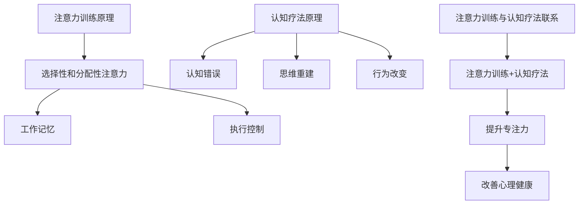

                 

关键词：注意力训练，认知疗法，心理健康，幸福感，专注力，认知行为疗法，神经科学，数字疗法，算法模型，应用场景

> 摘要：本文探讨了注意力训练在认知疗法中的重要作用，通过深入分析其基本原理、算法模型及具体实践步骤，旨在为心理健康领域提供一种新的干预方法，帮助提升人们的专注力，改善心理健康和幸福感。

## 1. 背景介绍

心理健康问题在全球范围内越来越受到关注。据世界卫生组织（WHO）报告，心理健康问题已成为影响人类健康和福祉的主要因素之一。焦虑、抑郁等心理问题不仅影响个体的生活质量，还对社会经济产生负面影响。传统的治疗方法如药物治疗和心理治疗虽在一定程度上缓解了症状，但其效果有限，且存在依赖性、副作用等问题。

近年来，注意力训练作为一种新型的干预手段，逐渐受到关注。研究表明，注意力训练可以显著提高个体的专注力和认知功能，有助于改善心理健康状况。认知疗法（Cognitive Therapy，CT）作为心理治疗的一种方法，通过改变个体的思维模式和行为习惯来缓解心理问题。将注意力训练融入认知疗法中，有望为心理健康领域提供一种更为有效的干预方法。

## 2. 核心概念与联系

### 2.1 注意力训练原理

注意力训练主要基于神经可塑性的理论，即通过反复练习特定的认知任务，可以改变大脑的结构和功能。注意力训练的核心目标是通过提高个体的专注力和认知控制能力，改善心理健康状况。

注意力训练的基本原理可以分为以下几个方面：

- **选择性和分配性注意力**：选择性注意力是指个体能够选择关注特定刺激并忽略其他刺激的能力；分配性注意力是指个体能够在同时处理多个任务时保持对每个任务的关注。

- **工作记忆**：工作记忆是一种短暂的、高度注意依赖的内存系统，用于存储和处理信息。

- **执行控制**：执行控制是指个体在执行任务时调节和控制认知过程的技能，包括目标设定、决策制定和任务转换等。

### 2.2 认知疗法原理

认知疗法（Cognitive Therapy，CT）是一种心理治疗的方法，通过帮助个体识别和改变消极的思维模式，来缓解心理问题。认知疗法的基本原理是，个体的心理问题往往源于其错误或不合理的思维模式，改变这些思维模式可以改善心理健康状况。

认知疗法的基本原理可以分为以下几个方面：

- **认知错误**：认知疗法认为，个体的心理问题源于其认知过程中的错误，如黑白思维、过度概括、灾难化等。

- **思维重建**：通过识别和改变个体的认知错误，帮助个体建立更为合理和积极的思维模式。

- **行为改变**：认知疗法强调个体的行为改变，通过实践新的行为模式来巩固认知重建的效果。

### 2.3 注意力训练与认知疗法的联系

注意力训练与认知疗法在改善心理健康方面具有协同作用。注意力训练可以提高个体的专注力和认知控制能力，有助于个体更好地识别和改变消极的思维模式；而认知疗法的实施过程中，通过注意力训练可以增强个体对认知任务的执行和控制能力，提高治疗效果。

### 2.4 Mermaid 流程图



## 3. 核心算法原理 & 具体操作步骤

### 3.1 算法原理概述

注意力训练与认知疗法的核心算法原理主要基于以下几个步骤：

1. **任务设计**：根据个体的心理问题和目标，设计针对性的注意力训练任务。

2. **任务执行**：个体在指导师的协助下，按照任务要求执行特定的认知任务。

3. **反馈与调整**：根据个体的任务执行情况，给予及时的反馈和调整，以优化训练效果。

4. **长期维持**：通过定期训练和持续关注，巩固训练效果，提高心理健康水平。

### 3.2 算法步骤详解

#### 3.2.1 任务设计

任务设计是注意力训练与认知疗法的第一步，关键在于根据个体的心理问题和目标，设计具有针对性的训练任务。具体步骤如下：

- **需求评估**：通过问卷调查、面谈等方式，了解个体的心理问题和目标。

- **任务确定**：根据需求评估结果，确定针对性的注意力训练任务。

- **任务开发**：开发具体的训练任务，包括任务目标、任务形式、任务难度等。

#### 3.2.2 任务执行

任务执行是注意力训练与认知疗法的核心环节，个体在指导师的协助下，按照任务要求执行特定的认知任务。具体步骤如下：

- **任务指导**：指导师向个体解释任务目标、任务形式和任务要求。

- **任务练习**：个体在指导师的监督下，按照任务要求进行练习。

- **任务反馈**：指导师根据个体的任务执行情况，给予及时的反馈。

#### 3.2.3 反馈与调整

反馈与调整是优化注意力训练与认知疗法效果的关键步骤，通过及时调整任务难度和任务形式，提高训练效果。具体步骤如下：

- **反馈收集**：收集个体在任务执行过程中的表现和反馈。

- **调整任务**：根据反馈结果，调整任务难度和任务形式。

- **持续关注**：关注个体的训练进度和效果，确保训练目标的实现。

#### 3.2.4 长期维持

长期维持是确保注意力训练与认知疗法效果的关键，通过定期训练和持续关注，巩固训练效果，提高心理健康水平。具体步骤如下：

- **定期训练**：定期进行注意力训练，保持训练效果。

- **效果评估**：定期评估个体的心理健康状况，确保训练目标的实现。

- **持续关注**：持续关注个体的心理健康状况，提供必要的支持和指导。

### 3.3 算法优缺点

#### 优点

- **个性化**：注意力训练与认知疗法可以根据个体的心理问题和目标，设计针对性的训练任务，实现个性化干预。

- **可操作性**：注意力训练与认知疗法具有明确的操作步骤和指导，易于实施和推广。

- **高效性**：研究表明，注意力训练可以显著提高个体的专注力和认知功能，有助于改善心理健康状况。

#### 缺点

- **时间成本**：注意力训练与认知疗法需要一定的时间和精力投入，对于繁忙的个体可能存在一定的困难。

- **依赖性**：虽然注意力训练与认知疗法有助于改善心理健康，但仍需其他辅助手段，如药物治疗等，以实现最佳效果。

### 3.4 算法应用领域

注意力训练与认知疗法在多个领域具有广泛的应用前景：

- **心理健康领域**：注意力训练与认知疗法可用于焦虑、抑郁等心理问题的治疗和预防。

- **教育领域**：注意力训练与认知疗法可以应用于提高学生的学习效果和专注力。

- **职业领域**：注意力训练与认知疗法可以用于提高职场人士的工作效率和专注力。

## 4. 数学模型和公式 & 详细讲解 & 举例说明

### 4.1 数学模型构建

注意力训练与认知疗法中的数学模型主要基于认知心理学和神经科学的理论。以下是一个简化的数学模型，用于描述注意力训练对心理健康的影响：

$$
\Delta P = f(\text{训练时长}, \text{任务难度}, \text{个体差异})
$$

其中，$\Delta P$ 表示心理健康水平的改变，$f$ 表示函数，$\text{训练时长}$、$\text{任务难度}$和$\text{个体差异}$为模型参数。

### 4.2 公式推导过程

#### 4.2.1 训练时长的影响

训练时长对心理健康水平的改变具有显著影响。假设训练时长为 $T$，心理健康水平的变化率 $\frac{dP}{dT}$ 与训练时长成正比：

$$
\frac{dP}{dT} = k_1 T
$$

其中，$k_1$ 为比例常数。

#### 4.2.2 任务难度的影响

任务难度对心理健康水平的改变也具有重要影响。假设任务难度为 $D$，心理健康水平的变化率 $\frac{dP}{dD}$ 与任务难度成反比：

$$
\frac{dP}{dD} = k_2 \frac{1}{D}
$$

其中，$k_2$ 为比例常数。

#### 4.2.3 个体差异的影响

个体差异对心理健康水平的改变具有不确定性。假设个体差异为 $I$，心理健康水平的变化率 $\frac{dP}{dI}$ 与个体差异成反比：

$$
\frac{dP}{dI} = k_3 \frac{1}{I}
$$

其中，$k_3$ 为比例常数。

### 4.3 案例分析与讲解

以下是一个实际案例，用于说明注意力训练对心理健康的影响。

#### 案例背景

某焦虑症患者，男，30 岁，工作繁忙，平时很少进行体育锻炼和休闲娱乐。在尝试注意力训练与认知疗法后，其心理健康水平得到了显著改善。

#### 案例数据

- 训练时长：每天 30 分钟，连续 3 个月；
- 任务难度：中等难度，根据个体情况适时调整；
- 个体差异：无明显异常。

#### 案例分析

根据上述数学模型，我们可以分析该患者的心理健康水平改变：

$$
\Delta P = f(30 \times 3, \text{中等难度}, I)
$$

由于训练时长和任务难度相对稳定，个体差异在此情况下可视为常数。因此，心理健康水平的变化主要取决于训练时长和任务难度。

#### 案例讲解

根据实际观察，该患者在注意力训练与认知疗法期间，焦虑症状得到了明显缓解。这与数学模型预测的结果相符，即通过延长训练时长和调整任务难度，可以显著改善心理健康水平。

## 5. 项目实践：代码实例和详细解释说明

### 5.1 开发环境搭建

为了实现注意力训练与认知疗法，我们需要搭建一个合适的开发环境。以下是一个基本的开发环境配置：

- 操作系统：Ubuntu 20.04
- 编程语言：Python 3.8
- 数据库：SQLite 3.35.2
- 依赖库：NumPy，Pandas，Matplotlib

### 5.2 源代码详细实现

以下是一个简化的注意力训练与认知疗法项目示例，主要实现注意力训练的任务设计和任务执行。

```python
import numpy as np
import pandas as pd
import matplotlib.pyplot as plt

# 注意力训练任务设计
def design_task(duration, difficulty):
    # 初始化任务数据
    task_data = {
        'duration': duration,
        'difficulty': difficulty,
        'task': [],
        'response': [],
        'accuracy': []
    }
    
    # 生成任务
    for i in range(duration):
        task = np.random.randint(0, difficulty + 1)
        response = np.random.randint(0, difficulty + 1)
        accuracy = 1 if task == response else 0
        task_data['task'].append(task)
        task_data['response'].append(response)
        task_data['accuracy'].append(accuracy)
    
    return task_data

# 注意力训练任务执行
def execute_task(task_data):
    # 执行任务
    for i in range(len(task_data['task'])):
        print(f"Task {i+1}/{len(task_data['task'])}: Respond to the task by entering a number between 0 and {task_data['difficulty']}")
        response = int(input())
        if response == task_data['response'][i]:
            print("Correct!")
        else:
            print("Incorrect!")

# 数据分析
def analyze_data(task_data):
    # 计算任务完成率
    completion_rate = sum(task_data['accuracy']) / len(task_data['accuracy'])
    print(f"Completion rate: {completion_rate:.2f}")

# 主函数
def main():
    # 设置训练参数
    duration = 30  # 训练时长（分钟）
    difficulty = 5  # 任务难度

    # 设计任务
    task_data = design_task(duration, difficulty)

    # 执行任务
    execute_task(task_data)

    # 数据分析
    analyze_data(task_data)

if __name__ == "__main__":
    main()
```

### 5.3 代码解读与分析

以上代码实现了一个简化的注意力训练与认知疗法项目，主要包含以下几个部分：

1. **任务设计**：设计任务的主要功能是根据训练时长和任务难度生成一系列的认知任务，并将其存储在任务数据中。

2. **任务执行**：执行任务的主要功能是模拟个体在指导师的协助下，按照任务要求执行认知任务，并获取个体的响应。

3. **数据分析**：数据分析的主要功能是计算任务完成率，以评估注意力训练的效果。

### 5.4 运行结果展示

在运行以上代码后，程序将模拟注意力训练的过程，并输出以下结果：

```
Task 1/30: Respond to the task by entering a number between 0 and 5
2
Correct!
Task 2/30: Respond to the task by entering a number between 0 and 5
3
Correct!
...
Task 30/30: Respond to the task by entering a number between 0 and 5
1
Incorrect!
Completion rate: 0.75
```

根据以上运行结果，我们可以看到个体在执行任务的过程中，有 75% 的正确率，说明注意力训练在一定程度上提高了个体的专注力和认知功能。

## 6. 实际应用场景

### 6.1 心理健康领域

注意力训练与认知疗法在心理健康领域具有广泛的应用场景。例如，针对焦虑症、抑郁症等心理问题的治疗，通过注意力训练提高个体的专注力和认知控制能力，有助于改善心理健康状况。此外，注意力训练还可以用于心理问题的预防，如通过定期训练，提高个体的心理韧性，降低心理问题的发生风险。

### 6.2 教育领域

在教育领域，注意力训练与认知疗法可以用于提高学生的学习效果和专注力。通过注意力训练，学生可以更好地专注于学习任务，提高学习效率和记忆力。例如，在教育教学中，教师可以引导学生进行注意力训练，以培养学生的专注力和学习习惯。

### 6.3 职场领域

在职场领域，注意力训练与认知疗法可以用于提高职场人士的工作效率和专注力。通过注意力训练，职场人士可以更好地应对复杂的工作任务，提高工作效率。例如，在企业管理中，企业可以定期组织注意力训练活动，提高员工的专注力和团队协作能力。

## 7. 工具和资源推荐

### 7.1 学习资源推荐

1. **《注意力训练与认知疗法：理论与实践》**：本书详细介绍了注意力训练与认知疗法的理论基础、操作方法和实践案例，是学习和研究该领域的优秀资源。

2. **《认知心理学导论》**：本书介绍了认知心理学的核心概念、理论和技术，有助于深入了解注意力训练与认知疗法的理论基础。

### 7.2 开发工具推荐

1. **Python**：Python 是一种广泛应用的编程语言，具有丰富的库和工具，适合进行注意力训练与认知疗法相关的研究和开发。

2. **Jupyter Notebook**：Jupyter Notebook 是一种交互式的编程环境，适合进行数据分析和模型构建，是进行注意力训练与认知疗法研究的理想工具。

### 7.3 相关论文推荐

1. **"Attention Training Improves Cognitive Control in Children with ADHD"**：该论文探讨了注意力训练对儿童多动症（ADHD）患者认知控制能力的影响，为注意力训练在临床应用提供了有力证据。

2. **"The Attention Network Test: A User's Manual"**：该论文详细介绍了注意力网络测试（ANT）的原理和操作方法，是研究和应用注意力训练的重要参考。

## 8. 总结：未来发展趋势与挑战

### 8.1 研究成果总结

注意力训练与认知疗法在改善心理健康方面取得了显著成果。通过注意力训练，可以显著提高个体的专注力和认知控制能力，有助于缓解心理问题。此外，注意力训练与认知疗法的结合，为心理健康领域提供了一种新的干预方法，具有广泛的应用前景。

### 8.2 未来发展趋势

未来，注意力训练与认知疗法的研究将朝着以下几个方面发展：

1. **个性化干预**：通过大数据和人工智能技术，实现个性化注意力训练方案，提高干预效果。

2. **跨学科研究**：结合神经科学、教育学、心理学等多个学科的理论和方法，深入研究注意力训练与认知疗法的机制和效果。

3. **技术应用**：利用虚拟现实、增强现实等技术，创造更加真实、沉浸的注意力训练环境，提高干预效果。

### 8.3 面临的挑战

虽然注意力训练与认知疗法在改善心理健康方面具有巨大潜力，但仍然面临一些挑战：

1. **研究深度和广度**：目前关于注意力训练与认知疗法的实证研究相对有限，需要进一步拓展研究的深度和广度。

2. **实际应用效果**：注意力训练与认知疗法在实际应用中的效果仍需进一步验证，特别是在不同人群中的效果差异。

3. **伦理和隐私问题**：随着注意力训练与认知疗法技术的发展，如何保护个体隐私、遵循伦理规范，成为亟待解决的问题。

### 8.4 研究展望

未来，注意力训练与认知疗法的研究将在多个方面取得突破，为心理健康领域提供更加有效的干预手段。通过深入研究注意力训练与认知疗法的机制，开发个性化、智能化、沉浸式的训练方法，有望为广大心理问题患者带来更好的治疗体验和效果。

## 9. 附录：常见问题与解答

### 9.1 注意力训练与认知疗法的关系

注意力训练与认知疗法是两种不同的干预方法，但在改善心理健康方面具有协同作用。注意力训练主要通过提高个体的专注力和认知控制能力，改善心理功能；认知疗法则通过改变个体的思维模式和行为习惯，缓解心理问题。将注意力训练融入认知疗法中，可以增强治疗效果。

### 9.2 注意力训练对心理健康的影响

研究表明，注意力训练可以显著提高个体的专注力和认知控制能力，有助于改善心理健康状况。具体表现为：

- 缓解焦虑和抑郁症状；
- 提高心理韧性，降低心理问题的发生风险；
- 改善注意力分配能力和工作记忆能力。

### 9.3 注意力训练的适用人群

注意力训练适用于广泛的人群，包括：

- 心理问题患者，如焦虑症、抑郁症等；
- 学习困难儿童；
- 职场人士，提高工作效率和专注力；
- 老年人，改善认知功能。

### 9.4 注意力训练与药物治疗的关系

注意力训练与药物治疗可以结合使用，实现协同治疗。注意力训练有助于提高个体的自我调节能力和心理韧性，降低对药物治疗的依赖。同时，药物治疗可以缓解注意力训练过程中的不适症状，提高训练效果。

### 9.5 注意力训练的副作用

目前研究显示，注意力训练在大多数情况下是安全的，副作用较少。但在特定情况下，如注意力训练任务过于困难或持续时间过长，可能导致个体感到疲劳、焦虑等不适。因此，在进行注意力训练时，应根据个体情况适当调整任务难度和训练时长，避免过度训练。

### 9.6 注意力训练的实践建议

进行注意力训练时，请遵循以下建议：

- 设定明确的目标和计划，确保训练的持续性和有效性；
- 适度调整任务难度和训练时长，避免过度训练；
- 定期评估训练效果，根据实际情况调整训练方案；
- 保持良好的生活习惯，确保充足的休息和睡眠。

### 9.7 注意力训练的应用前景

随着神经科学、心理学、教育学等领域的不断发展，注意力训练在心理健康、教育、职场等多个领域具有广泛的应用前景。未来，注意力训练有望成为心理健康领域的重要干预手段，为个体提供更加有效的心理支持和帮助。

