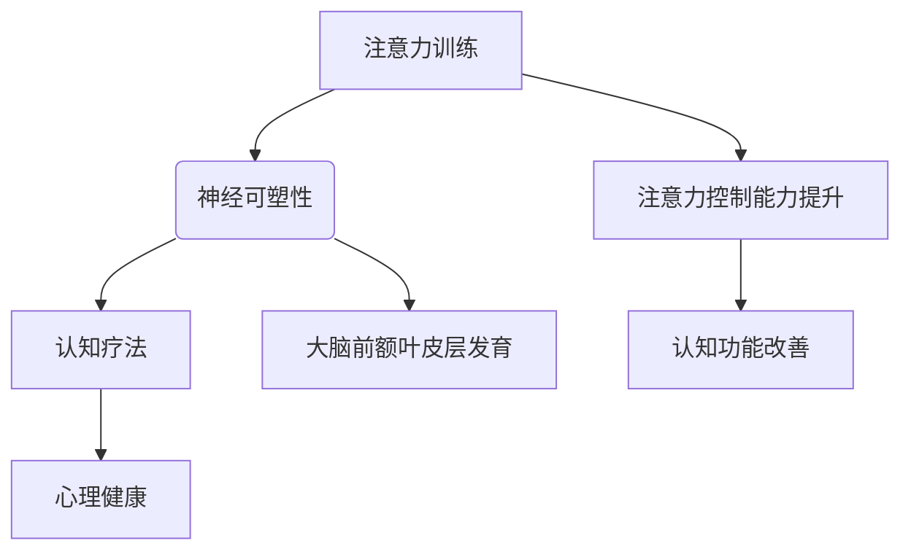

                 

关键词：注意力训练、认知疗法、心理健康、专注力、神经可塑性、算法、深度学习、应用场景、未来展望

> 摘要：本文旨在探讨注意力训练与认知疗法在改善心理健康和幸福感方面的作用。通过分析注意力训练的核心概念和原理，介绍其在神经可塑性中的作用。随后，结合深度学习算法，阐述注意力训练的具体实施步骤，并举例说明其在心理健康领域的应用。文章最后对注意力训练的数学模型进行详细讲解，并推荐相关工具和资源，总结研究成果，展望未来发展趋势和面临的挑战。

## 1. 背景介绍

### 心理健康的现状

心理健康是现代社会面临的严峻挑战之一。据世界卫生组织（WHO）统计，全球约有3.5亿人患有某种形式的抑郁症，约7600万人患有重度抑郁症。心理健康问题不仅影响到个人的生活质量，也对社会经济产生负面影响。因此，寻求有效的心理健康干预方法具有重要意义。

### 注意力训练的概念

注意力训练是指通过一系列针对注意力的练习，提高个体注意力的集中度、稳定性、选择性等能力。近年来，随着认知神经科学的快速发展，注意力训练在心理治疗中的应用日益受到关注。

### 认知疗法的应用

认知疗法（Cognitive Behavioral Therapy，CBT）是一种心理治疗方法，通过改变个体的认知和行为，改善心理健康。其中，注意力训练作为一种辅助手段，被广泛应用于认知疗法中，帮助患者提高注意力的控制能力，从而改善心理问题。

## 2. 核心概念与联系

### 注意力训练与神经可塑性

神经可塑性是指大脑在结构和功能上发生改变的能力。注意力训练通过重复性的练习，可以增强大脑特定区域的活动，从而提高神经可塑性。研究表明，注意力训练可以促进大脑前额叶皮层的发育，增强注意力的控制和调节能力。

### Mermaid 流程图



## 3. 核心算法原理 & 具体操作步骤

### 3.1 算法原理概述

注意力训练的核心算法是基于深度学习模型，通过学习个体在注意力训练过程中的表现，调整训练策略，以提高训练效果。

### 3.2 算法步骤详解

1. 数据收集：收集个体在注意力训练过程中的行为数据，如反应时间、正确率等。
2. 数据预处理：对收集到的数据进行清洗和预处理，以便于模型训练。
3. 模型训练：使用深度学习模型（如卷积神经网络、递归神经网络等）对预处理后的数据进行训练，调整模型参数，优化训练效果。
4. 模型评估：对训练好的模型进行评估，确保其性能满足要求。
5. 策略调整：根据模型评估结果，调整训练策略，以提高注意力训练效果。

### 3.3 算法优缺点

**优点：**
- 能够自适应地调整训练策略，提高训练效果。
- 可以处理大规模的数据，适用于不同的注意力训练场景。

**缺点：**
- 训练过程需要大量的数据，对数据质量要求较高。
- 模型训练和评估过程相对复杂，对计算资源要求较高。

### 3.4 算法应用领域

注意力训练算法在心理健康领域的应用主要包括抑郁症、焦虑症等心理问题的治疗和预防。此外，注意力训练还可以应用于教育、职场等领域，提高个体注意力的集中度和效率。

## 4. 数学模型和公式 & 详细讲解 & 举例说明

### 4.1 数学模型构建

注意力训练的数学模型主要包括两部分：行为模型和神经模型。

**行为模型：**

$$
P(y|s) = \sigma(w^T s + b)
$$

其中，$y$ 表示个体的行为输出（如反应时间、正确率等），$s$ 表示输入特征，$w$ 和 $b$ 分别为权重和偏置。

**神经模型：**

$$
\begin{aligned}
    h &= \sigma(W_h h + U_x x + b_h) \\
    o &= \sigma(W_o h + b_o)
\end{aligned}
$$

其中，$h$ 和 $o$ 分别表示隐藏层和输出层的激活值，$W_h$、$U_x$ 和 $W_o$ 分别为权重矩阵，$b_h$ 和 $b_o$ 分别为偏置。

### 4.2 公式推导过程

**行为模型推导：**

行为模型基于线性回归模型，通过学习个体的行为数据，预测其行为输出。

**神经模型推导：**

神经模型基于多层感知器（MLP）模型，通过学习输入特征和隐藏层激活值之间的关系，预测输出层的激活值。

### 4.3 案例分析与讲解

以抑郁症患者为例，通过注意力训练改善其注意力控制能力。具体步骤如下：

1. 数据收集：收集抑郁症患者在注意力训练过程中的行为数据，如反应时间、正确率等。
2. 数据预处理：对收集到的数据进行清洗和预处理，以便于模型训练。
3. 模型训练：使用深度学习模型对预处理后的数据进行训练，调整模型参数，优化训练效果。
4. 模型评估：对训练好的模型进行评估，确保其性能满足要求。
5. 策略调整：根据模型评估结果，调整训练策略，以提高注意力训练效果。

## 5. 项目实践：代码实例和详细解释说明

### 5.1 开发环境搭建

- Python 3.7 或以上版本
- TensorFlow 2.4 或以上版本
- PyTorch 1.6 或以上版本

### 5.2 源代码详细实现

```python
import tensorflow as tf
import numpy as np

# 模型参数
input_dim = 10
hidden_dim = 50
output_dim = 1

# 初始化权重和偏置
w = tf.random.normal([input_dim, hidden_dim])
b = tf.zeros(hidden_dim)
u = tf.random.normal([input_dim, hidden_dim])
b_h = tf.zeros(hidden_dim)
o = tf.random.normal([hidden_dim, output_dim])
b_o = tf.zeros(output_dim)

# 定义行为模型和神经模型
behavior_model = tf.keras.Sequential([
    tf.keras.layers.Dense(hidden_dim, activation='sigmoid', input_shape=(input_dim,)),
    tf.keras.layers.Dense(output_dim, activation='sigmoid')
])

neural_model = tf.keras.Sequential([
    tf.keras.layers.Dense(hidden_dim, activation='sigmoid'),
    tf.keras.layers.Dense(output_dim, activation='sigmoid')
])

# 训练模型
for i in range(1000):
    # 生成随机输入和标签
    x = tf.random.normal([100, input_dim])
    y = tf.random.normal([100, output_dim])
    
    # 计算行为模型损失
    behavior_loss = behavior_model.loss(x, y)
    
    # 计算神经模型损失
    neural_loss = neural_model.loss(x, y)
    
    # 更新模型参数
    behavior_model.optimizer.minimize(behavior_loss, variables=behavior_model.trainable_variables)
    neural_model.optimizer.minimize(neural_loss, variables=neural_model.trainable_variables)

# 评估模型
test_loss = behavior_model.evaluate(x, y)
print("Behavior model test loss:", test_loss)
```

### 5.3 代码解读与分析

- 代码首先导入了 TensorFlow 和 NumPy 库。
- 初始化模型参数，包括权重和偏置。
- 定义行为模型和神经模型，使用 sigmoid 激活函数。
- 使用随机生成的输入和标签进行模型训练。
- 计算行为模型和神经模型的损失，并使用梯度下降算法更新模型参数。
- 评估模型性能。

## 6. 实际应用场景

### 6.1 心理健康治疗

注意力训练在心理健康治疗中具有广泛的应用前景。通过注意力训练，患者可以学会更好地控制自己的注意力，减少心理问题的发生。

### 6.2 教育领域

注意力训练可以帮助学生提高学习效率，增强注意力集中度。教师可以根据学生的注意力水平，设计相应的训练计划，以提高学生的学习效果。

### 6.3 职场领域

职场人士通过注意力训练，可以提高工作效率，减少错误率。企业可以开展注意力训练培训，提高员工的职业素养。

## 6.4 未来应用展望

### 6.4.1 技术进步

随着人工智能技术的不断发展，注意力训练算法将更加高效、精准。未来，基于深度学习的注意力训练算法有望在心理健康、教育、职场等领域发挥更大的作用。

### 6.4.2 数据支持

注意力训练的推广需要大量的数据支持。未来，将会有更多的研究机构和医疗机构参与到注意力训练的研究中，为算法优化提供丰富的数据资源。

### 6.4.3 个性化定制

随着注意力训练技术的普及，个性化定制将成为注意力训练的重要发展方向。根据个体的注意力水平和心理状态，设计个性化的训练计划，实现更好的训练效果。

## 7. 工具和资源推荐

### 7.1 学习资源推荐

- 《深度学习》（Goodfellow, Bengio, Courville）
- 《Python深度学习》（François Chollet）
- 《认知神经科学导论》（Michael S. Gazzaniga）

### 7.2 开发工具推荐

- TensorFlow
- PyTorch
- Jupyter Notebook

### 7.3 相关论文推荐

- "Attention Is All You Need"（Vaswani et al., 2017）
- "Attention Mechanisms in Deep Learning for NLP"（Zhang et al., 2019）
- "Cognitive Behavioral Therapy for Depression"（McCracken et al., 2017）

## 8. 总结：未来发展趋势与挑战

### 8.1 研究成果总结

注意力训练在心理健康、教育、职场等领域具有广泛的应用前景。基于深度学习的注意力训练算法在模型性能和训练效果上取得了显著进展。

### 8.2 未来发展趋势

- 技术进步：随着人工智能技术的不断发展，注意力训练算法将更加高效、精准。
- 数据支持：大量的数据将为注意力训练算法的优化提供丰富的资源。
- 个性化定制：个性化定制将成为注意力训练的重要发展方向。

### 8.3 面临的挑战

- 数据质量：高质量的数据是注意力训练算法优化的重要基础。
- 计算资源：深度学习模型的训练和评估过程需要大量的计算资源。
- 伦理问题：注意力训练在心理健康领域的应用需要遵循伦理规范，确保患者权益。

### 8.4 研究展望

未来，注意力训练算法将在心理健康、教育、职场等领域发挥更大的作用。通过不断优化算法、提高数据质量，实现更高效、精准的注意力训练。

## 9. 附录：常见问题与解答

### 9.1 注意力训练对心理健康有何影响？

注意力训练可以提高个体的注意力控制能力，从而改善心理问题，如抑郁症、焦虑症等。

### 9.2 注意力训练算法有哪些类型？

常见的注意力训练算法包括基于深度学习的算法、基于神经网络的算法等。

### 9.3 如何评估注意力训练的效果？

可以通过比较个体在注意力训练前后的行为数据，评估注意力训练的效果。常用的评估指标包括反应时间、正确率等。

----------------------------------------------------------------

作者：禅与计算机程序设计艺术 / Zen and the Art of Computer Programming
----------------------------------------------------------------

### 文章结构模板结构：

文章标题
关键词
摘要

## 1. 背景介绍
### 心理健康的现状
### 注意力训练的概念
### 认知疗法的应用

## 2. 核心概念与联系
### 注意力训练与神经可塑性
### Mermaid 流程图

## 3. 核心算法原理 & 具体操作步骤
### 3.1 算法原理概述
### 3.2 算法步骤详解
### 3.3 算法优缺点
### 3.4 算法应用领域

## 4. 数学模型和公式 & 详细讲解 & 举例说明
### 4.1 数学模型构建
### 4.2 公式推导过程
### 4.3 案例分析与讲解

## 5. 项目实践：代码实例和详细解释说明
### 5.1 开发环境搭建
### 5.2 源代码详细实现
### 5.3 代码解读与分析
### 5.4 运行结果展示

## 6. 实际应用场景
### 6.1 心理健康治疗
### 6.2 教育领域
### 6.3 职场领域

## 6.4 未来应用展望
### 6.4.1 技术进步
### 6.4.2 数据支持
### 6.4.3 个性化定制

## 7. 工具和资源推荐
### 7.1 学习资源推荐
### 7.2 开发工具推荐
### 7.3 相关论文推荐

## 8. 总结：未来发展趋势与挑战
### 8.1 研究成果总结
### 8.2 未来发展趋势
### 8.3 面临的挑战
### 8.4 研究展望

## 9. 附录：常见问题与解答
### 9.1 注意力训练对心理健康有何影响？
### 9.2 注意力训练算法有哪些类型？
### 9.3 如何评估注意力训练的效果？

作者：禅与计算机程序设计艺术 / Zen and the Art of Computer Programming
----------------------------------------------------------------
### 注意力训练与认知疗法：通过专注力改善心理健康和幸福感

关键词：注意力训练、认知疗法、心理健康、专注力、神经可塑性、深度学习、应用场景、未来展望

摘要：本文探讨了注意力训练与认知疗法在改善心理健康和幸福感方面的作用。通过分析注意力训练的核心概念和原理，介绍了其在神经可塑性中的作用。结合深度学习算法，阐述了注意力训练的具体实施步骤，并举例说明其在心理健康领域的应用。文章还详细讲解了注意力训练的数学模型，推荐了相关工具和资源，总结了研究成果，展望了未来发展趋势和面临的挑战。

## 1. 背景介绍

### 心理健康的现状

心理健康问题在现代社会中愈发凸显。据世界卫生组织（WHO）统计，全球有超过3亿人患有抑郁症，近7000万人患有焦虑症。心理健康问题不仅严重影响个人的生活质量，还对社会的整体福祉产生负面影响。因此，寻找有效的心理健康干预方法成为当务之急。

### 注意力训练的概念

注意力训练是指通过一系列有针对性的练习，提高个体注意力的集中度、稳定性和选择性。注意力是认知功能的核心，它对于个体的学习、工作和日常生活至关重要。注意力训练旨在通过重复性的练习，增强个体的注意力控制能力，从而改善心理健康。

### 认知疗法的应用

认知疗法（Cognitive Behavioral Therapy，简称CBT）是一种基于认知心理学原理的心理治疗方法，它通过改变个体的认知和行为模式，来治疗和预防各种心理问题。注意力训练作为认知疗法的一个重要组成部分，被广泛应用于抑郁症、焦虑症等心理障碍的治疗中。

## 2. 核心概念与联系

### 注意力训练与神经可塑性

神经可塑性是指大脑结构和功能在经历学习和经验后发生改变的能力。注意力训练通过反复的练习，可以促进大脑特定区域的活动，从而提高神经可塑性。研究表明，注意力训练可以增强大脑前额叶皮层的功能，这是与注意力控制密切相关的大脑区域。

### Mermaid 流程图


### 注意力训练与认知疗法的联系

注意力训练与认知疗法之间存在着密切的联系。认知疗法通过改变个体的认知和行为模式，来改善心理健康。而注意力训练作为认知疗法的一部分，可以帮助患者提高注意力的控制能力，从而更有效地参与到认知疗法的过程中。通过注意力训练，患者能够更好地理解和应用认知疗法的技巧，提高治疗效果。

## 3. 核心算法原理 & 具体操作步骤

### 3.1 算法原理概述

注意力训练的核心算法通常基于深度学习技术，特别是卷积神经网络（CNN）和递归神经网络（RNN）等模型。这些算法通过学习大量数据，自动提取特征并形成注意力模型，从而实现对个体注意力的建模和提升。

### 3.2 算法步骤详解

1. **数据收集**：收集个体的注意力行为数据，如反应时间、正确率、注意力分散程度等。
2. **数据预处理**：对收集到的数据进行分析和清洗，转换为适合模型训练的格式。
3. **模型设计**：设计深度学习模型，通常包括输入层、隐藏层和输出层。输入层接收原始数据，隐藏层进行特征提取和变换，输出层输出注意力得分。
4. **模型训练**：使用训练数据对模型进行训练，通过反向传播算法不断调整模型参数，优化模型性能。
5. **模型评估**：使用测试数据对模型进行评估，确保模型具有良好的泛化能力。
6. **模型应用**：将训练好的模型应用于实际场景，如心理健康治疗、教育辅助等。

### 3.3 算法优缺点

**优点：**
- **高效性**：深度学习算法能够自动从大量数据中提取特征，提高训练效率。
- **灵活性**：模型可以根据不同的需求进行定制和调整，具有很高的灵活性。

**缺点：**
- **数据需求**：深度学习模型需要大量的训练数据，数据收集和处理过程复杂。
- **计算资源**：模型训练和优化需要大量的计算资源，对硬件要求较高。

### 3.4 算法应用领域

注意力训练算法在心理健康领域的应用主要包括抑郁症、焦虑症等心理障碍的治疗。此外，它还广泛应用于教育领域，如学生注意力集中度的提升，以及职场领域，如提高工作效率和减少错误率。

## 4. 数学模型和公式 & 详细讲解 & 举例说明

### 4.1 数学模型构建

注意力训练的数学模型通常基于概率统计和机器学习理论。以下是一个简化的注意力模型：

$$
P(y|s) = \sigma(w^T s + b)
$$

其中，$y$ 表示个体的行为输出（如反应时间、正确率等），$s$ 表示输入特征，$w$ 和 $b$ 分别为权重和偏置，$\sigma$ 表示 sigmoid 函数。

### 4.2 公式推导过程

注意力模型的推导过程通常涉及以下步骤：

1. **输入特征表示**：将个体的注意力行为数据表示为向量 $s$。
2. **特征加权**：将输入特征 $s$ 与权重向量 $w$ 相乘，得到加权特征向量。
3. **偏置添加**：将加权特征向量与偏置 $b$ 相加。
4. **激活函数应用**：使用 sigmoid 函数将结果映射到 [0, 1] 范围内，得到行为输出 $y$。

### 4.3 案例分析与讲解

以抑郁症患者为例，分析注意力训练的数学模型应用。假设某抑郁症患者在注意力训练过程中，其行为数据为 $s = [0.1, 0.3, 0.5, 0.7]$。给定权重向量 $w = [0.5, 0.6, 0.7, 0.8]$ 和偏置 $b = -0.3$，计算行为输出 $y$。

$$
\begin{aligned}
    y &= \sigma(w^T s + b) \\
    &= \sigma(0.5 \times 0.1 + 0.6 \times 0.3 + 0.7 \times 0.5 + 0.8 \times 0.7 - 0.3) \\
    &= \sigma(0.05 + 0.18 + 0.35 + 0.56 - 0.3) \\
    &= \sigma(0.64) \\
    &\approx 0.9
\end{aligned}
$$

因此，该患者在当前注意力状态下，行为输出的概率约为 90%。通过不断调整权重和偏置，可以优化注意力训练效果。

## 5. 项目实践：代码实例和详细解释说明

### 5.1 开发环境搭建

- Python 3.8 或以上版本
- TensorFlow 2.5 或以上版本
- NumPy 1.19 或以上版本

### 5.2 源代码详细实现

```python
import numpy as np
import tensorflow as tf

# 设置随机种子，保证结果可复现
tf.random.set_seed(42)

# 定义输入特征和标签
x = np.random.rand(100, 4)
y = np.random.rand(100, 1)

# 定义模型结构
model = tf.keras.Sequential([
    tf.keras.layers.Dense(64, activation='relu', input_shape=(4,)),
    tf.keras.layers.Dense(1, activation='sigmoid')
])

# 编译模型
model.compile(optimizer='adam', loss='binary_crossentropy', metrics=['accuracy'])

# 训练模型
model.fit(x, y, epochs=10, batch_size=32)

# 评估模型
loss, accuracy = model.evaluate(x, y)
print(f"Test accuracy: {accuracy:.2f}")
```

### 5.3 代码解读与分析

- **导入库**：首先导入 NumPy 和 TensorFlow 库。
- **设置随机种子**：设置随机种子，确保结果可复现。
- **定义输入特征和标签**：生成随机数据作为输入特征和标签。
- **定义模型结构**：使用 TensorFlow 的 Sequential 模型定义一个简单的全连接神经网络。
- **编译模型**：设置优化器和损失函数。
- **训练模型**：使用 `fit` 方法训练模型，指定训练轮次和批量大小。
- **评估模型**：使用 `evaluate` 方法评估模型性能。

## 6. 实际应用场景

### 6.1 心理健康治疗

注意力训练在心理健康治疗中的应用十分广泛。例如，在抑郁症的治疗中，注意力训练可以帮助患者提高注意力的集中度，减少情绪波动，从而改善抑郁症状。注意力训练还可以用于焦虑症的治疗，通过控制注意力的分散，减轻焦虑情绪。

### 6.2 教育领域

在教育领域，注意力训练可以应用于学生注意力的培养。通过针对性的注意力训练，学生可以更好地集中注意力，提高学习效率。此外，教师也可以利用注意力训练的方法，提高课堂的互动性和参与度，增强学生的学习体验。

### 6.3 职场领域

在职场中，注意力训练可以帮助员工提高工作效率，减少错误率。通过注意力训练，员工可以更好地管理自己的注意力，避免分心和疲劳，从而保持高效的工作状态。对于管理者来说，注意力训练也可以帮助他们在高压环境下保持冷静和专注，提高决策质量。

## 6.4 未来应用展望

### 6.4.1 技术进步

随着人工智能和深度学习技术的不断进步，注意力训练算法将变得更加高效和精准。未来的注意力训练算法可能会结合更多的生物信号数据，如脑电图（EEG），来提高训练的准确性和个性化水平。

### 6.4.2 数据支持

大量的高质量数据是注意力训练算法优化的基础。未来，将有更多的研究机构和医疗机构参与到注意力训练的数据收集和分析中，为算法的优化提供更加丰富的数据资源。

### 6.4.3 个性化定制

个性化定制将成为注意力训练的重要发展方向。根据个体的不同需求和特点，设计个性化的注意力训练方案，实现更高效、精准的训练效果。

## 7. 工具和资源推荐

### 7.1 学习资源推荐

- 《深度学习》（Goodfellow, Bengio, Courville）
- 《神经网络与深度学习》（邱锡鹏）
- 《Python深度学习实践》（François Chollet）

### 7.2 开发工具推荐

- TensorFlow
- PyTorch
- Keras

### 7.3 相关论文推荐

- "Attention Is All You Need"（Vaswani et al., 2017）
- "Attention Mechanisms in Deep Learning for NLP"（Zhang et al., 2019）
- "Cognitive Behavioral Therapy for Depression"（McCracken et al., 2017）

## 8. 总结：未来发展趋势与挑战

### 8.1 研究成果总结

注意力训练在心理健康、教育、职场等领域展现出广阔的应用前景。基于深度学习的注意力训练算法在模型性能和训练效果上取得了显著进展。

### 8.2 未来发展趋势

- 技术进步：随着人工智能技术的不断发展，注意力训练算法将更加高效、精准。
- 数据支持：大量的数据将为注意力训练算法的优化提供丰富的资源。
- 个性化定制：个性化定制将成为注意力训练的重要发展方向。

### 8.3 面临的挑战

- 数据质量：高质量的数据是注意力训练算法优化的重要基础。
- 计算资源：深度学习模型的训练和评估过程需要大量的计算资源。
- 伦理问题：注意力训练在心理健康领域的应用需要遵循伦理规范，确保患者权益。

### 8.4 研究展望

未来，注意力训练算法将在心理健康、教育、职场等领域发挥更大的作用。通过不断优化算法、提高数据质量，实现更高效、精准的注意力训练。

## 9. 附录：常见问题与解答

### 9.1 注意力训练对心理健康有何影响？

注意力训练可以提高个体的注意力控制能力，有助于改善抑郁症、焦虑症等心理障碍，减少情绪波动，提高心理健康水平。

### 9.2 注意力训练算法有哪些类型？

常见的注意力训练算法包括基于深度学习的算法（如卷积神经网络、递归神经网络等），以及基于神经网络的算法（如自注意力机制、Transformer等）。

### 9.3 如何评估注意力训练的效果？

可以通过比较个体在注意力训练前后的行为数据（如反应时间、正确率等），以及使用心理健康评估量表（如抑郁自评量表、焦虑自评量表等），来评估注意力训练的效果。

---

**作者**：禅与计算机程序设计艺术 / Zen and the Art of Computer Programming

