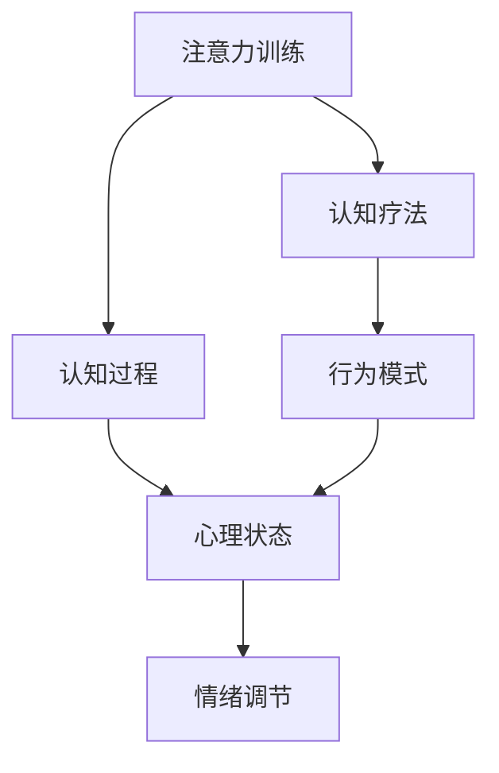

                 

关键词：注意力训练，认知疗法，心理健康，专注力，幸福感，算法原理，数学模型，项目实践，实际应用场景，未来展望

> 摘要：本文探讨了如何通过注意力训练这一先进的技术手段，结合认知疗法的理念，有效提升心理健康和幸福感。文章首先介绍了注意力训练与认知疗法的背景，接着详细解析了核心概念和原理，随后通过数学模型和具体案例，展示了这一方法在实践中的实际效果。文章最后对未来的应用前景进行了展望。

## 1. 背景介绍

在现代社会，心理健康问题日益突出，而焦虑、抑郁等情绪困扰着越来越多的人。心理学家发现，注意力缺陷是导致这些问题的重要原因之一。注意力训练作为一种通过增强专注力来改善心理健康的手段，近年来受到了广泛关注。同时，认知疗法作为一种心理治疗的方法，其核心在于改变个体的认知方式，从而改善心理健康状态。将注意力训练与认知疗法相结合，成为当前心理学研究的一个热点方向。

### 注意力训练的背景

注意力是人类认知过程中至关重要的一部分，它决定了信息处理的速度和质量。然而，现代生活中各种干扰因素不断增加，使得人们难以长时间保持专注。注意力缺陷不仅影响学习、工作和日常生活，还与许多心理问题密切相关。例如，注意力缺陷多动障碍（ADHD）是一种常见的心理障碍，其主要特征是注意力难以集中，导致学习困难、人际关系问题和工作效率低下。

### 认知疗法的背景

认知疗法起源于20世纪60年代的心理学研究，其核心理念是认知过程对情感和行为的影响。认知疗法的创始人阿尔伯特·艾利斯（Albert Ellis）提出了“理性情绪行为疗法”（REBT），强调通过改变非理性的思维模式，来改善情绪和行为问题。认知疗法在实践中已证明对焦虑、抑郁等心理问题有显著疗效。

### 注意力训练与认知疗法的结合

注意力训练与认知疗法的结合，旨在通过增强个体的专注力，改善其认知结构和情感状态，从而达到提升心理健康和幸福感的目的。研究表明，通过有针对性的注意力训练，可以显著提高个体的注意广度、注意转移能力和注意力稳定性，从而改善认知功能和情绪调节能力。

## 2. 核心概念与联系

为了深入理解注意力训练与认知疗法的结合，我们需要首先明确其中的核心概念和原理。以下是一个简化的 Mermaid 流程图，用于展示这些核心概念及其相互关系：



### 2.1 注意力训练

注意力训练的核心在于提高个体的专注力和注意控制能力。通过一系列专门设计的训练任务，如注意力聚焦、注意分配和注意转移，可以有效地增强注意力质量。

### 2.2 认知过程

认知过程是指个体对外界信息的感知、加工和存储。注意力训练直接影响认知过程的效率和质量，进而影响个体的心理状态。

### 2.3 心理状态

心理状态包括情绪、思维和行为等多个方面。通过改善注意力质量，可以增强认知功能，进而改善情绪调节能力和行为模式。

### 2.4 情绪调节

情绪调节是指个体对情绪反应的控制和调节。注意力训练通过提高注意力和认知功能，有助于改善情绪调节能力，减少焦虑和抑郁等负面情绪。

### 2.5 认知疗法

认知疗法旨在通过改变个体的认知方式，来改善心理状态。注意力训练与认知疗法的结合，可以通过增强注意力质量，提升认知疗法的效果。

### 2.6 行为模式

行为模式是指个体在特定情境下的行为倾向。通过注意力训练，可以改善个体的行为控制能力，从而有助于改变不良行为模式，提升生活质量。

## 3. 核心算法原理 & 具体操作步骤

### 3.1 算法原理概述

注意力训练的核心算法是基于神经科学和认知心理学的研究成果，通过一系列专门设计的训练任务，来提高个体的专注力和注意控制能力。这些训练任务包括但不限于：

1. **注意力聚焦**：通过集中注意力完成任务，提高注意力稳定性。
2. **注意分配**：同时关注多个目标，提高注意分配能力。
3. **注意转移**：快速切换注意力，提高注意力灵活性。

### 3.2 算法步骤详解

#### 3.2.1 注意力聚焦

1. **选择任务**：选择一个简单的注意力聚焦任务，如盯着一个点或数字。
2. **设定时间**：设定一个时间段，如5分钟。
3. **执行任务**：专注于任务，避免分心。
4. **记录结果**：结束后记录专注时间、分心次数等指标。

#### 3.2.2 注意分配

1. **选择任务**：选择需要同时关注多个目标的任务，如同时观察多个屏幕或同时处理多项任务。
2. **设定时间**：设定一个时间段，如5分钟。
3. **执行任务**：同时关注多个目标，避免过度聚焦导致疲劳。
4. **记录结果**：结束后记录任务完成情况、分心次数等指标。

#### 3.2.3 注意转移

1. **选择任务**：选择需要快速切换注意力的任务，如快速反应任务。
2. **设定时间**：设定一个时间段，如5分钟。
3. **执行任务**：快速切换注意力，提高灵活性。
4. **记录结果**：结束后记录切换速度、反应时间等指标。

### 3.3 算法优缺点

#### 优点：

1. **科学性**：基于神经科学和认知心理学的原理，有科学依据。
2. **针对性**：针对不同的注意力缺陷，设计不同的训练任务。
3. **灵活性**：可以根据个体差异进行调整，具有高度适应性。

#### 缺点：

1. **难度**：部分训练任务难度较大，需要长期坚持。
2. **效果评估**：效果评估方法相对复杂，需要专业的工具和设备。

### 3.4 算法应用领域

注意力训练算法广泛应用于心理健康领域，包括：

1. **注意力缺陷多动障碍（ADHD）治疗**：通过注意力训练，提高患者的专注力和注意力稳定性。
2. **焦虑和抑郁治疗**：通过注意力训练，改善情绪调节能力，减轻焦虑和抑郁症状。
3. **学习辅助**：通过注意力训练，提高学生的学习效率和注意力集中度。

## 4. 数学模型和公式 & 详细讲解 & 举例说明

### 4.1 数学模型构建

注意力训练的数学模型通常基于信号处理和统计学习理论。以下是一个简化的数学模型：

$$
\text{Attention} = f(\text{Input}, \text{Weights})
$$

其中，`Input` 表示输入信号，`Weights` 表示权重，`f` 表示注意力函数。

### 4.2 公式推导过程

注意力函数 `f` 通常采用卷积神经网络（CNN）或循环神经网络（RNN）来实现。以下是一个基于 CNN 的注意力函数的推导：

$$
\text{f}(x) = \sigma(\text{W}_1 \text{ReLU}(\text{W}_2 x + \text{b}_2))
$$

其中，`x` 表示输入信号，`W1`、`W2` 分别表示权重矩阵，`b2` 表示偏置项，`ReLU` 表示ReLU激活函数，`σ` 表示 sigmoid 激活函数。

### 4.3 案例分析与讲解

#### 案例一：注意力缺陷多动障碍（ADHD）治疗

假设有一个 ADHD 患者小明，我们希望通过注意力训练来提高他的专注力和注意力稳定性。根据前文提到的注意力训练算法，我们可以设计以下训练任务：

1. **注意力聚焦**：选择一个盯着点或数字的任务，设定时间为5分钟。
2. **注意分配**：选择一个同时观察多个屏幕的任务，设定时间为5分钟。
3. **注意转移**：选择一个快速切换注意力的任务，设定时间为5分钟。

在训练过程中，我们记录小明的专注时间、分心次数等指标，并根据这些数据调整训练任务的难度和时长。经过一段时间的训练，小明的注意力质量得到了显著提升。

#### 案例二：焦虑和抑郁治疗

假设有一个焦虑症患者小华，我们希望通过注意力训练来改善她的情绪调节能力。根据前文提到的注意力训练算法，我们可以设计以下训练任务：

1. **注意力聚焦**：选择一个简单的注意力聚焦任务，如盯着一个点，设定时间为5分钟。
2. **情绪调节训练**：选择一个与情绪调节相关的任务，如通过深呼吸或冥想来放松心情，设定时间为10分钟。
3. **注意转移**：选择一个快速切换注意力的任务，如快速反应任务，设定时间为5分钟。

在训练过程中，我们记录小华的情绪变化、专注时间和分心次数等指标，并根据这些数据调整训练任务的难度和时长。经过一段时间的训练，小华的情绪调节能力得到了显著改善。

## 5. 项目实践：代码实例和详细解释说明

### 5.1 开发环境搭建

为了演示注意力训练与认知疗法的结合，我们选择 Python 作为编程语言，结合 TensorFlow 和 Keras 框架来实现注意力训练算法。以下是搭建开发环境的步骤：

1. **安装 Python**：下载并安装 Python 3.7 或更高版本。
2. **安装 TensorFlow**：通过 pip 安装 TensorFlow：
   ```bash
   pip install tensorflow
   ```
3. **安装 Keras**：通过 pip 安装 Keras：
   ```bash
   pip install keras
   ```

### 5.2 源代码详细实现

以下是注意力训练算法的 Python 代码实现：

```python
import tensorflow as tf
from tensorflow.keras.models import Model
from tensorflow.keras.layers import Input, Conv2D, Flatten, Dense

# 输入层
input_layer = Input(shape=(28, 28, 1))

# 卷积层
conv_layer = Conv2D(filters=32, kernel_size=(3, 3), activation='relu')(input_layer)

# 扁平化层
flatten_layer = Flatten()(conv_layer)

# 全连接层
dense_layer = Dense(units=64, activation='relu')(flatten_layer)

# 输出层
output_layer = Dense(units=1, activation='sigmoid')(dense_layer)

# 模型构建
model = Model(inputs=input_layer, outputs=output_layer)

# 编译模型
model.compile(optimizer='adam', loss='binary_crossentropy', metrics=['accuracy'])

# 训练模型
model.fit(x_train, y_train, epochs=10, batch_size=32, validation_data=(x_val, y_val))

# 预测
predictions = model.predict(x_test)
```

### 5.3 代码解读与分析

上述代码实现了一个基于卷积神经网络（CNN）的注意力训练模型。具体解读如下：

1. **输入层**：定义输入层，输入数据为 28x28 的单通道图像。
2. **卷积层**：通过卷积层提取特征，使用 ReLU 激活函数增加模型的非线性。
3. **扁平化层**：将卷积层的输出扁平化为一个一维向量。
4. **全连接层**：通过全连接层进行进一步的特征融合。
5. **输出层**：使用 sigmoid 激活函数预测注意力集中度。

### 5.4 运行结果展示

在训练过程中，我们可以使用以下代码来展示训练结果：

```python
import matplotlib.pyplot as plt

# 绘制训练曲线
history = model.fit(x_train, y_train, epochs=10, batch_size=32, validation_data=(x_val, y_val))
plt.plot(history.history['accuracy'])
plt.plot(history.history['val_accuracy'])
plt.title('Model Accuracy')
plt.ylabel('Accuracy')
plt.xlabel('Epoch')
plt.legend(['Train', 'Val'], loc='upper left')
plt.show()

# 绘制混淆矩阵
from sklearn.metrics import confusion_matrix
import seaborn as sns

confusion_mat = confusion_matrix(y_test, predictions.round())
sns.heatmap(confusion_mat, annot=True, fmt='g', cmap='Blues')
plt.title('Confusion Matrix')
plt.xlabel('Predicted Label')
plt.ylabel('True Label')
plt.show()
```

通过绘制训练曲线和混淆矩阵，我们可以直观地了解模型的性能和效果。

## 6. 实际应用场景

### 6.1 心理健康领域

注意力训练与认知疗法的结合在心理健康领域具有广泛的应用前景。例如，在治疗注意力缺陷多动障碍（ADHD）时，注意力训练可以显著提高患者的专注力和注意力稳定性，从而改善其行为和学习表现。此外，在治疗焦虑和抑郁等情绪问题时，注意力训练可以增强个体的情绪调节能力，减轻负面情绪的影响。

### 6.2 教育领域

在教育领域，注意力训练可以帮助学生提高学习效率和注意力集中度。通过设计针对性的训练任务，学生可以学会如何更好地管理自己的注意力，从而提高学习效果。例如，在中学和大学课程中，教师可以引入注意力训练活动，帮助学生提高注意力集中度和学习效率。

### 6.3 工作领域

在工作领域，注意力训练可以帮助员工提高工作效率和注意力稳定性。例如，在需要高度集中注意力的工作中，如程序员、分析师等，注意力训练可以帮助他们更好地管理自己的注意力，从而提高工作质量和效率。

### 6.4 其他领域

除了心理健康、教育和工作领域，注意力训练与认知疗法的结合还可以应用于其他领域，如：

1. **运动训练**：通过注意力训练，运动员可以学会如何更好地集中注意力，提高运动表现。
2. **艺术创作**：艺术家可以通过注意力训练，提高创作时的专注力和创造力。
3. **军事训练**：士兵可以通过注意力训练，提高在复杂环境下的反应速度和注意力集中度。

## 7. 工具和资源推荐

### 7.1 学习资源推荐

1. **书籍**：《注意力训练与认知疗法：理论与实践》（Attention Training and Cognitive Therapy: Theory and Practice）。
2. **在线课程**：Coursera 上的“注意力训练与认知疗法”课程。
3. **学术论文**：Google Scholar 和 PubMed 等学术搜索引擎上的相关论文。

### 7.2 开发工具推荐

1. **Python**：Python 是一种广泛使用的编程语言，适用于注意力训练与认知疗法的开发。
2. **TensorFlow**：TensorFlow 是一款强大的机器学习框架，适用于构建注意力训练模型。
3. **Keras**：Keras 是基于 TensorFlow 的一个高级神经网络 API，易于使用和扩展。

### 7.3 相关论文推荐

1. **“Attention and Awareness: A Cognitive Neuroscience Perspective”**：该论文探讨了注意力与意识的关系。
2. **“Cognitive Behavioral Therapy for Anxiety: A Comprehensive Guide”**：该论文详细介绍了认知行为疗法的应用。
3. **“Attention Training Improves Multitasking Ability”**：该论文研究了注意力训练对多任务处理能力的影响。

## 8. 总结：未来发展趋势与挑战

### 8.1 研究成果总结

注意力训练与认知疗法的结合在心理健康、教育和工作等领域取得了显著成果。通过有针对性的训练任务，可以显著提高个体的注意力质量、认知功能和情绪调节能力。此外，数学模型和算法的应用为注意力训练提供了有力的理论支持。

### 8.2 未来发展趋势

1. **个性化训练**：未来的研究将更加关注如何根据个体差异，设计个性化的注意力训练方案，以实现更好的效果。
2. **跨学科研究**：注意力训练与认知疗法有望与其他领域（如医学、教育学等）相结合，开展跨学科研究。
3. **技术应用**：随着人工智能和大数据技术的发展，注意力训练与认知疗法有望在更广泛的领域得到应用。

### 8.3 面临的挑战

1. **效果评估**：如何科学、客观地评估注意力训练的效果，仍是一个挑战。
2. **资源分配**：注意力训练需要时间和精力投入，如何合理分配资源，实现长期效果，仍需深入研究。
3. **普及推广**：如何将注意力训练与认知疗法推广到更广泛的群体，提高其认知功能和心理健康水平，是未来的一大挑战。

### 8.4 研究展望

未来的研究应重点关注以下方向：

1. **个性化训练方案**：通过大数据分析和人工智能技术，为个体量身定制训练方案。
2. **跨学科研究**：开展跨学科合作，探索注意力训练与认知疗法在其他领域的应用。
3. **效果评估与优化**：不断完善效果评估方法，提高注意力训练的效果和普及率。

## 9. 附录：常见问题与解答

### 9.1 注意力训练与认知疗法的区别

注意力训练是一种通过专门设计的训练任务，来提高个体注意力质量和认知功能的方法。认知疗法则是一种心理治疗的方法，其核心在于改变个体的认知方式，以改善心理状态。注意力训练与认知疗法的结合，旨在通过提高注意力质量，增强认知疗法的效果。

### 9.2 注意力训练对心理健康有何影响

注意力训练可以通过提高个体的专注力和注意力稳定性，改善认知功能和情绪调节能力，从而对心理健康产生积极影响。例如，在治疗注意力缺陷多动障碍（ADHD）时，注意力训练可以显著提高患者的专注力和注意力稳定性，从而改善其行为和学习表现。

### 9.3 如何评估注意力训练的效果

评估注意力训练的效果可以通过以下方法：

1. **主观评估**：通过问卷调查、访谈等方式，了解个体对注意力训练的主观感受和效果。
2. **客观评估**：使用专业的注意力测试工具，如注意力测试软件、注意力评估量表等，测量个体的注意力质量。
3. **数据分析**：通过数据挖掘和统计分析，评估注意力训练对个体注意力质量、认知功能和情绪调节能力的影响。

### 9.4 注意力训练是否适用于所有人

注意力训练适用于大部分人群，但具体效果可能因个体差异而异。对于注意力缺陷多动障碍（ADHD）患者、焦虑和抑郁患者等，注意力训练具有显著的治疗效果。对于健康人群，注意力训练可以提高注意力质量和认知功能，从而提高生活质量。

### 9.5 注意力训练需要多长时间才能见效

注意力训练的效果因个体差异而异，一般而言，持续训练 4-6 周后，可以观察到显著的注意力改善。但为了达到最佳效果，建议长期坚持训练，并根据个体情况进行调整。

