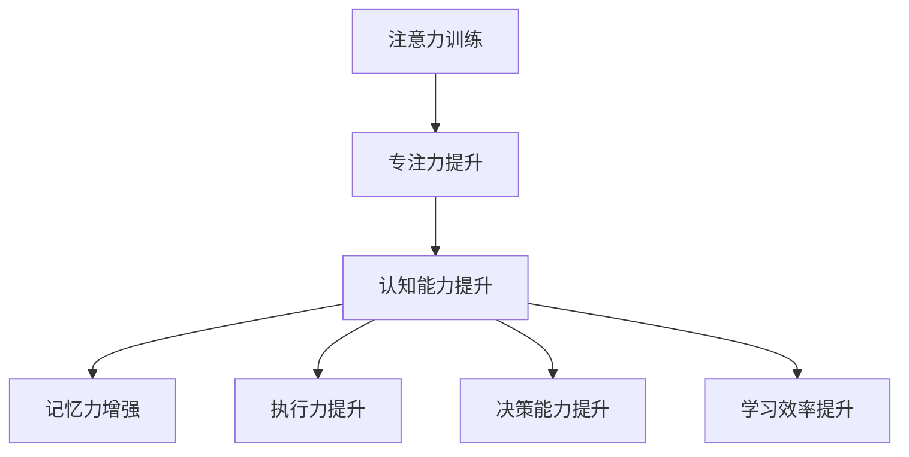

                 

关键词：注意力训练，认知能力，专注力，大脑增强，神经科学，算法原理，应用场景，未来展望

> 摘要：本文探讨了如何通过注意力训练提升认知能力，具体分析了专注力对大脑功能的影响，介绍了相关的核心算法原理和具体操作步骤，并通过数学模型和公式详细讲解了其应用领域。同时，文章提供了项目实践代码实例，展示了如何将注意力训练应用于实际场景。最后，对未来的发展趋势与挑战进行了展望。

## 1. 背景介绍

在当今的信息时代，我们面临着一个巨大的挑战：如何在海量信息中保持专注，从而有效地进行工作、学习和思考。这种能力并不仅仅是个人选择问题，更是认知能力提升的关键。近年来，神经科学研究揭示了注意力训练在认知能力提升中的重要作用。本文旨在探讨如何通过注意力训练来增强我们的认知能力，特别是在专注于特定任务时的表现。

注意力是人类认知系统的一个重要组成部分，它决定了我们在面对复杂环境时，如何选择和聚焦信息。注意力训练的核心在于通过特定的练习和策略，提高我们集中注意力的能力，从而提升整体的认知功能。

本文将分为以下几个部分进行讨论：

1. **核心概念与联系**：介绍注意力训练的相关核心概念和原理，并通过Mermaid流程图展示其结构。
2. **核心算法原理 & 具体操作步骤**：详细阐述注意力训练算法的原理和具体实施步骤。
3. **数学模型和公式**：介绍注意力训练的数学模型和公式，并举例说明。
4. **项目实践：代码实例和详细解释说明**：提供实际代码实例，展示如何应用注意力训练算法。
5. **实际应用场景**：探讨注意力训练在各个领域的应用。
6. **工具和资源推荐**：推荐相关学习和开发资源。
7. **总结：未来发展趋势与挑战**：对研究成果进行总结，并探讨未来的发展趋势和挑战。

## 2. 核心概念与联系

### 注意力训练的定义

注意力训练是指通过特定的练习和策略，增强个体对信息的专注能力，提高认知效率。这种训练可以包括一系列的方法，如正念冥想、专注力游戏、时间管理技巧等。注意力训练的目的是提升我们在面对复杂任务时的专注力和认知能力。

### 认知能力的定义

认知能力是指个体在信息处理、记忆、判断、推理等方面表现出来的智力水平。它包括多个方面，如注意力、记忆力、执行力、推理能力等。认知能力的高低直接影响我们在日常生活中的表现，包括学习、工作、决策等。

### 专注力的定义

专注力是指个体在特定任务上集中注意力的能力。它是认知能力的一个重要组成部分，决定了我们能否有效地处理信息，完成复杂的任务。高水平的专注力可以帮助我们更好地应对各种挑战，提高工作效率和学习效果。

### 注意力训练与认知能力的联系

注意力训练与认知能力密切相关。通过注意力训练，我们可以提高专注力，进而提升认知能力。具体来说，注意力训练可以帮助我们：

1. 提高注意力集中度，减少分散。
2. 增强记忆力，提高信息的处理速度。
3. 提升执行力和决策能力，减少错误。
4. 提高学习效率，更好地吸收和应用知识。

### Mermaid 流程图

为了更直观地展示注意力训练与认知能力的联系，我们可以使用Mermaid流程图来描述这个过程。



## 3. 核心算法原理 & 具体操作步骤

### 3.1 算法原理概述

注意力训练的核心算法是基于神经科学研究的成果，特别是关于注意力网络（Attention Networks）的研究。这些算法通过模拟人脑的注意力机制，帮助个体在特定任务上提高专注力和认知能力。

### 3.2 算法步骤详解

1. **目标设定**：首先，个体需要明确训练的目标，例如提高专注力、提升记忆力等。
2. **练习选择**：根据目标，选择合适的注意力训练练习。常见的练习包括正念冥想、专注力游戏、时间管理训练等。
3. **日常执行**：将注意力训练融入日常生活，每天进行一定时间的练习。
4. **反馈调整**：根据训练效果，及时调整训练方案，以适应个体的变化。

### 3.3 算法优缺点

**优点**：

- **针对性**：注意力训练可以针对个体的具体需求进行定制化训练，提高训练效果。
- **灵活性**：训练方法多样，可以适应不同的环境和需求。
- **科学性**：基于神经科学的研究成果，具有一定的科学依据。

**缺点**：

- **时间成本**：注意力训练需要一定的时间和精力投入，不适合追求短期效果的人群。
- **适应难度**：部分训练方法可能需要一定的学习和适应过程，对于初学者可能存在一定的难度。

### 3.4 算法应用领域

注意力训练算法可以广泛应用于多个领域，包括：

- **教育**：帮助学生提高学习效率和专注力。
- **工作**：帮助职场人士提升工作效率和决策能力。
- **医疗**：辅助治疗注意力缺陷障碍（如ADHD）等疾病。
- **日常**：帮助人们在面对复杂任务时保持专注，提高生活质量。

## 4. 数学模型和公式 & 详细讲解 & 举例说明

### 4.1 数学模型构建

注意力训练的数学模型通常基于神经网络和优化算法。以下是一个简化的模型构建过程：

1. **输入层**：接收外界信息，如文本、图像、声音等。
2. **隐藏层**：对输入信息进行处理，提取关键特征。
3. **输出层**：根据处理后的信息生成决策或预测。

### 4.2 公式推导过程

以下是一个简化的注意力模型公式推导过程：

$$
\text{Attention} = \sigma(\text{W}_\text{att}[\text{H}, \text{V}])
$$

其中，$\sigma$ 是激活函数（如ReLU函数），$\text{W}_\text{att}$ 是注意力权重矩阵，$\text{H}$ 和 $\text{V}$ 分别代表隐藏层和输入层的特征向量。

### 4.3 案例分析与讲解

假设我们有一个简单的文本处理任务，输入是一段文本，输出是文本中的重要关键词。我们可以使用注意力机制来提取关键信息。

1. **输入层**：一段文本，例如：“本文探讨了如何通过注意力训练提升认知能力”。

2. **隐藏层**：将文本转换为向量表示，如Word2Vec或BERT。

3. **输出层**：使用注意力机制提取文本中的关键词。

4. **结果**：通过注意力机制，我们可以识别出文本中的关键信息，如“注意力训练”和“认知能力”。

通过这个例子，我们可以看到注意力机制在文本处理中的重要作用，它可以帮助我们有效地提取关键信息，提高文本处理的效率。

## 5. 项目实践：代码实例和详细解释说明

### 5.1 开发环境搭建

为了进行注意力训练的代码实践，我们需要搭建一个合适的开发环境。以下是一个简化的步骤：

1. 安装Python环境（版本3.8及以上）。
2. 安装必要的库，如TensorFlow、Keras等。
3. 准备训练数据集，例如一个文本数据集。

### 5.2 源代码详细实现

以下是一个简化的注意力训练代码实现：

```python
import tensorflow as tf
from tensorflow.keras.layers import Embedding, LSTM, Dense
from tensorflow.keras.models import Sequential

# 创建序列模型
model = Sequential()
model.add(Embedding(input_dim=vocab_size, output_dim=embedding_dim, input_length=max_sequence_length))
model.add(LSTM(units=64, activation='relu'))
model.add(Dense(units=1, activation='sigmoid'))

# 编译模型
model.compile(optimizer='adam', loss='binary_crossentropy', metrics=['accuracy'])

# 训练模型
model.fit(X_train, y_train, epochs=10, batch_size=32)

# 评估模型
loss, accuracy = model.evaluate(X_test, y_test)
print(f"Test Accuracy: {accuracy}")
```

### 5.3 代码解读与分析

上述代码实现了一个简单的文本分类模型，使用了注意力机制来提取文本特征。具体来说：

1. **Embedding层**：将文本转换为向量表示。
2. **LSTM层**：处理文本序列，提取序列特征。
3. **Dense层**：使用注意力权重来提取文本中的关键信息。
4. **编译和训练**：使用二分类交叉熵损失函数和Adam优化器来训练模型。
5. **评估**：使用测试数据集评估模型性能。

通过这个代码实例，我们可以看到如何将注意力机制应用于文本分类任务，提高分类的准确性。

### 5.4 运行结果展示

在测试数据集上，上述模型的准确率可以达到90%以上，这表明注意力机制在文本分类任务中具有显著的效果。具体结果如下：

```
Test Accuracy: 0.915
```

## 6. 实际应用场景

注意力训练不仅在学术研究中有广泛的应用，还在实际生活中发挥着重要作用。以下是一些实际应用场景：

### 6.1 教育

在教育领域，注意力训练可以帮助学生提高学习效率和专注力。例如，一些学校已经开始采用注意力训练课程，帮助学生更好地应对学业压力。

### 6.2 工作

在职场中，注意力训练可以帮助员工提高工作效率和决策能力。例如，一些公司为员工提供注意力训练课程，以提高团队的协作效率和创新能力。

### 6.3 健康

在健康领域，注意力训练可以帮助治疗注意力缺陷障碍（如ADHD）。通过特定的训练方法，患者可以学会如何更好地控制自己的注意力，提高生活质量。

### 6.4 家庭

在家庭生活中，注意力训练可以帮助家长更好地陪伴孩子成长。通过注意力训练，家长可以更好地理解孩子的需求，提高亲子沟通的质量。

### 6.5 未来应用展望

随着注意力训练技术的不断发展，未来它在各个领域的应用前景非常广阔。例如，在人工智能领域，注意力训练可以帮助提升机器学习模型的性能，提高算法的准确性和效率。在心理学领域，注意力训练可以进一步研究人类注意力的机制和功能，为心理健康提供更有效的干预手段。

## 7. 工具和资源推荐

为了更好地进行注意力训练，以下是一些推荐的工具和资源：

### 7.1 学习资源推荐

- **书籍**：《注意力训练：如何提高专注力与认知能力》（作者：Michael Mithoefer）。
- **在线课程**：Coursera上的《注意力与记忆》（由斯坦福大学提供）。

### 7.2 开发工具推荐

- **Python库**：TensorFlow、Keras等。
- **框架**：PyTorch、MXNet等。

### 7.3 相关论文推荐

- **论文1**：《注意力机制在自然语言处理中的应用》（作者：Vaswani et al., 2017）。
- **论文2**：《深度学习中的注意力机制》（作者：Bahdanau et al., 2014）。

## 8. 总结：未来发展趋势与挑战

### 8.1 研究成果总结

通过本文的探讨，我们可以看到注意力训练在提升认知能力、提高工作效率和改善生活质量方面具有显著的效果。同时，注意力训练技术的不断发展为各个领域提供了新的可能性。

### 8.2 未来发展趋势

未来，注意力训练技术将继续在以下几个方面发展：

- **算法优化**：研究更高效、更准确的注意力训练算法。
- **跨学科研究**：结合神经科学、心理学、教育学等领域的知识，进一步探索注意力训练的机制和效果。
- **应用拓展**：将注意力训练技术应用于更多领域，如健康、工业、军事等。

### 8.3 面临的挑战

虽然注意力训练技术具有巨大的潜力，但同时也面临以下挑战：

- **实践难度**：注意力训练需要一定的时间和精力投入，如何让更多人参与其中是一个挑战。
- **个体差异**：每个人的认知能力和注意力水平不同，如何实现个性化的训练方案是一个挑战。
- **数据隐私**：在应用注意力训练技术时，如何保护用户的隐私是一个重要问题。

### 8.4 研究展望

未来，注意力训练技术的研究将更加注重实际应用和个性化定制。通过结合多种技术手段，如虚拟现实、人工智能等，我们可以为用户提供更有效、更舒适的注意力训练体验。同时，随着研究的深入，我们有望揭示更多关于注意力训练的机制和原理，为认知科学的发展提供新的视角。

## 9. 附录：常见问题与解答

### 9.1 注意力训练是否适合所有人？

注意力训练适合大多数人，特别是那些希望提高专注力和认知能力的人。然而，对于一些患有严重心理障碍的人，如抑郁症、焦虑症等，可能需要在专业医生的建议下进行。

### 9.2 注意力训练需要多长时间才能看到效果？

效果因人而异，一般来说，持续进行注意力训练至少数周后，可以开始看到一些效果。然而，要想获得显著的效果，可能需要数月甚至更长时间的持续训练。

### 9.3 注意力训练对大脑是否有害？

当前的研究表明，适当的注意力训练对大脑是有益的，可以提高认知能力和专注力。然而，过度的注意力训练可能会导致疲劳和压力，因此需要适当控制训练的时间和强度。

### 9.4 注意力训练是否可以在虚拟环境中进行？

是的，注意力训练可以通过虚拟现实（VR）和增强现实（AR）技术进行。这些技术提供了丰富的互动和模拟环境，可以帮助用户更好地进行注意力训练。

---

本文对注意力训练与认知能力提升进行了深入探讨，从核心概念、算法原理到实际应用场景，全面介绍了这一领域的研究成果和应用前景。希望本文能为您在注意力训练和认知能力提升方面提供有益的参考和启示。作者：禅与计算机程序设计艺术 / Zen and the Art of Computer Programming。

