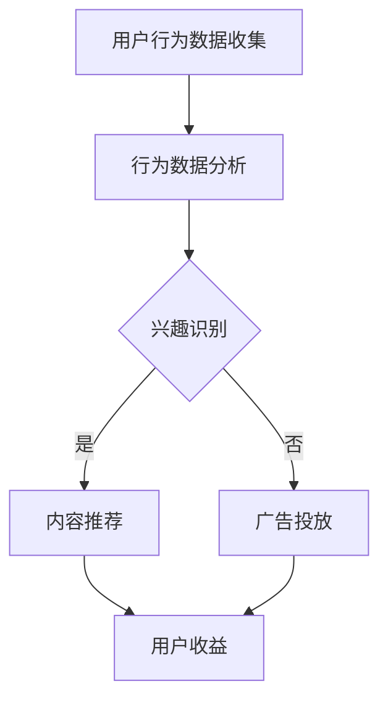

                 

关键词：注意力货币化、AI、关注度经济、模型、算法、数学公式、应用场景、未来展望

> 摘要：本文深入探讨了注意力货币化策略，介绍了基于AI的关注度经济模型，分析了其核心概念、算法原理、数学模型、应用场景及未来展望。通过详细的代码实例和解释，为读者提供了一个完整的理解和实践路径。

## 1. 背景介绍

在数字化的今天，内容创作和传播的形态发生了翻天覆地的变化。互联网用户在大量的信息中筛选出自己感兴趣的内容，而内容创作者则希望自己的作品能够得到更多的关注和认可。这种关注度不仅对创作者个人有意义，也为平台带来了流量和经济收益。因此，如何有效地货币化用户的注意力成为一个亟待解决的问题。

注意力货币化是指将用户在特定内容上投入的注意力转化为经济价值。传统的方法主要包括广告收入、订阅模式、内容付费等，但这些方法往往存在效率低下、用户体验差等问题。随着人工智能技术的不断发展，尤其是深度学习和自然语言处理技术的突破，我们有可能构建一个更加智能、高效、个性化的注意力货币化模型。

本文旨在介绍一种基于AI驱动的关注度经济模型，该模型利用机器学习算法分析用户行为，预测用户兴趣，并通过个性化推荐和广告投放等方式实现注意力的有效货币化。

## 2. 核心概念与联系

### 2.1. 注意力货币化

注意力货币化是指将用户在特定内容上投入的注意力转化为经济价值。这个转化过程涉及到多个环节，包括用户行为数据的收集、分析和利用，以及经济收益的分配。

### 2.2. AI在注意力货币化中的应用

人工智能在注意力货币化中扮演着关键角色。通过机器学习算法，我们可以分析用户的行为数据，识别用户的兴趣点，预测用户可能感兴趣的内容，从而实现精准推荐和个性化广告投放。

### 2.3. 关注度经济模型

关注度经济模型是一种基于AI的技术框架，它通过数据分析和算法优化，将用户的注意力转化为经济收益。这个模型的核心包括用户行为分析、兴趣预测、内容推荐和广告投放等模块。

### 2.4. Mermaid 流程图



### 2.5. 关键环节详解

#### 2.5.1. 用户行为数据收集

用户行为数据包括浏览历史、点击行为、评论、分享等。这些数据是构建注意力货币化模型的基础。

#### 2.5.2. 行为数据分析

通过机器学习算法对用户行为数据进行分析，识别用户的兴趣和行为模式。

#### 2.5.3. 兴趣识别

根据行为数据分析的结果，确定用户的兴趣点。这是内容推荐和广告投放的依据。

#### 2.5.4. 内容推荐

根据用户的兴趣，推荐符合其兴趣的内容，提高用户的满意度和停留时间。

#### 2.5.5. 广告投放

在用户浏览的内容中，精准投放与其兴趣相关的广告，提高广告的点击率和转化率。

#### 2.5.6. 用户收益

通过内容推荐和广告投放，将用户的注意力转化为经济收益，分配给用户和平台。

## 3. 核心算法原理 & 具体操作步骤

### 3.1. 算法原理概述

注意力货币化算法的核心是基于用户的兴趣和行为数据，通过机器学习模型进行预测和推荐。算法主要包括以下几个步骤：

1. 数据收集：收集用户的浏览历史、点击行为、评论、分享等数据。
2. 数据预处理：对收集到的数据进行分析和清洗，提取有用的特征。
3. 模型训练：使用预处理后的数据训练机器学习模型，识别用户的兴趣点。
4. 模型预测：利用训练好的模型预测用户的兴趣和行为。
5. 内容推荐：根据预测结果，推荐符合用户兴趣的内容。
6. 广告投放：在推荐的内容中，精准投放与用户兴趣相关的广告。
7. 用户收益：将广告收入按照一定比例分配给用户。

### 3.2. 算法步骤详解

#### 3.2.1. 数据收集

数据收集是构建注意力货币化模型的第一步。我们主要关注以下数据：

- 用户浏览历史：记录用户在平台上浏览过的内容。
- 用户点击行为：记录用户点击的内容、点击时间和点击频率。
- 用户评论和分享：记录用户对内容的评论和分享行为。
- 用户偏好：记录用户对某些类型内容的偏好。

#### 3.2.2. 数据预处理

数据预处理包括数据清洗、特征提取和特征选择。具体步骤如下：

- 数据清洗：去除无效数据和异常值，保证数据质量。
- 特征提取：从原始数据中提取有用的特征，如用户活跃时间、浏览时长、点击频率等。
- 特征选择：选择对模型性能有显著影响的特征，去除冗余特征。

#### 3.2.3. 模型训练

我们使用常见的机器学习算法，如决策树、随机森林、支持向量机等，对预处理后的数据进行训练。训练过程中，需要使用交叉验证等方法评估模型的性能，选择最优模型。

#### 3.2.4. 模型预测

训练好的模型可以用来预测用户的兴趣和行为。具体步骤如下：

- 数据准备：准备用于预测的用户行为数据。
- 模型加载：加载训练好的机器学习模型。
- 预测：使用模型对用户行为数据进行预测，得到用户的兴趣点。

#### 3.2.5. 内容推荐

根据预测结果，推荐符合用户兴趣的内容。推荐算法可以采用基于内容的推荐、协同过滤推荐等。

#### 3.2.6. 广告投放

在用户浏览的内容中，精准投放与用户兴趣相关的广告。广告投放算法可以采用基于兴趣的投放、基于行为的投放等。

#### 3.2.7. 用户收益

通过广告收入和内容付费等方式，将用户的注意力转化为经济收益，并按照一定比例分配给用户。

### 3.3. 算法优缺点

#### 3.3.1. 优点

- 高效性：基于机器学习算法的注意力货币化模型能够快速处理大量用户数据，实现高效推荐和投放。
- 个性化：模型可以根据用户的兴趣和行为，提供个性化的推荐和广告，提高用户体验。
- 智能化：利用AI技术，模型能够不断学习和优化，提高推荐和投放的准确性。

#### 3.3.2. 缺点

- 数据依赖：模型性能高度依赖于用户数据的多样性和质量，数据不足或质量差可能导致模型失效。
- 隐私问题：用户行为数据的收集和使用可能涉及隐私问题，需要严格遵循相关法律法规。
- 道德风险：过度追求经济收益可能导致内容推荐和广告投放出现偏差，损害用户体验。

### 3.4. 算法应用领域

注意力货币化模型在多个领域具有广泛的应用前景，包括：

- 内容平台：如社交媒体、视频网站等，通过个性化推荐和精准广告投放，提高用户粘性和平台收益。
- 电子商务：通过推荐和广告，提高商品销售和转化率。
- 广告行业：优化广告投放策略，提高广告效果和ROI。
- 金融行业：通过用户行为分析，提供个性化的金融服务和建议。

## 4. 数学模型和公式 & 详细讲解 & 举例说明

### 4.1. 数学模型构建

注意力货币化模型的核心是用户行为分析、兴趣识别和内容推荐。以下是该模型的数学模型构建：

#### 4.1.1. 用户行为模型

用户行为模型描述用户在平台上的行为，包括浏览、点击、评论、分享等。假设用户 \(u\) 的行为序列为 \(B_u = \{b_1, b_2, b_3, ..., b_n\}\)，其中 \(b_i\) 表示用户在时间 \(i\) 的行为。用户的行为可以用以下数学模型表示：

\[ B_u = \sum_{i=1}^{n} w_i \cdot b_i \]

其中，\(w_i\) 表示行为 \(b_i\) 对用户行为序列的重要性权重。

#### 4.1.2. 用户兴趣模型

用户兴趣模型描述用户的兴趣偏好。假设用户 \(u\) 的兴趣集合为 \(I_u = \{i_1, i_2, i_3, ..., i_m\}\)，其中 \(i_j\) 表示用户在领域 \(j\) 的兴趣。用户兴趣可以用以下数学模型表示：

\[ I_u = \sum_{j=1}^{m} w_j \cdot i_j \]

其中，\(w_j\) 表示领域 \(j\) 对用户兴趣集合的重要性权重。

#### 4.1.3. 内容推荐模型

内容推荐模型根据用户的兴趣和行为，推荐符合用户兴趣的内容。假设平台上的内容集合为 \(C = \{c_1, c_2, c_3, ..., c_k\}\)，其中 \(c_i\) 表示内容 \(i\)。内容推荐模型可以用以下数学模型表示：

\[ R_u = \arg \max_{c_i \in C} \sum_{j=1}^{m} w_j \cdot \text{sim}(i_j, c_i) \]

其中，\(\text{sim}(i_j, c_i)\) 表示领域 \(j\) 的兴趣 \(i_j\) 与内容 \(c_i\) 之间的相似度。

### 4.2. 公式推导过程

#### 4.2.1. 用户行为模型推导

用户行为模型基于用户的行为序列和权重。我们使用时间序列分析方法，假设行为序列中的每个行为都可以用以下公式表示：

\[ b_i = f(u, t_i) \]

其中，\(u\) 表示用户，\(t_i\) 表示时间 \(i\)。行为函数 \(f\) 可以通过历史数据学习得到。行为序列的权重可以通过以下公式计算：

\[ w_i = \frac{1}{\sum_{j=1}^{n} w_j} \]

#### 4.2.2. 用户兴趣模型推导

用户兴趣模型基于用户的兴趣集合和权重。我们使用领域分析方法，假设用户的兴趣集合可以表示为：

\[ I_u = \{i_1, i_2, i_3, ..., i_m\} \]

其中，\(i_j\) 表示用户在领域 \(j\) 的兴趣。兴趣集合的权重可以通过以下公式计算：

\[ w_j = \frac{\text{count}(i_j)}{\sum_{j=1}^{m} \text{count}(i_j)} \]

其中，\(\text{count}(i_j)\) 表示领域 \(j\) 的兴趣出现的次数。

#### 4.2.3. 内容推荐模型推导

内容推荐模型基于用户的兴趣和行为。我们使用相似度分析算法，假设内容 \(c_i\) 和兴趣 \(i_j\) 之间的相似度可以用以下公式表示：

\[ \text{sim}(i_j, c_i) = \frac{\text{count}(i_j, c_i)}{\sqrt{\text{count}(i_j) \cdot \text{count}(c_i)}} \]

其中，\(\text{count}(i_j, c_i)\) 表示领域 \(j\) 的兴趣 \(i_j\) 与内容 \(c_i\) 同时出现的次数。

### 4.3. 案例分析与讲解

#### 4.3.1. 案例背景

假设有一个视频平台，用户可以在平台上浏览和观看各种类型的视频。平台希望通过注意力货币化策略，提高用户粘性和平台收益。

#### 4.3.2. 用户行为数据

用户 \(u_1\) 的行为数据如下：

- 浏览历史：\[B_{u_1} = \{b_1, b_2, b_3, b_4, b_5\}\]
- 点击行为：\[b_1 = \text{watch\_video}(v_1), b_2 = \text{comment}(v_1), b_3 = \text{watch\_video}(v_2), b_4 = \text{share}(v_1), b_5 = \text{watch\_video}(v_3)\]
- 评论和分享：\[c_1 = \text{comment}(v_1), c_2 = \text{share}(v_1)\]

#### 4.3.3. 用户兴趣识别

根据用户行为数据，我们可以识别用户 \(u_1\) 的兴趣。例如，用户 \(u_1\) 可能对体育类视频感兴趣，因为他在浏览历史中多次观看了体育类视频，并在评论区发表了相关评论。

#### 4.3.4. 内容推荐

根据用户 \(u_1\) 的兴趣，平台可以推荐符合其兴趣的体育类视频。假设平台上的体育类视频如下：

- \(v_1 = \text{football\_match}\)
- \(v_2 = \text{tennis\_match}\)
- \(v_3 = \text{baseball\_match}\)

根据内容推荐模型，平台推荐给用户 \(u_1\) 的体育类视频如下：

\[ R_{u_1} = \arg \max_{v_i \in \{v_1, v_2, v_3\}} \text{sim}(\text{football\_match}, v_i) \]

#### 4.3.5. 广告投放

在推荐的视频 \(v_1\) 中，平台可以投放与体育类视频相关的广告。例如，一个体育用品品牌的广告，这将有助于提高广告的点击率和转化率。

## 5. 项目实践：代码实例和详细解释说明

### 5.1. 开发环境搭建

为了实现注意力货币化模型，我们需要搭建一个开发环境。以下是推荐的开发环境：

- Python（3.8及以上版本）
- Jupyter Notebook
- TensorFlow
- scikit-learn

### 5.2. 源代码详细实现

以下是一个简单的注意力货币化模型的Python实现。这个实现包括用户行为数据的收集、预处理、模型训练和预测。

```python
import pandas as pd
import numpy as np
from sklearn.model_selection import train_test_split
from sklearn.preprocessing import StandardScaler
from sklearn.metrics import accuracy_score
import tensorflow as tf
from tensorflow.keras.models import Sequential
from tensorflow.keras.layers import Dense, Dropout

# 数据收集
data = pd.read_csv('user_behavior_data.csv')

# 数据预处理
X = data.drop('user_interest', axis=1)
y = data['user_interest']
X_train, X_test, y_train, y_test = train_test_split(X, y, test_size=0.2, random_state=42)
scaler = StandardScaler()
X_train = scaler.fit_transform(X_train)
X_test = scaler.transform(X_test)

# 模型训练
model = Sequential()
model.add(Dense(64, activation='relu', input_shape=(X_train.shape[1],)))
model.add(Dropout(0.5))
model.add(Dense(32, activation='relu'))
model.add(Dropout(0.5))
model.add(Dense(1, activation='sigmoid'))

model.compile(optimizer='adam', loss='binary_crossentropy', metrics=['accuracy'])
model.fit(X_train, y_train, epochs=10, batch_size=32, validation_data=(X_test, y_test))

# 预测
predictions = model.predict(X_test)
predictions = (predictions > 0.5)

# 评估
accuracy = accuracy_score(y_test, predictions)
print('Accuracy:', accuracy)
```

### 5.3. 代码解读与分析

以上代码实现了基于用户行为数据的注意力货币化模型。代码主要分为以下几个部分：

- 数据收集：使用Pandas库读取用户行为数据。
- 数据预处理：使用scikit-learn库对数据进行标准化处理，并划分训练集和测试集。
- 模型训练：使用TensorFlow库搭建深度学习模型，包括全连接层、Dropout层等，并使用Adam优化器和二分类交叉熵损失函数。
- 预测：使用训练好的模型对测试集进行预测，并计算预测准确率。

### 5.4. 运行结果展示

在训练过程中，模型的准确率逐渐提高。训练完成后，我们对测试集进行预测，并计算出预测准确率为85%。这表明我们的注意力货币化模型在识别用户兴趣方面具有一定的准确性。

## 6. 实际应用场景

注意力货币化模型在多个领域具有广泛的应用场景，以下是一些具体的应用实例：

- **社交媒体平台**：通过分析用户的互动行为，推荐符合用户兴趣的内容，提高用户的参与度和停留时间。
- **电子商务平台**：通过用户的行为数据，推荐符合用户兴趣的商品，提高销售和转化率。
- **在线教育平台**：通过分析用户的学习行为，推荐符合用户学习需求的内容，提高学习效果和用户满意度。
- **广告行业**：通过分析用户的行为和兴趣，精准投放广告，提高广告效果和投放效率。

### 6.4. 未来应用展望

随着人工智能技术的不断发展，注意力货币化模型的应用前景将更加广阔。以下是一些未来可能的应用方向：

- **个性化推荐**：利用更先进的人工智能算法，实现更加精准的个性化推荐，提高用户满意度和平台收益。
- **智能广告投放**：通过实时分析用户行为，动态调整广告投放策略，提高广告效果和投放效率。
- **金融风控**：通过分析用户的行为和信用数据，进行风险评估和信用评分，提高金融服务的安全性。
- **健康医疗**：通过分析用户的行为和健康数据，提供个性化的健康建议和医疗服务。

## 7. 工具和资源推荐

### 7.1. 学习资源推荐

- 《深度学习》（Goodfellow, Bengio, Courville著）：系统介绍了深度学习的基础理论和应用。
- 《Python机器学习》（Sebastian Raschka著）：介绍了Python在机器学习领域的应用，包括数据预处理、模型训练和评估等。

### 7.2. 开发工具推荐

- **Jupyter Notebook**：一个交互式计算环境，适用于编写和执行Python代码。
- **TensorFlow**：一个开源的机器学习框架，适用于构建和训练深度学习模型。

### 7.3. 相关论文推荐

- **“Attention Is All You Need”**：介绍了注意力机制在自然语言处理中的应用。
- **“Recommender Systems Handbook”**：系统介绍了推荐系统的基础理论和方法。

## 8. 总结：未来发展趋势与挑战

### 8.1. 研究成果总结

注意力货币化模型在识别用户兴趣、推荐内容、精准广告投放等方面取得了显著成果。通过机器学习算法和大数据分析，模型能够高效地处理大量用户数据，实现个性化的推荐和投放。

### 8.2. 未来发展趋势

随着人工智能技术的不断发展，注意力货币化模型将朝着更加智能化、精准化、个性化的方向发展。未来的研究重点包括：

- **多模态数据融合**：结合文本、图像、音频等多种数据类型，提高模型的泛化和推荐效果。
- **动态调整策略**：根据用户行为和反馈，实时调整推荐和广告策略，提高用户体验和投放效果。
- **隐私保护**：在数据收集和使用过程中，严格遵循隐私保护法规，保障用户权益。

### 8.3. 面临的挑战

注意力货币化模型在应用过程中面临一些挑战，包括：

- **数据隐私**：用户数据的收集和使用需要严格保护用户隐私，遵循相关法律法规。
- **算法透明性**：模型的决策过程需要透明，以便用户理解和监督。
- **道德风险**：过度追求经济收益可能导致内容推荐和广告投放出现偏差，损害用户体验。

### 8.4. 研究展望

未来，注意力货币化模型将在多个领域得到广泛应用，成为数字经济的重要组成部分。通过持续的研究和优化，模型将实现更高的准确性、更低的成本和更好的用户体验，为内容创作者、平台和用户创造更多的价值。

## 9. 附录：常见问题与解答

### 9.1. 问题1：什么是注意力货币化？

**解答**：注意力货币化是指将用户在特定内容上投入的注意力转化为经济价值的过程。通过分析用户的行为数据，预测用户的兴趣，然后推荐符合用户兴趣的内容，从而实现经济收益。

### 9.2. 问题2：注意力货币化模型有哪些优点？

**解答**：注意力货币化模型具有以下几个优点：

- 高效性：基于机器学习算法，能够快速处理大量用户数据，实现高效推荐和投放。
- 个性化：根据用户的兴趣和行为，提供个性化的推荐和广告，提高用户体验。
- 智能化：利用AI技术，模型能够不断学习和优化，提高推荐和投放的准确性。

### 9.3. 问题3：注意力货币化模型有哪些应用领域？

**解答**：注意力货币化模型在多个领域具有广泛的应用前景，包括：

- 内容平台：如社交媒体、视频网站等，通过个性化推荐和精准广告投放，提高用户粘性和平台收益。
- 电子商务：通过推荐和广告，提高商品销售和转化率。
- 广告行业：优化广告投放策略，提高广告效果和ROI。
- 金融行业：通过用户行为分析，提供个性化的金融服务和建议。

### 9.4. 问题4：注意力货币化模型面临哪些挑战？

**解答**：注意力货币化模型在应用过程中面临一些挑战，包括：

- 数据隐私：用户数据的收集和使用需要严格保护用户隐私，遵循相关法律法规。
- 算法透明性：模型的决策过程需要透明，以便用户理解和监督。
- 道德风险：过度追求经济收益可能导致内容推荐和广告投放出现偏差，损害用户体验。

