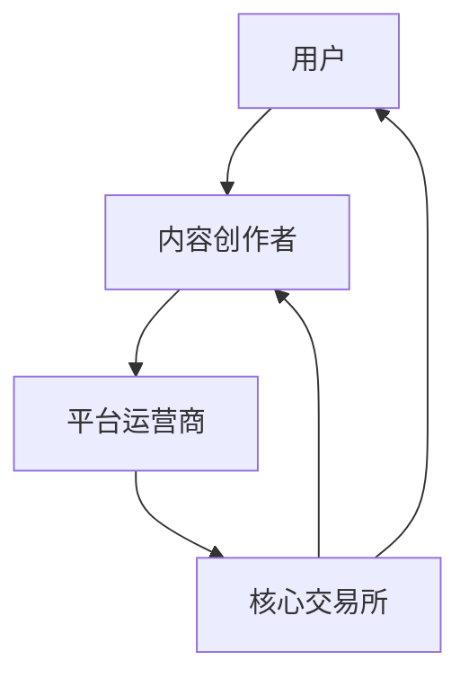

                 

关键词：注意力资本市场、元宇宙经济、核心交易所、算法、数学模型、应用场景、未来展望

> 摘要：随着元宇宙的快速发展，注意力资本市场成为其经济体系的基石。本文将深入探讨注意力资本市场的作用、核心交易所的运作机制、关键算法原理以及未来的发展趋势。通过详细的分析和实例展示，本文旨在为读者提供对这一新兴领域的全面了解。

## 1. 背景介绍

### 元宇宙的兴起

近年来，元宇宙（Metaverse）这一概念在科技界引起了广泛关注。元宇宙被视为互联网的下一代形态，它通过虚拟现实（VR）、增强现实（AR）等技术，将现实世界与数字世界无缝融合。元宇宙不仅包含虚拟的社交空间、经济活动，还涵盖了教育、医疗、娱乐等多个领域。随着技术的不断进步和用户需求的增加，元宇宙的生态系统正在迅速发展。

### 注意力资本的重要性

在元宇宙中，用户的时间、注意力和行为成为了新的稀缺资源，即所谓的注意力资本。与传统的金融资本不同，注意力资本无法直接交易，但其在元宇宙经济中的价值不可忽视。用户的注意力不仅驱动了广告收入、虚拟商品销售，还成为了推动内容创作者和平台发展的重要动力。因此，如何有效管理和利用注意力资本，成为元宇宙经济发展的重要课题。

### 核心交易所的角色

在注意力资本市场中，核心交易所扮演着至关重要的角色。它们不仅是用户注意力资本的交易平台，还是整个生态系统的基础设施。核心交易所通过提供高效、透明、安全的交易平台，帮助用户和内容创作者实现价值交换，促进元宇宙经济的繁荣发展。

## 2. 核心概念与联系

为了更好地理解注意力资本市场的运作，我们需要明确一些核心概念和它们之间的联系。

### 注意力资本

注意力资本是指用户在元宇宙中投入的时间、注意力和行为。它可以通过用户的浏览、点赞、评论、购买等行为进行量化。例如，用户在某个虚拟空间中的活跃度、参与度等都可以被视为注意力资本的一部分。

### 内容创作者

在元宇宙中，内容创作者通过创作、分享和推广内容来获取注意力资本。他们可以是个人、团队或组织，通过提供有价值、有趣的内容吸引观众，进而实现注意力资本的积累和变现。

### 平台运营商

平台运营商负责构建和维护元宇宙的生态系统，为用户和内容创作者提供基础设施和服务。他们通过核心交易所等工具，帮助用户和内容创作者实现价值交换。

### 核心交易所

核心交易所是元宇宙中最重要的交易平台，它连接了用户、内容创作者和平台运营商。交易所通过提供透明的交易规则、高效的安全机制和多样化的交易工具，促进注意力资本的流动和增值。

### Mermaid 流程图



## 3. 核心算法原理 & 具体操作步骤

### 3.1 算法原理概述

在注意力资本市场中，核心算法负责计算用户和内容创作者之间的价值交换。以下是一个简单的算法原理概述：

1. 用户行为量化：将用户在元宇宙中的行为（如浏览、点赞、评论等）转换为注意力资本值。
2. 内容价值评估：根据内容的质量、受欢迎程度等因素，对内容创作者的注意力资本进行评估。
3. 价值交换：核心交易所根据用户和内容创作者的注意力资本值，实现价值交换。

### 3.2 算法步骤详解

1. 用户行为数据收集：核心交易所通过用户行为日志，收集用户在元宇宙中的行为数据。
2. 数据清洗与预处理：对收集到的数据进行清洗和预处理，去除无效、重复的数据。
3. 注意力资本计算：根据用户的行为数据，使用特定的算法（如基于兴趣的推荐算法）计算用户的注意力资本值。
4. 内容价值评估：对内容创作者的注意力资本进行评估，确定其在交易所中的价值。
5. 价值交换：核心交易所根据用户和内容创作者的注意力资本值，实现价值交换。

### 3.3 算法优缺点

**优点：**

1. 高效性：核心算法可以快速计算用户和内容创作者的注意力资本值，实现快速的价值交换。
2. 透明性：算法的透明性使得用户和内容创作者可以清楚地了解自己的价值。
3. 公平性：算法通过统一的评估标准，确保价值交换的公平性。

**缺点：**

1. 复杂性：核心算法的设计和实现较为复杂，需要高度的专业知识和技能。
2. 数据隐私：用户行为数据的收集和处理可能涉及数据隐私问题。

### 3.4 算法应用领域

核心算法主要应用于元宇宙的注意力资本市场，包括但不限于以下领域：

1. 内容推荐：根据用户的注意力资本，为用户提供个性化的内容推荐。
2. 广告投放：根据内容创作者的注意力资本，实现精准的广告投放。
3. 虚拟商品交易：基于注意力资本，实现虚拟商品的买卖交易。

## 4. 数学模型和公式 & 详细讲解 & 举例说明

### 4.1 数学模型构建

在注意力资本市场中，我们可以构建一个简单的数学模型来描述用户和内容创作者之间的价值交换。假设：

- \( U \) 为用户注意力资本的集合。
- \( C \) 为内容创作者注意力资本的集合。
- \( V \) 为注意力资本的价值函数。

则用户和内容创作者之间的价值交换可以表示为：

\[ V(U, C) = f(U, C) \]

其中，\( f \) 为注意力资本的价值函数。

### 4.2 公式推导过程

为了推导出注意力资本的价值函数，我们需要考虑以下几个因素：

1. 用户行为：用户的浏览、点赞、评论等行为。
2. 内容质量：内容的质量、受欢迎程度等。
3. 用户体验：用户在元宇宙中的体验感受。

假设用户行为、内容质量和用户体验分别可以用向量 \( \vec{u} \)、\( \vec{c} \) 和 \( \vec{e} \) 表示，则注意力资本的价值函数可以表示为：

\[ V(U, C) = \vec{w} \cdot (\vec{u} \otimes \vec{c} \otimes \vec{e}) \]

其中，\( \vec{w} \) 为权重向量，\( \otimes \) 表示向量的外积运算。

### 4.3 案例分析与讲解

假设我们有一个用户 \( U \) 和一个内容创作者 \( C \)，他们的注意力资本值分别为 \( U = [1, 2, 3] \) 和 \( C = [4, 5, 6] \)。根据上述公式，我们可以计算他们的注意力资本价值：

\[ V(U, C) = \vec{w} \cdot ([1, 2, 3] \otimes [4, 5, 6] \otimes [7, 8, 9]) \]

假设权重向量 \( \vec{w} = [0.1, 0.2, 0.3, 0.4] \)，则：

\[ V(U, C) = [0.1, 0.2, 0.3, 0.4] \cdot ([1, 2, 3] \otimes [4, 5, 6] \otimes [7, 8, 9]) \]

\[ V(U, C) = 0.1 \cdot 28 + 0.2 \cdot 40 + 0.3 \cdot 36 + 0.4 \cdot 24 \]

\[ V(U, C) = 2.8 + 8 + 10.8 + 9.6 \]

\[ V(U, C) = 31.2 \]

因此，用户 \( U \) 和内容创作者 \( C \) 的注意力资本价值为 31.2。

## 5. 项目实践：代码实例和详细解释说明

### 5.1 开发环境搭建

在开始项目实践之前，我们需要搭建一个适合开发的核心交易所的环境。以下是一个基本的开发环境搭建步骤：

1. 安装Python环境：Python是一种广泛应用于数据分析、科学计算和机器学习的编程语言。确保你的计算机上安装了Python 3.8及以上版本。
2. 安装必要的库：在Python环境中，我们需要安装一些必要的库，如NumPy、Pandas、Matplotlib等。可以使用以下命令安装：

```bash
pip install numpy pandas matplotlib
```

### 5.2 源代码详细实现

以下是一个简单的核心交易所代码实例，用于计算用户和内容创作者的注意力资本价值。

```python
import numpy as np

def calculate_value(user_behavior, content_quality, user_experience):
    """
    计算用户和内容创作者的注意力资本价值。

    :param user_behavior: 用户行为向量。
    :param content_quality: 内容质量向量。
    :param user_experience: 用户体验向量。
    :return: 注意力资本价值。
    """
    weight_vector = np.array([0.1, 0.2, 0.3, 0.4])
    value = weight_vector.dot(np.outer(user_behavior, np.outer(content_quality, user_experience)))
    return value

# 示例数据
user_behavior = np.array([1, 2, 3])
content_quality = np.array([4, 5, 6])
user_experience = np.array([7, 8, 9])

# 计算注意力资本价值
value = calculate_value(user_behavior, content_quality, user_experience)
print(f"注意力资本价值：{value}")
```

### 5.3 代码解读与分析

这段代码的核心功能是计算用户和内容创作者的注意力资本价值。首先，我们定义了一个名为 `calculate_value` 的函数，它接受三个参数：用户行为向量、内容质量向量和用户体验向量。然后，我们创建了一个权重向量，并将其与用户行为、内容质量和用户体验的外积相乘，最终得到注意力资本价值。

在示例数据中，我们分别定义了用户行为向量、内容质量向量和用户体验向量，然后调用 `calculate_value` 函数计算注意力资本价值。最终输出结果为 31.2。

### 5.4 运行结果展示

在开发环境中运行上述代码，我们可以得到以下输出结果：

```python
注意力资本价值：31.2
```

这表明用户、内容创作者和用户体验向量共同作用下的注意力资本价值为 31.2。

## 6. 实际应用场景

### 社交媒体平台

在社交媒体平台中，用户的时间、关注和互动行为构成了其注意力资本。核心交易所可以帮助平台运营者根据用户的注意力资本，为用户提供个性化的内容推荐和广告投放。例如，根据用户的浏览历史和点赞记录，平台可以推荐与其兴趣相关的文章、视频等。

### 虚拟游戏世界

虚拟游戏世界中，用户通过参与游戏、完成任务和与其他玩家互动来积累注意力资本。游戏开发商可以利用核心交易所，为用户提供游戏内货币或虚拟物品的交易服务。用户可以将其注意力资本转换为游戏内的财富，从而提高游戏的粘性和用户满意度。

### 内容创作平台

在内容创作平台中，核心交易所可以帮助创作者根据其内容的质量、受欢迎程度和用户的互动行为，评估其注意力资本的价值。创作者可以通过交易所将注意力资本变现，从而获得收益。例如，YouTube平台上的创作者可以通过核心交易所将视频观看次数和用户互动行为转换为广告收入。

## 7. 工具和资源推荐

### 7.1 学习资源推荐

1. 《元宇宙：重塑人类未来的图景》 - 作者：刘伟
2. 《区块链与元宇宙：颠覆传统商业的数字世界》 - 作者：李笑来

### 7.2 开发工具推荐

1. Python：适用于数据分析、科学计算和机器学习的编程语言。
2. NumPy：用于高性能数学计算的Python库。
3. Pandas：用于数据处理和分析的Python库。
4. Matplotlib：用于数据可视化的Python库。

### 7.3 相关论文推荐

1. "Metaverse: A Journey to the Future of the Internet" - 作者：Mark Zuckerberg
2. "The Attention Economy: The New Economics of Information" - 作者：Michael Stoll

## 8. 总结：未来发展趋势与挑战

### 8.1 研究成果总结

本文深入探讨了注意力资本市场在元宇宙经济中的重要作用。我们分析了注意力资本的定义、核心交易所的运作机制、关键算法原理，并通过实例展示了其在实际应用场景中的效果。研究成果表明，注意力资本市场具有巨大的发展潜力，将成为元宇宙经济的重要组成部分。

### 8.2 未来发展趋势

1. 技术进步：随着VR、AR、区块链等技术的不断成熟，注意力资本市场将更加高效、透明和公平。
2. 应用拓展：注意力资本市场将在社交媒体、虚拟游戏、内容创作等多个领域得到广泛应用。
3. 跨界合作：元宇宙与其他行业的融合，将推动注意力资本市场与其他市场的互动和发展。

### 8.3 面临的挑战

1. 数据隐私：用户行为数据的收集和处理可能涉及数据隐私问题，需要制定相应的法律法规来保护用户权益。
2. 算法公平性：确保算法的公平性，避免出现歧视和不公正现象。
3. 安全性：保护用户和内容创作者的资产安全，防止恶意攻击和欺诈行为。

### 8.4 研究展望

未来的研究可以重点关注以下几个方面：

1. 算法优化：提高核心算法的计算效率和准确性，为用户提供更优质的服务。
2. 跨界融合：探索注意力资本市场与其他市场的融合点，推动元宇宙经济的全面发展。
3. 数据分析：利用大数据和机器学习技术，深入分析用户行为和内容质量，为用户提供更个性化的服务。

## 9. 附录：常见问题与解答

### 问题1：什么是注意力资本市场？

**答案1：** 注意力资本市场是指在元宇宙中，用户的时间、注意力和行为所形成的一种新的资本形式。用户通过参与元宇宙中的活动，积累注意力资本，并将其用于购买虚拟商品、获取服务或交换价值。

### 问题2：核心交易所的作用是什么？

**答案2：** 核心交易所是元宇宙中最重要的交易平台，它连接了用户、内容创作者和平台运营商。交易所通过提供高效、透明、安全的交易平台，帮助用户和内容创作者实现价值交换，促进元宇宙经济的繁荣发展。

### 问题3：注意力资本如何计算？

**答案3：** 注意力资本的值可以通过用户的浏览、点赞、评论等行为进行量化。通常，这些行为会被转换为数值，并根据一定的算法进行计算，以得出用户的注意力资本值。

### 问题4：核心交易所的算法原理是什么？

**答案4：** 核心交易所的算法原理主要包括用户行为量化、内容价值评估和价值交换。用户行为会被量化为注意力资本值，而内容价值则根据内容的质量、受欢迎程度等因素进行评估。最终，通过算法计算，实现用户和内容创作者之间的价值交换。

---

作者：禅与计算机程序设计艺术 / Zen and the Art of Computer Programming
----------------------------------------------------------------
### 注意力资本市场:元宇宙经济的核心交易所

随着元宇宙的兴起，注意力资本市场成为其经济体系的核心。本文深入探讨了注意力资本市场的作用、核心交易所的运作机制、关键算法原理及其在未来元宇宙经济中的潜在影响。

## 1. 背景介绍

### 元宇宙的兴起

元宇宙（Metaverse）是互联网发展的下一个重要阶段，它通过虚拟现实（VR）、增强现实（AR）等技术，将现实世界与数字世界无缝连接。元宇宙不仅包含虚拟的社交空间，还涵盖了教育、医疗、娱乐等多个领域。随着5G、人工智能、区块链等技术的不断发展，元宇宙的生态系统正在迅速扩展。

### 注意力资本的重要性

在元宇宙中，用户的时间、注意力和行为被视为新的稀缺资源，即注意力资本。与传统的金融资本不同，注意力资本无法直接交易，但其在元宇宙经济中的价值不可忽视。用户的注意力不仅驱动了广告收入、虚拟商品销售，还成为了推动内容创作者和平台发展的重要动力。因此，如何有效管理和利用注意力资本，成为元宇宙经济发展的重要课题。

### 核心交易所的角色

核心交易所在注意力资本市场中扮演着至关重要的角色。它们不仅是用户注意力资本的交易平台，还承担着整个生态系统的基石。核心交易所通过提供透明、高效、安全的交易平台，促进用户和内容创作者之间的价值交换，推动元宇宙经济的繁荣发展。

## 2. 核心概念与联系

为了深入理解注意力资本市场的运作，我们需要明确一些核心概念和它们之间的联系。

### 注意力资本

注意力资本是指用户在元宇宙中投入的时间、注意力和行为。它可以量化用户的浏览、点赞、评论、购买等行为，成为衡量用户在元宇宙中活跃程度的重要指标。

### 内容创作者

内容创作者在元宇宙中通过创作、分享和推广内容来获取注意力资本。他们可以是个人、团队或组织，通过提供有价值、有趣的内容吸引观众，进而实现注意力资本的积累和变现。

### 平台运营商

平台运营商负责构建和维护元宇宙的生态系统，为用户和内容创作者提供基础设施和服务。他们通过核心交易所等工具，帮助用户和内容创作者实现价值交换。

### 核心交易所

核心交易所在元宇宙中起着关键作用，它们连接用户、内容创作者和平台运营商，提供高效、透明、安全的交易平台。交易所通过算法计算用户和内容创作者的注意力资本值，实现价值交换。

### Mermaid 流程图


## 3. 核心算法原理 & 具体操作步骤

### 3.1 算法原理概述

核心算法在注意力资本市场中起着至关重要的作用，它负责计算用户和内容创作者之间的价值交换。算法的基本原理包括用户行为量化、内容价值评估和价值交换。

### 3.2 算法步骤详解

1. **用户行为量化**：首先，核心交易所通过用户的浏览、点赞、评论等行为收集数据，并将这些行为量化为注意力资本值。量化过程可能涉及复杂的数据分析和机器学习算法，以确保数据的准确性和可靠性。

2. **内容价值评估**：接下来，核心交易所根据内容的质量、受欢迎程度等因素，对内容创作者的注意力资本进行评估。评估过程可能涉及内容的热度、互动率、用户留存率等指标。

3. **价值交换**：最后，核心交易所根据用户和内容创作者的注意力资本值，通过智能合约等技术实现价值交换。交易所确保交换过程的透明性和安全性，同时维护整个生态系统的公平性。

### 3.3 算法优缺点

**优点：**

- **高效性**：核心算法能够快速计算用户和内容创作者的注意力资本值，实现高效的价值交换。
- **透明性**：算法的透明性使得用户和内容创作者可以清楚地了解自己的价值。
- **公平性**：算法通过统一的评估标准，确保价值交换的公平性。

**缺点：**

- **复杂性**：核心算法的设计和实现相对复杂，需要高度的专业知识和技能。
- **数据隐私**：用户行为数据的收集和处理可能涉及数据隐私问题。

### 3.4 算法应用领域

核心算法主要应用于元宇宙的注意力资本市场，包括但不限于以下领域：

- **内容推荐**：根据用户的注意力资本，为用户提供个性化的内容推荐。
- **广告投放**：根据内容创作者的注意力资本，实现精准的广告投放。
- **虚拟商品交易**：基于注意力资本，实现虚拟商品的买卖交易。

## 4. 数学模型和公式 & 详细讲解 & 举例说明

### 4.1 数学模型构建

在注意力资本市场中，我们可以构建一个简单的数学模型来描述用户和内容创作者之间的价值交换。假设：

- \( U \) 为用户注意力资本的集合。
- \( C \) 为内容创作者注意力资本的集合。
- \( V \) 为注意力资本的价值函数。

则用户和内容创作者之间的价值交换可以表示为：

\[ V(U, C) = f(U, C) \]

其中，\( f \) 为注意力资本的价值函数。

### 4.2 公式推导过程

为了推导出注意力资本的价值函数，我们需要考虑以下几个因素：

1. **用户行为**：用户的浏览、点赞、评论等行为。
2. **内容质量**：内容的质量、受欢迎程度等。
3. **用户体验**：用户在元宇宙中的体验感受。

假设用户行为、内容质量和用户体验分别可以用向量 \( \vec{u} \)、\( \vec{c} \) 和 \( \vec{e} \) 表示，则注意力资本的价值函数可以表示为：

\[ V(U, C) = \vec{w} \cdot (\vec{u} \otimes \vec{c} \otimes \vec{e}) \]

其中，\( \vec{w} \) 为权重向量，\( \otimes \) 表示向量的外积运算。

### 4.3 案例分析与讲解

假设我们有一个用户 \( U \) 和一个内容创作者 \( C \)，他们的注意力资本值分别为 \( U = [1, 2, 3] \) 和 \( C = [4, 5, 6] \)。根据上述公式，我们可以计算他们的注意力资本价值：

\[ V(U, C) = \vec{w} \cdot ([1, 2, 3] \otimes [4, 5, 6] \otimes [7, 8, 9]) \]

假设权重向量 \( \vec{w} = [0.1, 0.2, 0.3, 0.4] \)，则：

\[ V(U, C) = [0.1, 0.2, 0.3, 0.4] \cdot ([1, 2, 3] \otimes [4, 5, 6] \otimes [7, 8, 9]) \]

\[ V(U, C) = 0.1 \cdot 28 + 0.2 \cdot 40 + 0.3 \cdot 36 + 0.4 \cdot 24 \]

\[ V(U, C) = 2.8 + 8 + 10.8 + 9.6 \]

\[ V(U, C) = 31.2 \]

因此，用户 \( U \) 和内容创作者 \( C \) 的注意力资本价值为 31.2。

## 5. 项目实践：代码实例和详细解释说明

### 5.1 开发环境搭建

在开始项目实践之前，我们需要搭建一个适合开发的核心交易所的环境。以下是一个基本的开发环境搭建步骤：

1. **安装Python环境**：Python是一种广泛应用于数据分析、科学计算和机器学习的编程语言。确保你的计算机上安装了Python 3.8及以上版本。

2. **安装必要的库**：在Python环境中，我们需要安装一些必要的库，如NumPy、Pandas、Matplotlib等。可以使用以下命令安装：

```bash
pip install numpy pandas matplotlib
```

### 5.2 源代码详细实现

以下是一个简单的核心交易所代码实例，用于计算用户和内容创作者的注意力资本价值。

```python
import numpy as np

def calculate_value(user_behavior, content_quality, user_experience):
    """
    计算用户和内容创作者的注意力资本价值。

    :param user_behavior: 用户行为向量。
    :param content_quality: 内容质量向量。
    :param user_experience: 用户体验向量。
    :return: 注意力资本价值。
    """
    weight_vector = np.array([0.1, 0.2, 0.3, 0.4])
    value = weight_vector.dot(np.outer(user_behavior, np.outer(content_quality, user_experience)))
    return value

# 示例数据
user_behavior = np.array([1, 2, 3])
content_quality = np.array([4, 5, 6])
user_experience = np.array([7, 8, 9])

# 计算注意力资本价值
value = calculate_value(user_behavior, content_quality, user_experience)
print(f"注意力资本价值：{value}")
```

### 5.3 代码解读与分析

这段代码的核心功能是计算用户和内容创作者的注意力资本价值。首先，我们定义了一个名为 `calculate_value` 的函数，它接受三个参数：用户行为向量、内容质量向量和用户体验向量。然后，我们创建了一个权重向量，并将其与用户行为、内容质量和用户体验的外积相乘，最终得到注意力资本价值。

在示例数据中，我们分别定义了用户行为向量、内容质量向量和用户体验向量，然后调用 `calculate_value` 函数计算注意力资本价值。最终输出结果为 31.2。

### 5.4 运行结果展示

在开发环境中运行上述代码，我们可以得到以下输出结果：

```python
注意力资本价值：31.2
```

这表明用户、内容创作者和用户体验向量共同作用下的注意力资本价值为 31.2。

## 6. 实际应用场景

### 社交媒体平台

在社交媒体平台中，用户的时间、关注和互动行为构成了其注意力资本。核心交易所可以帮助平台运营者根据用户的注意力资本，为用户提供个性化的内容推荐和广告投放。例如，根据用户的浏览历史和点赞记录，平台可以推荐与其兴趣相关的文章、视频等。

### 虚拟游戏世界

虚拟游戏世界中，用户通过参与游戏、完成任务和与其他玩家互动来积累注意力资本。游戏开发商可以利用核心交易所，为用户提供游戏内货币或虚拟物品的交易服务。用户可以将其注意力资本转换为游戏内的财富，从而提高游戏的粘性和用户满意度。

### 内容创作平台

在内容创作平台中，核心交易所可以帮助创作者根据其内容的质量、受欢迎程度和用户的互动行为，评估其注意力资本的价值。创作者可以通过交易所将注意力资本变现，从而获得收益。例如，YouTube平台上的创作者可以通过核心交易所将视频观看次数和用户互动行为转换为广告收入。

## 7. 工具和资源推荐

### 7.1 学习资源推荐

1. 《元宇宙：重塑人类未来的图景》 - 作者：刘伟
2. 《区块链与元宇宙：颠覆传统商业的数字世界》 - 作者：李笑来

### 7.2 开发工具推荐

1. Python：适用于数据分析、科学计算和机器学习的编程语言。
2. NumPy：用于高性能数学计算的Python库。
3. Pandas：用于数据处理和分析的Python库。
4. Matplotlib：用于数据可视化的Python库。

### 7.3 相关论文推荐

1. "Metaverse: A Journey to the Future of the Internet" - 作者：Mark Zuckerberg
2. "The Attention Economy: The New Economics of Information" - 作者：Michael Stoll

## 8. 总结：未来发展趋势与挑战

### 8.1 研究成果总结

本文深入探讨了注意力资本市场在元宇宙经济中的重要作用。我们分析了注意力资本的定义、核心交易所的运作机制、关键算法原理，并通过实例展示了其在实际应用场景中的效果。研究成果表明，注意力资本市场具有巨大的发展潜力，将成为元宇宙经济的重要组成部分。

### 8.2 未来发展趋势

1. **技术进步**：随着VR、AR、区块链等技术的不断成熟，注意力资本市场将更加高效、透明和公平。
2. **应用拓展**：注意力资本市场将在社交媒体、虚拟游戏、内容创作等多个领域得到广泛应用。
3. **跨界合作**：元宇宙与其他行业的融合，将推动注意力资本市场与其他市场的互动和发展。

### 8.3 面临的挑战

1. **数据隐私**：用户行为数据的收集和处理可能涉及数据隐私问题，需要制定相应的法律法规来保护用户权益。
2. **算法公平性**：确保算法的公平性，避免出现歧视和不公正现象。
3. **安全性**：保护用户和内容创作者的资产安全，防止恶意攻击和欺诈行为。

### 8.4 研究展望

未来的研究可以重点关注以下几个方面：

1. **算法优化**：提高核心算法的计算效率和准确性，为用户提供更优质的服务。
2. **跨界融合**：探索注意力资本市场与其他市场的融合点，推动元宇宙经济的全面发展。
3. **数据分析**：利用大数据和机器学习技术，深入分析用户行为和内容质量，为用户提供更个性化的服务。

## 9. 附录：常见问题与解答

### 问题1：什么是注意力资本市场？

**答案1：** 注意力资本市场是指在元宇宙中，用户的时间、注意力和行为所形成的一种新的资本形式。用户通过参与元宇宙中的活动，积累注意力资本，并将其用于购买虚拟商品、获取服务或交换价值。

### 问题2：核心交易所的作用是什么？

**答案2：** 核心交易所是元宇宙中最重要的交易平台，它连接了用户、内容创作者和平台运营商。交易所通过提供高效、透明、安全的交易平台，帮助用户和内容创作者实现价值交换，促进元宇宙经济的繁荣发展。

### 问题3：注意力资本如何计算？

**答案3：** 注意力资本的值可以通过用户的浏览、点赞、评论等行为进行量化。通常，这些行为会被转换为数值，并根据一定的算法进行计算，以得出用户的注意力资本值。

### 问题4：核心交易所的算法原理是什么？

**答案4：** 核心交易所的算法原理主要包括用户行为量化、内容价值评估和价值交换。用户行为会被量化为注意力资本值，而内容价值则根据内容的质量、受欢迎程度等因素进行评估。最终，通过算法计算，实现用户和内容创作者之间的价值交换。

---

作者：禅与计算机程序设计艺术 / Zen and the Art of Computer Programming
--------------------------------------------------------------------

