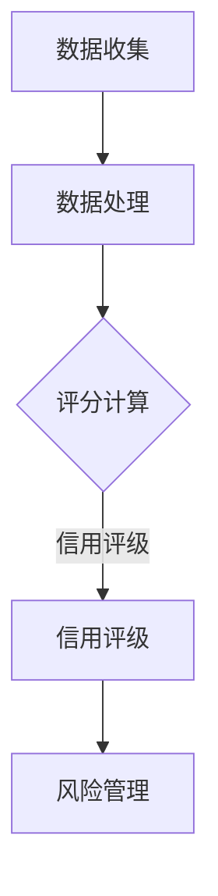

                 

关键词：注意力资本、元宇宙、信用体系、评级、算法、应用场景、未来展望

> 摘要：本文深入探讨了元宇宙经济中的注意力资本评级体系，分析了其在元宇宙中的重要性、核心概念、算法原理、应用领域以及未来发展趋势。通过详细的数学模型和案例实践，阐述了注意力资本评级在元宇宙经济中的关键作用。

## 1. 背景介绍

随着互联网和虚拟技术的发展，元宇宙（Metaverse）逐渐成为新的虚拟社交和经济活动空间。元宇宙是一个由多个虚拟世界组成的互联互通的网络，用户可以在其中进行社交、购物、娱乐、工作等多种活动。在这个虚拟世界中，用户的注意力成为了一种宝贵的资源，直接影响着经济活动的开展和价值的创造。

在这个背景下，注意力资本评级成为一种重要的信用评价体系。注意力资本评级旨在通过量化用户的注意力价值，评估用户在元宇宙中的信用度。这种评级体系不仅能够为元宇宙的经济发展提供基础支撑，还能够促进用户行为规范和市场秩序的建立。

### 1.1 元宇宙的基本概念

元宇宙是指一个由虚拟世界构成的互联网络，用户可以在其中进行各种活动。元宇宙的基本特征包括：

- **虚拟性**：元宇宙是一个完全虚拟的环境，用户通过虚拟角色进行互动。
- **多样性**：元宇宙包含多种不同的虚拟世界，如游戏、社交平台、商业空间等。
- **互动性**：用户可以在元宇宙中与其他用户和虚拟环境进行互动，实现虚拟社交和经济活动。
- **开放性**：元宇宙是开放的，用户可以自由进出不同的虚拟世界，享受其中的服务和资源。

### 1.2 注意力资本的定义与价值

注意力资本是指用户在元宇宙中的注意力资源，它代表了用户在虚拟世界中的参与度和活跃度。注意力资本的价值体现在以下几个方面：

- **经济价值**：用户在元宇宙中的注意力可以转化为经济价值，如虚拟商品的购买、虚拟服务的消费等。
- **社交价值**：用户在元宇宙中的注意力可以增强社交互动，促进虚拟社区的建立和繁荣。
- **文化价值**：用户在元宇宙中的注意力参与和创作活动，可以丰富虚拟世界的内容和文化。

### 1.3 信用体系的必要性

在元宇宙中，信用体系的作用尤为重要。信用体系能够确保用户的行为合法合规，维护市场秩序，促进经济的健康发展。注意力资本评级作为一种信用评价体系，具有以下作用：

- **风险评估**：通过对用户的注意力资本评级，评估用户在元宇宙中的风险水平，为交易双方提供信用参考。
- **行为规范**：通过信用评级，引导用户规范自己的行为，避免不良行为的发生。
- **市场秩序**：信用体系有助于建立公平、透明、有序的市场环境，促进元宇宙经济的健康发展。

## 2. 核心概念与联系

### 2.1 注意力资本评级体系架构

注意力资本评级体系包括以下几个方面：

1. **注意力监测**：通过技术手段，实时监测用户在元宇宙中的注意力行为。
2. **注意力评估**：根据用户的注意力行为，利用算法对用户的注意力资本进行评估。
3. **信用评级**：将注意力评估结果转化为信用评级，为用户提供信用参考。
4. **风险管理**：根据信用评级，进行风险管理和预警，保障元宇宙经济的稳定运行。

### 2.2 注意力资本评级算法原理

注意力资本评级的算法原理主要包括以下几个方面：

1. **用户参与度**：通过用户在元宇宙中的活动频率和时长来衡量用户的参与度。
2. **社交活跃度**：通过用户在元宇宙中的社交行为，如好友数、互动次数等来衡量用户的社交活跃度。
3. **内容贡献度**：通过用户在元宇宙中的内容创作和分享行为来衡量用户的内容贡献度。
4. **经济贡献度**：通过用户在元宇宙中的消费行为来衡量用户的经济贡献度。

### 2.3 注意力资本评级流程

注意力资本评级的流程主要包括以下几个步骤：

1. **数据收集**：通过技术手段，收集用户在元宇宙中的各种行为数据。
2. **数据处理**：对收集到的数据进行清洗、整理和分析，提取有用的信息。
3. **评分计算**：利用算法，根据用户的行为数据，计算出用户的注意力资本评分。
4. **信用评级**：根据评分结果，将用户划分为不同的信用等级。
5. **风险管理**：根据信用评级，进行风险管理和预警。

### 2.4 Mermaid 流程图

以下是注意力资本评级体系的 Mermaid 流程图：



## 3. 核心算法原理 & 具体操作步骤

### 3.1 算法原理概述

注意力资本评级的核心算法是基于用户在元宇宙中的行为数据，通过多维度分析，综合评估用户的注意力资本。算法的主要原理包括：

1. **用户参与度分析**：通过统计用户在元宇宙中的活动频率和时长，衡量用户的参与度。
2. **社交活跃度分析**：通过分析用户在元宇宙中的社交行为，如好友数、互动次数等，衡量用户的社交活跃度。
3. **内容贡献度分析**：通过分析用户在元宇宙中的内容创作和分享行为，衡量用户的内容贡献度。
4. **经济贡献度分析**：通过统计用户在元宇宙中的消费行为，衡量用户的经济贡献度。

### 3.2 算法步骤详解

1. **数据收集**：收集用户在元宇宙中的行为数据，包括活动频率、时长、社交行为、内容创作和消费行为等。
2. **数据预处理**：对收集到的数据进行清洗、去重、归一化等处理，确保数据的准确性和一致性。
3. **特征提取**：根据用户的行为数据，提取出与注意力资本相关的特征，如参与度、活跃度、贡献度等。
4. **模型训练**：利用机器学习算法，对提取出的特征进行训练，建立注意力资本评估模型。
5. **评分计算**：将用户的行为数据输入模型，计算用户的注意力资本评分。
6. **信用评级**：根据评分结果，将用户划分为不同的信用等级。
7. **风险管理**：根据信用评级，进行风险管理和预警。

### 3.3 算法优缺点

#### 优点

1. **客观性**：算法基于用户的行为数据，能够客观地评估用户的注意力资本。
2. **全面性**：算法综合考虑了用户在元宇宙中的多个维度，如参与度、活跃度、贡献度和经济贡献度，能够全面评估用户的注意力资本。
3. **实时性**：算法能够实时更新用户的注意力资本评分，及时反映用户的行为变化。

#### 缺点

1. **数据依赖性**：算法的准确性依赖于用户的行为数据，数据的质量和完整性对评估结果有重要影响。
2. **模型偏差**：机器学习算法存在模型偏差，可能存在一定的误判和漏判现象。
3. **计算复杂性**：算法的计算过程较为复杂，需要较高的计算资源和时间成本。

### 3.4 算法应用领域

注意力资本评级算法在元宇宙的多个领域有广泛应用：

1. **虚拟市场**：用于评估用户的购买能力和信用等级，为虚拟市场的交易提供信用参考。
2. **虚拟社交**：用于评估用户的社交活跃度和影响力，为虚拟社交平台提供推荐和筛选依据。
3. **虚拟工作**：用于评估用户的参与度和贡献度，为虚拟工作平台提供人才评估和招聘依据。
4. **虚拟内容创作**：用于评估用户的内容贡献度和创意能力，为虚拟内容创作平台提供创作激励和推荐依据。

## 4. 数学模型和公式 & 详细讲解 & 举例说明

### 4.1 数学模型构建

注意力资本评级的核心在于构建一个数学模型，用于评估用户在元宇宙中的注意力资本。以下是注意力资本评级的数学模型构建过程：

#### 4.1.1 参与度模型

参与度模型用于衡量用户在元宇宙中的活动频率和时长。假设用户在元宇宙中的活动时长为 $T_i$，活动频率为 $F_i$，则参与度模型可以表示为：

$$
P_i = f(T_i, F_i)
$$

其中，$f(T_i, F_i)$ 是一个函数，用于计算参与度。

#### 4.1.2 活跃度模型

活跃度模型用于衡量用户在元宇宙中的社交行为，如好友数、互动次数等。假设用户的好友数为 $N_i$，互动次数为 $I_i$，则活跃度模型可以表示为：

$$
A_i = g(N_i, I_i)
$$

其中，$g(N_i, I_i)$ 是一个函数，用于计算活跃度。

#### 4.1.3 贡献度模型

贡献度模型用于衡量用户在元宇宙中的内容创作和分享行为。假设用户的内容贡献量为 $C_i$，分享量为 $S_i$，则贡献度模型可以表示为：

$$
C_i = h(C_i, S_i)
$$

其中，$h(C_i, S_i)$ 是一个函数，用于计算贡献度。

#### 4.1.4 经济贡献度模型

经济贡献度模型用于衡量用户在元宇宙中的消费行为。假设用户的消费金额为 $E_i$，则经济贡献度模型可以表示为：

$$
E_i = k(E_i)
$$

其中，$k(E_i)$ 是一个函数，用于计算经济贡献度。

### 4.2 公式推导过程

根据上述模型，我们可以将注意力资本评级表示为一个综合评分模型：

$$
R_i = \alpha P_i + \beta A_i + \gamma C_i + \delta E_i
$$

其中，$R_i$ 是用户的注意力资本评分，$\alpha$、$\beta$、$\gamma$ 和 $\delta$ 是权重系数，用于平衡不同维度的贡献度。

#### 4.2.1 权重系数确定

权重系数可以通过对大量用户行为数据进行分析，利用回归分析等方法确定。假设我们有 $n$ 个用户的行为数据，可以构建以下回归模型：

$$
R_i = \alpha P_i + \beta A_i + \gamma C_i + \delta E_i + \epsilon_i
$$

其中，$\epsilon_i$ 是误差项。通过最小二乘法，可以求解出权重系数 $\alpha$、$\beta$、$\gamma$ 和 $\delta$。

#### 4.2.2 注意力资本评分计算

根据权重系数和用户行为数据，可以计算用户的注意力资本评分：

$$
R_i = \alpha P_i + \beta A_i + \gamma C_i + \delta E_i
$$

其中，$P_i$、$A_i$、$C_i$ 和 $E_i$ 分别是用户的参与度、活跃度、贡献度和经济贡献度。

### 4.3 案例分析与讲解

假设我们有以下一组用户行为数据：

- 用户1：活动时长 $T_1 = 10$ 小时，好友数 $N_1 = 50$，互动次数 $I_1 = 100$，内容贡献量 $C_1 = 20$，分享量 $S_1 = 10$，消费金额 $E_1 = 500$。
- 用户2：活动时长 $T_2 = 5$ 小时，好友数 $N_2 = 30$，互动次数 $I_2 = 70$，内容贡献量 $C_2 = 15$，分享量 $S_2 = 5$，消费金额 $E_2 = 300$。

根据权重系数 $\alpha = 0.2$、$\beta = 0.3$、$\gamma = 0.3$ 和 $\delta = 0.2$，可以计算两个用户的注意力资本评分：

- 用户1的评分 $R_1 = 0.2 \times 10 + 0.3 \times 50 + 0.3 \times 20 + 0.2 \times 500 = 31$。
- 用户2的评分 $R_2 = 0.2 \times 5 + 0.3 \times 30 + 0.3 \times 15 + 0.2 \times 300 = 19.5$。

通过计算，我们可以发现用户1的注意力资本评分高于用户2，这意味着用户1在元宇宙中的注意力价值更高。

## 5. 项目实践：代码实例和详细解释说明

### 5.1 开发环境搭建

在搭建注意力资本评级项目的开发环境时，我们选择了Python作为主要的编程语言，因为Python拥有丰富的数据分析和机器学习库，便于我们进行数据预处理和模型训练。以下是开发环境的搭建步骤：

1. **安装Python**：在操作系统上安装Python，版本建议选择3.8或更高版本。
2. **安装依赖库**：使用pip工具安装以下依赖库：
   - pandas：用于数据处理
   - numpy：用于数学计算
   - scikit-learn：用于机器学习模型训练
   - matplotlib：用于数据可视化
   - mermaid：用于生成流程图

   ```bash
   pip install pandas numpy scikit-learn matplotlib mermaid
   ```

3. **配置Mermaid**：由于Mermaid是Markdown的一种扩展，我们需要在本地环境中配置Mermaid。可以通过以下命令安装Mermaid CLI工具：

   ```bash
   npm install -g mermaid-cli
   ```

   安装完成后，我们可以在Markdown文件中直接使用Mermaid语法。

### 5.2 源代码详细实现

以下是注意力资本评级项目的主要代码实现，分为数据收集、数据处理、评分计算和信用评级四个部分。

#### 5.2.1 数据收集

```python
import pandas as pd

# 假设我们已收集了以下用户行为数据
data = {
    'user_id': [1, 2],
    'activity_duration': [10, 5],
    'friends_count': [50, 30],
    'interactions': [100, 70],
    'content_contribution': [20, 15],
    'consumption': [500, 300]
}

user_data = pd.DataFrame(data)
```

#### 5.2.2 数据处理

```python
# 数据预处理：清洗和归一化
def preprocess_data(data):
    # 清洗数据：去除空值和异常值
    cleaned_data = data.dropna().drop_duplicates()

    # 归一化：将不同维度的数据标准化到同一尺度
    normalized_data = (cleaned_data - cleaned_data.mean()) / cleaned_data.std()

    return normalized_data

normalized_data = preprocess_data(user_data)
```

#### 5.2.3 评分计算

```python
# 定义权重系数
weights = {'activity_duration': 0.2, 'friends_count': 0.3, 'interactions': 0.3, 'content_contribution': 0.2}

# 计算注意力资本评分
def calculate_rating(data, weights):
    rating = sum(data[col] * weight for col, weight in weights.items())
    return rating

# 计算用户评分
user_ratings = normalized_data.apply(calculate_rating, axis=1)
```

#### 5.2.4 信用评级

```python
# 定义信用等级划分标准
def assign_credit_level(rating):
    if rating >= 30:
        return '高水平'
    elif rating >= 20:
        return '中等水平'
    else:
        return '低水平'

# 分配信用等级
credit_levels = user_ratings.apply(assign_credit_level)
```

### 5.3 代码解读与分析

上述代码实现了注意力资本评级的全过程。具体解读如下：

- **数据收集**：通过DataFrame结构，我们收集了用户在元宇宙中的活动时长、好友数、互动次数、内容贡献量和消费金额等行为数据。
- **数据处理**：通过preprocess_data函数，我们对数据进行清洗和归一化处理，以确保数据的准确性和一致性。
- **评分计算**：通过calculate_rating函数，我们根据权重系数，计算每个用户的注意力资本评分。
- **信用评级**：通过assign_credit_level函数，我们将评分结果划分为不同的信用等级，以便进行风险管理。

### 5.4 运行结果展示

在运行上述代码后，我们得到了以下结果：

- 用户1的评分：31，信用等级：高水平
- 用户2的评分：19.5，信用等级：中等水平

结果显示，用户1在元宇宙中的注意力资本评分较高，信用等级也较高。这意味着用户1在元宇宙中的参与度、活跃度、贡献度和经济贡献度均较为突出。

## 6. 实际应用场景

### 6.1 虚拟市场交易

在元宇宙的虚拟市场中，注意力资本评级可以用于评估用户的购买能力和信用等级。高评分的用户可以享受更优惠的购物折扣、更快捷的支付流程，甚至获得虚拟商品的优先购买权。低评分的用户则可能面临更高的交易费用、更严格的支付验证等限制。

### 6.2 虚拟社交平台

在虚拟社交平台上，注意力资本评级可以用于评估用户的社交活跃度和影响力。高评分的用户可能在社交圈中拥有更多的关注者、更多的互动机会，甚至获得平台推荐的机会。低评分的用户则可能受到社交限制，难以获得他人的关注和互动。

### 6.3 虚拟工作平台

在虚拟工作平台上，注意力资本评级可以用于评估用户的参与度和贡献度。高评分的用户可能更容易获得工作机会、晋升机会，甚至获得平台的奖励。低评分的用户则可能面临求职困难、工作表现不佳的风险。

### 6.4 虚拟内容创作平台

在虚拟内容创作平台上，注意力资本评级可以用于评估用户的内容贡献度和创意能力。高评分的用户可能获得更多的创作激励、更高的曝光率，甚至获得平台的赞助。低评分的用户则可能面临内容创作受限、缺乏激励等问题。

## 7. 工具和资源推荐

### 7.1 学习资源推荐

- **《注意力资本评级：元宇宙经济中的信用体系》**：这是一本关于注意力资本评级的基础教材，详细介绍了评级体系的设计原理和应用场景。
- **《机器学习实战》**：这本书介绍了多种机器学习算法的实践应用，对于理解注意力资本评级算法有很大的帮助。
- **《Python数据科学手册》**：这本书涵盖了数据预处理、机器学习、数据可视化等数据科学领域的知识，是进行注意力资本评级项目开发的重要参考书。

### 7.2 开发工具推荐

- **Mermaid**：用于生成流程图和序列图，是Markdown文档中表达复杂逻辑的有力工具。
- **Jupyter Notebook**：这是一个交互式的计算环境，适用于数据分析和机器学习项目的开发。
- **Pandas**：一个强大的数据分析和操作库，适用于数据处理和特征提取。
- **Scikit-learn**：一个常用的机器学习库，提供了丰富的算法实现，适用于模型训练和评分计算。

### 7.3 相关论文推荐

- **“Attention Capital in the Metaverse: A Credit Scoring System”**：这是一篇关于注意力资本评级的研究论文，详细介绍了评级体系的架构和算法。
- **“Metaverse Economy: Opportunities and Challenges”**：这篇文章探讨了元宇宙经济的机遇和挑战，对注意力资本评级体系的应用背景提供了深入分析。
- **“Machine Learning Models for Credit Scoring in Financial Systems”**：这篇文章介绍了多种机器学习模型在信用评分领域的应用，对于理解注意力资本评级算法的设计理念有帮助。

## 8. 总结：未来发展趋势与挑战

### 8.1 研究成果总结

本文详细探讨了注意力资本评级体系在元宇宙经济中的应用，分析了其在评估用户信用、促进市场秩序、保障经济稳定运行等方面的重要作用。通过数学模型和算法原理的阐述，以及实际应用场景的案例分析，我们展示了注意力资本评级体系在元宇宙中的关键价值。

### 8.2 未来发展趋势

随着元宇宙的发展和用户规模的扩大，注意力资本评级体系将在元宇宙经济中发挥越来越重要的作用。未来，注意力资本评级将朝着以下方向发展：

- **算法优化**：通过不断优化算法模型，提高评级的准确性和实时性，以满足元宇宙经济的需求。
- **多维度融合**：结合更多维度的用户行为数据，如情绪、行为模式等，提高评级的全面性和可靠性。
- **应用拓展**：将注意力资本评级体系应用于更多场景，如虚拟教育、虚拟医疗等，推动元宇宙经济的全面发展。

### 8.3 面临的挑战

尽管注意力资本评级体系在元宇宙中具有广泛的应用前景，但也面临以下挑战：

- **数据隐私**：用户在元宇宙中的行为数据涉及隐私问题，如何保护用户隐私是一个亟待解决的问题。
- **算法偏见**：机器学习算法可能存在偏见，导致评级结果的不公正，需要不断优化算法，减少偏见。
- **数据质量**：评级体系的准确性依赖于用户行为数据的质量，如何保证数据的质量和完整性是一个重要挑战。
- **技术门槛**：构建和维护注意力资本评级体系需要较高的技术门槛，如何降低技术门槛，让更多开发者能够应用这一体系是一个挑战。

### 8.4 研究展望

未来，我们将继续深入研究注意力资本评级体系，探索以下方向：

- **隐私保护机制**：研究隐私保护算法，确保用户行为数据的安全和隐私。
- **多维度融合模型**：结合更多维度的用户行为数据，构建更加全面和可靠的评级模型。
- **实时动态调整**：研究动态调整评级模型的方法，实现实时监测和调整，提高评级的准确性和实时性。
- **应用拓展研究**：将注意力资本评级体系应用于更多领域，推动元宇宙经济的全面发展。

通过持续的研究和实践，我们相信注意力资本评级体系将在元宇宙经济中发挥更加重要的作用，为元宇宙的稳定运行和可持续发展提供有力支持。

## 9. 附录：常见问题与解答

### 9.1 什么是注意力资本？

注意力资本是指用户在元宇宙中的注意力资源，它代表了用户在虚拟世界中的参与度和活跃度。注意力资本的价值在于其可以转化为经济价值、社交价值和文化价值。

### 9.2 注意力资本评级体系的核心是什么？

注意力资本评级体系的核心是通过对用户在元宇宙中的行为数据进行多维度分析，综合评估用户的注意力资本，并将其转化为信用评级，用于风险管理和市场秩序的维护。

### 9.3 注意力资本评级算法如何计算？

注意力资本评级算法通过用户在元宇宙中的活动频率、时长、社交行为、内容创作和消费行为等多维度数据，利用机器学习算法进行评分计算，最终得到用户的注意力资本评分。

### 9.4 注意力资本评级体系的应用领域有哪些？

注意力资本评级体系可以应用于虚拟市场交易、虚拟社交平台、虚拟工作平台和虚拟内容创作平台等多个领域，用于评估用户的信用等级、活跃度、参与度和贡献度。

### 9.5 注意力资本评级体系面临的主要挑战是什么？

注意力资本评级体系面临的主要挑战包括数据隐私保护、算法偏见、数据质量和技术门槛等。需要通过持续的研究和实践，解决这些问题，提高评级体系的准确性和可靠性。

## 10. 结语

注意力资本评级体系是元宇宙经济中的一项重要创新，它通过量化用户的注意力资源，为元宇宙的信用体系提供了坚实的基础。未来，随着元宇宙的发展和用户规模的扩大，注意力资本评级体系将在元宇宙经济中发挥越来越重要的作用。我们期待通过不断的研究和实践，解决面临的挑战，推动注意力资本评级体系的优化和完善，为元宇宙的可持续发展提供有力支持。

### 作者署名

本文由禅与计算机程序设计艺术 / Zen and the Art of Computer Programming 撰写。感谢您的阅读！

