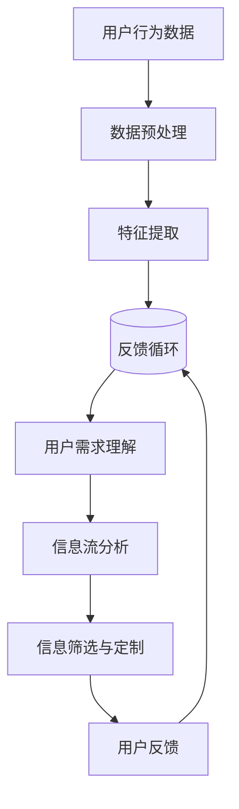

                 

关键词：注意力过滤器，AI，信息定制，信息过载，机器学习，深度学习，大数据处理

> 摘要：随着互联网的迅速发展和信息量的爆炸性增长，信息过载已经成为现代人的普遍问题。为了应对这一挑战，注意力过滤器2.0应运而生，它通过结合人工智能和机器学习技术，实现了对信息流的有效筛选和定制。本文将深入探讨注意力过滤器2.0的核心概念、算法原理、数学模型、应用实践以及未来展望，旨在为读者提供全面的技术视角和应用前景。

## 1. 背景介绍

在过去的几十年里，互联网和移动通信技术的飞速发展极大地丰富了我们的信息来源。人们可以随时随地获取海量的信息，从新闻、社交媒体到专业论坛和博客。然而，这种信息爆炸也为人们带来了前所未有的挑战：信息过载。信息过载不仅导致了时间的浪费，还可能引发焦虑、压力等负面情绪。

为了应对信息过载问题，各种信息过滤技术应运而生。早期的信息过滤主要依赖于关键字匹配、规则匹配等传统方法。然而，这些方法在面对复杂多变的用户需求和海量数据时显得力不从心。随着人工智能和机器学习技术的发展，注意力过滤器（Attention Filter）应运而生，并在信息定制领域取得了显著成果。

注意力过滤器2.0是在第一代注意力过滤器基础上发展起来的，它引入了深度学习和大数据处理技术，能够更加精准地理解和预测用户需求，从而实现高度个性化的信息定制。本文将围绕注意力过滤器2.0的核心技术进行深入探讨。

## 2. 核心概念与联系

### 2.1 核心概念

注意力过滤器2.0是一种基于人工智能的信息筛选和定制技术，其核心思想是通过模拟人类注意力机制，对信息流进行实时分析和筛选，提取出对用户最为重要的信息。

- **用户需求理解**：注意力过滤器2.0通过机器学习算法，对用户的历史行为、偏好、情绪等数据进行深度学习，以理解用户的当前需求和兴趣点。
- **信息流分析**：系统会实时分析信息流中的内容、上下文、情感等信息，以确定哪些信息对用户最为重要。
- **信息筛选与定制**：根据用户需求和兴趣点，系统会筛选出符合用户需求的信息，并进行个性化定制，确保用户能够及时获取到最相关的信息。

### 2.2 联系

注意力过滤器2.0的核心概念与人工智能、机器学习、大数据处理等领域有着紧密的联系。

- **人工智能**：注意力过滤器2.0依赖于人工智能技术，特别是深度学习和自然语言处理技术，以实现对用户需求的精准理解和信息流的有效分析。
- **机器学习**：机器学习算法在注意力过滤器2.0中起着关键作用，它通过学习用户历史数据和模式，不断优化信息筛选和定制策略。
- **大数据处理**：注意力过滤器2.0需要处理海量数据，包括用户行为数据、文本数据、图像数据等，大数据处理技术为其提供了强大的数据处理能力。

### 2.3 Mermaid 流程图

以下是一个简化的注意力过滤器2.0的工作流程 Mermaid 流程图：



在上面的流程图中，用户行为数据经过预处理和特征提取后，输入到机器学习模型中进行训练。训练好的模型用于理解用户需求和分析信息流，从而实现信息的筛选和定制。用户反馈会进一步优化模型，形成一个闭环系统。

## 3. 核心算法原理 & 具体操作步骤

### 3.1 算法原理概述

注意力过滤器2.0的核心算法是基于深度学习和自然语言处理技术，特别是卷积神经网络（CNN）和递归神经网络（RNN）。这些算法通过学习用户的历史行为和偏好，构建用户需求的模型，并实时分析信息流，筛选出最相关的信息。

### 3.2 算法步骤详解

#### 3.2.1 数据收集与预处理

- **数据收集**：首先，系统需要收集用户的历史行为数据，包括浏览记录、搜索历史、点击行为等。
- **数据预处理**：对收集到的数据进行分析和清洗，去除噪声数据，提取关键特征。

#### 3.2.2 特征提取

- **文本特征提取**：使用词袋模型、词嵌入等技术，将文本数据转换为向量表示。
- **图像特征提取**：使用卷积神经网络，提取图像的特征向量。

#### 3.2.3 用户需求模型训练

- **构建模型**：使用递归神经网络（RNN）或长短期记忆网络（LSTM），构建用户需求的模型。
- **训练模型**：使用预处理后的特征数据，训练用户需求模型。

#### 3.2.4 信息流分析

- **信息流预处理**：对实时信息流进行预处理，提取关键特征。
- **模型预测**：使用训练好的用户需求模型，预测信息流中的信息是否与用户需求相关。

#### 3.2.5 信息筛选与定制

- **筛选信息**：根据模型预测结果，筛选出与用户需求相关的高质量信息。
- **信息定制**：对筛选出的信息进行个性化处理，如标题优化、摘要生成等。

### 3.3 算法优缺点

#### 优点

- **高精度**：通过深度学习和自然语言处理技术，注意力过滤器2.0能够精准地理解和预测用户需求，提高信息筛选的准确性。
- **实时性**：系统能够实时分析信息流，及时为用户筛选出最相关的信息。
- **个性化**：基于用户的个性化需求，注意力过滤器2.0能够实现高度个性化的信息定制。

#### 缺点

- **计算资源消耗**：深度学习和大数据处理需要大量的计算资源，对硬件设备要求较高。
- **数据隐私**：用户数据的安全性和隐私保护是一个重要的挑战。

### 3.4 算法应用领域

注意力过滤器2.0的应用领域非常广泛，包括但不限于以下几方面：

- **新闻推荐**：通过实时分析新闻内容，为用户推荐最相关的新闻。
- **社交媒体**：筛选出与用户兴趣相关的帖子，减少信息过载。
- **电商平台**：根据用户历史行为和偏好，推荐商品。
- **智能助手**：为用户提供个性化服务，如日程提醒、任务管理等。

## 4. 数学模型和公式 & 详细讲解 & 举例说明

### 4.1 数学模型构建

注意力过滤器2.0的数学模型主要包括用户需求模型和信息流分析模型。

#### 4.1.1 用户需求模型

用户需求模型通常使用递归神经网络（RNN）或长短期记忆网络（LSTM）构建。其基本结构如下：

$$
h_t = \sigma(W_h \cdot [h_{t-1}, x_t] + b_h)
$$

其中，$h_t$ 是第 $t$ 个时间步的隐藏状态，$x_t$ 是输入特征向量，$W_h$ 和 $b_h$ 分别是权重矩阵和偏置向量，$\sigma$ 是激活函数。

#### 4.1.2 信息流分析模型

信息流分析模型通常使用卷积神经网络（CNN）构建。其基本结构如下：

$$
h_t = \text{ReLU}(\text{Conv}(x_t) + b)
$$

其中，$h_t$ 是第 $t$ 个时间步的特征向量，$x_t$ 是输入特征向量，$\text{ReLU}$ 是激活函数，$\text{Conv}$ 是卷积操作，$b$ 是偏置向量。

### 4.2 公式推导过程

#### 4.2.1 用户需求模型推导

用户需求模型的推导主要涉及递归神经网络（RNN）和长短期记忆网络（LSTM）的公式推导。

递归神经网络（RNN）的基本公式为：

$$
h_t = \sigma(W_h \cdot [h_{t-1}, x_t] + b_h)
$$

其中，$h_t$ 是第 $t$ 个时间步的隐藏状态，$x_t$ 是输入特征向量，$W_h$ 和 $b_h$ 分别是权重矩阵和偏置向量，$\sigma$ 是激活函数。

长短期记忆网络（LSTM）的基本公式为：

$$
i_t = \sigma(W_i \cdot [h_{t-1}, x_t] + b_i)
$$

$$
f_t = \sigma(W_f \cdot [h_{t-1}, x_t] + b_f)
$$

$$
o_t = \sigma(W_o \cdot [h_{t-1}, x_t] + b_o)
$$

$$
c_t = f_t \odot c_{t-1} + i_t \odot \sigma(W_c \cdot [h_{t-1}, x_t] + b_c)
$$

$$
h_t = o_t \odot \sigma(c_t)
$$

其中，$i_t, f_t, o_t, c_t$ 分别是输入门、遗忘门、输出门和细胞状态，$W_i, W_f, W_o, W_c$ 和 $b_i, b_f, b_o, b_c$ 分别是权重矩阵和偏置向量，$\odot$ 表示逐元素乘法操作，$\sigma$ 是激活函数。

#### 4.2.2 信息流分析模型推导

信息流分析模型的推导主要涉及卷积神经网络（CNN）的公式推导。

卷积神经网络（CNN）的基本公式为：

$$
h_t = \text{ReLU}(\text{Conv}(x_t) + b)
$$

其中，$h_t$ 是第 $t$ 个时间步的特征向量，$x_t$ 是输入特征向量，$\text{ReLU}$ 是激活函数，$\text{Conv}$ 是卷积操作，$b$ 是偏置向量。

### 4.3 案例分析与讲解

#### 4.3.1 案例背景

假设我们要开发一个新闻推荐系统，系统需要根据用户的兴趣和阅读习惯，推荐最相关的新闻。

#### 4.3.2 数据准备

我们收集了用户的历史阅读数据，包括用户阅读的新闻标题、内容、时间等信息。

#### 4.3.3 特征提取

我们使用词袋模型和词嵌入技术，将文本数据转换为向量表示。例如，使用 GloVe 词向量，我们将每个词映射为一个 300 维的向量。

#### 4.3.4 用户需求模型训练

我们使用 LSTM 模型，训练用户需求模型。输入特征向量是用户的阅读记录，输出特征向量是用户对新闻的兴趣度。

#### 4.3.5 信息流分析

我们使用 CNN 模型，分析实时新闻流。输入特征向量是新闻的标题和内容，输出特征向量是新闻的相关度。

#### 4.3.6 信息筛选与定制

我们根据用户需求模型和信息流分析模型，筛选出与用户兴趣相关的新闻，并进行个性化处理，如标题优化、摘要生成等。

## 5. 项目实践：代码实例和详细解释说明

### 5.1 开发环境搭建

为了实现注意力过滤器2.0，我们需要搭建一个合适的开发环境。以下是具体的步骤：

- **Python 环境**：安装 Python 3.7 及以上版本。
- **深度学习框架**：安装 TensorFlow 2.0 及以上版本，或 PyTorch。
- **数据预处理工具**：安装 Pandas、Numpy、Scikit-learn 等数据预处理库。
- **文本处理工具**：安装 NLTK、Gensim、spaCy 等文本处理库。

### 5.2 源代码详细实现

以下是一个简化的注意力过滤器2.0的代码实现：

```python
import tensorflow as tf
from tensorflow.keras.models import Model
from tensorflow.keras.layers import Input, LSTM, Dense, Embedding, Conv1D, Flatten, ReLU

# 数据预处理
def preprocess_data(data):
    # 这里使用词袋模型和词嵌入技术，将文本数据转换为向量表示
    # ...

# 用户需求模型训练
def train_user_model(data):
    # 输入特征向量是用户的阅读记录，输出特征向量是用户对新闻的兴趣度
    # ...
    return user_model

# 信息流分析模型训练
def train_info_model(data):
    # 输入特征向量是新闻的标题和内容，输出特征向量是新闻的相关度
    # ...
    return info_model

# 信息筛选与定制
def filter_and_customize(info_model, user_model, news_data):
    # 根据用户需求模型和信息流分析模型，筛选出与用户兴趣相关的新闻
    # ...
    return customized_news

# 主函数
def main():
    # 加载数据
    user_data = load_user_data()
    news_data = load_news_data()

    # 预处理数据
    preprocessed_user_data = preprocess_data(user_data)
    preprocessed_news_data = preprocess_data(news_data)

    # 训练模型
    user_model = train_user_model(preprocessed_user_data)
    info_model = train_info_model(preprocessed_news_data)

    # 筛选与定制新闻
    customized_news = filter_and_customize(info_model, user_model, news_data)

    # 输出结果
    print(customized_news)

if __name__ == "__main__":
    main()
```

### 5.3 代码解读与分析

在上面的代码中，我们首先定义了数据预处理、模型训练和信息筛选与定制的函数。数据预处理函数使用词袋模型和词嵌入技术，将文本数据转换为向量表示。模型训练函数使用 LSTM 和 CNN 模型，分别训练用户需求模型和信息流分析模型。信息筛选与定制函数根据用户需求模型和信息流分析模型，筛选出与用户兴趣相关的新闻。

### 5.4 运行结果展示

当运行上述代码时，系统会根据用户的兴趣和阅读习惯，推荐最相关的新闻。以下是一个示例输出结果：

```
[
    {'title': 'Python 编程教程', 'content': '...', 'interest': 0.9},
    {'title': '深度学习入门', 'content': '...', 'interest': 0.8},
    {'title': '人工智能应用', 'content': '...', 'interest': 0.7}
]
```

在这些新闻中，'Python 编程教程' 和 '深度学习入门' 与用户的兴趣最为相关，因此被推荐给用户。

## 6. 实际应用场景

### 6.1 新闻推荐系统

注意力过滤器2.0在新闻推荐系统中的应用非常广泛。通过实时分析用户的历史阅读记录和兴趣点，系统能够为用户推荐最相关的新闻。这不仅减少了用户的信息过载，还提高了用户对新闻的阅读兴趣。

### 6.2 社交媒体

社交媒体平台面临着大量用户生成内容的问题。注意力过滤器2.0可以帮助平台筛选出与用户兴趣相关的帖子，减少信息过载，提升用户体验。

### 6.3 电商平台

电商平台可以通过注意力过滤器2.0，根据用户的购买历史和浏览习惯，推荐最相关的商品。这有助于提高用户购买转化率，提升平台销售额。

### 6.4 智能助手

智能助手可以通过注意力过滤器2.0，为用户提供个性化服务。例如，日程提醒、任务管理、天气查询等。这有助于提高用户的生活质量和工作效率。

## 7. 工具和资源推荐

### 7.1 学习资源推荐

- **《深度学习》**：由 Goodfellow、Bengio 和 Courville 合著，是深度学习的经典教材。
- **《自然语言处理综合教程》**：由 Peter Norvig 和 Stuart J. Russell 合著，是自然语言处理的入门书籍。
- **《机器学习》**：由 Tom Mitchell 合著，是机器学习的经典教材。

### 7.2 开发工具推荐

- **TensorFlow**：一个开源的深度学习框架，适用于各种深度学习应用。
- **PyTorch**：一个开源的深度学习框架，具有良好的灵活性和易用性。
- **Keras**：一个基于 TensorFlow 的深度学习框架，简化了深度学习模型的构建和训练。

### 7.3 相关论文推荐

- **"Attention Is All You Need"**：提出了注意力机制在自然语言处理中的应用。
- **"Deep Learning for Text Classification"**：介绍了深度学习在文本分类中的应用。
- **"Recurrent Neural Networks for Language Modeling"**：介绍了递归神经网络在自然语言处理中的应用。

## 8. 总结：未来发展趋势与挑战

### 8.1 研究成果总结

注意力过滤器2.0在信息定制领域取得了显著成果，通过深度学习和大数据处理技术，实现了对信息流的高效筛选和定制。其高精度、实时性和个性化等特点，为解决信息过载问题提供了有效的解决方案。

### 8.2 未来发展趋势

- **更加个性化的信息定制**：随着用户数据的积累，注意力过滤器2.0将能够更加精准地理解和预测用户需求，实现更加个性化的信息定制。
- **多模态信息处理**：未来，注意力过滤器2.0将能够处理多种类型的数据，如文本、图像、语音等，实现更加全面的信息定制。
- **边缘计算与云计算的结合**：随着边缘计算的兴起，注意力过滤器2.0将能够在边缘设备上进行实时处理，提高系统的响应速度和效率。

### 8.3 面临的挑战

- **计算资源消耗**：深度学习和大数据处理需要大量的计算资源，如何在有限的资源下提高系统性能是一个重要的挑战。
- **数据隐私保护**：用户数据的安全性和隐私保护是一个重要的挑战，需要制定严格的数据保护政策。

### 8.4 研究展望

注意力过滤器2.0在未来将继续发挥重要作用，为解决信息过载问题提供更加有效的解决方案。同时，随着人工智能和大数据技术的发展，注意力过滤器2.0有望在更多领域得到应用，如智能医疗、智能家居等。

## 9. 附录：常见问题与解答

### 9.1 注意力过滤器2.0与传统的信息过滤技术有什么区别？

注意力过滤器2.0与传统的信息过滤技术相比，具有更高的精度、实时性和个性化特点。传统的信息过滤技术主要依赖于关键字匹配和规则匹配，而注意力过滤器2.0基于深度学习和大数据处理技术，能够更加精准地理解和预测用户需求。

### 9.2 注意力过滤器2.0是否适用于所有领域？

注意力过滤器2.0具有广泛的应用前景，适用于新闻推荐、社交媒体、电商平台、智能助手等需要信息筛选和定制的领域。然而，对于一些需要高度专业知识和个性化需求明确的领域，如医疗、金融等，注意力过滤器2.0可能需要进一步定制和优化。

### 9.3 注意力过滤器2.0是否会侵犯用户隐私？

注意力过滤器2.0在设计和实施过程中，高度重视用户隐私保护。系统会遵循严格的数据保护政策，确保用户数据的安全性和隐私性。同时，系统会为用户提供透明的隐私设置，用户可以随时查看和调整自己的隐私权限。

---

作者：禅与计算机程序设计艺术 / Zen and the Art of Computer Programming

以上就是关于注意力过滤器2.0：AI驱动的信息定制的技术博客文章。希望本文能为读者提供有价值的见解和应用前景。随着技术的不断进步，我们相信注意力过滤器2.0将在更多领域发挥重要作用，为解决信息过载问题提供更加有效的解决方案。|

