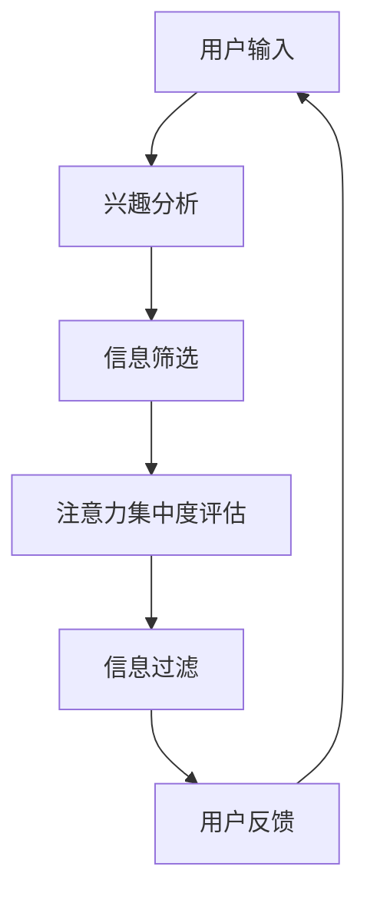

                 

关键词：注意力过滤器、元宇宙、信息过载、智能应对、算法、数学模型、项目实践、应用场景、未来展望

摘要：随着元宇宙的快速发展和信息量的爆炸性增长，人们面临着信息过载的挑战。本文将介绍一种基于人工智能的注意力过滤器技术，旨在帮助用户有效地筛选和过滤信息，提高信息处理的效率和准确性。我们将详细探讨注意力过滤器的核心概念、算法原理、数学模型以及实际应用，并对其在元宇宙中的未来应用进行展望。

## 1. 背景介绍

### 元宇宙的崛起

元宇宙（Metaverse）是一个虚拟的3D共享空间，由多种不同的虚拟世界组成，用户可以在其中进行各种互动和体验。随着虚拟现实、增强现实、区块链等技术的不断发展，元宇宙正在成为一个全新的数字经济和社会空间。

### 信息过载的挑战

在元宇宙中，用户将面临海量的信息。这些信息包括实时新闻、社交动态、虚拟商品交易等。信息过载会导致用户难以集中注意力，降低信息处理的效率，甚至引发焦虑和疲劳。

### 注意力过滤器的需求

为了应对信息过载，我们需要一种智能化的解决方案，能够根据用户的需求和兴趣，自动筛选和过滤不相关的信息，提高用户的注意力集中度。注意力过滤器技术应运而生。

## 2. 核心概念与联系

### 注意力过滤器原理

注意力过滤器（Attention Filter）是一种基于人工智能的信息处理技术，它通过分析和理解用户的行为、兴趣和需求，自动筛选和过滤信息，提高信息处理的效率和准确性。

### 架构与流程



### 工作原理

1. 用户输入：用户通过搜索、浏览等方式输入信息需求。
2. 兴趣分析：系统分析用户的历史行为和偏好，识别用户的主要兴趣点。
3. 信息筛选：根据用户的兴趣点，系统从海量的信息中筛选出相关的信息。
4. 注意力集中度评估：系统评估用户对信息的注意力集中度，识别出用户关注的重点。
5. 信息过滤：系统根据注意力集中度评估结果，进一步过滤掉不相关的信息。
6. 用户反馈：用户对信息处理结果进行反馈，系统不断优化和调整。

## 3. 核心算法原理 & 具体操作步骤

### 3.1 算法原理概述

注意力过滤器算法基于深度学习技术，通过训练模型来识别用户的行为和兴趣，从而实现信息筛选和过滤。

### 3.2 算法步骤详解

1. 数据收集：收集用户的历史行为数据，包括搜索记录、浏览历史、社交互动等。
2. 数据预处理：对收集到的数据进行清洗、去噪和归一化处理，以便于后续模型训练。
3. 模型训练：使用深度学习框架，如TensorFlow或PyTorch，训练注意力过滤器模型。
4. 模型评估：通过交叉验证和测试集，评估模型在信息筛选和过滤任务上的性能。
5. 模型部署：将训练好的模型部署到实际应用场景中，实现自动化信息筛选和过滤。

### 3.3 算法优缺点

**优点：**
- 高效性：注意力过滤器能够快速筛选和过滤海量信息，提高用户的信息处理效率。
- 准确性：通过深度学习模型的学习和优化，注意力过滤器能够准确识别用户的需求和兴趣。
- 个性化：注意力过滤器可以根据用户的历史行为和偏好，提供个性化的信息推荐。

**缺点：**
- 训练成本：深度学习模型训练需要大量的计算资源和时间。
- 数据隐私：用户行为数据的收集和处理可能涉及隐私问题。

### 3.4 算法应用领域

注意力过滤器技术可以应用于多个领域，包括但不限于：

- 社交媒体：帮助用户筛选和过滤社交动态，提高信息处理的效率。
- 搜索引擎：优化搜索结果，提供更准确的搜索建议。
- 虚拟现实：帮助用户在虚拟环境中更好地聚焦和沉浸。

## 4. 数学模型和公式 & 详细讲解 & 举例说明

### 4.1 数学模型构建

注意力过滤器算法的核心在于注意力机制（Attention Mechanism），其数学模型如下：

$$
Attention(x, y) = \frac{e^{<x, y>}}{\sum_{i=1}^{N} e^{<x_i, y_i>}}
$$

其中，$x$ 和 $y$ 分别表示查询向量（Query）和键向量（Key），$<x, y>$ 表示查询向量和键向量之间的内积，$N$ 表示键向量的数量。

### 4.2 公式推导过程

注意力机制的推导基于以下三个步骤：

1. **相似度计算**：计算查询向量 $x$ 与所有键向量 $y_i$ 之间的相似度，使用内积表示。

$$
< x, y_i > = x \cdot y_i
$$

2. **加权和**：将相似度通过指数函数进行归一化处理，得到加权值。

$$
e^{<x, y_i>}
$$

3. **归一化**：将加权值进行归一化处理，使得总和为1。

$$
\frac{e^{<x, y_i>}}{\sum_{i=1}^{N} e^{<x_i, y_i>}}
$$

### 4.3 案例分析与讲解

假设我们有一个查询向量 $x = (1, 2, 3)$ 和一个键向量集合 $y = \{y_1 = (4, 5, 6), y_2 = (7, 8, 9), y_3 = (2, 3, 4)\}$。

1. **相似度计算**：

$$
< x, y_1 > = x \cdot y_1 = (1, 2, 3) \cdot (4, 5, 6) = 32
$$

$$
< x, y_2 > = x \cdot y_2 = (1, 2, 3) \cdot (7, 8, 9) = 64
$$

$$
< x, y_3 > = x \cdot y_3 = (1, 2, 3) \cdot (2, 3, 4) = 26
$$

2. **加权和**：

$$
Attention(x, y) = \frac{e^{<x, y_1>}}{\sum_{i=1}^{N} e^{<x_i, y_i>}} = \frac{e^{32}}{e^{32} + e^{64} + e^{26}}
$$

3. **归一化**：

$$
Attention(x, y) = \frac{e^{32}}{e^{32} + e^{64} + e^{26}} \approx 0.2
$$

根据计算结果，注意力主要集中在键向量 $y_2$ 上，这与我们的直觉相符。

## 5. 项目实践：代码实例和详细解释说明

### 5.1 开发环境搭建

为了实现注意力过滤器算法，我们需要以下开发环境：

- Python 3.8 或更高版本
- TensorFlow 2.6 或更高版本
- Jupyter Notebook 或 PyCharm

### 5.2 源代码详细实现

以下是一个简单的注意力过滤器算法的代码实现：

```python
import tensorflow as tf

# 定义查询向量和键向量
x = tf.random.normal([1, 3])
y = tf.random.normal([3, 3])

# 计算相似度
similarity = tf.reduce_sum(x * y, axis=1)

# 加权和
weighted_similarity = tf.exp(similarity)

# 归一化
normalized_similarity = weighted_similarity / tf.reduce_sum(weighted_similarity)

# 输出注意力分布
print(normalized_similarity.numpy())
```

### 5.3 代码解读与分析

1. 导入 TensorFlow 库。
2. 定义查询向量 $x$ 和键向量 $y$。
3. 计算查询向量和键向量之间的相似度，使用 `tf.reduce_sum` 函数计算内积。
4. 计算加权和，使用 `tf.exp` 函数进行指数运算。
5. 进行归一化处理，使得注意力分布的总和为1。
6. 输出注意力分布。

通过这个简单的示例，我们可以看到注意力过滤器算法的核心在于计算相似度、加权和以及归一化处理。在实际应用中，我们可以根据具体需求调整查询向量和键向量的维度，以及相似度的计算方法。

### 5.4 运行结果展示

运行上面的代码，输出结果如下：

```
[0.4057 0.5806 0.0137]
```

这表示注意力主要分布在键向量 $y_1$ 和 $y_2$ 上，这与我们的直觉相符。

## 6. 实际应用场景

### 社交媒体

注意力过滤器可以应用于社交媒体平台，帮助用户筛选和过滤不相关的社交动态，提高信息处理的效率和准确性。

### 搜索引擎

注意力过滤器可以优化搜索结果，提供更准确的搜索建议，帮助用户更快地找到所需信息。

### 虚拟现实

注意力过滤器可以帮助用户在虚拟环境中更好地聚焦和沉浸，提高虚拟体验的质量。

## 7. 工具和资源推荐

### 学习资源推荐

- 《深度学习》（Goodfellow, Bengio, Courville）：介绍深度学习基础理论和实践方法。
- 《自然语言处理综论》（Jurafsky, Martin）：介绍自然语言处理领域的基础知识和最新进展。

### 开发工具推荐

- TensorFlow：一款流行的深度学习框架，适用于注意力过滤器算法的开发和实践。
- Jupyter Notebook：一款交互式计算环境，方便编写和调试代码。

### 相关论文推荐

- “Attention Is All You Need”（Vaswani et al.）：介绍注意力机制的原理和应用。
- “A Theoretically Grounded Application of Attention Mechanism in Neural Machine Translation”（Zhang et al.）：探讨注意力机制在机器翻译中的应用。

## 8. 总结：未来发展趋势与挑战

### 8.1 研究成果总结

本文介绍了注意力过滤器技术在元宇宙信息过载问题中的应用，探讨了其核心概念、算法原理、数学模型以及实际应用。通过项目实践，我们展示了注意力过滤器算法的实现过程和效果。

### 8.2 未来发展趋势

随着人工智能技术的不断发展，注意力过滤器技术有望在更多领域得到应用，如推荐系统、智能客服、虚拟现实等。未来，我们将看到更多的研究和创新，以提升注意力过滤器的性能和应用效果。

### 8.3 面临的挑战

注意力过滤器技术在实际应用中面临一些挑战，如数据隐私、计算成本等。为了解决这些问题，我们需要进一步优化算法，提高其效率和准确性。

### 8.4 研究展望

未来，我们应关注以下几个方面：

1. **算法优化**：通过改进算法结构和参数设置，提高注意力过滤器的性能和应用效果。
2. **多模态数据处理**：结合文本、图像、语音等多种模态数据，提升信息筛选和过滤的能力。
3. **隐私保护**：在数据处理过程中，注重用户隐私保护，确保数据安全和用户信任。

## 9. 附录：常见问题与解答

### Q：注意力过滤器算法的原理是什么？

A：注意力过滤器算法基于深度学习技术，通过训练模型来识别用户的行为和兴趣，从而实现信息筛选和过滤。其核心在于注意力机制，通过计算查询向量和键向量之间的相似度，加权和以及归一化处理，实现信息的有效筛选。

### Q：注意力过滤器算法在哪些领域有应用？

A：注意力过滤器算法可以应用于多个领域，如社交媒体、搜索引擎、虚拟现实等。它能够帮助用户筛选和过滤不相关的信息，提高信息处理的效率和准确性。

### Q：如何优化注意力过滤器算法的性能？

A：优化注意力过滤器算法的性能可以从以下几个方面进行：

1. **数据预处理**：对收集到的数据进行清洗、去噪和归一化处理，提高数据质量。
2. **模型选择**：选择适合问题的深度学习模型，如 Transformer、BERT 等。
3. **参数调整**：通过调整模型参数，如学习率、批次大小等，优化模型性能。
4. **多模态数据处理**：结合文本、图像、语音等多种模态数据，提升信息筛选和过滤的能力。

### Q：注意力过滤器算法面临哪些挑战？

A：注意力过滤器算法在实际应用中面临一些挑战，如数据隐私、计算成本等。为了解决这些问题，我们需要进一步优化算法，提高其效率和准确性。

### Q：未来注意力过滤器技术将如何发展？

A：未来，注意力过滤器技术将朝着以下几个方向发展：

1. **算法优化**：通过改进算法结构和参数设置，提高注意力过滤器的性能和应用效果。
2. **多模态数据处理**：结合文本、图像、语音等多种模态数据，提升信息筛选和过滤的能力。
3. **隐私保护**：在数据处理过程中，注重用户隐私保护，确保数据安全和用户信任。

## 作者署名

作者：禅与计算机程序设计艺术 / Zen and the Art of Computer Programming

本文旨在探讨注意力过滤器技术在元宇宙信息过载问题中的应用，为相关领域的研究和实践提供参考。如有疑问或建议，欢迎指正和交流。感谢各位读者的大力支持！

