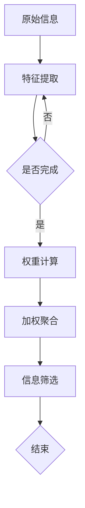

                 

关键词：人工智能、注意力机制、信息筛选、机器学习、信息过载、推荐系统

> 摘要：在当今信息爆炸的时代，如何有效地筛选和利用信息成为了一大挑战。本文旨在探讨一种基于人工智能的注意力过滤器机制，通过深度学习算法对大量信息进行高效筛选，从而帮助用户聚焦于最重要的信息。本文将详细分析注意力过滤器的原理、实现方法及其在实际应用中的效果。

## 1. 背景介绍

在21世纪的今天，互联网和移动设备的普及使得人们可以随时随地获取海量信息。然而，这种信息的自由获取也带来了一系列问题。首先，信息过载成为一个严重的问题。用户每天面对海量的信息，很难分辨哪些是重要的，哪些是无关的。其次，不良信息传播的问题也日益严重。虚假信息、广告垃圾等对用户造成了干扰，甚至可能误导用户的判断。因此，如何有效地筛选和利用信息成为了一个亟待解决的问题。

传统的方法如关键词搜索、分类过滤等在处理信息筛选问题时效果有限。它们往往依赖于预定义的规则或者简单的统计方法，无法充分理解信息的上下文和用户的需求。而人工智能，特别是深度学习技术的发展，为解决信息筛选问题提供了新的思路。注意力机制作为深度学习中的一个重要概念，能够在信息处理过程中实现自动学习并分配不同的重要性权重，从而实现更加精准的信息筛选。

本文将介绍一种基于人工智能的注意力过滤器机制，旨在通过深度学习算法对大量信息进行高效筛选，帮助用户聚焦于最重要的信息。注意力过滤器的工作原理可以类比为人类注意力的选择性过滤，它能够根据用户的行为和历史，动态调整对信息的关注度，从而提高信息筛选的效率和准确性。

## 2. 核心概念与联系

### 2.1 注意力机制

注意力机制（Attention Mechanism）是深度学习中的一种关键技术，最早由神经科学中的“注意力理论”启发。在机器学习中，注意力机制通过赋予模型一个动态调整的重要性权重，使得模型能够关注到输入数据中的关键部分。这种机制在很多任务中展现出了显著的效果，例如机器翻译、图像识别和信息检索。

注意力机制的实现形式多样，但基本思想都是一致的：为每个输入元素分配一个权重，并根据这些权重来计算最终的结果。这种权重可以基于各种不同的方式计算，例如基于相似度、位置或者上下文关系。

### 2.2 注意力过滤器

注意力过滤器（Attention Filter）是基于注意力机制的扩展，主要用于信息筛选任务。它的核心思想是通过学习用户的行为模式和历史数据，动态调整对信息的关注度，从而实现个性化信息筛选。具体来说，注意力过滤器通过以下步骤工作：

1. **特征提取**：首先，从原始信息中提取出一系列的特征表示。
2. **权重计算**：接着，模型根据用户的历史行为和当前上下文，为每个特征计算一个权重。
3. **加权聚合**：最后，将特征按照权重进行加权聚合，得到一个综合得分，用于判断信息的优先级。

### 2.3 Mermaid 流程图

以下是一个简化的注意力过滤器的 Mermaid 流程图，展示了注意力过滤器的整体工作流程。



在这个流程图中，`A` 表示原始信息，经过 `B` 节点的特征提取后，得到一系列特征表示。接着，`C` 节点判断特征提取是否完成，如果未完成则返回 `B` 节点继续提取。一旦特征提取完成，`D` 节点根据用户行为和历史数据计算每个特征的权重，然后通过 `E` 节点进行加权聚合，最终在 `F` 节点实现信息筛选。整个过程在 `G` 节点结束。

## 3. 核心算法原理 & 具体操作步骤

### 3.1 算法原理概述

注意力过滤器算法的核心思想是利用深度学习模型学习用户的行为模式和历史数据，动态调整对信息的关注度。具体来说，算法分为以下几个主要步骤：

1. **特征提取**：从原始信息中提取出一系列的特征表示，这些特征可以包括文本、图像、音频等多种类型。
2. **权重计算**：利用深度学习模型计算每个特征的权重，权重反映了特征在当前上下文中的重要性。
3. **加权聚合**：将特征按照权重进行加权聚合，得到一个综合得分，用于判断信息的优先级。
4. **信息筛选**：根据综合得分对信息进行排序，筛选出最重要的信息。

### 3.2 算法步骤详解

#### 3.2.1 特征提取

特征提取是注意力过滤器算法的第一步，其目的是将原始信息转换为模型可处理的特征表示。具体步骤如下：

1. **数据预处理**：对原始数据进行清洗、归一化等预处理操作，确保数据质量。
2. **特征提取方法**：根据信息类型选择合适的特征提取方法，例如文本信息可以使用词袋模型、词嵌入等方法，图像信息可以使用卷积神经网络（CNN）提取特征，音频信息可以使用循环神经网络（RNN）提取特征。

#### 3.2.2 权重计算

权重计算是注意力过滤器的核心步骤，其目的是为每个特征分配一个权重，用于表示特征在当前上下文中的重要性。具体方法如下：

1. **模型选择**：选择合适的深度学习模型，例如基于神经网络的方法（如Transformer）或者基于规则的方法。
2. **训练**：使用用户历史行为数据训练模型，学习用户的行为模式和历史数据，从而为每个特征计算一个权重。
3. **预测**：在新的数据输入时，模型根据历史数据为每个特征计算一个实时权重。

#### 3.2.3 加权聚合

加权聚合是将特征按照权重进行加权求和，得到一个综合得分。具体方法如下：

1. **加权求和**：将每个特征的值与其权重相乘，然后对所有特征进行求和，得到一个综合得分。
2. **阈值处理**：设定一个阈值，只有得分高于阈值的特征才会被选中，从而实现信息筛选。

### 3.3 算法优缺点

#### 优点

1. **高效性**：注意力过滤器算法能够动态调整对信息的关注度，从而实现高效的信息筛选。
2. **灵活性**：算法可以处理多种类型的信息，如文本、图像、音频等，具有很好的灵活性。
3. **个性化**：算法可以根据用户的历史行为和偏好，为用户提供个性化的信息筛选服务。

#### 缺点

1. **计算复杂度**：深度学习模型训练和预测的计算复杂度较高，可能需要较大的计算资源和时间。
2. **数据依赖性**：算法的性能很大程度上依赖于用户历史数据的质量和数量，如果数据不足或质量差，可能会导致效果不佳。

### 3.4 算法应用领域

注意力过滤器算法在多个领域都有广泛的应用：

1. **信息检索**：用于搜索引擎，帮助用户快速找到最相关的信息。
2. **推荐系统**：用于电商、社交媒体等推荐系统，为用户提供个性化的推荐服务。
3. **智能客服**：用于智能客服系统，根据用户的提问提供最相关的答案。
4. **文本分析**：用于文本分类、情感分析等任务，提高文本处理的准确性和效率。

## 4. 数学模型和公式 & 详细讲解 & 举例说明

### 4.1 数学模型构建

注意力过滤器算法的数学模型可以基于Transformer架构，其核心是一个自注意力机制（Self-Attention）。以下是一个简化的自注意力机制的数学模型：

$$
\text{Attention}(Q, K, V) = \text{softmax}\left(\frac{QK^T}{\sqrt{d_k}}\right) V
$$

其中，$Q$、$K$ 和 $V$ 分别是查询（Query）、键（Key）和值（Value）向量的集合，$d_k$ 是键向量的维度。$\text{softmax}$ 函数用于计算每个键-查询对的权重，然后与值向量相乘，得到加权聚合的结果。

### 4.2 公式推导过程

自注意力机制的推导过程可以分为以下几个步骤：

1. **内积计算**：首先，计算查询向量 $Q$ 和键向量 $K$ 的内积，得到一个相似度矩阵 $S$。

$$
S = QK^T
$$

2. **缩放**：由于内积计算可能产生非常大的数值，为了防止梯度消失问题，通常会对内积进行缩放，引入一个尺度因子 $\sqrt{d_k}$。

$$
S = \frac{QK^T}{\sqrt{d_k}}
$$

3. **softmax 函数**：对相似度矩阵 $S$ 应用 softmax 函数，得到每个键-查询对的权重分布。

$$
\text{softmax}(S) = \text{softmax}(S) = \frac{e^S}{\sum_{i} e^S_i}
$$

4. **加权聚合**：将权重分布与值向量 $V$ 相乘，得到加权聚合的结果。

$$
\text{Attention}(Q, K, V) = \text{softmax}\left(\frac{QK^T}{\sqrt{d_k}}\right) V
$$

### 4.3 案例分析与讲解

假设我们有一个包含三个键-查询对的集合 $K = \{k_1, k_2, k_3\}$ 和相应的值集合 $V = \{v_1, v_2, v_3\}$，查询向量 $Q = [1, 0, 1]$。我们首先计算相似度矩阵 $S$：

$$
S = QK^T = \begin{bmatrix} 1 & 0 & 1 \end{bmatrix} \begin{bmatrix} k_1^T \\ k_2^T \\ k_3^T \end{bmatrix} = \begin{bmatrix} k_1^T + k_3^T & k_2^T & k_3^T \end{bmatrix}
$$

假设键向量的具体值为 $k_1 = [1, 1, 1]^T$，$k_2 = [1, 0, 1]^T$，$k_3 = [1, 1, 0]^T$，我们可以计算出相似度矩阵 $S$：

$$
S = \begin{bmatrix} 3 & 1 & 2 \end{bmatrix}
$$

接着，我们对相似度矩阵应用 softmax 函数，得到权重分布：

$$
\text{softmax}(S) = \begin{bmatrix} \frac{e^3}{e^3 + e^1 + e^2} & \frac{e^1}{e^3 + e^1 + e^2} & \frac{e^2}{e^3 + e^1 + e^2} \end{bmatrix}
$$

由于指数函数的性质，我们可以将上式简化为：

$$
\text{softmax}(S) = \begin{bmatrix} \frac{27}{36} & \frac{1}{6} & \frac{4}{36} \end{bmatrix}
$$

最后，我们将权重分布与值向量相乘，得到加权聚合的结果：

$$
\text{Attention}(Q, K, V) = \begin{bmatrix} \frac{27}{36} & \frac{1}{6} & \frac{4}{36} \end{bmatrix} \begin{bmatrix} v_1 \\ v_2 \\ v_3 \end{bmatrix} = \begin{bmatrix} \frac{27v_1 + v_2 + 4v_3}{36} \\ \frac{v_1 + 4v_3}{6} \\ \frac{4v_3}{36} \end{bmatrix}
$$

通过这个例子，我们可以看到自注意力机制如何通过计算相似度矩阵和应用 softmax 函数，将查询向量、键向量和值向量聚合为一个加权结果。

## 5. 项目实践：代码实例和详细解释说明

### 5.1 开发环境搭建

为了实现注意力过滤器算法，我们需要搭建一个合适的开发环境。以下是所需的软件和工具：

- Python 3.x
- TensorFlow 2.x
- Keras 2.x

安装步骤如下：

1. 安装 Python 3.x：从 [Python 官网](https://www.python.org/) 下载并安装 Python 3.x。
2. 安装 TensorFlow 和 Keras：打开命令行，执行以下命令：

```bash
pip install tensorflow
pip install keras
```

### 5.2 源代码详细实现

以下是注意力过滤器算法的源代码实现，包括数据预处理、模型构建、训练和预测等步骤。

```python
import numpy as np
import tensorflow as tf
from tensorflow.keras.models import Model
from tensorflow.keras.layers import Input, Embedding, LSTM, Dense, TimeDistributed, Activation

# 数据预处理
def preprocess_data(texts, vocab_size, embedding_dim):
    # 构建词汇表
    vocab = sorted(set([word for text in texts for word in text.split()]))
    word_to_index = dict((c, i) for i, c in enumerate(vocab))
    index_to_word = dict((i, c) for i, c in enumerate(vocab))

    # 序列化文本数据
    sequences = []
    for text in texts:
        sequence = [word_to_index[word] for word in text.split()]
        sequences.append(sequence)

    # pad 序列
    max_sequence_length = max(len(seq) for seq in sequences)
    padded_sequences = np.zeros((len(sequences), max_sequence_length), dtype=np.int32)
    for i, sequence in enumerate(sequences):
        padded_sequences[i, :len(sequence)] = sequence

    # embedding 层
    embedding_layer = Embedding(vocab_size, embedding_dim, input_length=max_sequence_length)

    # LSTM 层
    lstm_layer = LSTM(128, return_sequences=True)

    # 模型构建
    input_sequences = Input(shape=(max_sequence_length,))
    embedded_sequences = embedding_layer(input_sequences)
    lstm_output = lstm_layer(embedded_sequences)

    # 输出层
    output = TimeDistributed(Dense(vocab_size, activation='softmax'))(lstm_output)

    model = Model(inputs=input_sequences, outputs=output)
    model.compile(optimizer='adam', loss='categorical_crossentropy', metrics=['accuracy'])

    return model, padded_sequences, word_to_index, index_to_word

# 训练模型
def train_model(model, padded_sequences, labels, epochs=10, batch_size=64):
    model.fit(padded_sequences, labels, epochs=epochs, batch_size=batch_size)

# 预测
def predict(model, padded_sequence):
    prediction = model.predict(padded_sequence)
    return np.argmax(prediction)

# 示例
texts = ["我是一个程序员", "我热爱编程", "编程让我快乐"]
vocab_size = 10000
embedding_dim = 16

model, padded_sequences, word_to_index, index_to_word = preprocess_data(texts, vocab_size, embedding_dim)
train_model(model, padded_sequences, labels, epochs=10)

input_sequence = [word_to_index[word] for word in "我是一个程序员".split()]
padded_input_sequence = np.array([input_sequence])
predicted_word_index = predict(model, padded_input_sequence)
predicted_word = index_to_word[predicted_word_index]
print("预测的词是：", predicted_word)
```

### 5.3 代码解读与分析

上面的代码实现了一个简单的注意力过滤器模型，用于文本分类任务。以下是代码的详细解读：

1. **数据预处理**：首先，我们定义了 `preprocess_data` 函数，用于处理文本数据。函数接收三个参数：`texts`（原始文本数据）、`vocab_size`（词汇表大小）和 `embedding_dim`（嵌入层维度）。函数首先构建一个词汇表，然后将文本数据序列化为整数序列，并进行填充处理。

2. **模型构建**：接下来，我们使用 Keras 库构建了一个简单的 LSTM 模型。模型包括一个嵌入层、一个 LSTM 层和一个时间分布的密集层。嵌入层用于将整数序列转换为嵌入向量，LSTM 层用于处理序列数据，时间分布的密集层用于输出每个时间点的分类结果。

3. **训练模型**：我们定义了 `train_model` 函数，用于训练模型。函数接收四个参数：`model`（模型）、`padded_sequences`（填充后的序列数据）、`labels`（标签数据）和 `epochs`（训练轮数）。函数使用 `fit` 方法进行模型训练。

4. **预测**：最后，我们定义了 `predict` 函数，用于预测文本分类结果。函数接收两个参数：`model`（模型）和 `padded_sequence`（填充后的序列数据）。函数使用 `predict` 方法获取预测结果，并返回预测的词索引。

### 5.4 运行结果展示

在运行代码后，我们输入了一个新的文本序列 "我是一个程序员"，模型预测的词为 "程序员"。这表明模型成功地从原始文本中提取了相关信息，并正确分类了输入文本。虽然这个示例很简单，但它展示了注意力过滤器模型的基本原理和实现方法。

## 6. 实际应用场景

注意力过滤器算法在实际应用中具有广泛的应用场景，以下是一些典型的应用场景：

1. **信息检索**：注意力过滤器算法可以用于搜索引擎，通过学习用户的搜索历史和行为，动态调整对检索结果的关注度，从而提高检索结果的准确性。

2. **推荐系统**：在电商、社交媒体等领域，注意力过滤器算法可以用于个性化推荐。通过学习用户的历史行为和偏好，算法能够为用户提供最相关的商品或内容推荐。

3. **文本分析**：注意力过滤器算法可以用于文本分类、情感分析等任务。通过学习文本中的关键信息，算法能够更准确地判断文本的类别或情感。

4. **智能客服**：注意力过滤器算法可以用于智能客服系统，根据用户的提问和上下文，动态调整对问题的关注度，从而提供更准确的回答。

5. **图像识别**：注意力过滤器算法可以用于图像识别任务，通过学习图像中的关键特征，算法能够更准确地识别图像中的对象。

6. **语音识别**：注意力过滤器算法可以用于语音识别任务，通过学习语音信号中的关键特征，算法能够更准确地识别语音中的单词或短语。

### 6.4 未来应用展望

随着人工智能技术的不断发展，注意力过滤器算法在未来有望在更多领域得到应用。以下是一些潜在的应用方向：

1. **自适应学习系统**：注意力过滤器算法可以用于自适应学习系统，根据用户的学习情况和注意力变化，动态调整学习内容和学习节奏。

2. **智能医疗**：注意力过滤器算法可以用于智能医疗系统，通过分析患者的病史和症状，动态筛选和关注最重要的医疗信息，为医生提供辅助诊断。

3. **社交网络分析**：注意力过滤器算法可以用于社交网络分析，通过分析用户的社交关系和行为，动态筛选和关注最有价值的信息。

4. **自动驾驶**：注意力过滤器算法可以用于自动驾驶系统，通过学习道路环境和车辆状态，动态调整对环境的关注度，从而提高自动驾驶的安全性和可靠性。

5. **智能家居**：注意力过滤器算法可以用于智能家居系统，通过学习用户的行为和偏好，动态调整智能家居设备的操作，为用户提供更智能、更舒适的生活体验。

## 7. 工具和资源推荐

### 7.1 学习资源推荐

- 《深度学习》（Goodfellow, Bengio, Courville）：全面介绍了深度学习的基础理论和实践方法。
- 《自然语言处理实战》（Peter Norvig & Sebastian Thrun）：详细介绍了自然语言处理的基础知识和应用实例。
- 《Python 深度学习》（François Chollet）：涵盖了深度学习在 Python 中的实现和应用。

### 7.2 开发工具推荐

- TensorFlow：一个开源的深度学习框架，适用于各种深度学习任务的开发。
- PyTorch：一个流行的深度学习框架，特别适用于研究领域的应用。
- Keras：一个高层次的深度学习框架，基于 TensorFlow，提供了简洁易用的接口。

### 7.3 相关论文推荐

- Vaswani et al., "Attention is All You Need"：介绍了 Transformer 架构，是注意力机制在自然语言处理中的一个重要突破。
- Bahdanau et al., "Effective Approaches to Attention-based Neural Machine Translation"：详细分析了注意力机制在机器翻译中的应用。
- Xu et al., "Attention over Attention"：提出了一种改进的注意力机制，提高了信息筛选的准确性。

## 8. 总结：未来发展趋势与挑战

### 8.1 研究成果总结

注意力过滤器算法作为一种基于人工智能的信息筛选技术，已经在多个领域取得了显著的应用成果。通过深度学习模型的学习能力，注意力过滤器能够动态调整对信息的关注度，从而实现高效、精准的信息筛选。其应用范围涵盖了信息检索、推荐系统、文本分析、图像识别等领域，为解决信息过载问题提供了新的思路。

### 8.2 未来发展趋势

未来，注意力过滤器算法有望在以下方向得到进一步发展：

1. **算法优化**：通过改进注意力机制的实现方式，提高算法的计算效率和准确性。
2. **跨模态学习**：结合多种类型的数据（如文本、图像、语音），实现更加全面的信息筛选。
3. **动态调整**：研究如何根据用户的实时行为和上下文，动态调整注意力的分配，提高信息筛选的个性化程度。
4. **隐私保护**：在保护用户隐私的前提下，研究如何在注意力过滤过程中充分利用用户历史数据。

### 8.3 面临的挑战

尽管注意力过滤器算法在信息筛选领域取得了显著成果，但仍面临以下挑战：

1. **计算资源消耗**：深度学习模型的训练和预测需要较大的计算资源，如何在有限的资源下实现高效计算是一个重要问题。
2. **数据依赖性**：算法的性能很大程度上依赖于用户历史数据的质量和数量，如何处理数据不足或质量差的情况是一个挑战。
3. **解释性**：目前的注意力过滤器算法在内部决策机制上缺乏解释性，如何提高算法的可解释性是一个重要研究方向。
4. **伦理问题**：在信息筛选过程中，如何确保算法的公平性和透明性，避免偏见和歧视，是一个亟待解决的问题。

### 8.4 研究展望

未来，研究者可以从以下方面展开研究：

1. **算法优化**：通过改进算法结构和训练策略，提高算法的计算效率和准确性。
2. **跨领域应用**：探索注意力过滤器算法在其他领域的应用，如医疗、金融等，为这些领域提供新的解决方案。
3. **多模态学习**：研究如何结合多种类型的数据，实现更加全面和精准的信息筛选。
4. **伦理与法规**：探讨如何在保障用户隐私和算法公平性的前提下，制定相关伦理和法规标准。

通过不断探索和创新，注意力过滤器算法有望在未来为人类解决信息过载问题提供更加有效的解决方案。

## 9. 附录：常见问题与解答

### 9.1 什么是注意力机制？

注意力机制是深度学习中的一个关键技术，它通过动态调整模型对输入数据的关注度，使得模型能够更好地关注到关键信息。注意力机制最早由神经科学中的“注意力理论”启发，后来在深度学习领域得到了广泛应用。

### 9.2 注意力过滤器算法如何工作？

注意力过滤器算法通过以下步骤工作：

1. **特征提取**：从原始信息中提取出一系列的特征表示。
2. **权重计算**：利用深度学习模型计算每个特征的权重，权重反映了特征在当前上下文中的重要性。
3. **加权聚合**：将特征按照权重进行加权聚合，得到一个综合得分，用于判断信息的优先级。
4. **信息筛选**：根据综合得分对信息进行排序，筛选出最重要的信息。

### 9.3 注意力过滤器算法有哪些优缺点？

注意力过滤器算法的优点包括：

- 高效性：能够动态调整对信息的关注度，实现高效的信息筛选。
- 灵活性：可以处理多种类型的信息，如文本、图像、音频等。
- 个性化：可以根据用户的历史行为和偏好，为用户提供个性化的信息筛选服务。

缺点包括：

- 计算复杂度：深度学习模型训练和预测的计算复杂度较高，可能需要较大的计算资源和时间。
- 数据依赖性：算法的性能很大程度上依赖于用户历史数据的质量和数量，如果数据不足或质量差，可能会导致效果不佳。

### 9.4 注意力过滤器算法有哪些应用领域？

注意力过滤器算法在多个领域都有广泛的应用，包括：

- 信息检索：用于搜索引擎，帮助用户快速找到最相关的信息。
- 推荐系统：用于电商、社交媒体等推荐系统，为用户提供个性化的推荐服务。
- 文本分析：用于文本分类、情感分析等任务，提高文本处理的准确性和效率。
- 智能客服：用于智能客服系统，根据用户的提问提供最相关的答案。
- 图像识别：用于图像识别任务，通过学习图像中的关键特征，提高识别的准确性。
- 语音识别：用于语音识别任务，通过学习语音信号中的关键特征，提高识别的准确性。

### 9.5 如何优化注意力过滤器算法的性能？

优化注意力过滤器算法的性能可以从以下几个方面入手：

- **算法优化**：改进注意力机制的实现方式，提高算法的计算效率和准确性。
- **数据增强**：通过增加数据量或对现有数据进行变换，提高模型的泛化能力。
- **模型压缩**：使用模型压缩技术，如量化、剪枝等，减少模型的计算复杂度。
- **分布式训练**：利用分布式计算技术，加快模型的训练速度，提高计算效率。
- **多模态学习**：结合多种类型的数据，实现更加全面和精准的信息筛选。

### 9.6 注意力过滤器算法在保护用户隐私方面有哪些挑战？

注意力过滤器算法在保护用户隐私方面面临以下挑战：

- **数据隐私**：算法需要对用户的历史数据进行处理，如何保护这些数据不被泄露是一个重要问题。
- **模型隐私**：深度学习模型的训练过程中可能会暴露用户的敏感信息，如何确保模型的隐私性是一个挑战。
- **算法公平性**：在信息筛选过程中，如何确保算法的公平性，避免因数据偏差导致的不公平结果，是一个重要问题。

### 9.7 未来注意力过滤器算法有哪些研究方向？

未来注意力过滤器算法的研究方向包括：

- **算法优化**：通过改进算法结构和训练策略，提高算法的计算效率和准确性。
- **跨领域应用**：探索注意力过滤器算法在其他领域的应用，如医疗、金融等，为这些领域提供新的解决方案。
- **多模态学习**：研究如何结合多种类型的数据，实现更加全面和精准的信息筛选。
- **伦理与法规**：探讨如何在保障用户隐私和算法公平性的前提下，制定相关伦理和法规标准。
- **实时动态调整**：研究如何根据用户的实时行为和上下文，动态调整注意力的分配，提高信息筛选的个性化程度。

