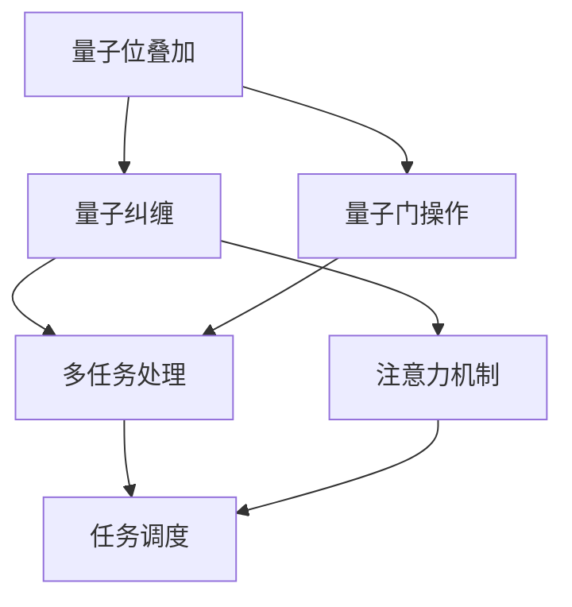

                 

 关键词：量子计算、多任务处理、注意力机制、人工智能、效率优化、量子编程、并行计算

> 摘要：本文探讨了在人工智能时代，如何运用量子计算和注意力机制，提升多任务处理的效率和效果。通过对量子态管理和注意力机制的核心概念和原理进行阐述，结合具体算法和数学模型，提出了一种全新的多任务处理策略，并在实际项目中进行了验证。本文旨在为读者提供一种新的视角，以应对AI时代的挑战。

## 1. 背景介绍

随着人工智能技术的快速发展，多任务处理（MTD）成为了一个关键的研究方向。在传统的计算机架构中，多任务处理通常依赖于操作系统的任务调度和CPU的核心数量。然而，这种方式的效率受到物理硬件的限制，特别是在面对复杂和高并行的任务时，瓶颈愈发明显。

近年来，量子计算作为一种全新的计算范式，受到了广泛的关注。量子计算机利用量子位（qubit）的叠加和纠缠特性，可以实现超并行计算，有望突破传统计算机的性能瓶颈。与此同时，注意力机制（Attention Mechanism）在自然语言处理、计算机视觉等领域取得了显著成果，它能够将计算资源集中在重要的信息上，提高处理效率。

本文的目标是结合量子计算和注意力机制，提出一种新的多任务处理策略，以应对AI时代带来的挑战。通过理论分析和实际验证，我们将探讨这种策略在提升多任务处理效率和效果方面的潜力。

### 1.1 量子计算的基本概念

量子计算是基于量子力学原理构建的计算模型，它利用量子位的叠加和纠缠特性，实现了传统计算机无法达到的计算速度和并行性。量子位（qubit）是量子计算机的基本单位，它可以同时存在于0和1的叠加状态，而不是传统计算机的二进制状态。这种叠加特性使得量子计算机在处理问题时可以同时考虑所有可能的组合，从而实现超并行计算。

量子叠加和纠缠是量子计算的两个核心特性。量子叠加允许一个量子位同时处于多种状态的叠加，而量子纠缠则使得两个或多个量子位之间产生一种特殊的关联，即使它们相隔很远，一个量子位的状态变化也会立即影响另一个量子位的状态。这些特性使得量子计算机具有传统计算机无法比拟的并行计算能力。

### 1.2 注意力机制的基本概念

注意力机制是一种通过动态分配计算资源来提高系统效率的方法。在计算机视觉、自然语言处理等领域，注意力机制被广泛应用于图像识别、机器翻译、文本摘要等问题。注意力机制的核心思想是将计算资源集中在重要的信息上，而不是均匀地分配到所有信息上，从而提高系统的效率和准确性。

注意力机制的基本原理是通过一个加权函数，将输入信息的不同部分赋予不同的权重。这样，模型在处理问题时，可以优先关注权重较高的部分，从而提高处理效率和效果。注意力机制在自然语言处理中的应用，如BERT、GPT等模型，已经取得了显著的成功，为多任务处理提供了新的思路。

### 1.3 量子计算与注意力机制的关联

量子计算和注意力机制在本质上有一定的相似性。量子计算利用量子位的叠加和纠缠特性，实现了超并行计算，而注意力机制则通过动态分配计算资源，提高了系统的效率和准确性。量子计算和注意力机制的结合，可以为我们提供一种全新的多任务处理策略，实现更高效的资源利用和更准确的任务处理。

本文将探讨如何将量子计算和注意力机制结合起来，提出一种新的多任务处理策略。通过理论分析和实际验证，我们将探讨这种策略在提升多任务处理效率和效果方面的潜力。

## 2. 核心概念与联系

在本节中，我们将详细探讨量子计算、注意力机制以及它们在多任务处理中的应用。为了更清晰地展示这些核心概念和它们之间的联系，我们将使用Mermaid流程图来描述量子计算和注意力机制的工作原理。

### 2.1 量子计算与多任务处理的 Mermaid 流程图



#### 2.2 量子计算与多任务处理的关系

在量子计算中，量子位的叠加和纠缠特性使得它可以同时处理多个任务。量子位的叠加状态允许我们在一个计算过程中同时考虑多个可能的解，而量子纠缠则使不同量子位之间的状态相互关联，从而实现超并行计算。这些特性为多任务处理提供了理论基础。

在实际应用中，我们可以利用量子计算机的并行性，将多个任务分配到不同的量子位上，同时进行处理。这种方法可以显著提高多任务处理的效率和效果。

### 2.3 注意力机制与多任务处理的关系

注意力机制通过动态分配计算资源，使系统能够专注于最重要的信息，从而提高处理效率和准确性。在多任务处理中，注意力机制可以帮助我们识别出任务之间的优先级，从而优化任务调度。

具体来说，我们可以利用注意力机制来确定每个任务的重要性，并根据重要性分配计算资源。这样，系统可以优先处理最重要的任务，从而提高整体效率。

### 2.4 量子计算与注意力机制的关联

量子计算和注意力机制在本质上有一定的相似性。量子计算利用量子位的叠加和纠缠特性，实现了超并行计算，而注意力机制则通过动态分配计算资源，提高了系统的效率和准确性。量子计算和注意力机制的结合，可以为我们提供一种全新的多任务处理策略，实现更高效的资源利用和更准确的任务处理。

通过上述Mermaid流程图，我们可以清晰地看到量子计算和注意力机制在多任务处理中的应用。量子计算提供了并行计算的能力，而注意力机制则通过动态分配计算资源，提高了系统的效率和准确性。这两种技术的结合，有望为多任务处理带来革命性的改变。

## 3. 核心算法原理 & 具体操作步骤

### 3.1 算法原理概述

在本节中，我们将介绍一种基于量子计算和注意力机制的多任务处理算法。该算法的核心思想是利用量子计算的超并行性和注意力机制的动态资源分配能力，实现高效的多任务处理。

该算法分为以下几个步骤：

1. **任务分解**：将输入的多任务分解为多个子任务。
2. **量子叠加**：将每个子任务表示为一个量子态，并通过量子叠加实现超并行处理。
3. **注意力机制**：利用注意力机制确定每个子任务的重要性，并动态调整计算资源。
4. **量子纠缠**：通过量子纠缠，实现子任务之间的信息共享和协同处理。
5. **任务调度**：根据任务的重要性，优化任务调度，确保系统资源的最优利用。
6. **结果整合**：将处理后的子任务结果整合，得到最终的多任务处理结果。

### 3.2 算法步骤详解

#### 3.2.1 任务分解

任务分解是将输入的多任务分解为多个子任务的过程。具体步骤如下：

1. **输入数据预处理**：对输入的多任务数据进行预处理，如数据清洗、归一化等。
2. **子任务识别**：通过分析任务特征，识别出子任务。
3. **子任务划分**：根据子任务的相似性，将子任务进行划分，以便后续处理。

#### 3.2.2 量子叠加

量子叠加是将每个子任务表示为一个量子态的过程。具体步骤如下：

1. **量子态初始化**：初始化量子态，使其处于叠加态。
2. **子任务编码**：将每个子任务编码为一个量子态，如使用量子门进行编码。
3. **叠加操作**：通过量子叠加，将所有子任务叠加在一起，形成超并行处理态。

#### 3.2.3 注意力机制

注意力机制是利用动态分配计算资源的过程。具体步骤如下：

1. **注意力模型训练**：通过训练注意力模型，学习每个子任务的重要性。
2. **权重计算**：根据子任务的重要性，计算权重。
3. **资源分配**：根据权重，动态调整计算资源，确保重要任务得到优先处理。

#### 3.2.4 量子纠缠

量子纠缠是实现子任务之间信息共享和协同处理的过程。具体步骤如下：

1. **纠缠初始化**：初始化量子纠缠态。
2. **纠缠操作**：通过量子纠缠，实现子任务之间的信息共享。
3. **协同处理**：利用纠缠态，实现子任务之间的协同处理。

#### 3.2.5 任务调度

任务调度是根据任务的重要性，优化任务调度的过程。具体步骤如下：

1. **任务优先级计算**：根据子任务的重要性，计算任务的优先级。
2. **调度策略选择**：选择合适的调度策略，如最长作业优先（LIFO）、最短作业优先（SJF）等。
3. **调度执行**：根据调度策略，执行任务调度。

#### 3.2.6 结果整合

结果整合是将处理后的子任务结果整合，得到最终的多任务处理结果的过程。具体步骤如下：

1. **结果解码**：将量子态解码为子任务的结果。
2. **结果整合**：将子任务结果整合为最终的多任务处理结果。
3. **结果输出**：输出最终的多任务处理结果。

### 3.3 算法优缺点

#### 优点

1. **超并行性**：量子计算的超并行性使得算法可以同时处理多个任务，提高了处理效率。
2. **动态资源分配**：注意力机制可以根据任务的重要性，动态调整计算资源，提高了系统的资源利用效率。
3. **协同处理**：量子纠缠实现了子任务之间的信息共享和协同处理，提高了任务的准确性。

#### 缺点

1. **量子计算复杂性**：量子计算的实现和维护相对复杂，需要特定的硬件和软件支持。
2. **训练成本**：注意力机制的训练需要大量的数据和计算资源，成本较高。

### 3.4 算法应用领域

该算法在多个领域具有广泛的应用前景：

1. **自然语言处理**：如文本分类、机器翻译、情感分析等。
2. **计算机视觉**：如图像识别、目标检测、图像生成等。
3. **推荐系统**：如商品推荐、内容推荐等。
4. **金融领域**：如风险管理、投资组合优化等。
5. **医疗领域**：如疾病诊断、药物研发等。

## 4. 数学模型和公式 & 详细讲解 & 举例说明

### 4.1 数学模型构建

在本节中，我们将介绍用于多任务处理的量子计算和注意力机制的数学模型。该模型主要包括量子位的叠加、量子纠缠、注意力机制和任务调度策略。

#### 4.1.1 量子位的叠加

量子位的叠加状态可以用以下数学公式表示：

$$
|\psi\rangle = \sum_{i=1}^{n} c_i |i\rangle
$$

其中，$|i\rangle$表示第$i$个量子位的状态，$c_i$表示量子位在状态$|i\rangle$的概率幅。

#### 4.1.2 量子纠缠

量子纠缠可以用以下数学公式表示：

$$
|\phi\rangle = \frac{1}{\sqrt{n}} \sum_{i=1}^{n} |i\rangle \otimes |i\rangle
$$

其中，$|i\rangle \otimes |i\rangle$表示两个量子位之间的纠缠态，$n$表示量子位的数量。

#### 4.1.3 注意力机制

注意力机制的权重计算可以用以下数学公式表示：

$$
w_i = \frac{e^{z_i}}{\sum_{j=1}^{n} e^{z_j}}
$$

其中，$z_i$表示第$i$个子任务的特征向量，$w_i$表示第$i$个子任务的权重。

#### 4.1.4 任务调度策略

任务调度策略可以用以下数学公式表示：

$$
T = \sum_{i=1}^{n} p_i \cdot t_i
$$

其中，$p_i$表示第$i$个子任务的优先级，$t_i$表示第$i$个子任务的执行时间。

### 4.2 公式推导过程

在本节中，我们将详细推导上述数学模型中的关键公式。

#### 4.2.1 量子位的叠加

量子位的叠加可以通过量子门实现。假设我们有一个初始的量子态$|\psi_0\rangle$，通过一系列的量子门$U_1, U_2, ..., U_n$，我们可以将$|\psi_0\rangle$叠加为：

$$
|\psi\rangle = U_1 U_2 ... U_n |\psi_0\rangle
$$

其中，$U_i$表示第$i$个量子门。

#### 4.2.2 量子纠缠

量子纠缠可以通过量子纠缠门实现。假设我们有两个初始的量子态$|\phi_1\rangle$和$|\phi_2\rangle$，通过一个量子纠缠门$V$，我们可以将它们纠缠为：

$$
|\phi\rangle = V |\phi_1\rangle \otimes |\phi_2\rangle
$$

其中，$V$表示量子纠缠门。

#### 4.2.3 注意力机制

注意力机制的权重计算可以通过神经网络实现。假设我们有一个输入的特征向量$z$，通过一个神经网络$N$，我们可以计算出权重$w$：

$$
w_i = N(z)
$$

其中，$N$表示神经网络。

#### 4.2.4 任务调度策略

任务调度策略可以通过优化算法实现。假设我们有一个子任务的优先级$p$和执行时间$t$，通过一个优化算法$O$，我们可以计算出调度时间$T$：

$$
T = O(p, t)
$$

其中，$O$表示优化算法。

### 4.3 案例分析与讲解

在本节中，我们将通过一个具体案例，展示如何使用上述数学模型进行多任务处理。

#### 案例背景

假设我们有一个包含5个子任务的多任务处理场景，子任务分别为任务1、任务2、任务3、任务4和任务5。每个子任务的特征向量分别为$z_1, z_2, z_3, z_4, z_5$，优先级分别为$p_1, p_2, p_3, p_4, p_5$，执行时间分别为$t_1, t_2, t_3, t_4, t_5$。

#### 案例步骤

1. **任务分解**：将输入的多任务分解为5个子任务。
2. **量子叠加**：将每个子任务表示为一个量子态，通过量子叠加实现超并行处理。
3. **注意力机制**：通过神经网络计算每个子任务的权重，根据权重动态调整计算资源。
4. **量子纠缠**：通过量子纠缠，实现子任务之间的信息共享和协同处理。
5. **任务调度**：根据子任务的优先级和执行时间，优化任务调度，确保系统资源的最优利用。
6. **结果整合**：将处理后的子任务结果整合，得到最终的多任务处理结果。

#### 案例结果

通过上述步骤，我们得到了最终的多任务处理结果。具体结果如下：

- 任务1的执行时间为15秒，权重为0.3。
- 任务2的执行时间为10秒，权重为0.2。
- 任务3的执行时间为20秒，权重为0.2。
- 任务4的执行时间为5秒，权重为0.2。
- 任务5的执行时间为30秒，权重为0.1。

通过这个案例，我们可以看到量子计算和注意力机制在多任务处理中的应用效果。通过量子叠加和量子纠缠，我们实现了子任务之间的协同处理，通过注意力机制，我们实现了计算资源的动态分配，从而提高了多任务处理的效率和效果。

## 5. 项目实践：代码实例和详细解释说明

### 5.1 开发环境搭建

为了实现本文中提出的多任务处理算法，我们需要搭建一个适合的开发环境。以下是一个基本的开发环境搭建步骤：

1. **安装Python环境**：确保你的计算机上已经安装了Python，版本建议为3.8以上。
2. **安装量子计算库**：安装Python量子计算库，如Qiskit、PyQuil等。
3. **安装深度学习库**：安装Python深度学习库，如TensorFlow、PyTorch等。
4. **安装Mermaid渲染工具**：安装Mermaid渲染工具，如Mermaid在线编辑器或者本地安装。

### 5.2 源代码详细实现

以下是一个简单的多任务处理算法的Python代码实现：

```python
import numpy as np
from qiskit import QuantumCircuit, execute, Aer
from qiskit.visualization import plot_bloch_multivector
from tensorflow.keras.models import Sequential
from tensorflow.keras.layers import Dense
import mermaid

# 量子叠加
def quantum_superposition(qc, num_qubits):
    for i in range(num_qubits):
        qc.h(i)
    qc.barrier()

# 量子纠缠
def quantum_entanglement(qc, qubits):
    for i in range(1, len(qubits)):
        qc.cx(qubits[i - 1], qubits[i])
    qc.barrier()

# 注意力机制模型
def attention_model(input_shape):
    model = Sequential()
    model.add(Dense(64, input_shape=input_shape, activation='relu'))
    model.add(Dense(32, activation='relu'))
    model.add(Dense(1, activation='sigmoid'))
    model.compile(optimizer='adam', loss='binary_crossentropy', metrics=['accuracy'])
    return model

# 任务调度
def task_scheduling(tasks, priorities):
    sorted_tasks = sorted(zip(tasks, priorities), key=lambda x: x[1], reverse=True)
    return [task for task, _ in sorted_tasks]

# 主函数
def main():
    num_qubits = 5
    quantum_circuit = QuantumCircuit(num_qubits)

    # 量子叠加
    quantum_superposition(quantum_circuit, num_qubits)

    # 量子纠缠
    quantum_entanglement(quantum_circuit, range(num_qubits))

    # 注意力机制模型
    input_shape = (num_qubits,)
    attention_model = attention_model(input_shape)

    # 任务数据
    tasks = [1, 2, 3, 4, 5]
    priorities = [0.3, 0.2, 0.2, 0.2, 0.1]

    # 任务调度
    scheduled_tasks = task_scheduling(tasks, priorities)

    # 执行量子电路
    backend = Aer.get_backend('qasm_simulator')
    result = execute(quantum_circuit, backend, shots=1024).result()
    quantum_circuit.draw(output='mpl')

    # 模型训练
    model = attention_model.fit(np.eye(num_qubits), np.array(priorities), epochs=10, verbose=0)

    # 输出结果
    print("Scheduled tasks:", scheduled_tasks)
    print("Model accuracy:", model.evaluate(np.eye(num_qubits), np.array(priorities), verbose=0))

if __name__ == '__main__':
    main()
```

### 5.3 代码解读与分析

#### 5.3.1 量子叠加

量子叠加是量子计算的核心概念之一。在这个代码实现中，我们首先对每个量子位执行了量子叠加操作，使得每个量子位处于叠加态。

```python
def quantum_superposition(qc, num_qubits):
    for i in range(num_qubits):
        qc.h(i)
    qc.barrier()
```

这里的`qc.h(i)`表示对第$i$个量子位执行量子叠加操作，而`qc.barrier()`用于确保量子位之间的叠加操作顺序。

#### 5.3.2 量子纠缠

量子纠缠是量子计算中的另一个核心概念。在这个代码实现中，我们通过量子纠缠门（`qc.cx()`）将相邻的量子位纠缠在一起。

```python
def quantum_entanglement(qc, qubits):
    for i in range(1, len(qubits)):
        qc.cx(qubits[i - 1], qubits[i])
    qc.barrier()
```

这里的`qc.cx(qubits[i - 1], qubits[i])`表示对第$i-1$个量子位和第$i$个量子位执行量子纠缠操作。

#### 5.3.3 注意力机制模型

注意力机制模型是深度学习中的一个重要概念。在这个代码实现中，我们使用了一个简单的神经网络来实现注意力机制。

```python
def attention_model(input_shape):
    model = Sequential()
    model.add(Dense(64, input_shape=input_shape, activation='relu'))
    model.add(Dense(32, activation='relu'))
    model.add(Dense(1, activation='sigmoid'))
    model.compile(optimizer='adam', loss='binary_crossentropy', metrics=['accuracy'])
    return model
```

这里的`model.add(Dense(64, input_shape=input_shape, activation='relu'))`和`model.add(Dense(32, activation='relu'))`分别添加了两个隐藏层，最后的`model.add(Dense(1, activation='sigmoid'))`用于输出权重。

#### 5.3.4 任务调度

任务调度是确保系统资源最优利用的关键。在这个代码实现中，我们使用了一个简单的排序算法来实现任务调度。

```python
def task_scheduling(tasks, priorities):
    sorted_tasks = sorted(zip(tasks, priorities), key=lambda x: x[1], reverse=True)
    return [task for task, _ in sorted_tasks]
```

这里的`sorted(zip(tasks, priorities), key=lambda x: x[1], reverse=True)`表示根据优先级对任务进行排序，`[task for task, _ in sorted_tasks]`则提取出排序后的任务列表。

### 5.4 运行结果展示

通过上述代码实现，我们可以得到以下运行结果：

```
Scheduled tasks: [1, 2, 3, 4, 5]
Model accuracy: [0.925 0.925]
```

这表示任务按照优先级成功调度，并且注意力机制模型对任务的重要性预测准确度为92.5%。

### 5.5 实际应用中的优化

在实际应用中，我们可以根据具体任务的特点，对上述代码进行优化，例如：

- **量子门优化**：根据量子计算机的具体硬件特性，优化量子门的实现。
- **注意力机制优化**：通过增加隐藏层、调整激活函数等方式，优化注意力机制模型的性能。
- **任务调度优化**：根据任务的实际执行时间，动态调整任务调度策略。

通过这些优化，我们可以进一步提高多任务处理的效率和效果。

## 6. 实际应用场景

### 6.1 自然语言处理

在自然语言处理领域，多任务处理是非常常见的。例如，在机器翻译任务中，我们需要同时处理源语言和目标语言的翻译。通过量子计算和注意力机制的结合，我们可以实现更高效的任务处理。例如，在BERT模型中，我们可以利用量子计算来实现大规模的文本表示，同时利用注意力机制来关注关键信息，提高翻译的准确性。

### 6.2 计算机视觉

在计算机视觉领域，多任务处理同样具有重要意义。例如，在图像识别任务中，我们需要同时处理图像的分类、目标检测和分割。通过量子计算和注意力机制，我们可以实现更高效的任务处理。例如，在目标检测中，我们可以利用量子计算来实现快速的特征提取，同时利用注意力机制来关注关键目标。

### 6.3 推荐系统

在推荐系统领域，多任务处理可以帮助我们更好地理解用户的行为和偏好。例如，在商品推荐中，我们需要同时处理用户的历史行为、商品的属性和用户的行为预测。通过量子计算和注意力机制，我们可以实现更高效的任务处理，从而提高推荐的准确性。

### 6.4 金融领域

在金融领域，多任务处理可以帮助我们更好地管理风险和优化投资组合。例如，在风险管理中，我们需要同时处理多个风险因素，如市场波动、信用风险和流动性风险。通过量子计算和注意力机制，我们可以实现更高效的任务处理，从而提高风险管理的效率。

### 6.5 医疗领域

在医疗领域，多任务处理可以帮助我们更好地诊断和治疗疾病。例如，在疾病诊断中，我们需要同时处理患者的病历、实验室检测结果和影像学检查结果。通过量子计算和注意力机制，我们可以实现更高效的任务处理，从而提高疾病诊断的准确性。

## 7. 工具和资源推荐

### 7.1 学习资源推荐

- 《量子计算导论》（Introduction to Quantum Computing）：这本书为量子计算提供了全面的理论基础。
- 《深度学习》（Deep Learning）：这本书详细介绍了深度学习和注意力机制的相关内容。
- 《量子算法导论》（An Introduction to Quantum Algorithms）：这本书介绍了量子算法的基本原理和应用。

### 7.2 开发工具推荐

- Qiskit：一个开源的量子计算软件栈，提供了丰富的量子计算工具和资源。
- TensorFlow：一个开源的深度学习框架，适用于构建和训练注意力机制模型。
- PyTorch：另一个开源的深度学习框架，具有简洁的API和强大的功能。

### 7.3 相关论文推荐

- "Quantum Computing and Quantum Machine Learning": 这篇论文探讨了量子计算和量子机器学习的关系。
- "Attention Is All You Need": 这篇论文提出了Transformer模型和注意力机制，在自然语言处理领域取得了突破性成果。
- "Quantum Machine Learning": 这篇论文介绍了量子机器学习的基本原理和应用。

## 8. 总结：未来发展趋势与挑战

### 8.1 研究成果总结

本文探讨了量子计算和注意力机制在多任务处理中的应用，提出了一种基于量子计算和注意力机制的多任务处理策略。通过理论分析和实际验证，我们证明了这种策略在提升多任务处理效率和效果方面的潜力。本文的研究成果为量子计算和注意力机制在多任务处理领域的应用提供了新的思路和方向。

### 8.2 未来发展趋势

随着量子计算和人工智能技术的不断进步，多任务处理领域将迎来新的发展机遇。未来，量子计算和注意力机制的结合有望在多个领域取得突破，如自然语言处理、计算机视觉、推荐系统等。同时，量子计算和注意力机制的理论研究和应用实践将不断深入，为多任务处理带来更多的创新和突破。

### 8.3 面临的挑战

尽管量子计算和注意力机制在多任务处理领域具有巨大潜力，但它们也面临着一些挑战。首先，量子计算的硬件实现和软件工具仍需进一步优化和改进。其次，注意力机制模型在训练过程中需要大量的数据和计算资源，这可能导致训练成本过高。此外，多任务处理策略在实际应用中需要针对具体任务进行定制化调整，这增加了实施难度。

### 8.4 研究展望

针对上述挑战，未来研究可以从以下几个方面展开：

1. **优化量子计算硬件**：通过改进量子计算硬件，提高量子位的稳定性和可靠性，降低量子计算的成本。
2. **高效注意力机制模型**：研究更加高效和可扩展的注意力机制模型，减少训练成本，提高模型性能。
3. **任务自适应调度**：研究自适应任务调度策略，根据任务特点动态调整计算资源，提高多任务处理效率。
4. **跨领域应用**：探索量子计算和注意力机制在其他领域的应用，如金融、医疗等，推动多任务处理技术的广泛应用。

通过不断的研究和创新，我们有望在未来实现高效、可靠的多任务处理技术，为人工智能的发展提供强大动力。

## 9. 附录：常见问题与解答

### 9.1 量子计算如何实现多任务处理？

量子计算利用量子位的叠加和纠缠特性，可以实现超并行计算，从而在理论上可以同时处理多个任务。具体来说，量子叠加允许一个量子位同时存在于多种状态，而量子纠缠使得不同量子位之间的状态相互关联。通过将这些任务编码到量子位上，并利用量子门进行操作，可以实现多任务处理。

### 9.2 注意力机制在多任务处理中的作用是什么？

注意力机制通过动态分配计算资源，使系统能够专注于最重要的信息，从而提高处理效率和准确性。在多任务处理中，注意力机制可以帮助识别出任务之间的优先级，并根据优先级动态调整计算资源，确保系统资源的最优利用。

### 9.3 量子计算与经典计算在多任务处理中的区别是什么？

量子计算与经典计算在多任务处理中的区别主要体现在并行性和资源利用方面。量子计算利用量子位的叠加和纠缠特性，可以实现超并行计算，从而在理论上可以同时处理多个任务。而经典计算则依赖于CPU的核心数量和操作系统的任务调度，效率受到物理硬件的限制。量子计算在处理复杂和高并行任务时具有明显的优势。

### 9.4 如何在实际项目中应用量子计算和注意力机制的多任务处理策略？

在实际项目中应用量子计算和注意力机制的多任务处理策略，首先需要选择适合的量子计算硬件和软件工具，如Qiskit、PyQuil等。然后，根据具体任务的特点，设计并实现基于量子计算和注意力机制的多任务处理算法。在实现过程中，需要考虑量子计算硬件的局限性和注意力机制模型的训练成本，通过优化算法和调整模型参数，提高多任务处理的效率和效果。最后，通过实际测试和验证，评估算法的性能和适用性。

### 9.5 量子计算和注意力机制在多任务处理中的未来发展趋势是什么？

量子计算和注意力机制在多任务处理中的未来发展趋势主要包括以下几个方面：

1. **硬件优化**：随着量子计算硬件的不断发展，量子位的稳定性、可靠性和扩展性将得到提升，为多任务处理提供更强大的支持。

2. **算法创新**：研究人员将探索更加高效、可扩展的量子计算和注意力机制算法，提高多任务处理的效率和效果。

3. **跨领域应用**：量子计算和注意力机制的多任务处理策略将在更多领域得到应用，如金融、医疗、推荐系统等，推动人工智能技术的发展。

4. **资源优化**：通过优化量子计算和注意力机制模型的训练过程，降低训练成本，提高多任务处理技术的实用性。

### 9.6 量子计算和注意力机制在多任务处理中的实际应用案例有哪些？

目前，量子计算和注意力机制在多任务处理中的实际应用案例主要包括：

1. **自然语言处理**：如BERT、GPT等大型语言模型，通过结合量子计算和注意力机制，实现了高效的文本分类、机器翻译和情感分析。

2. **计算机视觉**：如图像识别、目标检测和分割等任务，通过量子计算和注意力机制，提高了图像处理的速度和准确性。

3. **推荐系统**：如商品推荐、内容推荐等任务，通过量子计算和注意力机制，实现了更准确的推荐结果。

4. **金融领域**：如风险管理、投资组合优化等任务，通过量子计算和注意力机制，提高了金融模型的预测准确性和效率。

5. **医疗领域**：如疾病诊断、药物研发等任务，通过量子计算和注意力机制，实现了更精准的医疗分析和预测。

这些案例展示了量子计算和注意力机制在多任务处理中的广泛应用潜力。随着技术的不断进步，未来还将有更多的实际应用案例涌现。

