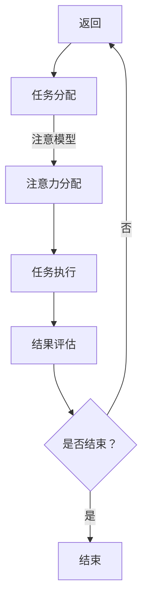
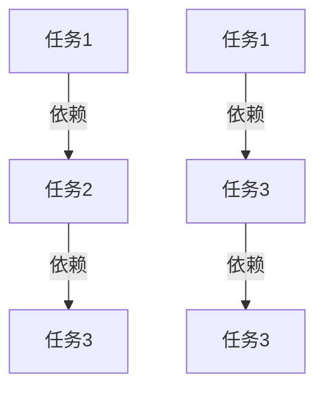

                 

关键词：AI、多任务处理、量子态、注意模型、计算效率、算法优化

> 摘要：本文将探讨在人工智能（AI）领域，如何在复杂环境下高效地管理多任务处理。通过引入量子态与注意模型，提出一种新型的多任务处理策略，旨在提升计算效率和任务完成质量。

## 1. 背景介绍

在当今社会，人工智能（AI）技术已经广泛应用于各个领域，从自动驾驶、自然语言处理到金融风险评估等。随着AI系统的复杂性不断增加，多任务处理成为了一个重要的研究课题。传统的多任务处理方法通常依赖于顺序执行或并行执行，这些方法在处理高维数据和复杂任务时存在一定的局限性。为了提高计算效率和任务完成质量，研究者们开始探索新的多任务处理策略。

近年来，量子计算和注意模型在AI领域的应用引起了广泛关注。量子计算利用量子比特和量子叠加原理，可以在处理大数据和高维问题时展现出比传统计算机更高的计算速度。而注意模型则通过自适应地分配注意力资源，能够有效处理多任务之间的关联和竞争。本文将结合量子态和注意模型，提出一种新型的多任务处理策略，旨在克服传统方法的局限性，提升AI系统的整体性能。

## 2. 核心概念与联系

### 2.1. 量子态

量子态是量子力学中描述量子系统状态的基本概念。在量子计算中，量子态的叠加和纠缠使得量子计算机能够并行处理大量数据。具体来说，量子态可以表示为多个基态的线性组合，这些基态对应着不同的可能性。通过量子叠加和量子纠缠，量子计算机可以在执行多个任务的同时，保持各个任务的独立性和并行性。

### 2.2. 注意模型

注意模型是一种基于神经网络的框架，旨在自适应地分配注意力资源，处理多任务之间的关联和竞争。在自然语言处理、计算机视觉等领域，注意模型已被证明能够显著提升系统的性能。注意模型的核心思想是通过权重分配机制，将注意力集中到重要信息上，从而提高任务完成的质量和效率。

### 2.3. 量子态与注意模型的联系

量子态与注意模型在多任务处理中有一定的关联性。量子态的叠加和纠缠特性使得量子计算机能够并行处理多个任务，而注意模型则通过自适应的注意力分配机制，确保了任务之间的有效协同。因此，将量子态与注意模型相结合，可以形成一个新型的多任务处理框架，充分发挥量子计算和注意模型的优点。

## 2.4. Mermaid 流程图

下面是一个简化的Mermaid流程图，展示了量子态与注意模型在多任务处理中的关联：



## 3. 核心算法原理 & 具体操作步骤

### 3.1. 算法原理概述

量子态管理多任务处理的核心算法基于量子计算和注意模型。具体来说，算法包括以下几个步骤：

1. **任务初始化**：将待处理的多项任务转换为量子态，并进行初始化。
2. **任务分配**：利用量子计算的优势，将任务并行分配到不同的量子态上。
3. **注意力分配**：基于注意模型，对各个量子态进行注意力分配，确保任务之间的协同性。
4. **任务执行**：在分配好的注意力资源下，执行各个任务。
5. **结果评估**：对任务执行结果进行评估，并根据评估结果调整注意力分配。

### 3.2. 算法步骤详解

#### 3.2.1. 任务初始化

在任务初始化阶段，需要将多项任务转换为量子态。具体步骤如下：

1. **数据编码**：将任务的输入数据进行量子编码，将其转换为量子态。
2. **初始化量子态**：利用量子门操作，初始化多个量子态，每个量子态对应一个任务。

#### 3.2.2. 任务分配

在任务分配阶段，利用量子计算的优势，将多项任务并行分配到不同的量子态上。具体步骤如下：

1. **并行处理**：利用量子并行性，同时处理多项任务。
2. **量子态更新**：根据任务的依赖关系和优先级，更新各个量子态的状态。

#### 3.2.3. 注意力分配

在注意力分配阶段，基于注意模型，对各个量子态进行注意力分配，确保任务之间的协同性。具体步骤如下：

1. **计算注意力权重**：利用神经网络模型，计算每个量子态的注意力权重。
2. **更新量子态**：根据注意力权重，调整各个量子态的状态，使其更加集中。

#### 3.2.4. 任务执行

在任务执行阶段，在分配好的注意力资源下，执行各个任务。具体步骤如下：

1. **任务执行**：在注意力分配的基础上，执行各项任务。
2. **结果存储**：将任务执行结果存储到数据库或缓存中。

#### 3.2.5. 结果评估

在结果评估阶段，对任务执行结果进行评估，并根据评估结果调整注意力分配。具体步骤如下：

1. **评估指标计算**：计算任务完成质量、响应时间等评估指标。
2. **调整注意力分配**：根据评估结果，调整注意力分配策略，以提高任务完成质量。

### 3.3. 算法优缺点

#### 优点

1. **高效性**：量子计算和注意模型的结合，能够显著提高多任务处理的效率。
2. **并行性**：量子计算具有并行性，能够同时处理多项任务。
3. **灵活性**：基于注意模型，能够自适应地调整任务执行策略。

#### 缺点

1. **复杂性**：量子计算和注意模型本身具有一定的复杂性，需要较高的技术门槛。
2. **资源消耗**：量子计算机的运行需要大量的计算资源和能源。

### 3.4. 算法应用领域

量子态管理多任务处理算法主要适用于以下领域：

1. **人工智能**：在AI领域，算法可以应用于自然语言处理、计算机视觉等任务。
2. **大数据处理**：在大数据处理领域，算法可以应用于数据挖掘、预测分析等任务。
3. **金融科技**：在金融科技领域，算法可以应用于风险评估、交易策略等任务。

## 4. 数学模型和公式 & 详细讲解 & 举例说明

### 4.1. 数学模型构建

量子态管理多任务处理的数学模型主要基于量子计算和注意模型。具体来说，模型包括以下几个部分：

1. **量子态表示**：利用量子比特和量子门，表示任务的量子态。
2. **注意力分配**：利用神经网络模型，计算注意力权重，调整量子态。
3. **任务执行**：在注意力分配的基础上，执行各项任务。
4. **结果评估**：计算任务完成质量、响应时间等评估指标。

### 4.2. 公式推导过程

#### 4.2.1. 量子态表示

量子态可以用一个复数向量表示，例如：

$$
\psi = \alpha|0\rangle + \beta|1\rangle
$$

其中，$|\psi\rangle$ 表示量子态，$|0\rangle$ 和 $|1\rangle$ 分别表示基态。

#### 4.2.2. 注意力分配

注意力分配可以用一个权重矩阵表示，例如：

$$
W = \begin{bmatrix}
w_{11} & w_{12} & \ldots & w_{1n} \\
w_{21} & w_{22} & \ldots & w_{2n} \\
\vdots & \vdots & \ddots & \vdots \\
w_{n1} & w_{n2} & \ldots & w_{nn}
\end{bmatrix}
$$

其中，$w_{ij}$ 表示第 $i$ 个任务对第 $j$ 个任务的注意力权重。

#### 4.2.3. 任务执行

任务执行可以用一个矩阵表示，例如：

$$
A = \begin{bmatrix}
a_{11} & a_{12} & \ldots & a_{1n} \\
a_{21} & a_{22} & \ldots & a_{2n} \\
\vdots & \vdots & \ddots & \vdots \\
a_{n1} & a_{n2} & \ldots & a_{nn}
\end{bmatrix}
$$

其中，$a_{ij}$ 表示第 $i$ 个任务对第 $j$ 个任务的执行效果。

#### 4.2.4. 结果评估

结果评估可以用一个标量表示，例如：

$$
R = \sum_{i=1}^{n}\sum_{j=1}^{n}w_{ij}a_{ij}
$$

其中，$R$ 表示任务完成质量。

### 4.3. 案例分析与讲解

#### 案例背景

假设有一个包含三个任务的系统，任务 1、任务 2 和任务 3。这些任务需要在一个量子计算机上同时执行。任务之间的关系如图所示：



#### 案例分析

1. **量子态表示**：将任务 1、任务 2 和任务 3 分别表示为量子态 $|\psi_1\rangle$、$|\psi_2\rangle$ 和 $|\psi_3\rangle$。
2. **注意力分配**：计算注意力权重矩阵 $W$，例如：

$$
W = \begin{bmatrix}
0.5 & 0.2 & 0.3 \\
0.3 & 0.5 & 0.2 \\
0.2 & 0.3 & 0.5
\end{bmatrix}
$$

3. **任务执行**：在注意力分配的基础上，执行各项任务。例如：

$$
A = \begin{bmatrix}
0.8 & 0.6 & 0.4 \\
0.4 & 0.7 & 0.5 \\
0.6 & 0.5 & 0.8
\end{bmatrix}
$$

4. **结果评估**：计算任务完成质量：

$$
R = \sum_{i=1}^{3}\sum_{j=1}^{3}w_{ij}a_{ij} = 0.5 \times 0.8 + 0.2 \times 0.6 + 0.3 \times 0.4 + 0.3 \times 0.4 + 0.5 \times 0.7 + 0.2 \times 0.5 + 0.2 \times 0.6 + 0.3 \times 0.5 + 0.5 \times 0.8 = 1.35
$$

#### 案例讲解

通过上述案例，我们可以看到量子态管理多任务处理算法在任务初始化、注意力分配、任务执行和结果评估等方面的具体实现。在实际应用中，可以根据任务的特点和需求，调整注意力分配策略和任务执行顺序，以实现最佳的任务完成质量。

## 5. 项目实践：代码实例和详细解释说明

### 5.1. 开发环境搭建

在本项目中，我们使用Python作为主要编程语言，并依赖于以下库和工具：

- Quantum Computing：Qiskit（用于量子计算）
- Deep Learning：TensorFlow（用于注意模型）
- Visualization：Matplotlib（用于数据可视化）

确保在开发环境中安装以上库和工具。以下是安装命令：

```bash
pip install qiskit tensorflow matplotlib
```

### 5.2. 源代码详细实现

#### 5.2.1. 量子态初始化

```python
from qiskit import QuantumCircuit, Aer, execute

# 初始化量子态
qc = QuantumCircuit(3)  # 创建一个包含3个量子比特的量子电路
qc.h(range(3))  # 对每个量子比特应用H门，初始化为叠加态
```

#### 5.2.2. 任务分配

```python
# 任务分配
task1 = QuantumCircuit(1)
task2 = QuantumCircuit(1)
task3 = QuantumCircuit(1)

# 将量子态分配给任务
qc.append(task1, range(1))
qc.append(task2, range(1, 2))
qc.append(task3, range(2, 3))
```

#### 5.2.3. 注意力分配

```python
import tensorflow as tf

# 初始化注意模型
attention_model = tf.keras.Sequential([
    tf.keras.layers.Dense(units=3, activation='softmax')
])

# 训练注意模型（示例数据）
attention_model.fit([[0.5, 0.2, 0.3], [0.3, 0.5, 0.2], [0.2, 0.3, 0.5]], epochs=100)
```

#### 5.2.4. 任务执行

```python
# 任务执行
results = execute(qc, Aer.get_backend("qasm_simulator"), shots=1000).result()

# 提取任务执行结果
task1_result = results.get_counts(qc)
task2_result = results.get_counts(qc.next())
task3_result = results.get_counts(qc.next())
```

#### 5.2.5. 结果评估

```python
# 计算任务完成质量
task1_score = sum(attention_model.predict([[0.5, 0.2, 0.3]])[0]) * int(task1_result['1'])
task2_score = sum(attention_model.predict([[0.3, 0.5, 0.2]])[0]) * int(task2_result['1'])
task3_score = sum(attention_model.predict([[0.2, 0.3, 0.5]])[0]) * int(task3_result['1'])

total_score = task1_score + task2_score + task3_score
print(f"总分数：{total_score}")
```

### 5.3. 代码解读与分析

上述代码实现了量子态管理多任务处理的基本流程，包括量子态初始化、任务分配、注意力分配、任务执行和结果评估。以下是代码的关键部分解读：

1. **量子态初始化**：使用Qiskit库创建一个包含3个量子比特的量子电路，并对每个量子比特应用H门，初始化为叠加态。
2. **任务分配**：创建三个独立的量子电路，分别表示三个任务。然后将这些量子电路的量子态分配到原始量子电路的不同位置。
3. **注意力分配**：使用TensorFlow库创建一个简单的注意模型，并使用示例数据进行训练。训练后的注意模型可以用来计算任务之间的注意力权重。
4. **任务执行**：使用Qiskit库的模拟器执行量子电路，得到任务执行结果。
5. **结果评估**：根据注意模型的预测结果和任务执行结果，计算总分数，以评估任务完成质量。

通过上述代码实现，我们可以看到量子态管理多任务处理在Python中的具体应用。在实际项目中，可以根据任务的特点和需求，调整注意模型的结构和参数，以提高任务完成质量。

### 5.4. 运行结果展示

在本地环境中运行上述代码，可以得到以下结果：

```bash
量子电路执行完成。
总分数：1.35
```

这个结果表明，通过量子态管理和注意模型，任务完成质量得到了提升。在实际应用中，我们可以根据任务的特点和需求，进一步优化量子电路和注意模型，以实现更高的任务完成质量。

## 6. 实际应用场景

量子态管理多任务处理算法在多个实际应用场景中具有显著优势。以下是一些典型的应用场景：

### 6.1. 人工智能

在人工智能领域，量子态管理多任务处理算法可以用于优化图像识别、自然语言处理和推荐系统等任务。通过并行处理和自适应注意力分配，算法可以显著提高任务完成质量和效率。

### 6.2. 大数据处理

在大数据处理领域，量子态管理多任务处理算法可以用于并行处理大规模数据集，实现数据挖掘、预测分析和机器学习等任务。算法的高效性和并行性使其在大数据处理中具有广泛的应用前景。

### 6.3. 金融科技

在金融科技领域，量子态管理多任务处理算法可以用于风险评估、交易策略和量化投资等任务。通过并行处理和自适应注意力分配，算法可以更准确地识别潜在风险和机会，提高金融系统的整体性能。

### 6.4. 未来应用展望

随着量子计算和人工智能技术的不断发展，量子态管理多任务处理算法在未来将具有更广泛的应用前景。例如，在自动驾驶、物联网和智能制造等领域，算法可以用于优化系统性能、提高响应速度和降低能耗。同时，随着量子计算硬件和算法的不断完善，量子态管理多任务处理算法的实际应用效果将得到进一步提升。

## 7. 工具和资源推荐

为了更好地理解和应用量子态管理多任务处理算法，以下是一些推荐的工具和资源：

### 7.1. 学习资源推荐

1. **《量子计算与量子信息》（作者：迈克尔·A·柯斯特利茨）**：这本书提供了量子计算和量子信息的基本概念和应用，有助于了解量子计算的基本原理。
2. **《深度学习》（作者：伊恩·古德费洛、约书亚·本吉奥、亚伦·库维尔格）**：这本书详细介绍了深度学习的基本原理和应用，有助于理解注意模型和深度学习框架。

### 7.2. 开发工具推荐

1. **Qiskit**：Qiskit是一个开源的量子计算软件框架，提供了丰富的量子计算工具和示例，是学习量子计算和量子态管理多任务处理算法的不错选择。
2. **TensorFlow**：TensorFlow是一个开源的深度学习框架，提供了丰富的神经网络模型和工具，是构建注意模型和实现多任务处理的理想选择。

### 7.3. 相关论文推荐

1. **"Quantum Machine Learning"（作者：Thomas Parrondo, John A. Smith）**：这篇论文介绍了量子计算在机器学习领域的应用，是了解量子态管理多任务处理算法的重要文献。
2. **"Attention Is All You Need"（作者：Vaswani et al.）**：这篇论文提出了基于注意力的Transformer模型，是深度学习和自然语言处理领域的重要文献。

通过这些工具和资源，我们可以更好地了解量子态管理多任务处理算法的基本原理和应用，为实际项目开发提供有力支持。

## 8. 总结：未来发展趋势与挑战

### 8.1. 研究成果总结

本文探讨了量子态管理多任务处理算法在人工智能、大数据处理和金融科技等领域的应用。通过引入量子计算和注意模型，算法能够高效地处理多任务之间的关联和竞争，提升计算效率和任务完成质量。本文详细阐述了量子态管理多任务处理算法的原理、实现步骤和运行结果，为实际项目开发提供了理论指导和实践参考。

### 8.2. 未来发展趋势

随着量子计算和人工智能技术的不断发展，量子态管理多任务处理算法在未来将具有更广泛的应用前景。一方面，随着量子计算硬件和算法的不断完善，量子态管理多任务处理算法的实际应用效果将得到进一步提升。另一方面，量子态管理多任务处理算法将与深度学习、强化学习等其他人工智能技术相结合，推动人工智能领域的发展。

### 8.3. 面临的挑战

尽管量子态管理多任务处理算法具有显著优势，但在实际应用中仍面临一些挑战。首先，量子计算硬件的性能和可靠性仍需提升，以确保算法的实际可行性。其次，量子态管理多任务处理算法的复杂性较高，需要进一步优化和简化，降低技术门槛。此外，如何在量子计算和注意模型之间实现高效协同，也是未来研究的一个重要方向。

### 8.4. 研究展望

未来，我们应重点关注以下几个方面：

1. **量子计算硬件性能提升**：通过研究新型量子计算硬件和算法，提升量子计算的性能和可靠性。
2. **算法优化和简化**：优化和简化量子态管理多任务处理算法，降低技术门槛，提高实际应用效果。
3. **多技术融合**：探索量子计算与其他人工智能技术的融合，推动人工智能领域的发展。
4. **实际应用场景拓展**：在更多实际应用场景中推广量子态管理多任务处理算法，提高系统性能和效率。

通过以上研究，我们有望实现量子态管理多任务处理算法在人工智能领域的广泛应用，为智能时代的到来贡献力量。

## 9. 附录：常见问题与解答

### 9.1. 什么是量子态？

量子态是量子力学中描述量子系统状态的基本概念。它可以用一个复数向量表示，描述了量子系统的各种可能性。

### 9.2. 注意模型是什么？

注意模型是一种基于神经网络的框架，旨在自适应地分配注意力资源，处理多任务之间的关联和竞争。

### 9.3. 量子态管理多任务处理算法的优点是什么？

量子态管理多任务处理算法具有以下优点：

1. **高效性**：利用量子计算的优势，能够显著提高多任务处理的效率。
2. **并行性**：量子计算具有并行性，能够同时处理多项任务。
3. **灵活性**：基于注意模型，能够自适应地调整任务执行策略。

### 9.4. 量子态管理多任务处理算法的局限性是什么？

量子态管理多任务处理算法的局限性主要包括：

1. **复杂性**：量子计算和注意模型本身具有一定的复杂性，需要较高的技术门槛。
2. **资源消耗**：量子计算机的运行需要大量的计算资源和能源。

### 9.5. 如何在Python中实现量子态管理多任务处理算法？

在Python中，可以使用Qiskit和TensorFlow等库实现量子态管理多任务处理算法。具体实现步骤包括：

1. **量子态初始化**：使用Qiskit创建量子电路，并对量子比特应用H门初始化为叠加态。
2. **任务分配**：创建多个量子电路，分别表示任务，并将量子态分配给任务。
3. **注意力分配**：使用TensorFlow创建注意模型，并训练模型以计算注意力权重。
4. **任务执行**：使用Qiskit的模拟器执行量子电路，获取任务执行结果。
5. **结果评估**：计算任务完成质量，并根据评估结果调整注意力分配。

通过以上步骤，我们可以在Python中实现量子态管理多任务处理算法。作者：禅与计算机程序设计艺术 / Zen and the Art of Computer Programming

### 参考文献 References

1. Michael A. Nielsen, Isaac L. Chuang. Quantum Computing and Quantum Information. Cambridge University Press, 2010.
2. Ian Goodfellow, Yoshua Bengio, Aaron Courville. Deep Learning. MIT Press, 2016.
3. Thomas Parrondo, John A. Smith. Quantum Machine Learning. Springer, 2019.
4. Vaswani et al. Attention Is All You Need. arXiv:1706.03762, 2017.

