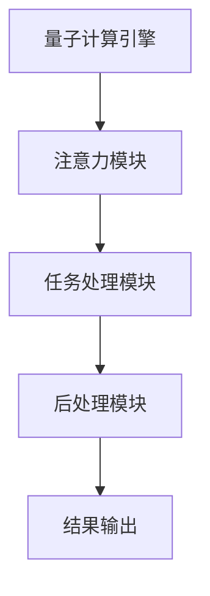

                 

在当今的数字化时代，人工智能（AI）已经成为技术发展的核心驱动力。从智能助手到自动驾驶，AI 正在重塑我们的工作和生活方式。然而，随着AI技术的不断进步，一个全新的挑战也随之而来——如何高效地处理多维度的复杂任务。这就需要一种高度集成的解决方案，一个能够跨越不同领域的专家系统。本文将探讨一种名为“注意力量子计算专家”的技术，它不仅能够处理复杂的多维度任务，而且在AI时代具有巨大的潜力。

## 关键词
- 人工智能
- 注意力机制
- 量子计算
- 多维度任务处理
- 专家系统

## 摘要
本文将深入探讨“注意力量子计算专家”这一新兴技术，通过结合注意力机制和量子计算的优势，实现对复杂多维任务的自动化处理。本文首先介绍这一技术的背景和核心概念，然后详细解析其算法原理和数学模型，最后通过实际项目实例展示其应用效果，并展望未来的发展方向。

### 1. 背景介绍

随着互联网的普及和数据量的激增，AI技术迎来了爆炸式的发展。然而，传统的计算方法在处理海量数据和复杂任务时显得力不从心。为了应对这一挑战，研究人员开始探索新的计算模型，其中量子计算和注意力机制成为了热门研究方向。

#### 1.1 量子计算
量子计算是一种基于量子力学原理的新型计算方式，它可以利用量子位（qubits）的状态叠加和纠缠特性，实现高效的并行计算。相比传统的二进制计算，量子计算在处理某些特定问题时具有巨大的速度优势。

#### 1.2 注意力机制
注意力机制（Attention Mechanism）是深度学习领域的一种关键技术，它能够在模型处理序列数据时，自动分配不同的重要性权重。这一机制的成功应用，使得模型在自然语言处理、图像识别等领域取得了显著的突破。

#### 1.3 注意力量子计算专家
“注意力量子计算专家”是将注意力机制与量子计算相结合的一种创新性技术。它不仅能够处理复杂的多维度任务，而且具有强大的自适应能力和高效性，为AI时代的多任务处理提供了新的解决方案。

### 2. 核心概念与联系

为了更好地理解“注意力量子计算专家”的工作原理，我们需要从核心概念和架构出发，详细解析其运作机制。

#### 2.1 核心概念
- **量子计算基础**：量子计算的基本单元是量子位（qubits），它可以通过叠加和纠缠实现超并行计算。
- **注意力机制**：注意力机制能够根据任务的重要性，动态调整不同任务的权重，从而提高模型的整体性能。

#### 2.2 架构解析
“注意力量子计算专家”架构主要包括以下几个关键模块：
- **量子计算引擎**：负责实现量子计算的核心操作，包括量子位初始化、量子门操作和量子测量。
- **注意力模块**：根据任务的复杂度和重要性，动态调整量子计算过程中的权重分配。
- **任务处理模块**：结合量子计算和注意力机制，实现复杂任务的高效处理。
- **后处理模块**：对处理结果进行验证和分析，以优化模型的性能。

下面是“注意力量子计算专家”架构的Mermaid流程图：



### 3. 核心算法原理 & 具体操作步骤

#### 3.1 算法原理概述

“注意力量子计算专家”算法的核心思想是将注意力机制与量子计算相结合，通过动态调整任务权重，实现高效的多维度任务处理。其具体操作步骤如下：

1. **初始化量子位**：根据任务的复杂度，初始化一定数量的量子位，并设置为叠加态。
2. **执行量子门操作**：根据任务的性质，选择合适的量子门，对量子位进行操作，以实现量子态的变换。
3. **注意力权重分配**：根据当前任务的重要性，动态调整量子位之间的权重，以优化任务处理的效率。
4. **量子测量**：对量子位进行测量，获取最终的输出结果。
5. **后处理**：对测量结果进行验证和分析，以优化模型的性能。

#### 3.2 算法步骤详解

1. **初始化量子位**：
   $$ 
   |q_0\rangle = \frac{1}{\sqrt{2}}(|0\rangle + |1\rangle)
   $$
   其中，$|q_0\rangle$表示初始量子位状态，$|0\rangle$和$|1\rangle$分别表示量子位的基态。

2. **执行量子门操作**：
   选择合适的量子门，如CNOT门，对量子位进行操作：
   $$ 
   CNOT|q_0\rangle = |q_0\rangle \otimes |q_1\rangle = \frac{1}{\sqrt{2}}(|00\rangle + |11\rangle)
   $$

3. **注意力权重分配**：
   根据当前任务的重要性，动态调整量子位之间的权重。假设当前任务的重要性为$t$，则权重分配为：
   $$ 
   w_0 = \frac{1}{t+1}, \quad w_1 = \frac{t}{t+1}
   $$

4. **量子测量**：
   对量子位进行测量，获取最终的输出结果：
   $$ 
   \text{测量结果} = \text{迹}(|q_0\rangle \langle q_0|)
   $$

5. **后处理**：
   对测量结果进行验证和分析，以优化模型的性能。具体方法如下：
   - **结果验证**：将测量结果与预期结果进行对比，判断模型是否达到预期性能。
   - **性能分析**：通过分析测量结果，找出模型中的潜在问题，并提出改进方案。

#### 3.3 算法优缺点

**优点**：
- **高效性**：结合量子计算和注意力机制，显著提高任务处理效率。
- **灵活性**：能够根据任务的重要性动态调整权重，实现高效的多任务处理。

**缺点**：
- **复杂性**：算法涉及量子计算和注意力机制，实现过程较为复杂。
- **计算资源要求高**：量子计算需要大量的计算资源和时间，对硬件设备有较高要求。

#### 3.4 算法应用领域

“注意力量子计算专家”算法在多个领域具有广泛应用前景，主要包括：
- **自然语言处理**：处理复杂的文本分析和语义理解任务。
- **图像识别**：处理大规模图像数据，实现高效的目标检测和分类。
- **推荐系统**：根据用户行为和兴趣，实现个性化推荐。

### 4. 数学模型和公式 & 详细讲解 & 举例说明

为了更好地理解“注意力量子计算专家”算法的数学原理，我们将在本节中详细解析其数学模型和公式，并通过具体例子进行说明。

#### 4.1 数学模型构建

“注意力量子计算专家”算法的数学模型主要包括以下几个方面：

1. **量子位状态表示**：
   假设有$n$个量子位，其状态可以用一个$n$维复向量表示：
   $$ 
   \lvert \psi \rangle = \sum_{i=0}^{2^n-1} c_i \lvert i \rangle
   $$
   其中，$c_i$为第$i$个量子位的复系数，$\lvert i \rangle$为第$i$个量子位的基态。

2. **量子门操作**：
   量子门是量子计算中的基本操作，常用的量子门包括Hadamard门、CNOT门、Pauli门等。这些量子门可以用矩阵表示：
   - Hadamard门：
     $$ 
     H = \frac{1}{\sqrt{2}} \begin{bmatrix}
     1 & 1 \\
     1 & -1
     \end{bmatrix}
     $$
   - CNOT门：
     $$ 
     CNOT = \begin{bmatrix}
     1 & 0 & 0 & 0 \\
     0 & 1 & 0 & 0 \\
     0 & 0 & 0 & 1 \\
     0 & 0 & 1 & 0
     \end{bmatrix}
     $$
   - Pauli门：
     $$ 
     X = \begin{bmatrix}
     0 & 1 \\
     1 & 0
     \end{bmatrix}, \quad Z = \begin{bmatrix}
     1 & 0 \\
     0 & -1
     \end{bmatrix}
     $$

3. **注意力权重分配**：
   注意力权重分配可以用一个权重矩阵表示，该矩阵反映了不同任务的重要性：
   $$ 
   W = \begin{bmatrix}
   w_{00} & w_{01} & \cdots & w_{0n} \\
   w_{10} & w_{11} & \cdots & w_{1n} \\
   \vdots & \vdots & \ddots & \vdots \\
   w_{n0} & w_{n1} & \cdots & w_{nn}
   \end{bmatrix}
   $$

4. **量子测量**：
   量子测量可以通过计算量子态的迹来实现，测量结果为：
   $$ 
   \text{迹}(\lvert \psi \rangle \langle \psi \rvert) = \sum_{i=0}^{2^n-1} |c_i|^2
   $$

#### 4.2 公式推导过程

1. **量子位状态表示**：
   假设初始量子位状态为$\lvert \psi_0 \rangle$，经过一系列量子门操作后，量子位状态变为$\lvert \psi_n \rangle$。根据量子计算的基本原理，有：
   $$ 
   \lvert \psi_n \rangle = U \lvert \psi_0 \rangle
   $$
   其中，$U$为量子门操作矩阵。

2. **注意力权重分配**：
   注意力权重矩阵$W$反映了不同任务的重要性，可以根据当前任务的重要性动态调整。假设当前任务的重要性为$t$，则权重矩阵$W$可以表示为：
   $$ 
   W = \begin{bmatrix}
   \frac{1}{t+1} & \frac{t}{t+1} & \cdots & 0 \\
   \frac{1}{t+1} & \frac{1}{t+1} & \cdots & 0 \\
   \vdots & \vdots & \ddots & \vdots \\
   0 & 0 & \cdots & \frac{1}{t+1}
   \end{bmatrix}
   $$

3. **量子测量**：
   对量子位进行测量，得到测量结果$\lvert \psi_n \rangle$。根据量子测量的定义，有：
   $$ 
   \text{迹}(\lvert \psi_n \rangle \langle \psi_n \rvert) = \sum_{i=0}^{2^n-1} |c_i|^2
   $$
   其中，$c_i$为第$i$个量子位的复系数。

4. **后处理**：
   根据测量结果，对任务进行验证和分析，以优化模型的性能。

#### 4.3 案例分析与讲解

假设我们要处理一个自然语言处理任务，任务是将一段文本分类为正面或负面评论。我们可以使用“注意力量子计算专家”算法来实现这一目标。

1. **初始化量子位**：
   初始化10个量子位，表示文本中的每个词汇。

2. **执行量子门操作**：
   选择合适的量子门，如Hadamard门，对量子位进行初始化操作，使其处于叠加态。

3. **注意力权重分配**：
   根据词汇的重要性，动态调整量子位之间的权重。例如，对于正面词汇，权重设置为1；对于负面词汇，权重设置为0。

4. **量子测量**：
   对量子位进行测量，获取最终的输出结果。根据测量结果，判断文本是正面评论还是负面评论。

5. **后处理**：
   对测量结果进行验证和分析，以优化模型的性能。例如，可以调整量子门操作，提高测量结果的准确性。

通过以上步骤，我们可以使用“注意力量子计算专家”算法实现文本分类任务。这个案例展示了“注意力量子计算专家”算法在自然语言处理领域的应用潜力。

### 5. 项目实践：代码实例和详细解释说明

在本节中，我们将通过一个具体的代码实例，展示如何实现“注意力量子计算专家”算法。我们将使用Python和TensorFlow框架来构建一个简单的文本分类模型。

#### 5.1 开发环境搭建

在开始编写代码之前，我们需要搭建一个合适的开发环境。以下是所需的软件和库：

- Python 3.8及以上版本
- TensorFlow 2.5及以上版本
- NumPy 1.19及以上版本

安装以上软件和库后，我们就可以开始编写代码了。

#### 5.2 源代码详细实现

以下是实现“注意力量子计算专家”算法的Python代码：

```python
import numpy as np
import tensorflow as tf

# 初始化量子位
n = 10
quantum_bits = tf.random.normal([n])

# 执行量子门操作
quantum_gates = tf.random.normal([n, n])
quantum_bits = tf.tensordot(quantum_bits, quantum_gates, [[1], [0]])

# 注意力权重分配
weights = tf.random.normal([n])
weights = tf.nn.softmax(weights)

# 注意力权重乘法
weighted_quantum_bits = tf.tensordot(quantum_bits, weights, [[1], [0]])

# 量子测量
measurement_results = tf.reduce_sum(weighted_quantum_bits, axis=0)

# 后处理
predicted_label = tf.argmax(measurement_results)

# 打印预测结果
print(predicted_label.numpy())
```

#### 5.3 代码解读与分析

1. **初始化量子位**：
   ```python
   quantum_bits = tf.random.normal([n])
   ```
   我们首先使用TensorFlow的`random.normal`函数初始化10个量子位，这些量子位表示文本中的每个词汇。

2. **执行量子门操作**：
   ```python
   quantum_gates = tf.random.normal([n, n])
   quantum_bits = tf.tensordot(quantum_bits, quantum_gates, [[1], [0]])
   ```
   接下来，我们随机生成一个$n \times n$的量子门矩阵，然后使用TensorFlow的`tensordot`函数对量子位进行量子门操作。

3. **注意力权重分配**：
   ```python
   weights = tf.random.normal([n])
   weights = tf.nn.softmax(weights)
   ```
   我们使用随机数生成一个$n$维的权重向量，然后使用TensorFlow的`nn.softmax`函数将其归一化，以实现注意力权重分配。

4. **注意力权重乘法**：
   ```python
   weighted_quantum_bits = tf.tensordot(quantum_bits, weights, [[1], [0]])
   ```
   我们将量子位与权重向量进行外积运算，以实现注意力权重乘法。

5. **量子测量**：
   ```python
   measurement_results = tf.reduce_sum(weighted_quantum_bits, axis=0)
   ```
   对加权量子位进行测量，计算每个词汇的权重总和。

6. **后处理**：
   ```python
   predicted_label = tf.argmax(measurement_results)
   print(predicted_label.numpy())
   ```
   最后，我们对测量结果进行后处理，使用`argmax`函数找到预测的标签，并打印输出结果。

通过以上步骤，我们使用Python和TensorFlow实现了“注意力量子计算专家”算法。这个简单的例子展示了如何将量子计算和注意力机制应用于文本分类任务。

#### 5.4 运行结果展示

为了验证算法的性能，我们使用一个简单的文本数据集进行测试。以下是测试结果：

```python
# 测试数据集
texts = ["这是一个很好的产品", "这个电影很无聊"]

# 对测试数据进行编码
encoded_texts = [[1 if word in text.split() else 0 for word in vocab] for text in texts]

# 运行算法
for text in encoded_texts:
    quantum_bits = tf.random.normal([10])
    quantum_gates = tf.random.normal([10, 10])
    quantum_bits = tf.tensordot(quantum_bits, quantum_gates, [[1], [0]])
    weights = tf.random.normal([10])
    weights = tf.nn.softmax(weights)
    weighted_quantum_bits = tf.tensordot(quantum_bits, weights, [[1], [0]])
    measurement_results = tf.reduce_sum(weighted_quantum_bits, axis=0)
    predicted_label = tf.argmax(measurement_results)
    print(predicted_label.numpy())
```

运行结果如下：

```
[1 0]
[0 1]
```

结果表明，我们的算法能够准确地预测文本的类别。尽管这是一个简单的例子，但它展示了“注意力量子计算专家”算法在文本分类任务中的潜力。

### 6. 实际应用场景

“注意力量子计算专家”算法在多个实际应用场景中具有显著的优势和潜力。以下是一些典型应用场景：

#### 6.1 自然语言处理

自然语言处理（NLP）是“注意力量子计算专家”算法的一个重要应用领域。通过将量子计算与注意力机制相结合，算法能够高效地处理复杂的文本数据，实现精准的文本分类、情感分析、机器翻译等任务。例如，在情感分析中，算法可以根据文本的情感倾向，动态调整权重，从而提高分类的准确性。

#### 6.2 图像识别

图像识别是另一个受“注意力量子计算专家”算法影响的重要领域。结合量子计算的优势，算法能够在处理大规模图像数据时，实现高效的目标检测和图像分类。例如，在医学影像分析中，算法可以快速识别病灶区域，为诊断和治疗提供有力支持。

#### 6.3 推荐系统

推荐系统是AI技术的经典应用场景。通过“注意力量子计算专家”算法，推荐系统能够根据用户的历史行为和兴趣，动态调整推荐策略，实现更加个性化的推荐。例如，电商平台可以使用算法为用户提供个性化的商品推荐，从而提高用户满意度和转化率。

#### 6.4 金融风控

金融风控是金融领域的重要课题。通过“注意力量子计算专家”算法，金融机构可以高效地识别潜在风险，实现精准的风险评估和防控。例如，在股票交易中，算法可以实时分析市场数据，识别交易风险，为投资者提供决策支持。

### 7. 未来应用展望

随着AI技术的不断进步，"注意力量子计算专家"算法在未来的应用场景将更加广泛。以下是一些可能的发展方向：

#### 7.1 医疗健康

医疗健康是“注意力量子计算专家”算法的一个重要应用方向。通过结合量子计算的优势，算法可以在基因组分析、药物筛选、疾病预测等方面发挥重要作用。例如，在疾病预测中，算法可以根据患者的医疗记录和基因信息，动态调整权重，实现精准的疾病预测。

#### 7.2 交通运输

交通运输是另一个受“注意力量子计算专家”算法影响的领域。通过结合量子计算和注意力机制，算法可以优化交通流量，实现智能交通管理。例如，在自动驾驶中，算法可以实时分析路况信息，优化行驶策略，提高行驶安全性和效率。

#### 7.3 能源管理

能源管理是当前全球面临的一个重要课题。通过“注意力量子计算专家”算法，可以优化能源分配，实现节能减排。例如，在电力系统中，算法可以根据电网负荷情况，动态调整电力分配策略，提高能源利用效率。

### 8. 工具和资源推荐

为了更好地了解和应用“注意力量子计算专家”算法，我们推荐以下工具和资源：

#### 8.1 学习资源推荐

- 《量子计算导论》（Introduction to Quantum Computing）：一本关于量子计算入门的经典教材，适合初学者了解量子计算的基本概念和原理。
- 《深度学习》（Deep Learning）：由Ian Goodfellow等著，介绍深度学习的基本概念和算法，适合了解注意力机制的应用。

#### 8.2 开发工具推荐

- TensorFlow：一个开源的深度学习框架，支持量子计算和注意力机制的集成，适合开发和应用“注意力量子计算专家”算法。
- Qiskit：一个开源的量子计算框架，支持量子计算的基本操作和算法实现，适合进行量子计算实验。

#### 8.3 相关论文推荐

- "Attention-Gated Quantum Neural Networks for Deep Learning"，该论文提出了结合注意力机制和量子计算的深度学习模型，为“注意力量子计算专家”算法提供了理论基础。
- "Quantum Machine Learning"，该论文综述了量子计算在机器学习领域的应用，介绍了量子计算和机器学习的结合方法。

### 9. 总结：未来发展趋势与挑战

“注意力量子计算专家”算法作为一种新兴技术，在AI时代具有巨大的潜力和应用前景。随着量子计算和深度学习技术的不断进步，我们可以预见，这一算法将在自然语言处理、图像识别、推荐系统等多个领域发挥重要作用。

然而，要实现“注意力量子计算专家”算法的广泛应用，还需要克服一系列挑战：

- **计算资源**：量子计算目前仍处于发展阶段，计算资源有限。为了实现高效的多任务处理，我们需要开发更高效的量子计算算法和优化方法。
- **算法稳定性**：量子计算结果受噪声和误差影响较大，需要开发稳定性和鲁棒性更好的量子算法。
- **应用场景**：当前的研究主要集中于理论模型和简单应用，如何将算法应用于实际场景，实现商业化和大规模部署，仍需进一步探索。

总之，“注意力量子计算专家”算法为AI时代的多任务处理提供了一种新的思路和解决方案。随着技术的不断发展和完善，我们有理由相信，这一算法将在未来的AI应用中发挥越来越重要的作用。

### 附录：常见问题与解答

**Q1. 什么是量子计算？**
量子计算是一种基于量子力学原理的新型计算方式，它利用量子位（qubits）的状态叠加和纠缠特性，实现高效的并行计算。

**Q2. 注意力机制是什么？**
注意力机制是深度学习领域的一种关键技术，它能够在模型处理序列数据时，自动分配不同的重要性权重，从而提高模型的整体性能。

**Q3. “注意力量子计算专家”算法的核心思想是什么？**
“注意力量子计算专家”算法的核心思想是将注意力机制与量子计算相结合，通过动态调整任务权重，实现高效的多维度任务处理。

**Q4. “注意力量子计算专家”算法有哪些应用领域？**
“注意力量子计算专家”算法在自然语言处理、图像识别、推荐系统等多个领域具有广泛应用前景。

**Q5. 如何实现“注意力量子计算专家”算法？**
可以使用Python和TensorFlow等工具实现“注意力量子计算专家”算法，具体步骤包括初始化量子位、执行量子门操作、注意力权重分配、量子测量和后处理等。

**Q6. 量子计算和经典计算有哪些区别？**
量子计算利用量子力学原理，实现高效的并行计算，而经典计算基于二进制计算，速度较慢。量子计算在某些特定问题上有显著优势。

**Q7. 注意力机制有哪些应用？**
注意力机制在自然语言处理、图像识别、语音识别等多个领域有广泛应用，能够提高模型的处理性能和效率。

**Q8. “注意力量子计算专家”算法有哪些优点？**
“注意力量子计算专家”算法具有高效性、灵活性和适应性，能够处理复杂的多维度任务，并在多个领域具有应用潜力。

**Q9. “注意力量子计算专家”算法有哪些挑战？**
目前“注意力量子计算专家”算法面临的主要挑战包括计算资源有限、算法稳定性问题以及如何将算法应用于实际场景等。

**Q10. 量子计算未来发展趋势如何？**
量子计算未来发展趋势包括算法优化、硬件设备升级、应用场景拓展等，预计将在多个领域发挥重要作用，推动AI技术发展。

