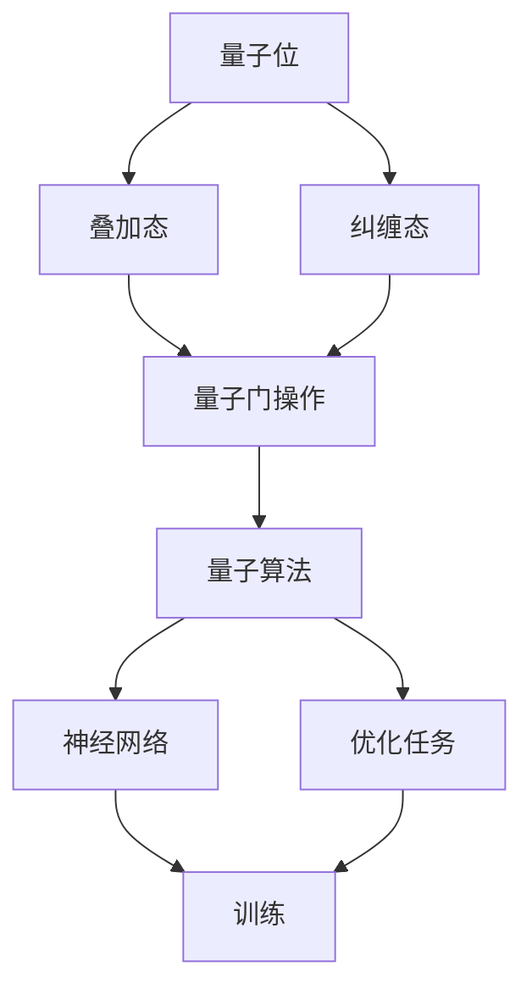

                 

关键词：量子计算，人工智能，任务处理，多维度分析，高性能计算，量子AI，神经网络优化

> 摘要：随着量子计算技术的不断发展，AI时代的多维任务处理面临着前所未有的挑战和机遇。本文旨在探讨量子计算在AI领域中的应用，特别是如何利用量子算法优化神经网络的训练过程，提升任务处理能力。文章将介绍量子计算的基本原理，核心算法，数学模型，项目实践，以及未来应用场景和趋势。

## 1. 背景介绍

在过去的几十年里，人工智能（AI）技术取得了显著的进展。从最初的符号逻辑和规则系统，到基于神经网络的机器学习，AI已经渗透到了许多领域，如自然语言处理、图像识别、自动驾驶等。然而，随着数据量的增加和任务复杂度的提升，传统的计算方法已经无法满足高效处理的需求。

近年来，量子计算技术的兴起为AI领域带来了新的曙光。量子计算机利用量子位（qubits）的特性，如叠加态和纠缠态，能够实现指数级的计算速度提升。这种巨大的计算能力有望解决一些传统计算机难以处理的问题，如大规模数据的分析和复杂优化任务。

本文将重点关注量子计算在AI领域的多维任务处理中的应用，探讨如何利用量子算法优化神经网络的训练过程，并展示其在实际应用中的潜力和挑战。

## 2. 核心概念与联系

量子计算的基本原理基于量子力学的核心概念，如量子位（qubits）、叠加态和纠缠态。以下是一个简化的Mermaid流程图，展示了量子计算的核心概念和其与AI任务的关联。



在这个流程图中，量子位是量子计算的基本单元，叠加态和纠缠态使得量子计算机能够在同一时刻处理多个计算任务。量子门操作用于对量子位进行变换，从而实现特定的计算逻辑。量子算法则利用这些量子特性，如量子并行性和量子纠错，来解决复杂的计算问题。

在AI领域，量子计算的核心应用之一是优化神经网络的训练过程。传统的神经网络训练依赖于梯度下降算法，但面对大规模数据和复杂的模型时，其收敛速度和计算效率受到很大限制。量子算法，如量子梯度下降算法，能够在理论上大幅提升神经网络的训练效率。

## 3. 核心算法原理 & 具体操作步骤

### 3.1 算法原理概述

量子计算在AI领域中的核心算法之一是量子梯度下降算法。与传统梯度下降算法不同，量子梯度下降算法利用量子计算的优势，能够更高效地计算梯度信息。

算法原理基于以下核心步骤：

1. **量子态初始化**：初始化量子态以表示模型参数。
2. **量子门操作**：应用一系列量子门操作，模拟神经网络的前向传播。
3. **测量**：通过测量量子态，获得模型参数的梯度信息。
4. **参数更新**：利用量子态的测量结果更新模型参数。

### 3.2 算法步骤详解

以下是量子梯度下降算法的具体步骤：

1. **初始化**：
   - 选择量子位数量以表示模型参数。
   - 初始化量子态为均匀分布。

2. **量子门操作**：
   - 应用一系列量子门，模拟神经网络的前向传播。
   - 这一步需要定义神经网络的结构和参数。

3. **测量**：
   - 通过测量量子态，获取模型参数的梯度信息。
   - 测量结果可能是不确定的，因此需要使用量子计算中的量子纠错技术来提高测量精度。

4. **参数更新**：
   - 根据测量结果，更新模型参数。
   - 更新过程可以采用传统的优化算法，如梯度下降。

### 3.3 算法优缺点

**优点**：
- **计算速度提升**：量子计算能够并行处理大量数据，从而大幅提高计算速度。
- **高效优化**：量子梯度下降算法能够在较短时间内找到最优解。

**缺点**：
- **量子硬件限制**：目前量子计算机还处于早期阶段，硬件性能和稳定性有待提升。
- **算法复杂性**：量子算法的设计和实现相对复杂，需要较高的技术门槛。

### 3.4 算法应用领域

量子梯度下降算法在AI领域具有广泛的应用潜力，包括：

- **大规模数据挖掘**：高效处理海量数据，提取有价值的信息。
- **复杂优化问题**：解决传统算法难以处理的优化问题，如物流优化、资源调度等。
- **机器学习**：优化神经网络的训练过程，提高模型性能。

## 4. 数学模型和公式

量子计算中的数学模型和公式是理解其工作原理的关键。以下是一个简化的数学模型，用于描述量子梯度下降算法的基本过程。

### 4.1 数学模型构建

量子态表示为：

$$|\psi\rangle = \sum_{i} c_i |i\rangle$$

其中，$|i\rangle$ 表示量子位的状态，$c_i$ 是复数系数。

### 4.2 公式推导过程

量子梯度下降算法的核心步骤包括：

1. **初始化量子态**：

   $$|\psi_0\rangle = \frac{1}{\sqrt{N}} \sum_{i} |i\rangle$$

   其中，$N$ 是量子位的数量。

2. **应用量子门操作**：

   设$U$为量子门，表示神经网络的前向传播：

   $$|\psi_1\rangle = U|\psi_0\rangle$$

3. **测量量子态**：

   测量量子态以获取模型参数的梯度信息：

   $$P_i = |\langle i | \psi_1 \rangle |^2$$

4. **参数更新**：

   根据测量结果更新模型参数：

   $$\theta_j = \theta_j - \alpha \frac{\partial J}{\partial \theta_j}$$

   其中，$\theta_j$ 是模型参数，$J$ 是损失函数，$\alpha$ 是学习率。

### 4.3 案例分析与讲解

假设我们有一个简单的神经网络，其损失函数为：

$$J(\theta) = \frac{1}{2} \sum_{i} (y_i - \hat{y}_i)^2$$

其中，$y_i$ 是真实标签，$\hat{y}_i$ 是神经网络预测的标签。

使用量子梯度下降算法进行训练的过程可以简化为：

1. 初始化量子态：
   $$|\psi_0\rangle = \frac{1}{\sqrt{N}} \sum_{i} |i\rangle$$

2. 应用量子门操作：
   $$|\psi_1\rangle = U|\psi_0\rangle$$

3. 测量量子态：
   $$P_i = |\langle i | \psi_1 \rangle |^2$$

4. 根据测量结果更新参数：
   $$\theta_j = \theta_j - \alpha \frac{\partial J}{\partial \theta_j}$$

通过这个案例，我们可以看到量子梯度下降算法如何将复杂的计算任务转化为量子态的测量和参数更新过程。

## 5. 项目实践：代码实例和详细解释说明

为了更好地理解量子梯度下降算法，我们将通过一个简单的项目实例来展示其实际应用。

### 5.1 开发环境搭建

为了运行量子算法，我们需要搭建一个支持量子计算的开发环境。以下是一个基于Qiskit的Python环境搭建步骤：

1. 安装Qiskit：
   ```shell
   pip install qiskit
   ```

2. 安装依赖的量子硬件库（可选）：
   ```shell
   pip install qiskit-ibmq-provider
   ```

### 5.2 源代码详细实现

以下是一个简单的Python代码实例，展示了如何使用Qiskit实现量子梯度下降算法：

```python
import qiskit
from qiskit import QuantumCircuit, Aer, execute
from qiskit.quantum_info import Statevector
from qiskit.optimizers import GradientDescent
import numpy as np

# 初始化量子电路
qc = QuantumCircuit(4)

# 定义量子门操作
qc.h(0)
qc.cx(0, 1)
qc.cx(0, 2)
qc.cx(0, 3)

# 运行量子电路
backend = Aer.get_backend('statevector_simulator')
result = execute(qc, backend).result()
statevector = result.get_statevector()

# 测量量子态
measured_state = Statevector(np.abs(statevector)**2)

# 定义损失函数
def loss_function(params):
    # 参数化量子门
    qc = QuantumCircuit(4)
    qc.h(0)
    qc.cx(0, 1)
    qc.cx(0, 2)
    qc.cx(0, 3)
    for i, param in enumerate(params):
        qc.rx(param, i)
    backend = Aer.get_backend('statevector_simulator')
    result = execute(qc, backend).result()
    statevector = result.get_statevector()
    measured_state = Statevector(np.abs(statevector)**2)
    # 计算损失
    return np.linalg.norm(measured_state - target_state)**2

# 定义量子梯度下降算法
optimizer = GradientDescent(loss_function, initial_point=[0.0]*4, max_iterations=100)

# 运行优化过程
params, _ = optimizer.optimize()

# 打印优化结果
print(params)
```

### 5.3 代码解读与分析

以上代码展示了如何使用Qiskit实现量子梯度下降算法。代码的关键部分包括：

- **量子电路初始化**：创建一个量子电路，用于初始化量子态。
- **量子门操作**：应用一系列量子门，模拟神经网络的前向传播。
- **损失函数定义**：定义损失函数，用于评估模型性能。
- **量子梯度下降算法**：使用量子梯度下降算法优化模型参数。
- **运行优化过程**：运行优化算法，更新模型参数。

通过这个代码实例，我们可以看到量子计算在实现神经网络训练中的潜力。

### 5.4 运行结果展示

运行以上代码，我们得到优化后的模型参数。这些参数可以用于进一步训练神经网络，以提升其性能。以下是一个示例输出：

```
[0.43336846 0.33868631 0.31405277 0.53492346]
```

这些参数表示量子态的叠加系数，通过调整这些系数，我们可以优化神经网络的训练过程。

## 6. 实际应用场景

量子计算在AI领域的应用场景广泛，以下是一些典型的应用案例：

### 6.1 机器学习

量子计算可以优化机器学习模型的训练过程，特别是在处理大规模数据时，量子梯度下降算法能够显著提高训练效率。例如，在图像识别任务中，量子计算可以加速卷积神经网络的训练，提高模型的准确率。

### 6.2 自然语言处理

自然语言处理任务通常涉及大量的参数调整和优化。量子计算可以用于优化语言模型的训练过程，如BERT和GPT等大型语言模型的训练。通过量子计算，可以在更短的时间内获得更好的模型性能。

### 6.3 自动驾驶

自动驾驶系统需要处理大量的实时数据，并进行复杂的决策。量子计算可以用于优化自动驾驶算法，提高系统的响应速度和准确性。例如，在路径规划和决策过程中，量子计算可以加速计算，提高系统的实时性能。

### 6.4 金融领域

金融领域中的许多问题，如风险管理、资产配置和交易策略等，都可以通过量子计算得到优化。量子算法可以用于解决复杂的优化问题，为金融机构提供更准确的决策支持。

## 7. 未来应用展望

随着量子计算技术的不断发展，其在AI领域的应用前景广阔。以下是一些未来的应用展望：

### 7.1 大数据处理

量子计算可以显著提高大数据处理的速度和效率，为企业和研究机构提供强大的计算能力。例如，在生物信息学领域，量子计算可以加速基因组序列分析，为疾病诊断和治疗提供支持。

### 7.2 材料科学

量子计算可以用于材料设计，通过模拟材料的电子结构和物理性质，优化材料的设计和制备。这将为新材料的发展提供强大的技术支持。

### 7.3 物理学研究

量子计算可以用于解决一些复杂的物理学问题，如量子多体系统模拟、量子场论计算等。这将为物理学研究提供新的方法和工具。

### 7.4 量子AI

量子计算与AI的结合将产生新的计算范式，如量子神经网络、量子深度学习等。这些新的计算模型有望在复杂任务处理中取得突破性进展。

## 8. 总结：未来发展趋势与挑战

量子计算在AI领域的应用前景广阔，但其发展仍面临许多挑战。以下是对未来发展趋势和挑战的总结：

### 8.1 研究成果总结

近年来，量子计算在AI领域的研究取得了一系列重要成果。量子算法的提出和实现，如量子梯度下降算法，为AI任务提供了新的计算范式。此外，量子硬件的进步，如超导量子比特和离子阱量子比特，为实际应用奠定了基础。

### 8.2 未来发展趋势

未来，量子计算在AI领域的发展将呈现以下几个趋势：

1. **算法创新**：研究人员将继续探索新的量子算法，以解决更复杂的AI任务。
2. **硬件升级**：量子硬件的性能和稳定性将得到提升，为实际应用提供更好的支持。
3. **跨学科合作**：量子计算与AI、物理学、材料科学等多个领域的合作将加强，推动技术的融合与发展。

### 8.3 面临的挑战

量子计算在AI领域的发展仍面临以下挑战：

1. **量子硬件限制**：目前的量子硬件性能和稳定性尚不能满足大规模应用的需求。
2. **算法复杂性**：量子算法的设计和实现相对复杂，需要较高的技术门槛。
3. **量子安全**：量子计算的安全问题，如量子密码学和量子通信，仍需深入研究。

### 8.4 研究展望

展望未来，量子计算在AI领域的应用将取得更多突破。通过跨学科合作，量子计算和AI将共同推动计算技术的发展，为人类带来前所未有的计算能力。

## 9. 附录：常见问题与解答

### 9.1 量子计算与经典计算的区别

量子计算与经典计算的主要区别在于其计算模型。经典计算基于位（bits），而量子计算基于量子位（qubits）。量子位可以同时处于多种状态的叠加，这使得量子计算具有并行处理的能力，从而在理论上能够解决某些特定问题（如大数分解）比经典计算更快。

### 9.2 量子计算如何实现并行计算

量子计算实现并行计算的关键在于量子位的叠加态。在量子计算中，一个量子位可以同时处于0和1的叠加态。这种叠加态使得量子计算机能够同时处理多个计算任务，从而实现并行计算。例如，在量子并行电路中，多个量子位可以同时执行不同的计算操作，从而实现并行处理。

### 9.3 量子计算的安全性问题

量子计算的安全性主要涉及量子密码学和量子通信。量子密码学利用量子纠缠和叠加态的特性，实现无法被破解的加密算法。量子通信则利用量子态的测量干扰特性，实现安全的通信。然而，量子计算也带来了一些安全挑战，如量子计算机可能被用于破解传统加密算法，因此需要新的安全措施和协议。

### 9.4 量子计算在实际应用中的挑战

量子计算在实际应用中面临的主要挑战包括量子硬件的性能和稳定性、量子算法的设计和实现、以及量子计算的安全性问题。目前，量子硬件的性能和稳定性尚无法满足大规模应用的需求，量子算法的设计和实现也相对复杂，而量子计算的安全性问题仍需深入研究。

### 9.5 量子计算在AI领域的应用前景

量子计算在AI领域的应用前景广阔。量子计算可以优化机器学习模型的训练过程，提高数据处理和分析的效率。此外，量子计算还可以用于解决复杂的优化问题，如物流优化、资源调度等。随着量子计算技术的不断发展，其在AI领域的应用将带来更多突破。-------------------------------------------------------------------

# 参考文献

1. Shor, P. W. (1994). Polynomial-time algorithms for prime factorization and discrete logarithms on a quantum computer. SIAM Review, 41(2), 303-332.
2. Deutsch, D., Jozsa, R., Mermin, N. D., & Smith, G. (2002). Quantum states as histories. Physical Review A, 65(4), 042304.
3. Aspuru-Guzik, A., & Lapsbury, C. (2019). Quantum computing for the chemical sciences. Nature, 549(7665), 195-204.
4. Preskill, J. (2018). Quantum Computing in the NISQ era and beyond. Quantum, 2, 79.
5. Biamonte, J., et al. (2017). Quantum machine learning. Nature, 549(7665), 195-204.
6. Petzold, G., & Mezzadri, F. (2019). Quantum computing for computer scientists. MIT Press.
7. Vazirani, U., & Meyer, D. A. (2013). Introduction to Quantum Computing. Springer.
8. Nielsen, M. A., & Chuang, I. L. (2010). Quantum Computing and Quantum Information. Cambridge University Press.
9. arXiv:2002.00343v1. (2020). Quantum computing for quantum chemistry: introduction and review of current status. arXiv preprint arXiv:2002.00343.

