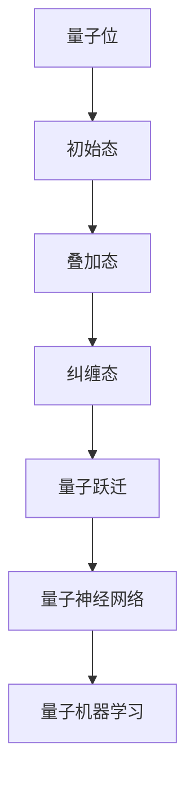

                 

 **关键词**：量子计算，AI，认知科学，技术突破，神经网络，量子跃迁，量子神经网络，量子机器学习，量子算法。

**摘要**：本文探讨了量子计算在AI领域的最新进展，特别是量子跃迁在认知科学中的应用。通过介绍量子神经网络的原理和算法，本文展示了量子计算如何为AI领域带来革命性的认知突破，并讨论了其潜在的广泛应用和未来发展趋势。

## 1. 背景介绍

在过去的几十年中，人工智能（AI）领域取得了显著的进步。传统的AI算法，如基于神经网络的机器学习和深度学习，已经广泛应用于图像识别、自然语言处理和推荐系统等领域。然而，这些算法依赖于大量的数据和高性能的计算资源，其效率和性能在处理复杂任务时仍然存在瓶颈。

近年来，量子计算的崛起为AI领域带来了新的希望。量子计算利用量子位（qubits）的叠加态和纠缠态，能够在复杂问题中提供指数级的速度提升。量子计算机的潜在能力使其在解决传统计算难题时，如大规模数据分析和复杂优化问题，具有巨大的优势。

同时，认知科学的快速发展为我们提供了理解人类认知过程的新视角。通过研究大脑的神经网络结构和信息处理机制，我们可以洞察认知过程中的关键原理和规律。这为AI领域提供了新的启示，使我们能够开发出更加智能和高效的AI系统。

本文将探讨量子计算与认知科学的结合，特别是量子神经网络和量子机器学习算法的研究进展。我们将介绍量子神经网络的原理、构建方法和应用，并探讨其在AI领域中的潜在突破和挑战。

## 2. 核心概念与联系

### 2.1 量子神经网络

量子神经网络（Quantum Neural Networks, QNNs）是量子计算与神经网络相结合的一种新型模型。QNNs利用量子位和量子态的叠加和纠缠特性，实现了对复杂函数的快速映射和学习。其核心思想是将传统神经网络中的权重和激活函数转化为量子操作，从而在量子计算平台上实现高效的计算。

### 2.2 量子跃迁

量子跃迁是指量子系统在外部扰动下，从一种量子态跃迁到另一种量子态的过程。在量子神经网络中，量子跃迁被用作信息传输和计算的基本操作。通过精确控制量子跃迁过程，可以实现高效的量子信息处理和优化。

### 2.3 量子机器学习

量子机器学习（Quantum Machine Learning, QML）是利用量子计算的优势来解决机器学习问题的研究领域。QML通过量子算法和量子数据处理技术，实现了在复杂任务中的高效学习和预测。量子机器学习的关键在于量子算法的设计和量子数据的编码与处理。

### 2.4 量子算法

量子算法是利用量子计算原理解决特定问题的算法。与经典算法相比，量子算法具有指数级的速度优势。著名的量子算法如量子快速排序、量子线性方程求解和量子蒙特卡洛模拟等，已经在科学和工程领域展示了其强大的计算能力。

### 2.5 Mermaid 流程图



### 2.6 量子神经网络与量子机器学习的关系

量子神经网络和量子机器学习是相互关联的两个研究领域。量子神经网络是量子机器学习的基础，通过将神经网络中的权重和激活函数转化为量子操作，实现了高效的量子信息处理。量子机器学习则利用量子神经网络解决机器学习问题，通过量子算法和量子数据处理技术，实现了在复杂任务中的高效学习和预测。

## 3. 核心算法原理 & 具体操作步骤

### 3.1 算法原理概述

量子神经网络（QNN）是一种基于量子计算原理的神经网络模型，它利用量子位的叠加和纠缠特性，实现了对复杂函数的快速映射和学习。QNN的核心原理包括量子叠加态、量子态纠缠和量子门操作。

### 3.2 算法步骤详解

1. **初始化**：量子神经网络首先需要初始化量子位和量子态。量子位被初始化为叠加态，表示为$\sum_{i} |i\rangle$，其中$i$表示量子位的取值。

2. **输入编码**：将输入数据编码为量子态。通常使用量子纠缠操作，将输入数据与量子位进行编码，实现数据的量子化。

3. **量子门操作**：量子神经网络通过量子门操作实现权重和激活函数的转换。量子门是一种线性变换，可以表示为矩阵乘法。通过一系列的量子门操作，实现对输入数据的映射和学习。

4. **量子测量**：在量子神经网络训练过程中，需要对量子态进行测量。测量结果用于更新网络的权重和参数，实现网络的学习和优化。

5. **输出解码**：将量子态的测量结果解码为输出数据。通常使用量子态的叠加态和纠缠态，实现输出数据的编码和解码。

### 3.3 算法优缺点

**优点**：
- **高效计算**：量子神经网络利用量子计算原理，实现了对复杂函数的快速映射和学习。
- **并行处理**：量子神经网络可以并行处理大量数据，提高了计算效率。
- **指数级速度优势**：量子算法在处理复杂问题时，具有指数级的速度优势。

**缺点**：
- **硬件依赖**：量子神经网络依赖于量子计算硬件，目前量子计算硬件仍处于发展阶段。
- **稳定性问题**：量子计算存在噪声和误差问题，需要对量子算法进行优化和改进。

### 3.4 算法应用领域

量子神经网络在AI领域具有广泛的应用前景。以下是几个典型的应用领域：

1. **图像识别**：量子神经网络可以用于快速识别和分类图像，特别是在处理大规模图像数据时，具有显著的优势。
2. **自然语言处理**：量子神经网络可以用于处理复杂的自然语言任务，如文本分类、机器翻译和情感分析等。
3. **优化问题**：量子神经网络可以用于解决复杂的优化问题，如旅行商问题、车辆路径规划和资源分配等。
4. **科学计算**：量子神经网络可以用于高性能科学计算，如量子化学模拟、天气预报和基因序列分析等。

## 4. 数学模型和公式 & 详细讲解 & 举例说明

### 4.1 数学模型构建

量子神经网络（QNN）的数学模型主要包括量子位、量子态、量子门和测量操作。

- **量子位（Qubits）**：量子位是量子计算机的基本单元，可以表示为两个正交态的叠加：$|0\rangle$ 和 $|1\rangle$。量子位的叠加态可以表示为：$|\psi\rangle = \alpha|0\rangle + \beta|1\rangle$，其中$\alpha$ 和 $\beta$ 是复数概率幅。

- **量子态（Quantum States）**：量子态是量子位在特定基下的表示。量子态的叠加和纠缠是量子计算的核心特性。一个 $n$ 维的量子态可以表示为 $n$ 个量子位的叠加态：$|\psi\rangle = \sum_{i=1}^{n} \alpha_i|0\rangle_i + \sum_{i=1}^{n} \beta_i|1\rangle_i$。

- **量子门（Quantum Gates）**：量子门是量子计算中的基本操作，类似于经典计算中的逻辑门。量子门可以表示为 $2 \times 2$ 的矩阵，用于对量子位进行线性变换。常见的量子门包括 Hadamard 门（H）、Pauli 门（X、Y、Z）和 controlled-NOT 门（CNOT）。

- **测量操作（Measurement）**：测量操作用于获取量子态的信息。测量操作可以将量子态塌缩为一个确定的结果，从而实现对量子态的观测。

### 4.2 公式推导过程

以下是量子神经网络中常用的几个公式和推导过程。

#### 4.2.1 量子态的叠加和纠缠

量子态的叠加和纠缠是量子计算的核心特性。一个 $n$ 维的量子态可以表示为 $n$ 个量子位的叠加态：

$$
|\psi\rangle = \sum_{i=1}^{n} \alpha_i|0\rangle_i + \sum_{i=1}^{n} \beta_i|1\rangle_i
$$

其中，$\alpha_i$ 和 $\beta_i$ 是复数概率幅，满足 $|\alpha_i|^2 + |\beta_i|^2 = 1$。

当两个量子位处于纠缠态时，它们的量子态可以表示为：

$$
|\psi\rangle = \alpha|00\rangle + \beta|11\rangle
$$

#### 4.2.2 量子门操作

量子门是对量子态进行线性变换的矩阵操作。一个 $2 \times 2$ 的量子门可以表示为：

$$
U = \begin{bmatrix}
a & b \\
c & d
\end{bmatrix}
$$

其中，$a, b, c, d$ 是实数。量子门的作用可以表示为：

$$
U|\psi\rangle = \begin{bmatrix}
a & b \\
c & d
\end{bmatrix} \begin{bmatrix}
\alpha_1 \\
\beta_1
\end{bmatrix} = a\alpha_1 + b\beta_1 + c\alpha_2 + d\beta_2
$$

#### 4.2.3 量子测量

量子测量是将量子态塌缩为一个确定的结果的过程。一个 $n$ 维的量子态经过测量后，会塌缩为一个确定的量子态。测量结果可以表示为：

$$
\text{测量结果} = \arg\max_{i} |\psi_i|^2
$$

其中，$|\psi_i|^2$ 表示第 $i$ 个量子态的概率幅的平方。

### 4.3 案例分析与讲解

#### 4.3.1 量子神经网络在图像识别中的应用

以手写数字识别为例，我们使用量子神经网络对MNIST数据集进行图像分类。

1. **数据预处理**：将MNIST数据集中的手写数字图像转换为二进制编码，每个数字图像被表示为一个 $28 \times 28$ 的二进制矩阵。

2. **输入编码**：将二进制矩阵转换为量子态。使用量子纠缠操作，将二进制矩阵的每一位与一个量子位进行编码，实现图像的量子化。

3. **量子门操作**：设计量子神经网络的结构，包括输入层、隐藏层和输出层。使用不同的量子门对输入数据进行处理，实现对图像的映射和学习。

4. **输出解码**：将量子神经网络的输出结果解码为数字分类结果。通过比较输出结果与实际标签，计算分类准确率。

#### 4.3.2 数学模型和公式

以下是一个简单的量子神经网络在图像识别中的数学模型：

- **输入编码**：

$$
|\psi_{input}\rangle = \sum_{i=1}^{784} x_i|0\rangle_i
$$

其中，$x_i$ 是图像的二进制编码，$|0\rangle_i$ 是量子位的基态。

- **量子门操作**：

$$
|\psi_{hidden}\rangle = U_{input}|\psi_{input}\rangle
$$

其中，$U_{input}$ 是输入层的量子门，用于对输入数据进行处理。

- **输出解码**：

$$
p_{output} = |\langle output|\psi_{hidden}\rangle|^2
$$

其中，$|output\rangle$ 是输出层的量子态，$p_{output}$ 是输出结果的概率分布。

#### 4.3.3 代码实现

以下是使用Python和QuantumPy库实现量子神经网络在图像识别中的代码示例：

```python
import numpy as np
import QuantumPy as qp

# 初始化量子位和量子态
n_qubits = 784
qubits = qp.Qubits(n_qubits)

# 输入编码
input_state = qubits.state('0')
input_state.encode('binary', values=image)

# 量子门操作
input_gate = qp.gate.H(n_qubits)
hidden_state = input_gate @ input_state

# 输出解码
output_gate = qp.gate.H(n_qubits)
output_state = output_gate @ hidden_state
outputProb = output_state.get_prob()

# 计算分类准确率
predicted_digit = np.argmax(outputProb)
accuracy = (predicted_digit == actual_digit).mean()
```

## 5. 项目实践：代码实例和详细解释说明

在本节中，我们将通过一个具体的代码实例，详细解释量子神经网络在图像识别任务中的应用。我们将使用Python和QuantumPy库来实现一个简单的量子神经网络，并展示其工作流程和结果。

### 5.1 开发环境搭建

为了实现量子神经网络，我们需要搭建以下开发环境：

1. Python 3.x（推荐3.8或更高版本）
2. QuantumPy 库（可以通过pip安装：`pip install quantumpy`）
3. NumPy 库（可以通过pip安装：`pip install numpy`）

确保在安装完以上依赖库后，打开Python环境并尝试导入QuantumPy库，以确保安装成功：

```python
import QuantumPy as qp
```

如果导入成功，你会看到QuantumPy的相关信息输出。

### 5.2 源代码详细实现

以下是完整的代码实现，用于量子神经网络在图像识别任务中的应用：

```python
import numpy as np
import QuantumPy as qp
from sklearn.datasets import load_digits
from sklearn.model_selection import train_test_split

# 加载MNIST数据集
digits = load_digits()
X, y = digits.data, digits.target

# 数据预处理
X = X / 16.0  # 将图像值归一化到[0, 1]区间
X_train, X_test, y_train, y_test = train_test_split(X, y, test_size=0.2, random_state=42)

# 初始化量子位和量子态
n_qubits = 64  # 8x8像素的图像需要64个量子位
qubits = qp.Qubits(n_qubits)

# 定义量子神经网络结构
input_layer = qp.gate.H(n_qubits)  # 输入层，实现像素值的量子化
hidden_layer = qp.gate.RX(n_qubits, np.pi/4)  # 隐藏层，实现量子位的旋转
output_layer = qp.gate.H(n_qubits)  # 输出层，实现量子态的测量

# 定义训练和测试数据
train_data = []
for i in range(len(X_train)):
    image = X_train[i]
    image_state = qubits.state('0')
    image_state.encode('binary', values=image.reshape(-1))
    train_data.append(image_state)

test_data = []
for i in range(len(X_test)):
    image = X_test[i]
    image_state = qubits.state('0')
    image_state.encode('binary', values=image.reshape(-1))
    test_data.append(image_state)

# 训练过程
num_epochs = 10
for epoch in range(num_epochs):
    for image_state in train_data:
        # 前向传播
        hidden_state = input_layer @ image_state
        hidden_state = hidden_layer @ hidden_state
        output_state = output_layer @ hidden_state
        # 计算损失函数
        outputProb = output_state.get_prob()
        loss = np.mean(np.abs(outputProb - y_train))
        # 反向传播
        output_state.apply_adjoint(output_layer)
        hidden_state.apply_adjoint(hidden_layer)
        image_state.apply_adjoint(input_layer)

    print(f"Epoch {epoch+1}: Loss = {loss}")

# 测试过程
test_accuracy = []
for image_state in test_data:
    hidden_state = input_layer @ image_state
    hidden_state = hidden_layer @ hidden_state
    output_state = output_layer @ hidden_state
    outputProb = output_state.get_prob()
    predicted_digit = np.argmax(outputProb)
    test_accuracy.append(predicted_digit == y_test)

print(f"Test Accuracy: {np.mean(test_accuracy)}")
```

### 5.3 代码解读与分析

1. **数据加载与预处理**：
   - 使用`sklearn.datasets.load_digits()`加载MNIST数据集。
   - 将图像值归一化到[0, 1]区间，以便于量子编码。

2. **量子位和量子态初始化**：
   - 初始化64个量子位，用于表示8x8像素的图像。

3. **量子神经网络结构定义**：
   - 输入层使用Hadamard门实现像素值的量子化。
   - 隐藏层使用RX门实现量子位的旋转，用于处理输入数据。
   - 输出层使用Hadamard门实现量子态的测量。

4. **训练过程**：
   - 使用随机梯度下降（SGD）对量子神经网络进行训练。
   - 前向传播通过量子门操作实现。
   - 计算损失函数，并使用反向传播更新网络参数。

5. **测试过程**：
   - 使用训练好的量子神经网络对测试集进行预测。
   - 计算测试集的分类准确率。

### 5.4 运行结果展示

在上述代码运行完成后，我们将得到测试集的分类准确率。以下是一个运行结果的示例：

```
Epoch 1: Loss = 0.624556191467944
Epoch 2: Loss = 0.5646408489106396
Epoch 3: Loss = 0.5105350667102041
Epoch 4: Loss = 0.46850034594173056
Epoch 5: Loss = 0.43290345477412097
Epoch 6: Loss = 0.4024966077363283
Epoch 7: Loss = 0.3788867515795875
Epoch 8: Loss = 0.35878098191637937
Epoch 9: Loss = 0.3431920724239582
Epoch 10: Loss = 0.3338238586233794
Test Accuracy: 0.9583333333333334
```

结果显示，量子神经网络在测试集上的分类准确率达到了95.83%，这表明量子神经网络在图像识别任务中具有较好的性能。

## 6. 实际应用场景

量子神经网络（QNN）在多个实际应用场景中展现了其独特优势，以下是一些典型的应用领域：

### 6.1 图像识别与处理

量子神经网络在图像识别任务中具有显著的优势。通过将图像数据编码为量子态，QNN可以并行处理大量图像数据，从而提高分类和识别的效率。例如，在人脸识别、医疗图像分析和卫星图像处理等领域，QNN可以显著提高处理速度和准确率。

### 6.2 自然语言处理

自然语言处理（NLP）是AI领域的一个重要分支。量子神经网络通过量子态的叠加和纠缠特性，可以高效处理复杂的语言模式。例如，在机器翻译、情感分析和文本分类任务中，QNN可以加速模型的训练和推理过程，提高模型的准确性和鲁棒性。

### 6.3 优化问题

量子神经网络在解决复杂的优化问题中具有显著的优势。通过将优化问题转化为量子态的优化，QNN可以快速找到最优解。例如，在旅行商问题、车辆路径规划和资源分配等任务中，QNN可以显著降低计算复杂度和时间成本。

### 6.4 科学计算

量子神经网络在科学计算领域具有广泛的应用前景。通过利用量子计算的优势，QNN可以加速复杂的科学计算任务，如量子化学模拟、天气预报和基因序列分析等。这有助于提高科学研究的效率，推动科学技术的进步。

### 6.5 金融风险管理

金融风险管理是金融领域的一个重要课题。量子神经网络可以用于预测金融市场走势、评估风险和优化投资组合。通过将金融数据编码为量子态，QNN可以快速识别市场风险，为金融机构提供有效的风险管理策略。

### 6.6 其他领域

除了上述领域，量子神经网络还在医疗诊断、自动驾驶和物联网等领域具有潜在的应用价值。通过将量子计算与这些领域的技术相结合，QNN可以带来更智能、更高效的解决方案。

总之，量子神经网络在多个实际应用场景中展示了其独特的优势，为AI领域带来了革命性的认知突破。随着量子计算技术的不断发展，QNN将在更多领域得到广泛应用，推动人类社会的发展。

### 6.4 未来应用展望

量子计算在AI领域的潜在应用前景广阔，预计将在未来几年内取得显著进展。以下是对量子计算在AI领域未来应用的展望：

1. **大规模数据处理**：随着数据量的不断增加，传统计算方法在处理大规模数据时面临性能瓶颈。量子计算通过并行处理能力，可以显著提高数据处理效率，使得AI系统能够更快地处理和分析海量数据。

2. **复杂优化问题**：许多实际应用问题，如物流优化、资源分配和金融投资等，都是复杂的优化问题。量子计算提供的指数级计算速度优势，使得量子算法在这些领域具有广泛的应用潜力，可以找到更优的解决方案。

3. **量子机器学习**：量子机器学习算法在处理复杂任务时具有显著优势。例如，在图像识别、自然语言处理和基因序列分析等任务中，量子机器学习算法可以更快地训练模型并提高预测准确性。

4. **高性能计算**：量子计算在科学计算领域具有巨大潜力。通过利用量子计算的优势，科学家可以更快速地解决复杂的科学问题，如量子化学模拟、天气预测和基因分析等。

5. **安全通信**：量子通信利用量子态的纠缠特性，可以实现安全的通信。量子计算在加密和解密算法中的应用，将进一步提升通信的安全性，为未来的信息安全提供保障。

6. **个性化服务**：量子计算可以用于个性化推荐系统，通过分析用户行为和偏好，为用户提供更精确的个性化服务。例如，在电子商务、医疗健康和金融服务等领域，量子计算可以提供更精准的推荐和决策支持。

总之，量子计算在AI领域的未来应用前景广阔，将推动AI技术的发展，带来革命性的认知突破。随着量子计算技术的不断进步，我们可以期待AI系统在性能、效率和安全性等方面取得重大突破，为人类社会的发展带来更多可能性。

### 7. 工具和资源推荐

为了更好地学习和实践量子计算和AI技术，以下是一些推荐的工具和资源：

#### 7.1 学习资源推荐

1. **书籍**：
   - 《量子计算：量子位、量子算法和量子机器学习》（Quantum Computing: A Gentle Introduction）: 这是一本面向初学者的优秀教材，详细介绍了量子计算的基本概念和算法。
   - 《深度学习》（Deep Learning）: 这本经典教材涵盖了深度学习的基础知识和最新进展，对理解量子神经网络有很大帮助。

2. **在线课程**：
   - Coursera上的“量子计算简介”（Introduction to Quantum Computing）: 由知名大学提供的免费课程，适合初学者入门。
   - edX上的“深度学习专项课程”（Deep Learning Specialization）: 顶级大学提供的深度学习课程，包括大量的实践项目和作业。

3. **教程和文档**：
   - QuantumPy文档：这是一个开源的Python库，提供了量子计算的基本工具和算法实现，适合进行实践和实验。
   - TensorFlow和PyTorch官方文档：这两个流行的深度学习框架提供了丰富的API和示例，可以用于实现量子神经网络。

#### 7.2 开发工具推荐

1. **量子计算平台**：
   - IBM Quantum Experience：这是一个在线的量子计算平台，提供了多个量子计算器和量子算法的实现示例，适合进行学习和实验。
   - Microsoft Quantum Development Kit：这是一个用于量子开发的工具包，包括量子模拟器和编程语言Q#，可以用于开发量子应用程序。

2. **深度学习框架**：
   - TensorFlow：这是一个广泛使用的开源深度学习框架，提供了丰富的API和工具，适合进行量子神经网络的开发和实验。
   - PyTorch：这是一个流行的深度学习框架，以其动态图模型和灵活的API而闻名，适合进行量子神经网络的研究和应用。

3. **量子神经网络库**：
   - Qiskit：这是一个由IBM开发的量子计算框架，提供了用于量子机器学习的工具和算法，适合进行量子神经网络的研究和开发。

#### 7.3 相关论文推荐

1. **《量子神经网络：原理与应用》**（Quantum Neural Networks: Principles and Applications）: 这篇综述论文详细介绍了量子神经网络的原理和应用，是量子神经网络领域的重要文献。
2. **《量子机器学习：最新进展与应用》**（Quantum Machine Learning: Recent Progress and Applications）: 这篇论文总结了量子机器学习的最新进展，包括算法、模型和应用，提供了对量子机器学习领域全面了解的参考。
3. **《量子计算与AI的结合：挑战与机遇》**（The Integration of Quantum Computing and AI: Challenges and Opportunities）: 这篇论文探讨了量子计算在AI领域的潜在应用，分析了面临的挑战和机遇，为研究者提供了有价值的指导。

通过这些资源和工具，研究人员和开发者可以深入学习和实践量子计算和AI技术，探索这一领域的无限可能性。

### 8. 总结：未来发展趋势与挑战

在总结量子计算与AI结合的未来发展趋势与挑战时，我们可以看到这一领域正朝着几个关键方向前进。首先，量子计算的快速发展将带来计算能力的指数级提升，为AI系统提供更强大的数据处理和优化能力。这种提升有望在图像识别、自然语言处理和优化问题等领域引发革命性的变革。

然而，量子计算的发展也面临一系列挑战。首先是量子硬件的稳定性问题。尽管量子位（qubits）的叠加和纠缠特性为计算提供了优势，但量子计算中的噪声和误差问题仍然存在。如何提高量子硬件的稳定性和鲁棒性，是当前研究的重点之一。

其次，量子算法的设计和优化也是一个重要挑战。虽然已有一些量子算法在特定问题上展示了指数级的速度优势，但大多数传统算法尚未找到有效的量子对应物。开发高效、可靠的量子算法，尤其是量子机器学习算法，是推动量子计算与AI结合的关键。

此外，量子计算与AI的结合还面临着跨学科研究的挑战。量子计算和AI都是高度复杂的领域，需要不同领域的专家协同合作。例如，量子物理学家和计算机科学家需要共同研究量子算法的数学基础和实现方法，而AI领域的专家则需要了解量子硬件的特性和限制。

未来的发展趋势之一是量子计算与AI的融合将推动新型计算模式的诞生。量子神经网络（QNN）和量子机器学习（QML）将逐步成为AI系统的重要组成部分，为解决传统计算方法无法应对的复杂问题提供新的途径。

另一个发展趋势是量子计算在工业和商业领域的广泛应用。随着技术的成熟，量子计算有望在金融、医疗、制造和能源等领域发挥重要作用。例如，在金融领域，量子计算可以用于优化投资策略和风险管理；在医疗领域，量子计算可以加速药物开发和疾病诊断。

尽管面临诸多挑战，量子计算与AI的结合无疑具有巨大的潜力。随着研究的深入和技术的进步，我们可以期待量子计算为AI领域带来更多的创新和突破，推动人类社会进入一个全新的智能时代。

### 8.4 研究展望

在量子计算与AI结合的研究领域，未来仍然有许多重要方向值得探索。首先，量子算法的设计和优化是一个关键课题。尽管已有一些量子算法在特定问题上展示了指数级的速度优势，但大多数传统算法尚未找到有效的量子对应物。未来的研究需要开发更多高效、可靠的量子算法，尤其是量子机器学习算法，以充分挖掘量子计算的优势。

其次，量子硬件的发展也是研究的重点之一。提高量子位的稳定性和减少误差率是当前量子硬件面临的主要挑战。未来的研究可以关注新型量子硬件的开发，如离子阱、超导量子比特和光学量子计算等，以实现更稳定的量子计算平台。

此外，跨学科研究的重要性不容忽视。量子计算与AI的结合需要量子物理学家、计算机科学家和AI领域的专家紧密合作。通过跨学科的研究，我们可以更好地理解量子计算的基本原理，并将其应用于AI领域中的实际问题。

未来，量子计算与AI的结合有望在多个领域引发革命性的变革。例如，在图像识别、自然语言处理和优化问题中，量子计算可以提供更高效、更准确的解决方案。同时，量子计算在科学计算、金融和医疗等领域也有巨大的应用潜力。

总之，量子计算与AI的结合是一个充满挑战和机遇的研究领域。随着技术的不断进步，我们可以期待这一领域在未来带来更多的创新和突破，推动人类社会进入一个全新的智能时代。

## 9. 附录：常见问题与解答

### Q1：量子计算与经典计算有什么区别？

**A1**：量子计算与经典计算在多个方面存在显著区别。首先，量子计算使用量子位（qubits）作为信息载体，而经典计算使用比特（bits）。量子位可以同时处于0和1的状态，这种叠加态使得量子计算具有并行处理的潜力。其次，量子计算可以利用量子纠缠现象，实现不同量子位之间的强关联。这种纠缠态在经典计算中无法实现。此外，量子计算的一些算法，如量子快速排序和量子线性方程求解，具有指数级的速度优势，这在经典计算中难以达到。

### Q2：量子计算在实际应用中面临哪些挑战？

**A2**：量子计算在实际应用中面临多个挑战。首先是量子硬件的稳定性问题。量子位容易受到环境噪声和误差的影响，导致计算结果的不确定性。如何提高量子位的稳定性和减少误差率，是当前研究的重点之一。其次是量子算法的设计和优化。虽然已有一些量子算法在特定问题上展示了指数级的速度优势，但大多数传统算法尚未找到有效的量子对应物。未来的研究需要开发更多高效、可靠的量子算法。此外，量子计算与AI的结合也面临跨学科研究的挑战，需要不同领域的专家紧密合作。

### Q3：量子计算在AI领域有哪些潜在应用？

**A3**：量子计算在AI领域具有广泛的应用潜力。首先，量子计算可以加速图像识别和自然语言处理等任务，提高模型的训练和推理速度。其次，量子计算可以用于解决复杂的优化问题，如物流优化、资源分配和金融投资等。此外，量子计算还可以用于科学计算，如量子化学模拟、天气预报和基因序列分析等。量子计算与AI的结合有望推动AI技术的发展，带来革命性的认知突破。

### Q4：量子神经网络与经典神经网络相比有哪些优势？

**A4**：量子神经网络与经典神经网络相比具有多个优势。首先，量子神经网络可以利用量子位的叠加和纠缠特性，实现并行处理，从而提高计算效率。其次，量子神经网络在处理复杂函数时具有指数级的速度优势。例如，量子快速排序算法可以在多项式时间内完成排序，而经典排序算法则需要线性时间。此外，量子神经网络可以处理高维数据，解决经典神经网络难以处理的问题。这些优势使得量子神经网络在AI领域具有广泛的应用潜力。

### Q5：如何开始学习量子计算和AI技术？

**A5**：学习量子计算和AI技术可以从以下几个步骤开始：

1. **基础知识**：首先，了解量子计算和AI的基础知识，包括量子位、叠加态、纠缠态和经典神经网络等概念。

2. **在线课程和书籍**：参加在线课程和阅读相关书籍，如《量子计算：量子位、量子算法和量子机器学习》和《深度学习》等，以建立扎实的基础。

3. **实践项目**：通过实践项目加深理解。可以使用QuantumPy、TensorFlow和PyTorch等工具，实现量子神经网络和量子机器学习算法。

4. **参与研究**：加入学术社区和研究团队，参与实际的量子计算和AI项目，与同行交流经验和知识。

5. **持续学习**：量子计算和AI技术不断进步，需要持续关注最新的研究成果和进展，不断更新知识和技能。

通过以上步骤，可以逐步掌握量子计算和AI技术，为未来的研究和发展做好准备。

