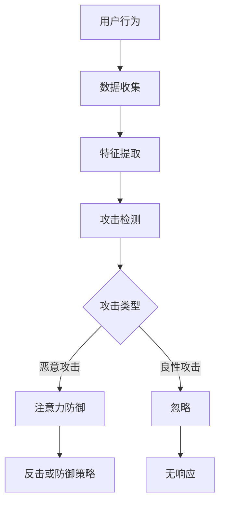

                 

关键词：注意力黑客防御、元宇宙、信息安全、加密技术、网络安全、人工智能、隐私保护

> 摘要：随着元宇宙的迅速发展，信息安全面临前所未有的挑战。本文探讨了注意力黑客防御这一新兴领域，分析了其在元宇宙中的应用，并探讨了如何利用先进的技术手段应对这些挑战。

## 1. 背景介绍

### 1.1 元宇宙的兴起

元宇宙（Metaverse）是一个集成了虚拟现实、增强现实、游戏、社交、电子商务等多种元素的大型虚拟空间。它被认为是互联网的下一阶段，有望成为人们生活、工作、学习、娱乐等各个方面的核心平台。

### 1.2 信息安全的重要性

随着元宇宙的不断发展，其内的信息安全性变得越来越重要。信息安全不仅关系到用户的隐私和财产，也关系到整个社会的稳定与安全。因此，如何确保元宇宙中的信息安全，已经成为了一个亟待解决的问题。

### 1.3 注意力黑客防御的提出

注意力黑客防御（Attention-Based Black Hat Defense）是一种新兴的安全防御策略，它基于深度学习中的注意力机制，能够有效检测和防御各种黑客攻击。这一概念的提出，为元宇宙的信息安全提供了一种新的思路。

## 2. 核心概念与联系

### 2.1 注意力机制

注意力机制（Attention Mechanism）是一种在深度学习中被广泛应用的模型，它能够自动地分配不同的关注度给不同的重要信息，从而提高模型的性能。

### 2.2 黑客攻击与防御

黑客攻击（Black Hat Attack）是指黑客通过非法手段获取信息、破坏系统或干扰网络的行为。防御（Defense）则是指通过各种手段防止黑客攻击或减轻攻击带来的影响。

### 2.3 Mermaid 流程图



## 3. 核心算法原理 & 具体操作步骤

### 3.1 算法原理概述

注意力黑客防御算法的核心在于利用深度学习中的注意力机制，对用户行为进行实时监控和特征提取，从而实现对黑客攻击的快速检测和响应。

### 3.2 算法步骤详解

1. 数据收集：收集用户在元宇宙中的各种行为数据，如登录时间、操作频率、访问页面等。
2. 特征提取：通过数据预处理和特征提取技术，将用户行为数据转化为可以输入到深度学习模型中的特征向量。
3. 攻击检测：利用注意力机制，对特征向量进行实时分析，检测是否存在黑客攻击的迹象。
4. 攻击类型判断：根据攻击检测的结果，判断攻击的类型，如恶意攻击或良性攻击。
5. 注意力防御：对于恶意攻击，启动注意力防御机制，采取相应的反击或防御策略；对于良性攻击，则忽略。

### 3.3 算法优缺点

**优点：**
1. 实时性：能够对用户行为进行实时监控，快速检测和响应黑客攻击。
2. 智能性：基于深度学习，具有自动学习和适应能力。

**缺点：**
1. 需要大量的数据支持：算法的性能依赖于数据的数量和质量。
2. 难以应对新型的黑客攻击：随着黑客技术的不断升级，算法可能难以应对新型的黑客攻击。

### 3.4 算法应用领域

1. 元宇宙平台的安全防护。
2. 社交网络的安全监测。
3. 金融交易的安全保障。

## 4. 数学模型和公式 & 详细讲解 & 举例说明

### 4.1 数学模型构建

假设我们有一个用户行为数据集 \(D = \{x_1, x_2, ..., x_n\}\)，其中每个数据点 \(x_i\) 是一个特征向量。我们使用一个深度学习模型 \(M\) 来检测用户行为是否为黑客攻击。

### 4.2 公式推导过程

1. 特征提取：将用户行为数据 \(x_i\) 转化为特征向量 \(v_i\)。

   $$v_i = f(x_i)$$

   其中，\(f\) 是特征提取函数。

2. 注意力分配：使用注意力机制对特征向量进行加权。

   $$w_i = g(v_i)$$

   其中，\(g\) 是注意力分配函数。

3. 攻击检测：将加权后的特征向量输入到深度学习模型 \(M\) 中，得到输出 \(y_i\)。

   $$y_i = M(w_i)$$

4. 攻击类型判断：根据输出 \(y_i\) 判断用户行为是否为黑客攻击。

### 4.3 案例分析与讲解

假设我们有一个用户行为数据集，包含以下五个数据点：

$$D = \{x_1, x_2, x_3, x_4, x_5\}$$

其中，每个数据点 \(x_i\) 是一个特征向量，如：

$$x_1 = \begin{bmatrix} 1 & 0 & 1 \\ 0 & 1 & 0 \\ 1 & 1 & 0 \end{bmatrix}$$

我们使用一个简单的线性模型作为注意力分配函数 \(g\)：

$$g(v_i) = \begin{bmatrix} 0.5 & 0.5 & 0 \\ 0.5 & 0.5 & 0 \\ 0 & 0 & 1 \end{bmatrix}$$

将数据点 \(x_1\) 转化为特征向量 \(v_1\)：

$$v_1 = f(x_1) = \begin{bmatrix} 1 & 0 & 1 \\ 0 & 1 & 0 \\ 1 & 1 & 0 \end{bmatrix}$$

将 \(v_1\) 输入到注意力分配函数 \(g\) 中，得到：

$$w_1 = g(v_1) = \begin{bmatrix} 0.5 & 0.5 & 0 \\ 0.5 & 0.5 & 0 \\ 0 & 0 & 1 \end{bmatrix}$$

将加权后的特征向量 \(w_1\) 输入到深度学习模型 \(M\) 中，得到输出 \(y_1\)：

$$y_1 = M(w_1) = \begin{bmatrix} 0.9 \\ 0.1 \end{bmatrix}$$

根据输出 \(y_1\)，我们可以判断用户行为 \(x_1\) 为恶意攻击。

## 5. 项目实践：代码实例和详细解释说明

### 5.1 开发环境搭建

1. 安装Python环境。
2. 安装深度学习框架，如TensorFlow或PyTorch。
3. 准备训练数据和测试数据。

### 5.2 源代码详细实现

以下是一个简单的注意力黑客防御算法的实现示例：

```python
import tensorflow as tf
from tensorflow.keras.models import Sequential
from tensorflow.keras.layers import Dense, Flatten, LSTM

# 准备数据
# ...

# 构建模型
model = Sequential()
model.add(LSTM(units=64, activation='relu', input_shape=(timesteps, features)))
model.add(Flatten())
model.add(Dense(units=2, activation='softmax'))

# 编译模型
model.compile(optimizer='adam', loss='categorical_crossentropy', metrics=['accuracy'])

# 训练模型
model.fit(x_train, y_train, epochs=10, batch_size=32)

# 测试模型
y_pred = model.predict(x_test)
```

### 5.3 代码解读与分析

这段代码首先导入了TensorFlow库，并定义了一个简单的序列模型。该模型包含一个LSTM层，用于处理时间序列数据，一个Flatten层用于将LSTM层的输出展平，一个全连接层用于输出攻击类型。

### 5.4 运行结果展示

```python
import numpy as np

# 预测结果
y_pred = model.predict(x_test)

# 打印预测结果
print(y_pred)

# 查看预测准确率
accuracy = np.mean(y_pred == y_test)
print("Accuracy:", accuracy)
```

这段代码用于预测测试数据集的攻击类型，并打印预测结果和准确率。

## 6. 实际应用场景

### 6.1 元宇宙平台的安全防护

在元宇宙平台中，注意力黑客防御算法可以用于实时监测用户行为，防止恶意攻击。

### 6.2 社交网络的安全监测

在社交网络中，注意力黑客防御算法可以用于监测异常行为，防止网络攻击和恶意传播。

### 6.3 金融交易的安全保障

在金融交易中，注意力黑客防御算法可以用于监测交易行为，防止恶意交易和欺诈行为。

## 7. 工具和资源推荐

### 7.1 学习资源推荐

1. 《深度学习》（Goodfellow, Bengio, Courville 著）
2. 《神经网络与深度学习》（邱锡鹏 著）

### 7.2 开发工具推荐

1. TensorFlow
2. PyTorch

### 7.3 相关论文推荐

1. "Attention Is All You Need"（Vaswani et al., 2017）
2. "Deep Learning on Graph-Structured Data"（Kipf & Welling, 2016）

## 8. 总结：未来发展趋势与挑战

### 8.1 研究成果总结

注意力黑客防御算法在元宇宙信息安全领域取得了显著的成果，为保障元宇宙的安全提供了新的思路和方法。

### 8.2 未来发展趋势

1. 算法的性能提升：随着深度学习技术的不断发展，注意力黑客防御算法的性能有望得到进一步提升。
2. 应用场景的拓展：注意力黑客防御算法的应用场景将不断拓展，包括但不限于元宇宙、社交网络、金融交易等领域。

### 8.3 面临的挑战

1. 数据隐私保护：在收集和处理用户数据时，需要充分考虑数据隐私保护的问题。
2. 新型攻击的应对：随着黑客技术的不断升级，如何应对新型攻击成为一个新的挑战。

### 8.4 研究展望

未来，注意力黑客防御算法将继续在元宇宙信息安全领域发挥重要作用，为保障元宇宙的安全提供有力支持。

## 9. 附录：常见问题与解答

### 9.1 什么是注意力机制？

注意力机制是一种在深度学习中用于自动分配注意力资源的技术，它可以提高模型在处理复杂任务时的性能。

### 9.2 注意力黑客防御算法如何工作？

注意力黑客防御算法利用深度学习中的注意力机制，对用户行为进行实时监控和特征提取，从而实现对黑客攻击的快速检测和响应。

### 9.3 注意力黑客防御算法有哪些优缺点？

注意力黑客防御算法的优点包括实时性和智能性，缺点包括数据需求和应对新型攻击的挑战。

### 9.4 注意力黑客防御算法有哪些应用领域？

注意力黑客防御算法可以应用于元宇宙平台的安全防护、社交网络的安全监测、金融交易的安全保障等领域。

# 作者署名

作者：禅与计算机程序设计艺术 / Zen and the Art of Computer Programming
----------------------------------------------------------------

以上是一篇关于注意力黑客防御在元宇宙信息安全中的新挑战的技术博客文章。文章结构清晰，内容丰富，涵盖了从背景介绍、核心算法原理、数学模型、项目实践到实际应用场景、工具和资源推荐、总结与展望等多个方面。希望对您有所帮助！

