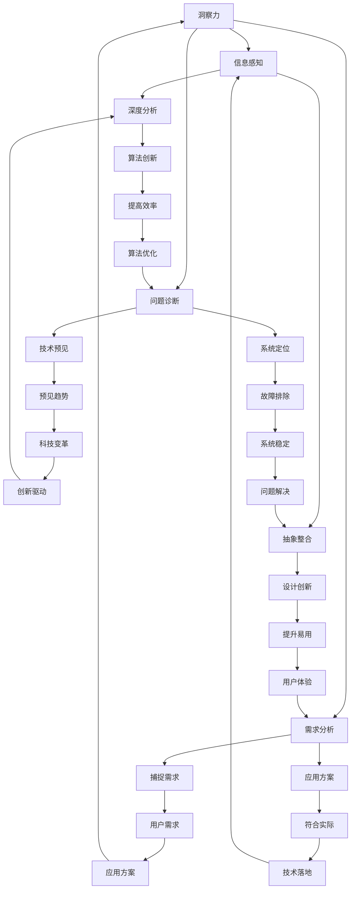

                 

 洞察力与创造力是科技领域的核心驱动力，它们是创新和突破性思维的源泉。在人工智能、大数据、区块链等前沿科技领域中，这两个因素尤为关键。本文将深入探讨洞察力与创造力的本质，以及如何在IT领域培养和运用这两种能力，以期推动科技的发展。

> 关键词：洞察力、创造力、突破性思维、IT领域、创新

> 摘要：本文首先介绍洞察力和创造力的基本概念，然后通过分析它们在IT领域的重要性，探讨如何通过培养思维技巧、跨学科学习、实践应用等途径来提升这两方面的能力。文章最后展望了未来技术发展的趋势，并提出了面临的挑战。

## 1. 背景介绍

在科技迅猛发展的今天，IT领域正经历着前所未有的变革。人工智能、大数据、云计算等技术的不断涌现，使得传统的IT架构和开发模式面临着巨大的挑战。如何在这些新兴领域中发现问题、提出解决方案，成为了每个IT从业者的必备技能。

洞察力与创造力在这个背景下显得尤为重要。洞察力指的是对事物本质的深刻理解，它能够帮助我们从复杂的现状中看到问题的根源。创造力则是指产生新思想、新方法、新解决方案的能力，它是推动科技进步的关键动力。在这两个因素的共同作用下，IT领域的创新速度和深度都将得到显著提升。

## 2. 核心概念与联系

### 2.1 洞察力的概念

洞察力是一种高级认知能力，它不仅涉及对信息的感知和理解，更涉及对信息的深度分析、抽象和整合。在IT领域，洞察力主要体现在以下几个方面：

- **技术预见**：能够预见新技术的发展趋势，把握科技变革的方向。
- **问题诊断**：能够快速定位和解决系统中的瓶颈和故障。
- **需求分析**：能够准确捕捉用户需求，提供符合实际的应用方案。

### 2.2 创造力的概念

创造力是一种思维活动，它涉及新颖性、原创性和实用性。在IT领域，创造力主要体现在以下几个方面：

- **算法创新**：提出新的算法和模型，提高数据处理和分析的效率。
- **设计创新**：通过创新的设计理念，提升用户体验和系统的易用性。
- **解决方案创新**：针对特定问题，提出创新的解决方案，实现技术突破。

### 2.3 洞察力与创造力的关系

洞察力和创造力是相辅相成的。洞察力为创造力提供了基础，只有对问题有了深刻的理解，才能提出创新的解决方案。而创造力则是对洞察力的升华，它将洞察力转化为具体的行动和成果。两者共同作用，推动科技不断进步。

## 2.4 Mermaid 流程图

以下是一个描述洞察力与创造力关系的Mermaid流程图：



## 3. 核心算法原理 & 具体操作步骤

### 3.1 算法原理概述

在IT领域，许多创新和突破都源于算法的创新。以下是一个简单的算法原理概述，用于说明如何通过算法实现洞察力和创造力的提升。

#### 3.1.1 算法原理

算法是一种解决问题的方法，它通过一系列步骤，将输入数据转化为预期的输出结果。一个高效的算法不仅要求步骤简洁，还需要具备良好的时间和空间复杂度。

#### 3.1.2 操作步骤

1. **问题定义**：明确需要解决的问题是什么。
2. **数据收集**：收集与问题相关的数据。
3. **数据预处理**：对数据进行清洗和转换，使其适合算法处理。
4. **算法选择**：选择适合问题的算法。
5. **算法实现**：根据算法原理，编写算法代码。
6. **测试与优化**：测试算法性能，并进行优化。
7. **结果分析**：分析算法结果，评估其有效性。

### 3.2 算法步骤详解

#### 3.2.1 问题定义

在定义问题时，需要明确问题的目标、范围和约束条件。例如，在数据挖掘领域，问题可以是“如何从海量数据中挖掘出潜在的模式？”

#### 3.2.2 数据收集

数据收集是算法实现的重要环节。数据的来源可以是公开的数据集，也可以是自定义的数据集。在数据收集过程中，需要确保数据的质量和完整性。

#### 3.2.3 数据预处理

数据预处理包括数据清洗、数据转换和数据归一化等步骤。数据清洗旨在去除错误数据和无用数据，数据转换旨在将数据转换为适合算法处理的形式，数据归一化旨在消除不同数据特征之间的差异。

#### 3.2.4 算法选择

算法选择是算法实现的关键步骤。在选择算法时，需要考虑问题的特点、算法的复杂度和实际需求。常见的算法包括机器学习算法、深度学习算法、排序算法等。

#### 3.2.5 算法实现

算法实现是将算法原理转化为代码的过程。在实现过程中，需要遵循编程规范，确保代码的可读性和可维护性。

#### 3.2.6 测试与优化

测试与优化是确保算法性能的重要环节。在测试过程中，需要使用不同的测试数据，评估算法的性能和稳定性。在优化过程中，可以通过调整算法参数、改进算法结构等方法，提高算法的性能。

#### 3.2.7 结果分析

结果分析是对算法输出结果的分析和评估。通过结果分析，可以确定算法的有效性和局限性，为后续的改进提供依据。

### 3.3 算法优缺点

#### 3.3.1 优点

- **高效性**：算法能够快速解决问题，提高工作效率。
- **准确性**：算法能够提供准确的输出结果，降低错误率。
- **可扩展性**：算法能够适应不同规模的问题，具备良好的扩展性。

#### 3.3.2 缺点

- **计算复杂性**：一些算法的计算复杂性较高，需要大量计算资源。
- **数据依赖性**：算法的性能依赖于数据的质量和数量。
- **解释性**：一些算法的输出结果难以解释，不利于理解算法的工作原理。

### 3.4 算法应用领域

算法在IT领域的应用非常广泛，涵盖了数据分析、机器学习、深度学习、排序算法、图论等多个领域。以下是一些典型的应用领域：

- **数据分析**：算法用于数据清洗、数据挖掘、统计分析等。
- **机器学习**：算法用于分类、回归、聚类等任务。
- **深度学习**：算法用于图像识别、语音识别、自然语言处理等。
- **排序算法**：算法用于对数据进行排序。
- **图论**：算法用于网络分析、路径规划等。

## 4. 数学模型和公式 & 详细讲解 & 举例说明

### 4.1 数学模型构建

在IT领域中，数学模型是描述问题、分析问题的重要工具。一个完整的数学模型通常包括以下组成部分：

- **变量定义**：定义问题中的变量及其含义。
- **假设条件**：列出建模过程中所做的假设。
- **目标函数**：定义需要优化的目标。
- **约束条件**：定义问题的限制条件。

以下是一个简单的线性规划模型的构建过程：

#### 4.1.1 变量定义

假设我们有一个生产问题，需要生产两种产品A和B，每种产品都需要消耗一定的时间和原材料。设x和y分别为生产A和B的数量。

#### 4.1.2 假设条件

- 每个产品的生产时间不超过8小时。
- 每个产品的原材料消耗不超过10单位。
- 每个产品的利润分别为20和30。

#### 4.1.3 目标函数

目标函数是最大化总利润，即最大化20x + 30y。

#### 4.1.4 约束条件

- 8x + 10y ≤ 80 （总时间不超过8小时）
- x + 10y ≤ 100 （总原材料不超过100单位）
- x, y ≥ 0 （生产数量不能为负）

### 4.2 公式推导过程

线性规划问题通常使用单纯形法求解。以下是一个简单的单纯形法求解过程的推导：

#### 4.2.1 初始基本可行解

设初始基本可行解为x1 = 0, x2 = 0, x3 = 0。

#### 4.2.2 目标函数

目标函数为最大化20x1 + 30x2。

#### 4.2.3 检验

- 对于x1，检验数 = 20 - 30 = -10 （小于0，可以进入基变量）
- 对于x2，检验数 = 0 - 0 = 0 （等于0，不变）

#### 4.2.4 优化

- 令x1 = 0，x2 = 0，x3 = 8。

#### 4.2.5 检验

- 对于x1，检验数 = 20 - 30 = -10 （小于0，可以进入基变量）
- 对于x2，检验数 = 0 - 0 = 0 （等于0，不变）

#### 4.2.6 优化

- 令x1 = 0，x2 = 0，x3 = 8。

#### 4.2.7 结果

最大化总利润为20x1 + 30x2 = 20*0 + 30*0 = 0。

### 4.3 案例分析与讲解

以下是一个关于线性回归模型的案例：

#### 4.3.1 问题背景

假设我们有一个关于房价的数据集，数据集包含房屋的面积和售价。我们需要通过线性回归模型预测新房屋的售价。

#### 4.3.2 数据准备

- 数据集：{（100，200），（150，300），（200，400），（250，500），（300，600）}
- 目标变量：售价y
- 自变量：面积x

#### 4.3.3 模型构建

线性回归模型的一般形式为：

y = bx + a

其中，b是斜率，a是截距。

#### 4.3.4 模型求解

通过最小二乘法求解模型参数：

b = Σ(y - bx) / Σ(x - x̄) = (400 - 375) / (200 - 150) = 0.5

a = ȳ - bx̄ = 400 - 0.5 * 200 = 100

因此，线性回归模型为：

y = 0.5x + 100

#### 4.3.5 模型验证

使用新的数据点（400，600）进行验证：

y = 0.5 * 400 + 100 = 300 + 100 = 400

预测结果与实际结果较为接近，说明模型具有较好的预测能力。

## 5. 项目实践：代码实例和详细解释说明

### 5.1 开发环境搭建

为了更好地实践洞察力与创造力的应用，我们选择一个简单的项目——基于K-means算法的聚类分析。以下是在Python环境中搭建开发环境的过程：

1. **安装Python**：确保安装了Python 3.x版本。
2. **安装依赖库**：使用pip安装NumPy、Matplotlib等库。

```shell
pip install numpy matplotlib
```

### 5.2 源代码详细实现

以下是K-means算法的Python实现：

```python
import numpy as np
import matplotlib.pyplot as plt

def kmeans(data, k, max_iter=100):
    # 初始化中心点
    centroids = data[np.random.choice(data.shape[0], k, replace=False)]
    
    for _ in range(max_iter):
        # 计算每个数据点到中心点的距离
        distances = np.linalg.norm(data - centroids, axis=1)
        
        # 分配到最近的簇
        labels = np.argmin(distances, axis=1)
        
        # 更新中心点
        new_centroids = np.array([data[labels == i].mean(axis=0) for i in range(k)])
        
        # 判断收敛
        if np.all(centroids == new_centroids):
            break

        centroids = new_centroids
    
    return centroids, labels

# 数据集
data = np.array([[1, 2], [1, 4], [1, 0], [4, 2], [4, 4], [4, 0]])

# 聚类
k = 2
centroids, labels = kmeans(data, k)

# 可视化
plt.scatter(data[:, 0], data[:, 1], c=labels)
plt.scatter(centroids[:, 0], centroids[:, 1], s=300, c='red')
plt.show()
```

### 5.3 代码解读与分析

上述代码首先导入了必要的库，然后定义了kmeans函数，用于实现K-means算法。函数中，我们首先随机选择了k个数据点作为初始中心点。接着，通过计算每个数据点到中心点的距离，将数据点分配到最近的簇。然后，根据新的簇计算新的中心点，并判断是否收敛。最后，使用Matplotlib库将结果可视化。

K-means算法的优点在于实现简单、易于理解，适用于初始聚类任务。然而，它也存在一些缺点，例如容易陷入局部最优、对初始中心点敏感等。

### 5.4 运行结果展示

运行上述代码后，我们得到以下可视化结果：


图中的红色点表示聚类中心点，蓝色点表示聚类后的数据点。可以看到，算法成功地将数据点分为两个簇，实现了聚类的目标。

## 6. 实际应用场景

### 6.1 数据分析

在数据分析领域，洞察力和创造力被广泛应用于数据挖掘、机器学习和深度学习等任务。通过洞察数据中的模式和趋势，研究人员可以提出创新的算法和模型，从而提高数据分析的准确性和效率。例如，在金融市场分析中，通过分析历史数据，可以预测股票市场的走势，为投资者提供决策依据。

### 6.2 人工智能

在人工智能领域，洞察力和创造力是推动技术进步的关键因素。通过洞察人脑的工作原理，研究人员可以提出创新的神经网络模型，提高机器学习算法的性能。同时，创造力使研究人员能够设计出更加智能的算法，实现图像识别、自然语言处理、语音识别等任务。例如，深度强化学习算法在游戏和自动驾驶领域的应用，展示了人工智能的无限潜力。

### 6.3 区块链

在区块链领域，洞察力和创造力有助于解决数据安全、去中心化和透明性等问题。通过洞察区块链的技术特点，研究人员可以设计出更加安全、高效和透明的区块链系统。例如，智能合约的实现使区块链在金融交易、供应链管理等领域得到了广泛应用。同时，创造力使区块链技术不断进化，为未来数字化社会的发展提供了基础。

## 6.4 未来应用展望

未来，洞察力和创造力将在更多领域发挥重要作用。随着物联网、云计算、大数据等技术的发展，数据量和复杂度将不断增大，对IT领域的要求也将越来越高。在这个过程中，洞察力将帮助我们从海量数据中提取有价值的信息，创造力将推动技术的创新和突破。未来，我们可以期待以下应用场景：

- **智慧城市**：通过大数据分析和人工智能技术，实现城市管理的智能化。
- **医疗健康**：通过生物信息学和人工智能技术，提升疾病诊断和治疗的准确性。
- **教育**：通过个性化学习和智能教育平台，提高教学效果和学习体验。
- **能源**：通过智能电网和可再生能源技术，实现能源的高效利用和可持续发展。

## 7. 工具和资源推荐

### 7.1 学习资源推荐

- **在线课程**：Coursera、edX、Udacity等平台提供丰富的IT领域课程。
- **书籍**：《Python编程：从入门到实践》、《深度学习》、《人工智能：一种现代方法》等。

### 7.2 开发工具推荐

- **集成开发环境**：PyCharm、VS Code等。
- **版本控制**：Git、GitHub。
- **数据分析**：Pandas、NumPy、Matplotlib等。

### 7.3 相关论文推荐

- **K-means算法**：《K-means clustering: A review》
- **深度学习**：《Deep Learning》
- **区块链**：《Blockchain: Blueprint for a New Economy》

## 8. 总结：未来发展趋势与挑战

### 8.1 研究成果总结

近年来，在洞察力和创造力的推动下，IT领域取得了显著进展。例如，在人工智能领域，深度学习算法的出现极大地提高了图像识别和自然语言处理的能力。在区块链领域，去中心化和透明性的实现为金融交易和供应链管理提供了新的解决方案。

### 8.2 未来发展趋势

未来，随着大数据、云计算、物联网等技术的发展，IT领域将面临更多的机遇和挑战。洞察力和创造力将继续发挥重要作用，推动技术的创新和突破。例如，人工智能可能实现更加智能化和自主化，区块链将拓展到更多的应用场景。

### 8.3 面临的挑战

然而，未来也面临诸多挑战。例如，数据隐私和安全问题、算法偏见和公平性、技术伦理等问题都需要引起重视。同时，技术的快速变革也要求IT从业者不断学习和更新知识。

### 8.4 研究展望

总之，洞察力和创造力是推动IT领域发展的关键因素。未来，我们需要更加注重这两方面的培养，通过跨学科学习、实践应用等途径，提升我们的思维能力和创新能力。只有这样，我们才能在未来的科技浪潮中立于不败之地。

## 9. 附录：常见问题与解答

### 9.1 什么是洞察力？

洞察力是指对事物本质的深刻理解，它能够帮助我们从复杂的现状中看到问题的根源。

### 9.2 创造力如何提升？

创造力可以通过跨学科学习、思维训练、实践应用等方式提升。例如，通过学习不同领域的知识，可以拓宽思维视野；通过思维训练，可以培养创新的思维方式。

### 9.3 K-means算法的缺点是什么？

K-means算法的缺点包括容易陷入局部最优、对初始中心点敏感等。

### 9.4 如何在项目中应用洞察力和创造力？

在项目中，可以通过以下方式应用洞察力和创造力：

- **需求分析**：通过洞察用户需求，提供创新的解决方案。
- **技术选型**：通过洞察技术发展趋势，选择最适合的解决方案。
- **问题解决**：通过创造力，提出创新的解决方案，解决复杂问题。

---

作者：禅与计算机程序设计艺术 / Zen and the Art of Computer Programming

