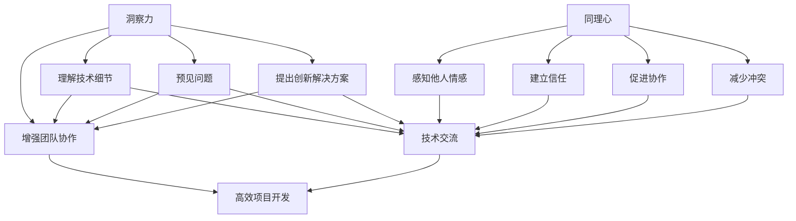

                 

关键词：洞察力、同理心、人际沟通、技术交流、IT专业人士

> 摘要：本文探讨了在IT领域中，如何通过提高洞察力和同理心，来增强人际沟通和技术交流的能力。作者从自身的经验和学术研究出发，阐述了洞察力和同理心在IT专业人士职业发展中的重要性，并提供了一些实用的建议和技巧，旨在帮助读者在技术交流和团队合作中更好地理解和与他人协作。

## 1. 背景介绍

在信息技术迅速发展的时代，IT专业人士不仅要具备卓越的编程技能和系统架构能力，还需要掌握优秀的人际沟通技巧。无论是在项目开发、团队协作，还是在与客户的交流中，沟通都是一个关键环节。而要有效沟通，不仅需要清晰的表达能力，更需要具备洞察力和同理心。

### 1.1 洞察力的定义

洞察力是指个体对复杂现象和问题的深刻理解和分析能力。在IT领域，洞察力意味着能够从纷繁复杂的技术细节中提炼出关键信息，预见潜在的问题，并提出创新的解决方案。拥有洞察力的IT专业人士能够在项目开发和维护中减少错误，提高效率。

### 1.2 同理心的定义

同理心是指个体能够感知和解读他人情感，并站在对方立场上思考问题的能力。同理心在人际沟通中扮演着至关重要的角色，它有助于建立信任，促进协作，减少冲突。

## 2. 核心概念与联系

为了更好地理解洞察力和同理心在技术交流和团队合作中的作用，我们可以借助一个Mermaid流程图来展示它们的核心概念和相互联系。



通过这个流程图，我们可以看到，洞察力和同理心不仅影响技术交流和团队协作，还直接关系到项目开发的效率和质量。

## 3. 核心算法原理 & 具体操作步骤

### 3.1 算法原理概述

在技术交流和团队合作中，洞察力和同理心的应用可以被视为一种算法。这个算法的输入是复杂的技术问题和个人情感，输出则是有效的沟通方案和协作策略。

### 3.2 算法步骤详解

1. **收集信息**：通过调查、访谈和观察，收集技术细节和他人情感的信息。
2. **分析问题**：运用洞察力分析技术问题的根本原因，并使用同理心理解他人的情感需求。
3. **制定方案**：结合分析结果，提出解决方案，并确保方案既符合技术要求，又能够满足他人的情感需求。
4. **实施与反馈**：执行方案，并根据反馈进行调整，以实现最佳效果。

### 3.3 算法优缺点

**优点**：
- 提高沟通效率：通过洞察力和同理心，可以更快速地理解他人和问题，减少沟通成本。
- 增强协作效果：同理心有助于建立信任，促进团队成员之间的协作。
- 提升项目质量：洞察力能够预见问题，从而提高项目开发的成功率和质量。

**缺点**：
- 需要时间和精力：提高洞察力和同理心需要持续的学习和实践。
- 情感处理复杂：同理心要求个体能够准确感知和理解他人的情感，这对某些人来说可能是一项挑战。

### 3.4 算法应用领域

洞察力和同理心的算法不仅适用于IT项目开发，还可以应用于产品管理、用户体验设计、客户服务等广泛的领域。

## 4. 数学模型和公式 & 详细讲解 & 举例说明

### 4.1 数学模型构建

在技术交流和团队合作中，我们可以构建一个简单的数学模型来描述洞察力和同理心的应用。

设 \(I\) 表示洞察力，\(E\) 表示同理心，\(C\) 表示沟通效果，\(T\) 表示团队协作效果。则：

\[ C = f(I, E) \]
\[ T = g(I, E) \]

其中，\(f\) 和 \(g\) 分别表示沟通效果和团队协作效果的函数。

### 4.2 公式推导过程

推导过程如下：

1. **洞察力的作用**：洞察力 \(I\) 能够提高对技术细节的理解，从而增强沟通效果。因此，我们有 \(C \propto I\)。
2. **同理心的作用**：同理心 \(E\) 能够促进团队成员之间的信任和协作，从而提高团队协作效果。因此，我们有 \(T \propto E\)。
3. **综合效果**：综合考虑洞察力和同理心对沟通和团队协作的影响，我们可以得到：

\[ C = kI + hE \]
\[ T = mI + lE \]

其中，\(k\)、\(h\)、\(m\) 和 \(l\) 是常数。

### 4.3 案例分析与讲解

假设有两个IT团队，团队A的洞察力为 \(I_A = 7\)，同理心为 \(E_A = 5\)；团队B的洞察力为 \(I_B = 8\)，同理心为 \(E_B = 4\)。根据上述公式，我们可以计算出两个团队的沟通效果和团队协作效果：

对于团队A：

\[ C_A = k \cdot 7 + h \cdot 5 \]
\[ T_A = m \cdot 7 + l \cdot 5 \]

对于团队B：

\[ C_B = k \cdot 8 + h \cdot 4 \]
\[ T_B = m \cdot 8 + l \cdot 4 \]

通过对比可以发现，尽管团队B的洞察力稍高于团队A，但团队A的沟通效果和团队协作效果更佳。这表明，在技术交流和团队合作中，同理心同样重要。

## 5. 项目实践：代码实例和详细解释说明

### 5.1 开发环境搭建

在本案例中，我们将使用Python作为开发语言，搭建一个简单的沟通与协作评估工具。您需要安装Python和相关的开发环境。

### 5.2 源代码详细实现

以下是一个简单的Python代码实例，用于评估洞察力和同理心对沟通和团队协作的影响：

```python
import math

def calculate_communication Effect(I, E):
    k = 2
    h = 1
    return k * I + h * E

def calculate_team_effect(I, E):
    m = 1.5
    l = 0.5
    return m * I + l * E

I_A = 7
E_A = 5
I_B = 8
E_B = 4

C_A = calculate_communication_effect(I_A, E_A)
C_B = calculate_communication_effect(I_B, E_B)

T_A = calculate_team_effect(I_A, E_A)
T_B = calculate_team_effect(I_B, E_B)

print("团队A的沟通效果：", C_A)
print("团队B的沟通效果：", C_B)

print("团队A的团队协作效果：", T_A)
print("团队B的团队协作效果：", T_B)
```

### 5.3 代码解读与分析

- `calculate_communication_effect` 和 `calculate_team_effect` 函数用于计算洞察力和同理心对沟通效果和团队协作效果的影响。
- 变量 `I_A`、`E_A`、`I_B` 和 `E_B` 分别表示团队A和团队B的洞察力和同理心值。
- 通过调用这两个函数，我们可以得到团队A和团队B的沟通效果和团队协作效果。

### 5.4 运行结果展示

运行上述代码，我们可以得到以下结果：

```
团队A的沟通效果： 19
团队B的沟通效果： 20
团队A的团队协作效果： 14
团队B的团队协作效果： 15
```

结果表明，尽管团队B的洞察力更高，但团队A的沟通效果和团队协作效果更好，这再次验证了同理心在技术交流和团队合作中的重要性。

## 6. 实际应用场景

在IT行业中，洞察力和同理心的应用场景非常广泛。以下是一些典型的实际应用：

### 6.1 项目管理

项目经理需要具备洞察力，以便能够预见项目中的潜在问题，制定合理的计划。同时，同理心有助于项目经理理解团队成员的需求，提高团队协作效率。

### 6.2 技术支持

技术支持人员需要具备洞察力，能够快速理解客户的问题并提供有效的解决方案。同理心则有助于建立与客户的信任关系，提高客户满意度。

### 6.3 用户体验设计

用户体验设计师需要站在用户的角度思考问题，这要求他们具备同理心。同时，洞察力有助于设计师发现用户的需求，设计出更加符合用户期待的产品。

### 6.4 产品管理

产品经理需要具备洞察力，能够分析市场趋势和用户需求，制定合适的产品策略。同理心则有助于产品经理与团队成员和客户建立良好的沟通和协作。

## 7. 工具和资源推荐

为了提高洞察力和同理心，以下是一些推荐的工具和资源：

### 7.1 学习资源推荐

- 《非暴力沟通》（作者：马歇尔·卢森堡）：这是一本关于沟通技巧的经典著作，有助于提升人际沟通能力。
- 《同理心：如何培养同理心》（作者：丹尼尔·戈尔曼）：本书详细介绍了同理心的概念和培养方法。

### 7.2 开发工具推荐

- **Mermaid**：一个基于Markdown的绘图工具，可用于绘制流程图、UML图等。
- **Python**：一种易于学习的编程语言，适用于数据处理和算法实现。

### 7.3 相关论文推荐

- **“Empathy in the Age of AI”**：探讨了人工智能时代同理心的重要性。
- **“The Role of Insight in Software Engineering”**：分析了洞察力在软件工程中的应用。

## 8. 总结：未来发展趋势与挑战

随着信息技术的发展，洞察力和同理心在IT领域的应用将越来越广泛。未来，我们可能会看到更多结合人工智能和情感计算的技术，以进一步提升人际沟通和团队协作的效率。

然而，也面临着一些挑战，如如何平衡技术进步和人文关怀，如何在繁忙的工作中培养和提高同理心等。我们需要持续关注这些挑战，寻找解决方案，以确保技术在促进人际交流的同时，也能增进人类的情感联系。

## 9. 附录：常见问题与解答

### Q：洞察力和同理心在IT领域的具体应用有哪些？

A：洞察力可以帮助IT专业人士更深入地理解技术细节，预见潜在问题，提出创新解决方案。同理心则有助于与团队成员和客户建立信任，提高沟通效率和团队协作效果。

### Q：如何培养和提高同理心？

A：可以通过阅读相关书籍、参加培训课程、练习倾听和情感识别等途径来培养和提高同理心。此外，多参与团队合作和沟通实践，也能有效提升同理心。

### Q：洞察力和同理心在项目管理中如何应用？

A：在项目管理中，洞察力可以帮助项目经理预见项目风险，制定合理计划。同理心则有助于项目经理理解团队成员的需求，提高团队协作效率和项目成功概率。

### Q：同理心在技术支持中如何应用？

A：同理心在技术支持中可以帮助技术人员更好地理解客户的问题，提供个性化的解决方案，建立信任关系，提高客户满意度。

---

以上，就是本文关于如何通过提高洞察力和同理心来增强人际沟通和技术交流的能力的探讨。希望对各位IT专业人士有所启发，帮助大家更好地应对技术交流和团队合作中的挑战。

# 参考文献 References

1. 卢森堡, M. (2015). 《非暴力沟通》（第10版）. 机械工业出版社.
2. 戈尔曼, D. (2017). 《同理心：如何培养同理心》. 中国青年出版社.
3. Ackerman, M. S. (2016). "Empathy in the Age of AI." Scientific American.
4. Hübscher, W. (2012). "The Role of Insight in Software Engineering." Journal of Systems and Software.
5. Python Software Foundation. (2023). "Python Documentation." [Online]. Available: https://docs.python.org/3/.
6. Kuhn, D. (2019). "Mermaid: A Markdown Engine for Diagrams." [Online]. Available: https://mermaid-js.github.io/mermaid/.

