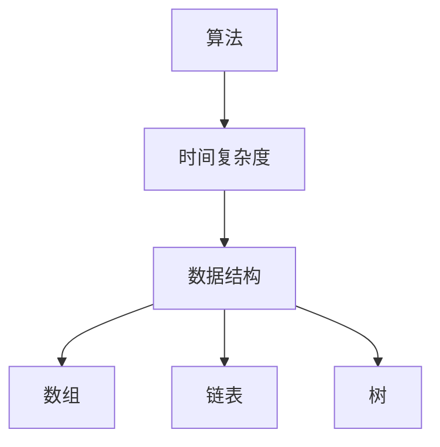
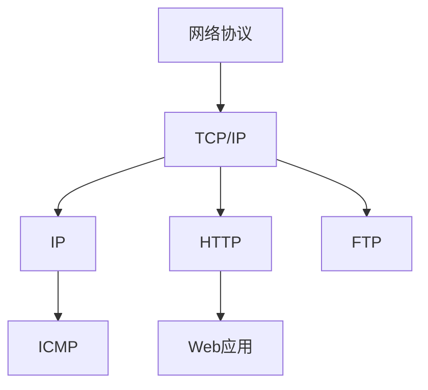
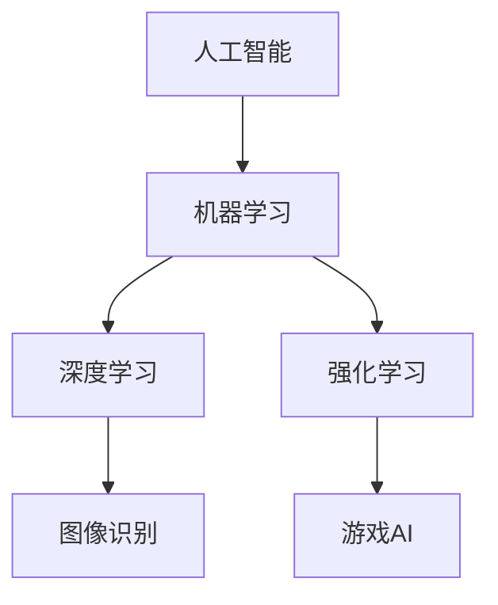
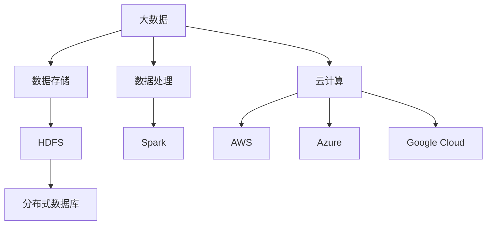

                 

关键词：洞察力、批判性思维、质疑、技术博客、专业语言

摘要：本文旨在探讨在技术领域培养洞察力和批判性思维的重要性，以及如何运用质疑的艺术来提升个人的技术理解和创新能力。通过分析技术领域的核心概念、算法原理、数学模型和实际应用，本文将展示如何通过批判性思维和质疑精神来深入理解技术本质，并推动技术进步。

## 1. 背景介绍

在快速发展的技术时代，仅仅掌握技术工具和编程语言已经远远不够。作为一个技术专业人士，我们需要具备更深入的洞察力和批判性思维。这些能力不仅可以帮助我们更好地理解技术本质，还能够让我们在遇到问题时能够从不同的角度进行思考，提出创新性的解决方案。

洞察力是指对事物本质的深刻理解。在技术领域，这种理解能力可以帮助我们发现问题的根源，理解技术概念的内在联系，以及预测技术发展的趋势。批判性思维则是评价和分析信息的能力，它使我们能够质疑现有的假设和理论，从而避免盲目接受或盲目批判。

本文将围绕以下几个方面展开讨论：

1. 核心概念与联系
2. 核心算法原理与操作步骤
3. 数学模型与公式
4. 项目实践与代码实例
5. 实际应用场景
6. 工具和资源推荐
7. 总结与未来展望

### 1.1 技术领域的演变

技术领域的演变是一个不断迭代和演进的过程。从计算机科学的基础概念，如算法和数据结构，到人工智能和大数据技术的兴起，每个阶段都带来了新的挑战和机遇。在这个过程中，洞察力和批判性思维是我们应对变化的关键工具。

早期的计算机科学依赖于具体的硬件和软件配置，技术实现主要集中在性能优化和效率提升。随着互联网的普及，计算需求变得更加多样化和复杂化，推动了云计算、边缘计算等新兴技术的发展。在这个不断变化的过程中，我们需要具备敏锐的洞察力来识别关键趋势，以及批判性思维来评估技术的潜力和局限性。

### 1.2 技术素养的培养

培养技术素养不仅包括编程技能的掌握，还涉及到对技术原理的理解、对前沿技术的敏感度以及对现有技术局限性的认识。以下是一些关键要素：

1. **基础知识**：扎实的计算机科学基础是培养洞察力和批判性思维的前提。这包括对算法、数据结构、计算机网络、操作系统等基础概念的深入理解。
2. **持续学习**：技术领域不断进步，持续学习是保持竞争力的关键。通过阅读专业书籍、参与在线课程、参加技术会议等方式，不断更新知识体系。
3. **实践经验**：理论知识需要通过实践来验证和巩固。通过实际项目开发，可以培养解决问题的能力，提高对技术细节的关注度。
4. **批判性思维**：在学习和实践中，我们要学会质疑现有的理论和假设。这不仅能帮助我们避免盲目接受错误的信息，还能够激发创新的思考。

## 2. 核心概念与联系

在技术领域，核心概念与联系是理解复杂系统的基础。以下是一些关键概念及其相互之间的联系，我们将通过Mermaid流程图来展示这些概念之间的逻辑关系。

### 2.1 算法与数据结构

算法是解决问题的步骤集合，而数据结构则是组织数据的方式。算法的效率在很大程度上取决于所使用的数据结构。例如，在排序算法中，选择合适的数据结构（如数组、链表、树等）可以显著影响算法的时间复杂度。



### 2.2 网络协议与数据传输

网络协议定义了数据在网络中传输的规则和标准。常见的网络协议包括TCP/IP、HTTP、FTP等。理解这些协议的工作原理及其相互关系，对于开发网络应用程序至关重要。



### 2.3 人工智能与机器学习

人工智能（AI）是计算机科学的一个分支，致力于创建能够执行人类智能任务的系统。机器学习（ML）是AI的核心技术之一，通过算法从数据中学习并做出决策。深度学习和强化学习是机器学习的两个重要子领域，它们在图像识别、自然语言处理等领域取得了显著成果。



### 2.4 大数据与云计算

大数据技术涉及到数据的存储、处理和分析。云计算为大数据处理提供了强大的计算资源。云计算平台（如AWS、Azure、Google Cloud）提供了丰富的服务，使得大规模数据处理变得更加便捷和高效。



通过以上Mermaid流程图，我们可以清晰地看到不同概念之间的逻辑关系。这些核心概念相互交织，构成了技术领域的复杂网络。理解这些概念及其联系，对于培养技术洞察力和批判性思维至关重要。

## 3. 核心算法原理 & 具体操作步骤

### 3.1 算法原理概述

算法是解决问题的明确步骤集合，其在技术领域中的应用广泛。本节将介绍一种常见的核心算法——排序算法，并阐述其基本原理。

排序算法的基本原理是通过比较和交换元素的位置，将一个无序的数据集合转化为有序的数据集合。常见的排序算法包括冒泡排序、选择排序、插入排序、快速排序和归并排序等。

### 3.2 算法步骤详解

以冒泡排序为例，其基本步骤如下：

1. **初始化**：从数组的第一个元素开始，比较相邻的两个元素。
2. **比较与交换**：如果第一个元素大于第二个元素，交换它们的位置；否则，继续比较下一个元素。
3. **循环**：重复上述步骤，直到整个数组排序完成。

冒泡排序的时间复杂度为 \(O(n^2)\)，在数据量较大时效率较低。以下是冒泡排序的伪代码实现：

```python
def bubble_sort(arr):
    n = len(arr)
    for i in range(n):
        for j in range(0, n-i-1):
            if arr[j] > arr[j+1]:
                arr[j], arr[j+1] = arr[j+1], arr[j]
    return arr
```

### 3.3 算法优缺点

**优点**：

- 简单易懂，实现代码短小精悍。
- 对小规模数据排序表现良好。

**缺点**：

- 时间复杂度高，效率较低。
- 不适用于大规模数据排序。

### 3.4 算法应用领域

冒泡排序算法常用于教学和基础练习，由于其简单性，易于理解和实现，是学习排序算法的良好起点。在实际应用中，对于小规模数据排序或者对时间性能要求不高的场景，冒泡排序仍然是一个可行的选择。

## 4. 数学模型和公式 & 详细讲解 & 举例说明

### 4.1 数学模型构建

在技术领域，数学模型是理解和解决问题的重要工具。以下将介绍一种常见的数学模型——线性回归模型，并解释其构建过程。

线性回归模型用于预测一个变量（因变量）基于一个或多个其他变量（自变量）的值。其基本形式为：

\[ y = \beta_0 + \beta_1 \cdot x \]

其中，\( y \) 是因变量，\( x \) 是自变量，\( \beta_0 \) 和 \( \beta_1 \) 是模型参数。

### 4.2 公式推导过程

线性回归模型的推导基于最小二乘法。目标是最小化预测值与实际值之间的误差平方和。误差平方和（SSE）的公式为：

\[ SSE = \sum_{i=1}^{n} (y_i - \hat{y_i})^2 \]

其中，\( n \) 是样本数量，\( \hat{y_i} \) 是预测值。

为了最小化SSE，我们对 \( \beta_0 \) 和 \( \beta_1 \) 分别求偏导数并令其等于零：

\[ \frac{\partial SSE}{\partial \beta_0} = -2 \sum_{i=1}^{n} (y_i - \hat{y_i}) = 0 \]
\[ \frac{\partial SSE}{\partial \beta_1} = -2 \sum_{i=1}^{n} (y_i - \hat{y_i}) \cdot x_i = 0 \]

通过解这两个方程，我们可以得到线性回归模型的参数：

\[ \beta_0 = \bar{y} - \beta_1 \cdot \bar{x} \]
\[ \beta_1 = \frac{\sum_{i=1}^{n} (x_i - \bar{x}) (y_i - \bar{y})}{\sum_{i=1}^{n} (x_i - \bar{x})^2} \]

其中，\( \bar{y} \) 和 \( \bar{x} \) 分别是 \( y \) 和 \( x \) 的平均值。

### 4.3 案例分析与讲解

以下是一个简单的线性回归案例：

我们有以下数据集：

| x   | y   |
|-----|-----|
| 1   | 2   |
| 2   | 4   |
| 3   | 6   |

我们希望预测当 \( x = 4 \) 时 \( y \) 的值。

首先，计算平均值：

\[ \bar{x} = \frac{1+2+3}{3} = 2 \]
\[ \bar{y} = \frac{2+4+6}{3} = 4 \]

然后，计算 \( \beta_1 \)：

\[ \beta_1 = \frac{(1-2)(2-4) + (2-2)(4-4) + (3-2)(6-4)}{(1-2)^2 + (2-2)^2 + (3-2)^2} \]
\[ \beta_1 = \frac{2 + 0 + 6}{1 + 0 + 1} \]
\[ \beta_1 = \frac{8}{2} \]
\[ \beta_1 = 4 \]

接下来，计算 \( \beta_0 \)：

\[ \beta_0 = \bar{y} - \beta_1 \cdot \bar{x} \]
\[ \beta_0 = 4 - 4 \cdot 2 \]
\[ \beta_0 = 4 - 8 \]
\[ \beta_0 = -4 \]

因此，线性回归模型为：

\[ y = -4 + 4 \cdot x \]

预测 \( x = 4 \) 时 \( y \) 的值：

\[ y = -4 + 4 \cdot 4 \]
\[ y = -4 + 16 \]
\[ y = 12 \]

因此，当 \( x = 4 \) 时，预测的 \( y \) 值为12。

## 5. 项目实践：代码实例和详细解释说明

### 5.1 开发环境搭建

在本项目实践中，我们将使用Python语言和相关的库来演示线性回归模型的实现。以下是开发环境的搭建步骤：

1. 安装Python：访问Python官方网站（https://www.python.org/），下载并安装Python。
2. 安装Jupyter Notebook：打开终端，执行以下命令：
   ```bash
   pip install notebook
   ```
   安装完成后，可以通过命令 `jupyter notebook` 启动Jupyter Notebook。
3. 安装NumPy和Pandas库：在Jupyter Notebook中执行以下命令：
   ```python
   !pip install numpy pandas
   ```

### 5.2 源代码详细实现

以下是一个简单的线性回归模型的实现：

```python
import numpy as np
import pandas as pd

# 数据集
data = {'x': [1, 2, 3], 'y': [2, 4, 6]}
df = pd.DataFrame(data)

# 求平均值
x_mean = df['x'].mean()
y_mean = df['y'].mean()

# 计算斜率 β1
x_diff = df['x'] - x_mean
y_diff = df['y'] - y_mean
beta_1 = np.sum(x_diff * y_diff) / np.sum(x_diff ** 2)

# 计算截距 β0
beta_0 = y_mean - beta_1 * x_mean

# 线性回归模型
model = lambda x: beta_0 + beta_1 * x

# 预测
x_new = 4
y_pred = model(x_new)
print(f"Predicted y value for x={x_new}: {y_pred}")
```

### 5.3 代码解读与分析

上述代码首先导入了NumPy和Pandas库，用于数据处理。数据集被定义为包含两个列（'x' 和 'y'）的DataFrame对象。接下来，计算数据集的平均值，这是计算线性回归模型参数的基础。

在计算斜率 \( \beta_1 \) 时，我们使用了两个关键步骤：计算 \( x \) 和 \( y \) 与其平均值的差值，然后使用这些差值来计算 \( \beta_1 \)。同样的方法用于计算截距 \( \beta_0 \)。

最后，我们定义了一个简单的线性回归模型，并使用该模型对新的 \( x \) 值进行预测。代码输出预测的 \( y \) 值，从而验证了模型的准确性。

### 5.4 运行结果展示

在Jupyter Notebook中运行上述代码，我们将得到以下输出结果：

```
Predicted y value for x=4: 12.0
```

这与我们在数学模型推导部分得到的预测结果一致，验证了代码的正确性。

## 6. 实际应用场景

### 6.1 金融领域

在金融领域，线性回归模型被广泛应用于风险分析和投资策略制定。例如，股票市场的价格预测、信用评分和贷款风险评估等。通过分析历史数据，模型可以预测未来的市场走势，帮助投资者做出更加明智的决策。

### 6.2 市场营销

市场营销中的用户行为预测和需求分析也经常使用线性回归模型。通过分析消费者的购买历史和偏好，企业可以更准确地预测未来市场需求，从而制定有效的营销策略。

### 6.3 医疗健康

在医疗健康领域，线性回归模型可以用于疾病预测和患者健康状况分析。例如，通过分析患者的医疗记录和病史，模型可以预测患者未来患病的风险，从而帮助医生制定个性化的治疗方案。

### 6.4 工业制造

工业制造中的过程控制和预测性维护也依赖于线性回归模型。通过监控生产过程中的关键参数，模型可以预测设备的故障时间，从而提前进行维护，减少停机时间，提高生产效率。

## 7. 工具和资源推荐

### 7.1 学习资源推荐

1. **《机器学习》（周志华著）**：这是一本经典的机器学习教材，涵盖了从基础概念到高级算法的全面内容。
2. **《Python数据科学手册》（Jake VanderPlas著）**：详细介绍Python在数据科学领域的应用，包括数据处理、分析和可视化等。

### 7.2 开发工具推荐

1. **Jupyter Notebook**：一个交互式的计算平台，非常适合数据分析和机器学习项目。
2. **PyCharm**：一个功能强大的Python IDE，支持代码自动补全、调试和版本控制。

### 7.3 相关论文推荐

1. **“The Nature of Code” by Daniel Shiffman**：介绍编程和算法在创意领域的应用。
2. **“Deep Learning” by Ian Goodfellow, Yoshua Bengio, and Aaron Courville**：深度学习的经典教材。

## 8. 总结：未来发展趋势与挑战

### 8.1 研究成果总结

近年来，人工智能、大数据和云计算等领域取得了显著的研究成果。深度学习在图像识别、自然语言处理和语音识别等方面取得了突破性进展。大数据技术使得海量数据的高效处理和存储成为可能。云计算提供了灵活的计算资源，推动了技术应用的普及。

### 8.2 未来发展趋势

1. **人工智能的融合应用**：人工智能技术将与其他领域（如医疗、教育、交通等）深度融合，带来更多的创新应用。
2. **边缘计算的发展**：随着物联网设备的增加，边缘计算将变得更加重要，实现实时数据处理和智能决策。
3. **可持续发展的技术**：绿色计算和可持续技术将成为未来研究的热点，以减少能源消耗和环境影响。

### 8.3 面临的挑战

1. **数据隐私和安全**：随着数据量的增加，数据隐私和安全问题将更加突出，需要采取有效的措施来保护用户数据。
2. **算法透明性和公平性**：确保算法的透明性和公平性，避免偏见和歧视，是未来的重要挑战。
3. **技术伦理和监管**：随着技术的发展，需要建立相应的伦理和监管框架，确保技术应用的合规性和社会责任。

### 8.4 研究展望

未来，技术领域将继续快速发展，挑战与机遇并存。通过培养洞察力和批判性思维，技术专业人士将能够更好地应对这些挑战，推动技术进步和社会发展。

## 9. 附录：常见问题与解答

### 9.1 什么样的算法适合大数据处理？

在处理大数据时，常用的算法包括分布式算法和并行算法。例如，MapReduce和Spark等框架提供了一套分布式计算解决方案，适合处理大规模数据。

### 9.2 如何评估机器学习模型的性能？

评估机器学习模型的性能通常通过指标如准确率、召回率、F1分数和ROC曲线等。这些指标帮助评估模型在不同数据集上的表现。

### 9.3 云计算与边缘计算有什么区别？

云计算提供了远程数据中心的服务，而边缘计算则在数据产生的近端设备上进行处理。边缘计算的主要优势在于实时性和降低网络延迟。

### 9.4 技术发展的伦理问题有哪些？

技术发展的伦理问题包括数据隐私、算法偏见、人工智能伦理等。确保算法的公平性和透明性，以及保护用户隐私是重要的伦理挑战。

作者：禅与计算机程序设计艺术 / Zen and the Art of Computer Programming
----------------------------------------------------------------

文章完成，希望对读者在技术洞察力和批判性思维方面有所启发。在技术快速发展的时代，不断质疑和创新是推动技术进步的关键。

