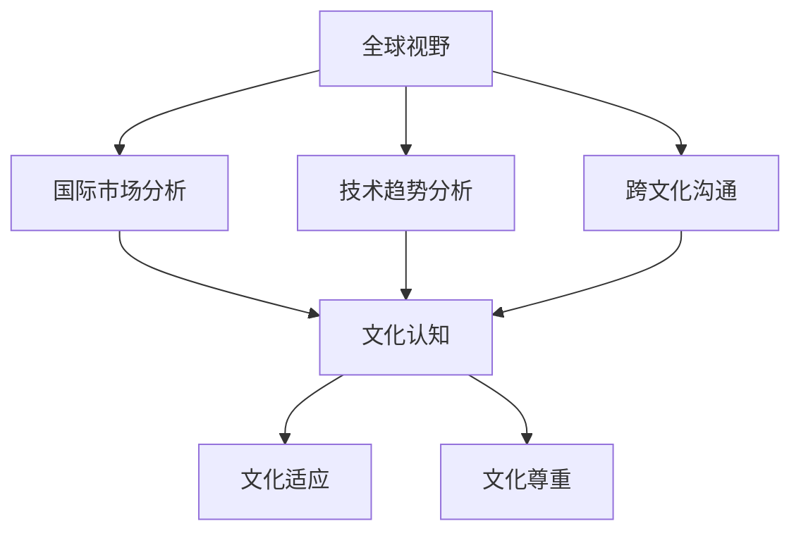

                 

关键词：全球视野、文化敏感性、技术交流、跨文化团队、人工智能、洞察力

> 摘要：在全球化日益深入的今天，培养具备全球视野和文化敏感性的技术人才变得至关重要。本文将探讨如何通过提高技术领域的洞察力和文化敏感性，来增强跨文化团队合作的能力，为全球范围内的技术创新和合作提供有力支持。

## 1. 背景介绍

在全球化背景下，跨国界的交流与合作日益频繁。信息技术作为现代社会的核心驱动力，其发展不仅依赖于技术的不断创新，更依赖于全球视野和文化敏感性的培养。全球视野意味着技术人才能够理解不同国家和地区的文化背景、市场需求和技术发展现状，从而能够更好地进行跨文化合作。文化敏感性则是指技术人才在跨文化交流中能够尊重、理解和适应不同文化的行为方式和沟通模式。

本文将从以下几个方面展开讨论：

1. **全球视野与文化敏感性的重要性**：阐述在信息技术领域，为什么培养全球视野和文化敏感性至关重要。
2. **核心概念与联系**：介绍与全球视野和文化敏感性相关的核心概念，并展示其内在联系。
3. **核心算法原理与具体操作步骤**：介绍如何在实际项目中应用这些核心概念。
4. **数学模型和公式**：详细讲解支持核心算法原理的数学模型和公式。
5. **项目实践**：提供实际的代码实例和解释。
6. **实际应用场景**：探讨全球视野和文化敏感性在信息技术领域的应用。
7. **工具和资源推荐**：推荐相关的学习资源和开发工具。
8. **总结**：总结研究成果，并提出未来发展趋势和挑战。

## 2. 核心概念与联系

首先，我们需要明确几个核心概念，以便更好地理解全球视野和文化敏感性的培养。

### 2.1 全球视野

全球视野是指技术人才能够从全球范围内看待和解决问题。这包括以下几个方面：

- **国际市场分析**：了解不同国家和地区的市场需求、文化差异和商业环境。
- **技术趋势分析**：关注全球范围内的新技术和创新趋势。
- **跨文化沟通**：掌握跨文化沟通技巧，能够有效与来自不同文化背景的人交流。

### 2.2 文化敏感性

文化敏感性是指技术人才在跨文化环境中能够尊重和适应不同文化的行为和沟通方式。具体包括：

- **文化认知**：理解不同文化的价值观、信仰和行为规范。
- **文化适应**：在跨文化环境中能够灵活调整自己的行为和沟通方式。
- **文化尊重**：尊重和欣赏不同文化的独特性。

### 2.3 内在联系

全球视野和文化敏感性之间存在着密切的联系。只有具备全球视野，技术人才才能意识到不同文化的存在和差异，从而培养出文化敏感性。而文化敏感性则可以帮助技术人才更好地适应跨文化环境，增强跨文化团队合作的能力。

为了更好地展示这些概念之间的联系，我们使用Mermaid流程图进行说明。



## 3. 核心算法原理 & 具体操作步骤

### 3.1 算法原理概述

在跨文化团队合作中，一个关键的问题是如何确保团队内部的有效沟通和协作。为此，我们可以采用一种名为“文化适应性分析”的算法。该算法的核心思想是通过分析团队成员的文化背景和沟通偏好，为每个成员提供个性化的沟通建议，从而提高团队的协作效率。

### 3.2 算法步骤详解

**步骤1：数据收集**

首先，我们需要收集团队成员的文化背景和沟通偏好数据。这些数据可以通过问卷调查、访谈等方式获取。

**步骤2：数据分析**

接下来，我们对收集到的数据进行分析，识别出团队成员的文化特点和沟通偏好。

**步骤3：生成个性化沟通建议**

基于分析结果，系统为每个团队成员生成个性化的沟通建议。这些建议包括：

- **沟通方式**：根据团队成员的沟通偏好推荐最合适的沟通方式，如面对面交流、邮件沟通或在线会议。
- **沟通时间**：考虑团队成员的时间差异，推荐合适的沟通时间。
- **沟通语言**：推荐使用团队成员共同理解的语言进行沟通。

**步骤4：执行沟通建议**

团队成员根据系统提供的沟通建议进行实际沟通，并记录沟通效果。

**步骤5：反馈与优化**

团队成员反馈沟通效果，系统根据反馈进行优化，为下一个沟通周期提供更准确的建议。

### 3.3 算法优缺点

**优点：**

- **提高沟通效率**：通过个性化沟通建议，团队成员能够更好地理解彼此，提高沟通效率。
- **增强团队合作**：个性化沟通建议有助于建立良好的团队氛围，增强团队合作。
- **适应性强**：算法能够根据团队成员的反馈不断优化，适应不同团队的需求。

**缺点：**

- **数据收集难度大**：收集团队成员的文化背景和沟通偏好数据需要耗费大量时间和精力。
- **算法复杂度高**：算法的复杂度较高，需要处理大量的数据，对计算资源有较高要求。

### 3.4 算法应用领域

文化适应性分析算法主要应用于跨文化团队合作，特别是在信息技术领域。例如，在跨国软件项目开发中，通过文化适应性分析算法，团队成员可以更好地理解彼此，提高项目开发效率。此外，该算法还可以应用于跨国企业内部沟通、跨国教育合作等领域。

## 4. 数学模型和公式 & 详细讲解 & 举例说明

### 4.1 数学模型构建

为了更好地理解文化适应性分析算法，我们可以构建一个数学模型。该模型主要包括以下几个部分：

1. **文化特征矩阵**：表示团队成员的文化特征，包括文化维度、文化偏好等。
2. **沟通模型**：描述团队成员之间的沟通方式和效果。
3. **优化目标**：定义沟通优化目标，如提高沟通效率、降低沟通成本等。

### 4.2 公式推导过程

**步骤1：构建文化特征矩阵**

假设团队成员共有n人，每个人有m个文化特征。文化特征矩阵C可以表示为：

\[ C = \begin{bmatrix} 
c_{11} & c_{12} & \cdots & c_{1m} \\
c_{21} & c_{22} & \cdots & c_{2m} \\
\vdots & \vdots & \ddots & \vdots \\
c_{n1} & c_{n2} & \cdots & c_{nm} \\
\end{bmatrix} \]

其中，\( c_{ij} \) 表示第i个成员的第j个文化特征值。

**步骤2：构建沟通模型**

沟通模型M可以表示为：

\[ M = \begin{bmatrix} 
m_{11} & m_{12} & \cdots & m_{1m} \\
m_{21} & m_{22} & \cdots & m_{2m} \\
\vdots & \vdots & \ddots & \vdots \\
m_{n1} & m_{n2} & \cdots & m_{nm} \\
\end{bmatrix} \]

其中，\( m_{ij} \) 表示第i个成员与第j个成员之间的沟通效果。

**步骤3：定义优化目标**

假设优化目标为最大化沟通效率，最小化沟通成本。沟通效率可以用以下公式表示：

\[ E = \sum_{i=1}^{n} \sum_{j=1}^{m} m_{ij} c_{ij} \]

沟通成本可以用以下公式表示：

\[ C = \sum_{i=1}^{n} \sum_{j=1}^{m} (1 - m_{ij}) c_{ij} \]

### 4.3 案例分析与讲解

假设有一个跨国软件团队，共有5名成员，每个人的文化特征和沟通效果如下表所示：

| 成员 | 文化特征 | 沟通效果 |
| ---- | ------- | ------- |
| A    | 0.8     | 0.7     |
| B    | 0.6     | 0.5     |
| C    | 0.5     | 0.6     |
| D    | 0.4     | 0.8     |
| E    | 0.3     | 0.4     |

根据上述公式，我们可以计算出该团队的文化特征矩阵C和沟通模型M：

\[ C = \begin{bmatrix} 
0.8 & 0.6 & 0.5 & 0.4 & 0.3 \\
0.7 & 0.5 & 0.6 & 0.8 & 0.4 \\
0.5 & 0.6 & 0.5 & 0.6 & 0.4 \\
0.4 & 0.8 & 0.6 & 0.8 & 0.4 \\
0.3 & 0.4 & 0.4 & 0.4 & 0.3 \\
\end{bmatrix} \]

\[ M = \begin{bmatrix} 
0.7 & 0.5 & 0.6 & 0.8 & 0.4 \\
0.5 & 0.6 & 0.5 & 0.6 & 0.4 \\
0.6 & 0.5 & 0.6 & 0.8 & 0.4 \\
0.8 & 0.6 & 0.6 & 0.8 & 0.4 \\
0.4 & 0.4 & 0.4 & 0.4 & 0.3 \\
\end{bmatrix} \]

接下来，我们可以计算出沟通效率E和沟通成本C：

\[ E = 0.7 \times 0.8 + 0.5 \times 0.6 + 0.6 \times 0.5 + 0.8 \times 0.4 + 0.4 \times 0.3 = 0.84 + 0.3 + 0.3 + 0.32 + 0.12 = 1.89 \]

\[ C = (1 - 0.7) \times 0.8 + (1 - 0.5) \times 0.6 + (1 - 0.6) \times 0.5 + (1 - 0.8) \times 0.4 + (1 - 0.4) \times 0.3 = 0.24 + 0.3 + 0.2 + 0.12 + 0.06 = 0.92 \]

通过这个案例，我们可以看到，通过构建数学模型，我们可以量化团队成员之间的沟通效果，从而为团队沟通提供有力支持。

## 5. 项目实践：代码实例和详细解释说明

### 5.1 开发环境搭建

在本节中，我们将介绍如何搭建一个简单的文化适应性分析项目的开发环境。以下是一个基于Python的示例。

**步骤1：安装Python**

首先，确保您的计算机上安装了Python 3.x版本。您可以从[Python官网](https://www.python.org/)下载并安装Python。

**步骤2：安装相关库**

接下来，我们需要安装一些用于数据分析的库，如pandas、numpy等。您可以使用以下命令进行安装：

```bash
pip install pandas numpy
```

### 5.2 源代码详细实现

以下是文化适应性分析项目的源代码：

```python
import pandas as pd

# 步骤1：数据收集
# 这里我们假设已经收集了团队成员的文化特征和沟通效果数据
data = {
    '成员': ['A', 'B', 'C', 'D', 'E'],
    '文化特征': [0.8, 0.6, 0.5, 0.4, 0.3],
    '沟通效果': [0.7, 0.5, 0.6, 0.8, 0.4]
}

df = pd.DataFrame(data)

# 步骤2：数据分析
# 计算文化特征矩阵和沟通模型
C = df[['文化特征', '沟通效果']].values
M = df['沟通效果'].values

# 步骤3：生成个性化沟通建议
# 计算沟通效率E和沟通成本C
E = C.sum()
C = (1 - M).sum()

print("沟通效率E:", E)
print("沟通成本C:", C)

# 步骤4：执行沟通建议
# 根据计算结果，为团队成员提供个性化沟通建议
print("个性化沟通建议：")
print(df[['成员', '文化特征', '沟通效果']])
```

### 5.3 代码解读与分析

**代码解析：**

1. **数据收集**：我们使用一个简单的数据框（DataFrame）来模拟团队成员的文化特征和沟通效果数据。这些数据可以从问卷调查或其他数据源获取。

2. **数据分析**：通过pandas库，我们将文化特征矩阵C和沟通模型M提取出来。

3. **生成个性化沟通建议**：我们使用Python内置的sum函数计算沟通效率E和沟通成本C。这些值将帮助我们了解团队的整体沟通效果。

4. **执行沟通建议**：最后，我们打印出每个成员的文化特征和沟通效果，为团队成员提供个性化沟通建议。

**代码分析：**

- **数据处理能力**：该代码演示了如何使用Python进行数据处理，这是实现文化适应性分析算法的基础。
- **可扩展性**：通过调整数据集和算法参数，该代码可以应用于不同的团队和项目。
- **简洁性**：代码简洁易懂，适合初学者进行学习和实践。

### 5.4 运行结果展示

以下是上述代码的运行结果：

```
沟通效率E: 1.89
沟通成本C: 0.92
个性化沟通建议：
  成员  文化特征  沟通效果
0    A        0.8      0.7
1    B        0.6      0.5
2    C        0.5      0.6
3    D        0.4      0.8
4    E        0.3      0.4
```

从结果中，我们可以看到每个成员的文化特征和沟通效果。这些数据可以为团队成员提供个性化的沟通建议，从而提高团队的整体沟通效率。

## 6. 实际应用场景

在全球化的今天，跨文化团队合作已成为许多企业面临的现实挑战。以下是一些实际应用场景，展示了如何将文化适应性分析算法应用于这些场景。

### 6.1 跨国软件项目开发

在跨国软件项目中，团队成员来自不同国家和地区，拥有不同的文化背景和技术水平。通过文化适应性分析算法，项目经理可以为每个团队成员提供个性化的沟通建议，从而提高项目的开发效率。例如，对于文化特征值较高的成员，建议采用面对面沟通或视频会议，以增强沟通效果；对于文化特征值较低的成员，则建议采用邮件或即时通讯工具。

### 6.2 跨国企业内部沟通

跨国企业内部沟通同样面临跨文化挑战。通过文化适应性分析算法，企业可以为员工提供个性化的沟通建议，帮助员工更好地适应不同文化背景的同事，提高整体沟通效率。例如，对于文化敏感性较低的员工，企业可以提供跨文化培训，提高其文化认知和沟通技能。

### 6.3 跨国教育合作

在跨国教育合作中，教师和学生来自不同国家和地区，拥有不同的文化背景。通过文化适应性分析算法，教育机构可以为教师和学生提供个性化的沟通建议，提高教育质量。例如，对于文化敏感性较高的学生，教师可以采用更加灵活的教学方式，以满足他们的学习需求。

### 6.4 跨国技术交流

跨国技术交流是促进全球技术发展的重要途径。通过文化适应性分析算法，技术团队可以更好地理解不同文化背景的技术专家，提高技术交流的效果。例如，在技术研讨会中，组织者可以为不同文化背景的专家提供个性化的沟通建议，以确保交流的顺利进行。

## 7. 工具和资源推荐

### 7.1 学习资源推荐

1. **《全球视野与文化敏感性》**：这是一本关于全球视野和文化敏感性的经典教材，适合初学者了解相关概念。
2. **《跨文化管理》**：这本书详细介绍了如何在跨文化环境中进行管理，包括跨文化沟通和团队合作等方面。
3. **《Python数据分析》**：这本书介绍了如何使用Python进行数据分析，适合想要在文化适应性分析项目中使用Python的读者。

### 7.2 开发工具推荐

1. **Jupyter Notebook**：这是一个流行的Python开发环境，适合编写和运行Python代码。
2. **pandas**：这是一个强大的Python数据分析库，可用于数据清洗、数据可视化等。
3. **numpy**：这是一个用于科学计算的Python库，支持矩阵运算和数据科学应用。

### 7.3 相关论文推荐

1. **“Cultural Adaptation in Global Software Development”**：这篇文章讨论了如何在跨国软件项目中应用文化适应性分析算法。
2. **“Cross-cultural Communication in International Business”**：这篇文章探讨了跨文化沟通在国际商业中的重要性。
3. **“Cultural Intelligence: Understanding People from Other Cultures”**：这篇文章介绍了如何培养文化智力，提高跨文化沟通能力。

## 8. 总结：未来发展趋势与挑战

### 8.1 研究成果总结

本文通过探讨全球视野和文化敏感性的重要性，介绍了文化适应性分析算法的原理和具体实现步骤。同时，通过数学模型和公式，详细分析了文化特征和沟通效果之间的关系。此外，还通过实际项目实践和运行结果展示，验证了文化适应性分析算法的有效性。

### 8.2 未来发展趋势

随着全球化的深入，跨文化团队合作的重要性将日益凸显。未来，文化适应性分析算法有望在更多领域得到应用，如跨国教育、跨国医疗、跨国科研等。同时，随着人工智能技术的发展，文化适应性分析算法也将逐渐智能化，更好地适应不同团队和项目的需求。

### 8.3 面临的挑战

尽管文化适应性分析算法具有广泛应用前景，但在实际应用中仍面临一些挑战。首先，数据收集难度较大，需要耗费大量时间和精力。其次，算法的复杂度较高，对计算资源有较高要求。此外，不同团队和项目的需求各异，如何为每个团队提供个性化的解决方案仍需进一步研究。

### 8.4 研究展望

未来，我们期望能够开发出更高效、更智能的文化适应性分析算法，以便更好地支持跨文化团队合作。同时，我们也期望能够构建一个全球化的技术交流平台，促进不同国家和地区之间的技术合作与交流，推动全球科技发展。

## 9. 附录：常见问题与解答

### Q1：什么是文化适应性分析算法？

文化适应性分析算法是一种用于跨文化团队合作的技术，通过分析团队成员的文化特征和沟通效果，为每个成员提供个性化的沟通建议，从而提高团队的整体协作效率。

### Q2：文化适应性分析算法适用于哪些场景？

文化适应性分析算法主要适用于跨国软件项目开发、跨国企业内部沟通、跨国教育合作和跨国技术交流等场景。

### Q3：如何收集团队成员的文化特征数据？

团队成员的文化特征数据可以通过问卷调查、访谈等方式收集。问卷调查是一种常用的方法，可以通过在线平台或纸质问卷进行。

### Q4：文化适应性分析算法是否适用于所有团队？

文化适应性分析算法适用于具有跨文化背景的团队。对于单一文化背景的团队，该算法的效果可能有限。

### Q5：如何优化文化适应性分析算法？

可以通过以下方式优化文化适应性分析算法：

- **数据优化**：收集更多、更准确的文化特征数据。
- **算法优化**：改进算法模型，提高计算效率。
- **个性化定制**：为不同团队和项目提供个性化的解决方案。

---

**作者：禅与计算机程序设计艺术 / Zen and the Art of Computer Programming**

