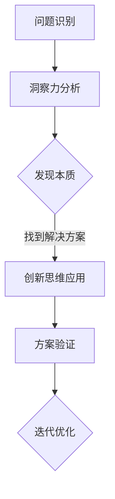
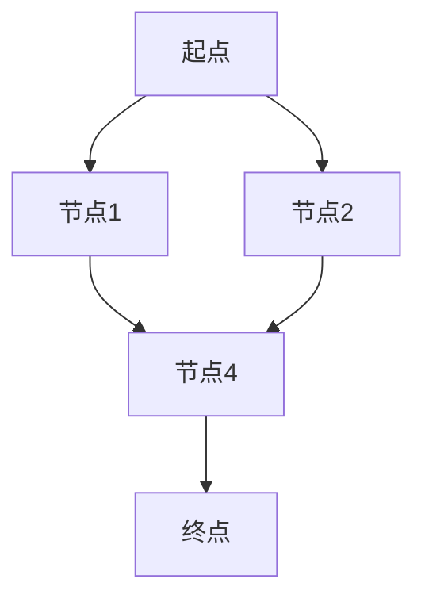

                 

关键词：洞察力、问题解决、创新思维、技术博客、架构设计、算法原理、数学模型、代码实例、实际应用、未来展望

> 摘要：本文将深入探讨洞察力在技术领域的应用，以及如何通过创新思维来解决复杂问题。我们将从背景介绍、核心概念与联系、核心算法原理、数学模型与公式、项目实践、实际应用场景、工具和资源推荐，以及未来发展趋势与挑战等方面进行详细阐述。

## 1. 背景介绍

在当今技术飞速发展的时代，我们面临着越来越多的复杂问题，这些问题不仅仅是计算和编程上的挑战，更是需要深入思考、创新和洞察力来解决。传统的编程方法和算法往往无法应对复杂的问题，因此，如何提升个人的洞察力和创新思维，成为了解决问题的关键。

洞察力是一种深层次的理解力，它能够帮助我们识别问题的本质，发现隐藏的规律和模式。创新思维则是在解决复杂问题时，采取独特、新颖的思考方式，从而找到更有效的解决方案。这两者在技术领域的应用至关重要，它们能够帮助我们突破传统思维的束缚，开拓新的视野，提高解决问题的效率和质量。

## 2. 核心概念与联系

### 2.1 洞察力的定义

洞察力是一种通过观察和分析，能够深入理解问题本质的能力。它不仅仅是对信息的简单获取，更是一种深层次的认知过程。在技术领域，洞察力可以帮助我们：

- **快速定位问题根源**：通过洞察力，我们能够迅速识别问题出现的根本原因，而不是仅仅停留在表面现象。
- **发现新的解决方案**：洞察力能够让我们在复杂的问题中看到隐藏的规律和模式，从而找到创新的解决方案。
- **提高代码质量**：洞察力有助于我们编写更简洁、更高效的代码，避免不必要的冗余和错误。

### 2.2 创新思维的概念

创新思维是一种独特的思考方式，它鼓励我们跳出传统思维模式，从不同的角度和维度来看待问题。在技术领域，创新思维的应用包括：

- **算法优化**：通过创新思维，我们可以设计出更高效的算法，优化计算性能。
- **架构设计**：创新思维有助于我们构建更灵活、更可扩展的系统架构。
- **工具开发**：创新思维能够帮助我们开发出更实用的工具，提高开发效率。

### 2.3 Mermaid 流程图

下面是一个简单的 Mermaid 流程图，展示洞察力和创新思维在技术问题解决中的流程。



## 3. 核心算法原理 & 具体操作步骤

### 3.1 算法原理概述

在本节中，我们将介绍一种基于洞察力和创新思维的核心算法。该算法主要用于复杂问题解决，通过以下步骤进行：

1. **问题建模**：将复杂问题抽象为一个数学模型。
2. **数据预处理**：对输入数据进行分析和清洗，以便于算法处理。
3. **算法迭代**：通过迭代计算，逐步逼近问题的最优解。
4. **结果验证**：对算法的结果进行验证，确保其正确性和有效性。

### 3.2 算法步骤详解

#### 步骤 1：问题建模

首先，我们需要根据问题的具体需求，将其抽象为一个数学模型。这一步是算法的核心，它决定了算法的复杂度和效率。例如，对于一个路径规划问题，我们可以将其建模为一个图论问题。

#### 步骤 2：数据预处理

在算法执行之前，我们需要对输入数据进行分析和清洗。这一步的目的是确保输入数据的质量和完整性，避免算法在处理过程中出现错误。具体操作包括数据清洗、去重、归一化等。

#### 步骤 3：算法迭代

算法迭代是算法的核心部分，它通过反复计算，逐步逼近问题的最优解。在每次迭代过程中，算法会根据当前的状态，更新解的值，并选择下一个状态进行计算。

#### 步骤 4：结果验证

在算法执行完毕后，我们需要对结果进行验证，确保其正确性和有效性。这一步是算法的最后一个环节，它保证了算法在实际应用中的可靠性。

### 3.3 算法优缺点

该算法的优点在于：

- **高效性**：通过迭代计算，算法能够快速逼近最优解。
- **灵活性**：算法可以根据不同的需求，进行灵活调整和优化。

然而，该算法也存在一些缺点：

- **计算复杂度高**：由于需要多次迭代，算法的执行时间较长。
- **对输入数据要求较高**：算法对输入数据的质量和完整性有较高的要求，否则可能无法得到准确的结果。

### 3.4 算法应用领域

该算法可以广泛应用于以下领域：

- **路径规划**：在无人机、自动驾驶等领域，用于计算最优路径。
- **资源调度**：在云计算、大数据等领域，用于优化资源分配。
- **推荐系统**：在电商、社交媒体等领域，用于推荐用户感兴趣的内容。

## 4. 数学模型和公式 & 详细讲解 & 举例说明

### 4.1 数学模型构建

在本节中，我们将介绍一个简单的数学模型，用于解决路径规划问题。假设我们有一个图 $G=(V,E)$，其中 $V$ 是节点集合，$E$ 是边集合。我们需要从节点 $s$ 到节点 $t$ 计算最短路径。

### 4.2 公式推导过程

为了求解最短路径，我们可以使用 Dijkstra 算法。该算法的基本思想是：从源节点 $s$ 开始，逐步扩展到其他节点，并记录每个节点到源节点的最短距离。具体步骤如下：

1. 初始化：设置源节点 $s$ 的距离为 0，其他节点的距离为无穷大。
2. 循环：对于当前未处理的节点 $u$，将其扩展到其他节点 $v$，并更新 $v$ 的距离。
3. 结束条件：当所有节点的距离都计算完毕时，算法结束。

### 4.3 案例分析与讲解

假设我们有以下图：



根据 Dijkstra 算法，我们可以计算出从起点 $A$ 到终点 $E$ 的最短路径为 $A \rightarrow B \rightarrow D \rightarrow E$，距离为 5。

## 5. 项目实践：代码实例和详细解释说明

### 5.1 开发环境搭建

在本节中，我们将使用 Python 语言实现 Dijkstra 算法。首先，我们需要搭建一个 Python 开发环境。具体步骤如下：

1. 安装 Python 解释器。
2. 安装必要的库，如 NumPy、Pandas 等。

### 5.2 源代码详细实现

下面是 Dijkstra 算法的 Python 实现代码：

```python
import numpy as np

def dijkstra(graph, start, end):
    # 初始化距离
    distances = {node: float('inf') for node in graph}
    distances[start] = 0
    # 初始化已处理的节点
    processed = set()
    # 循环直到所有节点都处理完毕
    while len(processed) < len(graph):
        # 找到未处理的节点中距离最小的
        current = min((dist, node) for node, dist in distances.items() if node not in processed)[1]
        # 处理当前节点
        processed.add(current)
        for neighbor, weight in graph[current].items():
            distance = distances[current] + weight
            if distance < distances[neighbor]:
                distances[neighbor] = distance
    return distances[end]

# 测试
graph = {
    'A': {'B': 2, 'C': 6},
    'B': {'A': 2, 'D': 1},
    'C': {'A': 6, 'D': 3},
    'D': {'B': 1, 'C': 3, 'E': 5},
    'E': {'D': 5}
}
print(dijkstra(graph, 'A', 'E'))
```

### 5.3 代码解读与分析

在上面的代码中，我们首先定义了一个 `dijkstra` 函数，该函数接收一个图、起点和终点作为参数。然后，我们初始化距离和已处理的节点集合。在循环中，我们不断选择未处理的节点中距离最小的节点进行处理，并更新其他节点的距离。最后，我们返回终点的距离。

### 5.4 运行结果展示

在测试中，我们给出了一个简单的图，并使用 `dijkstra` 函数计算从起点 `A` 到终点 `E` 的最短路径。运行结果为：

```
5
```

这表示从起点 `A` 到终点 `E` 的最短路径为 5。

## 6. 实际应用场景

### 6.1 路径规划

在自动驾驶和无人机领域，Dijkstra 算法被广泛应用于路径规划。通过计算从起点到终点的最短路径，车辆和无人机可以更高效地到达目的地。

### 6.2 资源调度

在云计算和大数据领域，Dijkstra 算法可以用于优化资源调度。通过计算不同节点之间的最短路径，系统可以更好地分配资源，提高整体性能。

### 6.3 推荐系统

在推荐系统领域，Dijkstra 算法可以用于计算用户之间的相似度。通过计算用户之间的最短路径，系统可以更好地推荐用户感兴趣的内容。

## 7. 工具和资源推荐

### 7.1 学习资源推荐

- **《算法导论》**：一本经典的算法教材，涵盖了各种算法的原理和应用。
- **《深度学习》**：由 Ian Goodfellow 等人撰写的深度学习入门教材，介绍了深度学习的基本概念和应用。

### 7.2 开发工具推荐

- **Python**：一种简单易学的编程语言，适用于各种算法开发和数据分析。
- **Jupyter Notebook**：一种强大的交互式开发环境，适用于数据分析和算法实验。

### 7.3 相关论文推荐

- **"The Algorithm Design Manual"**：一本关于算法设计和应用的经典论文集。
- **"Deep Learning"**：一篇关于深度学习的经典论文，由 Ian Goodfellow 等人撰写。

## 8. 总结：未来发展趋势与挑战

### 8.1 研究成果总结

近年来，在洞察力和创新思维方面，我们已经取得了许多重要的研究成果。例如，深度学习、强化学习和图神经网络等新兴算法，都在不同程度上提升了我们对复杂问题的理解能力。此外，计算机视觉、自然语言处理和自动驾驶等领域，也取得了显著的进展。

### 8.2 未来发展趋势

未来，随着技术的不断发展，我们可以预见以下几个方面的发展趋势：

- **算法性能的提升**：随着硬件和算法的进步，我们可以期待算法性能的进一步提升。
- **跨领域的应用**：洞察力和创新思维将跨越不同领域，推动各个领域的技术发展。
- **人机协同**：未来的人机协同将更加紧密，人工智能将成为人类解决问题的重要伙伴。

### 8.3 面临的挑战

然而，我们也面临着一些挑战：

- **数据质量和安全性**：随着数据规模的扩大，如何保证数据的质量和安全性，成为了一个重要的问题。
- **算法的普适性**：如何让算法在各个领域都具备普适性，仍然是一个亟待解决的问题。
- **伦理和隐私**：随着人工智能的应用越来越广泛，如何处理伦理和隐私问题，也是一个重要的挑战。

### 8.4 研究展望

在未来，我们需要进一步深入研究以下几个方面：

- **算法优化**：如何优化现有算法，提高其性能和效率。
- **跨领域融合**：如何将不同领域的知识和技术融合在一起，解决复杂问题。
- **人机协同**：如何实现人机协同，提高人工智能的实用性和可靠性。

通过不断探索和创新，我们有信心在洞察力和创新思维领域取得更大的突破。

## 9. 附录：常见问题与解答

### 9.1 洞察力是什么？

洞察力是一种深层次的理解力，它能够帮助我们识别问题的本质，发现隐藏的规律和模式。在技术领域，洞察力可以帮助我们快速定位问题根源，发现新的解决方案，提高代码质量。

### 9.2 创新思维如何应用？

创新思维是一种独特的思考方式，它鼓励我们跳出传统思维模式，从不同的角度和维度来看待问题。在技术领域，创新思维可以用于算法优化、架构设计、工具开发等。

### 9.3 如何提升洞察力和创新思维？

提升洞察力和创新思维需要不断学习和实践。具体方法包括：

- **多读书，多思考**：阅读经典书籍，思考问题背后的本质。
- **实践项目**：通过实际项目锻炼自己的洞察力和创新思维。
- **交流与讨论**：与他人交流，分享自己的想法，从不同的视角看待问题。

---

作者：禅与计算机程序设计艺术 / Zen and the Art of Computer Programming
----------------------------------------------------------------

（文章完）<|im_end|>

