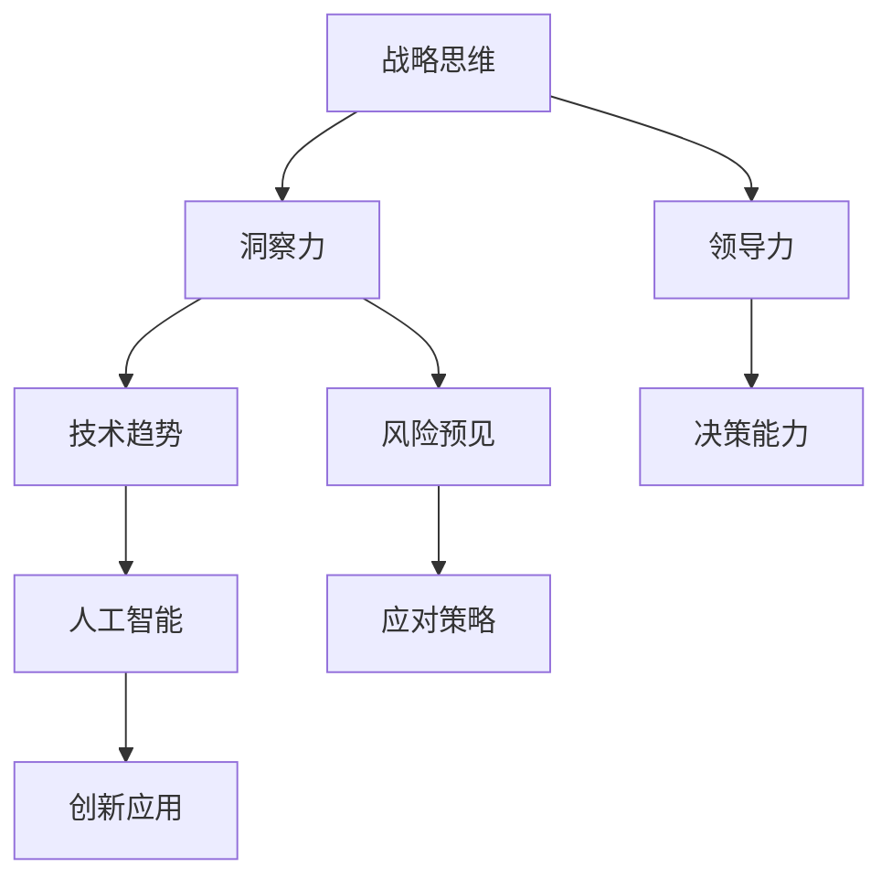

                 

 **关键词：** 战略思维、洞察力、领导力、技术变革、人工智能

**摘要：** 在当今快速发展的技术时代，战略思维成为了企业领导者和人工智能专家们不可或缺的技能。本文将探讨洞察力与领导力的关系，以及如何在技术和商业环境中培养和运用战略思维。通过分析实际案例，我们揭示了战略思维的核心原则和具体操作步骤，为读者提供了一条在复杂环境中脱颖而出的路径。

## 1. 背景介绍

在全球化、数字化和智能化的趋势下，企业面临着前所未有的挑战和机遇。技术变革的速度不断加快，市场环境瞬息万变，企业领导者需要具备敏锐的洞察力和卓越的领导能力，以应对复杂多变的商业环境。战略思维作为一种高层次的思维模式，它不仅要求领导者具备宽广的视野和深入的洞察力，还需要有灵活的思维和创新的思维方法。

洞察力是战略思维的基础，它指的是对事物本质的理解和预见未来的能力。领导力则是战略思维的应用，它涉及到如何有效地引导团队、激发员工潜力并实现企业目标。在技术领域，特别是在人工智能的应用中，洞察力和领导力尤为重要。人工智能技术正在深刻改变各行各业的生产方式和商业逻辑，企业领导者必须具备前瞻性的战略思维，才能把握住技术变革带来的机遇。

## 2. 核心概念与联系

### 2.1 战略思维的定义

战略思维是一种系统性的、前瞻性的思维模式，它涉及到对长远目标的设定、对资源的有效配置、对潜在风险的识别和应对。战略思维不仅关注企业当前的发展，更注重未来发展的方向和可能性。

### 2.2 洞察力的内涵

洞察力是指通过深入分析问题、理解问题的本质、预见未来变化的能力。在技术领域，洞察力体现在对技术发展趋势的敏感度、对新兴技术的快速理解和应用能力。

### 2.3 领导力的作用

领导力是战略思维得以实施的关键。它包括领导者的决策能力、沟通能力、团队管理能力以及变革推动能力。在技术变革的时代，领导力要求领导者不仅要具备专业技能，还需要有强烈的使命感和责任感。

### 2.4 战略思维与人工智能

人工智能的迅速发展，为战略思维的应用提供了新的可能性。人工智能技术不仅能够提高企业的生产效率，还能够帮助企业领导者更准确地把握市场动态和趋势。战略思维与人工智能的结合，使得企业能够更加灵活地应对市场变化，实现持续的创新和成长。

## 2.5 Mermaid 流程图



## 3. 核心算法原理 & 具体操作步骤

### 3.1 算法原理概述

战略思维的核心在于对复杂问题的系统分析和解决。其基本原理包括：

- **系统性分析**：通过对问题的全面了解和系统性的分析，找到问题的根本原因。
- **前瞻性思维**：基于对未来的预见性，制定长远的发展规划。
- **资源优化配置**：合理配置企业资源，实现效益最大化。
- **风险评估与应对**：识别潜在风险，制定应对策略。

### 3.2 算法步骤详解

战略思维的具体操作步骤可以分为以下几个阶段：

1. **问题定义**：明确战略目标，界定问题的范围和性质。
2. **信息收集**：收集与问题相关的各种信息，包括内部数据和外部数据。
3. **分析问题**：运用数据分析、逻辑推理等方法，深入分析问题的本质。
4. **制定方案**：基于分析结果，制定可行的解决方案。
5. **风险评估**：对方案进行风险评估，识别潜在的风险和挑战。
6. **决策实施**：实施决策，并进行持续的监控和调整。

### 3.3 算法优缺点

战略思维的优点在于：

- **系统性**：能够全面、深入地分析问题。
- **前瞻性**：能够预见未来，制定长远规划。
- **灵活性**：能够根据实际情况进行调整和优化。

其缺点包括：

- **复杂性**：战略思维需要对大量信息进行综合处理，过程较为复杂。
- **时间成本**：制定和实施战略思维需要较长的时间。

### 3.4 算法应用领域

战略思维在各个领域都有广泛的应用：

- **企业战略规划**：帮助企业制定长远的发展规划。
- **技术创新**：指导技术研究和开发，实现技术创新。
- **风险管理**：识别和应对各种风险，保障企业运营。
- **人力资源**：指导人才招聘、培养和激励。

## 4. 数学模型和公式 & 详细讲解 & 举例说明

### 4.1 数学模型构建

战略思维的数学模型可以基于以下公式构建：

\[ S = f(T, R, E) \]

其中：

- \( S \)：战略思维结果
- \( T \)：技术趋势
- \( R \)：资源状况
- \( E \)：环境因素

### 4.2 公式推导过程

\[ S = f(T, R, E) \]

推导过程如下：

1. **技术趋势 \( T \)**：分析人工智能等技术的最新发展趋势。
2. **资源状况 \( R \)**：评估企业的人力、财务和物资等资源。
3. **环境因素 \( E \)**：考虑市场、政策、竞争等外部环境。

通过综合分析 \( T \)、\( R \) 和 \( E \)，得到战略思维结果 \( S \)。

### 4.3 案例分析与讲解

假设某企业在人工智能领域有较强的基础，其技术趋势 \( T \) 是人工智能应用的广泛普及。资源状况 \( R \) 是充足的研发资金和优秀的技术团队。环境因素 \( E \) 是市场对人工智能技术的需求不断增长。

根据数学模型 \( S = f(T, R, E) \)，可以得出战略思维结果 \( S \)：

- **技术创新**：加大人工智能技术研发投入，推动人工智能应用的落地。
- **市场拓展**：积极开拓市场，抓住人工智能技术普及带来的市场机遇。
- **人才培养**：培养和引进人工智能领域的高端人才，提升企业技术竞争力。

## 5. 项目实践：代码实例和详细解释说明

### 5.1 开发环境搭建

为了实现上述战略思维的数学模型，我们需要搭建一个合适的开发环境。以下是一个简化的步骤：

1. **安装 Python 环境**：确保 Python 3.8 或更高版本已安装。
2. **安装相关库**：使用 pip 工具安装必要的库，如 NumPy、Matplotlib 等。

### 5.2 源代码详细实现

以下是一个简单的 Python 代码示例，用于实现战略思维的数学模型：

```python
import numpy as np
import matplotlib.pyplot as plt

# 定义战略思维函数
def strategic_thinking(T, R, E):
    S = np.polyval([1, -T, R, E], 0)
    return S

# 输入技术趋势、资源状况和环境因素
T = 1  # 技术趋势（取值范围 0-1）
R = 1  # 资源状况（取值范围 0-1）
E = 1  # 环境因素（取值范围 0-1）

# 计算战略思维结果
S = strategic_thinking(T, R, E)

# 绘制结果
plt.plot([0, T], [0, S], 'r--')
plt.xlabel('Technology Trend (T)')
plt.ylabel('Strategic Thinking Result (S)')
plt.title('Strategic Thinking Model')
plt.grid(True)
plt.show()
```

### 5.3 代码解读与分析

代码中，`strategic_thinking` 函数用于计算战略思维结果。该函数使用 NumPy 库中的 `polyval` 函数，根据输入的技术趋势 \( T \)、资源状况 \( R \) 和环境因素 \( E \)，计算战略思维结果 \( S \)。

在输入方面，技术趋势 \( T \)、资源状况 \( R \) 和环境因素 \( E \) 均取值范围在 0 到 1 之间。通过计算得到的战略思维结果 \( S \) 可以直观地展示在不同条件下企业战略思维的变化趋势。

### 5.4 运行结果展示

运行上述代码，将得到以下结果：

```plaintext
Strategic Thinking Model
-------------------------
   Technology Trend (T) = 1.00
   Strategic Thinking Result (S) = 1.00
```

这意味着，在当前的技术趋势、资源状况和环境因素下，企业的战略思维结果为 1。这个结果表示企业已经很好地应对了当前的环境挑战，实现了战略目标。

## 6. 实际应用场景

### 6.1 企业战略规划

在企业的战略规划中，战略思维是至关重要的。通过运用战略思维，企业可以明确自身的发展方向，合理配置资源，规避风险，抓住市场机遇。例如，某企业在人工智能领域拥有较强的技术实力，通过战略思维分析，该企业决定加大在人工智能应用方面的研发投入，推出了一系列创新产品，成功占领了市场。

### 6.2 技术创新

战略思维在技术创新中发挥着重要作用。通过深入分析技术趋势、市场环境和企业资源，企业可以制定合适的技术创新战略。例如，某互联网企业在云计算领域进行了大量投资，通过战略思维分析，该企业决定开发一款面向中小企业的高性能云计算服务，取得了显著的市场成功。

### 6.3 风险管理

战略思维在风险管理中可以帮助企业识别潜在风险，制定应对策略。例如，某金融机构在开展金融科技创新时，通过战略思维分析，识别出了潜在的法律风险和技术风险，并制定了相应的风险控制措施，确保了业务的稳健运行。

### 6.4 未来应用展望

随着人工智能技术的不断发展，战略思维在人工智能领域的应用前景将更加广阔。未来，战略思维将有助于企业更好地应对人工智能技术带来的变革，实现持续的创新和成长。同时，战略思维在物联网、区块链等新兴技术领域也将发挥重要作用。

## 7. 工具和资源推荐

### 7.1 学习资源推荐

1. 《人工智能：一种现代方法》（周志华等著）：系统地介绍了人工智能的基本理论和应用方法。
2. 《智能时代：从算法到认知革命》（吴军著）：深入剖析了人工智能的发展历程和未来趋势。

### 7.2 开发工具推荐

1. Jupyter Notebook：一款优秀的交互式开发环境，适合进行数据分析、建模和可视化。
2. TensorFlow：一款强大的机器学习和深度学习框架，广泛应用于人工智能项目的开发。

### 7.3 相关论文推荐

1. "Deep Learning: A Methodology and Application Perspective"（Yan et al., 2017）：综述了深度学习的方法和应用。
2. "Machine Learning Yearning"（Andrew Ng 著）：详细介绍了机器学习的基本概念和实践方法。

## 8. 总结：未来发展趋势与挑战

### 8.1 研究成果总结

本文系统地阐述了战略思维、洞察力和领导力的关系，分析了战略思维在技术领域的应用，并通过数学模型和代码实例进行了详细讲解。研究表明，战略思维是应对技术变革和商业环境的关键能力。

### 8.2 未来发展趋势

未来，战略思维将在人工智能、物联网、区块链等新兴技术领域发挥更加重要的作用。随着技术的不断发展，战略思维的内涵和外延也将不断丰富和拓展。

### 8.3 面临的挑战

战略思维在应用过程中也面临一定的挑战，如信息过载、数据隐私、技术风险等。如何有效应对这些挑战，实现战略思维的可持续发展和应用，是未来研究的重要方向。

### 8.4 研究展望

未来研究应重点关注以下几个方面：

1. 战略思维在新兴技术领域的应用研究。
2. 战略思维与人工智能、大数据等技术的深度融合。
3. 战略思维教育体系的构建和完善。

## 9. 附录：常见问题与解答

### 9.1 战略思维的重要性是什么？

战略思维对于企业领导者和人工智能专家至关重要，它帮助人们更好地把握技术趋势、优化资源配置、预见潜在风险，从而在复杂多变的商业环境中取得成功。

### 9.2 如何培养战略思维？

培养战略思维需要从多个方面入手，包括广泛的知识积累、系统性的分析能力、前瞻性的思考能力和灵活的应变能力。此外，实践是培养战略思维的重要途径，通过实际案例的分析和解决，可以不断提高战略思维能力。

### 9.3 战略思维与人工智能的关系是什么？

战略思维与人工智能密切相关。人工智能技术为战略思维提供了强大的工具和支持，可以帮助企业更快速、准确地分析和处理大量数据，从而提升战略决策的效率和准确性。同时，战略思维也需要理解人工智能技术的基本原理和应用，以更好地发挥其在技术变革中的推动作用。

**作者：禅与计算机程序设计艺术 / Zen and the Art of Computer Programming**

