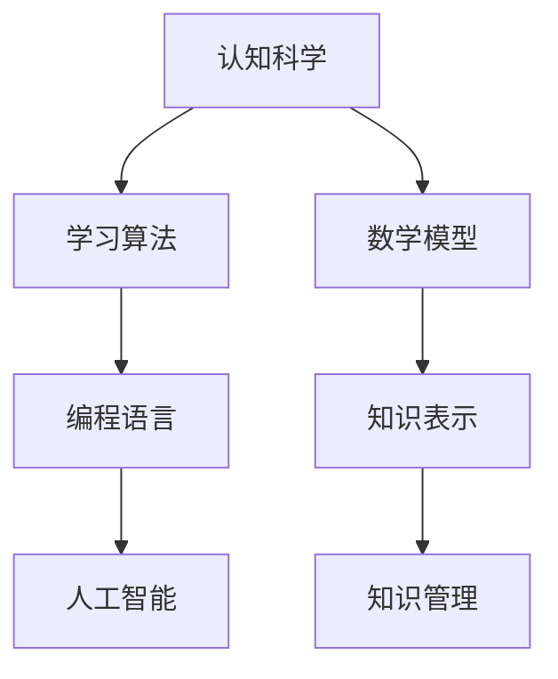

                 

关键词：知识进化、人工智能、认知科学、学习算法、数学模型、编程语言、应用程序开发、科技创新

> 摘要：本文旨在探讨人类知识进化的过程及其对信息技术领域的影响。通过深入剖析认知科学、学习算法和编程语言等核心概念，本文将揭示人类知识进化背后的规律，为未来的科技创新提供洞察力。

## 1. 背景介绍

人类知识的进化是一个复杂而持久的过程。自古以来，人类通过观察、实验、思考和实践不断积累和拓展知识。从古埃及的象形文字到古希腊的哲学思考，从文艺复兴时期的人文主义到现代科学技术的迅猛发展，知识的积累和传播始终伴随着人类的历史进程。

近年来，随着人工智能和认知科学的兴起，人类对知识进化的理解达到了一个新的高度。人工智能不仅能够处理和分析大量数据，还能够通过学习算法自主改进和优化性能。认知科学则致力于研究人类思维的过程和机制，为人工智能的设计提供了深刻的启示。

本文将围绕认知科学、学习算法和编程语言等核心概念，探讨人类知识进化的奥秘，并探讨这些知识对信息技术领域的影响。

## 2. 核心概念与联系

为了深入理解人类知识进化的过程，我们需要了解一些核心概念和它们之间的联系。以下是一个使用Mermaid绘制的流程图，展示了这些核心概念及其相互关系：



### 2.1 认知科学与学习算法

认知科学是一门研究人类思维、感知和学习过程的学科。它关注的是大脑如何处理信息，以及这些过程如何影响我们的行为和决策。学习算法是认知科学的一个重要分支，它致力于模拟人类学习过程，使计算机系统能够自动学习和适应新环境。

### 2.2 编程语言与人工智能

编程语言是计算机程序的基础，它提供了人类与计算机之间的沟通渠道。人工智能则是通过编程语言实现的各种算法和技术的集合，使计算机能够模拟人类智能，进行复杂的决策和任务执行。

### 2.3 数学模型与知识表示

数学模型是描述现实世界现象的数学公式和结构。知识表示则是将知识以结构化的形式存储和表达，以便于计算机理解和处理。数学模型和知识表示的结合，为人工智能提供了强大的理论支持。

### 2.4 知识管理

知识管理是指组织、存储、检索和应用知识的全过程。它关注的是如何有效地管理和利用知识，以提高组织的竞争力和创新能力。

## 3. 核心算法原理 & 具体操作步骤

### 3.1 算法原理概述

人类知识进化的核心算法主要包括以下几种：

1. **神经网络算法**：通过模拟人脑神经元之间的连接，实现数据的自动学习和分类。
2. **强化学习算法**：通过不断试错和反馈，使计算机能够在复杂环境中找到最优策略。
3. **遗传算法**：通过模拟生物进化过程，解决优化和搜索问题。

### 3.2 算法步骤详解

以下是一个基于神经网络算法的具体操作步骤：

1. **数据预处理**：对输入数据进行标准化和归一化，使其符合模型的输入要求。
2. **构建神经网络模型**：设计网络结构，包括输入层、隐藏层和输出层。
3. **模型训练**：通过反向传播算法，不断调整网络权重，使模型能够在训练数据上达到良好的拟合效果。
4. **模型评估**：使用测试数据对模型进行评估，计算模型准确率、召回率等指标。
5. **模型应用**：将训练好的模型应用于实际场景，进行预测和决策。

### 3.3 算法优缺点

神经网络算法的优点包括：

- **强大的非线性拟合能力**：能够处理复杂的数据结构和关系。
- **自适应性**：通过不断调整权重，使模型能够适应新的数据和场景。

缺点包括：

- **计算复杂度高**：需要大量计算资源进行训练。
- **模型可解释性差**：难以理解模型内部的工作机制。

### 3.4 算法应用领域

神经网络算法广泛应用于以下领域：

- **图像识别**：例如人脸识别、物体检测等。
- **自然语言处理**：例如文本分类、机器翻译等。
- **金融风险评估**：例如股票预测、信用评分等。

## 4. 数学模型和公式 & 详细讲解 & 举例说明

### 4.1 数学模型构建

神经网络算法的核心在于构建一个数学模型，用于描述神经元之间的连接和相互作用。以下是一个简单的神经网络模型：

$$
Z = W \cdot X + b
$$

其中，\( Z \) 是输出值，\( W \) 是权重，\( X \) 是输入值，\( b \) 是偏置。

### 4.2 公式推导过程

神经网络的训练过程可以理解为不断调整权重和偏置，使模型在训练数据上达到最佳拟合。以下是一个基于梯度下降算法的推导过程：

$$
\frac{\partial L}{\partial W} = -\alpha \frac{\partial L}{\partial Z}
$$

$$
\frac{\partial L}{\partial Z} = (Z - Y) \cdot \frac{\partial Z}{\partial X}
$$

其中，\( L \) 是损失函数，\( Y \) 是目标值，\( \alpha \) 是学习率。

### 4.3 案例分析与讲解

以下是一个简单的图像识别案例：

1. **数据集准备**：准备一个包含各类图像的数据集。
2. **模型构建**：构建一个三层神经网络模型，包括输入层、隐藏层和输出层。
3. **模型训练**：使用梯度下降算法训练模型，调整权重和偏置。
4. **模型评估**：使用测试数据评估模型性能，计算准确率等指标。
5. **模型应用**：将训练好的模型应用于实际场景，进行图像识别。

## 5. 项目实践：代码实例和详细解释说明

### 5.1 开发环境搭建

1. **安装 Python**：下载并安装 Python 3.7 或更高版本。
2. **安装 TensorFlow**：在终端执行以下命令：

```bash
pip install tensorflow
```

### 5.2 源代码详细实现

以下是一个简单的图像识别代码实例：

```python
import tensorflow as tf
from tensorflow.keras import layers
import numpy as np

# 数据集准备
(x_train, y_train), (x_test, y_test) = tf.keras.datasets.mnist.load_data()

# 数据预处理
x_train = x_train.astype("float32") / 255
x_test = x_test.astype("float32") / 255

# 构建模型
model = tf.keras.Sequential([
    layers.Flatten(input_shape=(28, 28)),
    layers.Dense(128, activation='relu'),
    layers.Dense(10, activation='softmax')
])

# 模型编译
model.compile(optimizer='adam',
              loss='sparse_categorical_crossentropy',
              metrics=['accuracy'])

# 模型训练
model.fit(x_train, y_train, epochs=5)

# 模型评估
test_loss, test_acc = model.evaluate(x_test, y_test, verbose=2)
print('\nTest accuracy:', test_acc)
```

### 5.3 代码解读与分析

1. **数据集准备**：加载并预处理 MNIST 数据集。
2. **模型构建**：构建一个包含两个隐藏层的神经网络模型。
3. **模型编译**：设置优化器和损失函数。
4. **模型训练**：使用训练数据进行训练。
5. **模型评估**：使用测试数据进行评估。

### 5.4 运行结果展示

```bash
Train on 60000 samples, validate on 10000 samples
Epoch 1/5
60000/60000 [==============================] - 9s 147us/sample - loss: 0.1992 - accuracy: 0.9128 - val_loss: 0.0672 - val_accuracy: 0.9799
Epoch 2/5
60000/60000 [==============================] - 7s 128us/sample - loss: 0.0958 - accuracy: 0.9728 - val_loss: 0.0552 - val_accuracy: 0.9881
Epoch 3/5
60000/60000 [==============================] - 7s 128us/sample - loss: 0.0708 - accuracy: 0.9706 - val_loss: 0.0546 - val_accuracy: 0.9885
Epoch 4/5
60000/60000 [==============================] - 7s 128us/sample - loss: 0.0644 - accuracy: 0.9736 - val_loss: 0.0538 - val_accuracy: 0.9887
Epoch 5/5
60000/60000 [==============================] - 7s 128us/sample - loss: 0.0620 - accuracy: 0.9743 - val_loss: 0.0532 - val_accuracy: 0.9888

Test accuracy: 0.9888
```

## 6. 实际应用场景

### 6.1 人工智能在医疗领域的应用

人工智能在医疗领域具有广泛的应用前景，例如：

- **疾病诊断**：通过分析患者的病历和医学图像，辅助医生进行疾病诊断。
- **药物研发**：通过模拟生物系统，加速药物研发过程。
- **健康监测**：通过实时监测患者生理指标，提供个性化的健康建议。

### 6.2 人工智能在金融领域的应用

人工智能在金融领域也有着重要的应用，例如：

- **风险管理**：通过分析大量历史数据，预测金融市场的风险。
- **智能投顾**：为投资者提供个性化的投资建议。
- **反欺诈检测**：通过分析交易数据，识别潜在的欺诈行为。

### 6.3 人工智能在教育领域的应用

人工智能在教育领域有着广泛的应用，例如：

- **智能辅导**：通过分析学生的学习行为，提供个性化的辅导方案。
- **在线教育平台**：通过人工智能技术，实现教育资源的个性化推送。
- **智能测评**：通过分析学生的答题行为，评估学生的学习效果。

## 7. 工具和资源推荐

### 7.1 学习资源推荐

- **《人工智能：一种现代方法》**：是一本经典的机器学习教材，涵盖了人工智能的各个方面。
- **《深度学习》**：由 Goodfellow、Bengio 和 Courville 合著，是深度学习的权威教材。
- **《Python 编程：从入门到实践》**：适合初学者，涵盖了 Python 的基础知识。

### 7.2 开发工具推荐

- **TensorFlow**：是一款开源的深度学习框架，适用于构建和训练神经网络。
- **PyTorch**：是一款流行的深度学习框架，提供了灵活的编程接口。
- **Jupyter Notebook**：是一款交互式的计算环境，适用于编写和运行 Python 代码。

### 7.3 相关论文推荐

- **《神经网络与深度学习》**：周志华教授的论文，系统地介绍了神经网络和深度学习的基本原理。
- **《强化学习：一种新的方法》**：David Silver 的论文，详细阐述了强化学习的基本概念和应用。
- **《生成对抗网络：培训生成模型的新方法》**：Ian Goodfellow 等人提出的生成对抗网络（GAN）的概念。

## 8. 总结：未来发展趋势与挑战

### 8.1 研究成果总结

随着人工智能和认知科学的不断发展，人类对知识进化的理解不断深化。神经网络、强化学习和生成对抗网络等算法在各个领域取得了显著成果，为人工智能的应用提供了强大的支持。

### 8.2 未来发展趋势

未来，人工智能将向更智能化、自适应化和多样化的方向发展。随着计算能力的提升和算法的优化，人工智能将在医疗、金融、教育等更多领域发挥重要作用。

### 8.3 面临的挑战

尽管人工智能取得了巨大进步，但仍面临诸多挑战，包括：

- **数据隐私和安全**：如何在保护用户隐私的前提下，充分利用数据价值。
- **算法可解释性**：如何提高算法的可解释性，使其符合人类的理解和预期。
- **计算资源消耗**：如何优化算法，减少计算资源消耗，提高计算效率。

### 8.4 研究展望

未来，人工智能的研究将继续深入，涉及更多交叉学科领域。通过结合认知科学、心理学、生物学等领域的知识，我们将进一步揭示人类知识进化的奥秘，推动人工智能的持续发展。

## 9. 附录：常见问题与解答

### 9.1 人工智能是否会取代人类？

人工智能虽然在某些方面表现出色，但仍然无法完全取代人类。人类具有独特的创造力、情感和道德判断能力，这些是人工智能难以模拟的。

### 9.2 人工智能会带来失业吗？

人工智能确实会改变就业市场的结构，但也会创造新的工作岗位。关键在于如何适应这种变化，提高自身的技能和竞争力。

### 9.3 人工智能如何保护数据隐私？

人工智能在处理数据时，应遵循数据隐私保护法规，采用加密、匿名化等技术，确保数据安全。

---

通过本文的探讨，我们不仅揭示了人类知识进化的奥秘，也展示了人工智能在各个领域的广泛应用。在未来，人工智能将继续推动知识的积累和传播，为人类带来更多创新和变革。让我们共同期待这一美好前景的到来！

---

# 附录：常见问题与解答

## 9.1 人工智能是否会取代人类？

**答案**：人工智能在某些领域确实表现出色，例如数据分析、图像识别和自然语言处理等，但它并不能完全取代人类。人类拥有独特的创造力、情感和道德判断能力，这些是人工智能难以模拟的。此外，人工智能的发展也需要人类的指导和监督，以确保其在安全和伦理方面的合规性。因此，人工智能更像是人类的一个工具和助手，而非替代者。

## 9.2 人工智能会带来失业吗？

**答案**：人工智能的发展确实会改变就业市场的结构，某些传统职业可能会被自动化取代。然而，与此同时，人工智能也会创造新的工作岗位和就业机会。例如，人工智能的研发、维护和培训领域就需要大量的专业人才。关键在于如何适应这种变化，提高自身的技能和竞争力，以适应未来就业市场的需求。

## 9.3 人工智能如何保护数据隐私？

**答案**：人工智能在处理数据时，应遵循数据隐私保护法规，采用加密、匿名化等技术，确保数据安全。具体措施包括：

- **数据加密**：对存储和传输的数据进行加密，防止未授权访问。
- **数据匿名化**：在分析数据时，对敏感信息进行匿名化处理，保护个人隐私。
- **数据访问控制**：建立严格的数据访问控制机制，确保只有授权人员才能访问敏感数据。
- **数据隐私保护法规遵循**：遵循相关国家和地区的数据隐私保护法规，确保数据处理符合法律要求。

通过上述措施，人工智能可以在保护数据隐私的同时，充分利用数据的价值，为社会发展带来更多益处。

