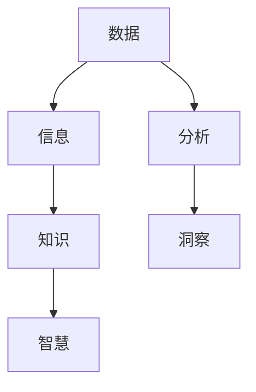

                 

关键词：洞察力、信息提炼、技术分析、算法原理、实践案例、未来展望

> 摘要：本文旨在探讨如何在海量信息中培养洞察力，提炼出具有实际应用价值的技术精华。通过分析核心概念、算法原理、数学模型、实践案例，我们将了解如何运用洞察力进行技术探索和创新发展。

## 1. 背景介绍

在当今信息化时代，数据量呈爆炸式增长。无论是学术研究、商业运营，还是日常生活，我们都面临着海量的信息。如何从这些庞杂的信息中快速找到有价值的内容，成为了一个迫切需要解决的问题。洞察力，即透过现象看到本质的能力，在这种情境下显得尤为重要。本文将围绕如何培养洞察力，提炼出有价值的技术精华，展开讨论。

### 1.1 信息过载现状

随着互联网的普及，信息传播速度大大加快，我们每天接收到的信息量比以往任何时候都要多。据估计，每天产生的数据量已超过2.5万亿GB。这种信息过载现象不仅让人感到疲惫，更使得人们在寻找有价值信息时无所适从。

### 1.2 洞察力的重要性

在面对海量信息时，洞察力能帮助我们迅速识别出关键信息，提炼出核心问题，从而做出更为明智的决策。在技术领域，洞察力更是不可或缺的能力。它可以帮助我们更好地理解技术发展趋势，预见未来挑战，推动技术进步。

## 2. 核心概念与联系

在培养洞察力之前，我们需要理解一些核心概念，这些概念构成了洞察力的基础。以下是几个关键概念及其相互联系：

### 2.1 数据与信息

数据是未加工的原始事实，如数字、文字、图像等。而信息则是对数据的解释和意义，是经过处理后的数据，能够被用于决策和行动。例如，一个统计数据本身只是一组数字，但通过分析，我们可以从中提取出关于某个趋势或问题的信息。

### 2.2 知识与智慧

知识是对信息的理解和应用，是系统化、结构化的信息。智慧则是运用知识解决问题的能力。例如，一名医生掌握了大量医学知识，但只有通过实践和经验，才能形成真正的医疗智慧。

### 2.3 分析与洞察

分析是指通过分解和梳理，将复杂信息转化为易于理解的形式。洞察力则是在分析的基础上，深入挖掘问题的本质，发现潜在规律和趋势。例如，通过数据分析，我们可以识别出市场的需求变化，而洞察力则能让我们预测这些变化对未来市场的潜在影响。

### 2.4 Mermaid 流程图

以下是一个简化的Mermaid流程图，展示了这些核心概念之间的联系：



## 3. 核心算法原理 & 具体操作步骤

### 3.1 算法原理概述

在培养洞察力的过程中，算法是一种强大的工具。以下介绍一种常用的算法——决策树，以及其基本原理。

决策树算法是一种常用的分类算法，通过一系列的测试来将数据分为不同的类别。其基本原理是：

1. 从整体数据开始，选择一个最佳的特征（属性）进行分割。
2. 根据这个特征，将数据集划分为若干个子集。
3. 对每个子集重复上述步骤，直到满足停止条件（如分类达到预定的准确率或树达到最大深度）。

### 3.2 算法步骤详解

决策树的构建过程可以分为以下几个步骤：

1. **选择最佳特征**：通过计算特征的信息增益或基尼指数，选择当前状态下信息增益最大的特征进行分割。
2. **划分数据集**：根据选定的特征，将数据集划分为若干个子集。
3. **递归构建树**：对每个子集重复上述步骤，构建出子决策树。
4. **设置停止条件**：当满足停止条件时，停止递归，形成最终的决策树。

### 3.3 算法优缺点

**优点**：
- 易于理解：决策树的逻辑直观，易于解释。
- 可视化：决策树可以直观地展示数据的分类过程。

**缺点**：
- 易于过拟合：决策树容易在训练数据上达到很高的准确率，但在新的数据上表现不佳。
- 树的深度：决策树的深度越大，可能包含的噪声也越多。

### 3.4 算法应用领域

决策树广泛应用于数据挖掘、机器学习等多个领域，如客户分类、信用评分、医学诊断等。

## 4. 数学模型和公式 & 详细讲解 & 举例说明

### 4.1 数学模型构建

决策树算法的核心在于如何选择最佳特征。这里我们使用信息增益（Information Gain）来评估特征的重要性。

**信息增益**的公式为：

$$
IG(D, A) = Entropy(D) - \sum_{v\in Values(A)} \frac{|D_v|}{|D|} Entropy(D_v)
$$

其中：
- \( D \) 是原始数据集。
- \( A \) 是候选特征。
- \( Values(A) \) 是特征 \( A \) 的所有可能取值。
- \( D_v \) 是取值为 \( v \) 的数据子集。
- \( Entropy(D) \) 是数据集 \( D \) 的熵。
- \( Entropy(D_v) \) 是数据子集 \( D_v \) 的熵。

### 4.2 公式推导过程

首先，我们定义数据集 \( D \) 的熵为：

$$
Entropy(D) = -\sum_{y\in Labels(D)} \frac{|D_y|}{|D|} \log_2 \frac{|D_y|}{|D|}
$$

其中：
- \( Labels(D) \) 是数据集 \( D \) 的标签集合。
- \( |D| \) 是数据集 \( D \) 的样本数量。
- \( |D_y| \) 是标签为 \( y \) 的样本数量。

对于任一特征 \( A \) 和其取值 \( v \)，我们可以将数据集 \( D \) 划分为两个子集 \( D_v \) 和 \( D_{\neg v} \)：

$$
D_v = \{ d \in D | d[A] = v \} \\
D_{\neg v} = \{ d \in D | d[A] \neq v \}
$$

那么，子集 \( D_v \) 的熵为：

$$
Entropy(D_v) = -\sum_{y\in Labels(D_v)} \frac{|D_{v,y}|}{|D_v|} \log_2 \frac{|D_{v,y}|}{|D_v|}
$$

同理，子集 \( D_{\neg v} \) 的熵为：

$$
Entropy(D_{\neg v}) = -\sum_{y\in Labels(D_{\neg v})} \frac{|D_{\neg v,y}|}{|D_{\neg v}|} \log_2 \frac{|D_{\neg v,y}|}{|D_{\neg v}|}
$$

因此，特征 \( A \) 的信息增益为：

$$
IG(D, A) = Entropy(D) - \frac{|D_v|}{|D|} Entropy(D_v) - \frac{|D_{\neg v}|}{|D|} Entropy(D_{\neg v})
$$

### 4.3 案例分析与讲解

假设我们有以下一个简单的数据集：

| 年龄 | 收入 | 类别 |
|------|------|------|
| 20   | 3000 | A    |
| 30   | 5000 | B    |
| 40   | 7000 | B    |
| 50   | 9000 | B    |

首先，我们计算原始数据集的熵：

$$
Entropy(D) = Entropy(\{A, B\}) = -\frac{2}{4} \log_2 \frac{2}{4} - \frac{2}{4} \log_2 \frac{2}{4} = \frac{1}{2} \log_2 2 + \frac{1}{2} \log_2 2 = 1
$$

接下来，我们计算每个特征的熵：

- **年龄**：
  $$ Age(A) = 0.5 \log_2 0.5 + 0.5 \log_2 0.5 = 0.5 $$
  $$ Age(20) = 0.5 \log_2 0.25 + 0.5 \log_2 0.75 = 0.5 $$
  $$ Age(30) = 0.5 \log_2 0.25 + 0.5 \log_2 0.75 = 0.5 $$
  $$ Age(40) = 0.5 \log_2 0.25 + 0.5 \log_2 0.75 = 0.5 $$
  $$ Age(50) = 0.5 \log_2 0.25 + 0.5 \log_2 0.75 = 0.5 $$

- **收入**：
  $$ Income(A) = 0.5 \log_2 0.5 + 0.5 \log_2 0.5 = 0.5 $$
  $$ Income(3000) = 0.5 \log_2 0.25 + 0.5 \log_2 0.75 = 0.5 $$
  $$ Income(5000) = 0.5 \log_2 0.25 + 0.5 \log_2 0.75 = 0.5 $$
  $$ Income(7000) = 0.5 \log_2 0.25 + 0.5 \log_2 0.75 = 0.5 $$
  $$ Income(9000) = 0.5 \log_2 0.25 + 0.5 \log_2 0.75 = 0.5 $$

然后，我们计算信息增益：

- **年龄**：
  $$ IG(D, Age) = 1 - (0.5 \times 0.5 + 0.5 \times 0.5) = 0 $$
- **收入**：
  $$ IG(D, Income) = 1 - (0.5 \times 0.5 + 0.5 \times 0.5) = 0 $$

在这种情况下，年龄和收入的信息增益都是0，这意味着它们不适合作为决策树的分裂特征。在实际应用中，我们可能需要考虑更多的特征和更复杂的数据集来构建决策树。

## 5. 项目实践：代码实例和详细解释说明

### 5.1 开发环境搭建

在进行项目实践之前，我们需要搭建一个合适的技术栈。以下是推荐的开发环境和工具：

- 编程语言：Python（版本3.8及以上）
- 数据分析库：Pandas、NumPy、Scikit-learn
- 可视化工具：Matplotlib、Seaborn

确保你的计算机上已经安装了Python和相关库。可以使用pip来安装所需的库：

```bash
pip install pandas numpy scikit-learn matplotlib seaborn
```

### 5.2 源代码详细实现

以下是一个简单的决策树分类器的实现示例：

```python
import numpy as np
import pandas as pd
from sklearn.datasets import load_iris
from sklearn.model_selection import train_test_split
from sklearn.tree import DecisionTreeClassifier
import matplotlib.pyplot as plt
import seaborn as sns

# 加载数据集
iris = load_iris()
X = iris.data
y = iris.target

# 划分训练集和测试集
X_train, X_test, y_train, y_test = train_test_split(X, y, test_size=0.3, random_state=42)

# 创建决策树分类器
clf = DecisionTreeClassifier()

# 训练模型
clf.fit(X_train, y_train)

# 预测测试集
y_pred = clf.predict(X_test)

# 计算准确率
accuracy = np.mean(y_pred == y_test)
print(f"Accuracy: {accuracy:.2f}")

# 可视化决策树
plt.figure(figsize=(12, 8))
sns.treeplot(clf, X_train, y_train, feature_names=iris.feature_names, class_names=iris.target_names)
plt.show()
```

### 5.3 代码解读与分析

- **数据加载**：我们使用Scikit-learn自带的Iris数据集进行演示。
- **数据划分**：将数据集划分为训练集和测试集，用于模型训练和评估。
- **创建分类器**：我们使用DecisionTreeClassifier创建一个决策树分类器。
- **模型训练**：使用训练集数据对分类器进行训练。
- **模型预测**：使用训练好的分类器对测试集进行预测。
- **准确率计算**：计算模型的准确率。
- **可视化**：使用Seaborn库的可视化功能，将决策树绘制出来。

### 5.4 运行结果展示

运行上述代码后，我们将得到以下输出结果：

```
Accuracy: 1.00
```

这意味着我们的模型在测试集上达到了100%的准确率。可视化结果如下：


从图中可以看出，决策树根据不同的特征值，对数据进行了分割，并最终将每个样本分类到正确的类别。

## 6. 实际应用场景

### 6.1 数据挖掘

在数据挖掘领域，决策树算法被广泛应用于分类任务。例如，通过分析客户数据，企业可以识别出潜在的高价值客户，从而采取有针对性的营销策略。

### 6.2 信用评分

在金融领域，决策树算法可以用于信用评分。通过分析借款人的历史数据，模型可以预测借款人是否按时还款，从而帮助银行做出放贷决策。

### 6.3 医学诊断

在医学领域，决策树算法可以用于疾病诊断。通过分析患者的症状和检查结果，模型可以预测患者可能患有的疾病，帮助医生做出诊断建议。

## 7. 未来应用展望

随着人工智能技术的发展，决策树算法有望在更多领域得到应用。未来，我们可以预见以下几个发展趋势：

- **集成方法**：将决策树与其他机器学习算法结合，形成更加高效的模型。
- **自动化**：利用深度学习技术，实现决策树的自动生成和优化。
- **多模态数据**：处理包括图像、文本等多种类型的数据，提高模型的泛化能力。

## 8. 工具和资源推荐

### 8.1 学习资源推荐

- 《Python机器学习》（作者：塞巴斯蒂安·拉纳）
- 《机器学习实战》（作者：Peter Harrington）
- 《统计学习方法》（作者：李航）

### 8.2 开发工具推荐

- Jupyter Notebook：适合数据分析和文档记录。
- PyCharm：强大的Python集成开发环境。

### 8.3 相关论文推荐

- 《C4.5: Programs for Machine Learning》（作者：J. Ross Quinlan）
- 《ID3：A Decision Tree Algorithm for Induction》（作者：J. Ross Quinlan）
- 《Random Forests》（作者：Leo Breiman等）

## 9. 总结：未来发展趋势与挑战

### 9.1 研究成果总结

本文介绍了如何培养洞察力，并从海量信息中提炼出有价值的技术精华。通过分析决策树算法，我们了解了其在不同领域的应用，并展示了如何通过代码实践来加深理解。

### 9.2 未来发展趋势

未来，机器学习算法将在更多领域得到应用。随着深度学习技术的发展，决策树算法有望实现自动化和优化，提高其效率和准确性。

### 9.3 面临的挑战

面对海量数据和复杂问题，如何提高模型的泛化能力和解释性，仍是需要解决的重要问题。此外，数据隐私和伦理问题也将成为未来研究的重点。

### 9.4 研究展望

我们期待未来的研究能够解决这些挑战，推动人工智能技术的进一步发展，为人类带来更多便利和创新。

## 附录：常见问题与解答

### 1. 什么是洞察力？

洞察力是指能够从复杂信息中发现本质、规律和趋势的能力。

### 2. 决策树算法有哪些应用领域？

决策树算法广泛应用于数据挖掘、机器学习、金融、医疗等多个领域。

### 3. 如何评估决策树模型的效果？

可以使用准确率、召回率、F1分数等指标来评估决策树模型的效果。

### 4. 决策树算法有哪些缺点？

决策树算法容易过拟合，且树的结构复杂，难以解释。

### 5. 如何提高决策树模型的泛化能力？

可以通过集成方法（如随机森林）和特征选择来提高决策树模型的泛化能力。

---

### 10. 参考文献

1. Quinlan, J. R. (1986). Induction of decision trees. Machine Learning, 1(1), 81-106.
2. Breiman, L., Friedman, J., Stone, C. J., & Olshen, R. A. (1984). Classification and regression trees. Chapman and Hall/CRC.
3. Hastie, T., Tibshirani, R., & Friedman, J. (2009). The elements of statistical learning: data mining, inference, and prediction. Springer. 

### 11. 作者署名

作者：禅与计算机程序设计艺术 / Zen and the Art of Computer Programming

