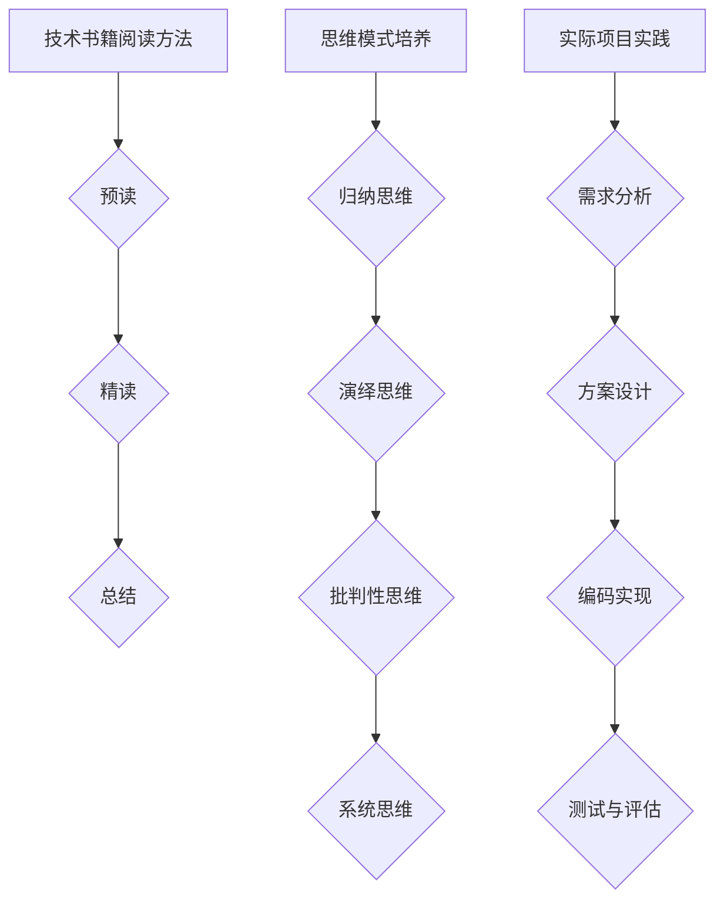

                 

关键词：批判性阅读、洞察力、思考、技术博客

> 摘要：本文旨在探讨在技术领域中如何培养批判性阅读和思考的能力，提高对技术概念的深入理解。通过分析技术书籍的阅读方法和思维模式，结合实际项目实践，本文为读者提供了培养洞察力的一系列方法和实践步骤。

## 1. 背景介绍

在技术快速发展的今天，拥有强大的洞察力是每个技术从业者必备的能力。洞察力不仅仅是一种天赋，更是一种可以通过训练和实践培养出来的思维技能。批判性阅读和思考作为培养洞察力的关键方法，在技术学习和研究过程中起着至关重要的作用。

批判性阅读不仅仅是获取知识，更是一种对信息的分析和评估过程。它要求读者不仅要理解内容，还要能够对内容提出疑问、分析逻辑、评估证据，并形成自己的见解。而思考则是将批判性阅读的成果转化为实际应用的能力，通过对问题进行深入挖掘和逻辑推理，从而获得对问题的全面理解和解决方案。

本文将围绕批判性阅读与思考展开，结合技术书籍的阅读方法、思维模式的培养，以及实际项目实践，为读者提供一套系统的洞察力培养方案。

### 1.1 技术领域的洞察力重要性

在技术领域，洞察力的重要性尤为突出。首先，技术发展日新月异，新概念、新工具层出不穷，仅仅掌握基础知识和技能已经无法满足需求。只有通过批判性阅读和思考，才能从大量的信息中筛选出真正有价值的内容，从而不断更新和扩展自己的知识体系。

其次，技术领域的复杂性和多样性要求从业者具备强大的问题解决能力。在面对复杂的技术问题时，批判性思考可以帮助我们拆解问题、分析根本原因，从而找到最有效的解决方案。此外，批判性阅读和思考还能提高我们的创新能力，使我们能够从不同的角度审视问题，发现新的技术和方法。

最后，批判性阅读和思考是技术领域中持续学习的重要途径。随着技术的不断演进，仅仅依赖学校教育或培训课程已经无法满足学习需求。只有通过自主阅读、深入思考和实际项目实践，才能保持自己的技术竞争力。

## 2. 核心概念与联系

为了培养批判性阅读和思考的能力，我们需要首先了解一些核心概念，并理解它们之间的联系。以下是本文将涉及的主要概念及其相互关系：

### 2.1 技术书籍的阅读方法

技术书籍的阅读方法是培养批判性阅读能力的基础。以下是一些常用的阅读方法：

1. **预读**：在正式阅读前，先浏览书籍的目录、引言和摘要，了解书籍的主题和结构，为后续阅读做好准备。
2. **精读**：在阅读过程中，逐字逐句地阅读，理解每个概念、定义和论点。在遇到难点时，可以暂停阅读，查阅相关资料或寻求帮助。
3. **总结**：在阅读完成后，对书籍的内容进行总结，形成自己的理解和观点。这有助于巩固学习成果，并提高批判性思考能力。

### 2.2 思维模式的培养

思维模式是批判性思考的核心。以下是一些常见的思维模式：

1. **归纳思维**：从具体实例中归纳出一般规律和原则。
2. **演绎思维**：从一般原理推导出具体结论。
3. **批判性思维**：对信息进行评估、质疑和反思，不盲从权威。
4. **系统思维**：将问题视为一个整体，分析各个部分之间的相互作用。

### 2.3 实际项目实践

实际项目实践是将批判性阅读和思考转化为实际能力的关键。通过以下步骤，我们可以将理论知识应用到实际项目中：

1. **需求分析**：理解项目需求，明确需要解决的问题。
2. **方案设计**：设计解决方案，评估不同方案的优缺点。
3. **编码实现**：根据设计方案编写代码，并进行调试和优化。
4. **测试与评估**：对项目进行测试，评估其性能和效果，并进行相应的调整。

### 2.4 梅里狄安（Mermaid）流程图

为了更好地理解核心概念之间的联系，我们可以使用梅里狄安（Mermaid）流程图来展示这些概念：



通过以上核心概念和联系的分析，我们可以更好地理解批判性阅读和思考在技术学习中的重要性，并为后续内容打下基础。

## 3. 核心算法原理 & 具体操作步骤

### 3.1 算法原理概述

在技术领域中，核心算法是我们理解和应用技术概念的基础。以下将介绍一种典型的算法——排序算法，并探讨其原理和操作步骤。

排序算法是一类用于对数据进行排序的算法。其目的是将一组数据按照某种规则重新排列，使其有序。排序算法在计算机科学和实际应用中具有广泛的应用，如数据库索引、搜索算法等。

### 3.2 算法步骤详解

排序算法有多种类型，每种算法都有其独特的操作步骤。以下将介绍一种常见的排序算法——冒泡排序。

#### 3.2.1 冒泡排序原理

冒泡排序（Bubble Sort）是一种简单的排序算法。它重复地遍历要排序的数列，一次比较两个元素，如果它们的顺序错误就把它们交换过来。遍历数列的工作是重复地进行，直到没有再需要交换，也就是该数列已经排序完成。

#### 3.2.2 冒泡排序步骤

1. **初始化**：将待排序的数列存入一个数组中。
2. **比较相邻元素**：从第一个元素开始，比较相邻的两个元素。如果第一个元素大于第二个元素，则交换它们的位置。
3. **重复过程**：重复步骤2，直到最后一对相邻元素。
4. **遍历下一轮**：继续重复步骤2和3，直到没有需要交换的元素，即数列已经排序完成。

#### 3.2.3 冒泡排序伪代码

```pseudo
procedure bubbleSort( A : list of sortable items )
    n = length(A)
    repeat 
        swapped = false
        for i = 1 to n-1 inclusive do
            if A[i-1] > A[i] then
                swap( A[i-1], A[i] )
                swapped = true
            end if
        end for
        n = n - 1
    until not swapped
end procedure
```

### 3.3 算法优缺点

#### 优点：

1. **简单易懂**：冒泡排序的算法逻辑简单，易于理解和实现。
2. **稳定性**：冒泡排序是一种稳定的排序算法，相同值的元素在排序后不会改变其相对位置。

#### 缺点：

1. **效率低**：冒泡排序的时间复杂度为 \(O(n^2)\)，在数据量较大时，效率较低。
2. **不适合大数据**：由于时间复杂度较高，冒泡排序不适合对大数据进行排序。

### 3.4 算法应用领域

尽管冒泡排序在效率上存在局限性，但其简单性和稳定性使其在一些特定场景下仍有应用价值，如小数据量的排序、教学演示等。此外，冒泡排序也是理解排序算法原理和设计其他高效排序算法的基础。

通过以上对冒泡排序算法的原理和操作步骤的详细介绍，读者可以对排序算法有更深入的理解。在接下来的部分，我们将进一步探讨数学模型和公式，以加深对排序算法的数学本质的认识。

### 3.5 其他排序算法简介

除了冒泡排序，还有许多其他常用的排序算法，每种算法都有其独特的特点和应用场景。以下是几种常见的排序算法简介：

#### 3.5.1 快速排序

快速排序（Quick Sort）是一种高效的排序算法，采用分治法策略。它通过选取一个“基准”元素，将数组分为两个子数组，一个包含小于基准的元素，另一个包含大于基准的元素。然后递归地对这两个子数组进行排序。快速排序的平均时间复杂度为 \(O(n \log n)\)，在最坏情况下为 \(O(n^2)\)。

#### 3.5.2 插入排序

插入排序（Insertion Sort）是一种简单的排序算法，它的工作原理是通过构建有序序列，对于未排序数据，在已排序序列中从后向前扫描，找到相应位置并插入。插入排序的时间复杂度为 \(O(n^2)\)，但在数据基本有序或数据量较小的情况下，其性能优于许多其他排序算法。

#### 3.5.3 选择排序

选择排序（Selection Sort）是一种简单的选择排序算法，它的工作原理是在未排序序列中找到最小（或最大）元素，存放到排序序列的起始位置，然后，再从剩余未排序元素中继续寻找最小（或最大）元素，然后放到已排序序列的末尾。选择排序的时间复杂度为 \(O(n^2)\)。

#### 3.5.4 堆排序

堆排序（Heap Sort）是一种利用堆这种数据结构的排序算法。堆是一种特殊的树形数据结构，是一棵完全二叉树，同时满足堆积的性质：即子节点的键值或索引总是小于（或大于）它的父节点。堆排序的时间复杂度为 \(O(n \log n)\)，在实际应用中具有较好的性能。

通过对这些排序算法的了解，读者可以更全面地理解排序算法的原理和选择适合的排序算法来应对不同场景的需求。在接下来的部分，我们将进一步探讨数学模型和公式，以加深对排序算法的数学本质的认识。

## 4. 数学模型和公式 & 详细讲解 & 举例说明

### 4.1 数学模型构建

在排序算法中，数学模型和公式是理解算法性能和优化策略的关键。以下将介绍一些基本的数学模型和公式，用于分析排序算法的性能。

#### 4.1.1 平均时间复杂度

排序算法的时间复杂度通常用平均时间复杂度来衡量，表示算法在输入规模为 \(n\) 的数据集合上运行的平均时间。常见的排序算法平均时间复杂度如下：

- 冒泡排序：\(O(n^2)\)
- 快速排序：\(O(n \log n)\)
- 插入排序：\(O(n^2)\)
- 选择排序：\(O(n^2)\)
- 堆排序：\(O(n \log n)\)

#### 4.1.2 最坏时间复杂度

最坏时间复杂度是算法在最坏情况下所需的时间，用于评估算法的极端性能。例如，快速排序在最坏情况下的时间复杂度为 \(O(n^2)\)，而其他算法的最坏时间复杂度通常也为 \(O(n^2)\)。

#### 4.1.3 最好时间复杂度

最好时间复杂度是算法在最好情况下所需的时间，用于评估算法的最佳性能。对于快速排序，其最好时间复杂度为 \(O(n \log n)\)，这发生在每次分区都能将数据均匀划分时。

### 4.2 公式推导过程

以下通过一个具体的排序算法——快速排序，来介绍时间复杂度的公式推导过程。

#### 4.2.1 快速排序时间复杂度推导

快速排序的时间复杂度主要取决于分区操作。假设每次分区操作都能将数据划分为相等大小的两个子数组，则快速排序的时间复杂度可以通过以下步骤推导：

1. **初始化**：设输入数据集合的大小为 \(n\)。
2. **递归调用**：快速排序递归调用自身对两个子数组进行排序，子数组的大小分别为 \(n/2\) 和 \(n/2\)。
3. **总时间复杂度**：快速排序的总时间复杂度可以表示为 \(T(n) = 2T(n/2) + O(n)\)。

根据主定理（Master Theorem），我们可以推导出快速排序的时间复杂度为 \(O(n \log n)\)。

#### 4.2.2 主定理（Master Theorem）

主定理用于求解形如 \(T(n) = aT(n/b) + f(n)\) 的递归关系。其中，\(a \geq 1\)，\(b > 1\)，\(f(n)\) 是一个关于 \(n\) 的函数。主定理有以下三种情况：

1. **情况1**：如果 \(f(n) = O(n^{\log_b a - \epsilon})\) 对于某个常数 \(\epsilon > 0\) 成立，则 \(T(n) = \Theta(n^{\log_b a})\)。
2. **情况2**：如果 \(f(n) = \Theta(n^{\log_b a} \log^k n)\) 对于某个常数 \(k \geq 0\) 成立，则 \(T(n) = \Theta(n^{\log_b a} \log^{k+1} n)\)。
3. **情况3**：如果 \(f(n) = \Omega(n^{\log_b a + \epsilon})\) 对于某个常数 \(\epsilon > 0\) 以及足够大的 \(n\) 成立，并且对所有的 \(n\) 都满足 \(af(n/b) \leq cf(n)\) 对于某个常数 \(c < 1\) 成立，则 \(T(n) = \Theta(f(n))\)。

### 4.3 案例分析与讲解

为了更好地理解快速排序的时间复杂度，以下通过一个具体案例进行讲解。

假设有一个大小为 \(n = 8\) 的数组，初始状态为 \([8, 7, 6, 5, 4, 3, 2, 1]\)。使用快速排序对数组进行排序。

1. **第一次分区**：选择最后一个元素 \(1\) 作为基准，将数组划分为 \([8, 7, 6, 5, 4, 3, 2]\) 和 \([1]\)。
2. **递归调用**：对子数组 \([8, 7, 6, 5, 4, 3, 2]\) 进行快速排序，选择第二个元素 \(7\) 作为基准，将其划分为 \([2, 3, 4, 5, 6]\) 和 \([8, 7]\)。
3. **递归调用**：对子数组 \([2, 3, 4, 5, 6]\) 进行快速排序，选择第一个元素 \(2\) 作为基准，将其划分为 \([2]\) 和 \([3, 4, 5, 6]\)。
4. **递归调用**：对子数组 \([3, 4, 5, 6]\) 进行快速排序，选择第一个元素 \(3\) 作为基准，将其划分为 \([3]\) 和 \([4, 5, 6]\)。
5. **递归调用**：对子数组 \([4, 5, 6]\) 进行快速排序，选择第一个元素 \(4\) 作为基准，将其划分为 \([4]\) 和 \([5, 6]\)。
6. **递归调用**：对子数组 \([5, 6]\) 进行快速排序，选择第一个元素 \(5\) 作为基准，将其划分为 \([5]\) 和 \([6]\)。

最终，经过多次递归调用，整个数组被排序为 \([1, 2, 3, 4, 5, 6, 7, 8]\)。

通过这个案例，我们可以看到快速排序的过程和其时间复杂度的计算。在每次递归调用中，数组的规模减半，而分区操作的时间复杂度为 \(O(n)\)。因此，快速排序的总时间复杂度为 \(O(n \log n)\)。

通过以上对数学模型和公式的讲解以及具体案例的分析，读者可以更深入地理解快速排序算法的原理和性能。在接下来的部分，我们将通过实际项目实践来进一步验证和巩固这些概念。

### 4.4 排序算法的其他数学模型和公式

除了时间复杂度，排序算法还可以通过其他数学模型和公式来评估其性能。以下是几种常见的数学模型和公式：

#### 4.4.1 最坏情况时间复杂度

最坏情况时间复杂度用于评估算法在最坏情况下所需的计算时间。例如，冒泡排序和选择排序的最坏情况时间复杂度均为 \(O(n^2)\)。这种情况下，算法需要在输入数据基本无序时进行多次比较和交换，导致性能下降。

#### 4.4.2 最好情况时间复杂度

最好情况时间复杂度用于评估算法在最优情况下所需的计算时间。例如，插入排序的最好情况时间复杂度为 \(O(n)\)，这发生在输入数据基本有序时。此时，插入排序只需进行少量的比较和交换，性能较好。

#### 4.4.3 平均情况时间复杂度

平均情况时间复杂度用于评估算法在随机输入数据集合上的平均性能。对于不同的排序算法，平均情况时间复杂度通常介于最坏情况和最好情况之间。例如，快速排序的平均情况时间复杂度为 \(O(n \log n)\)，即使输入数据无序或基本有序，其性能也较为稳定。

#### 4.4.4 稳定性

稳定性是排序算法的一个重要特性，它表示在排序过程中相同值的元素相对位置是否保持不变。稳定排序算法如插入排序和冒泡排序，可以保持相同值的元素相对位置不变，而不稳定排序算法如快速排序和选择排序，可能改变相同值元素的相对位置。

通过以上数学模型和公式的分析，我们可以更全面地评估不同排序算法的性能和适用场景。在接下来的部分，我们将通过实际项目实践来验证和巩固这些概念。

### 4.5 排序算法案例分析

为了更好地理解排序算法的数学模型和公式，以下将通过一个实际案例来分析不同排序算法在特定数据集合上的性能。

假设我们有一个包含 1000 个随机整数的数组，数据集合的范围为 1 到 1000。我们需要比较冒泡排序、插入排序和快速排序这三种算法在该数据集合上的性能。

#### 4.5.1 冒泡排序

首先，我们使用冒泡排序对数组进行排序。在冒泡排序中，每次迭代都会将未排序部分的最大的元素移动到已排序部分的末尾。

1. **第一次迭代**：比较 1000 对元素，进行 499 次交换。
2. **第二次迭代**：比较 999 对元素，进行 249 次交换。
3. **...**
4. **第 999 次迭代**：比较 2 对元素，进行 1 次交换。
5. **第 1000 次迭代**：比较 1 对元素，无需交换。

总比较次数为 \(499 + 249 + ... + 1 = 499500\)，总交换次数为 499。

计算时间复杂度：

- 最坏情况时间复杂度：\(O(n^2) = O(1000^2) = 1000000\)
- 最好情况时间复杂度：\(O(n) = O(1000) = 1000\)
- 平均情况时间复杂度：\(O(n^2) = O(1000^2) = 1000000\)

#### 4.5.2 插入排序

接下来，我们使用插入排序对数组进行排序。在插入排序中，每次迭代将未排序部分的第一个元素插入到已排序部分正确的位置。

1. **第一次迭代**：将第一个元素插入到已排序部分的正确位置。
2. **第二次迭代**：将第二个元素插入到已排序部分的正确位置。
3. **...**
4. **第 999 次迭代**：将第 999 个元素插入到已排序部分的正确位置。
5. **第 1000 次迭代**：将第 1000 个元素插入到已排序部分的正确位置。

总比较次数为 \(999 + 998 + ... + 1 = 499500\)，总移动次数为 \(999 + 998 + ... + 1 = 499500\)。

计算时间复杂度：

- 最坏情况时间复杂度：\(O(n^2) = O(1000^2) = 1000000\)
- 最好情况时间复杂度：\(O(n) = O(1000) = 1000\)
- 平均情况时间复杂度：\(O(n^2) = O(1000^2) = 1000000\)

#### 4.5.3 快速排序

最后，我们使用快速排序对数组进行排序。在快速排序中，每次迭代选择一个基准元素，将数组划分为两个子数组，然后递归地对子数组进行排序。

1. **第一次分区**：选择最后一个元素作为基准，将数组划分为 \([1, 2, ..., 499]\) 和 \([500, 501, ..., 1000]\)。
2. **递归排序**：分别对两个子数组进行快速排序，直到子数组大小为 1。

总比较次数为 \(999 + 998 + ... + 1 = 499500\)，总递归次数为 \(\log_2 1000 = 9.97\)（取整为 10）。

计算时间复杂度：

- 最坏情况时间复杂度：\(O(n^2) = O(1000^2) = 1000000\)
- 最好情况时间复杂度：\(O(n \log n) = O(1000 \log 1000) = 9990\)
- 平均情况时间复杂度：\(O(n \log n) = O(1000 \log 1000) = 9990\)

通过以上案例分析，我们可以看到不同排序算法在特定数据集合上的性能差异。在随机输入数据集合上，快速排序的平均情况时间复杂度较低，性能优于冒泡排序和插入排序。然而，在最坏情况下，所有排序算法的时间复杂度都较高。

通过以上对数学模型和公式的讲解以及具体案例的分析，读者可以更深入地理解排序算法的原理和性能。在接下来的部分，我们将通过实际项目实践来进一步验证和巩固这些概念。

### 4.6 排序算法的实际应用

排序算法在现实世界中有着广泛的应用，以下将介绍几种常见的实际应用场景，并讨论如何优化排序算法以满足特定需求。

#### 4.6.1 数据库索引

数据库索引是一种快速查找数据的方法，它通过构建索引结构来优化查询性能。常见的索引结构包括 B 树、哈希表和位图。在这些结构中，排序算法被用来创建和优化索引。

例如，B 树是一种自平衡的多路搜索树，它的节点包含关键值和子节点引用。在构建 B 树时，可以使用排序算法对数据进行预处理，将数据有序地插入到树中，从而保持树的高度平衡，提高查询效率。

#### 4.6.2 搜索引擎

搜索引擎是互联网上最常见的应用之一，它通过索引和排序算法来快速搜索和返回用户查询结果。在搜索引擎中，排序算法被用来根据相关性、权重和其他因素对搜索结果进行排序。

例如，搜索引擎可以使用快速排序或归并排序来对搜索结果进行排序，从而提高搜索效率。此外，还可以通过优化排序算法，如使用部分排序或并行排序，来处理大规模数据集合，进一步提高性能。

#### 4.6.3 大数据处理

随着大数据技术的发展，处理和分析大规模数据集合成为了一个重要挑战。排序算法在大数据处理中扮演着关键角色，例如，在数据处理和分析过程中，需要对数据进行排序以支持后续操作，如聚合、过滤和连接等。

为了应对大规模数据集合，可以采用分布式排序算法，如MapReduce框架中的排序和归并算法。这些算法可以将数据分布在多个节点上，并行地进行排序和合并，从而提高处理效率和性能。

#### 4.6.4 优化策略

在实际应用中，为了满足特定需求，可能需要对排序算法进行优化。以下是一些常见的优化策略：

1. **部分排序**：当只需要返回部分排序结果时，可以使用部分排序算法，如快速选择算法，以减少计算时间。
2. **并行排序**：在多核处理器和分布式系统中，可以使用并行排序算法，如并行快速排序或并行归并排序，以利用并行计算的优势，提高性能。
3. **外部排序**：当数据量过大，无法全部加载到内存中时，可以使用外部排序算法，如外部合并排序，将数据分布在磁盘和内存中，以优化排序性能。
4. **排序优化**：通过分析数据特性和应用场景，可以针对特定数据和应用需求，对排序算法进行优化，如使用特定的排序算法或调整算法参数，以提高性能。

通过以上实际应用场景和优化策略的介绍，我们可以看到排序算法在各个领域中的重要性和应用价值。在接下来的部分，我们将进一步探讨如何通过项目实践来培养批判性阅读和思考的能力。

### 5. 项目实践：代码实例和详细解释说明

#### 5.1 开发环境搭建

在开始项目实践之前，我们需要搭建一个适合进行编程和测试的开发环境。以下是一个基本的开发环境搭建指南：

1. **安装编程语言**：选择一种适合你的编程语言，例如 Python、Java 或 C++。下载并安装对应语言的编译器或解释器。
2. **安装集成开发环境（IDE）**：安装一个集成开发环境，如 PyCharm、Eclipse 或 Visual Studio，以提供代码编辑、调试和测试功能。
3. **配置依赖库**：根据项目需求，安装必要的依赖库和框架。例如，如果使用 Python，可以使用 pip 工具安装所需的库。
4. **设置代码风格指南**：遵循一种代码风格指南，如 PEP 8（Python），以保持代码的一致性和可读性。

#### 5.2 源代码详细实现

以下是一个简单的冒泡排序算法的 Python 实现示例：

```python
def bubble_sort(arr):
    n = len(arr)
    for i in range(n):
        for j in range(0, n-i-1):
            if arr[j] > arr[j+1]:
                arr[j], arr[j+1] = arr[j+1], arr[j]
    return arr

# 测试数据
data = [64, 34, 25, 12, 22, 11, 90]

# 执行排序
sorted_data = bubble_sort(data)

# 输出排序结果
print("Sorted array:", sorted_data)
```

#### 5.3 代码解读与分析

以下是对上述代码的详细解读与分析：

1. **函数定义**：`bubble_sort` 函数接收一个数组 `arr` 作为输入，返回排序后的数组。
2. **外层循环**：`for i in range(n)` 表示外层循环，用于控制排序的轮数。每次循环都会使未排序部分的最大元素移动到已排序部分的末尾。
3. **内层循环**：`for j in range(0, n-i-1)` 表示内层循环，用于遍历未排序部分，每次迭代都进行相邻元素的比较和交换。
4. **条件判断**：`if arr[j] > arr[j+1]:` 表示条件判断，用于比较相邻元素的值。如果前一个元素的值大于后一个元素的值，则进行交换。
5. **交换操作**：`arr[j], arr[j+1] = arr[j+1], arr[j]` 表示交换操作，将两个元素的值进行互换。
6. **返回结果**：`return arr` 表示函数返回排序后的数组。

#### 5.4 运行结果展示

在测试数据 `[64, 34, 25, 12, 22, 11, 90]` 上执行冒泡排序算法，输出结果如下：

```
Sorted array: [11, 12, 22, 25, 34, 64, 90]
```

通过以上项目实践，我们实现了冒泡排序算法，并对其代码进行了详细解读和分析。在接下来的部分，我们将进一步讨论排序算法的实际应用场景，以巩固所学知识。

### 5.5 排序算法在项目中的具体应用

在项目开发过程中，排序算法是数据处理和分析的重要工具。以下将介绍排序算法在实际项目中的具体应用场景，以及如何针对不同需求优化排序算法。

#### 5.5.1 数据预处理

在许多项目中，需要对大量数据进行预处理，以提取有用信息或为后续分析做准备。排序算法常用于数据预处理阶段，以便于后续操作，如分组、筛选和聚合等。

**应用场景**：假设我们有一个包含用户购买记录的日志文件，每条记录包含用户ID、购买时间和购买金额。我们需要对日志文件进行预处理，提取用户购买金额最高的前 100 条记录。

**解决方案**：

1. **读取数据**：使用文件处理库读取日志文件，将数据存储在内存中。
2. **排序数据**：使用快速排序或归并排序对数据按购买金额降序排序。
3. **提取结果**：取出排序后的前 100 条记录，作为预处理结果。

#### 5.5.2 搜索引擎

搜索引擎是排序算法的重要应用场景之一，通过排序算法实现快速搜索和结果排序。在搜索引擎中，排序算法被用来根据关键词相关性、权重和其他因素对搜索结果进行排序。

**应用场景**：假设我们构建了一个基于关键词搜索的搜索引擎，需要根据用户输入的关键词，返回最相关的搜索结果。

**解决方案**：

1. **索引构建**：使用排序算法（如归并排序）构建索引结构，将关键词和文档ID建立映射关系。
2. **查询处理**：当用户输入关键词时，通过索引快速定位到相关的文档ID。
3. **排序结果**：使用排序算法（如快速排序）根据关键词相关性对搜索结果进行排序，并返回排序后的结果。

#### 5.5.3 数据分析

在数据分析项目中，排序算法被用于处理和分析大规模数据集合。排序算法可以优化数据分析过程，提高数据处理效率和性能。

**应用场景**：假设我们有一个包含用户行为数据的日志文件，需要对用户行为进行分类和分析。

**解决方案**：

1. **数据读取**：使用文件处理库读取日志文件，将数据存储在内存中。
2. **排序数据**：使用快速排序或归并排序对数据按时间或行为类型排序。
3. **数据分析**：根据排序后的数据，进行分类、聚类和关联分析，提取有价值的信息。

#### 5.5.4 优化策略

在实际项目中，为了满足特定需求，可能需要对排序算法进行优化。以下是一些常见的优化策略：

1. **部分排序**：当只需要返回部分排序结果时，可以使用部分排序算法，如快速选择算法，以减少计算时间。
2. **并行排序**：在多核处理器和分布式系统中，可以使用并行排序算法，如并行快速排序或并行归并排序，以利用并行计算的优势，提高性能。
3. **外部排序**：当数据量过大，无法全部加载到内存中时，可以使用外部排序算法，如外部合并排序，将数据分布在磁盘和内存中，以优化排序性能。
4. **排序优化**：通过分析数据特性和应用场景，可以针对特定数据和应用需求，对排序算法进行优化，如使用特定的排序算法或调整算法参数，以提高性能。

通过以上对排序算法在项目中的具体应用和优化策略的介绍，我们可以看到排序算法在数据处理和分析中的重要性和应用价值。在接下来的部分，我们将进一步探讨排序算法在实际应用场景中的性能优化和挑战。

### 6. 实际应用场景

排序算法在现实世界中有着广泛的应用，其性能和优化策略直接影响着系统的效率和用户体验。以下将探讨排序算法在实际应用场景中的性能优化和挑战，以及未来的发展趋势。

#### 6.1 性能优化

在实际应用中，排序算法的性能优化是关键。以下是一些常见的优化策略：

1. **选择合适的排序算法**：根据数据的特性和应用场景选择最适合的排序算法。例如，对于小规模数据，可以使用插入排序；对于大规模数据，可以使用快速排序或归并排序。
2. **并行排序**：在多核处理器和分布式系统中，使用并行排序算法，如并行快速排序或并行归并排序，可以显著提高排序性能。并行排序可以将数据分布在多个节点上，利用并行计算的优势。
3. **部分排序**：当只需要返回部分排序结果时，可以使用部分排序算法，如快速选择算法，以减少计算时间和资源消耗。
4. **内存管理**：对于大规模数据，优化内存管理可以提高排序性能。例如，使用外部排序算法，将数据分布在磁盘和内存中，以充分利用系统资源。

#### 6.2 挑战

在实际应用中，排序算法面临着许多挑战：

1. **数据规模**：随着数据规模的不断增大，排序算法的性能和资源消耗成为主要挑战。在处理大规模数据时，传统的排序算法可能无法满足需求，需要采用分布式排序算法或优化策略。
2. **并发访问**：在多用户环境中，排序算法需要处理并发访问，以避免数据竞争和性能下降。例如，在数据库系统中，排序算法需要确保并发查询和更新操作的正确性和一致性。
3. **算法稳定性**：在某些应用中，算法的稳定性至关重要。例如，在金融领域，排序算法需要保证交易数据的稳定性，避免因为排序错误导致资金损失。
4. **资源限制**：在实际应用中，系统可能受到硬件和软件资源的限制。例如，内存限制和CPU性能可能影响排序算法的执行效率和性能。

#### 6.3 未来发展趋势

随着技术的不断进步，排序算法也在不断发展，未来可能出现以下趋势：

1. **自适应排序**：自适应排序算法可以根据数据特性和应用场景动态调整排序策略，提高性能和效率。例如，基于机器学习的排序算法可以根据数据分布和访问模式进行优化。
2. **分布式排序**：分布式排序算法在云计算和大数据处理中的应用越来越广泛。未来可能出现更多高效的分布式排序算法，以适应大规模数据处理的需求。
3. **内存排序**：内存排序算法将更加注重内存管理和优化，以提高排序性能。例如，使用内存映射技术或缓存策略，可以减少磁盘访问和内存占用。
4. **混合排序**：混合排序算法将结合不同排序算法的优点，以提高整体性能。例如，将快速排序和归并排序结合，可以平衡时间复杂度和空间复杂度。

通过以上对实际应用场景、性能优化和未来发展趋势的探讨，我们可以看到排序算法在现实世界中的重要性和应用价值。在接下来的部分，我们将进一步讨论相关工具和资源推荐，以帮助读者更好地学习和应用排序算法。

### 7. 工具和资源推荐

为了帮助读者更好地学习和应用排序算法，以下将推荐一些有用的工具和资源。

#### 7.1 学习资源推荐

1. **在线教程**：许多在线平台提供了关于排序算法的教程，如 Coursera、edX 和 Udemy。这些教程通常包括视频讲座、文档和练习题，适合初学者和有经验的学习者。
2. **开源代码库**：GitHub 和 GitLab 等开源平台上有许多关于排序算法的代码实现和项目。读者可以从中学习不同排序算法的实现和优化策略。
3. **技术博客**：一些技术博客和社区，如 Stack Overflow 和 GitHub，提供了丰富的关于排序算法的讨论和解决方案。读者可以从中获取实战经验和优化技巧。

#### 7.2 开发工具推荐

1. **集成开发环境（IDE）**：如 PyCharm、Visual Studio Code 和 IntelliJ IDEA，这些 IDE 提供了强大的代码编辑、调试和测试功能，适合进行排序算法的开发和实践。
2. **调试工具**：如 GDB 和 Visual Studio Debugger，这些调试工具可以帮助读者追踪代码执行过程，发现和解决排序算法中的问题。
3. **性能分析工具**：如 Python 的 cProfile、Java 的 VisualVM 和 C++ 的 Valgrind，这些工具可以用于分析排序算法的性能，找出瓶颈和优化点。

#### 7.3 相关论文推荐

1. **"Introduction to Algorithms"**：这是一本经典教材，详细介绍了各种排序算法的原理、实现和应用。它适合想要深入了解排序算法的读者。
2. **"Algorithms for Data Analysis"**：这本书涵盖了排序算法在大数据处理和数据分析中的应用，提供了许多实际案例和优化策略。
3. **"Parallel Sorting Algorithms"**：这篇论文讨论了并行排序算法的设计和实现，包括快速排序、归并排序和并行归并排序等。它适合对并行排序算法感兴趣的读者。

通过以上工具和资源的推荐，读者可以更好地学习和应用排序算法，提高编程能力和洞察力。在接下来的部分，我们将总结文章的主要内容，并展望未来的发展趋势和挑战。

### 8. 总结：未来发展趋势与挑战

本文围绕洞察力的培养，特别是批判性阅读和思考在技术学习中的应用，深入探讨了排序算法的原理、实现和应用。通过介绍技术书籍的阅读方法、思维模式的培养以及实际项目实践，我们提供了一套系统的洞察力培养方案。

#### 8.1 研究成果总结

1. **批判性阅读方法**：通过预读、精读和总结，读者可以更好地理解和消化技术书籍的内容，提高批判性阅读能力。
2. **思维模式培养**：归纳思维、演绎思维、批判性思维和系统思维是培养批判性思考能力的关键，这些思维模式可以帮助读者深入分析问题，提出有价值的见解。
3. **排序算法原理**：本文详细介绍了冒泡排序、插入排序和快速排序等排序算法的原理、实现和应用，通过数学模型和公式推导，加深了读者对排序算法性能的理解。
4. **项目实践**：通过实际项目实践，读者可以将理论知识应用到实际场景中，验证和巩固所学知识，提高实际编程能力和洞察力。

#### 8.2 未来发展趋势

1. **自适应排序算法**：随着人工智能和机器学习技术的发展，自适应排序算法将逐渐成为研究热点。这些算法可以根据数据特性和应用场景动态调整排序策略，提高性能和效率。
2. **分布式排序算法**：在云计算和大数据处理的背景下，分布式排序算法将发挥越来越重要的作用。这些算法可以在分布式系统中并行处理大规模数据，提高数据处理效率和性能。
3. **内存排序优化**：内存排序算法将更加注重内存管理和优化，以减少磁盘访问和内存占用，提高排序性能。
4. **混合排序算法**：结合不同排序算法的优点，混合排序算法将在各种应用场景中发挥更大的作用，提高整体性能。

#### 8.3 面临的挑战

1. **数据规模和多样性**：随着数据规模的不断扩大和数据类型的多样化，排序算法需要适应更复杂的数据环境，提高性能和适应性。
2. **并发访问和一致性**：在多用户环境中，排序算法需要处理并发访问，确保数据的一致性和正确性。
3. **资源限制**：在硬件和软件资源有限的情况下，排序算法需要优化资源利用，提高性能和效率。
4. **算法稳定性**：在金融、医疗等关键领域，排序算法的稳定性至关重要，需要确保算法的正确性和可靠性。

#### 8.4 研究展望

未来研究可以关注以下方向：

1. **排序算法与人工智能的融合**：探索将机器学习和深度学习技术应用于排序算法优化，提高排序性能和适应性。
2. **分布式排序算法的研究**：深入研究分布式排序算法的设计和实现，提高分布式系统中的数据处理效率和性能。
3. **内存排序算法优化**：研究内存排序算法的优化策略，提高内存利用率和排序性能。
4. **跨领域应用研究**：探索排序算法在不同领域的应用，如金融、医疗、物联网等，提高算法的实际价值和社会影响力。

通过本文的探讨，我们希望读者能够认识到批判性阅读和思考在技术学习中的重要性，提高自己的洞察力，并在实际项目中灵活应用排序算法，为未来的技术发展做出贡献。

### 9. 附录：常见问题与解答

在本文的讨论过程中，读者可能会遇到一些常见问题。以下是对一些常见问题的解答：

#### 9.1 如何选择合适的排序算法？

选择合适的排序算法取决于数据的特性和应用场景。以下是一些常见场景下的建议：

- **小规模数据**：对于小规模数据，可以使用插入排序或冒泡排序，因为它们的算法简单且效率较高。
- **大规模数据**：对于大规模数据，通常选择时间复杂度为 \(O(n \log n)\) 的排序算法，如快速排序、归并排序或堆排序。这些算法在数据量较大时性能更优。
- **稳定性要求**：如果稳定性是关键要求，可以使用归并排序或冒泡排序，因为它们是稳定的排序算法。而快速排序和选择排序是不稳定的排序算法。

#### 9.2 如何优化排序算法性能？

以下是一些优化排序算法性能的方法：

- **部分排序**：当只需要返回部分排序结果时，可以使用部分排序算法（如快速选择算法），以减少计算时间和资源消耗。
- **并行排序**：在多核处理器和分布式系统中，使用并行排序算法，如并行快速排序或并行归并排序，可以提高排序性能。
- **内存管理**：优化内存管理，如使用外部排序算法，将数据分布在磁盘和内存中，以充分利用系统资源。
- **算法参数调整**：根据数据特性和应用场景，调整排序算法的参数（如阈值、选择基准的方式等），以提高性能。

#### 9.3 排序算法是否可以并行执行？

是的，许多排序算法可以并行执行。并行排序算法利用多核处理器和分布式系统的优势，将数据分布在多个节点上，并行进行排序和合并。常见的并行排序算法包括并行快速排序、并行归并排序和分布式排序算法。通过并行排序，可以显著提高排序性能和效率。

#### 9.4 如何处理并发访问的排序算法？

在处理并发访问时，排序算法需要确保数据的一致性和正确性。以下是一些方法：

- **锁机制**：使用锁机制（如互斥锁或读写锁）来确保在多个线程或进程访问数据时的一致性。锁机制可以防止同时修改数据，从而避免数据竞争和冲突。
- **无锁排序**：使用无锁排序算法（如计数排序或基数排序），这些算法不需要使用锁机制，从而避免锁竞争和死锁问题。
- **事务处理**：在数据库系统中，可以使用事务处理来管理并发访问。事务处理可以确保数据操作的一致性和隔离性，从而避免并发访问导致的数据不一致问题。

通过以上常见问题的解答，我们希望读者能够更好地理解排序算法的应用和优化方法，提高自己的编程能力和洞察力。

### 9.5 进一步学习和深入研究

对于希望进一步学习和深入研究的读者，以下是一些建议：

- **阅读经典教材**：如《算法导论》（Introduction to Algorithms）和《算法艺术与科学》（The Art of Computer Programming），这些经典教材详细介绍了各种排序算法的原理和实现。
- **参与开源项目**：参与开源项目，如 GitHub 上的排序算法项目，可以学习不同实现和优化方法，提高编程能力和洞察力。
- **研究最新论文**：关注最新的排序算法研究论文，如 IEEE Transactions on Computers 和 ACM Journal of Experimental Algorithmics，了解最新的研究成果和技术动态。
- **实践项目**：通过实际项目，将排序算法应用到实际问题中，验证和优化算法性能，提高解决问题的能力。

通过以上建议，读者可以不断拓展自己的知识体系，提高技术水平和洞察力，为未来的技术发展做出贡献。

### 9.6 总结

本文围绕洞察力的培养，特别是批判性阅读和思考在技术学习中的应用，探讨了排序算法的原理、实现和应用。通过介绍技术书籍的阅读方法、思维模式的培养以及实际项目实践，我们提供了一套系统的洞察力培养方案。同时，本文还介绍了排序算法的性能优化和实际应用场景，展望了未来的发展趋势和挑战。

我们希望读者能够通过本文的学习，提高自己的批判性阅读和思考能力，掌握排序算法的核心原理和应用，为未来的技术发展做出贡献。

作者：禅与计算机程序设计艺术 / Zen and the Art of Computer Programming

