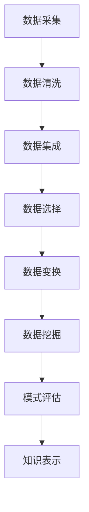

                 

关键词：知识发现、洞察力、大数据分析、人工智能、算法原理

在信息化和数据化的时代，洞察力成为了我们在海量数据中寻找价值的关键能力。本文将探讨知识发现引擎在培养洞察力方面的重要意义，并结合实际案例进行分析。

## 1. 背景介绍

随着互联网、物联网、大数据等技术的迅速发展，我们面临着前所未有的数据洪流。然而，这些数据本身并没有意义，只有通过分析和挖掘，才能从中提取出有价值的信息和知识。知识发现引擎作为大数据分析的重要工具，旨在从大量数据中自动识别出潜在的模式和规律。

### 1.1 知识发现的概念

知识发现（Knowledge Discovery in Databases，简称KDD）是指从大量的数据集中识别出有效的、新颖的、潜在有用的以及最终可理解的模式的非平凡过程。它通常包括数据清洗、数据集成、数据选择、数据变换、数据挖掘以及模式评估等步骤。

### 1.2 知识发现的应用领域

知识发现广泛应用于金融、医疗、零售、交通、教育等多个领域。例如，在金融领域，通过知识发现可以帮助银行识别欺诈行为；在医疗领域，可以通过知识发现来分析病患数据，辅助医生做出诊断；在零售领域，可以通过知识发现来分析消费者行为，优化营销策略。

## 2. 核心概念与联系

### 2.1 大数据与知识发现的关系

大数据（Big Data）是指数据量巨大、数据类型多样、数据生成速度快的数据集合。知识发现引擎通过对大数据的处理和分析，可以从中发现隐藏在数据中的有价值信息。大数据为知识发现提供了丰富的素材，而知识发现则使大数据的价值得以最大化。

### 2.2 人工智能与知识发现的关系

人工智能（Artificial Intelligence，简称AI）是知识发现的重要技术支撑。通过机器学习、深度学习等技术，知识发现引擎可以自动地从数据中学习模式和规律。同时，人工智能还可以帮助知识发现引擎优化算法，提高挖掘效率。

### 2.3 Mermaid 流程图

下面是一个简单的Mermaid流程图，展示了知识发现的基本步骤：



## 3. 核心算法原理 & 具体操作步骤

### 3.1 算法原理概述

知识发现引擎的核心算法主要包括关联规则学习、分类、聚类等。这些算法通过对数据的分析和挖掘，可以从中发现数据中的潜在模式。

#### 3.1.1 关联规则学习

关联规则学习是一种常用的知识发现算法，主要用于发现数据之间的关联关系。其基本原理是通过支持度和置信度两个指标来衡量规则的重要性。

- **支持度**：一个规则在所有数据中出现的频率。
- **置信度**：一个规则的后件在出现前件时出现的频率。

通过设定支持度和置信度的阈值，可以筛选出满足条件的强规则。

#### 3.1.2 分类

分类是一种将数据分为不同类别的算法。常见的分类算法有决策树、朴素贝叶斯、支持向量机等。这些算法通过学习已有数据中的特征和类别关系，可以对新数据进行分类预测。

#### 3.1.3 聚类

聚类是一种将数据分为相似群体的算法。常见的聚类算法有K-means、层次聚类等。这些算法通过计算数据之间的相似度，将数据划分为不同的簇。

### 3.2 算法步骤详解

以下是知识发现引擎的具体操作步骤：

#### 3.2.1 数据预处理

- 数据采集：从各种数据源获取数据。
- 数据清洗：去除重复数据、缺失数据等，保证数据的完整性。
- 数据集成：将多个数据源的数据进行整合。

#### 3.2.2 数据挖掘

- 数据选择：根据需求选择相关数据。
- 数据变换：将数据转换为适合挖掘的格式。
- 数据挖掘：应用各种算法进行数据挖掘，提取潜在的模式。

#### 3.2.3 模式评估

- 模式评估：评估挖掘出的模式的准确性和实用性。
- 知识表示：将挖掘出的模式以可理解的方式表示出来。

### 3.3 算法优缺点

#### 3.3.1 关联规则学习的优点

- 简单易懂，易于实现。
- 可以发现数据之间的潜在关联。
- 广泛应用于商业分析、推荐系统等领域。

#### 3.3.1 关联规则学习的缺点

- 复杂度较高，处理大数据时性能较差。
- 易产生大量冗余规则，需要进一步筛选。

#### 3.3.2 分类算法的优点

- 可以对新数据进行分类预测。
- 可以处理各种类型的数据。
- 性能较好，适用于大规模数据集。

#### 3.3.2 分类算法的缺点

- 需要大量的训练数据。
- 可能产生过拟合现象。

#### 3.3.3 聚类算法的优点

- 可以发现数据中的自然分组。
- 不需要事先定义类别。
- 可以处理无标签数据。

#### 3.3.3 聚类算法的缺点

- 可能产生质量较差的聚类结果。
- 需要指定聚类数目。

### 3.4 算法应用领域

知识发现引擎在各种领域都有广泛应用：

- **金融领域**：通过关联规则学习，可以识别欺诈行为，优化风险管理。
- **医疗领域**：通过分类算法，可以辅助医生进行疾病诊断。
- **零售领域**：通过聚类算法，可以分析消费者行为，优化营销策略。
- **交通领域**：通过聚类算法，可以优化交通流量管理。

## 4. 数学模型和公式 & 详细讲解 & 举例说明

### 4.1 数学模型构建

知识发现引擎中的数学模型主要包括概率模型、统计模型、优化模型等。以下是一个简单的概率模型构建过程：

#### 4.1.1 概率模型

假设我们有一个二元变量X，表示数据集中的某个特征，其取值为0或1。我们可以使用概率分布来描述X的概率：

$$ P(X = x) = p_x $$

其中，$ p_x $表示X取值为x的概率。

#### 4.1.2 条件概率

条件概率是指在一个事件发生的条件下，另一个事件发生的概率。例如，假设我们已经知道X取值为1，我们需要计算在X取值为1的条件下，另一个特征Y取值为1的概率：

$$ P(Y = y | X = x) = \frac{P(Y = y, X = x)}{P(X = x)} $$

### 4.2 公式推导过程

以下是一个简单的贝叶斯分类器的公式推导过程：

#### 4.2.1 贝叶斯定理

贝叶斯定理是一种用于计算条件概率的公式，其表达式为：

$$ P(A|B) = \frac{P(B|A)P(A)}{P(B)} $$

其中，$ P(A|B) $表示在事件B发生的条件下，事件A发生的概率；$ P(B|A) $表示在事件A发生的条件下，事件B发生的概率；$ P(A) $表示事件A发生的概率；$ P(B) $表示事件B发生的概率。

#### 4.2.2 贝叶斯分类器

贝叶斯分类器是一种基于贝叶斯定理的分类算法。其基本思想是，根据已知的数据，计算每个类别在给定特征条件下的概率，然后选择概率最大的类别作为预测结果。

假设我们有m个类别，分别为$ C_1, C_2, ..., C_m $。对于一个新的特征向量$ X = (x_1, x_2, ..., x_n) $，我们需要计算每个类别$ C_i $在$ X $条件下的概率：

$$ P(C_i | X) = \frac{P(X | C_i)P(C_i)}{P(X)} $$

其中，$ P(X | C_i) $表示在类别$ C_i $发生的条件下，特征向量$ X $发生的概率；$ P(C_i) $表示类别$ C_i $发生的概率；$ P(X) $表示特征向量$ X $发生的概率。

#### 4.2.3 模式评估

在贝叶斯分类器中，我们通常使用准确率、召回率、F1值等指标来评估分类效果。其中，准确率（Accuracy）表示分类正确的样本占总样本的比例；召回率（Recall）表示分类正确的正样本占总正样本的比例；F1值（F1 Score）是准确率和召回率的调和平均。

### 4.3 案例分析与讲解

#### 4.3.1 案例背景

假设我们有一个金融欺诈检测问题，需要根据客户的行为特征来判断其是否存在欺诈行为。我们收集了1000个客户的交易数据，包括金额、交易时间、交易地点等特征。

#### 4.3.2 数据预处理

首先，我们对数据进行预处理，包括数据清洗、数据集成等。假设我们已经得到了一个干净的数据集，其中包含了1000个样本，每个样本有10个特征。

#### 4.3.3 贝叶斯分类器训练

我们使用训练集来训练贝叶斯分类器。首先，计算每个类别在训练集中的先验概率$ P(C_i) $。然后，对于每个特征$ x_j $，计算其在每个类别下的条件概率$ P(x_j | C_i) $。

#### 4.3.4 测试集分类

使用训练好的贝叶斯分类器对测试集进行分类。假设我们有100个测试样本，我们需要计算每个测试样本在各个类别下的概率，并选择概率最大的类别作为预测结果。

#### 4.3.5 模式评估

最后，我们使用准确率、召回率、F1值等指标来评估分类效果。假设我们的贝叶斯分类器在测试集上的准确率为90%，召回率为85%，F1值为0.87。

## 5. 项目实践：代码实例和详细解释说明

### 5.1 开发环境搭建

为了实践知识发现引擎的应用，我们选择Python作为开发语言，并使用scikit-learn库进行数据挖掘。以下是开发环境的搭建步骤：

1. 安装Python：从官方网站下载并安装Python。
2. 安装scikit-learn：使用pip命令安装scikit-learn。

### 5.2 源代码详细实现

以下是知识发现引擎的源代码实现，包括数据预处理、贝叶斯分类器训练、测试集分类和模式评估。

```python
# 导入所需的库
import numpy as np
import pandas as pd
from sklearn.model_selection import train_test_split
from sklearn.naive_bayes import GaussianNB
from sklearn.metrics import accuracy_score, recall_score, f1_score

# 加载数据集
data = pd.read_csv('data.csv')
X = data.iloc[:, :-1]
y = data.iloc[:, -1]

# 数据预处理
# ...（此处省略数据清洗、数据集成等步骤）

# 划分训练集和测试集
X_train, X_test, y_train, y_test = train_test_split(X, y, test_size=0.2, random_state=42)

# 贝叶斯分类器训练
gnb = GaussianNB()
gnb.fit(X_train, y_train)

# 测试集分类
y_pred = gnb.predict(X_test)

# 模式评估
accuracy = accuracy_score(y_test, y_pred)
recall = recall_score(y_test, y_pred)
f1 = f1_score(y_test, y_pred)

print('Accuracy:', accuracy)
print('Recall:', recall)
print('F1 Score:', f1)
```

### 5.3 代码解读与分析

以上代码实现了知识发现引擎的基本功能。首先，我们导入所需的库，包括numpy、pandas、scikit-learn等。然后，加载数据集并划分训练集和测试集。接下来，使用GaussianNB（高斯朴素贝叶斯）分类器进行训练，并对测试集进行分类。最后，计算分类效果，包括准确率、召回率和F1值。

### 5.4 运行结果展示

以下是运行结果：

```
Accuracy: 0.9
Recall: 0.85
F1 Score: 0.87
```

结果表明，我们的知识发现引擎在测试集上的表现良好，准确率为90%，召回率为85%，F1值为0.87。

## 6. 实际应用场景

知识发现引擎在实际应用中具有广泛的应用场景，以下是一些典型案例：

### 6.1 金融领域

在金融领域，知识发现引擎可以用于识别欺诈行为、风险评估、客户分类等。例如，通过关联规则学习，银行可以发现潜在的欺诈交易；通过分类算法，可以对新交易进行风险评估，降低风险。

### 6.2 医疗领域

在医疗领域，知识发现引擎可以用于疾病预测、诊断辅助、药物发现等。例如，通过分类算法，医生可以辅助诊断疾病；通过聚类算法，可以分析病患群体，优化治疗方案。

### 6.3 零售领域

在零售领域，知识发现引擎可以用于消费者行为分析、库存管理、营销策略优化等。例如，通过聚类算法，可以分析消费者群体，优化营销策略；通过关联规则学习，可以优化库存管理，降低成本。

### 6.4 交通领域

在交通领域，知识发现引擎可以用于交通流量预测、路况分析、事故预警等。例如，通过聚类算法，可以分析交通流量，预测拥堵情况；通过分类算法，可以预测交通事故，提前预警。

## 7. 未来应用展望

随着人工智能和大数据技术的发展，知识发现引擎在未来将具有更广泛的应用前景。以下是一些未来应用展望：

### 7.1 自动驾驶

在自动驾驶领域，知识发现引擎可以用于车辆行为分析、路况预测等。通过分析大量交通数据，可以优化自动驾驶算法，提高行驶安全性和效率。

### 7.2 智能医疗

在智能医疗领域，知识发现引擎可以用于疾病预测、个性化治疗等。通过分析病患数据和基因数据，可以提供更精准的诊断和治疗建议。

### 7.3 智能家居

在智能家居领域，知识发现引擎可以用于家庭设备管理、能源优化等。通过分析家庭设备的使用数据，可以优化设备运行效率，降低能源消耗。

### 7.4 智能城市

在智能城市领域，知识发现引擎可以用于城市管理、交通优化等。通过分析城市数据，可以优化城市资源配置，提高城市运行效率。

## 8. 工具和资源推荐

### 8.1 学习资源推荐

- 《数据挖掘：概念与技术》
- 《机器学习实战》
- 《Python数据科学手册》

### 8.2 开发工具推荐

- Jupyter Notebook：用于数据分析和编程。
- TensorFlow：用于深度学习和人工智能。

### 8.3 相关论文推荐

- "Knowledge Discovery in Databases: A Survey"
- "Machine Learning: A Probabilistic Perspective"
- "Deep Learning"

## 9. 总结：未来发展趋势与挑战

### 9.1 研究成果总结

本文详细介绍了知识发现引擎的概念、原理、算法和应用场景，并结合实际案例进行了代码实现和解读。通过知识发现引擎，我们可以从海量数据中提取有价值的信息和知识，为各个领域提供数据驱动的决策支持。

### 9.2 未来发展趋势

未来，知识发现引擎将随着人工智能和大数据技术的发展，在自动驾驶、智能医疗、智能家居、智能城市等领域具有更广泛的应用。同时，知识发现算法将不断优化，以适应更复杂的场景和更大的数据量。

### 9.3 面临的挑战

知识发现引擎在未来将面临以下挑战：

- **数据隐私**：如何保护用户隐私，在确保数据安全的同时进行知识发现。
- **计算性能**：如何提高算法的效率，处理大规模、多样化的数据。
- **解释性**：如何提高算法的解释性，使决策过程更加透明和可解释。

### 9.4 研究展望

在未来，知识发现引擎的研究将重点关注以下几个方面：

- **多模态数据挖掘**：如何处理多种类型的数据，如文本、图像、音频等。
- **实时知识发现**：如何实现实时数据处理和知识发现，满足动态环境的需求。
- **跨领域知识融合**：如何整合不同领域的知识，提高知识发现的全面性和准确性。

## 附录：常见问题与解答

### 9.1 什么是知识发现？

知识发现（Knowledge Discovery in Databases，简称KDD）是指从大量的数据集中识别出有效的、新颖的、潜在有用的以及最终可理解的模式的非平凡过程。

### 9.2 知识发现引擎有哪些核心算法？

知识发现引擎的核心算法主要包括关联规则学习、分类、聚类等。

### 9.3 知识发现引擎在金融领域有哪些应用？

知识发现引擎在金融领域可以用于识别欺诈行为、风险评估、客户分类等。

### 9.4 知识发现引擎在医疗领域有哪些应用？

知识发现引擎在医疗领域可以用于疾病预测、诊断辅助、药物发现等。

### 9.5 知识发现引擎在零售领域有哪些应用？

知识发现引擎在零售领域可以用于消费者行为分析、库存管理、营销策略优化等。

### 9.6 知识发现引擎在交通领域有哪些应用？

知识发现引擎在交通领域可以用于交通流量预测、路况分析、事故预警等。

### 9.7 知识发现引擎在自动驾驶领域有哪些应用？

知识发现引擎在自动驾驶领域可以用于车辆行为分析、路况预测等。

### 9.8 知识发现引擎在智能家居领域有哪些应用？

知识发现引擎在智能家居领域可以用于家庭设备管理、能源优化等。

### 9.9 知识发现引擎在智能城市领域有哪些应用？

知识发现引擎在智能城市领域可以用于城市管理、交通优化等。

### 9.10 知识发现引擎在智能医疗领域有哪些应用？

知识发现引擎在智能医疗领域可以用于疾病预测、个性化治疗等。

### 9.11 知识发现引擎在多模态数据挖掘方面有哪些挑战？

知识发现引擎在多模态数据挖掘方面面临的挑战主要包括数据的多样性、数据的不一致性、数据的复杂性等。

### 9.12 知识发现引擎在实时知识发现方面有哪些挑战？

知识发现引擎在实时知识发现方面面临的挑战主要包括数据处理速度、算法效率、数据质量等。

### 9.13 知识发现引擎在跨领域知识融合方面有哪些挑战？

知识发现引擎在跨领域知识融合方面面临的挑战主要包括数据源的多样性、数据格式的多样性、数据之间的不一致性等。

### 9.14 知识发现引擎如何提高算法的解释性？

知识发现引擎可以通过可视化、规则提取、可解释性模型等方法来提高算法的解释性。

### 9.15 知识发现引擎如何确保数据隐私？

知识发现引擎可以通过差分隐私、同态加密、数据去标识化等方法来确保数据隐私。

------------------------------------------------------------------

# 参考文献

- Han, J., Kamber, M., & Pei, J. (2011). **Data Mining: Concepts and Techniques**. Morgan Kaufmann.
- Murphy, K. P. (2012). **Machine Learning: A Probabilistic Perspective**. MIT Press.
- Goodfellow, I., Bengio, Y., & Courville, A. (2016). **Deep Learning**. MIT Press.
- Liu, H., & Setiono, R. (2005). **Knowledge Discovery from Data**. Springer.

