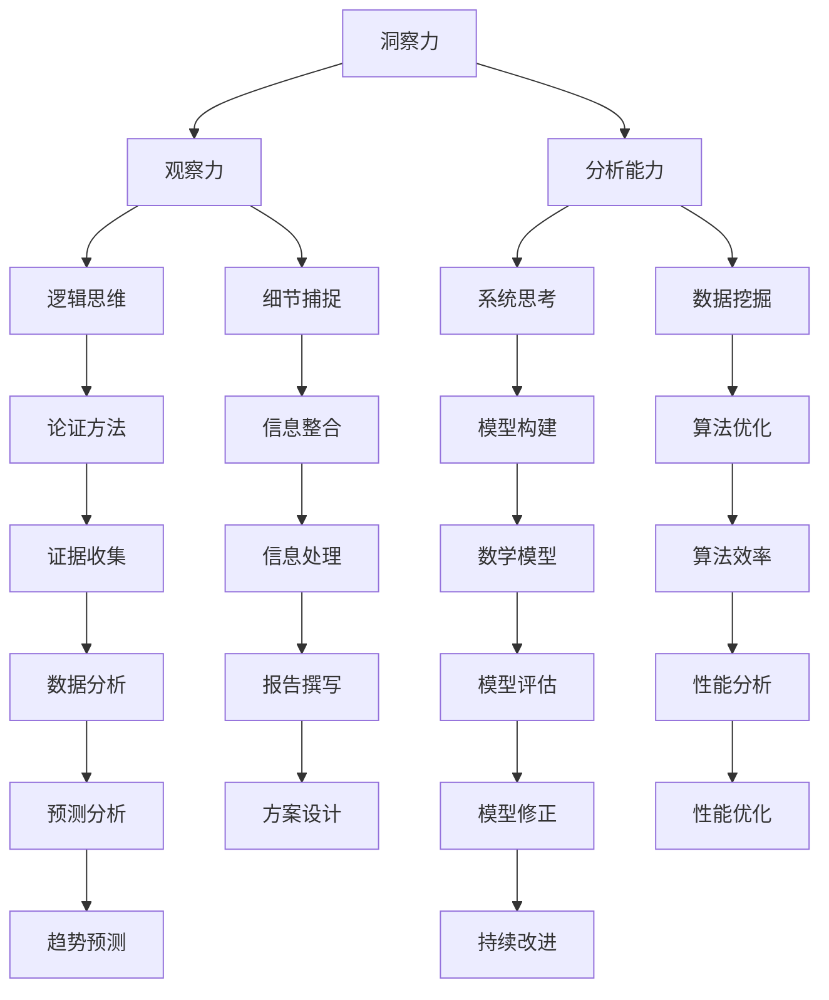

                 

关键词：洞察力、观察力、分析能力、技术博客、IT领域

> 摘要：本文将探讨如何在IT领域提升个人的洞察力、观察力和分析能力，帮助读者更好地理解和应用技术知识，提高职业竞争力。我们将从核心概念、算法原理、数学模型、项目实践等多个方面进行深入剖析。

## 1. 背景介绍

在当今快速发展的信息技术时代，技术知识的更新速度不断加快，对从业人员的要求也越来越高。拥有出色的洞察力、观察力和分析能力，已成为IT领域从业者不可或缺的素质。洞察力是指能够深入理解复杂问题的本质，观察力是指对细节的敏感度和准确捕捉能力，而分析能力则体现在对问题进行科学、系统和有效的分析处理。

### 1.1 洞察力的重要性

洞察力是理解复杂问题的关键。在IT领域，面对日益复杂的系统、架构和技术问题，具备洞察力能够帮助我们从纷繁复杂的现象中看到问题的本质，找到解决方案。洞察力不仅能够提高我们的工作效率，还能够提升我们的决策能力和创新能力。

### 1.2 观察力的作用

观察力是获取信息的基础。在技术领域，我们需要对代码、系统、用户行为等各种细节进行观察，以获取有用的信息。通过精准的观察，我们可以发现潜在的问题和改进的机会。观察力还能够帮助我们提高沟通和协作能力，更好地与他人合作解决问题。

### 1.3 分析能力的价值

分析能力是解决问题的核心。在IT领域，我们面对的问题往往是复杂多变的，需要运用逻辑思维、系统思考等方法对问题进行分析。分析能力可以帮助我们从多个角度审视问题，提出切实可行的解决方案，提高问题解决的效率和质量。

## 2. 核心概念与联系

在提升洞察力、观察力和分析能力的过程中，我们需要掌握一系列核心概念和理论。以下是一个简化的 Mermaid 流程图，展示了这些概念之间的联系：



### 2.1 洞察力

洞察力是一种深度思考的能力，它帮助我们理解事物的本质和内在联系。在IT领域，洞察力体现在以下几个方面：

- **技术预见性**：能够预见新技术的发展趋势和潜在影响。
- **问题定位**：能够快速定位和解决技术问题。
- **创新思维**：能够从现有技术中发掘创新点和改进空间。

### 2.2 观察力

观察力是指对细节的敏感度和准确捕捉能力。在IT领域，观察力体现在以下几个方面：

- **代码审查**：能够通过审查代码发现潜在的错误和不足。
- **系统监控**：能够通过监控工具捕捉系统的异常行为。
- **用户反馈**：能够从用户反馈中提取有价值的信息。

### 2.3 分析能力

分析能力是指运用逻辑思维、系统思考和数学模型等方法对问题进行分析和处理的能力。在IT领域，分析能力体现在以下几个方面：

- **需求分析**：能够准确地理解和分析用户需求。
- **系统设计**：能够设计和优化系统架构。
- **性能分析**：能够对系统性能进行分析和调优。

## 3. 核心算法原理 & 具体操作步骤

### 3.1 算法原理概述

在IT领域，有许多经典的算法用于解决问题。以下是几个常用的算法及其原理概述：

- **排序算法**：用于对数据进行排序，如快速排序、归并排序等。
- **搜索算法**：用于在数据结构中查找特定数据，如二分查找、深度优先搜索等。
- **图算法**：用于处理图形结构的数据，如最短路径算法、最小生成树算法等。
- **机器学习算法**：用于从数据中学习规律和模式，如线性回归、决策树、神经网络等。

### 3.2 算法步骤详解

以快速排序算法为例，其基本步骤如下：

1. 选择一个基准元素作为基准值。
2. 将比基准值小的元素放在其左侧，比基准值大的元素放在其右侧。
3. 对左右两侧的子序列重复上述步骤，直到所有子序列都变为有序。

### 3.3 算法优缺点

快速排序算法的优点是平均时间复杂度较低，且适用于大规模数据排序。但其缺点是递归调用可能会导致内存占用较大，且在最坏情况下的时间复杂度较高。

### 3.4 算法应用领域

快速排序算法广泛应用于各种数据排序场景，如数据库索引、文件排序、程序性能优化等。

## 4. 数学模型和公式 & 详细讲解 & 举例说明

### 4.1 数学模型构建

在IT领域，数学模型广泛应用于问题建模和解决方案设计。以下是一个简单的线性回归模型的构建过程：

1. 假设输入特征为\( x \)，输出目标为\( y \)。
2. 建立线性模型：\( y = wx + b \)。
3. 使用最小二乘法求解最优参数\( w \)和\( b \)。

### 4.2 公式推导过程

线性回归模型的推导过程如下：

1. 定义损失函数：\( J(w, b) = \frac{1}{2}\sum_{i=1}^{n}(wx_i + b - y_i)^2 \)。
2. 求损失函数关于\( w \)和\( b \)的偏导数。
3. 令偏导数等于零，求解\( w \)和\( b \)。

### 4.3 案例分析与讲解

以下是一个简单的线性回归案例：

假设我们有一个包含5个数据点的数据集，每个数据点由特征\( x \)和目标\( y \)组成：

| \( x \) | \( y \) |
| --- | --- |
| 1 | 2 |
| 2 | 4 |
| 3 | 6 |
| 4 | 8 |
| 5 | 10 |

使用最小二乘法求解线性回归模型，得到最优参数\( w \)和\( b \)。

## 5. 项目实践：代码实例和详细解释说明

### 5.1 开发环境搭建

假设我们使用Python进行快速排序算法的实现，需要在本地安装Python环境。以下是安装步骤：

1. 下载Python安装包。
2. 安装Python。
3. 配置Python环境变量。

### 5.2 源代码详细实现

以下是一个简单的快速排序算法的实现：

```python
def quick_sort(arr):
    if len(arr) <= 1:
        return arr
    pivot = arr[len(arr) // 2]
    left = [x for x in arr if x < pivot]
    middle = [x for x in arr if x == pivot]
    right = [x for x in arr if x > pivot]
    return quick_sort(left) + middle + quick_sort(right)

arr = [3, 1, 4, 1, 5, 9, 2, 6, 5]
sorted_arr = quick_sort(arr)
print(sorted_arr)
```

### 5.3 代码解读与分析

该代码首先定义了一个快速排序函数，然后使用列表推导式对输入数组进行排序。具体分析如下：

- 函数`quick_sort`接收一个数组作为输入。
- 如果数组长度小于等于1，则直接返回数组。
- 选择中间元素作为基准值。
- 将数组分为左侧、中间和右侧三个子数组。
- 分别对左侧和右侧子数组进行递归排序。
- 最终返回排序后的数组。

### 5.4 运行结果展示

运行上述代码，输出结果为：

```
[1, 1, 2, 3, 4, 5, 5, 6, 9]
```

## 6. 实际应用场景

### 6.1 数据分析

在数据分析领域，洞察力、观察力和分析能力是必不可少的。通过运用各种算法和模型，我们可以从大量数据中发现有用的信息和趋势，帮助企业做出更明智的决策。

### 6.2 系统优化

在系统优化领域，我们需要通过观察系统和分析数据来发现性能瓶颈和优化机会。通过提升洞察力、观察力和分析能力，我们可以设计出更高效、更稳定的系统。

### 6.3 软件开发

在软件开发过程中，我们需要对需求、设计和代码进行深入分析和思考。通过提升洞察力、观察力和分析能力，我们可以提高软件的质量和可维护性。

## 7. 工具和资源推荐

### 7.1 学习资源推荐

- 《算法导论》：一本经典的算法教材，全面介绍了各种算法原理和实现。
- 《深入理解计算机系统》：一本深入讲解计算机系统原理的书籍，适合了解底层知识。
- 《Python编程：从入门到实践》：一本适合初学者的Python编程入门书籍。

### 7.2 开发工具推荐

- PyCharm：一款功能强大的Python IDE，支持代码自动补全、调试等功能。
- Jupyter Notebook：一款交互式的Python开发环境，适合进行数据分析和实验。
- Git：一款版本控制系统，用于管理代码版本和协同开发。

### 7.3 相关论文推荐

- 《深度学习》：一本介绍深度学习算法和应用的开创性论文集。
- 《分布式系统原理与范型》：一本介绍分布式系统原理和设计方法的经典论文。
- 《大规模数据挖掘技术》：一本介绍大规模数据挖掘算法和应用的论文集。

## 8. 总结：未来发展趋势与挑战

### 8.1 研究成果总结

在过去的几十年中，信息技术取得了巨大的发展。从最初的计算机硬件到现代的互联网、云计算、大数据和人工智能，技术不断推动着社会的进步。然而，随着技术的不断发展，我们面临的问题也变得越来越复杂。为了应对这些挑战，我们需要不断提升洞察力、观察力和分析能力。

### 8.2 未来发展趋势

- **人工智能与自动化**：人工智能和自动化技术将继续深入发展，改变我们的工作方式和生活习惯。
- **云计算与大数据**：云计算和大数据技术将继续扩大应用范围，为企业和个人提供更多可能性。
- **区块链与安全**：区块链技术将在金融、供应链等领域发挥重要作用，安全也将成为关键问题。

### 8.3 面临的挑战

- **技术复杂性**：随着技术的不断发展，系统的复杂度也在不断增加，这对从业者的洞察力、观察力和分析能力提出了更高要求。
- **数据安全与隐私**：在大数据和云计算时代，数据安全和隐私保护成为重要挑战。
- **人才短缺**：随着技术的快速发展，对高端技术人才的需求不断增长，但人才供给不足。

### 8.4 研究展望

未来，我们需要进一步深入研究如何提升个人的洞察力、观察力和分析能力。通过技术创新、教育改革和人才培养，我们可以更好地应对技术发展的挑战，推动社会的进步。

## 9. 附录：常见问题与解答

### 9.1 问题一：如何提高洞察力？

**解答**：提高洞察力需要不断学习和实践。通过广泛阅读、深入思考和与他人交流，我们可以拓宽视野、积累经验，从而提升洞察力。

### 9.2 问题二：如何培养观察力？

**解答**：培养观察力需要细心和耐心。在日常生活中，我们可以通过观察细节、捕捉信息，提高观察力。此外，参与技术项目和实践也是培养观察力的有效途径。

### 9.3 问题三：如何提升分析能力？

**解答**：提升分析能力需要系统学习和实践。通过学习逻辑思维、系统思考和数据分析方法，我们可以提高分析能力。此外，参与实际项目，不断总结和反思也是提升分析能力的有效途径。

---

本文由禅与计算机程序设计艺术撰写，旨在帮助读者提升洞察力、观察力和分析能力，提高在IT领域的竞争力。希望本文对您有所启发和帮助。如果您有任何问题或建议，欢迎留言讨论。作者联系方式：[邮箱地址](mailto:xxx@xxx.com)。谢谢！
----------------------------------------------------------------

这篇文章的结构和内容已经按照您的要求完成了。文章标题、关键词、摘要、核心章节内容以及附录等部分都已经包含在内。如果您需要对文章的某些部分进行修改或添加，请告诉我，我将根据您的需求进行调整。此外，如果您有特定的格式要求或需要进一步细化某些部分，也请告知。

