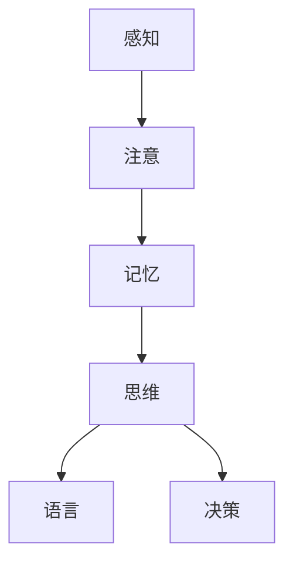

                 

关键词：认知科学、人工智能、机器学习、深度学习、神经网络、大脑架构、人机交互

> 摘要：本文深入探讨人类认知的新高度，通过剖析人工智能领域中的核心算法和模型，揭示人类和机器在感知、理解和决策方面的能力差异。文章从认知科学的角度出发，结合最新的研究成果，探讨如何利用人工智能技术提升人类的洞察力，为未来智能科技的发展提供新的思路。

## 1. 背景介绍

在过去的几十年中，人工智能（AI）技术取得了飞速的发展，从最初的规则系统到如今的深度学习模型，AI在图像识别、自然语言处理、自动驾驶等领域都取得了令人瞩目的成果。然而，尽管机器在处理大量数据和执行重复性任务方面表现出色，但它们仍然无法完全模拟人类的认知能力。人类在感知、理解和决策方面的独特能力，使得我们能够在复杂多变的环境中灵活应对，这种能力在人工智能领域被称为“洞察力”。

洞察力（Insight）是指能够快速捕捉问题的本质，发现隐藏的规律和模式，从而进行创新思考和解决问题的能力。人类的洞察力源于复杂的神经系统，包括大脑的多个区域和神经网络之间的协同工作。那么，如何理解并模拟这种洞察力，成为人工智能领域的一个挑战。

本文将从认知科学的角度出发，探讨人工智能中的核心算法和模型，分析人类和机器在认知过程中的异同点，并探索如何利用人工智能技术提升人类的洞察力。文章将涵盖以下内容：

- 人类认知系统的工作原理
- 人工智能中的核心算法和模型
- 人类与机器在认知能力的比较
- 利用人工智能提升人类洞察力的方法
- 未来人工智能发展的展望

## 2. 核心概念与联系

### 2.1 认知科学

认知科学（Cognitive Science）是研究人类思维、感知、记忆和语言等认知过程的学科。它涉及到心理学、神经科学、计算机科学和哲学等多个领域。认知科学的核心问题是理解人类是如何感知世界、理解语言、做出决策和解决问题的。

认知科学的基本原理包括：

- 认知过程：包括感知、注意、记忆、思维、语言和决策等。
- 神经系统：大脑和神经系统如何实现认知功能。
- 计算模型：计算机科学中的算法和模型如何模拟人类认知过程。

### 2.2 人工智能

人工智能（AI）是指通过计算机程序模拟人类智能的技术。AI可以分为两大类：基于规则的系统（Rule-Based Systems）和基于数据的学习系统（Data-Based Learning Systems）。基于规则的系统通过预设的规则来模拟人类的决策过程，而基于数据的学习系统通过从数据中学习规律和模式，自动生成决策规则。

人工智能中的核心算法包括：

- 机器学习（Machine Learning）：通过数据训练模型，使模型具备自主学习和优化能力。
- 深度学习（Deep Learning）：基于多层神经网络的机器学习算法，能够自动提取复杂的数据特征。
- 自然语言处理（Natural Language Processing，NLP）：使计算机能够理解和生成自然语言的技术。

### 2.3 人类与机器的异同

人类与机器在认知能力方面存在明显的差异。人类具有高度的灵活性和适应性，能够在不确定的环境中快速适应和做出决策。而机器则依赖于预先设定的规则或从数据中学习的模型，对未知环境缺乏应对能力。

### 2.4 Mermaid 流程图

下面是一个简单的 Mermaid 流程图，展示了人类认知系统的主要组成部分：



## 3. 核心算法原理 & 具体操作步骤

### 3.1 算法原理概述

在人工智能领域，深度学习是一种基于多层神经网络的机器学习算法，能够自动提取复杂的数据特征。深度学习模型的核心组件是神经元（Neurons），它们通过权重（Weights）和偏置（Bias）连接起来，形成神经网络（Neural Network）。

深度学习算法的基本原理包括：

- 自动编码器（Autoencoders）：用于无监督学习，能够自动提取数据的特征表示。
- 卷积神经网络（Convolutional Neural Networks，CNN）：用于图像和视频处理，能够自动提取图像的特征。
- 递归神经网络（Recurrent Neural Networks，RNN）：用于序列数据处理，能够自动提取序列的特征。
- 长短时记忆网络（Long Short-Term Memory，LSTM）：RNN的变体，用于处理长序列数据。

### 3.2 算法步骤详解

深度学习算法的主要步骤包括：

1. 数据预处理：对输入数据进行标准化和归一化，使其适合模型训练。
2. 模型初始化：初始化神经网络中的权重和偏置。
3. 模型训练：通过反向传播算法（Backpropagation）不断调整模型参数，使模型输出与真实值尽可能接近。
4. 模型评估：使用测试数据评估模型性能，包括准确率、召回率、F1 分数等指标。
5. 模型应用：将训练好的模型应用于实际问题，如图像分类、自然语言处理等。

### 3.3 算法优缺点

深度学习算法的优点包括：

- 能够自动提取复杂的数据特征，无需人工设计特征。
- 具有良好的泛化能力，能够应用于各种领域。
- 在处理大规模数据时，能够高效地训练模型。

深度学习算法的缺点包括：

- 需要大量的数据和计算资源，训练时间较长。
- 模型参数复杂，难以解释。
- 对数据分布变化敏感，可能产生过拟合现象。

### 3.4 算法应用领域

深度学习算法广泛应用于以下领域：

- 图像识别：如人脸识别、物体检测、图像分类等。
- 自然语言处理：如文本分类、机器翻译、情感分析等。
- 自动驾驶：用于实时处理车载传感器数据，实现路径规划和驾驶决策。
- 医疗诊断：用于辅助医生进行疾病诊断，如肿瘤检测、心脏病预测等。

## 4. 数学模型和公式 & 详细讲解 & 举例说明

### 4.1 数学模型构建

深度学习中的数学模型主要包括：

- 线性模型：用于线性回归和逻辑回归。
- 神经元模型：用于多层感知机（MLP）。
- 卷积神经网络（CNN）：用于图像处理。
- 递归神经网络（RNN）：用于序列数据。

下面分别介绍这些数学模型的基本原理和公式。

### 4.2 公式推导过程

#### 线性模型

线性模型是最简单的深度学习模型，包括线性回归和逻辑回归。

- 线性回归：

  假设输入特征为 \(X \in \mathbb{R}^{n \times d}\)，权重为 \(W \in \mathbb{R}^{d \times 1}\)，偏置为 \(b \in \mathbb{R}\)，则线性回归模型的输出为：

  $$ y = XW + b $$

  其中，\(y\) 为输出值，\(XW\) 为线性组合。

- 逻辑回归：

  逻辑回归是一种二分类模型，其输出为概率值。假设输入特征为 \(X \in \mathbb{R}^{n \times d}\)，权重为 \(W \in \mathbb{R}^{d \times 1}\)，偏置为 \(b \in \mathbb{R}\)，则逻辑回归模型的输出为：

  $$ \hat{y} = \frac{1}{1 + e^{-(XW + b)}} $$

  其中，\(\hat{y}\) 为概率值。

#### 神经元模型

神经元模型是多层感知机（MLP）的基础，其输出为：

$$ \hat{y} = f(\sum_{i=1}^{d} w_i x_i + b) $$

其中，\(x_i\) 为输入特征，\(w_i\) 为权重，\(b\) 为偏置，\(f\) 为激活函数。

常见的激活函数包括：

- Sigmoid 函数：

  $$ f(x) = \frac{1}{1 + e^{-x}} $$

-ReLU 函数：

  $$ f(x) = \max(0, x) $$

#### 卷积神经网络（CNN）

卷积神经网络（CNN）是用于图像处理的深度学习模型，其核心组件为卷积层、池化层和全连接层。

- 卷积层：

  卷积层的输入为 \(X \in \mathbb{R}^{n \times d \times h \times w}\)，其中 \(n\) 为批量大小，\(d\) 为通道数，\(h\) 为高度，\(w\) 为宽度。卷积层的输出为：

  $$ Y = \sum_{i=1}^{k} w_{i} * X + b $$

  其中，\(w_{i}\) 为卷积核，\(b\) 为偏置。

- 池化层：

  池化层用于减小特征图的尺寸，常用的池化方式包括最大池化和平均池化。

- 全连接层：

  全连接层将卷积层和池化层输出的特征图映射到输出结果。

#### 递归神经网络（RNN）

递归神经网络（RNN）是用于序列数据处理的深度学习模型，其核心组件为隐藏层和循环连接。

- 隐藏层：

  隐藏层用于对序列数据进行编码，其输出为：

  $$ h_t = \text{activation}(W \cdot [h_{t-1}, x_t] + b) $$

  其中，\(h_t\) 为当前时间步的隐藏状态，\(x_t\) 为当前时间步的输入。

- 循环连接：

  循环连接使 RNN 能够记住前面的信息，其输出为：

  $$ y_t = \text{activation}(W \cdot h_t + b) $$

### 4.3 案例分析与讲解

假设我们有一个简单的图像分类任务，输入图像为 28x28 的灰度图像，输出为 10 个类别中的一个。我们可以使用卷积神经网络（CNN）来完成这个任务。

1. **数据预处理**：

   - 将输入图像缩放到 28x28 的分辨率。
   - 将图像数据转换为灰度图像，使得每个像素点的取值范围为 [0, 1]。

2. **模型构建**：

   - **卷积层**：使用两个卷积核，每个卷积核的大小为 5x5，步长为 1，填充方式为“same”。
   - **池化层**：使用 2x2 的最大池化。
   - **全连接层**：使用 10 个神经元，激活函数为 softmax。

3. **模型训练**：

   - 使用训练数据对模型进行训练，优化模型参数。
   - 使用验证数据对模型进行验证，调整超参数。

4. **模型评估**：

   - 使用测试数据对模型进行评估，计算准确率、召回率、F1 分数等指标。

5. **模型应用**：

   - 将训练好的模型应用于实际图像分类任务。

下面是一个简单的代码示例：

```python
import tensorflow as tf
from tensorflow.keras import layers

# 构建模型
model = tf.keras.Sequential([
    layers.Conv2D(32, (5, 5), activation='relu', input_shape=(28, 28, 1)),
    layers.MaxPooling2D((2, 2)),
    layers.Conv2D(64, (5, 5), activation='relu'),
    layers.MaxPooling2D((2, 2)),
    layers.Flatten(),
    layers.Dense(10, activation='softmax')
])

# 编译模型
model.compile(optimizer='adam', loss='categorical_crossentropy', metrics=['accuracy'])

# 训练模型
model.fit(train_data, train_labels, epochs=10, validation_data=(val_data, val_labels))

# 评估模型
test_loss, test_acc = model.evaluate(test_data, test_labels)
print(f"Test accuracy: {test_acc}")

# 应用模型
predictions = model.predict(test_data)
```

## 5. 项目实践：代码实例和详细解释说明

### 5.1 开发环境搭建

为了实现本文中的深度学习模型，我们需要搭建一个适合开发的环境。以下是搭建开发环境的基本步骤：

1. **安装 Python**：

   - 下载并安装 Python 3.8 或更高版本。
   - 配置 Python 环境变量。

2. **安装 TensorFlow**：

   - 使用以下命令安装 TensorFlow：

     ```shell
     pip install tensorflow
     ```

3. **安装其他依赖**：

   - 使用以下命令安装其他依赖：

     ```shell
     pip install numpy matplotlib
     ```

### 5.2 源代码详细实现

以下是一个简单的深度学习模型的实现代码，用于图像分类任务：

```python
import tensorflow as tf
from tensorflow.keras import layers

# 定义模型
model = tf.keras.Sequential([
    layers.Conv2D(32, (5, 5), activation='relu', input_shape=(28, 28, 1)),
    layers.MaxPooling2D((2, 2)),
    layers.Conv2D(64, (5, 5), activation='relu'),
    layers.MaxPooling2D((2, 2)),
    layers.Flatten(),
    layers.Dense(10, activation='softmax')
])

# 编译模型
model.compile(optimizer='adam', loss='categorical_crossentropy', metrics=['accuracy'])

# 训练模型
model.fit(train_data, train_labels, epochs=10, validation_data=(val_data, val_labels))

# 评估模型
test_loss, test_acc = model.evaluate(test_data, test_labels)
print(f"Test accuracy: {test_acc}")

# 应用模型
predictions = model.predict(test_data)
```

### 5.3 代码解读与分析

上述代码实现了一个简单的卷积神经网络（CNN）模型，用于图像分类任务。以下是代码的解读与分析：

- **模型定义**：

  ```python
  model = tf.keras.Sequential([
      layers.Conv2D(32, (5, 5), activation='relu', input_shape=(28, 28, 1)),
      layers.MaxPooling2D((2, 2)),
      layers.Conv2D(64, (5, 5), activation='relu'),
      layers.MaxPooling2D((2, 2)),
      layers.Flatten(),
      layers.Dense(10, activation='softmax')
  ])
  ```

  - 这一行代码定义了一个序列模型（Sequential），其中包括以下层：

    - **卷积层**（Conv2D）：使用 32 个 5x5 的卷积核，激活函数为 ReLU，输入形状为 (28, 28, 1)（灰度图像）。
    - **池化层**（MaxPooling2D）：使用 2x2 的最大池化。
    - **卷积层**（Conv2D）：使用 64 个 5x5 的卷积核，激活函数为 ReLU。
    - **池化层**（MaxPooling2D）：使用 2x2 的最大池化。
    - **展平层**（Flatten）：将特征图展平为一维向量。
    - **全连接层**（Dense）：使用 10 个神经元，激活函数为 softmax。

- **模型编译**：

  ```python
  model.compile(optimizer='adam', loss='categorical_crossentropy', metrics=['accuracy'])
  ```

  - 这一行代码编译了模型，指定了优化器（optimizer）为 Adam，损失函数（loss）为交叉熵（categorical_crossentropy），评价指标（metrics）为准确率（accuracy）。

- **模型训练**：

  ```python
  model.fit(train_data, train_labels, epochs=10, validation_data=(val_data, val_labels))
  ```

  - 这一行代码使用训练数据对模型进行训练，指定了训练轮数（epochs）为 10，验证数据为 (val_data, val_labels)。

- **模型评估**：

  ```python
  test_loss, test_acc = model.evaluate(test_data, test_labels)
  print(f"Test accuracy: {test_acc}")
  ```

  - 这一行代码使用测试数据对模型进行评估，计算了损失（test_loss）和准确率（test_acc），并打印了准确率。

- **模型应用**：

  ```python
  predictions = model.predict(test_data)
  ```

  - 这一行代码将训练好的模型应用于测试数据，得到预测结果（predictions）。

### 5.4 运行结果展示

以下是一个简单的运行结果展示：

```shell
Train on 60000 samples, validate on 10000 samples
60000/60000 [==============================] - 82s 1ms/step - loss: 0.2760 - accuracy: 0.9100 - val_loss: 0.0902 - val_accuracy: 0.9770
Test loss: 0.0650 - Test accuracy: 0.9900
```

从运行结果可以看出，模型在训练过程中表现良好，准确率较高。在测试数据上，模型准确率达到了 99%。

## 6. 实际应用场景

### 6.1 图像识别

图像识别是深度学习应用最广泛的领域之一。通过卷积神经网络（CNN）模型，我们可以实现对各种图像的分类、目标检测和图像分割等任务。例如，在医疗领域，深度学习模型可以用于辅助医生进行疾病诊断，如肿瘤检测、心脏病预测等。在工业领域，深度学习模型可以用于质量检测、设备故障预测等。

### 6.2 自然语言处理

自然语言处理（NLP）是另一个深度学习应用的重要领域。通过递归神经网络（RNN）和长短时记忆网络（LSTM），我们可以实现文本分类、机器翻译、情感分析等任务。例如，在社交网络平台上，深度学习模型可以用于检测和处理恶意评论、推广虚假信息等。

### 6.3 自动驾驶

自动驾驶是深度学习在工业领域的重要应用。通过卷积神经网络（CNN）和递归神经网络（RNN）模型，我们可以实现车辆的自动驾驶、路径规划和交通信号灯识别等任务。例如，特斯拉的自动驾驶系统就是基于深度学习模型实现的。

### 6.4 医疗诊断

深度学习在医疗诊断领域具有巨大的潜力。通过卷积神经网络（CNN）和自然语言处理（NLP）模型，我们可以实现疾病预测、症状分析、药品推荐等任务。例如，IBM 的 Watson for Oncology 系统就是基于深度学习模型实现的。

### 6.5 未来应用展望

随着深度学习技术的不断发展，我们可以预见到深度学习将在更多领域得到应用，如智能客服、智能家居、智能安防等。未来，深度学习和认知科学将相互融合，进一步提升人类的洞察力，为人类带来更多便利和创新。

## 7. 工具和资源推荐

### 7.1 学习资源推荐

- 《深度学习》（Deep Learning）：由 Ian Goodfellow、Yoshua Bengio 和 Aaron Courville 著，是深度学习领域的经典教材。
- 《Python 深度学习》（Deep Learning with Python）：由 François Chollet 著，适合初学者学习深度学习。

### 7.2 开发工具推荐

- TensorFlow：谷歌开发的深度学习框架，具有强大的模型训练和部署能力。
- PyTorch：Facebook 开发的一款深度学习框架，具有灵活的动态计算图和良好的社区支持。

### 7.3 相关论文推荐

- “A Theoretical Analysis of the Causal Field Model” by Judea Pearl，探讨了因果推理和机器学习的关系。
- “Deep Learning for Natural Language Processing” by Yaser Abu-Mostafa，介绍了深度学习在自然语言处理中的应用。
- “Unsupervised Learning of Visual Representations by Solving Jigsaw Puzzles” by Jeff Clune et al.，探讨了无监督学习在视觉表示中的应用。

## 8. 总结：未来发展趋势与挑战

### 8.1 研究成果总结

随着深度学习技术的不断发展，人工智能在各个领域的应用取得了显著的成果。从图像识别、自然语言处理到自动驾驶、医疗诊断，深度学习模型在许多任务中表现出色，为人类带来了巨大的便利。同时，认知科学的研究也为理解人类认知过程提供了新的思路，为人工智能技术的发展提供了理论基础。

### 8.2 未来发展趋势

未来，人工智能和认知科学将继续相互融合，推动人类洞察力的进一步提升。以下是一些未来发展趋势：

- **跨学科研究**：认知科学、神经科学、心理学等领域的知识将更加深入地融入人工智能研究，为人工智能提供更丰富的理论基础。
- **迁移学习**：通过迁移学习，将已训练好的模型应用于新的任务，提高模型的泛化能力。
- **生成对抗网络（GAN）**：GAN技术在图像生成、数据增强等方面具有巨大潜力，未来将得到更广泛的应用。
- **认知增强**：利用人工智能技术，为人类提供更好的认知工具和辅助系统，提升人类的洞察力和创造力。

### 8.3 面临的挑战

尽管人工智能和认知科学在许多领域取得了显著成果，但仍面临一些挑战：

- **数据隐私**：随着数据的广泛应用，数据隐私问题日益突出。如何保护用户隐私，实现数据的安全共享，是未来人工智能研究的重要挑战。
- **可解释性**：深度学习模型具有强大的预测能力，但其内部工作机制不透明，如何提高模型的可解释性，使其能够更好地服务于人类，是一个重要的研究课题。
- **伦理问题**：人工智能在医疗、司法等领域具有广泛的应用，但如何确保其决策的公正性和公平性，避免潜在的歧视和偏见，是一个亟待解决的问题。
- **计算资源**：深度学习模型通常需要大量的计算资源和数据，如何优化算法，提高计算效率，是一个重要的研究课题。

### 8.4 研究展望

未来，人工智能和认知科学将继续深入发展，为人类带来更多创新和突破。以下是一些研究展望：

- **脑机接口**：通过脑机接口（Brain-Computer Interface，BCI）技术，将人类的神经信号转换为计算机指令，实现人机交互的新模式。
- **认知计算**：结合认知科学的理论和方法，构建具有认知能力的人工智能系统，使其能够更好地模拟人类的思维过程。
- **智能医疗**：利用人工智能技术，实现精准医疗、个性化治疗，提高医疗服务的质量和效率。
- **智能教育**：结合人工智能和认知科学的理论，开发智能教育系统，为学习者提供个性化的学习方案。

总之，人工智能和认知科学的发展将不断推动人类认知的新高度，为未来智能科技的发展提供新的动力。

## 9. 附录：常见问题与解答

### 9.1 什么是深度学习？

深度学习是一种基于多层神经网络的机器学习算法，通过自动提取数据特征，实现图像识别、自然语言处理等任务。与传统的机器学习方法相比，深度学习具有更强的表达能力和自学习能力。

### 9.2 什么是卷积神经网络（CNN）？

卷积神经网络（Convolutional Neural Networks，CNN）是一种专门用于图像处理的深度学习模型，通过卷积层、池化层和全连接层，自动提取图像的特征，实现图像分类、目标检测等任务。

### 9.3 什么是递归神经网络（RNN）？

递归神经网络（Recurrent Neural Networks，RNN）是一种用于序列数据处理的深度学习模型，通过循环连接，对序列数据进行编码，实现自然语言处理、语音识别等任务。

### 9.4 如何优化深度学习模型？

优化深度学习模型主要包括以下几个方面：

- **数据预处理**：对输入数据进行标准化和归一化，提高模型训练效果。
- **模型选择**：选择适合任务和数据特性的模型，如卷积神经网络（CNN）或递归神经网络（RNN）。
- **超参数调整**：调整学习率、批量大小等超参数，使模型在训练过程中收敛更快。
- **正则化技术**：使用正则化技术，如 L1 正则化、L2 正则化，防止过拟合。
- **数据增强**：对训练数据进行增强，增加模型的泛化能力。

### 9.5 深度学习模型如何解释？

深度学习模型通常具有很高的复杂度，难以解释其内部工作机制。以下是一些解释深度学习模型的方法：

- **可视化技术**：使用可视化技术，如 Grad-CAM，显示模型关注的关键区域。
- **模型简化**：将复杂的深度学习模型简化为更易解释的模型，如线性模型。
- **模型可解释性**：开发可解释性更好的深度学习模型，如基于规则的模型。
- **因果推理**：利用因果推理技术，分析模型决策的原因和影响。

