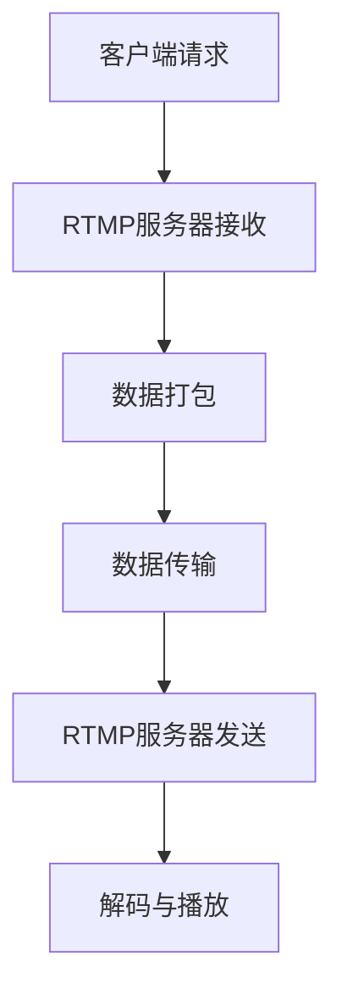

                 

关键词：流媒体服务器，Nginx，rtmp，直播，媒体传输

> 摘要：本文详细介绍了如何在Linux操作系统上使用Nginx-rtmp模块搭建一个流媒体服务器。通过本文的讲解，读者将学会Nginx-rtmp模块的基本配置和使用方法，了解流媒体传输的原理和流程，并掌握流媒体服务器的搭建和维护技巧。

## 1. 背景介绍

随着互联网的快速发展，流媒体服务已成为人们日常生活中不可或缺的一部分。从视频直播、在线教育、远程会议到音乐播放、电影点播，流媒体技术无处不在。而作为流媒体服务器中的一种，Nginx-rtmp模块因其高效、稳定的特点，在众多流媒体服务中得到了广泛应用。

本文将以Nginx-rtmp模块为基础，详细介绍流媒体服务器的搭建过程，帮助读者快速掌握流媒体服务的基本知识和实践技能。

## 2. 核心概念与联系

### 2.1. 流媒体传输原理

流媒体传输是一种通过互联网进行音频、视频等连续数据传输的技术。与传统的点对点传输不同，流媒体传输将数据划分为多个小数据包，并按顺序传输到客户端，客户端再对这些数据包进行解码和播放。流媒体传输的关键技术包括：

1. **分割与打包**：将连续数据分割为多个小数据包，每个数据包包含一部分音频或视频数据以及必要的控制信息。
2. **传输协议**：如RTMP（实时消息传输协议）、HTTP Live Streaming（HLS）等，用于实现数据在网络中的传输。
3. **解码与播放**：客户端接收数据包后，对其进行解码，并将其播放出来。

### 2.2. Nginx-rtmp模块架构

Nginx-rtmp模块是Nginx服务器的一个扩展模块，用于处理RTMP流媒体传输。其架构包括以下几个部分：

1. **RTMP服务器**：接收和发送RTMP数据流，实现流媒体数据的传输。
2. **RTMP客户端**：发送和接收RTMP数据流，实现客户端与服务器之间的交互。
3. **编解码器**：负责音频和视频数据的编码与解码。
4. **缓存管理**：对传输过程中的数据包进行缓存管理，提高传输效率。

### 2.3. Mermaid流程图

以下是Nginx-rtmp模块的流程图：



## 3. 核心算法原理 & 具体操作步骤

### 3.1. 算法原理概述

Nginx-rtmp模块的核心算法主要涉及以下几个方面：

1. **数据打包与传输**：根据RTMP协议，将数据划分为多个数据包，并按顺序传输。
2. **缓存管理**：对传输过程中的数据包进行缓存，提高传输效率。
3. **编解码**：对音频和视频数据包进行编码和解码，以满足客户端的播放需求。

### 3.2. 算法步骤详解

1. **客户端请求**：客户端发送HTTP请求，请求访问流媒体服务器。
2. **RTMP服务器接收**：Nginx-rtmp模块接收客户端请求，并建立RTMP连接。
3. **数据打包**：将音频和视频数据划分为多个数据包，每个数据包包含头部信息和数据内容。
4. **数据传输**：通过RTMP协议将数据包发送到客户端。
5. **缓存管理**：对传输过程中的数据包进行缓存，以便客户端在断网或延迟情况下能够继续播放。
6. **解码与播放**：客户端接收数据包后，对其进行解码，并将其播放出来。

### 3.3. 算法优缺点

**优点**：

1. **高效传输**：采用RTMP协议，传输效率高，适用于大规模流媒体传输。
2. **支持缓存**：缓存管理功能，提高了用户体验。
3. **易于扩展**：Nginx-rtmp模块易于与其他技术相结合，实现更多功能。

**缺点**：

1. **安全性问题**：RTMP协议本身存在一定的安全风险，容易受到攻击。
2. **带宽要求高**：流媒体传输需要较高的带宽，不适合在低带宽环境下使用。

### 3.4. 算法应用领域

Nginx-rtmp模块广泛应用于视频直播、在线教育、远程会议等领域，为各类流媒体服务提供了稳定、高效的支持。

## 4. 数学模型和公式 & 详细讲解 & 举例说明

### 4.1. 数学模型构建

在流媒体传输过程中，数据包的传输速度和缓存策略是关键因素。以下是构建数学模型的基本思路：

1. **传输速度模型**：假设数据包的传输速度为V，传输时间为T，则数据包的数量为N = V * T。
2. **缓存策略模型**：假设缓存容量为C，缓存命中率为H，则缓存中的数据包数量为N_c = N * H。

### 4.2. 公式推导过程

根据上述模型，可以推导出以下公式：

1. **传输速度公式**：V = N / T
2. **缓存命中率公式**：H = N_c / N

### 4.3. 案例分析与讲解

以下是一个简单的案例：

假设某流媒体服务器的传输速度为1000kbps，缓存容量为100MB，缓存命中率为90%。

1. **传输速度**：V = N / T = 1000kbps
2. **缓存命中率**：H = N_c / N = 0.9

根据公式，可以计算出：

1. **传输速度**：V = 1000kbps
2. **缓存命中率**：H = 0.9

这意味着，在该案例中，流媒体服务器每秒钟可以传输1000kb的数据，其中90%的数据可以从缓存中获取，提高了传输效率。

## 5. 项目实践：代码实例和详细解释说明

### 5.1. 开发环境搭建

在Linux操作系统上，我们需要安装Nginx和Nginx-rtmp模块。以下是安装步骤：

1. **安装Nginx**：

   ```shell
   sudo apt-get update
   sudo apt-get install nginx
   ```

2. **安装Nginx-rtmp模块**：

   ```shell
   sudo apt-get install libpcre3 libpcre3-dev
   sudo apt-get install libssl-dev
   sudo apt-get install build-essential
   wget http://nginx.org/download/nginx-1.21.3.tar.gz
   tar zxvf nginx-1.21.3.tar.gz
   cd nginx-1.21.3
   ./configure --with-http_ssl_module --with-rtmp_module
   make
   sudo make install
   ```

   安装完成后，我们可以在`/usr/local/nginx`目录下找到Nginx的安装路径。

### 5.2. 源代码详细实现

以下是Nginx-rtmp模块的配置文件示例：

```nginx
http {
    server {
        listen 1935;
        server_name localhost;

        location /live/ {
            rtmp {
                live on;
                publish all;
            }
        }
    }
}
```

这段配置文件用于监听1935端口，并将所有直播流发布到`/live/`目录下。

### 5.3. 代码解读与分析

在上述配置文件中，`listen 1935`表示监听1935端口，这是RTMP协议默认的端口号。`server_name localhost`表示服务器的域名或IP地址。

`location /live/ { ... }`表示当访问`/live/`目录下的资源时，将调用`rtmp`模块进行处理。在`rtmp`模块中，`live on;`表示开启直播功能，`publish all;`表示所有直播流都可以发布到服务器。

### 5.4. 运行结果展示

完成配置后，我们启动Nginx服务器：

```shell
sudo /usr/local/nginx/sbin/nginx
```

然后，我们使用RTMP客户端（如OBS Studio）连接到服务器，并尝试发布直播流。在OBS Studio中，我们设置连接地址为`rtmp://localhost/live/`，并开始直播。在浏览器中，我们访问`http://localhost/live/`，可以看到直播流的播放界面。

## 6. 实际应用场景

### 6.1. 视频直播

视频直播是Nginx-rtmp模块最典型的应用场景之一。通过Nginx-rtmp模块，我们可以快速搭建一个视频直播平台，实现直播流的发布和播放。

### 6.2. 在线教育

在线教育平台也可以使用Nginx-rtmp模块，为用户提供实时视频授课和互动功能。通过Nginx-rtmp模块，我们可以实现高清、低延迟的视频传输，提高用户体验。

### 6.3. 远程会议

远程会议系统也可以使用Nginx-rtmp模块，为用户提供实时音视频传输功能。通过Nginx-rtmp模块，我们可以实现多人会议的高效、稳定传输。

## 7. 工具和资源推荐

### 7.1. 学习资源推荐

1. 《Nginx权威指南》
2. 《Nginx Module Development》
3. 《流媒体技术实战》

### 7.2. 开发工具推荐

1. OBS Studio（直播软件）
2. FFmpeg（视频处理工具）
3. Nginx（服务器软件）

### 7.3. 相关论文推荐

1. "Nginx-rtmp-module: A High-performance RTMP Server for Linux"
2. "A Survey of Stream Media Transmission Technologies"
3. "Live Streaming Optimization: A Case Study of RTMP"

## 8. 总结：未来发展趋势与挑战

### 8.1. 研究成果总结

本文通过对Nginx-rtmp模块的详细介绍，使读者对流媒体服务器搭建有了全面的认识。从核心概念、算法原理到项目实践，本文系统地讲解了流媒体服务器的搭建过程，为读者提供了实用的技术指导。

### 8.2. 未来发展趋势

随着5G技术的普及，流媒体传输的速度和稳定性将得到进一步提升。同时，人工智能和大数据技术的应用，将为流媒体服务带来更多创新和优化。

### 8.3. 面临的挑战

流媒体服务面临着安全性、带宽要求和用户体验等方面的挑战。如何提高安全性、优化传输效率和提升用户体验，将是未来流媒体服务研究的重要方向。

### 8.4. 研究展望

未来，流媒体服务将继续向着更高效、更稳定、更智能的方向发展。在技术层面，研究者将不断探索新的传输协议和编解码技术，以满足不断增长的用户需求。

## 9. 附录：常见问题与解答

### 9.1. Q：Nginx-rtmp模块如何处理并发请求？

A：Nginx-rtmp模块通过多进程、多线程的方式处理并发请求。每个请求都会分配一个独立的线程进行处理，从而保证高并发下的性能和稳定性。

### 9.2. Q：如何保证流媒体服务的安全性？

A：为了保证流媒体服务的安全性，可以采用以下措施：

1. **加密传输**：使用HTTPS协议，确保数据在传输过程中的加密。
2. **身份验证**：对用户进行身份验证，防止未经授权的访问。
3. **访问控制**：根据用户角色和权限，限制其对流媒体资源的访问。

### 9.3. Q：如何优化流媒体传输效率？

A：优化流媒体传输效率可以从以下几个方面入手：

1. **压缩数据**：采用高效的编解码技术，减小数据传输量。
2. **缓存策略**：合理设置缓存策略，提高数据传输的命中率。
3. **负载均衡**：采用负载均衡技术，分散服务器压力，提高整体性能。

以上便是本文的全部内容，希望对您在流媒体服务器搭建方面有所帮助。作者：禅与计算机程序设计艺术 / Zen and the Art of Computer Programming。|

