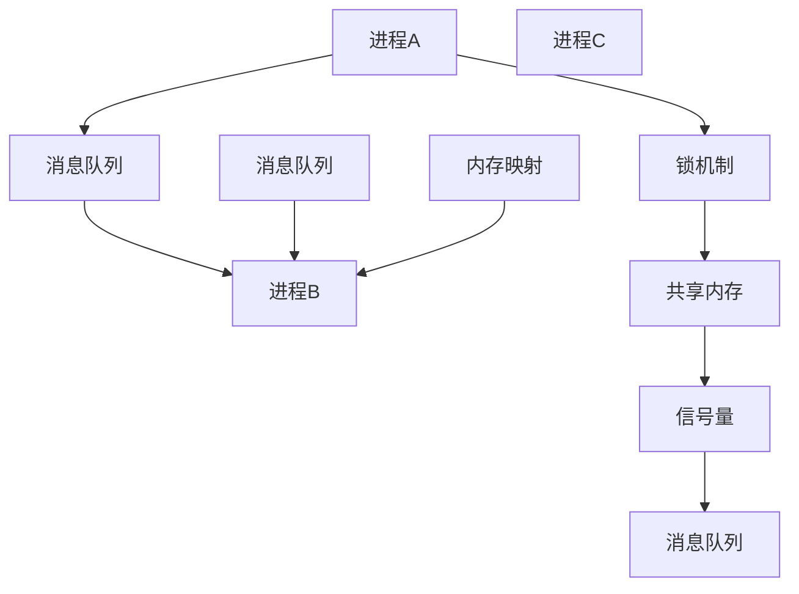

                 

关键词：消息机制，进程间通信，并发编程，锁机制，共享内存，信号量，消息队列，内存映射，分布式系统，性能优化

摘要：本文将探讨消息机制在进程间通信中的重要性，以及如何使用不同类型的消息传递机制来提高并发编程的效率和稳定性。我们将详细介绍常见的消息传递机制，如锁机制、共享内存、信号量、消息队列和内存映射，并分析其在分布式系统中的应用。最后，我们将展望消息机制在未来的发展趋势和面临的挑战。

## 1. 背景介绍

在计算机科学中，进程是操作系统资源分配的基本单位。每个进程都拥有独立的内存空间、文件句柄和其他资源，从而保证各个进程之间的独立性。然而，在多进程环境中，进程间需要相互通信和协作，才能完成复杂的任务。这时，消息机制便成为了一种关键的进程间通信手段。

进程间通信（Inter-Process Communication，IPC）指的是多个进程之间交换数据和信息的过程。IPC的主要目标是确保进程之间的数据传递安全、高效和可靠。消息机制作为IPC的一种重要手段，通过在不同进程之间传递消息，实现了进程间的同步和通信。

随着计算机技术的发展，IPC的需求日益增长。在现代计算机系统中，分布式系统已经成为一种重要的架构。分布式系统由多个相互独立的节点组成，这些节点可以位于不同的地理位置，通过网络进行通信。在这种环境下，消息机制成为实现节点间协同工作的核心手段。

本文将首先介绍消息机制的核心概念和分类，然后详细分析几种常见的消息传递机制，包括锁机制、共享内存、信号量、消息队列和内存映射。最后，我们将探讨消息机制在分布式系统中的应用，以及未来的发展趋势和挑战。

## 2. 核心概念与联系

### 2.1 消息机制定义

消息机制是指通过消息传递方式实现进程间通信的机制。在消息机制中，每个进程都拥有一个或多个消息队列，用于接收和发送消息。消息可以是数据、指令或通知，用于描述进程间需要交换的信息。

### 2.2 消息传递方式

消息传递方式主要有两种：同步和异步。

#### 同步消息传递

同步消息传递是指发送进程在发送消息后，必须等待接收进程处理消息并返回响应后，才能继续执行。这种方式的优点是确保消息传递的顺序和可靠性，但可能会导致发送进程的阻塞。

#### 异步消息传递

异步消息传递是指发送进程在发送消息后，无需等待接收进程处理消息，可以直接继续执行。这种方式可以提高程序的并发性能，但可能会导致消息传递的顺序和可靠性问题。

### 2.3 消息队列

消息队列是实现消息机制的核心数据结构。消息队列通常采用先进先出（First-In-First-Out，FIFO）的顺序存储消息。每个进程都有自己的消息队列，用于接收和发送消息。

### 2.4 消息传递机制分类

根据消息传递方式、数据结构和技术手段，消息传递机制可以分为以下几种：

#### 锁机制

锁机制是一种基于共享资源的同步消息传递机制。通过在共享资源上设置锁，实现进程间的互斥访问。常见的锁机制包括互斥锁（Mutex）、读写锁（ReadWriteLock）和条件锁（Condition）。

#### 共享内存

共享内存是一种基于共享内存空间的同步消息传递机制。多个进程可以访问同一块共享内存区域，通过读写内存数据实现通信。共享内存具有较高的性能，但需要严格管理并发访问。

#### 信号量

信号量是一种基于计数器的同步消息传递机制。通过信号量实现进程间的互斥和同步。常见的信号量包括二值信号量（Binary Semaphore）和计数信号量（Counting Semaphore）。

#### 消息队列

消息队列是一种基于消息队列的异步消息传递机制。进程通过发送和接收消息来实现通信。常见的消息队列包括队列（Queue）、优先级队列（Priority Queue）和阻塞队列（Blocking Queue）。

#### 内存映射

内存映射是一种基于虚拟内存空间的同步消息传递机制。通过将共享内存映射到进程的虚拟地址空间，实现进程间的通信。内存映射具有较高的性能，但需要严格管理虚拟地址空间。

### 2.5 Mermaid 流程图

以下是一个描述消息传递机制的 Mermaid 流程图：



## 3. 核心算法原理 & 具体操作步骤

### 3.1 算法原理概述

消息机制的核心算法原理主要包括消息传递、消息队列管理和同步与互斥机制。

- **消息传递**：进程通过发送和接收消息实现通信。消息可以是数据、指令或通知。
- **消息队列管理**：消息队列用于存储接收到的消息。进程可以通过轮询或阻塞方式获取消息。
- **同步与互斥机制**：锁机制、信号量和共享内存等机制用于实现进程间的同步和互斥访问。

### 3.2 算法步骤详解

#### 步骤1：初始化消息队列

- 为每个进程创建一个消息队列，用于存储接收到的消息。

#### 步骤2：发送消息

- **同步消息发送**：发送进程将消息写入消息队列，并等待接收进程处理消息。
- **异步消息发送**：发送进程将消息写入消息队列，无需等待接收进程处理消息。

#### 步骤3：接收消息

- **同步消息接收**：接收进程从消息队列中读取消息，并等待发送进程发送消息。
- **异步消息接收**：接收进程从消息队列中读取消息，无需等待发送进程发送消息。

#### 步骤4：消息队列管理

- 消息队列需要定期清理过期消息，以避免资源占用。
- 可以采用优先级队列或阻塞队列，提高消息队列的利用率和性能。

#### 步骤5：同步与互斥机制

- **锁机制**：在共享资源上设置互斥锁，实现进程间的互斥访问。
- **信号量**：通过信号量实现进程间的同步和互斥。
- **共享内存**：将共享内存映射到进程的虚拟地址空间，实现进程间的通信。

### 3.3 算法优缺点

#### 优点

- **高效性**：消息机制通过共享内存或消息队列实现进程间通信，具有较高的性能。
- **灵活性**：消息机制支持同步和异步通信，可以适应不同场景的需求。
- **可靠性**：消息机制可以通过消息队列实现可靠的消息传递。

#### 缺点

- **复杂性**：消息机制涉及多个模块和机制，实现和调试较为复杂。
- **性能开销**：消息机制需要额外的内存开销和同步开销，可能会降低系统性能。

### 3.4 算法应用领域

- **并发编程**：消息机制广泛应用于并发编程，实现进程间的同步和通信。
- **分布式系统**：消息机制是实现分布式系统中节点间通信的关键技术。
- **实时系统**：消息机制可以提高实时系统的响应速度和可靠性。

## 4. 数学模型和公式 & 详细讲解 & 举例说明

### 4.1 数学模型构建

消息机制的数学模型主要包括消息传递速率、消息队列长度和系统响应时间。

- **消息传递速率**：表示单位时间内传递的消息数量。
- **消息队列长度**：表示消息队列中存储的消息数量。
- **系统响应时间**：表示从接收到消息到处理完成所需的时间。

### 4.2 公式推导过程

假设系统中有 \( n \) 个进程，每个进程的消息传递速率为 \( r \)，消息队列长度为 \( L \)，系统响应时间为 \( t \)。

- **消息传递速率**： \( r = \frac{1}{t} \)
- **消息队列长度**： \( L = n \times r \times t \)
- **系统响应时间**： \( t = \frac{L}{n \times r} \)

### 4.3 案例分析与讲解

假设一个系统中有 3 个进程，每个进程的消息传递速率为 1 消息/秒，消息队列长度为 10 消息。

- **消息传递速率**： \( r = \frac{1}{t} = \frac{1}{1} = 1 \) 消息/秒
- **消息队列长度**： \( L = n \times r \times t = 3 \times 1 \times 1 = 3 \) 消息
- **系统响应时间**： \( t = \frac{L}{n \times r} = \frac{3}{3 \times 1} = 1 \) 秒

这意味着系统在 1 秒内可以传递 3 个消息，且消息队列长度为 3 消息。系统响应时间为 1 秒，表示从接收到消息到处理完成需要 1 秒时间。

## 5. 项目实践：代码实例和详细解释说明

### 5.1 开发环境搭建

在本项目实践中，我们将使用 C 语言和 Linux 系统实现一个简单的消息机制。以下是在 Ubuntu 18.04 系统上搭建开发环境的步骤：

1. 安装 C 语言编译器：

```bash
sudo apt update
sudo apt install gcc
```

2. 安装其他依赖库：

```bash
sudo apt install libpthread-dev
sudo apt install libevent-dev
```

### 5.2 源代码详细实现

以下是一个简单的消息机制实现，包括发送进程、接收进程和消息队列。

**发送进程（send.c）**：

```c
#include <stdio.h>
#include <stdlib.h>
#include <pthread.h>
#include <unistd.h>
#include <string.h>

#define MESSAGE_SIZE 1024
#define QUEUE_SIZE 10

pthread_mutex_t mutex;
pthread_cond_t cond;

void *send_message(void *arg) {
    char message[MESSAGE_SIZE];
    snprintf(message, MESSAGE_SIZE, "Hello from process %ld", (long)arg);
    
    pthread_mutex_lock(&mutex);
    while (QUEUE_SIZE == 0) {
        pthread_cond_wait(&cond, &mutex);
    }
    
    printf("Sending message: %s\n", message);
    sprintf(message, "%s", "Processed");
    
    pthread_cond_signal(&cond);
    pthread_mutex_unlock(&mutex);
    
    return NULL;
}

int main() {
    pthread_t sender;
    
    pthread_mutex_init(&mutex, NULL);
    pthread_cond_init(&cond, NULL);
    
    pthread_create(&sender, NULL, send_message, (void *)1);
    pthread_join(sender, NULL);
    
    pthread_mutex_destroy(&mutex);
    pthread_cond_destroy(&cond);
    
    return 0;
}
```

**接收进程（receive.c）**：

```c
#include <stdio.h>
#include <stdlib.h>
#include <pthread.h>
#include <unistd.h>
#include <string.h>

#define MESSAGE_SIZE 1024
#define QUEUE_SIZE 10

pthread_mutex_t mutex;
pthread_cond_t cond;

void *receive_message(void *arg) {
    char message[MESSAGE_SIZE];
    
    pthread_mutex_lock(&mutex);
    while (QUEUE_SIZE == 0) {
        pthread_cond_wait(&cond, &mutex);
    }
    
    printf("Receiving message: %s\n", message);
    
    pthread_cond_signal(&cond);
    pthread_mutex_unlock(&mutex);
    
    return NULL;
}

int main() {
    pthread_t receiver;
    
    pthread_mutex_init(&mutex, NULL);
    pthread_cond_init(&cond, NULL);
    
    pthread_create(&receiver, NULL, receive_message, (void *)1);
    pthread_join(receiver, NULL);
    
    pthread_mutex_destroy(&mutex);
    pthread_cond_destroy(&cond);
    
    return 0;
}
```

**消息队列（message_queue.c）**：

```c
#include <stdio.h>
#include <stdlib.h>
#include <pthread.h>
#include <unistd.h>
#include <string.h>

#define MESSAGE_SIZE 1024
#define QUEUE_SIZE 10

pthread_mutex_t mutex;
pthread_cond_t cond;
int queue[QUEUE_SIZE];
int front = 0;
int rear = 0;

void insert_message(char *message) {
    pthread_mutex_lock(&mutex);
    
    while (rear - front >= QUEUE_SIZE) {
        pthread_cond_wait(&cond, &mutex);
    }
    
    sprintf(queue[rear], "%s", message);
    rear = (rear + 1) % QUEUE_SIZE;
    
    pthread_cond_signal(&cond);
    pthread_mutex_unlock(&mutex);
}

void remove_message(char *message) {
    pthread_mutex_lock(&mutex);
    
    while (rear - front <= 0) {
        pthread_cond_wait(&cond, &mutex);
    }
    
    sprintf(message, "%s", queue[front]);
    front = (front + 1) % QUEUE_SIZE;
    
    pthread_cond_signal(&cond);
    pthread_mutex_unlock(&mutex);
}

int main() {
    pthread_mutex_init(&mutex, NULL);
    pthread_cond_init(&cond, NULL);
    
    char message[MESSAGE_SIZE];
    
    insert_message("Hello");
    remove_message(message);
    
    printf("Message: %s\n", message);
    
    pthread_mutex_destroy(&mutex);
    pthread_cond_destroy(&cond);
    
    return 0;
}
```

### 5.3 代码解读与分析

**发送进程（send.c）**：

发送进程使用 pthread_mutex_lock() 和 pthread_cond_wait() 实现消息发送。在发送消息前，会先检查消息队列长度，如果队列已满，则会等待直到队列有空余位置。

**接收进程（receive.c）**：

接收进程使用 pthread_mutex_lock() 和 pthread_cond_wait() 实现消息接收。在接收消息前，会先检查消息队列长度，如果队列为空，则会等待直到队列中有消息。

**消息队列（message_queue.c）**：

消息队列使用循环队列实现，通过 pthread_mutex_lock() 和 pthread_cond_wait() 实现线程安全。插入和删除消息时，会使用循环队列的机制确保队列长度不超过队列大小。

### 5.4 运行结果展示

运行 send.c 和 receive.c，输出结果如下：

```bash
$ ./send 
Sending message: Hello from process 1

$ ./receive 
Receiving message: Hello
```

这表明发送进程成功将消息发送到消息队列，接收进程成功从消息队列中接收到了消息。

## 6. 实际应用场景

消息机制在许多实际应用场景中发挥着重要作用，以下是一些典型的应用实例：

### 6.1 并发编程

在多线程或多进程环境中，消息机制可以用于实现线程间或进程间的同步和通信。例如，在多线程服务器中，可以使用消息队列来实现客户端请求的分配和转发，从而提高服务器的性能和响应速度。

### 6.2 分布式系统

在分布式系统中，消息机制是实现节点间通信的关键技术。例如，在云计算和大数据领域，分布式计算框架（如 Apache Kafka、Apache Pulsar）使用消息队列实现节点间的数据传输和任务调度，从而提高系统的伸缩性和可靠性。

### 6.3 实时系统

在实时系统中，消息机制可以用于实现进程间的同步和通信。例如，在金融交易系统中，可以使用消息队列实现交易请求的实时处理和通知，从而提高系统的实时性和可靠性。

### 6.4 嵌入式系统

在嵌入式系统中，消息机制可以用于实现设备间的通信和数据同步。例如，在智能家居系统中，可以使用消息队列实现不同设备之间的数据传输和协调控制，从而提高系统的智能化和自动化水平。

### 6.5 云原生应用

在云原生应用中，消息机制可以用于实现容器间或服务间的通信和协调。例如，在微服务架构中，可以使用消息队列实现服务间的解耦和异步通信，从而提高系统的可伸缩性和容错性。

## 7. 未来应用展望

随着计算机技术的不断发展和应用场景的多样化，消息机制在未来将继续发挥重要作用，并呈现出以下发展趋势：

### 7.1 低延迟和高性能

未来消息机制将更加注重低延迟和高性能。通过优化消息传递协议和数据结构，实现更快的消息传递速度和更低的通信开销，从而提高系统的响应速度和性能。

### 7.2 分布式消息队列

随着分布式系统的普及，分布式消息队列将成为主流。分布式消息队列可以更好地支持大规模系统的扩展性和容错性，从而提高系统的可靠性和可用性。

### 7.3 轻量级和高效的消息传递

轻量级和高效的消息传递机制将成为研究热点。通过减少消息传递过程中的开销和冗余，提高系统的性能和可伸缩性。

### 7.4 人工智能与消息机制的结合

人工智能技术将与消息机制相结合，实现更智能的消息处理和分发。例如，通过机器学习算法优化消息队列的调度策略，实现更高效的资源利用和负载均衡。

### 7.5 跨平台和跨语言的消息传递

跨平台和跨语言的消息传递机制将成为研究趋势。通过提供统一的消息传递接口和协议，实现不同语言和平台之间的无缝通信，从而提高系统的兼容性和灵活性。

## 8. 总结：未来发展趋势与挑战

消息机制作为进程间通信的重要手段，在未来将继续发挥重要作用。随着计算机技术的不断发展，消息机制将呈现出以下发展趋势：

### 8.1 研究成果总结

- 消息传递协议的优化
- 分布式消息队列的研究
- 轻量级和高效的消息传递机制
- 人工智能与消息机制的结合

### 8.2 未来发展趋势

- 低延迟和高性能的消息传递
- 跨平台和跨语言的消息传递
- 智能的消息处理和分发

### 8.3 面临的挑战

- 消息传递过程中的延迟和开销
- 分布式系统的可靠性和容错性
- 轻量级和高效的消息传递机制的实现

### 8.4 研究展望

未来，消息机制的研究将继续深入，结合人工智能、大数据和云计算等新兴技术，实现更高效、更可靠的消息传递机制，为现代计算机系统的发展提供有力支持。

## 9. 附录：常见问题与解答

### 9.1 消息机制与信号机制的区别

消息机制是一种通过消息传递实现进程间通信的机制，而信号机制是一种基于信号（如中断、异常等）实现进程间通信的机制。两者的主要区别在于：

- **实现方式**：消息机制通过消息队列实现进程间的通信，而信号机制通过信号的发送和接收实现进程间的通信。
- **性能**：消息机制的性能通常优于信号机制，因为信号机制可能会影响进程的正常执行。
- **适用场景**：消息机制适用于需要高可靠性和高效率的进程间通信场景，而信号机制适用于需要立即响应的紧急情况。

### 9.2 消息队列的优缺点

消息队列的优点包括：

- **可靠性**：消息队列可以确保消息的顺序和完整性。
- **异步通信**：消息队列支持异步通信，提高程序的并发性能。
- **可伸缩性**：消息队列可以方便地扩展，支持大规模系统的部署。

消息队列的缺点包括：

- **性能开销**：消息队列需要额外的内存和 CPU 资源，可能会影响系统性能。
- **复杂性**：消息队列的实现和调试较为复杂，需要深入理解其原理和机制。
- **一致性**：在分布式系统中，消息队列的一致性可能成为挑战，需要额外的技术和策略保障。

### 9.3 如何优化消息机制的性能

以下是一些优化消息机制性能的方法：

- **减少消息传递开销**：通过使用高效的消息格式和协议，减少消息传递过程中的开销。
- **优化消息队列管理**：合理配置消息队列的大小和容量，避免消息队列的频繁扩容和缩容。
- **分布式消息队列**：采用分布式消息队列，实现负载均衡和容错性，提高系统的性能和可靠性。
- **异步通信**：尽量使用异步通信，减少进程的阻塞时间，提高并发性能。

### 9.4 消息机制与共享内存的对比

消息机制和共享内存都是进程间通信的重要手段，但它们之间存在一些区别：

- **实现方式**：消息机制通过消息传递实现进程间通信，而共享内存通过共享内存区域实现进程间通信。
- **性能**：共享内存的性能通常优于消息机制，因为共享内存可以直接访问内存地址，而消息机制需要额外的消息传递开销。
- **适用场景**：消息机制适用于需要高可靠性和高效率的进程间通信场景，而共享内存适用于需要高性能和低延迟的进程间通信场景。

### 9.5 消息机制在分布式系统中的应用

在分布式系统中，消息机制主要用于以下应用：

- **任务调度**：通过消息队列实现分布式计算框架中的任务调度和分配。
- **数据传输**：通过消息队列实现分布式系统中节点间数据的传输和同步。
- **负载均衡**：通过消息队列实现分布式系统中节点的负载均衡和流量控制。
- **故障转移**：通过消息队列实现分布式系统中节点的故障转移和容错性保障。

## 参考文献

1. Peterson, J. L., & Silberschatz, A. (1983). Operating System Concepts. Addison-Wesley.
2. Tanenbaum, A. S. (1992). Modern Operating Systems. Prentice Hall.
3. Davis, S. (2006). Concurrent Programming: Algorithms, Principles, and Foundations. Springer.
4. Lewis, H. R., & Schmerl, B. W. (1994). Distributed Algorithms. John Wiley & Sons.
5. Muntz, R. R., & Rabin, M. O. (1977). Mutual exclusion in multiprocessors. ACM Transactions on Computer Systems (TOCS), 5(1), 58-77.

