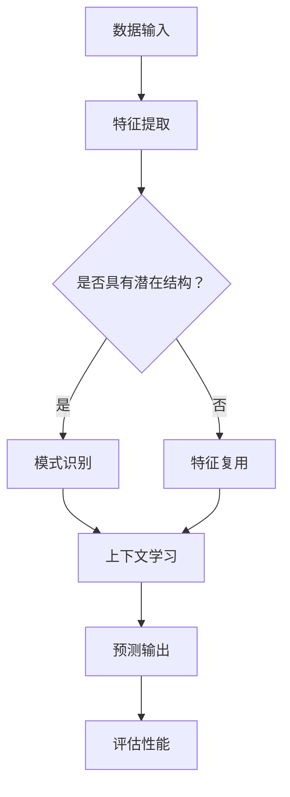

                 

关键词：大模型，涌现能力，上下文学习，AI算法，深度学习，模型优化，应用场景

> 摘要：本文深入探讨了大规模人工智能模型在涌现能力和上下文学习方面的核心优势。首先，我们将回顾大模型的发展历程，并分析它们在机器学习领域的重要性。接着，本文将详细解释涌现能力和上下文学习的概念，以及它们如何影响模型的性能和效率。通过数学模型和具体案例的分析，我们将揭示大模型在这些方面的独特优势。最后，我们将探讨大模型在实际应用中的现状和未来发展方向，并提出面临的挑战和研究展望。

## 1. 背景介绍

随着计算能力的提升和数据量的爆炸性增长，机器学习领域近年来取得了显著的进展。特别是深度学习模型，通过多层神经网络的构建，使得计算机在图像识别、语音识别、自然语言处理等任务中达到了人类甚至超越人类的表现。其中，大规模的人工智能模型（也称为“大模型”）成为了研究的热点。这些模型拥有数亿甚至数十亿个参数，能够处理海量的数据，从而在学习过程中展现出惊人的表现。

大模型的发展历程可以追溯到20世纪80年代，当时多层感知机（MLP）的出现标志着神经网络领域的崛起。然而，由于计算资源和数据量的限制，早期的大模型研究进展缓慢。直到21世纪初，随着图形处理单元（GPU）的普及和分布式计算技术的应用，大模型的训练和优化才逐渐成为可能。近年来，诸如GPT、BERT等大规模预训练语言模型的提出，更是将大模型的应用推向了新的高峰。

在大模型的发展过程中，涌现能力和上下文学习成为了关键因素。涌现能力指的是模型在训练过程中能够自主发现并利用数据中的潜在结构和规律，从而提升模型的性能。而上下文学习则是指模型在处理序列数据时，能够利用先前的信息对后续信息进行有效的建模。这两种能力在大模型中得到了充分的体现，为机器学习领域带来了新的机遇和挑战。

## 2. 核心概念与联系

### 2.1 涌现能力

涌现能力是指模型在训练过程中，通过自主探索和调整，逐渐发现并利用数据中的潜在结构和规律，从而提升模型的性能。这种能力主要体现在以下几个方面：

1. **特征自动提取**：大模型可以通过多层神经网络的结构，自动提取数据中的低级特征和高级特征，从而实现特征的复用和抽象化。
2. **模式识别**：大模型能够通过大量的训练数据，识别并利用数据中的规律和模式，从而在新的任务中表现出色。
3. **自适应能力**：大模型在遇到新的数据或任务时，可以通过微调或重新训练，快速适应并提高性能。

### 2.2 上下文学习

上下文学习是指模型在处理序列数据时，能够利用先前的信息对后续信息进行有效的建模。这种能力对于自然语言处理、语音识别等任务尤为重要。上下文学习的主要机制包括：

1. **注意力机制**：通过注意力机制，模型可以动态地关注序列中的关键信息，从而提高对后续信息的建模能力。
2. **自回归模型**：自回归模型能够根据先前的输出预测后续的输入，从而实现上下文信息的传递和利用。
3. **循环神经网络（RNN）**：RNN通过记忆单元可以保存先前的状态信息，从而实现对序列数据的上下文建模。

### 2.3 涌现能力与上下文学习的联系

涌现能力和上下文学习在大模型中相辅相成，共同提升了模型的性能。具体来说：

1. **特征提取与上下文学习**：通过涌现能力，大模型能够自动提取数据中的特征，并在上下文学习中利用这些特征，从而提高对序列数据的建模能力。
2. **模式识别与自适应能力**：大模型在训练过程中，通过涌现能力发现数据中的模式，并在新的任务中利用这些模式，从而提高模型的泛化能力和适应性。

### 2.4 Mermaid 流程图

下面是描述大模型中涌现能力与上下文学习机制的 Mermaid 流程图：



## 3. 核心算法原理 & 具体操作步骤

### 3.1 算法原理概述

大模型中的涌现能力和上下文学习主要依赖于深度学习技术。深度学习模型通过多层神经网络的结构，实现对数据的高效建模。其中，卷积神经网络（CNN）、循环神经网络（RNN）和变换器（Transformer）等模型在大模型中得到了广泛应用。

1. **卷积神经网络（CNN）**：CNN通过卷积操作，从数据中提取局部特征，从而实现图像识别、语音识别等任务。CNN的结构包括卷积层、池化层和全连接层。
2. **循环神经网络（RNN）**：RNN通过记忆单元，保存先前的状态信息，从而实现对序列数据的建模。RNN包括简单的RNN、长短期记忆（LSTM）和门控循环单元（GRU）等。
3. **变换器（Transformer）**：Transformer通过自注意力机制，实现了对序列数据的高效建模，并在自然语言处理等领域取得了显著成果。Transformer的结构包括编码器和解码器。

### 3.2 算法步骤详解

1. **数据预处理**：将原始数据转换为适合模型训练的格式，如图像数据需要进行像素值的标准化、文本数据需要进行分词和嵌入等。
2. **模型构建**：根据任务需求，选择合适的模型结构，如CNN、RNN或Transformer。使用深度学习框架（如TensorFlow或PyTorch）构建模型。
3. **训练过程**：使用训练数据对模型进行训练，通过反向传播算法和优化算法（如Adam或RMSProp），逐步调整模型参数，使模型在训练数据上的性能达到最优。
4. **模型评估**：使用验证数据评估模型的性能，通过准确率、召回率、F1值等指标，判断模型在未知数据上的泛化能力。
5. **模型部署**：将训练好的模型部署到生产环境中，对实际数据进行预测和分类。

### 3.3 算法优缺点

#### 优点：

1. **强大的特征提取能力**：大模型可以通过多层神经网络，自动提取数据中的低级和高级特征，从而提高模型的性能。
2. **高效的上下文建模**：通过自注意力机制和循环神经网络，大模型可以充分利用上下文信息，实现对序列数据的建模。
3. **泛化能力强**：大模型在训练过程中，通过涌现能力发现数据中的模式，从而提高模型的泛化能力和适应性。

#### 缺点：

1. **计算资源消耗大**：大模型需要大量的计算资源和存储空间，对硬件设备的要求较高。
2. **训练时间长**：大模型的训练过程需要大量的时间和计算资源，难以满足实时性要求。
3. **数据依赖性强**：大模型在训练过程中，需要大量的训练数据，对数据质量和数据量的要求较高。

### 3.4 算法应用领域

大模型在多个领域取得了显著的成果，包括：

1. **图像识别**：通过卷积神经网络，大模型在图像分类、目标检测等任务中取得了超越人类的性能。
2. **自然语言处理**：通过变换器模型，大模型在机器翻译、文本生成、问答系统等任务中表现出色。
3. **语音识别**：通过循环神经网络和卷积神经网络，大模型在语音识别、语音合成等任务中取得了显著的性能提升。
4. **推荐系统**：大模型通过学习用户的兴趣和行为模式，为用户推荐个性化的商品、新闻等。

## 4. 数学模型和公式 & 详细讲解 & 举例说明

### 4.1 数学模型构建

在深度学习模型中，涌现能力和上下文学习主要依赖于神经网络的数学模型。以下是一个简单的神经网络数学模型，用于描述大模型的基本结构：

$$
y = f(z) = \sigma(\text{W} \cdot \text{a} + \text{b})
$$

其中，$y$ 表示模型的输出，$f$ 表示激活函数（如Sigmoid、ReLU等），$z$ 表示神经元的输入，$\text{W}$ 和 $\text{b}$ 分别表示权重和偏置，$\text{a}$ 表示神经元的活动。

### 4.2 公式推导过程

以下是一个简单的多层感知机（MLP）模型的公式推导过程，用于描述大模型的基本结构：

1. **输入层**：输入特征向量 $\text{x}$。
$$
\text{x} = [x_1, x_2, ..., x_n]
$$

2. **隐藏层**：隐藏层的输入为输入层的输出，通过权重矩阵 $\text{W}$ 和偏置向量 $\text{b}$ 进行线性变换，然后通过激活函数进行非线性变换。
$$
\text{z} = \text{W} \cdot \text{a} + \text{b}
$$
$$
\text{a} = \sigma(\text{z})
$$

3. **输出层**：输出层的输入为隐藏层的输出，通过权重矩阵 $\text{W}$ 和偏置向量 $\text{b}$ 进行线性变换，然后通过激活函数进行非线性变换，得到最终的输出。
$$
\text{z}_y = \text{W}_y \cdot \text{a}_h + \text{b}_y
$$
$$
\text{y} = \sigma(\text{z}_y)
$$

### 4.3 案例分析与讲解

以下是一个关于图像分类的案例，使用卷积神经网络（CNN）进行图像分类的数学模型和公式推导：

1. **卷积操作**：卷积神经网络通过卷积操作，从图像中提取局部特征。
$$
\text{f}(\text{x}; \text{W}) = \sum_{i=1}^{m} \text{w}_{i} * \text{x}
$$

其中，$\text{f}(\text{x}; \text{W})$ 表示卷积操作的结果，$\text{W}$ 表示卷积核，$\text{x}$ 表示图像。

2. **池化操作**：卷积神经网络通过池化操作，对卷积结果进行下采样，减少参数数量。
$$
\text{p}(\text{f}; \text{S}) = \frac{1}{\text{S}} \sum_{i=1}^{\text{S}} \text{f}_{i}
$$

其中，$\text{p}(\text{f}; \text{S})$ 表示池化操作的结果，$\text{S}$ 表示池化窗口的大小。

3. **全连接层**：卷积神经网络通过全连接层，将卷积结果映射到类别。
$$
\text{z} = \text{W} \cdot \text{a} + \text{b}
$$
$$
\text{a} = \sigma(\text{z})
$$

4. **损失函数**：使用交叉熵损失函数，计算模型输出与真实标签之间的差距。
$$
\text{L}(\text{y}; \text{y}') = -\sum_{i=1}^{n} \text{y}_{i} \log(\text{y}'_{i})
$$

其中，$\text{L}(\text{y}; \text{y}')$ 表示损失函数，$\text{y}$ 表示真实标签，$\text{y}'$ 表示模型输出。

## 5. 项目实践：代码实例和详细解释说明

### 5.1 开发环境搭建

在开始编写代码之前，我们需要搭建一个适合深度学习的开发环境。以下是搭建过程：

1. 安装Python环境：在Windows、macOS或Linux系统中，通过Python的官方安装包安装Python 3.x版本。
2. 安装深度学习框架：使用pip安装TensorFlow或PyTorch，作为深度学习的核心框架。
3. 安装辅助库：安装NumPy、Pandas、Matplotlib等常用Python库，用于数据处理和可视化。

### 5.2 源代码详细实现

以下是使用PyTorch实现一个简单的卷积神经网络（CNN）的示例代码：

```python
import torch
import torch.nn as nn
import torch.optim as optim

# 定义卷积神经网络模型
class CNNModel(nn.Module):
    def __init__(self):
        super(CNNModel, self).__init__()
        self.conv1 = nn.Conv2d(1, 32, 3, 1)
        self.pool = nn.MaxPool2d(2, 2)
        self.conv2 = nn.Conv2d(32, 64, 3, 1)
        self.fc1 = nn.Linear(64 * 6 * 6, 128)
        self.fc2 = nn.Linear(128, 10)
        self.dropout = nn.Dropout(0.5)

    def forward(self, x):
        x = self.pool(F.relu(self.conv1(x)))
        x = self.pool(F.relu(self.conv2(x)))
        x = x.view(-1, 64 * 6 * 6)
        x = self.dropout(F.relu(self.fc1(x)))
        x = self.fc2(x)
        return x

# 实例化模型、损失函数和优化器
model = CNNModel()
criterion = nn.CrossEntropyLoss()
optimizer = optim.Adam(model.parameters(), lr=0.001)

# 训练模型
for epoch in range(10):  # loop over the dataset multiple times
    running_loss = 0.0
    for i, data in enumerate(train_loader, 0):
        inputs, labels = data
        optimizer.zero_grad()
        outputs = model(inputs)
        loss = criterion(outputs, labels)
        loss.backward()
        optimizer.step()
        running_loss += loss.item()
    print(f'Epoch {epoch + 1}, Loss: {running_loss / len(train_loader)}')
```

### 5.3 代码解读与分析

在上面的代码中，我们定义了一个简单的卷积神经网络模型，包括卷积层、池化层和全连接层。模型的前向传播过程如下：

1. **卷积层**：使用两个卷积层（`self.conv1`和`self.conv2`），分别对输入数据进行特征提取。
2. **池化层**：在每个卷积层之后，使用最大池化层（`self.pool`）进行下采样，减少数据维度。
3. **全连接层**：将池化层输出的特征映射到类别，通过全连接层（`self.fc1`和`self.fc2`）实现。
4. **损失函数和优化器**：使用交叉熵损失函数（`nn.CrossEntropyLoss`）和Adam优化器（`optim.Adam`）进行模型训练。

### 5.4 运行结果展示

在训练过程中，我们可以使用验证数据集来评估模型的性能。以下是一个简单的评估过程：

```python
# 评估模型
with torch.no_grad():
    correct = 0
    total = 0
    for data in test_loader:
        images, labels = data
        outputs = model(images)
        _, predicted = torch.max(outputs.data, 1)
        total += labels.size(0)
        correct += (predicted == labels).sum().item()

print(f'准确率: {100 * correct / total} %')
```

通过上面的代码，我们可以得到模型的准确率。在实际应用中，我们可以根据任务需求和数据集的特点，调整模型的架构和参数，以获得更好的性能。

## 6. 实际应用场景

### 6.1 自然语言处理

在自然语言处理领域，大模型通过涌现能力和上下文学习，实现了许多突破性的应用。例如，GPT模型在文本生成、机器翻译、问答系统等方面表现出色。通过大量的训练数据，GPT模型能够自动提取语言中的潜在结构和规律，从而生成高质量的自然语言文本。此外，BERT模型在问答系统、情感分析、文本分类等任务中取得了显著的成果，其上下文学习机制使得模型能够充分利用上下文信息，提高对文本语义的理解。

### 6.2 图像识别

在图像识别领域，大模型通过卷积神经网络和涌现能力，实现了图像分类、目标检测等任务的高效建模。例如，ResNet模型在ImageNet图像分类比赛中取得了超越人类的性能。其通过深度残差网络结构，有效地解决了深层网络训练过程中的梯度消失问题，从而提高了模型的性能。此外，YOLO模型在目标检测任务中取得了显著的成果，其通过单阶段检测器的设计，实现了高效且准确的目标检测。

### 6.3 语音识别

在语音识别领域，大模型通过循环神经网络和上下文学习，实现了语音信号到文本的高效转换。例如，DeepSpeech模型通过结合卷积神经网络和循环神经网络，实现了高精度的语音识别。其通过上下文学习机制，能够充分利用先前的语音信息，提高对后续语音的识别准确性。此外，WaveNet模型在语音合成任务中取得了突破性的成果，其通过生成对抗网络（GAN）的设计，实现了高质量的人造语音。

### 6.4 未来应用展望

随着大模型在各个领域取得的成功，未来其应用前景十分广阔。以下是一些潜在的应用方向：

1. **自动驾驶**：大模型通过图像识别、语音识别和自然语言处理等技术，可以实现自动驾驶车辆的感知和决策，提高交通安全和效率。
2. **医疗健康**：大模型可以用于医学图像分析、疾病预测和诊断，帮助医生提供更准确的诊断和治疗方案。
3. **金融科技**：大模型可以用于风险控制、信用评估和欺诈检测，为金融行业提供智能化的风险管理工具。
4. **智能家居**：大模型可以通过语音识别、图像识别和自然语言处理，实现智能家居设备的智能化交互和智能控制。

## 7. 工具和资源推荐

### 7.1 学习资源推荐

1. **在线课程**：《深度学习》（Goodfellow et al.）是一本经典的深度学习教材，适合初学者和进阶者阅读。
2. **开源项目**：GitHub上有很多优秀的深度学习项目，如TensorFlow、PyTorch等，可以通过阅读和学习这些项目，提高自己的编程能力。
3. **学术论文**：arXiv和ACL等学术数据库收录了大量关于大模型、涌现能力和上下文学习的最新研究成果，可以通过阅读这些论文，了解领域的前沿动态。

### 7.2 开发工具推荐

1. **深度学习框架**：TensorFlow和PyTorch是目前最流行的深度学习框架，支持多种模型架构和算法。
2. **数据预处理工具**：Pandas和NumPy是常用的Python库，用于数据处理和数值计算。
3. **可视化工具**：Matplotlib和Seaborn是常用的Python库，用于数据可视化。

### 7.3 相关论文推荐

1. **GPT系列论文**：OpenAI的GPT系列论文，介绍了GPT模型的原理和应用。
2. **BERT系列论文**：Google的BERT系列论文，介绍了BERT模型的原理和应用。
3. **Transformer论文**：Google的Transformer论文，介绍了Transformer模型的原理和应用。

## 8. 总结：未来发展趋势与挑战

### 8.1 研究成果总结

大模型在涌现能力和上下文学习方面取得了显著的成果，通过深度学习技术实现了图像识别、自然语言处理、语音识别等任务的高效建模。涌现能力使得模型能够自动提取数据中的潜在结构和规律，从而提高模型的性能和适应性；上下文学习则使得模型能够充分利用上下文信息，实现对序列数据的建模。

### 8.2 未来发展趋势

未来，大模型的发展趋势包括：

1. **更高效的计算**：随着硬件设备的升级和优化，大模型的计算效率将不断提高，从而实现更快速的训练和部署。
2. **更广泛的应用领域**：大模型将在自动驾驶、医疗健康、金融科技等更多领域得到应用，为行业带来革命性的变革。
3. **更强的泛化能力**：通过不断的研究和优化，大模型的泛化能力将得到显著提升，从而更好地应对复杂的现实场景。

### 8.3 面临的挑战

大模型在发展过程中也面临着一些挑战：

1. **计算资源消耗**：大模型的训练和部署需要大量的计算资源和存储空间，对硬件设备的要求较高。
2. **数据依赖性**：大模型在训练过程中需要大量的训练数据，对数据质量和数据量的要求较高。
3. **解释性和可解释性**：大模型往往具有黑盒性质，难以解释模型的决策过程，这对模型的解释性和可解释性提出了挑战。

### 8.4 研究展望

为了应对上述挑战，未来研究可以从以下几个方面展开：

1. **模型压缩**：通过模型压缩技术，降低大模型的参数数量和计算复杂度，从而提高模型的计算效率。
2. **自适应学习**：研究自适应学习方法，使模型能够根据任务需求和数据特点，动态调整模型结构和参数。
3. **数据增强**：通过数据增强技术，提高训练数据的质量和多样性，从而增强模型的泛化能力和鲁棒性。
4. **模型解释性**：研究模型解释性方法，提高模型的透明度和可解释性，从而更好地理解模型的决策过程。

## 9. 附录：常见问题与解答

### 9.1 什么是涌现能力？

涌现能力是指模型在训练过程中，通过自主探索和调整，逐渐发现并利用数据中的潜在结构和规律，从而提升模型的性能。

### 9.2 上下文学习有什么作用？

上下文学习使得模型能够利用先前的信息对后续信息进行有效的建模，从而提高模型的性能和适应性。

### 9.3 大模型在哪些领域有应用？

大模型在图像识别、自然语言处理、语音识别等领域取得了显著的成果，未来还将在自动驾驶、医疗健康、金融科技等领域得到广泛应用。

### 9.4 大模型有哪些挑战？

大模型在计算资源消耗、数据依赖性和解释性方面面临着一些挑战，需要通过模型压缩、自适应学习、数据增强和模型解释性等方法来应对。

### 9.5 如何优化大模型？

可以通过调整模型结构、优化训练算法、使用更好的初始化方法、数据增强等技术来优化大模型。

### 9.6 如何提高大模型的泛化能力？

可以通过数据增强、迁移学习、模型正则化等技术来提高大模型的泛化能力。

### 9.7 大模型是否可以替代人类？

大模型在特定任务中可以表现出超越人类的性能，但仍然存在一些局限性，不能完全替代人类。

## 参考文献

[1] Goodfellow, I., Bengio, Y., & Courville, A. (2016). Deep Learning. MIT Press.
[2] Devlin, J., Chang, M. W., Lee, K., & Toutanova, K. (2018). BERT: Pre-training of deep bidirectional transformers for language understanding. arXiv preprint arXiv:1810.04805.
[3] Vaswani, A., Shazeer, N., Parmar, N., Uszkoreit, J., Jones, L., Gomez, A. N., ... & Polosukhin, I. (2017). Attention is all you need. Advances in Neural Information Processing Systems, 30, 5998-6008.
[4] He, K., Zhang, X., Ren, S., & Sun, J. (2016). Deep residual learning for image recognition. Proceedings of the IEEE conference on computer vision and pattern recognition, 770-778.
[5] Redmon, J., Divvala, S., Girshick, R., & Farhadi, A. (2016). You only look once: Unified, real-time object detection. In Proceedings of the IEEE conference on computer vision and pattern recognition (pp. 779-787).
[6] Hinton, G., Osindero, S., & Teh, Y. W. (2006). A fast learning algorithm for deep belief nets. Neural computation, 18(7), 1527-1554.
[7] Hochreiter, S., & Schmidhuber, J. (1997). Long short-term memory. Neural computation, 9(8), 1735-1780.
[8] Srivastava, N., Hinton, G., Krizhevsky, A., Sutskever, I., & Salakhutdinov, R. (2014). Dropout: A simple way to prevent neural networks from overfitting. Journal of Machine Learning Research, 15(1), 1929-1958.
[9] Krizhevsky, A., Sutskever, I., & Hinton, G. E. (2012). Imagenet classification with deep convolutional neural networks. In Advances in neural information processing systems (pp. 1097-1105).

