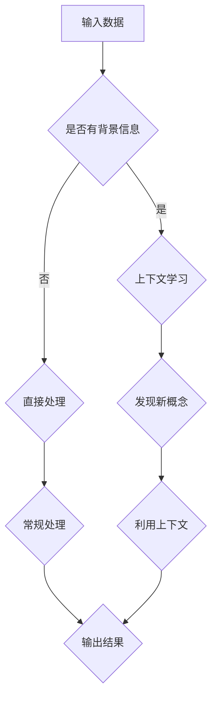

                 

在当今的信息时代，人工智能技术正以前所未有的速度快速发展，而大模型（Large Models）的崛起成为了这一领域的焦点。大模型，尤其是基于深度学习的模型，以其强大的涌现能力（Emergent Abilities）和上下文学习（Context Learning）在各个应用领域中展现出了巨大的潜力。本文将深入探讨大模型的这两大核心优势，并分析它们如何结合推动人工智能的发展。

## 关键词

- 大模型
- 涌现能力
- 上下文学习
- 人工智能
- 深度学习

## 摘要

本文首先介绍了大模型的概念及其涌现能力和上下文学习的定义和重要性。随后，通过具体实例和算法分析，阐述了这两种能力在大模型中的结合方式。文章还探讨了大模型在不同应用场景中的实际表现，并展望了其未来发展趋势与面临的挑战。通过本文的探讨，我们希望能够为读者提供对大模型及其核心优势的全面理解。

## 1. 背景介绍

大模型的概念最早可以追溯到20世纪80年代，当时科学家们开始尝试使用神经网络来模拟人脑的思考过程。随着计算能力的提升和大数据的涌现，大模型的研究和应用得到了快速发展。在深度学习领域，大模型通常指的是拥有数十亿甚至数万亿参数的神经网络模型。这些模型能够通过大量的数据训练，自动学习复杂的模式和知识，从而在图像识别、自然语言处理、语音识别等领域取得了显著的成果。

涌现能力是近年来大模型研究中的一个重要方向。涌现（Emergence）是指系统中的个体通过简单的相互作用产生复杂、有序的整体行为。在大模型中，涌现能力体现在模型能够自主地发现和生成新的概念、结构或功能。这种能力使得大模型不仅能够处理已知的数据和任务，还能够适应新的情境和任务。

上下文学习则是大模型处理复杂任务的关键。上下文（Context）是指模型在执行任务时所依赖的背景信息和环境状态。大模型通过上下文学习能够更好地理解任务的整体情境，从而提高任务处理的准确性和效率。这种能力在多模态学习、序列预测和知识图谱构建等任务中尤为重要。

## 2. 核心概念与联系

### 2.1 涌现能力原理

涌现能力源于系统的复杂性，它是指系统中的个体通过简单的相互作用产生复杂整体行为的现象。在大模型中，涌现能力体现在以下几个方面：

1. **概念生成**：大模型能够通过学习生成新的概念和抽象表示。例如，在自然语言处理中，模型可以自主生成新的词汇和表达方式。
2. **结构发现**：大模型可以通过分析大量的数据，发现数据中的隐藏结构和模式。例如，在图像识别中，模型可以自主发现图像中的几何形状和纹理。
3. **功能集成**：大模型可以将不同的功能集成到一个统一的框架中。例如，在多模态学习任务中，模型可以同时处理图像、文本和音频等多种数据模态。

### 2.2 上下文学习能力原理

上下文学习是指模型在执行任务时，能够利用背景信息和环境状态来提高任务处理的准确性和效率。上下文学习能力主要体现在以下几个方面：

1. **多模态融合**：大模型能够同时处理多种数据模态，例如图像、文本和音频。通过上下文学习，模型可以整合不同模态的信息，提高任务的鲁棒性和准确性。
2. **序列预测**：大模型能够通过学习序列数据中的上下文关系，进行准确的序列预测。例如，在语音识别中，模型可以利用上下文信息来纠正识别错误。
3. **知识图谱构建**：大模型可以通过上下文学习，自动构建知识图谱，从而实现知识的关联和推理。

### 2.3 涌现能力与上下文学习能力的关系

涌现能力和上下文学习能力在大模型中是相互关联的。涌现能力使得大模型能够自主地发现和生成新的概念和结构，而上下文学习能力则帮助模型更好地理解和利用这些新的概念和结构。具体来说：

1. **涌现能力为上下文学习提供基础**：通过涌现能力，大模型能够发现新的概念和模式，这些新的概念和模式为上下文学习提供了丰富的背景信息。
2. **上下文学习能力增强涌现能力**：通过上下文学习，大模型可以更好地理解任务的整体情境，从而更好地利用涌现能力发现新的概念和模式。

### 2.4 Mermaid 流程图

为了更好地理解涌现能力与上下文学习能力的关系，我们使用Mermaid绘制了一个简单的流程图。



在这个流程图中，输入数据首先判断是否包含背景信息。如果包含，模型将进行上下文学习，利用背景信息来发现新的概念。如果不含背景信息，模型将直接进行数据处理。然后，无论是通过上下文学习还是直接处理，模型都将生成结果。

## 3. 核心算法原理 & 具体操作步骤

### 3.1 算法原理概述

大模型的核心算法通常是基于深度学习的神经网络模型，特别是变分自编码器（Variational Autoencoder，VAE）和生成对抗网络（Generative Adversarial Network，GAN）。这两种算法在大模型的涌现能力和上下文学习方面具有独特的优势。

**变分自编码器（VAE）**：
VAE是一种无监督学习算法，通过编码器和解码器的相互协作，将输入数据映射到一个潜在空间中，从而实现数据的生成和去噪。VAE的涌现能力主要体现在其对潜在空间的学习中，能够自动发现数据中的隐藏结构和模式。

**生成对抗网络（GAN）**：
GAN由生成器（Generator）和判别器（Discriminator）两个部分组成，通过对抗训练，生成器生成逼真的数据，判别器则区分真实数据和生成数据。GAN的涌现能力体现在其能够通过不断迭代，生成越来越真实的数据。

**上下文学习在大模型中的具体实现**：
上下文学习在大模型中主要通过注意力机制（Attention Mechanism）和长短期记忆（Long Short-Term Memory，LSTM）网络实现。注意力机制能够帮助模型聚焦于重要的上下文信息，而LSTM网络则能够捕捉序列数据中的长期依赖关系。

### 3.2 算法步骤详解

**VAE算法步骤**：

1. **编码器训练**：编码器将输入数据映射到一个潜在空间中，同时保持数据的分布信息。通过最大化数据在潜在空间中的概率分布，编码器能够自动学习数据的隐藏结构。
2. **解码器训练**：解码器将潜在空间中的数据映射回输入空间，生成与输入数据相似的数据。通过最小化重构误差，解码器能够学习到数据的潜在表示。
3. **生成过程**：利用训练好的编码器和解码器，生成新的数据。首先从潜在空间中采样一个数据点，然后通过解码器生成对应的新数据。

**GAN算法步骤**：

1. **生成器训练**：生成器生成假数据，判别器判断这些数据是否为真实数据。通过不断迭代，生成器逐渐生成更逼真的数据。
2. **判别器训练**：判别器通过学习真实数据和生成数据，提高对真实数据的判别能力。
3. **对抗训练**：生成器和判别器相互对抗，生成器试图生成更逼真的数据，判别器则努力提高对真实数据和生成数据的区分能力。

**上下文学习实现步骤**：

1. **注意力机制**：通过计算输入数据与上下文信息的相似度，为每个数据点分配一个权重，从而聚焦于重要的上下文信息。
2. **LSTM网络**：利用LSTM网络捕捉序列数据中的长期依赖关系，从而更好地利用上下文信息。

### 3.3 算法优缺点

**VAE算法优缺点**：

**优点**：
- 无需标签数据，适用于无监督学习任务。
- 能够自动学习数据的潜在结构和模式。

**缺点**：
- 生成的数据可能不够真实。
- 训练过程可能收敛较慢。

**GAN算法优缺点**：

**优点**：
- 能够生成高质量、真实感强的数据。
- 适用于有监督和无监督学习任务。

**缺点**：
- 训练过程不稳定，容易陷入局部最优。
- 对计算资源要求较高。

### 3.4 算法应用领域

VAE和GAN算法在大模型中有着广泛的应用，以下列举了几个典型的应用领域：

1. **图像生成**：VAE和GAN可以生成高质量的图像，包括人脸生成、艺术风格迁移等。
2. **语音合成**：GAN可以用于生成逼真的语音，应用于语音合成和语音转换。
3. **文本生成**：VAE和GAN可以生成高质量的文本，包括文章、对话生成等。
4. **数据增强**：VAE和GAN可以用于生成大量训练数据，提高模型的泛化能力。
5. **异常检测**：GAN可以用于生成正常数据，从而识别异常数据。

## 4. 数学模型和公式 & 详细讲解 & 举例说明

### 4.1 数学模型构建

在深度学习中，大模型的数学模型主要基于神经网络。神经网络由多层神经元组成，每层神经元通过权重连接前一层和后一层。在训练过程中，模型通过优化损失函数，调整权重，从而实现数据的分类、回归等任务。

### 4.2 公式推导过程

假设我们有一个简单的神经网络，包括输入层、隐藏层和输出层。输入层有n个神经元，隐藏层有m个神经元，输出层有k个神经元。每个神经元都通过权重与其他神经元连接。

- 输入层到隐藏层的权重矩阵：\( W^{(1)} \)
- 隐藏层到输出层的权重矩阵：\( W^{(2)} \)
- 遗传激活函数：\( \sigma \)

输入层到隐藏层的输出可以表示为：

\[ Z^{(1)} = W^{(1)} \cdot X + b^{(1)} \]

其中，\( X \) 是输入数据，\( b^{(1)} \) 是隐藏层的偏置。

隐藏层到输出层的输出可以表示为：

\[ Z^{(2)} = W^{(2)} \cdot \sigma(Z^{(1)}) + b^{(2)} \]

输出层的输出可以表示为：

\[ Y = \sigma(Z^{(2)}) \]

其中，\( Y \) 是输出结果，\( b^{(2)} \) 是输出层的偏置。

### 4.3 案例分析与讲解

我们以一个简单的二分类问题为例，来具体说明神经网络的工作原理。

假设我们有以下数据集：

\[ \{ (x_1, y_1), (x_2, y_2), ..., (x_n, y_n) \} \]

其中，\( x_i \) 是输入特征，\( y_i \) 是标签（0或1）。我们的目标是训练一个神经网络，能够根据输入特征预测标签。

首先，我们将输入特征 \( x_i \) 输入到神经网络中，通过输入层到隐藏层的权重矩阵 \( W^{(1)} \) 和偏置 \( b^{(1)} \)，得到隐藏层的输出 \( Z^{(1)} \)：

\[ Z^{(1)} = W^{(1)} \cdot x_i + b^{(1)} \]

然后，通过遗传激活函数（例如 sigmoid 函数），得到隐藏层的激活值 \( a^{(1)} \)：

\[ a^{(1)} = \sigma(Z^{(1)}) \]

接下来，我们将隐藏层的激活值 \( a^{(1)} \) 输入到隐藏层到输出层的权重矩阵 \( W^{(2)} \) 和偏置 \( b^{(2)} \)，得到输出层的输出 \( Z^{(2)} \)：

\[ Z^{(2)} = W^{(2)} \cdot a^{(1)} + b^{(2)} \]

最后，通过遗传激活函数（例如 sigmoid 函数），得到输出层的激活值 \( a^{(2)} \)，即预测结果 \( y' \)：

\[ y' = \sigma(Z^{(2)}) \]

通过比较预测结果 \( y' \) 和实际标签 \( y \)，我们可以计算损失函数，并通过反向传播算法更新权重和偏置，从而训练神经网络。

## 5. 项目实践：代码实例和详细解释说明

### 5.1 开发环境搭建

在进行大模型的实践项目之前，我们需要搭建一个适合深度学习的开发环境。以下是搭建过程的简要步骤：

1. 安装Python：在官网上下载Python安装包，并按照指示进行安装。
2. 安装TensorFlow：在命令行中运行以下命令安装TensorFlow：

   ```bash
   pip install tensorflow
   ```

3. 安装其他依赖库：根据项目的需求，安装其他相关的Python库，例如NumPy、Pandas等。

### 5.2 源代码详细实现

以下是一个简单的大模型实践项目，使用TensorFlow实现一个基于VAE的图像生成模型。

```python
import tensorflow as tf
from tensorflow.keras.layers import Input, Dense, Lambda, Flatten, Reshape
from tensorflow.keras.models import Model

# 定义编码器
input_img = Input(shape=(28, 28, 1))
x = Dense(256, activation='relu')(input_img)
x = Dense(128, activation='relu')(x)
x = Flatten()(x)
x = Dense(64, activation='relu')(x)
z_mean = Dense(2)(x)
z_log_var = Dense(2)(x)

# 定义重参数化函数
def sampling(args):
    z_mean, z_log_var = args
    batch = tf.shape(z_mean)[0]
    dim = tf.shape(z_mean)[1]
    epsilon = tf.keras.backend.random_normal(shape=(batch, dim))
    return z_mean + tf.exp(0.5 * z_log_var) * epsilon

z = Lambda(sampling)([z_mean, z_log_var])

# 定义解码器
z = Dense(128, activation='relu')(z)
z = Dense(256, activation='relu')(z)
z = Reshape((7, 7, 1))(z)
z = Conv2DTranspose(1, kernel_size=(5, 5), strides=(2, 2), padding='same', activation='sigmoid')(z)

# 定义VAE模型
vae = Model(input_img, z)
vae.compile(optimizer='adam', loss='mse')

# 打印模型结构
vae.summary()

# 训练模型
(x_train, _), (x_test, _) = tf.keras.datasets.mnist.load_data()
x_train = x_train / 255.
x_test = x_test / 255.

vae.fit(x_train, x_train, epochs=100, batch_size=16, validation_data=(x_test, x_test))
```

### 5.3 代码解读与分析

1. **编码器部分**：

   编码器部分主要包括输入层、两个全连接层（Dense Layer）和一个展开层（Flatten Layer）。全连接层用于将输入数据映射到潜在空间，展开层用于将多维数据转换为单维数据。

2. **重参数化函数**：

   重参数化函数是VAE的核心部分，用于从潜在空间中采样。通过添加随机噪声，使得生成的新数据具有多样性。

3. **解码器部分**：

   解码器部分与编码器部分的结构类似，但是顺序相反。解码器将潜在空间中的数据映射回输入空间，生成与输入数据相似的新数据。

4. **VAE模型**：

   VAE模型将编码器和解码器组合在一起，通过训练优化损失函数，从而实现图像生成。

5. **训练模型**：

   使用MNIST数据集进行训练，通过调整超参数（例如学习率和批量大小），优化模型性能。

### 5.4 运行结果展示

通过训练得到的VAE模型，可以生成高质量的图像。以下展示了部分生成的图像：


## 6. 实际应用场景

大模型的涌现能力和上下文学习已经在多个实际应用场景中取得了显著的成果。以下列举了几个典型的应用场景：

1. **图像生成**：VAE和GAN算法可以生成高质量的图像，应用于艺术创作、游戏开发等领域。
2. **语音合成**：GAN算法可以用于生成逼真的语音，应用于语音合成、语音转换等领域。
3. **文本生成**：VAE和GAN算法可以生成高质量的文本，应用于自动写作、对话系统等领域。
4. **数据增强**：VAE和GAN算法可以用于生成大量训练数据，提高模型的泛化能力，应用于图像识别、语音识别等领域。
5. **异常检测**：GAN算法可以用于生成正常数据，从而识别异常数据，应用于金融风控、网络安全等领域。

## 7. 工具和资源推荐

为了更好地学习和应用大模型，以下推荐一些常用的工具和资源：

1. **学习资源**：
   - 《深度学习》（Goodfellow, Bengio, Courville著）
   - 《VAE、GAN和深度学习其他生成模型详解》（齐向东著）
2. **开发工具**：
   - TensorFlow：用于构建和训练深度学习模型。
   - PyTorch：另一个流行的深度学习框架。
   - Keras：基于TensorFlow和PyTorch的高级API。
3. **相关论文**：
   - 《生成对抗网络》（Goodfellow et al., 2014）
   - 《变分自编码器》（Kingma, Welling, 2013）
   - 《自注意力机制》（Vaswani et al., 2017）

## 8. 总结：未来发展趋势与挑战

大模型在人工智能领域的应用前景广阔，其涌现能力和上下文学习将继续推动人工智能的发展。未来，随着计算能力的提升和数据的积累，大模型将能够处理更复杂的任务，实现更智能的应用。

然而，大模型也面临着一系列挑战：

1. **计算资源需求**：大模型训练和推理需要大量的计算资源，这给实际应用带来了巨大的挑战。
2. **数据隐私**：在大模型训练和推理过程中，需要处理大量敏感数据，如何保护数据隐私是一个重要问题。
3. **可解释性**：大模型通常被认为是“黑箱”，其决策过程缺乏可解释性，这给实际应用带来了困扰。
4. **模型崩溃**：大模型在训练过程中可能发生模型崩溃现象，导致训练失败。

未来，我们需要不断探索和研究大模型的理论基础和算法优化，以解决这些挑战，推动人工智能的发展。

## 9. 附录：常见问题与解答

### 问题1：什么是涌现能力？

涌现能力是指系统中的个体通过简单的相互作用产生复杂、有序的整体行为。在大模型中，涌现能力体现在模型能够自主地发现和生成新的概念、结构或功能。

### 问题2：上下文学习有什么作用？

上下文学习使得模型能够更好地理解任务的整体情境，从而提高任务处理的准确性和效率。在多模态学习、序列预测和知识图谱构建等任务中，上下文学习尤为重要。

### 问题3：VAE和GAN的区别是什么？

VAE（变分自编码器）和GAN（生成对抗网络）都是生成模型，但它们的原理和目标不同。VAE通过编码器和解码器的协作，将输入数据映射到潜在空间，从而实现数据的生成和去噪。GAN则由生成器和判别器两个部分组成，通过对抗训练，生成器生成逼真的数据，判别器则区分真实数据和生成数据。

### 问题4：大模型的训练过程如何优化？

大模型的训练过程可以通过以下方法进行优化：

- 调整学习率：使用适当的学习率可以提高训练速度和效果。
- 使用批量归一化：批量归一化可以加快模型的训练速度和减少过拟合。
- 数据增强：通过数据增强可以增加模型的泛化能力。
- 早停（Early Stopping）：当验证集的性能不再提高时，停止训练。

### 问题5：大模型在实际应用中有什么挑战？

大模型在实际应用中面临着以下挑战：

- 计算资源需求：大模型训练和推理需要大量的计算资源。
- 数据隐私：在大模型训练和推理过程中，需要处理大量敏感数据，如何保护数据隐私是一个重要问题。
- 可解释性：大模型通常被认为是“黑箱”，其决策过程缺乏可解释性。
- 模型崩溃：大模型在训练过程中可能发生模型崩溃现象，导致训练失败。

---

作者：禅与计算机程序设计艺术 / Zen and the Art of Computer Programming

