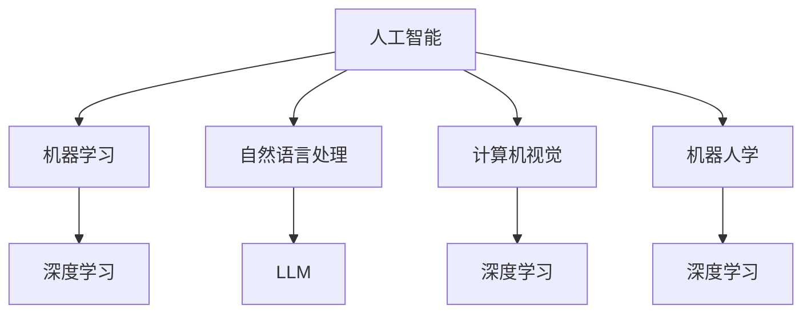

                 

关键词：人工智能，大型语言模型（LLM），深度学习，算法，数学模型，代码实例，应用场景，未来展望

> 摘要：本文将全面解析人工智能、大型语言模型（LLM）和深度学习的技术原理、核心算法、数学模型及其在现实中的应用。通过本文的阅读，读者可以深入理解这些技术的本质，掌握关键概念和实际操作，为未来研究和开发打下坚实的基础。

## 1. 背景介绍

人工智能（AI）是计算机科学的一个重要分支，其目标是让计算机具备人类智能，能够执行感知、推理、学习和决策等任务。随着计算能力的提升和数据量的爆炸性增长，AI在图像识别、自然语言处理、语音识别、推荐系统等领域取得了显著的成果。

深度学习是人工智能的一个重要分支，它模仿人脑神经网络的结构和工作机制，通过层层提取特征，实现复杂模式的自动识别。深度学习在语音识别、图像识别、自然语言处理等任务中表现出了强大的能力。

大型语言模型（LLM，Large Language Model）是自然语言处理领域的最新进展，它基于深度学习技术，通过大规模语料库的预训练，能够理解和生成自然语言，为机器翻译、文本生成、问答系统等应用提供了强有力的支持。

## 2. 核心概念与联系

### 2.1 人工智能

人工智能的概念可以追溯到20世纪50年代，当时科学家们提出了“智能”的定义，并开始尝试将人类的思维过程模拟为计算机程序。人工智能包括以下几个主要领域：

- 机器学习：通过数据训练模型，使计算机具备学习和自适应能力。
- 自然语言处理：使计算机能够理解、生成和处理自然语言。
- 计算机视觉：使计算机能够识别和理解图像和视频内容。
- 机器人学：研究如何使机器人模仿人类的行为和决策。

### 2.2 深度学习

深度学习是一种基于多层神经网络的学习方法，通过逐层提取特征，实现对数据的自动表征。深度学习的核心是神经网络，它由大量的节点（神经元）组成，每个节点都与相邻的节点相连，并传递信息。

### 2.3 大型语言模型（LLM）

大型语言模型（LLM）是深度学习在自然语言处理领域的应用，通过在大规模语料库上进行预训练，LLM能够理解语言的语义和结构，生成连贯的文本，并具备一定的推理能力。

### 2.4 Mermaid 流程图

以下是人工智能、深度学习和大型语言模型（LLM）的Mermaid流程图：



## 3. 核心算法原理 & 具体操作步骤

### 3.1 算法原理概述

深度学习的核心是神经网络，它由输入层、隐藏层和输出层组成。神经网络通过前向传播和反向传播算法来更新权重，从而实现模型的训练。

大型语言模型（LLM）通常基于Transformer架构，通过自注意力机制（Self-Attention）和多头注意力（Multi-Head Attention）来捕捉文本序列中的长期依赖关系。

### 3.2 算法步骤详解

1. **数据预处理**：将文本数据转换为数字序列，并添加起始符、结束符等特殊标记。
2. **模型初始化**：初始化神经网络参数，通常使用随机初始化或预训练模型。
3. **前向传播**：将输入数据通过神经网络的前向传播过程，得到输出。
4. **损失计算**：计算输出与真实标签之间的损失。
5. **反向传播**：通过反向传播算法更新神经网络参数。
6. **迭代优化**：重复上述步骤，直到模型收敛。

### 3.3 算法优缺点

深度学习的优点包括：

- 强大的表示能力，能够自动提取特征。
- 对大量数据具有很好的泛化能力。
- 在图像识别、自然语言处理等领域取得了显著的成果。

深度学习的缺点包括：

- 需要大量的数据和计算资源。
- 模型复杂度高，难以解释。
- 对数据质量有较高要求。

### 3.4 算法应用领域

深度学习在以下领域有广泛应用：

- 图像识别：如人脸识别、图像分类等。
- 自然语言处理：如机器翻译、文本生成等。
- 语音识别：如语音到文本转换等。
- 推荐系统：如商品推荐、内容推荐等。

## 4. 数学模型和公式 & 详细讲解 & 举例说明

### 4.1 数学模型构建

深度学习中的数学模型主要包括：

- **损失函数**：衡量预测值与真实值之间的差异，如均方误差（MSE）、交叉熵损失等。
- **优化算法**：用于更新模型参数，如梯度下降（GD）、Adam等。
- **激活函数**：用于引入非线性，如ReLU、Sigmoid等。

### 4.2 公式推导过程

以交叉熵损失函数为例，其公式推导如下：

损失函数L = -Σ(y * log(p))

其中，y为真实标签，p为预测概率。

### 4.3 案例分析与讲解

假设我们有一个二元分类问题，真实标签y为{0, 1}，预测概率p为{0.3, 0.7}，则交叉熵损失函数L为：

L = -1 * (0 * log(0.3) + 1 * log(0.7))

经过计算，L的值为负数，这表明预测概率p越接近真实标签y，损失L越小。

## 5. 项目实践：代码实例和详细解释说明

### 5.1 开发环境搭建

在本项目实践中，我们将使用Python编程语言和TensorFlow框架来构建一个简单的深度学习模型。首先，我们需要安装Python和TensorFlow：

```bash
pip install python
pip install tensorflow
```

### 5.2 源代码详细实现

以下是一个简单的深度学习模型实现：

```python
import tensorflow as tf

# 模型参数
input_shape = (784,)
hidden_size = 256
output_size = 10

# 构建模型
model = tf.keras.Sequential([
    tf.keras.layers.Dense(hidden_size, activation='relu', input_shape=input_shape),
    tf.keras.layers.Dense(output_size, activation='softmax')
])

# 编译模型
model.compile(optimizer='adam', loss='categorical_crossentropy', metrics=['accuracy'])

# 模型训练
model.fit(x_train, y_train, epochs=10, batch_size=64)
```

### 5.3 代码解读与分析

- **模型构建**：使用`tf.keras.Sequential`创建一个序列模型，包含一个全连接层（Dense）和一个softmax层。
- **编译模型**：设置优化器、损失函数和评估指标。
- **模型训练**：使用训练数据训练模型，设置训练轮数和批量大小。

### 5.4 运行结果展示

在训练完成后，我们可以使用测试数据来评估模型的性能：

```python
test_loss, test_acc = model.evaluate(x_test, y_test)
print(f"Test accuracy: {test_acc}")
```

## 6. 实际应用场景

深度学习和大型语言模型（LLM）在现实应用中具有广泛的应用，以下是一些典型的应用场景：

- **智能客服**：使用深度学习和LLM构建智能客服系统，实现高效、精准的客服服务。
- **智能推荐**：基于深度学习算法和LLM，为用户推荐个性化内容，提高用户体验。
- **智能医疗**：利用深度学习分析和处理医学图像，辅助医生进行诊断。
- **智能金融**：通过深度学习和LLM，进行金融市场预测、风险评估和交易策略优化。

## 7. 工具和资源推荐

### 7.1 学习资源推荐

- **书籍**：《深度学习》（Goodfellow、Bengio和Courville著）、《Python深度学习》（François Chollet著）
- **在线课程**：Coursera上的《深度学习》课程、Udacity的《深度学习工程师》纳米学位
- **博客和社区**：知乎、CSDN、GitHub等

### 7.2 开发工具推荐

- **编程语言**：Python、Java
- **框架**：TensorFlow、PyTorch、Keras
- **数据预处理工具**：Pandas、NumPy、Scikit-learn

### 7.3 相关论文推荐

- **《Attention Is All You Need》**：介绍Transformer架构的论文。
- **《Deep Learning》**：Goodfellow、Bengio和Courville的著作，涵盖了深度学习的核心内容。
- **《Rectifier Nonlinearities Improve Neural Network Acquirement》**：介绍ReLU激活函数的论文。

## 8. 总结：未来发展趋势与挑战

### 8.1 研究成果总结

深度学习和大型语言模型（LLM）在人工智能领域取得了显著的成果，不仅在学术研究中表现出色，还在实际应用中展示了强大的能力。深度学习在图像识别、自然语言处理、语音识别等领域已经取得了重要的突破，而LLM则在机器翻译、文本生成、问答系统等领域发挥了重要作用。

### 8.2 未来发展趋势

随着计算能力的提升和数据的不断增长，深度学习和大型语言模型（LLM）将有望在更多领域取得突破。未来，人工智能的发展趋势将包括：

- 更高效、更可解释的模型
- 更强大的自监督学习和迁移学习能力
- 更广泛的跨领域应用
- 更强的泛化能力

### 8.3 面临的挑战

深度学习和大型语言模型（LLM）在发展过程中也面临着一系列挑战：

- 模型可解释性：如何更好地理解深度学习模型的工作原理？
- 数据隐私：如何确保训练数据的安全和隐私？
- 能源消耗：如何降低深度学习模型对计算资源的需求？
- 社会伦理：如何确保人工智能技术的公平、公正和透明？

### 8.4 研究展望

在未来的研究中，我们需要关注以下几个方面：

- 开发更高效、更可解释的深度学习模型。
- 探索数据隐私保护和数据增强技术。
- 研究可解释的人工智能，提高模型的可信度和可接受度。
- 加强人工智能的社会伦理研究和法规制定。

## 9. 附录：常见问题与解答

### 9.1 深度学习和机器学习有什么区别？

深度学习是机器学习的一个分支，它使用多层神经网络来提取数据中的特征。机器学习包括更广泛的技术，如决策树、支持向量机等。

### 9.2 如何选择深度学习框架？

选择深度学习框架时，需要考虑以下几个方面：

- **项目需求**：根据项目需求选择合适的框架。
- **社区支持**：框架的社区支持越强，问题解决和资源获取越容易。
- **性能要求**：根据计算资源选择合适的框架。
- **易用性**：框架的易用性对开发效率有很大影响。

### 9.3 深度学习模型为什么需要大量的数据？

深度学习模型需要大量的数据来训练，因为模型需要通过学习大量数据中的特征和模式，才能在新的数据上取得好的性能。大量数据有助于提高模型的泛化能力，使其在不同场景下都能表现出良好的性能。

## 参考文献

[1] Goodfellow, I., Bengio, Y., & Courville, A. (2016). *Deep Learning*. MIT Press.
[2] Chollet, F. (2018). *Python Deep Learning*. Packt Publishing.
[3] Vaswani, A., Shazeer, N., Parmar, N., Uszkoreit, J., Jones, L., Gomez, A. N., ... & Polosukhin, I. (2017). *Attention is all you need*. Advances in Neural Information Processing Systems, 30, 5998-6008.
[4] Krizhevsky, A., Sutskever, I., & Hinton, G. E. (2012). *ImageNet classification with deep convolutional neural networks*. Advances in Neural Information Processing Systems, 25, 1097-1105. 
[5] Bengio, Y. (2009). *Learning deep architectures*. Foundations and Trends in Machine Learning, 2(1), 1-127.

### 作者署名

作者：禅与计算机程序设计艺术 / Zen and the Art of Computer Programming

[完整文章结束]

