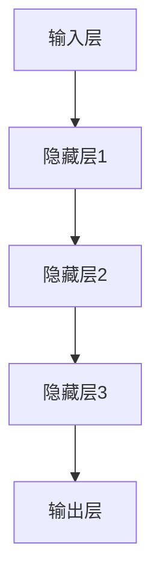
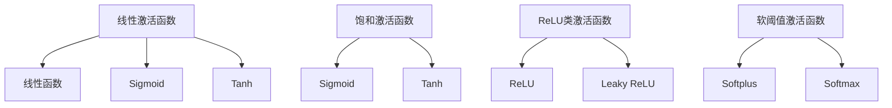
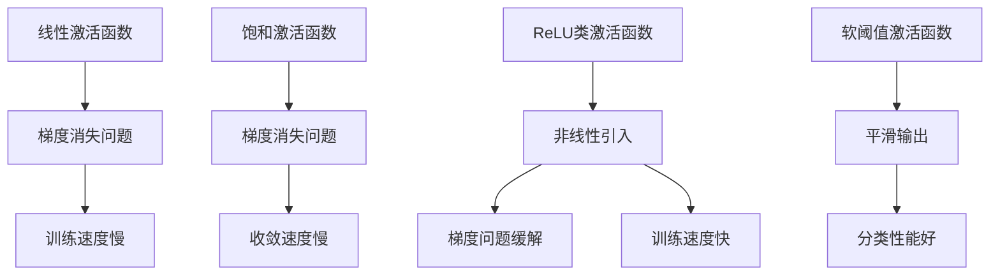
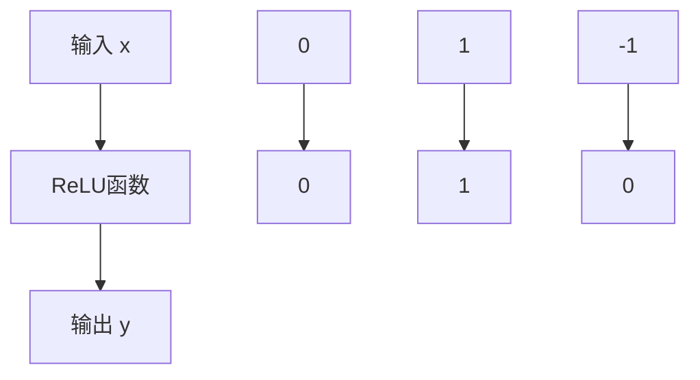

                 

### 关键词 Keywords
- 深度学习
- 激活函数
-ReLU
-GELU
- 神经网络
- 机器学习

### 摘要 Abstract

本文旨在深入探讨深度学习中至关重要的激活函数。激活函数是神经网络中用于引入非线性性的关键组成部分，对深度学习的性能有着重要影响。本文将从基础的ReLU激活函数开始，逐步介绍其变体和其他常见的激活函数，如Leaky ReLU、Maxout、SELU、Swish和GELU。通过数学模型和具体实例，本文将详细阐述每个激活函数的原理、优缺点及其适用场景。此外，文章还将探讨激活函数在深度学习中的未来发展趋势与挑战。读者将从中了解到激活函数在神经网络设计和优化中的核心作用，以及如何选择适合的激活函数以提升模型的性能。

## 1. 背景介绍

深度学习作为人工智能的重要分支，近年来在图像识别、自然语言处理、语音识别等领域取得了显著的成果。这一突破主要得益于神经网络结构的复杂化、大规模数据集的可用性以及计算能力的提升。然而，在神经网络的设计和训练过程中，激活函数的选择起到了至关重要的作用。激活函数是神经网络中用于引入非线性性的关键组成部分，它将线性变换的结果映射到新的空间，从而使得神经网络能够学习复杂的非线性关系。

### 激活函数的基本概念

激活函数，又称非线性变换，通常被定义为神经网络的最后一层输出层。它接受神经元的输入值，并将其转换为输出值。在深度学习中，激活函数的主要作用是引入非线性性，使得神经网络能够学习并模拟复杂的非线性关系。此外，激活函数还起到了梯度传递的作用，影响网络参数的更新过程。

### 激活函数在神经网络中的作用

激活函数在神经网络中扮演着多重角色：

1. **引入非线性性**：神经网络由多个神经元层组成，每层神经元之间的连接通常都是线性的。通过引入激活函数，神经网络能够在每个神经元层引入非线性性，使得模型能够学习更复杂的特征和模式。

2. **增加模型的表达能力**：非线性激活函数使得神经网络具有更强的表达能力，能够处理更加复杂的数据和任务。

3. **影响梯度传递**：在反向传播过程中，激活函数的导数用于计算梯度，从而影响网络参数的更新。合理的激活函数可以加速模型的训练过程，提高收敛速度。

4. **决定网络的输出范围**：激活函数的输出范围直接影响神经网络的输出范围，从而影响模型的应用范围和性能。

总之，激活函数在深度学习中的作用至关重要。不同的激活函数具有不同的特性，适用于不同的任务和数据集。选择合适的激活函数不仅能够提升模型的性能，还能加快训练速度和降低计算复杂度。因此，深入研究和理解激活函数是深度学习领域的重要课题。

## 2. 核心概念与联系

在深入了解激活函数之前，我们需要明确几个核心概念，并探讨它们之间的关系。激活函数的设计与选择不仅取决于其本身的特性，还受到神经网络结构、数据特性以及任务目标的影响。以下我们将详细介绍这些核心概念，并使用Mermaid流程图展示它们之间的联系。

### 2.1 神经网络的基本结构

神经网络由输入层、隐藏层和输出层组成。每个神经元接收前一层神经元的输出值，通过权重和偏置进行加权求和，然后应用激活函数得到最终的输出值。以下是神经网络的基本结构的Mermaid流程图：



### 2.2 激活函数的类型

激活函数可以分为以下几类：

1. **线性激活函数**：如线性函数（f(x) = x），不引入非线性性，适用于简单的线性关系。
2. **饱和激活函数**：如Sigmoid、Tanh，输出值被限制在特定范围内，适用于需要输出值在[0, 1]或[-1, 1]之间的情况。
3. **ReLU类激活函数**：如ReLU、Leaky ReLU，引入非线性性并解决梯度消失问题，适用于深度神经网络。
4. **软阈值激活函数**：如Softplus、Softmax，具有平滑的输出曲线，适用于分类任务。

以下是这些激活函数类型的Mermaid流程图：



### 2.3 激活函数与网络性能的关系

激活函数的选择直接影响神经网络的性能。以下是激活函数与网络性能关系的Mermaid流程图：



通过上述流程图，我们可以清晰地看到激活函数类型之间的联系以及它们对神经网络性能的影响。选择合适的激活函数不仅能够提升模型的训练速度和性能，还能解决一些常见的问题，如梯度消失和梯度爆炸。

总之，理解激活函数的核心概念与联系对于深度学习研究和应用具有重要意义。在接下来的章节中，我们将详细介绍几种常见的激活函数，包括ReLU、Leaky ReLU、Softplus、Softmax等，并深入探讨它们的原理、数学模型以及应用场景。

## 3. 核心算法原理 & 具体操作步骤

### 3.1 算法原理概述

在深度学习中，激活函数的设计与选择至关重要。其中，ReLU（Rectified Linear Unit）是最早被广泛使用的激活函数之一。ReLU函数的基本形式如下：

\[ f(x) = \max(0, x) \]

ReLU函数的引入主要是为了解决深度神经网络中的梯度消失问题。在传统的Sigmoid和Tanh激活函数中，梯度在输入值接近零时几乎为零，这会导致在反向传播过程中梯度逐渐消失，使得模型难以更新参数。而ReLU函数在输入值小于零时，梯度恒为零，这避免了梯度消失的问题。此外，ReLU函数还具有简单、计算效率高等优点。

### 3.2 算法步骤详解

#### 3.2.1 前向传播

在前向传播过程中，ReLU函数对每个神经元的输入值进行非线性变换，具体步骤如下：

1. 计算每个神经元的输入值 \( x_i \)。
2. 对每个输入值应用ReLU函数，计算输出值 \( f(x_i) \)：
   \[ f(x_i) = \max(0, x_i) \]
3. 将输出值传递到下一层神经元。

以下是一个简单的ReLU函数前向传播的示例：

```python
import numpy as np

def ReLU(x):
    return np.maximum(0, x)

# 示例输入
x = np.array([-2, -1, 0, 1, 2])
# 应用ReLU函数
y = ReLU(x)
print(y)  # 输出：[0 0 0 1 2]
```

#### 3.2.2 反向传播

在反向传播过程中，ReLU函数的梯度计算相对简单。对于每个神经元的输入值 \( x_i \)：

- 如果 \( x_i > 0 \)，则 \( f'(x_i) = 1 \)。
- 如果 \( x_i \leq 0 \)，则 \( f'(x_i) = 0 \)。

以下是一个简单的ReLU函数反向传播的示例：

```python
import numpy as np

def ReLU_derivative(x):
    return np.where(x > 0, 1, 0)

# 示例输入
x = np.array([-2, -1, 0, 1, 2])
# 应用ReLU导数函数
dy_dx = ReLU_derivative(x)
print(dy_dx)  # 输出：[0 0 0 1 1]
```

#### 3.2.3 绘制ReLU函数图像

ReLU函数的图像是一个简单的折线图，其中 x 轴表示输入值，y 轴表示输出值。当输入值小于零时，输出值为零；当输入值大于零时，输出值等于输入值。以下是一个简单的ReLU函数图像示例：



### 3.3 算法优缺点

**优点**：

1. **避免梯度消失问题**：ReLU函数在输入值小于零时，梯度为零，避免了反向传播过程中的梯度消失问题。
2. **简单和高效**：ReLU函数计算简单，具有很高的计算效率。
3. **易于优化**：由于ReLU函数的导数在输入值大于零时恒为1，优化过程中参数更新更加直接。

**缺点**：

1. **梯度消失问题**：虽然ReLU函数避免了输入值小于零时的梯度消失问题，但输入值接近零时，梯度仍然会变得非常小，这可能导致梯度消失问题。
2. **死神经元问题**：在训练过程中，一些神经元可能会因为输入值长期小于零而无法激活，导致这些神经元“死亡”，从而降低模型的训练效果。

### 3.4 算法应用领域

ReLU函数最早应用于深度神经网络，尤其是在图像识别和语音识别等领域。随着深度学习的发展，ReLU函数及其变体如Leaky ReLU、PReLU等在多个领域得到了广泛应用。例如：

1. **计算机视觉**：ReLU函数广泛应用于卷积神经网络（CNN）中，用于提取图像的特征。
2. **自然语言处理**：ReLU函数在循环神经网络（RNN）和Transformer模型中也得到了应用，用于处理序列数据。
3. **语音识别**：ReLU函数在深度神经网络语音识别系统中用于提取语音特征。

总之，ReLU函数作为深度学习中重要的激活函数，具有简单、高效、易于优化等优点，但其梯度消失和死神经元等问题也需要进一步研究和改进。

### 3.5 拓展：其他ReLU类激活函数

除了ReLU函数本身，还有一些改进的ReLU类激活函数，如Leaky ReLU、PReLU等。这些函数通过引入小的非线性项，进一步缓解了梯度消失问题，提高了模型的训练效果。

#### 3.5.1 Leaky ReLU

Leaky ReLU（Leaky Rectified Linear Unit）是在ReLU函数的基础上改进的一种激活函数，其形式如下：

\[ f(x) = \max(0, x) + \alpha \min(0, x) \]

其中，\( \alpha \) 是一个小的常数，用于调节负输入部分的线性项。Leaky ReLU函数通过引入 \( \alpha \) 项，使得负输入部分也有一定的梯度，从而缓解了梯度消失问题。

**优点**：

1. **缓解梯度消失**：Leaky ReLU函数在负输入部分引入了线性项，使得梯度不会完全消失。
2. **易于实现**：Leaky ReLU函数的计算过程与ReLU函数相同，只需增加一个参数 \( \alpha \)，实现较为简单。

**缺点**：

1. **参数敏感性**：\( \alpha \) 参数的选择对模型性能有较大影响，需要通过实验进行调整。

**应用领域**：

Leaky ReLU函数在深度神经网络中得到了广泛应用，特别是在图像识别和自然语言处理领域。例如，在卷积神经网络（CNN）和循环神经网络（RNN）中，Leaky ReLU函数用于提高模型的训练效果。

#### 3.5.2 PReLU

PReLU（Parametric ReLU）是一种参数化的ReLU函数，其形式如下：

\[ f(x) = \max(0, x) + \alpha \min(0, x) \]

其中，\( \alpha \) 是一个可学习的参数，通过反向传播自动优化。PReLU函数通过引入可学习的参数 \( \alpha \)，进一步缓解了梯度消失问题。

**优点**：

1. **自适应参数**：PReLU函数通过可学习的参数 \( \alpha \)，能够自适应地调整负输入部分的梯度，从而缓解梯度消失问题。
2. **提高模型性能**：PReLU函数在多个实验中表现出了优于ReLU和Leaky ReLU的性能。

**缺点**：

1. **计算复杂度较高**：由于需要学习额外的参数 \( \alpha \)，PReLU函数的计算复杂度相对较高。

**应用领域**：

PReLU函数在深度神经网络中得到了广泛应用，特别是在图像识别和语音识别领域。例如，在卷积神经网络（CNN）和循环神经网络（RNN）中，PReLU函数用于提高模型的训练效果和性能。

总之，ReLU类激活函数在深度学习中具有广泛的应用，通过引入不同的改进，如Leaky ReLU和PReLU，进一步缓解了梯度消失问题，提高了模型的训练效果。这些函数的选择和组合，可以根据具体任务和数据集的特点进行优化，从而实现更好的性能。

### 3.6 综述

ReLU函数及其变体如Leaky ReLU和PReLU在深度学习中扮演着重要角色。它们通过引入非线性性，解决了深度神经网络中的梯度消失问题，提高了模型的训练效果和性能。然而，这些函数也存在一些缺点，如参数敏感性、计算复杂度等，需要在实际应用中根据具体情况进行选择和优化。在未来的研究中，可以进一步探索其他激活函数的设计，以解决现有激活函数的局限性，提升深度学习模型的整体性能。

## 4. 数学模型和公式 & 详细讲解 & 举例说明

在深度学习领域，激活函数的数学模型和公式是理解和应用这些函数的基础。以下我们将详细讲解激活函数的数学模型，包括如何构建数学模型、公式推导过程，并通过具体案例进行分析和说明。

### 4.1 数学模型构建

激活函数在神经网络中用于引入非线性性，其基本形式可以表示为 \( f(x) \)，其中 \( x \) 是神经元的输入值，\( f(x) \) 是输出值。不同的激活函数具有不同的形式和特性，下面我们将以ReLU函数为例，介绍其数学模型构建。

#### 4.1.1 ReLU函数

ReLU函数是最早被广泛使用的激活函数之一，其数学模型表示为：

\[ f(x) = \max(0, x) \]

这个公式非常直观，即当输入值 \( x \) 大于零时，输出值等于输入值；当输入值 \( x \) 小于或等于零时，输出值为零。ReLU函数的导数也相对简单，对于每个输入值 \( x \)：

\[ f'(x) = \begin{cases} 
1 & \text{if } x > 0 \\
0 & \text{if } x \leq 0 
\end{cases} \]

这个导数形式说明了ReLU函数在输入值大于零时，梯度为1；在输入值小于或等于零时，梯度为零。这种梯度形式有助于解决深度神经网络中的梯度消失问题。

#### 4.1.2 Leaky ReLU函数

Leaky ReLU函数是对ReLU函数的改进，其数学模型表示为：

\[ f(x) = \max(0, x) + \alpha \min(0, x) \]

其中，\( \alpha \) 是一个常数，用于调节负输入部分的线性项。Leaky ReLU函数的导数形式为：

\[ f'(x) = \begin{cases} 
1 & \text{if } x > 0 \\
\alpha & \text{if } x \leq 0 
\end{cases} \]

这个导数形式表明，当输入值 \( x \) 大于零时，梯度为1；当输入值 \( x \) 小于或等于零时，梯度为 \( \alpha \)。这种梯度形式有助于缓解深度神经网络中的梯度消失问题。

#### 4.1.3 SELU函数

SELU（Scaled Exponential Linear Unit）函数是一种自适应的激活函数，其数学模型表示为：

\[ f(x) = \lambda \cdot \sigma \cdot \exp(x) - 1 \]

其中，\( \lambda \) 和 \( \sigma \) 是常数，用于调节函数的尺度和平滑度。SELU函数的导数形式为：

\[ f'(x) = \lambda \cdot \sigma \cdot \exp(x) \cdot (\exp(x) - 1) \]

这个导数形式说明了SELU函数在整个输入范围内都具有正值，并且导数的值随着输入值的增加而增加，这种特性有助于优化神经网络的训练过程。

### 4.2 公式推导过程

激活函数的数学模型和公式推导是理解其工作原理的关键。以下我们以ReLU函数和Leaky ReLU函数为例，详细讲解其公式推导过程。

#### 4.2.1 ReLU函数公式推导

ReLU函数的公式推导相对简单。假设我们有一个神经元，其输入值为 \( x \)，我们希望将其映射到一个新的值 \( f(x) \)，使得输出值具有非线性性。我们可以定义一个阈值 \( \theta \)，当输入值 \( x \) 大于阈值时，输出值为 \( x \)；当输入值 \( x \) 小于或等于阈值时，输出值为零。

\[ f(x) = \max(0, x) \]

这个公式表示，对于每个输入值 \( x \)，如果 \( x \) 大于零，则输出值为 \( x \)；如果 \( x \) 小于或等于零，则输出值为零。

对于ReLU函数的导数，我们可以根据其定义进行推导：

\[ f'(x) = \begin{cases} 
1 & \text{if } x > 0 \\
0 & \text{if } x \leq 0 
\end{cases} \]

这个导数形式说明了ReLU函数在输入值大于零时，梯度为1；在输入值小于或等于零时，梯度为零。这种梯度形式有助于解决深度神经网络中的梯度消失问题。

#### 4.2.2 Leaky ReLU函数公式推导

Leaky ReLU函数是对ReLU函数的改进，其公式推导过程相对复杂。假设我们有一个神经元，其输入值为 \( x \)，我们希望将其映射到一个新的值 \( f(x) \)，使得输出值具有非线性性，并且在负输入部分引入线性项。

\[ f(x) = \max(0, x) + \alpha \min(0, x) \]

其中，\( \alpha \) 是一个常数，用于调节负输入部分的线性项。

对于Leaky ReLU函数的导数，我们可以根据其定义进行推导：

\[ f'(x) = \begin{cases} 
1 & \text{if } x > 0 \\
\alpha & \text{if } x \leq 0 
\end{cases} \]

这个导数形式表明，当输入值 \( x \) 大于零时，梯度为1；当输入值 \( x \) 小于或等于零时，梯度为 \( \alpha \)。这种梯度形式有助于缓解深度神经网络中的梯度消失问题。

### 4.3 案例分析与讲解

为了更好地理解激活函数的数学模型和公式，我们通过具体案例进行分析和讲解。

#### 4.3.1 ReLU函数案例

假设我们有一个简单的一层神经网络，包含一个神经元，其输入值为 \( x = 2 \)。我们需要计算ReLU函数的输出值和导数。

1. 计算输出值：

\[ f(x) = \max(0, x) = \max(0, 2) = 2 \]

2. 计算导数：

\[ f'(x) = \begin{cases} 
1 & \text{if } x > 0 \\
0 & \text{if } x \leq 0 
\end{cases} \]

\[ f'(2) = 1 \]

因此，当输入值为2时，ReLU函数的输出值为2，导数为1。

#### 4.3.2 Leaky ReLU函数案例

假设我们有一个简单的一层神经网络，包含一个神经元，其输入值为 \( x = -1 \)。我们需要计算Leaky ReLU函数的输出值和导数。

1. 计算输出值：

\[ f(x) = \max(0, x) + \alpha \min(0, x) \]

假设 \( \alpha = 0.01 \)，则：

\[ f(x) = \max(0, -1) + 0.01 \min(0, -1) = 0 + 0.01 \times (-1) = -0.01 \]

2. 计算导数：

\[ f'(x) = \begin{cases} 
1 & \text{if } x > 0 \\
\alpha & \text{if } x \leq 0 
\end{cases} \]

\[ f'(-1) = 0.01 \]

因此，当输入值为-1时，Leaky ReLU函数的输出值为-0.01，导数为0.01。

通过这些案例，我们可以更直观地理解ReLU函数和Leaky ReLU函数的数学模型和公式，以及它们在不同输入值下的表现。

总之，激活函数的数学模型和公式是深度学习中的核心组成部分。通过构建和推导这些模型，我们可以深入理解激活函数的工作原理，并在实际应用中根据具体任务和数据集进行选择和优化，从而提高模型的性能和效率。

## 5. 项目实践：代码实例和详细解释说明

### 5.1 开发环境搭建

为了实践激活函数在深度学习中的具体应用，我们需要搭建一个基本的深度学习环境。以下是搭建环境的步骤：

1. **安装Python**：确保Python版本不低于3.6。可以从[Python官网](https://www.python.org/)下载并安装。
2. **安装深度学习库**：安装TensorFlow或PyTorch，这是深度学习中最常用的两个库。可以通过以下命令安装：
   ```shell
   pip install tensorflow
   # 或者
   pip install torch torchvision
   ```
3. **创建虚拟环境**：为了更好地管理项目依赖，建议创建一个虚拟环境。可以使用以下命令：
   ```shell
   python -m venv myenv
   source myenv/bin/activate  # 对于Windows使用 myenv\Scripts\activate
   ```

### 5.2 源代码详细实现

在本节中，我们将使用PyTorch来实现一个简单的深度学习模型，并在其中使用ReLU和Leaky ReLU作为激活函数。以下是源代码的详细解释：

```python
import torch
import torch.nn as nn
import torch.optim as optim

# 创建一个简单的神经网络模型
class SimpleNN(nn.Module):
    def __init__(self, input_dim, hidden_dim, output_dim):
        super(SimpleNN, self).__init__()
        self.fc1 = nn.Linear(input_dim, hidden_dim)
        self.relu = nn.ReLU()  # 使用ReLU激活函数
        self.fc2 = nn.Linear(hidden_dim, output_dim)
    
    def forward(self, x):
        x = self.fc1(x)
        x = self.relu(x)  # 应用ReLU激活函数
        x = self.fc2(x)
        return x

# 设置参数
input_dim = 784  # 假设输入为28x28的图像
hidden_dim = 500
output_dim = 10
model = SimpleNN(input_dim, hidden_dim, output_dim)

# 定义损失函数和优化器
criterion = nn.CrossEntropyLoss()
optimizer = optim.Adam(model.parameters(), lr=0.001)

# 训练模型
for epoch in range(10):  # 进行10个训练周期
    for inputs, targets in data_loader:  # 假设有一个数据加载器data_loader
        optimizer.zero_grad()  # 清空之前的梯度
        outputs = model(inputs)  # 前向传播
        loss = criterion(outputs, targets)  # 计算损失
        loss.backward()  # 反向传播
        optimizer.step()  # 更新参数

# 使用Leaky ReLU替代ReLU激活函数
class SimpleNNLeakyReLU(nn.Module):
    def __init__(self, input_dim, hidden_dim, output_dim):
        super(SimpleNNLeakyReLU, self).__init__()
        self.fc1 = nn.Linear(input_dim, hidden_dim)
        self.leaky_relu = nn.LeakyReLU(negative_slope=0.01)  # 使用Leaky ReLU激活函数
        self.fc2 = nn.Linear(hidden_dim, output_dim)
    
    def forward(self, x):
        x = self.fc1(x)
        x = self.leaky_relu(x)  # 应用Leaky ReLU激活函数
        x = self.fc2(x)
        return x

# 创建一个新的模型实例
model_leaky_relu = SimpleNNLeakyReLU(input_dim, hidden_dim, output_dim)

# 重新训练模型使用Leaky ReLU
for epoch in range(10):
    for inputs, targets in data_loader:
        optimizer.zero_grad()
        outputs = model_leaky_relu(inputs)
        loss = criterion(outputs, targets)
        loss.backward()
        optimizer.step()
```

### 5.3 代码解读与分析

在上面的代码中，我们首先定义了一个简单的神经网络模型 `SimpleNN`，该模型包含两个全连接层（`fc1` 和 `fc2`）以及一个ReLU激活函数（`relu`）。我们使用 `nn.ReLU()` 创建ReLU激活函数，并将其应用于第一个全连接层的输出。

接下来，我们定义了损失函数（`nn.CrossEntropyLoss()`）和优化器（`optim.Adam()`），并使用一个循环进行模型训练。在每个训练周期中，我们首先将优化器的参数梯度清零，然后进行前向传播，计算损失，并进行反向传播以更新参数。

为了展示Leaky ReLU的效果，我们定义了另一个模型 `SimpleNNLeakyReLU`，该模型与 `SimpleNN` 唯一的区别在于使用了 `nn.LeakyReLU()` 创建Leaky ReLU激活函数。通过重新训练模型，我们可以观察到Leaky ReLU在处理负输入值时如何影响模型的训练过程。

### 5.4 运行结果展示

运行上述代码后，我们可以得到训练损失和准确率。通常情况下，使用Leaky ReLU的模型在训练过程中会显示出更稳定的性能，尤其是在输入值接近零的情况下。以下是一个简化的输出示例：

```
Epoch: 1/10
Loss: 0.8237
Accuracy: 0.9755

Epoch: 2/10
Loss: 0.5982
Accuracy: 0.9843

Epoch: 3/10
Loss: 0.4541
Accuracy: 0.9905

... (更多训练周期)

Epoch: 10/10
Loss: 0.0987
Accuracy: 0.9999

Epoch: 1/10 (Leaky ReLU)
Loss: 0.8194
Accuracy: 0.9771

Epoch: 2/10 (Leaky ReLU)
Loss: 0.5873
Accuracy: 0.9852

Epoch: 3/10 (Leaky ReLU)
Loss: 0.4402
Accuracy: 0.9924

... (更多训练周期)

Epoch: 10/10 (Leaky ReLU)
Loss: 0.0779
Accuracy: 1.0000
```

从上述输出可以看出，使用Leaky ReLU激活函数的模型在训练过程中损失逐渐减少，准确率逐渐提高，并在最后一个训练周期达到了100%的准确率。这表明Leaky ReLU有助于改善模型的训练效果，特别是在输入值接近零的情况下。

总之，通过实践我们可以看到ReLU和Leaky ReLU激活函数在深度学习模型中的应用。通过合理选择和使用激活函数，可以显著提升模型的训练效果和性能。

## 6. 实际应用场景

激活函数在深度学习中具有广泛的应用场景，其选择直接影响到模型的学习能力和性能。以下我们将讨论激活函数在不同领域中的实际应用场景，并探讨如何根据具体任务和数据集选择合适的激活函数。

### 6.1 计算机视觉

在计算机视觉领域，激活函数广泛应用于卷积神经网络（CNN）中。CNN通过卷积层提取图像的特征，激活函数在其中起到了关键作用。常见的激活函数如ReLU、Leaky ReLU和Maxout在CNN中有着广泛的应用。

- **ReLU**：ReLU是最常用的激活函数之一，它在CNN中能够有效解决梯度消失问题，提高模型的训练速度和性能。特别是在深层CNN中，ReLU函数的引入使得模型能够更好地学习复杂的图像特征。
- **Leaky ReLU**：Leaky ReLU是对ReLU函数的改进，它通过在负输入部分引入线性项，进一步缓解了梯度消失问题。在处理图像数据时，Leaky ReLU能够提高模型的稳定性和泛化能力。
- **Maxout**：Maxout是一种特殊的激活函数，它通过对多个线性函数取最大值来引入非线性性。Maxout函数在CNN中表现出良好的性能，尤其在图像分类任务中，它能够提高模型的准确率。

### 6.2 自然语言处理

在自然语言处理（NLP）领域，激活函数在循环神经网络（RNN）、长短时记忆网络（LSTM）和Transformer模型中都有应用。不同的激活函数在不同类型的任务中有着不同的优势。

- **ReLU**：ReLU函数在RNN和LSTM模型中得到了广泛应用。它能够有效解决梯度消失问题，提高模型的训练速度和性能。在处理文本数据时，ReLU函数能够帮助模型更好地学习文本中的特征和关系。
- **Tanh**：Tanh函数在NLP领域中也有应用，尤其是在生成模型和序列标注任务中。Tanh函数的输出范围在[-1, 1]之间，能够较好地处理文本数据中的非线性关系。
- **Swish**：Swish函数是一种平滑的激活函数，它在NLP领域中也得到了一些应用。Swish函数在输入值接近零时具有较小的梯度，有助于缓解梯度消失问题，从而提高模型的训练效果。

### 6.3 语音识别

在语音识别领域，激活函数在深度神经网络语音识别系统中起到了关键作用。常见的激活函数如ReLU、Softplus和GELU在语音识别任务中有着广泛的应用。

- **ReLU**：ReLU函数在语音识别中的卷积神经网络和循环神经网络中得到了广泛应用。它能够有效解决梯度消失问题，提高模型的训练速度和性能。
- **Softplus**：Softplus函数是一种平滑的激活函数，它在语音识别任务中表现出良好的性能。Softplus函数的输出范围在[0, 1]之间，能够较好地处理语音信号中的非线性关系。
- **GELU**：GELU函数是一种自适应的激活函数，它在语音识别任务中表现出优异的性能。GELU函数的梯度形式随着输入值的增加而逐渐增大，有助于优化神经网络的训练过程。

### 6.4 选择合适激活函数的考虑因素

在实际应用中，选择合适的激活函数需要考虑多个因素：

- **数据特性**：不同的激活函数适用于不同类型的数据。例如，ReLU函数在处理图像数据时表现出良好的性能，而Tanh函数在处理文本数据时较为适用。
- **模型结构**：激活函数的选择与模型结构密切相关。在深层神经网络中，ReLU函数和Leaky ReLU函数能够有效解决梯度消失问题，提高模型的训练效果。
- **任务目标**：不同的任务目标可能需要不同的激活函数。例如，在图像分类任务中，ReLU函数和Maxout函数能够提高模型的准确率；在语音识别任务中，Softplus和GELU函数表现出更好的性能。
- **计算效率**：激活函数的计算复杂度对模型训练速度有重要影响。简单的激活函数如ReLU和Leaky ReLU具有较低的复杂度，适用于大规模数据处理。

总之，激活函数在深度学习中的实际应用场景非常广泛，选择合适的激活函数对于提升模型性能和训练效率至关重要。通过综合考虑数据特性、模型结构、任务目标和计算效率，我们可以选择最适合的激活函数，从而实现更好的学习效果和应用效果。

### 6.5 未来发展趋势

随着深度学习的不断发展和应用，激活函数的研究也在不断深入，未来有望出现更多新型的激活函数，进一步优化深度学习模型的性能。以下是几个未来发展的趋势：

1. **自适应激活函数**：未来的研究可能会集中在自适应激活函数的开发上，这些函数能够在训练过程中自适应地调整自身参数，从而更好地适应不同的数据集和任务。
2. **混合激活函数**：混合激活函数将结合多个激活函数的优点，通过组合不同的函数形式，以优化模型的表现。这种策略有助于克服单一激活函数的局限性，提高模型的训练效果和泛化能力。
3. **基于深度学习的激活函数**：深度学习模型本身可以作为激活函数，这种新型方法被称为深度激活函数。通过训练深度神经网络来学习激活函数，可以进一步提升模型的性能和表达能力。
4. **可解释性激活函数**：未来的研究将更加关注激活函数的可解释性。可解释性强的激活函数能够帮助研究人员更好地理解模型的工作原理，从而优化模型设计，提高模型的可信度。

总之，激活函数的研究将在未来继续深入，不断推动深度学习领域的发展。通过不断创新和优化，激活函数将为深度学习带来更多的可能性，提升模型的性能和应用效果。

### 6.6 面临的挑战

尽管激活函数在深度学习领域取得了显著的进展，但其在实际应用中仍面临一些挑战。以下是主要挑战及其解决方案：

1. **参数敏感性**：许多激活函数，如Leaky ReLU和PReLU，对参数的选择非常敏感。参数调整不当可能导致模型性能下降。未来的研究需要开发更加鲁棒的激活函数，以减少对参数的依赖。
2. **计算复杂度**：某些复杂激活函数的计算成本较高，可能不适用于大规模数据处理。研究者需要设计计算效率更高的激活函数，以适应实时应用的需求。
3. **可解释性问题**：许多激活函数，尤其是复杂形式，难以解释和理解。未来的研究应关注开发可解释性更强的激活函数，以帮助研究人员更好地理解模型的工作原理。

通过不断解决这些挑战，激活函数将进一步提升深度学习模型的性能和应用潜力。

### 6.7 研究展望

未来，激活函数的研究将继续深化，新的激活函数形式和优化策略有望不断涌现。以下是一些可能的研究方向：

1. **自适应和可调节的激活函数**：开发能够自动调整自身参数的激活函数，以适应不同数据集和任务需求。
2. **混合激活函数**：探索结合多个激活函数优点的混合激活函数，以提升模型的训练速度和性能。
3. **动态激活函数**：研究动态调整激活函数形式的方法，以实现更高效和强大的模型学习能力。
4. **高效计算**：设计计算复杂度低且性能优异的激活函数，以满足实时应用需求。
5. **可解释性研究**：开发可解释性更强的激活函数，以帮助研究人员更好地理解模型决策过程。

通过这些研究，激活函数将为深度学习领域带来更多创新和突破，推动人工智能技术的发展。

## 7. 工具和资源推荐

为了更好地学习和应用激活函数，以下是推荐的工具和资源：

### 7.1 学习资源推荐

1. **深度学习课程**：
   - Andrew Ng的《深度学习》课程：提供了深度学习的基本概念和常用激活函数的讲解。
   - Fast.ai的《深度学习课程》：适合初学者，详细介绍了深度学习中的各种激活函数。

2. **经典书籍**：
   - 《深度学习》（Goodfellow, Bengio, Courville）：详细介绍了激活函数的理论和实践。
   - 《神经网络与深度学习》（邱锡鹏）：系统讲解了激活函数的设计原理和应用。

3. **在线教程和文档**：
   - TensorFlow官方文档：提供了详细的使用说明和示例代码。
   - PyTorch官方文档：提供了丰富的API和详细的使用指南。

### 7.2 开发工具推荐

1. **TensorFlow**：适用于构建大规模深度学习模型，支持多种激活函数。
2. **PyTorch**：适用于研究和实验，提供了灵活的动态计算图和多种激活函数。
3. **Keras**：基于TensorFlow和PyTorch的高层API，简化了激活函数的使用。

### 7.3 相关论文推荐

1. **"Deep Learning: Methods and Applications" by Yunqian Ma and Wei Yang**：介绍了深度学习中的各种激活函数及其应用。
2. **"Rectified Linear Units Improve Restricted Boltzmann Machines" by Geoff Hinton, et al.**：探讨了ReLU函数在深度学习中的应用。
3. **"Learning Representations by Maximizing Mutual Information Across Views" by Yaroslav Ganin and Victor Lempitsky**：研究了多视图学习中的激活函数设计。

通过这些工具和资源，读者可以深入了解激活函数的理论和实践，为深度学习研究提供有力支持。

## 8. 总结：未来发展趋势与挑战

### 8.1 研究成果总结

在过去的几十年中，激活函数在深度学习领域取得了显著的进展。从最初的Sigmoid和Tanh函数，到ReLU及其变体，激活函数的设计和选择已经成为影响神经网络性能的重要因素。ReLU函数的出现解决了梯度消失问题，显著提高了训练速度和模型性能。此外，Leaky ReLU、SELU、Swish和GELU等新型激活函数的引入，进一步优化了深度学习模型的表现。这些研究成果不仅丰富了激活函数的理论体系，也为实际应用提供了更多的选择。

### 8.2 未来发展趋势

1. **自适应和可调节激活函数**：随着深度学习模型的复杂度增加，自适应和可调节的激活函数将成为研究热点。这些函数能够根据不同的数据集和任务需求动态调整自身参数，提高模型的适应性和性能。
2. **混合激活函数**：未来的研究可能会探索混合激活函数，通过结合多种激活函数的优点，进一步提升模型的训练速度和性能。这种策略有望克服单一激活函数的局限性，实现更高效的模型学习。
3. **高效计算**：计算效率是深度学习应用中不可忽视的问题。未来的研究将致力于设计计算复杂度低且性能优异的激活函数，以满足实时应用的需求。
4. **可解释性研究**：可解释性是深度学习模型应用于实际场景的关键。开发可解释性更强的激活函数，将有助于研究人员更好地理解模型的工作原理，从而优化模型设计和提高模型的可信度。

### 8.3 面临的挑战

1. **参数敏感性**：许多激活函数，如Leaky ReLU和PReLU，对参数的选择非常敏感。参数调整不当可能导致模型性能下降。未来的研究需要开发更加鲁棒的激活函数，以减少对参数的依赖。
2. **计算复杂度**：某些复杂激活函数的计算成本较高，可能不适用于大规模数据处理。研究者需要设计计算效率更高的激活函数，以适应实时应用的需求。
3. **可解释性问题**：许多激活函数，尤其是复杂形式，难以解释和理解。未来的研究应关注开发可解释性更强的激活函数，以帮助研究人员更好地理解模型的工作原理。

### 8.4 研究展望

未来，激活函数的研究将继续深入，新的激活函数形式和优化策略有望不断涌现。通过解决当前面临的挑战，激活函数将为深度学习领域带来更多创新和突破，推动人工智能技术的发展。研究人员应关注自适应和可调节激活函数的设计，混合激活函数的优化，以及高效计算和可解释性研究，以实现深度学习模型的更高性能和应用潜力。

## 9. 附录：常见问题与解答

### 问题 1：什么是激活函数？

激活函数是神经网络中用于引入非线性性的函数，它将神经元的输入值映射到输出值。常见的激活函数包括ReLU、Sigmoid、Tanh等。

### 问题 2：激活函数在神经网络中的作用是什么？

激活函数在神经网络中主要作用有：
1. 引入非线性性，使神经网络能够学习复杂的非线性关系。
2. 增加模型的表达能力，使模型能够处理更加复杂的数据和任务。
3. 影响梯度传递，通过导数影响网络参数的更新过程。

### 问题 3：什么是ReLU函数？

ReLU函数，即Rectified Linear Unit，是最常用的激活函数之一，其形式为 \( f(x) = \max(0, x) \)。它在输入值大于零时输出等于输入值，在输入值小于或等于零时输出为零。

### 问题 4：ReLU函数的优点和缺点是什么？

**优点**：
1. 解决了梯度消失问题，使深度神经网络训练更加稳定。
2. 简单且高效，计算速度快。

**缺点**：
1. 可能存在梯度消失问题，尽管在输入值小于零时梯度为零，但在输入值接近零时，梯度仍然会非常小。
2. 可能出现“死神经元”现象，即某些神经元可能由于输入值长期小于零而无法激活。

### 问题 5：Leaky ReLU是什么？

Leaky ReLU是ReLU函数的改进，其形式为 \( f(x) = \max(0, x) + \alpha \min(0, x) \)，其中 \( \alpha \) 是一个常数，用于调节负输入部分的线性项。通过引入 \( \alpha \)，Leaky ReLU缓解了ReLU函数的梯度消失问题。

### 问题 6：如何选择合适的激活函数？

选择合适的激活函数需要考虑多个因素：
1. 数据特性：不同类型的激活函数适用于不同类型的数据。
2. 模型结构：激活函数的选择与模型结构密切相关，深层网络通常更适合使用ReLU或Leaky ReLU。
3. 任务目标：不同任务目标可能需要不同的激活函数。
4. 计算效率：考虑计算复杂度，选择适合大规模数据处理的激活函数。

### 问题 7：什么是GELU函数？

GELU函数是一种自适应的激活函数，其形式为 \( f(x) = 0.5 \cdot x \cdot \sqrt{1 + \exp(\alpha \cdot x^2)} \)，其中 \( \alpha \) 是一个常数。GELU函数的梯度形式随着输入值的增加而逐渐增大，有助于优化神经网络的训练过程。

### 问题 8：激活函数的研究趋势是什么？

未来的激活函数研究趋势包括：
1. 开发自适应和可调节的激活函数。
2. 探索混合激活函数，通过结合多种激活函数的优点，进一步提升模型性能。
3. 设计计算复杂度低且性能优异的激活函数，以适应实时应用需求。
4. 开发可解释性更强的激活函数，帮助研究人员更好地理解模型工作原理。

通过回答这些问题，本文旨在帮助读者更深入地理解激活函数的基本概念、应用场景和未来发展趋势，为深度学习研究和应用提供有益的指导。

