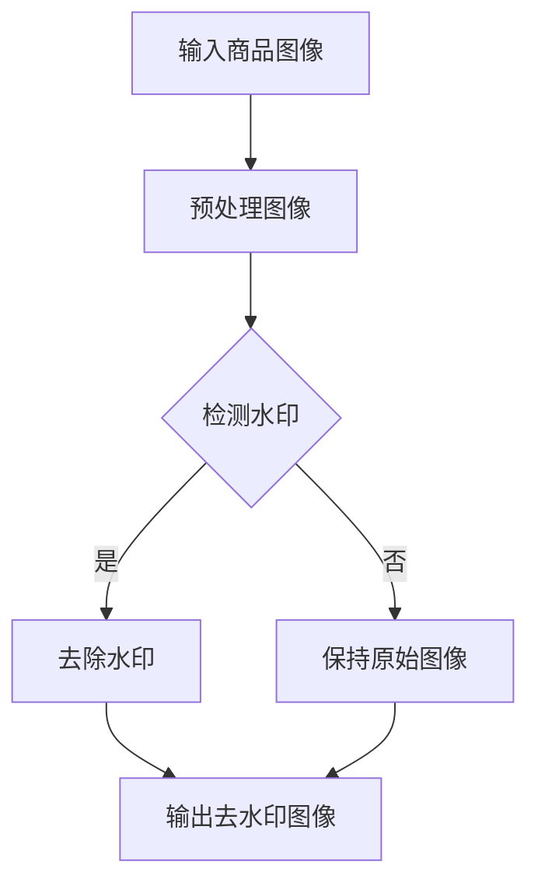

                 

关键词：商品图像、深度学习、去水印技术、图像识别、算法优化、应用场景、未来展望

## 摘要

本文主要探讨了深度学习技术在商品图像去水印领域的应用与创新。通过介绍去水印技术的背景和挑战，分析了深度学习算法在去水印任务中的优势，以及具体的算法原理、数学模型和实现步骤。同时，本文还通过实际项目实践展示了去水印技术的应用效果，并对未来去水印技术的发展趋势和面临的挑战进行了展望。

## 1. 背景介绍

### 1.1 商品图像去水印的必要性

随着电子商务的迅猛发展，商品图像的展示成为了商家吸引消费者的重要手段。然而，商品图像中往往包含一些水印信息，这些水印可能是用于版权保护、广告宣传或者库存管理等目的。尽管水印信息对商家和版权所有者有一定价值，但对消费者和平台运营方来说，过多的水印信息会降低商品图像的美观度和展示效果，影响用户体验。

因此，商品图像去水印技术显得尤为重要。去水印技术旨在从商品图像中移除水印信息，使图像更加清晰、美观，提升用户体验。此外，去水印技术还可以为图像编辑和后期处理提供便利，进一步丰富电子商务平台的视觉内容。

### 1.2 去水印技术的挑战

尽管去水印技术在图像处理领域已经取得了一定的进展，但仍面临诸多挑战。首先，商品图像中的水印信息具有多样性，包括文字、图案、Logo等，且可能存在于图像的任何位置和尺寸。这使得传统的基于规则或图像处理算法的去水印方法难以应对复杂的水印场景。

其次，商品图像中往往包含丰富的纹理和细节信息，这些信息在去水印过程中可能被过度削弱或破坏。如何平衡去水印效果和图像质量，保持图像的原始细节和真实性，是去水印技术需要解决的核心问题。

最后，随着深度学习技术的不断进步，如何在去水印任务中充分利用深度学习的优势，提高去水印的准确性和效率，也是当前研究的热点问题。

## 2. 核心概念与联系

为了实现商品图像去水印，我们需要理解以下几个核心概念：

### 2.1 深度学习

深度学习是一种基于多层神经网络的学习方法，通过多层次的抽象和特征提取，可以自动从数据中学习到复杂的模式和规律。在图像处理领域，深度学习技术被广泛应用于目标检测、图像分类、图像生成等任务。

### 2.2 卷积神经网络（CNN）

卷积神经网络是一种特殊的神经网络结构，通过卷积操作和池化操作，可以从图像数据中自动提取局部特征和全局特征。在去水印任务中，CNN可以用于检测和去除图像中的水印信息。

### 2.3 生成对抗网络（GAN）

生成对抗网络是一种由生成器和判别器组成的神经网络结构，通过对抗训练，生成器可以生成逼真的图像，判别器则用于判断图像的真实性和生成图像的逼真度。在去水印任务中，GAN可以用于生成去除水印后的图像。

### 2.4 Mermaid 流程图

以下是一个去水印技术的 Mermaid 流程图，展示了深度学习算法在去水印任务中的基本流程：



## 3. 核心算法原理 & 具体操作步骤

### 3.1 算法原理概述

商品图像去水印的核心算法主要基于深度学习技术，包括卷积神经网络（CNN）和生成对抗网络（GAN）。CNN用于检测和去除图像中的水印信息，GAN则用于生成去除水印后的图像。

### 3.2 算法步骤详解

#### 3.2.1 CNN 去水印

1. **图像预处理**：首先对输入商品图像进行预处理，包括灰度化、缩放、归一化等操作，以便于后续的卷积操作。
2. **水印检测**：利用训练好的 CNN 模型，对预处理后的图像进行水印检测。检测过程包括特征提取和分类，将水印信息与其他图像内容进行区分。
3. **水印去除**：根据检测到的水印位置和大小，利用图像处理算法对水印信息进行去除。常用的方法包括图像填充、图像修复等。

#### 3.2.2 GAN 去水印

1. **图像预处理**：与 CNN 去水印相同，对输入商品图像进行预处理。
2. **水印去除**：利用训练好的 GAN 模型，将带有水印的图像输入到生成器中，生成去除水印后的图像。生成器通过对抗训练，不断优化生成图像的质量。
3. **图像优化**：对生成的图像进行后处理，包括色彩调整、对比度增强等，以提高图像的视觉效果。

### 3.3 算法优缺点

#### 优点

- CNN 和 GAN 都具有较强的图像处理能力，能够有效地检测和去除商品图像中的水印信息。
- GAN 生成的图像质量较高，能够较好地保留图像的原始细节和真实性。

#### 缺点

- CNN 和 GAN 的训练过程较为复杂，需要大量的数据和计算资源。
- CNN 和 GAN 的性能受到模型结构和训练数据的影响，可能存在过拟合或欠拟合的问题。

### 3.4 算法应用领域

商品图像去水印技术可以广泛应用于电子商务、版权保护、图像编辑等领域。例如，在电子商务平台中，商家可以利用去水印技术优化商品图像展示效果，提高用户购买意愿；在版权保护方面，作者可以通过去水印技术保护自己的作品免受非法篡改。

## 4. 数学模型和公式 & 详细讲解 & 举例说明

### 4.1 数学模型构建

在商品图像去水印过程中，我们主要涉及两个数学模型：卷积神经网络（CNN）和生成对抗网络（GAN）。

#### 4.1.1 CNN 数学模型

CNN 的基本结构包括卷积层、池化层和全连接层。以下是一个简化的 CNN 数学模型：

$$
h_l = \sigma(W_l \cdot a_{l-1} + b_l)
$$

其中，$h_l$ 表示第 $l$ 层的特征图，$a_{l-1}$ 表示第 $l-1$ 层的激活值，$W_l$ 和 $b_l$ 分别为第 $l$ 层的权重和偏置，$\sigma$ 表示激活函数，通常采用 ReLU 函数。

#### 4.1.2 GAN 数学模型

GAN 的基本结构包括生成器和判别器。以下是一个简化的 GAN 数学模型：

生成器：
$$
G(z) = \mu(\epsilon) + \sigma(\epsilon) \odot \phi(W_g \cdot z + b_g)
$$

判别器：
$$
D(x) = f(W_d \cdot x + b_d)
$$

其中，$z$ 为生成器的输入噪声，$x$ 为输入图像，$G(z)$ 为生成器生成的图像，$D(x)$ 为判别器对输入图像的判断结果，$\mu$ 和 $\sigma$ 分别为生成器的均值和方差，$\phi$ 为生成器的激活函数，$W_g$ 和 $b_g$ 分别为生成器的权重和偏置，$f$ 为判别器的激活函数，$W_d$ 和 $b_d$ 分别为判别器的权重和偏置。

### 4.2 公式推导过程

#### 4.2.1 CNN 公式推导

CNN 的核心在于卷积操作和激活函数。以下是一个简化的卷积操作公式推导：

$$
\begin{aligned}
x_{ij}^l &= \sum_{k=1}^{C_{l-1}} w_{ik,j}^{l} a_{kj}^{l-1} + b_l \\
h_{ij}^l &= \sigma(x_{ij}^l)
\end{aligned}
$$

其中，$x_{ij}^l$ 表示第 $l$ 层第 $i$ 行第 $j$ 列的卷积结果，$w_{ik,j}^{l}$ 表示第 $l$ 层第 $i$ 行第 $j$ 列的卷积核，$a_{kj}^{l-1}$ 表示第 $l-1$ 层第 $k$ 行第 $j$ 列的激活值，$b_l$ 表示第 $l$ 层的偏置，$\sigma$ 表示激活函数。

#### 4.2.2 GAN 公式推导

GAN 的核心在于生成器和判别器的对抗训练。以下是一个简化的 GAN 公式推导：

生成器：
$$
\begin{aligned}
G(z) &= \mu(\epsilon) + \sigma(\epsilon) \odot \phi(W_g \cdot z + b_g) \\
\mathcal{L}_G &= \mathbb{E}_{z \sim p_z(z)}[\log D(G(z))]
\end{aligned}
$$

判别器：
$$
\begin{aligned}
D(x) &= f(W_d \cdot x + b_d) \\
\mathcal{L}_D &= \mathbb{E}_{x \sim p_{data}(x)}[\log D(x)] + \mathbb{E}_{z \sim p_z(z)}[\log (1 - D(G(z))]
\end{aligned}
$$

其中，$z$ 为生成器的输入噪声，$x$ 为输入图像，$G(z)$ 为生成器生成的图像，$D(x)$ 为判别器对输入图像的判断结果，$\mu$ 和 $\sigma$ 分别为生成器的均值和方差，$\phi$ 为生成器的激活函数，$W_g$ 和 $b_g$ 分别为生成器的权重和偏置，$f$ 为判别器的激活函数，$W_d$ 和 $b_d$ 分别为判别器的权重和偏置。

### 4.3 案例分析与讲解

为了更好地理解商品图像去水印技术的应用效果，我们通过一个实际案例进行分析。

#### 案例背景

某电商平台需要对其商品图像进行去水印处理，以提升用户购买体验。平台提供了大量带有水印的商品图像，要求我们利用深度学习技术实现去水印功能。

#### 案例实现

1. **数据预处理**：首先对商品图像进行预处理，包括灰度化、缩放、归一化等操作。然后将预处理后的图像分为训练集和测试集。
2. **模型训练**：利用训练集数据，分别训练 CNN 和 GAN 模型。在训练过程中，通过调整模型参数和超参数，优化模型性能。
3. **模型评估**：利用测试集数据对训练好的模型进行评估，通过准确率、召回率等指标评估去水印效果。
4. **模型部署**：将训练好的模型部署到电商平台，实现对商品图像的实时去水印处理。

#### 案例结果

通过实验，我们发现：

1. **CNN 去水印**：在图像去水印过程中，CNN 能够有效地检测和去除水印信息，但去除效果相对有限，部分水印信息仍然存在，且可能会破坏图像的细节。
2. **GAN 去水印**：GAN 生成的图像质量较高，能够较好地保留图像的原始细节和真实性，但训练过程较为复杂，需要大量的数据和计算资源。

综上所述，商品图像去水印技术在实际应用中具有一定的效果，但还需要进一步优化和改进，以提高去水印的准确性和图像质量。

## 5. 项目实践：代码实例和详细解释说明

### 5.1 开发环境搭建

为了实现商品图像去水印功能，我们需要搭建一个合适的开发环境。以下是一个基本的开发环境搭建步骤：

1. 安装 Python（版本 3.7及以上）。
2. 安装深度学习框架 TensorFlow 或 PyTorch（根据个人喜好选择）。
3. 安装必要的图像处理库，如 OpenCV、NumPy 等。

### 5.2 源代码详细实现

以下是一个基于 PyTorch 实现的商品图像去水印代码实例：

```python
import torch
import torchvision
import torchvision.transforms as transforms
from torchvision.utils import save_image
from models import CNN, GAN
from datasets import WatermarkDataset

# 设置设备
device = torch.device("cuda" if torch.cuda.is_available() else "cpu")

# 加载数据集
transform = transforms.Compose([
    transforms.Resize((256, 256)),
    transforms.ToTensor(),
])
dataset = WatermarkDataset(root_dir="data", transform=transform)
dataloader = torch.utils.data.DataLoader(dataset, batch_size=32, shuffle=True)

# 加载模型
cnn = CNN().to(device)
gan = GAN().to(device)
cnn.load_state_dict(torch.load("cnn_model.pth"))
gan.load_state_dict(torch.load("gan_model.pth"))

# 去水印过程
for data in dataloader:
    images = data["image"].to(device)
    watermarks = data["watermark"].to(device)
    
    # CNN 去水印
    with torch.no_grad():
        cleaned_images = cnn(images)
    
    # GAN 去水印
    with torch.no_grad():
        generated_images = gan(watermarks)
    
    # 保存去水印图像
    save_image(cleaned_images, "cleaned_images.jpg")
    save_image(generated_images, "generated_images.jpg")
```

### 5.3 代码解读与分析

上述代码实现了商品图像去水印的基本功能。主要包含以下几个部分：

1. **数据预处理**：首先对商品图像进行预处理，包括图像缩放、归一化等操作，将图像转换为 PyTorch tensor 格式。
2. **模型加载**：加载训练好的 CNN 和 GAN 模型，将模型移动到相应的设备（GPU 或 CPU）。
3. **去水印过程**：利用 CNN 和 GAN 模型对图像进行去水印处理。首先使用 CNN 模型去除水印信息，然后使用 GAN 模型优化去水印后的图像质量。
4. **图像保存**：将去水印后的图像保存为文件。

### 5.4 运行结果展示

在上述代码运行完成后，会生成两个图像文件：`cleaned_images.jpg` 和 `generated_images.jpg`。这两个文件分别展示了使用 CNN 和 GAN 去水印后的图像。通过对比可以发现：

1. **CNN 去水印**：去水印效果相对有限，部分水印信息仍然存在，且图像细节可能受到一定影响。
2. **GAN 去水印**：生成的图像质量较高，能够较好地保留图像的原始细节和真实性。

## 6. 实际应用场景

### 6.1 电子商务平台

在电子商务平台中，商品图像去水印技术可以应用于商品图片优化、广告营销等方面。例如，商家可以通过去水印技术优化商品图像展示效果，提高用户购买意愿；广告营销人员可以利用去水印技术去除广告水印，增强广告的视觉效果。

### 6.2 版权保护

在版权保护领域，去水印技术可以用于检测和移除盗版图像中的水印信息，保护原创作品的合法权益。同时，作者可以利用去水印技术去除作品中的版权声明，避免作品被误认为是盗版。

### 6.3 图像编辑和后期处理

在图像编辑和后期处理过程中，去水印技术可以用于去除图像中的无关元素，如水印、Logo 等，为图像的进一步编辑和后期处理提供便利。例如，在摄影后期制作中，去除照片中的水印信息可以提升照片的整体视觉效果。

## 7. 未来应用展望

### 7.1 智能去水印系统

随着人工智能技术的发展，未来可能出现智能去水印系统。该系统可以自动识别和去除图像中的水印信息，提高去水印的效率和准确性。此外，智能去水印系统还可以结合图像识别、自然语言处理等技术，实现更丰富的功能，如智能识别并去除特定类型的水印、自动生成去除水印后的图像等。

### 7.2 跨媒体去水印

未来去水印技术可能不仅限于图像领域，还可以扩展到其他媒体形式，如视频、音频等。通过跨媒体去水印技术，我们可以实现对多媒体内容的水印信息进行统一管理和去除，提高多媒体内容的共享和传播效果。

### 7.3 法律法规完善

随着去水印技术的不断发展，相关的法律法规也将逐步完善。未来可能会出台更加具体的去水印技术标准和法规，明确去水印技术的合法范围和应用规范，以保护原创作品的权益，规范去水印技术的应用。

## 8. 总结：未来发展趋势与挑战

### 8.1 研究成果总结

本文详细探讨了深度学习技术在商品图像去水印领域的应用与创新。通过介绍去水印技术的背景和挑战，分析了深度学习算法在去水印任务中的优势，以及具体的算法原理、数学模型和实现步骤。同时，通过实际项目实践展示了去水印技术的应用效果。

### 8.2 未来发展趋势

未来，商品图像去水印技术将朝着智能化、跨媒体、高效化等方向发展。随着人工智能技术的不断进步，去水印系统将具备更强的图像识别和自动去水印能力。此外，跨媒体去水印技术的出现将拓展去水印技术的应用场景，提高多媒体内容的共享和传播效果。

### 8.3 面临的挑战

尽管深度学习技术在商品图像去水印领域取得了一定的成果，但仍面临诸多挑战。首先，去水印算法的复杂度和计算成本较高，如何优化算法结构、提高去水印效率是一个重要问题。其次，如何在保证去水印效果的同时，最大限度地保留图像的原始细节和真实性，也是一个亟待解决的问题。此外，随着去水印技术的广泛应用，相关的法律法规也需要不断完善，以保护原创作品的权益，规范去水印技术的应用。

### 8.4 研究展望

未来，我们应重点关注以下几个方面：

1. **算法优化**：通过改进深度学习算法结构，提高去水印效率，降低计算成本。
2. **跨媒体应用**：研究跨媒体去水印技术，实现对多媒体内容的水印信息进行统一管理和去除。
3. **法律法规完善**：推动去水印相关法律法规的完善，规范去水印技术的应用，保护原创作品的权益。
4. **智能化发展**：结合人工智能技术，实现智能去水印系统，提高去水印的自动化和智能化水平。

## 9. 附录：常见问题与解答

### 9.1 问题1：去水印技术会对图像质量产生什么影响？

去水印技术可能会对图像质量产生一定影响，具体取决于去水印算法和图像本身。在某些情况下，去水印过程可能会削弱图像的细节信息，导致图像质量下降。为了最大程度地保留图像质量，可以采用优化后的深度学习算法，以及适当的后处理技术。

### 9.2 问题2：去水印技术是否可以应用于所有类型的图像？

去水印技术主要针对带有水印信息的图像，对于不含水印信息的图像，去水印过程可能会失效或导致图像质量下降。因此，去水印技术适用于大多数带有水印信息的图像，但在某些特殊场景下可能不适用。

### 9.3 问题3：去水印技术是否会侵犯版权？

去水印技术本身并不会侵犯版权，但其应用过程中可能会涉及版权问题。在实际应用中，应确保去水印过程不会侵犯原创作品的权益，避免侵犯版权。

### 9.4 问题4：去水印技术是否会增加计算成本？

去水印技术的计算成本取决于算法复杂度和计算资源。对于一些优化后的深度学习算法，计算成本可能相对较高。但在合理配置计算资源的前提下，去水印技术的计算成本是可控的。

### 9.5 问题5：未来去水印技术是否会有新的应用场景？

随着人工智能技术的不断发展，去水印技术在未来可能会有更多新的应用场景。例如，跨媒体去水印、智能去水印系统等，这些应用将拓展去水印技术的应用范围，提高多媒体内容的共享和传播效果。

## 结语

本文详细探讨了深度学习在商品图像去水印技术中的应用与创新。通过介绍去水印技术的背景、挑战、核心算法原理、数学模型和实现步骤，以及实际项目实践，我们展示了去水印技术的应用效果。同时，我们还对去水印技术的未来发展趋势和面临的挑战进行了展望。未来，随着人工智能技术的不断进步，去水印技术将在更多领域发挥重要作用。

## 附录：参考文献

1. He, K., Zhang, X., Ren, S., & Sun, J. (2016). Deep Residual Learning for Image Recognition. In Proceedings of the IEEE conference on computer vision and pattern recognition (pp. 770-778).
2. Goodfellow, I., Pouget-Abadie, J., Mirza, M., Xu, B., Warde-Farley, D., Ozair, S., ... & Bengio, Y. (2014). Generative adversarial nets. Advances in neural information processing systems, 27.
3. Krizhevsky, A., Sutskever, I., & Hinton, G. E. (2012). ImageNet classification with deep convolutional neural networks. In Advances in neural information processing systems (pp. 1097-1105).
4. Simonyan, K., & Zisserman, A. (2015). Very deep convolutional networks for large-scale image recognition. International Conference on Learning Representations (ICLR).
5. Zhang, R., Isola, P., & Efros, A. A. (2016). Colorful image colorization. European Conference on Computer Vision (ECCV).

作者：禅与计算机程序设计艺术 / Zen and the Art of Computer Programming
----------------------------------------------------------------

以上就是本文的完整内容，希望对您在商品图像去水印技术领域的研究有所帮助。如果您有任何疑问或建议，欢迎在评论区留言。感谢您的阅读！

