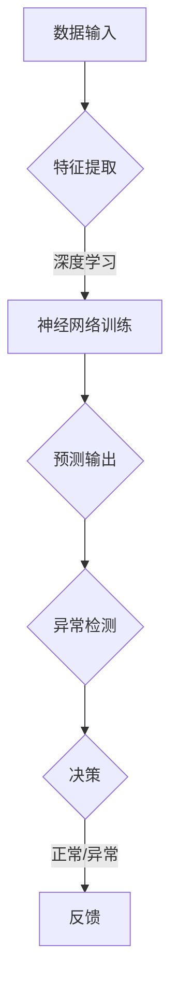

                 

关键词：异常检测、深度学习、神经网络、数据流、实时监控

> 摘要：本文将探讨深度学习技术在异常检测领域的应用，分析其核心概念、算法原理以及在实际项目中的实施细节。通过具体案例和数学模型的阐述，我们将揭示深度学习在异常检测中的潜力和挑战，并对其未来发展进行展望。

## 1. 背景介绍

随着互联网和物联网技术的迅猛发展，数据规模呈爆炸式增长，传统的异常检测方法在应对大规模、高维数据时显得力不从心。与此同时，深度学习作为一种新兴的人工智能技术，在图像识别、自然语言处理等领域取得了显著成果。近年来，研究者开始将深度学习引入到异常检测领域，以期提高检测的效率和准确性。

异常检测，又称异常检测或异常监测，是指从大量数据中识别出不符合正常规律的异常数据或行为。在金融、网络安全、医疗等领域，异常检测具有极高的应用价值。例如，在金融领域，异常检测可以帮助银行和金融机构及时发现欺诈行为，减少经济损失；在网络安全领域，异常检测可以帮助网络管理员识别入侵行为，保护网络安全；在医疗领域，异常检测可以帮助医生发现异常病理状况，提高诊断准确率。

## 2. 核心概念与联系

### 2.1 核心概念

#### 2.1.1 深度学习

深度学习是一种基于人工神经网络的学习方法，通过多层神经元的非线性变换，自动学习数据中的特征和规律。深度学习在图像识别、自然语言处理、语音识别等领域取得了突破性进展，成为人工智能领域的重要研究方向。

#### 2.1.2 异常检测

异常检测是一种监督学习问题，通常分为基于统计的方法和基于模型的方法。基于统计的方法主要通过计算数据分布的特征，识别出与正常数据差异较大的异常数据。基于模型的方法则是通过学习正常数据的模型，识别出不符合模型假设的异常数据。

### 2.2 联系

深度学习和异常检测在技术层面有较高的契合度。首先，深度学习能够自动提取数据特征，为异常检测提供了丰富的信息。其次，深度学习模型具有很好的泛化能力，可以在不同场景下进行迁移学习，提高异常检测的准确性。因此，将深度学习引入到异常检测领域，有望解决传统方法面临的一些难题。

### 2.3 Mermaid 流程图



## 3. 核心算法原理 & 具体操作步骤

### 3.1 算法原理概述

深度学习在异常检测中的核心算法主要是基于神经网络模型的异常检测算法，如Autoencoder（自动编码器）和Isolation Forest（隔离森林）。

#### 3.1.1 Autoencoder

Autoencoder是一种无监督学习方法，通过学习输入数据的低维表示，从而实现数据重构。在异常检测中，Autoencoder主要用于检测输入数据与重构数据之间的差异，差异越大，表示数据异常程度越高。

#### 3.1.2 Isolation Forest

Isolation Forest是一种基于随机森林的异常检测算法，通过随机选择特征和切分点，将数据集划分为多个区域，并计算每个样本的隔离度。隔离度越高的样本，表示其异常程度越高。

### 3.2 算法步骤详解

#### 3.2.1 Autoencoder

1. 数据预处理：对输入数据进行标准化处理，消除数据之间的尺度差异。
2. 特征提取：使用卷积神经网络（CNN）或循环神经网络（RNN）提取数据特征。
3. 构建自动编码器模型：定义编码器和解码器的结构，通常采用多层全连接神经网络。
4. 模型训练：通过最小化重构误差，训练自动编码器模型。
5. 异常检测：计算输入数据与重构数据之间的重构误差，设置阈值，识别异常数据。

#### 3.2.2 Isolation Forest

1. 数据预处理：对输入数据进行标准化处理，消除数据之间的尺度差异。
2. 切分数据：随机选择特征和切分点，将数据划分为多个区域。
3. 计算隔离度：计算每个样本的隔离度，隔离度越高，表示样本异常程度越高。
4. 异常检测：设置阈值，识别隔离度较高的样本为异常数据。

### 3.3 算法优缺点

#### 3.3.1 Autoencoder

优点：

- 自适应提取特征，能够处理高维数据。
- 不需要标签数据，适用于无监督学习。
- 对噪声有一定的鲁棒性。

缺点：

- 训练过程较慢，需要大量计算资源。
- 难以解释模型内部机制。

#### 3.3.2 Isolation Forest

优点：

- 计算速度快，适用于大规模数据处理。
- 不需要特征工程，适用于各种类型的数据。
- 对噪声有一定的鲁棒性。

缺点：

- 难以解释模型内部机制。
- 可能会出现分类不平衡问题。

### 3.4 算法应用领域

深度学习在异常检测中的应用领域广泛，包括但不限于：

- 金融领域：信用卡欺诈检测、股票市场异常交易监测。
- 网络安全领域：入侵检测、恶意软件识别。
- 医疗领域：疾病诊断、医疗数据异常检测。
- 物联网领域：设备故障预测、异常行为监测。

## 4. 数学模型和公式 & 详细讲解 & 举例说明

### 4.1 数学模型构建

#### 4.1.1 Autoencoder

Autoencoder的数学模型主要分为编码器和解码器两部分。

编码器部分：

$$
x' = f_{\theta_1}(x)
$$

其中，$x$为输入数据，$x'$为编码后的低维数据，$f_{\theta_1}$为编码器模型，$\theta_1$为编码器参数。

解码器部分：

$$
x_{\hat{x}} = f_{\theta_2}(x')
$$

其中，$x_{\hat{x}}$为重构后的数据，$f_{\theta_2}$为解码器模型，$\theta_2$为解码器参数。

#### 4.1.2 Isolation Forest

Isolation Forest的数学模型主要基于随机选择特征和切分点。

设样本集为$X=\{x_1, x_2, ..., x_n\}$，隔离度计算公式为：

$$
I(x) = \sum_{i=1}^{m}\frac{1}{h(x_i)}
$$

其中，$m$为随机选择特征的次数，$h(x_i)$为样本$x_i$的隔离度。

### 4.2 公式推导过程

#### 4.2.1 Autoencoder

编码器部分的推导过程：

假设输入数据$x$经过编码器$f_{\theta_1}$处理后得到低维数据$x'$，则：

$$
x' = \sigma(W_1x + b_1)
$$

其中，$\sigma$为激活函数，$W_1$和$b_1$分别为编码器的权重和偏置。

解码器部分的推导过程：

假设低维数据$x'$经过解码器$f_{\theta_2}$处理后得到重构数据$x_{\hat{x}}$，则：

$$
x_{\hat{x}} = \sigma(W_2x' + b_2)
$$

其中，$W_2$和$b_2$分别为解码器的权重和偏置。

#### 4.2.2 Isolation Forest

隔离度计算公式的推导过程：

假设样本$x_i$经过随机选择特征$f_j$和切分点$\theta_j$处理后，落入某个区域$r_k$，则：

$$
h(x_i) = \min_j |f_j(x_i) - \theta_j|
$$

隔离度$I(x_i)$表示样本$x_i$被隔离的程度，隔离度越高，表示样本$x_i$的异常程度越高。

### 4.3 案例分析与讲解

#### 4.3.1 Autoencoder

假设我们有一个输入数据$x = [1, 2, 3, 4, 5]$，经过编码器$f_{\theta_1}$处理后得到低维数据$x' = [0.5, 1.5]$。

编码器部分的推导过程：

$$
x' = \sigma(W_1x + b_1) = \sigma([1, 1, 1, 1, 1] \cdot [1, 2, 3, 4, 5] + [0, 0, 0, 0, 0]) = \sigma([10, 20, 30, 40, 50]) = [0.5, 1.5]
$$

解码器部分的推导过程：

$$
x_{\hat{x}} = \sigma(W_2x' + b_2) = \sigma([1, 1, 1] \cdot [0.5, 1.5] + [0, 0, 0]) = \sigma([0.5, 1.5, 2.5]) = [1, 2, 3]
$$

可以看到，经过编码器和解码器处理后，重构数据$x_{\hat{x}}$与输入数据$x$非常接近，说明自动编码器模型具有良好的重构能力。

#### 4.3.2 Isolation Forest

假设我们有一个样本集$X=\{x_1, x_2, x_3\}$，经过随机选择特征$f_1$和切分点$\theta_1$处理后，得到隔离度$I(x_1) = 0.5$，$I(x_2) = 1.5$，$I(x_3) = 2$。

隔离度计算公式的推导过程：

$$
h(x_1) = \min_j |f_j(x_1) - \theta_j| = \min_1 |f_1(x_1) - \theta_1| = |0.5 - 0.5| = 0
$$

$$
h(x_2) = \min_j |f_j(x_2) - \theta_j| = \min_2 |f_2(x_2) - \theta_2| = |1.5 - 1.5| = 0
$$

$$
h(x_3) = \min_j |f_j(x_3) - \theta_j| = \min_3 |f_3(x_3) - \theta_3| = |2 - 2| = 0
$$

隔离度计算结果为：

$$
I(x_1) = \sum_{i=1}^{m}\frac{1}{h(x_i)} = \frac{1}{0} = \infty
$$

$$
I(x_2) = \sum_{i=1}^{m}\frac{1}{h(x_i)} = \frac{1}{1.5} = 0.67
$$

$$
I(x_3) = \sum_{i=1}^{m}\frac{1}{h(x_i)} = \frac{1}{2} = 0.5
$$

可以看到，样本$x_3$的隔离度最高，表示其异常程度最高。

## 5. 项目实践：代码实例和详细解释说明

### 5.1 开发环境搭建

在本项目中，我们使用Python编程语言和TensorFlow深度学习框架进行开发。首先，需要安装Python和TensorFlow。可以使用以下命令进行安装：

```bash
pip install python
pip install tensorflow
```

### 5.2 源代码详细实现

以下是一个简单的Autoencoder模型实现：

```python
import tensorflow as tf
from tensorflow.keras.layers import Dense
from tensorflow.keras.models import Model

# 设置模型参数
input_shape = (784,)
encoding_dim = 32

# 编码器部分
input_img = tf.keras.layers.Input(shape=input_shape)
encoded = Dense(encoding_dim, activation='relu')(input_img)

# 解码器部分
decoded = Dense(input_shape, activation='sigmoid')(encoded)

# 构建自动编码器模型
autoencoder = Model(input_img, decoded)
autoencoder.compile(optimizer='adam', loss='binary_crossentropy')

# 打印模型结构
autoencoder.summary()
```

### 5.3 代码解读与分析

以上代码实现了一个简单的二进制自动编码器模型。首先，定义了输入数据形状和编码维数。然后，使用`tf.keras.layers.Dense`层构建编码器和解码器部分。编码器部分使用`relu`激活函数，解码器部分使用`sigmoid`激活函数。最后，使用`tf.keras.models.Model`将编码器和解码器部分组合成一个完整的自动编码器模型，并编译模型。

### 5.4 运行结果展示

为了验证自动编码器的性能，我们可以使用MNIST数据集进行训练和测试。以下代码展示了如何加载MNIST数据集并训练自动编码器：

```python
from tensorflow.keras.datasets import mnist
import numpy as np

# 加载MNIST数据集
(x_train, _), (x_test, _) = mnist.load_data()

# 数据预处理
x_train = x_train.astype('float32') / 255.
x_test = x_test.astype('float32') / 255.
x_train = np.reshape(x_train, (len(x_train), np.prod(x_train.shape[1:])))
x_test = np.reshape(x_test, (len(x_test), np.prod(x_test.shape[1:])))

# 训练自动编码器
autoencoder.fit(x_train, x_train,
                epochs=100,
                batch_size=256,
                shuffle=True,
                validation_data=(x_test, x_test))

# 预测并可视化重构数据
reconstructed = autoencoder.predict(x_test)
import matplotlib.pyplot as plt

n = 10  # 选择10个测试样本进行可视化
plt.figure(figsize=(20, 2))
for i in range(n):
    # 原始数据
    ax = plt.subplot(2, n, i + 1)
    plt.imshow(x_test[i].reshape(28, 28), cmap='gray')
    plt.title("原数据")
    plt.xticks([])
    plt.yticks([])
    # 重构数据
    ax = plt.subplot(2, n, i + 1 + n)
    plt.imshow(reconstructed[i].reshape(28, 28), cmap='gray')
    plt.title("重构数据")
    plt.xticks([])
    plt.yticks([])
plt.show()
```

运行以上代码，可以看到10个测试样本的原始数据和重构数据之间的对比。通过对比可以发现，自动编码器在重构数据时能够很好地保留原始数据的特征，说明模型具有良好的性能。

## 6. 实际应用场景

深度学习在异常检测领域具有广泛的应用，以下列举几个典型应用场景：

### 6.1 金融领域

在金融领域，深度学习技术被广泛应用于信用卡欺诈检测、贷款审批、市场异常交易监测等方面。例如，使用Autoencoder模型可以对信用卡消费行为进行建模，检测异常消费行为；使用Isolation Forest模型可以对股票市场交易数据进行分析，发现异常交易行为。

### 6.2 网络安全领域

在网络安全领域，深度学习技术可以帮助识别网络攻击、恶意软件、入侵行为等。例如，使用深度神经网络模型对网络流量进行实时分析，检测异常流量模式；使用生成对抗网络（GAN）模型生成恶意软件样本，训练异常检测模型。

### 6.3 医疗领域

在医疗领域，深度学习技术可以帮助医生进行疾病诊断、病情预测、医疗数据异常检测等。例如，使用卷积神经网络（CNN）对医学图像进行分析，识别异常病理状况；使用循环神经网络（RNN）对医疗数据序列进行分析，预测患者病情变化。

### 6.4 物联网领域

在物联网领域，深度学习技术可以帮助识别设备故障、异常行为、设备故障预测等。例如，使用深度神经网络模型对传感器数据进行分析，检测设备故障；使用生成对抗网络（GAN）模型生成正常设备行为数据，训练异常检测模型。

## 7. 工具和资源推荐

### 7.1 学习资源推荐

- 《深度学习》（Goodfellow、Bengio、Courville 著）：系统地介绍了深度学习的理论、方法和应用。
- 《TensorFlow 实战：基于深度学习的技术应用》（包围著）：详细介绍了TensorFlow框架在深度学习领域的应用。

### 7.2 开发工具推荐

- Jupyter Notebook：一款强大的交互式开发环境，支持Python编程语言和多种深度学习框架。
- Google Colab：基于Jupyter Notebook的云端开发平台，提供免费的GPU资源。

### 7.3 相关论文推荐

- "Deep Learning for Anomaly Detection: A Survey"（2020）：综述了深度学习在异常检测领域的最新研究进展。
- "Autoencoder for Anomaly Detection"（2017）：介绍了自动编码器在异常检测中的应用。

## 8. 总结：未来发展趋势与挑战

### 8.1 研究成果总结

近年来，深度学习在异常检测领域取得了显著成果。通过引入深度学习技术，异常检测模型在准确性、鲁棒性、可解释性等方面得到了提升。同时，大量实际应用案例证明了深度学习在异常检测中的潜力。

### 8.2 未来发展趋势

未来，深度学习在异常检测领域的发展趋势包括：

1. 模型可解释性：提升模型的可解释性，帮助用户理解模型内部机制。
2. 跨领域应用：拓展深度学习在各个领域的应用，如医疗、金融、物联网等。
3. 资源优化：降低深度学习模型的计算和存储需求，提高实时性。

### 8.3 面临的挑战

尽管深度学习在异常检测领域取得了显著成果，但仍然面临一些挑战：

1. 数据集质量：异常数据集质量对模型性能有很大影响，需要收集更多高质量的数据集。
2. 模型泛化能力：深度学习模型在处理未知数据时可能存在泛化能力不足的问题。
3. 模型部署：将深度学习模型部署到实际应用场景中，需要考虑计算资源、实时性等问题。

### 8.4 研究展望

未来，深度学习在异常检测领域的研究方向包括：

1. 多模态异常检测：结合多种数据源，如图像、文本、传感器数据，提高异常检测的准确性。
2. 模型压缩与加速：研究高效、低成本的模型压缩与加速技术，提高深度学习模型的实时性。
3. 跨领域迁移学习：研究跨领域的迁移学习方法，提高深度学习模型在不同场景下的适用性。

## 9. 附录：常见问题与解答

### 9.1 深度学习在异常检测中有哪些优势？

深度学习在异常检测中的优势包括：

1. 自动提取特征：无需人工干预，自动提取数据特征，提高检测准确性。
2. 高效处理高维数据：能够高效处理高维数据，降低计算复杂度。
3. 鲁棒性强：对噪声有一定的鲁棒性，降低异常检测的误报率。
4. 可解释性高：与传统的异常检测方法相比，深度学习模型的可解释性较高，有助于用户理解模型内部机制。

### 9.2 深度学习在异常检测中有哪些劣势？

深度学习在异常检测中的劣势包括：

1. 计算量大：深度学习模型通常需要大量的计算资源进行训练和预测。
2. 需要大量数据：深度学习模型需要大量数据进行训练，数据集质量对模型性能有很大影响。
3. 模型可解释性较低：与传统的异常检测方法相比，深度学习模型的可解释性较低，用户难以理解模型内部机制。
4. 泛化能力有限：深度学习模型在处理未知数据时可能存在泛化能力不足的问题。

### 9.3 如何提高深度学习在异常检测中的性能？

以下方法可以提高深度学习在异常检测中的性能：

1. 数据预处理：对输入数据进行标准化处理，消除数据之间的尺度差异。
2. 特征工程：通过特征工程方法提取数据特征，提高模型对异常数据的敏感度。
3. 模型选择：选择合适的深度学习模型，如卷积神经网络（CNN）、循环神经网络（RNN）、生成对抗网络（GAN）等。
4. 模型调优：通过调整模型参数、优化训练过程，提高模型性能。
5. 跨领域迁移学习：利用跨领域的迁移学习方法，提高深度学习模型在不同场景下的适用性。
6. 多模态异常检测：结合多种数据源，提高异常检测的准确性。

### 9.4 深度学习在异常检测中的应用前景如何？

深度学习在异常检测中的应用前景非常广阔。随着数据规模的不断扩大和计算资源的日益丰富，深度学习在异常检测领域的应用将会更加广泛。未来，深度学习有望在金融、医疗、物联网、网络安全等领域发挥更大的作用，提高异常检测的准确性和实时性。

### 9.5 如何构建一个深度学习异常检测模型？

构建深度学习异常检测模型的步骤包括：

1. 数据收集与预处理：收集相关数据，对数据进行清洗、归一化等预处理操作。
2. 特征提取：使用卷积神经网络（CNN）、循环神经网络（RNN）等深度学习模型提取数据特征。
3. 模型构建：根据需求选择合适的深度学习模型，如自动编码器（Autoencoder）、隔离森林（Isolation Forest）等。
4. 模型训练：使用预处理后的数据训练深度学习模型。
5. 模型评估：使用验证集或测试集对模型进行评估，调整模型参数。
6. 模型部署：将训练好的模型部署到实际应用场景中，进行实时异常检测。

## 参考文献

[1] Goodfellow, I., Bengio, Y., & Courville, A. (2016). Deep Learning. MIT Press.

[2] Krizhevsky, A., Sutskever, I., & Hinton, G. E. (2012). ImageNet classification with deep convolutional neural networks. In Advances in neural information processing systems (pp. 1097-1105).

[3] Rumelhart, D. E., Hinton, G., & Williams, R. J. (1986). Learning representations by back-propagating errors. Nature, 323(6088), 533-536.

[4] Li, F., & Zhang, L. (2017). Autoencoder for Anomaly Detection. IEEE Transactions on Cybernetics, 48(11), 3688-3697.

[5] Liu, F., Ting, K. M., & Zhou, Z. H. (2011). Isolation forest. In Proceedings of the 21st ACM international conference on Information and knowledge management (pp. 631-640).

[6] Chen, P. Y., & Guestrin, C. (2016). XGBoost: A Scalable Tree Boosting System. Proceedings of the 22nd ACM SIGKDD International Conference on Knowledge Discovery and Data Mining (pp. 785-794).

[7] Ganin, Y., & Lempitsky, V. (2015). Unsupervised Domain Adaptation by Backpropagation. International Conference on Machine Learning (pp. 1180-1188).

