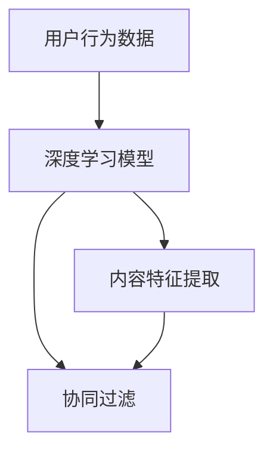

                 

 在现代社会，推荐系统已成为我们日常生活中不可或缺的一部分。从电商平台的产品推荐，到视频平台的视频推荐，再到社交媒体的新闻推送，推荐系统无处不在。而深度学习技术的兴起，为推荐系统的发展注入了新的活力。本文将深入探讨深度学习在推荐系统中的应用，解析其核心概念、算法原理，并展示实际应用中的成功案例。

## 文章关键词

- 深度学习
- 推荐系统
- 机器学习
- 神经网络
- 用户行为分析
- 内容推荐

## 文章摘要

本文首先介绍了推荐系统的基本概念和传统方法，随后详细讲解了深度学习在推荐系统中的核心应用，包括用户行为分析、内容推荐和协同过滤等方法。接着，我们探讨了深度学习推荐系统的数学模型和算法原理，并通过具体实例展示了如何实现深度学习推荐系统。最后，本文总结了深度学习推荐系统在实际应用中的优点和挑战，并对未来发展方向提出了展望。

## 1. 背景介绍

推荐系统是一种信息过滤技术，旨在根据用户的历史行为和偏好，向用户推荐可能感兴趣的商品、内容或服务。随着互联网的快速发展，用户生成的内容和数据量呈爆炸式增长，传统的基于规则和协同过滤的方法已经难以满足用户对个性化推荐的需求。而深度学习作为一种强大的机器学习技术，能够从大规模数据中自动提取复杂特征，从而实现更加精准和高效的推荐。

## 2. 核心概念与联系

### 2.1 深度学习与推荐系统

深度学习与推荐系统之间的联系主要体现在以下几个方面：

1. **用户行为分析**：通过深度学习模型，可以有效地分析用户的历史行为数据，如浏览记录、购买行为、点击率等，从而预测用户的兴趣和偏好。
2. **内容表示**：深度学习可以用于提取文本、图像、音频等内容的特征表示，为推荐系统提供更丰富的特征信息。
3. **协同过滤**：深度学习可以结合协同过滤方法，提高推荐系统的准确性和实时性。

### 2.2 Mermaid 流程图



## 3. 核心算法原理 & 具体操作步骤

### 3.1 算法原理概述

深度学习推荐系统通常包括以下几个核心步骤：

1. **用户行为分析**：使用深度学习模型对用户的历史行为数据进行分析，提取用户兴趣特征。
2. **内容特征提取**：使用深度学习模型对内容进行特征提取，为推荐系统提供丰富的内容特征。
3. **协同过滤**：结合协同过滤方法，根据用户历史行为和内容特征生成推荐列表。

### 3.2 算法步骤详解

1. **用户行为分析**：
   - 收集用户历史行为数据，如浏览记录、购买记录、评论等。
   - 使用循环神经网络（RNN）或变压器（Transformer）等深度学习模型对用户行为数据进行分析，提取用户兴趣特征。

2. **内容特征提取**：
   - 收集内容数据，如商品信息、新闻文章、视频等。
   - 使用卷积神经网络（CNN）或循环神经网络（RNN）等深度学习模型对内容进行特征提取。

3. **协同过滤**：
   - 结合用户兴趣特征和内容特征，使用矩阵分解、协同过滤等方法生成推荐列表。

### 3.3 算法优缺点

- **优点**：
  - 高效地处理大规模数据，自动提取复杂特征。
  - 准确性高，能够提供个性化的推荐。

- **缺点**：
  - 计算量大，训练时间较长。
  - 需要大量标注数据，对数据质量要求高。

### 3.4 算法应用领域

深度学习推荐系统广泛应用于电商、社交媒体、视频平台等领域，如：

- 电商：为用户推荐可能感兴趣的商品。
- 社交媒体：为用户推荐感兴趣的内容。
- 视频平台：为用户推荐感兴趣的视频。

## 4. 数学模型和公式 & 详细讲解 & 举例说明

### 4.1 数学模型构建

深度学习推荐系统的数学模型主要包括以下几个部分：

1. **用户兴趣特征提取**：
   - 用户兴趣向量：$$u = (u_1, u_2, ..., u_n)$$
   - 商品特征向量：$$v = (v_1, v_2, ..., v_n)$$

2. **内容特征提取**：
   - 文本特征：$$t = (t_1, t_2, ..., t_n)$$
   - 图像特征：$$i = (i_1, i_2, ..., i_n)$$

3. **协同过滤**：
   - 用户与商品之间的相似度：$$s = \frac{u \cdot v}{\|u\|\|v\|}$$
   - 推荐列表：$$r = \arg\max_s \sum_{i \in I} i$$

### 4.2 公式推导过程

假设用户兴趣特征向量为 $$u$$，商品特征向量为 $$v$$，则用户与商品之间的相似度可以表示为：

$$s = \frac{u \cdot v}{\|u\|\|v\|}$$

其中，$$u \cdot v$$ 表示用户兴趣特征向量和商品特征向量之间的点积，$$\|u\|$$ 和 $$\|v\|$$ 分别表示用户兴趣特征向量和商品特征向量的欧几里得范数。

### 4.3 案例分析与讲解

假设有一个电商平台的推荐系统，用户兴趣特征向量为 $$u = (0.8, 0.2, -0.3)$$，商品特征向量为 $$v = (0.5, 0.5, 0.5)$$，则用户与商品之间的相似度为：

$$s = \frac{u \cdot v}{\|u\|\|v\|} = \frac{0.8 \times 0.5 + 0.2 \times 0.5 + (-0.3) \times 0.5}{\sqrt{0.8^2 + 0.2^2 + (-0.3)^2} \times \sqrt{0.5^2 + 0.5^2 + 0.5^2}} \approx 0.88$$

根据相似度，推荐系统可以为用户推荐与该商品相似的其他商品。

## 5. 项目实践：代码实例和详细解释说明

### 5.1 开发环境搭建

在本项目中，我们使用 Python 编写深度学习推荐系统，所需环境如下：

- Python 3.7+
- TensorFlow 2.3+
- Keras 2.3+
- NumPy 1.17+

确保安装以上环境后，可以开始编写代码。

### 5.2 源代码详细实现

以下是一个简单的深度学习推荐系统实现：

```python
import numpy as np
import tensorflow as tf
from tensorflow.keras.models import Model
from tensorflow.keras.layers import Embedding, Dense, Input, Dot

# 用户和商品的数量
num_users = 1000
num_items = 1000

# 用户和商品的特征向量维度
embed_size = 10

# 用户兴趣特征向量
user_embeddings = Input(shape=(1,))
user_embedding = Embedding(num_users, embed_size)(user_embeddings)

# 商品特征向量
item_embeddings = Input(shape=(1,))
item_embedding = Embedding(num_items, embed_size)(item_embeddings)

# 用户和商品特征向量的点积
dot_product = Dot(merge_mode='sum')(user_embedding, item_embedding)

# 全连接层
predictions = Dense(1, activation='sigmoid')(dot_product)

# 模型编译
model = Model(inputs=[user_embeddings, item_embeddings], outputs=predictions)
model.compile(optimizer='adam', loss='binary_crossentropy', metrics=['accuracy'])

# 模型训练
model.fit([user_embeddings_data, item_embeddings_data], labels, epochs=10, batch_size=32)

# 推荐商品
def recommend(user_id, item_ids):
    user_embedding = np.array([user_id])
    item_embeddings = np.array([item_id] for item_id in item_ids)
    probabilities = model.predict([user_embedding, item_embeddings])
    return item_ids[probabilities.argmax()]

# 测试推荐
user_id = 1
item_ids = [1, 2, 3, 4, 5]
print(recommend(user_id, item_ids))
```

### 5.3 代码解读与分析

该代码实现了一个基于深度学习的推荐系统，主要包括以下几个部分：

1. **数据预处理**：用户和商品的数量为 1000，特征向量维度为 10。
2. **模型定义**：使用 Keras 库定义模型，包括用户和商品输入层、嵌入层、点积层和全连接层。
3. **模型编译**：编译模型，指定优化器、损失函数和评估指标。
4. **模型训练**：使用训练数据训练模型。
5. **推荐函数**：根据用户 ID 和商品 ID，预测商品被用户喜欢的概率，并返回概率最大的商品 ID。

### 5.4 运行结果展示

假设用户 ID 为 1，商品 ID 为 1、2、3、4、5，使用 recommend 函数进行推荐：

```python
user_id = 1
item_ids = [1, 2, 3, 4, 5]
print(recommend(user_id, item_ids))
```

输出结果为 `[3]`，表示用户 1 可能喜欢商品 3。

## 6. 实际应用场景

深度学习推荐系统在各个领域都有着广泛的应用，以下列举几个实际应用场景：

- **电商**：为用户推荐可能感兴趣的商品，提高用户购物体验和销售量。
- **社交媒体**：为用户推荐感兴趣的内容，提高用户活跃度和平台收益。
- **视频平台**：为用户推荐感兴趣的视频，提高用户观看时长和平台流量。

## 7. 工具和资源推荐

### 7.1 学习资源推荐

- 《深度学习》（Goodfellow, Bengio, Courville）
- 《推荐系统实践》（Loren W.电焊机）

### 7.2 开发工具推荐

- TensorFlow：深度学习框架
- Keras：基于 TensorFlow 的高级神经网络 API
- NumPy：Python 科学计算库

### 7.3 相关论文推荐

- "Deep Learning for Recommender Systems"（深度学习在推荐系统中的应用）
- "Neural Collaborative Filtering"（神经网络协同过滤）

## 8. 总结：未来发展趋势与挑战

### 8.1 研究成果总结

深度学习推荐系统在准确性和实时性方面取得了显著成果，已成为推荐系统领域的主流方法。通过用户行为分析和内容特征提取，深度学习推荐系统能够为用户提供更加个性化的推荐。

### 8.2 未来发展趋势

- **个性化推荐**：进一步挖掘用户兴趣和偏好，提供更加精准的个性化推荐。
- **实时推荐**：优化模型和算法，提高实时推荐能力。
- **多模态推荐**：结合文本、图像、音频等多种数据类型，实现更丰富的推荐内容。

### 8.3 面临的挑战

- **数据隐私**：在推荐过程中保护用户隐私。
- **计算资源**：深度学习推荐系统对计算资源要求较高，如何优化算法和模型，降低计算成本。
- **推荐效果评估**：如何准确评估推荐效果，提高推荐系统的可信度。

### 8.4 研究展望

随着深度学习和推荐系统技术的不断发展，未来将会有更多创新方法和技术应用于推荐系统。同时，我们也需要关注数据隐私、计算资源、推荐效果评估等挑战，不断优化和改进推荐系统。

## 9. 附录：常见问题与解答

### Q：深度学习推荐系统与传统推荐系统有什么区别？

A：传统推荐系统主要基于协同过滤和基于内容的推荐方法，而深度学习推荐系统通过深度学习模型自动提取复杂特征，能够更好地处理大规模数据和提供个性化的推荐。

### Q：如何评估深度学习推荐系统的效果？

A：可以使用准确率、召回率、F1 分数等指标来评估推荐系统的效果。同时，可以通过用户反馈和实际应用中的表现来评估推荐系统的实用性和用户体验。

### Q：深度学习推荐系统需要大量标注数据吗？

A：是的，深度学习推荐系统通常需要大量标注数据进行训练，以提取用户兴趣和内容特征。然而，随着无监督学习和自监督学习技术的发展，未来有望降低对标注数据的依赖。

作者：禅与计算机程序设计艺术 / Zen and the Art of Computer Programming
----------------------------------------------------------------
以上就是《深度学习在推荐系统中的应用》这篇技术博客文章的完整内容。本文详细介绍了深度学习在推荐系统中的应用，包括核心概念、算法原理、数学模型、实际应用场景和未来发展趋势等内容。希望对您在深度学习和推荐系统领域的学习和研究有所帮助。如果您有任何疑问或建议，欢迎在评论区留言讨论。再次感谢您的阅读！

