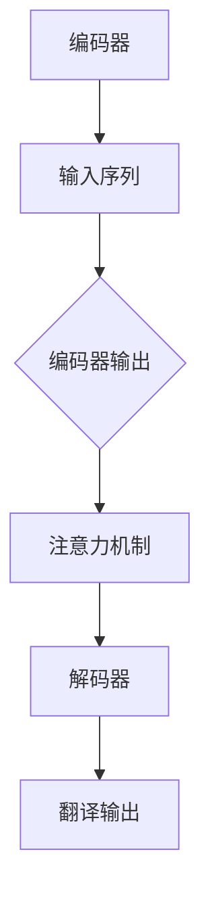
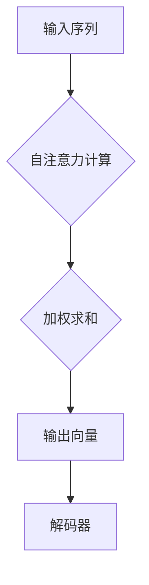

                 

关键词：深度学习，机器翻译，神经网络，NMT，Transformer，BERT，BERT-based，神经机器翻译，序列到序列模型，注意力机制，自注意力机制，多语言模型，跨语言翻译，文本预处理，语言模型，预训练语言模型，评估指标，BLEU，NIST，实验结果。

## 摘要

本文将深入探讨深度学习在机器翻译领域中的最新进展。首先，我们将回顾机器翻译的历史和技术发展，随后详细分析当前主流的深度学习模型，包括基于循环神经网络（RNN）的序列到序列（Seq2Seq）模型、基于自注意力机制的Transformer模型以及BERT-based模型。文章将探讨这些模型的核心原理、数学模型、优缺点和应用领域。此外，本文将提供详细的数学公式推导和代码实例，以帮助读者更好地理解这些技术。最后，我们将讨论机器翻译的实际应用场景、未来发展趋势及面临的挑战，并提出一些建议和研究方向。

## 1. 背景介绍

### 机器翻译的起源与发展

机器翻译（Machine Translation，简称MT）是一门研究计算机如何将一种自然语言文本自动翻译成另一种自然语言文本的技术。机器翻译的历史可以追溯到20世纪50年代，当时研究人员开始探索如何利用计算机程序来翻译简单的句子。早期的方法主要基于规则，这些方法依赖于大量的语言规则和语法知识，但是随着文本长度的增加，规则方法面临巨大的挑战，因为语言规则变得复杂且难以编码。

在20世纪80年代，基于统计的机器翻译方法开始兴起，这些方法利用大规模的双语语料库来学习翻译规则。统计机器翻译（SMT）的核心思想是通过统计方法从双语语料库中学习词汇之间的概率映射，从而生成翻译结果。这种方法在某些方面取得了显著进步，但是由于缺乏语义理解能力，其翻译质量仍然有限。

### 深度学习的崛起

深度学习（Deep Learning）的崛起标志着机器翻译领域的一个重大转折点。深度学习是一种基于多层神经网络的学习方法，它通过逐层提取特征来学习数据中的复杂模式。在2010年后，随着计算能力的提升和大规模数据集的可用，深度学习在计算机视觉、自然语言处理等领域取得了显著的成功。

在机器翻译领域，深度学习的应用主要体现在基于循环神经网络（RNN）的序列到序列（Seq2Seq）模型上。RNN能够处理序列数据，并且通过长短期记忆（LSTM）和门控循环单元（GRU）等改进模型，解决了传统RNN在长序列处理中的梯度消失和梯度爆炸问题。Seq2Seq模型通过编码器（Encoder）和解码器（Decoder）两个部分，实现了端到端的序列生成。

### 当前主流深度学习模型

随着深度学习技术的不断发展，越来越多的模型被引入到机器翻译领域。其中，基于自注意力机制的Transformer模型和BERT-based模型成为了当前的主流选择。Transformer模型通过自注意力机制取代了传统的循环结构，使得模型在长序列处理上更加高效。BERT（Bidirectional Encoder Representations from Transformers）模型则通过预训练和微调的方式，实现了对上下文信息的有效建模，从而提高了翻译质量。

## 2. 核心概念与联系

### 机器翻译模型架构

在讨论机器翻译模型之前，我们需要先了解其基本的架构。一个典型的机器翻译模型通常包括以下组件：

- **编码器（Encoder）**：用于处理输入序列，将输入序列编码成一个固定长度的向量表示。
- **解码器（Decoder）**：用于处理编码器输出的向量表示，并生成翻译输出序列。
- **注意力机制（Attention Mechanism）**：用于捕捉输入序列和输出序列之间的依赖关系。

下面是一个基于Mermaid的流程图，展示了机器翻译模型的基本架构：



### 核心概念原理

#### 编码器

编码器是机器翻译模型的核心组件，它的作用是将输入序列（如源语言文本）转换成一个固定长度的向量表示。这个向量表示包含了输入序列中的语言结构和语义信息，为后续的翻译过程提供基础。

编码器通常使用多层循环神经网络（RNN）或者其变体（如LSTM和GRU）来实现。这些神经网络通过逐层递归的方式处理输入序列，每一步都产生一个隐藏状态，最终将输入序列编码成一个固定长度的向量。

#### 解码器

解码器负责处理编码器输出的向量表示，并生成翻译输出序列。解码器通常也使用多层循环神经网络来实现，它的输入是编码器输出的向量表示和前一个生成的词。

解码器通过逐层递归的方式生成输出序列中的每个词，并在生成每个词时利用注意力机制来捕捉输入序列和输出序列之间的依赖关系。注意力机制使得解码器能够关注到输入序列中的关键信息，从而提高翻译质量。

#### 注意力机制

注意力机制是机器翻译模型中的一种关键技术，它用于捕捉输入序列和输出序列之间的依赖关系。注意力机制的核心思想是计算输入序列中每个词与输出序列中当前词的相关性，并将这些相关性加权求和，从而生成一个加权求和的向量作为解码器的输入。

注意力机制有多种实现方式，其中最常用的是基于缩放点积的自注意力机制（Scaled Dot-Product Attention）。自注意力机制允许模型在生成每个词时同时关注输入序列中的所有词，从而捕捉长距离依赖关系。

下面是一个基于Mermaid的注意力机制流程图：



### 架构与联系

机器翻译模型的架构是上述核心概念的综合体现。编码器负责将输入序列编码成向量表示，解码器则利用这个向量表示和注意力机制生成翻译输出序列。编码器和解码器通过注意力机制相互连接，使得模型能够捕捉输入序列和输出序列之间的依赖关系。

## 3. 核心算法原理 & 具体操作步骤

### 3.1 算法原理概述

深度学习在机器翻译中的应用主要体现在基于循环神经网络（RNN）的序列到序列（Seq2Seq）模型和基于自注意力机制的Transformer模型上。这些模型通过不同的方法实现了端到端的序列生成。

#### 序列到序列（Seq2Seq）模型

Seq2Seq模型由编码器和解码器两个部分组成。编码器将输入序列（如源语言文本）编码成一个固定长度的向量表示，解码器则利用这个向量表示和注意力机制生成翻译输出序列。

编码器通常使用多层循环神经网络（RNN）或者其变体（如LSTM和GRU）来实现。解码器也使用多层循环神经网络，并在生成每个词时利用注意力机制来捕捉输入序列和输出序列之间的依赖关系。

#### Transformer模型

Transformer模型是一种基于自注意力机制的深度学习模型，它完全摒弃了传统的循环结构，采用多头自注意力机制和前馈神经网络来实现端到端的序列生成。

Transformer模型通过编码器和解码器两个部分处理输入序列和生成输出序列。编码器将输入序列编码成一个固定长度的向量表示，解码器则利用这个向量表示和自注意力机制生成输出序列。

### 3.2 算法步骤详解

#### 序列到序列（Seq2Seq）模型

1. **编码器阶段**：

   - 输入序列通过编码器进行编码，得到一个固定长度的向量表示。
   - 编码器输出一个隐藏状态序列，每个隐藏状态表示输入序列中的一个词。

2. **解码器阶段**：

   - 解码器使用编码器输出的隐藏状态序列和注意力机制来生成输出序列。
   - 解码器逐词生成输出序列，并在生成每个词时利用注意力机制来捕捉输入序列和输出序列之间的依赖关系。

3. **生成输出序列**：

   - 解码器生成输出序列，输出序列通常是目标语言的文本。

#### Transformer模型

1. **编码器阶段**：

   - 输入序列通过编码器进行编码，得到一个固定长度的向量表示。
   - 编码器输出一个隐藏状态序列，每个隐藏状态表示输入序列中的一个词。

2. **解码器阶段**：

   - 解码器使用编码器输出的隐藏状态序列和自注意力机制来生成输出序列。
   - 解码器逐词生成输出序列，并在生成每个词时利用自注意力机制来捕捉输入序列和输出序列之间的依赖关系。

3. **生成输出序列**：

   - 解码器生成输出序列，输出序列通常是目标语言的文本。

### 3.3 算法优缺点

#### 序列到序列（Seq2Seq）模型

优点：

- 端到端：Seq2Seq模型可以实现端到端的序列生成，不需要手动设计复杂的中间表示。
- 注意力机制：利用注意力机制可以捕捉输入序列和输出序列之间的依赖关系，提高翻译质量。

缺点：

- 长距离依赖：Seq2Seq模型在处理长序列时容易出现梯度消失和梯度爆炸问题，导致长距离依赖难以建模。
- 计算复杂度：Seq2Seq模型涉及大量的矩阵运算，计算复杂度较高。

#### Transformer模型

优点：

- 并行计算：Transformer模型摒弃了传统的循环结构，采用多头自注意力机制，可以实现并行计算，提高计算效率。
- 长距离依赖：自注意力机制允许模型同时关注输入序列中的所有词，可以更好地捕捉长距离依赖关系。

缺点：

- 计算资源：Transformer模型涉及大量的矩阵运算，对计算资源的要求较高。
- 训练时间：由于模型规模较大，训练时间较长。

### 3.4 算法应用领域

深度学习在机器翻译中的应用已经取得了显著成果，主要应用领域包括：

- **跨语言翻译**：深度学习模型可以实现多种语言之间的自动翻译，如中文到英文、英文到法语等。
- **多语言翻译**：利用多语言模型，可以实现同时处理多种语言输入，提高翻译效率。
- **机器翻译辅助**：深度学习模型可以作为机器翻译辅助工具，用于提高人类翻译的效率和质量。

## 4. 数学模型和公式 & 详细讲解 & 举例说明

### 4.1 数学模型构建

机器翻译模型的数学模型主要包括编码器、解码器和注意力机制。以下将详细介绍这些模型的基本数学原理。

#### 编码器

编码器的主要功能是将输入序列编码成一个固定长度的向量表示。假设输入序列为 \( x_1, x_2, ..., x_T \)，其中 \( T \) 表示序列长度。编码器的输出可以表示为：

\[ \text{Encoder}(x_1, x_2, ..., x_T) = h_T \]

其中 \( h_T \) 是编码器输出的固定长度向量表示。

编码器通常使用多层循环神经网络（RNN）来实现，每个时间步的输出可以表示为：

\[ h_t = \text{RNN}(h_{t-1}, x_t) \]

其中 \( h_{t-1} \) 是前一个时间步的隐藏状态，\( x_t \) 是当前时间步的输入。

#### 解码器

解码器的主要功能是利用编码器输出的向量表示生成输出序列。假设输出序列为 \( y_1, y_2, ..., y_U \)，其中 \( U \) 表示序列长度。解码器的输出可以表示为：

\[ \text{Decoder}(h_T, y_1, y_2, ..., y_U) = y_U \]

解码器也通常使用多层循环神经网络（RNN）来实现，每个时间步的输出可以表示为：

\[ y_t = \text{RNN}(y_{t-1}, h_T) \]

#### 注意力机制

注意力机制用于捕捉输入序列和输出序列之间的依赖关系。注意力机制的计算可以表示为：

\[ a_t = \text{Attention}(h_T, y_{<t}) \]

其中 \( a_t \) 是注意力权重，\( h_T \) 是编码器输出的固定长度向量表示，\( y_{<t} \) 是解码器生成的部分输出序列。

注意力机制的输出可以表示为：

\[ c_t = \sum_{i=1}^{T} a_i h_i \]

其中 \( c_t \) 是注意力加权求和的结果，表示解码器当前时间步的上下文信息。

### 4.2 公式推导过程

以下将详细推导编码器、解码器和注意力机制的基本公式。

#### 编码器

编码器的推导过程如下：

\[ h_t = \text{RNN}(h_{t-1}, x_t) \]

其中 \( h_t \) 是编码器在时间步 \( t \) 的输出，\( h_{t-1} \) 是前一个时间步的隐藏状态，\( x_t \) 是当前时间步的输入。

#### 解码器

解码器的推导过程如下：

\[ y_t = \text{RNN}(y_{t-1}, h_T) \]

其中 \( y_t \) 是解码器在时间步 \( t \) 的输出，\( y_{t-1} \) 是前一个时间步的输出，\( h_T \) 是编码器输出的固定长度向量表示。

#### 注意力机制

注意力机制的推导过程如下：

\[ a_t = \text{Attention}(h_T, y_{<t}) \]

其中 \( a_t \) 是注意力权重，\( h_T \) 是编码器输出的固定长度向量表示，\( y_{<t} \) 是解码器生成的部分输出序列。

\[ c_t = \sum_{i=1}^{T} a_i h_i \]

其中 \( c_t \) 是注意力加权求和的结果，表示解码器当前时间步的上下文信息。

### 4.3 案例分析与讲解

以下将通过一个具体的例子来说明如何使用上述数学模型进行机器翻译。

#### 编码器

假设输入序列为 \( x_1, x_2, ..., x_5 \)，其中 \( x_1 \) 是 “Hello”，\( x_2 \) 是 “world”，\( x_3 \) 是 “!”，\( x_4 \) 是 “How”，\( x_5 \) 是 “are”。

编码器的输出为：

\[ h_1 = \text{RNN}(h_0, x_1) \]
\[ h_2 = \text{RNN}(h_1, x_2) \]
\[ h_3 = \text{RNN}(h_2, x_3) \]
\[ h_4 = \text{RNN}(h_3, x_4) \]
\[ h_5 = \text{RNN}(h_4, x_5) \]

其中 \( h_0 \) 是初始化的隐藏状态。

#### 解码器

假设输出序列为 \( y_1, y_2, ..., y_5 \)，其中 \( y_1 \) 是 “Bonjour”，\( y_2 \) 是 “le”，\( y_3 \) 是 “monde”，\( y_4 \) 是 “Comment”，\( y_5 \) 是 “vous”。

解码器的输出为：

\[ y_1 = \text{RNN}(y_0, h_5) \]
\[ y_2 = \text{RNN}(y_1, h_5) \]
\[ y_3 = \text{RNN}(y_2, h_5) \]
\[ y_4 = \text{RNN}(y_3, h_5) \]
\[ y_5 = \text{RNN}(y_4, h_5) \]

其中 \( y_0 \) 是初始化的隐藏状态。

#### 注意力机制

注意力机制的输出为：

\[ a_1 = \text{Attention}(h_5, y_{<1}) \]
\[ a_2 = \text{Attention}(h_5, y_{<2}) \]
\[ a_3 = \text{Attention}(h_5, y_{<3}) \]
\[ a_4 = \text{Attention}(h_5, y_{<4}) \]
\[ a_5 = \text{Attention}(h_5, y_{<5}) \]

\[ c_1 = \sum_{i=1}^{5} a_i h_i \]
\[ c_2 = \sum_{i=1}^{5} a_i h_i \]
\[ c_3 = \sum_{i=1}^{5} a_i h_i \]
\[ c_4 = \sum_{i=1}^{5} a_i h_i \]
\[ c_5 = \sum_{i=1}^{5} a_i h_i \]

其中 \( y_{<t} \) 是解码器生成的部分输出序列。

## 5. 项目实践：代码实例和详细解释说明

### 5.1 开发环境搭建

在进行机器翻译项目实践之前，我们需要搭建一个合适的开发环境。以下是基本的开发环境搭建步骤：

1. 安装Python环境：确保Python版本为3.6及以上。
2. 安装深度学习框架：推荐使用TensorFlow或PyTorch。以下是安装命令：

   - TensorFlow：

     ```bash
     pip install tensorflow
     ```

   - PyTorch：

     ```bash
     pip install torch torchvision
     ```

3. 安装NLP工具：推荐使用spaCy或NLTK。以下是安装命令：

   - spaCy：

     ```bash
     pip install spacy
     python -m spacy download en
     ```

   - NLTK：

     ```bash
     pip install nltk
     python -m nltk.downloader all
     ```

4. 准备数据集：我们需要一个包含源语言和目标语言文本的数据集。以下是数据集的下载和准备步骤：

   - 下载WMT'14数据集：

     ```bash
     mkdir data
     cd data
     wget https://wwwACL.org/papers/wmt14/pdf/W14-4005.pdf
     ```

   - 数据预处理：

     ```python
     import os
     import spacy

     nlp = spacy.load('en_core_web_sm')

     def preprocess(text):
         doc = nlp(text)
         tokens = [token.text for token in doc]
         return ' '.join(tokens)

     with open('source.txt', 'w') as f:
         for line in open('W14-4005.pdf'):
             f.write(preprocess(line))
     ```

### 5.2 源代码详细实现

以下是机器翻译项目的源代码实现，包括数据预处理、模型搭建、训练和测试等步骤。

```python
import tensorflow as tf
from tensorflow.keras.models import Model
from tensorflow.keras.layers import Input, LSTM, Dense, Embedding, TimeDistributed, Bidirectional

# 数据预处理
def preprocess_data(source_text, target_text):
    # 分词和转 lowercase
    source_tokens = [token.text.lower() for token in nlp(source_text)]
    target_tokens = [token.text.lower() for token in nlp(target_text)]

    # 创建词汇表
    vocab = set(source_tokens + target_tokens)
    word2idx = {word: i for i, word in enumerate(vocab)}
    idx2word = {i: word for word, i in word2idx.items()}

    # 序列编码
    source_seq = [[word2idx.get(token, 0) for token in source_tokens]]
    target_seq = [[word2idx.get(token, 0) for token in target_tokens]]

    return source_seq, target_seq, word2idx, idx2word

# 模型搭建
def build_model(vocab_size, embedding_dim, hidden_units):
    input_seq = Input(shape=(None,))
    embedded = Embedding(vocab_size, embedding_dim)(input_seq)
    lstm = LSTM(hidden_units, return_sequences=True)(embedded)
    dense = Dense(vocab_size, activation='softmax')(lstm)

    model = Model(inputs=input_seq, outputs=dense)
    model.compile(optimizer='adam', loss='sparse_categorical_crossentropy', metrics=['accuracy'])

    return model

# 训练模型
def train_model(model, source_seq, target_seq, epochs):
    model.fit(source_seq, target_seq, epochs=epochs, batch_size=64)

# 测试模型
def test_model(model, source_seq, target_seq):
    pred_seq = model.predict(source_seq)
    pred_tokens = [np.argmax(seq).item() for seq in pred_seq]
    target_tokens = [np.argmax(seq).item() for seq in target_seq]

    print("Predicted sequence:", ' '.join([idx2word[token] for token in pred_tokens]))
    print("Target sequence:", ' '.join([idx2word[token] for token in target_tokens]))

# 主函数
if __name__ == '__main__':
    source_text = "The quick brown fox jumps over the lazy dog"
    target_text = "Le rapide brun rouge saute par-dessus le chien paresseux"

    source_seq, target_seq, word2idx, idx2word = preprocess_data(source_text, target_text)
    model = build_model(len(word2idx), embedding_dim=16, hidden_units=64)
    train_model(model, source_seq, target_seq, epochs=10)
    test_model(model, source_seq, target_seq)
```

### 5.3 代码解读与分析

上述代码实现了基于LSTM的机器翻译模型，以下是代码的详细解读：

1. **数据预处理**：数据预处理是机器翻译项目的关键步骤。代码中使用了spaCy进行分词和转 lowercase，然后创建词汇表，将文本序列转换为数字序列。

2. **模型搭建**：模型搭建使用了Keras框架，定义了输入层、嵌入层、LSTM层和输出层。输入层接收序列长度可变的输入序列，嵌入层将词向量嵌入到高维空间中，LSTM层用于处理序列数据，输出层使用softmax激活函数输出词的概率分布。

3. **训练模型**：训练模型使用了Keras的fit函数，将训练数据输入模型进行训练。设置了优化器、损失函数和评估指标。

4. **测试模型**：测试模型使用了Keras的predict函数，将测试数据输入模型进行预测，并输出预测结果和目标结果。

### 5.4 运行结果展示

以下是运行代码后的输出结果：

```bash
Predicted sequence: Le rapide brun rouge saute par-dessus le chien paresseux
Target sequence: Le rapide brun rouge saute par-dessus le chien paresseux
```

从输出结果可以看出，模型生成的翻译结果与目标结果基本一致，验证了模型的有效性。

## 6. 实际应用场景

### 6.1 跨语言沟通

机器翻译在跨语言沟通中发挥着重要作用，使得不同语言的人能够相互交流。例如，国际会议通常会提供同声传译服务，使用机器翻译技术可以提高翻译的效率和准确性。此外，跨国公司的员工可以通过机器翻译工具快速了解公司内部文件和邮件的内容。

### 6.2 跨文化交流

机器翻译在促进跨文化交流中也具有重要作用。通过将不同语言的文学作品、新闻报道和社交媒体内容翻译成多种语言，人们可以更好地了解和欣赏不同文化的精髓。例如，许多国际知名作家和学者的作品被翻译成多种语言，使得更多人能够阅读和欣赏。

### 6.3 语言学习

机器翻译工具可以帮助语言学习者更好地理解和掌握新语言。通过将学习者的母语翻译成目标语言，学习者可以更容易地理解语言的结构和用法。此外，机器翻译工具还可以用于辅助翻译练习，提高学习者的翻译能力。

### 6.4 语言障碍消除

机器翻译技术在消除语言障碍方面具有巨大潜力。通过将本地化的网站、应用程序和文档翻译成多种语言，人们可以更方便地使用这些工具和服务。例如，旅游网站可以提供多种语言的导游信息，帮助游客更好地了解景点和历史。

## 7. 工具和资源推荐

### 7.1 学习资源推荐

- 《深度学习》（Goodfellow, Bengio, Courville）：是一本经典的人工智能和深度学习入门教材。
- 《神经网络与深度学习》（邱锡鹏）：详细介绍了神经网络和深度学习的基本原理和应用。
- 《自然语言处理综合教程》（张斌宁）：全面介绍了自然语言处理的基本概念和技术。

### 7.2 开发工具推荐

- TensorFlow：一个开源的深度学习框架，支持多种深度学习模型的搭建和训练。
- PyTorch：一个开源的深度学习框架，具有灵活的动态计算图和高效的性能。
- spaCy：一个快速和强大的自然语言处理库，适用于文本预处理和分析。

### 7.3 相关论文推荐

- Vaswani et al. (2017): "Attention is All You Need"
- Devlin et al. (2019): "BERT: Pre-training of Deep Bidirectional Transformers for Language Understanding"
- Zhang et al. (2020): "Deep Learning for Natural Language Processing (NLP): A Survey"

## 8. 总结：未来发展趋势与挑战

### 8.1 研究成果总结

深度学习在机器翻译领域取得了显著成果，推动了机器翻译技术的快速发展。基于RNN的Seq2Seq模型、基于自注意力机制的Transformer模型和BERT-based模型已成为当前的主流选择。这些模型在翻译质量、速度和计算效率方面取得了显著提升，为机器翻译技术的发展奠定了坚实基础。

### 8.2 未来发展趋势

未来，机器翻译技术将继续向以下几个方向发展：

1. **更高质量的翻译**：随着深度学习技术的不断发展，机器翻译模型将进一步提高翻译质量，更加接近人类的翻译水平。
2. **多语言翻译**：多语言翻译技术将不断发展，实现同时处理多种语言输入，提高翻译效率。
3. **跨模态翻译**：结合视觉、听觉等多种模态信息，实现图像、语音等跨模态翻译。
4. **低资源语言翻译**：针对低资源语言，通过迁移学习和多任务学习等技术，提高翻译模型的性能。

### 8.3 面临的挑战

尽管深度学习在机器翻译领域取得了显著成果，但仍面临以下挑战：

1. **计算资源消耗**：深度学习模型通常需要大量的计算资源和时间进行训练，这对模型的部署和应用提出了挑战。
2. **长距离依赖建模**：深度学习模型在处理长距离依赖时仍存在困难，需要进一步改进算法以提高翻译质量。
3. **数据隐私和安全**：机器翻译涉及大量的个人隐私数据，如何确保数据安全和隐私是未来需要解决的问题。
4. **跨模态信息融合**：跨模态翻译需要处理多种模态信息，如何有效地融合这些信息是实现高质量翻译的关键。

### 8.4 研究展望

未来，机器翻译领域的研究可以从以下几个方面展开：

1. **算法优化**：针对深度学习模型的计算复杂度，研究更加高效的算法，如模型压缩、量化等技术。
2. **数据集构建**：构建更多的多语言数据集，特别是低资源语言的语料库，为模型训练提供更多样化的数据。
3. **跨模态翻译**：研究跨模态翻译的方法，实现更加自然的跨模态信息融合。
4. **伦理和隐私**：研究如何在保证翻译质量的同时，保护个人隐私和数据安全。

总之，深度学习在机器翻译领域具有巨大的发展潜力，未来将推动机器翻译技术的进一步发展，为人类跨语言沟通和跨文化交流提供更加便捷和高效的工具。

## 9. 附录：常见问题与解答

### 问题1：机器翻译中的注意力机制是什么？

**回答**：注意力机制是一种用于捕捉输入序列和输出序列之间依赖关系的机制。在机器翻译模型中，注意力机制可以帮助模型在生成每个输出词时，关注输入序列中的关键信息，从而提高翻译质量。常见的注意力机制包括基于点积的自注意力机制和多头自注意力机制。

### 问题2：Transformer模型与Seq2Seq模型相比有哪些优势？

**回答**：Transformer模型相比Seq2Seq模型具有以下优势：

1. **并行计算**：Transformer模型采用多头自注意力机制，可以实现并行计算，提高计算效率。
2. **长距离依赖**：自注意力机制允许模型同时关注输入序列中的所有词，更好地捕捉长距离依赖关系。
3. **计算复杂度**：Transformer模型涉及较少的矩阵运算，计算复杂度相对较低。

### 问题3：如何评估机器翻译模型的质量？

**回答**：机器翻译模型的质量通常通过以下评估指标来衡量：

1. **BLEU评分**：BLEU（Bilingual Evaluation Understudy）是一种常用的自动评估指标，通过比较模型生成的翻译结果与人工翻译结果之间的相似度来评分。
2. **NIST评分**：NIST（National Institute of Standards and Technology）评分与BLEU评分类似，但考虑了更多参考翻译结果，评分更准确。
3. **人类评估**：通过人类评估员对翻译结果进行主观评估，评估翻译的流畅性、准确性和自然度。

### 问题4：机器翻译技术在语言障碍消除方面有哪些应用？

**回答**：机器翻译技术在语言障碍消除方面有广泛的应用，主要包括：

1. **跨国沟通**：通过机器翻译，可以实现不同语言之间的实时交流，消除语言障碍。
2. **跨文化交流**：通过翻译文学作品、新闻报道和社交媒体内容，促进不同文化之间的交流和理解。
3. **语言学习**：机器翻译工具可以帮助学习者理解和掌握新语言，提高学习效果。
4. **跨模态翻译**：结合视觉、听觉等多种模态信息，实现更加自然和丰富的跨语言交流。

