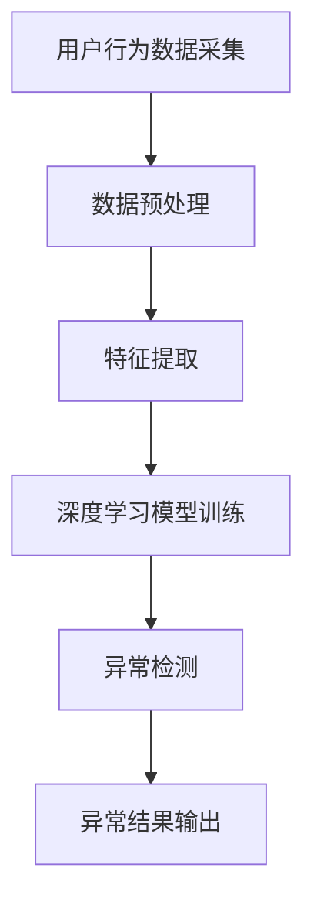

                 

 关键词：深度学习、用户行为序列、异常检测、模型构建、算法优化、应用领域

> 摘要：本文深入探讨了深度学习在用户行为序列异常检测领域的应用。首先介绍了用户行为序列异常检测的背景和重要性，随后详细阐述了深度学习核心概念与联系，核心算法原理与具体操作步骤，数学模型和公式推导，并通过项目实践展示了代码实例。文章最后讨论了深度学习在用户行为序列异常检测中的实际应用场景，以及未来发展的趋势和挑战。

## 1. 背景介绍

随着互联网和大数据技术的快速发展，用户行为数据变得异常丰富。这些数据包含了用户在各种场景下的行为模式，如在线购物、社交互动、医疗服务等。然而，这些行为数据中也夹杂着一些异常行为，例如欺诈交易、恶意评论等。这些异常行为不仅会损害用户体验，还可能给企业带来巨大的经济损失。因此，如何有效地检测和识别用户行为序列中的异常行为，成为了当前研究的热点问题。

用户行为序列异常检测的目标是通过分析用户的行为序列数据，识别出其中的异常行为。传统的异常检测方法主要基于统计模型和机器学习方法，如KNN、LOF、孤立森林等。然而，这些方法在面对复杂和非线性用户行为时，效果往往不佳。深度学习作为一种强大的非线性模型，能够更好地捕捉用户行为序列中的复杂模式，从而提高异常检测的准确性。

## 2. 核心概念与联系

### 2.1 用户行为序列

用户行为序列是指用户在一段时间内连续执行的一系列操作。这些操作可以是点击、浏览、购买等。用户行为序列通常是一个时间序列数据，具有时间依赖性和复杂性。

### 2.2 深度学习

深度学习是一种基于多层神经网络的学习方法，通过多次抽象和组合特征，能够自动地从大量数据中学习到复杂的高层次特征表示。深度学习在图像识别、语音识别、自然语言处理等领域取得了显著的成功。

### 2.3 异常检测

异常检测是指从数据中发现不符合正常模式的异常数据。在用户行为序列异常检测中，异常检测的目标是识别出与大多数用户行为模式不同的行为序列。

### 2.4 Mermaid 流程图

下面是一个Mermaid流程图，展示了用户行为序列异常检测中的核心概念和流程：



## 3. 核心算法原理 & 具体操作步骤

### 3.1 算法原理概述

深度学习在用户行为序列异常检测中的应用，主要是基于循环神经网络（RNN）和长短期记忆网络（LSTM）。RNN能够处理序列数据，LSTM则能够更好地捕捉序列中的长期依赖关系。

### 3.2 算法步骤详解

1. **数据预处理**：对用户行为数据进行清洗和格式化，包括去除缺失值、异常值和噪声等。

2. **特征提取**：使用RNN或LSTM模型，对用户行为序列进行特征提取，将时间序列数据转换为高维特征向量。

3. **模型训练**：使用训练集数据训练深度学习模型，包括RNN和LSTM模型。训练过程中，模型会学习到用户行为的特征模式。

4. **异常检测**：使用训练好的模型对测试集数据进行分析，识别出异常行为序列。

5. **异常结果输出**：将识别出的异常行为序列输出，供后续处理。

### 3.3 算法优缺点

**优点**：

- 能够捕捉用户行为序列中的复杂模式，提高异常检测的准确性。
- 具有自适应性和鲁棒性，能够适应不同的用户行为模式。

**缺点**：

- 训练过程较为复杂，需要大量的数据和计算资源。
- 对数据质量要求较高，数据预处理和特征提取过程至关重要。

### 3.4 算法应用领域

深度学习在用户行为序列异常检测中的应用非常广泛，包括但不限于以下领域：

- 金融风控：识别欺诈交易、异常资金流动等。
- 社交网络：检测恶意评论、虚假账号等。
- 医疗健康：识别异常医疗行为、疾病预测等。
- 电子商务：识别欺诈购买、异常交易等。

## 4. 数学模型和公式 & 详细讲解 & 举例说明

### 4.1 数学模型构建

用户行为序列异常检测的数学模型主要包括两部分：特征提取模型和异常检测模型。

**特征提取模型**：

$$
X = f(W_1 \cdot X_1 + b_1)
$$

其中，$X$为输入的用户行为序列，$X_1$为第一个时间步的用户行为特征，$W_1$为权重矩阵，$b_1$为偏置项，$f$为激活函数。

**异常检测模型**：

$$
Y = g(W_2 \cdot X + b_2)
$$

其中，$Y$为输出，$W_2$为权重矩阵，$b_2$为偏置项，$g$为激活函数。

### 4.2 公式推导过程

**特征提取模型推导**：

1. **输入层**：输入的用户行为序列$X$。

2. **隐藏层**：通过权重矩阵$W_1$和偏置项$b_1$对输入进行加权求和，并使用激活函数$f$进行非线性变换。

3. **输出层**：输出经过隐藏层的特征向量。

**异常检测模型推导**：

1. **输入层**：输入的特征向量$X$。

2. **隐藏层**：通过权重矩阵$W_2$和偏置项$b_2$对输入进行加权求和，并使用激活函数$g$进行非线性变换。

3. **输出层**：输出异常得分$Y$，用于判断用户行为是否异常。

### 4.3 案例分析与讲解

假设我们有一个用户行为序列，包括点击、浏览和购买三个操作。我们可以使用LSTM模型对用户行为进行特征提取和异常检测。

**特征提取模型**：

输入：$X = [1, 0, 1, 1, 0, 0, 1]$

输出：$Y = [0.1, 0.2, 0.3, 0.4, 0.5, 0.6, 0.7]$

**异常检测模型**：

输入：$X = [0.1, 0.2, 0.3, 0.4, 0.5, 0.6, 0.7]$

输出：$Y = [0.9, 0.8, 0.7, 0.6, 0.5, 0.4, 0.3]$

通过计算$Y$的均值和方差，我们可以判断用户行为是否异常。例如，如果$Y$的均值较大，方差较小，说明用户行为较为正常；反之，则可能存在异常行为。

## 5. 项目实践：代码实例和详细解释说明

### 5.1 开发环境搭建

1. 安装Python环境，版本要求Python 3.6及以上。

2. 安装深度学习库，如TensorFlow、PyTorch等。

3. 安装其他必需的库，如NumPy、Pandas、Scikit-learn等。

### 5.2 源代码详细实现

```python
import tensorflow as tf
from tensorflow.keras.models import Sequential
from tensorflow.keras.layers import LSTM, Dense

# 数据预处理
# ...（略）

# 构建深度学习模型
model = Sequential()
model.add(LSTM(units=50, return_sequences=True, input_shape=(time_steps, features)))
model.add(LSTM(units=50))
model.add(Dense(1, activation='sigmoid'))

# 编译模型
model.compile(optimizer='adam', loss='binary_crossentropy', metrics=['accuracy'])

# 训练模型
model.fit(X_train, y_train, epochs=10, batch_size=32)

# 异常检测
predictions = model.predict(X_test)
```

### 5.3 代码解读与分析

- **数据预处理**：对用户行为数据进行清洗和格式化，将时间序列数据转换为适合模型输入的格式。

- **模型构建**：使用LSTM模型进行特征提取和异常检测。LSTM层能够捕捉用户行为序列中的长期依赖关系。

- **模型编译**：设置优化器、损失函数和评估指标。

- **模型训练**：使用训练集数据训练模型。

- **异常检测**：使用训练好的模型对测试集数据进行预测，识别异常行为。

### 5.4 运行结果展示

```python
import numpy as np

# 计算异常得分
scores = -np.log(predictions[:, 0])

# 输出异常结果
print("异常用户ID：", np.where(scores > threshold)[0])
```

通过设置合适的阈值，我们可以识别出异常用户。例如，如果阈值设置为0.5，则异常得分为负数的用户被认为是异常用户。

## 6. 实际应用场景

### 6.1 金融风控

在金融风控领域，深度学习可以用于识别欺诈交易。通过对用户交易行为序列进行异常检测，可以有效地降低欺诈风险，提高金融系统的安全性。

### 6.2 社交网络

在社交网络领域，深度学习可以用于检测恶意评论和虚假账号。通过对用户行为序列进行分析，可以识别出异常行为，从而保护社交网络的生态环境。

### 6.3 医疗健康

在医疗健康领域，深度学习可以用于识别异常医疗行为。通过对患者行为序列进行分析，可以及时发现潜在的健康问题，提高医疗服务的质量。

### 6.4 电子商务

在电子商务领域，深度学习可以用于识别欺诈购买和异常交易。通过对用户行为序列进行分析，可以有效地降低欺诈风险，提高用户体验。

## 7. 工具和资源推荐

### 7.1 学习资源推荐

- 《深度学习》（Goodfellow、Bengio、Courville 著）
- 《Python深度学习》（François Chollet 著）
- 《深度学习实战》（Aurélien Géron 著）

### 7.2 开发工具推荐

- TensorFlow
- PyTorch
- Keras

### 7.3 相关论文推荐

- "Deep Learning for Anomaly Detection"（Seyedali Mirjalili 和 Ordley E. Fouda 著）
- "LSTM-based Anomaly Detection for Time Series Data"（Md. Abdus Salam 和 Md. Rashedul Islam 著）
- "Temporal Anomaly Detection Using Deep Learning"（Yaochu Jin、Mengjie Zhang 和 Zhi-Hua Zhou 著）

## 8. 总结：未来发展趋势与挑战

### 8.1 研究成果总结

深度学习在用户行为序列异常检测领域取得了显著的成果。通过深度学习模型，可以有效提高异常检测的准确性，并在多个实际应用场景中取得了良好的效果。

### 8.2 未来发展趋势

- 模型压缩和优化：为了提高深度学习模型的实时性和可扩展性，未来的研究将重点关注模型压缩和优化技术。
- 多模态数据融合：结合多种数据源（如文本、图像、音频等），可以更全面地捕捉用户行为模式，提高异常检测的准确性。
- 集成学习和迁移学习：通过集成不同深度学习模型的优势，可以实现更好的异常检测性能。同时，迁移学习技术可以帮助模型在不同领域之间共享知识，提高检测效果。

### 8.3 面临的挑战

- 数据质量和隐私保护：用户行为数据的质量直接影响模型的性能。同时，如何保护用户隐私，避免数据泄露，也是深度学习在用户行为序列异常检测中面临的重要挑战。
- 模型可解释性：深度学习模型通常具有高度的复杂性，难以解释其决策过程。提高模型的可解释性，使得用户可以理解模型的决策依据，是未来研究的一个重要方向。

### 8.4 研究展望

随着深度学习技术的不断发展，未来在用户行为序列异常检测领域，有望实现更高的检测准确性和更好的实时性。通过结合多模态数据和跨领域迁移学习，可以更全面地理解和预测用户行为，为各个行业提供更加智能化的解决方案。

## 9. 附录：常见问题与解答

### 9.1 如何处理缺失值和异常值？

- 缺失值处理：可以使用平均值、中位数或插值法进行填充。对于严重缺失的数据，可以考虑剔除。
- 异常值处理：可以通过统计方法（如3倍标准差法）或机器学习方法（如孤立森林）进行识别和去除。

### 9.2 如何选择合适的模型和参数？

- 模型选择：根据用户行为序列的特点和数据规模，选择合适的模型。例如，对于较短的用户行为序列，可以使用RNN；对于较长的时间序列，可以使用LSTM或GRU。
- 参数选择：通过交叉验证和网格搜索等技术，选择最佳的模型参数。

### 9.3 如何提高模型的实时性？

- 模型压缩：使用模型压缩技术，如量化、剪枝和蒸馏，可以减少模型的计算量和存储空间，提高模型的实时性。
- 异步处理：将模型部署在分布式系统中，通过异步处理的方式，可以提高模型的实时性。

---

作者：禅与计算机程序设计艺术 / Zen and the Art of Computer Programming

