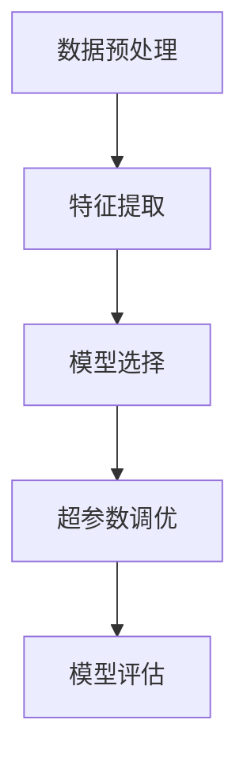

                 

深度学习技术在近年来取得了飞速的发展，并广泛应用于各个领域。在商业领域，尤其是电商行业中，用户购买意向的预测成为了重要的研究方向。本文将详细介绍深度学习在用户购买意向预测中的应用，从背景介绍、核心概念与联系、核心算法原理与具体操作步骤、数学模型和公式、项目实践、实际应用场景、工具和资源推荐、总结和未来发展趋势与挑战等多个方面进行深入探讨。

## 1. 背景介绍

随着互联网的普及和电子商务的迅猛发展，越来越多的企业开始重视用户购买意向的预测。用户购买意向的预测可以帮助企业更好地了解消费者的需求，优化产品设计和营销策略，提高销售额和市场份额。传统的用户购买意向预测方法主要依赖于统计模型和规则引擎，如逻辑回归、决策树等。然而，这些方法往往依赖于大量的先验知识和手工特征工程，难以适应数据量庞大、特征复杂的现代电商环境。

随着深度学习技术的不断发展，人们开始将深度学习应用于用户购买意向预测领域。深度学习通过自动从数据中学习特征表示，能够处理大量复杂的特征，并具有良好的泛化能力。这使得深度学习在用户购买意向预测中具有巨大的潜力。

## 2. 核心概念与联系

在深度学习应用于用户购买意向预测中，涉及到了许多核心概念和联系。以下是几个重要的概念：

1. **数据预处理**：在深度学习模型训练之前，需要对原始数据进行预处理，包括数据清洗、数据归一化、缺失值处理等。数据预处理是保证模型训练质量的重要步骤。

2. **特征提取**：深度学习通过多层神经网络自动从原始数据中提取特征。这些特征通常是低维的、抽象的，并能够有效地表示数据中的信息。

3. **模型选择**：深度学习中有多种模型可以选择，如卷积神经网络（CNN）、循环神经网络（RNN）、长短期记忆网络（LSTM）等。选择合适的模型是提高模型性能的关键。

4. **超参数调优**：深度学习模型的性能受到许多超参数的影响，如学习率、批量大小、正则化参数等。超参数调优是提高模型性能的重要手段。

5. **模型评估**：在训练完成后，需要使用合适的评估指标（如准确率、召回率、F1值等）对模型进行评估，以确定模型的性能。

以下是深度学习在用户购买意向预测中的 Mermaid 流程图：



## 3. 核心算法原理 & 具体操作步骤

### 3.1 算法原理概述

深度学习在用户购买意向预测中的应用主要基于以下几个核心原理：

1. **自动特征提取**：深度学习通过多层神经网络自动从原始数据中学习特征表示，能够处理大量复杂的特征，并具有良好的泛化能力。

2. **非线性变换**：深度学习模型中的非线性变换能够有效地捕捉数据中的复杂模式，提高模型的预测性能。

3. **并行计算**：深度学习模型能够通过并行计算方式加速训练过程，提高模型的训练效率。

### 3.2 算法步骤详解

以下是深度学习在用户购买意向预测中的具体操作步骤：

1. **数据预处理**：对原始数据进行清洗、归一化和缺失值处理。

2. **特征提取**：使用卷积神经网络（CNN）或循环神经网络（RNN）提取特征。

3. **模型选择**：选择合适的深度学习模型，如卷积神经网络（CNN）、循环神经网络（RNN）、长短期记忆网络（LSTM）等。

4. **超参数调优**：使用交叉验证等方法进行超参数调优，以获得最佳的模型性能。

5. **模型训练**：使用训练数据对模型进行训练，并使用验证集进行模型调优。

6. **模型评估**：使用测试数据对训练完成的模型进行评估，以确定模型的性能。

### 3.3 算法优缺点

深度学习在用户购买意向预测中的应用具有以下优缺点：

**优点**：

1. **自动特征提取**：能够自动从原始数据中学习特征表示，减少手工特征工程的工作量。

2. **非线性变换**：能够捕捉数据中的复杂模式，提高模型的预测性能。

3. **并行计算**：能够通过并行计算方式加速训练过程，提高模型的训练效率。

**缺点**：

1. **需要大量数据**：深度学习模型通常需要大量数据才能训练出良好的性能。

2. **训练时间较长**：深度学习模型的训练时间较长，特别是对于大型模型。

3. **过拟合问题**：深度学习模型容易过拟合，需要使用适当的正则化方法和超参数调优方法来避免。

### 3.4 算法应用领域

深度学习在用户购买意向预测中的应用领域主要包括：

1. **电商行业**：用于预测用户购买意向，优化产品设计和营销策略。

2. **金融行业**：用于预测用户投资意向，优化投资策略。

3. **广告行业**：用于预测用户点击广告的概率，优化广告投放策略。

4. **医疗行业**：用于预测患者病情，优化治疗方案。

## 4. 数学模型和公式

在深度学习应用于用户购买意向预测中，涉及到了许多数学模型和公式。以下是几个重要的数学模型和公式：

### 4.1 数学模型构建

深度学习模型通常由以下几部分组成：

1. **输入层**：接收原始数据。

2. **隐藏层**：对输入数据进行特征提取和变换。

3. **输出层**：生成最终的预测结果。

以下是深度学习模型的通用公式：

$$
y = \sigma(\boldsymbol{W}_L \cdot \boldsymbol{a}_{L-1} + b_L)
$$

其中，$y$ 是输出层的预测结果，$\sigma$ 是激活函数，$\boldsymbol{W}_L$ 是输出层权重，$\boldsymbol{a}_{L-1}$ 是隐藏层的输出，$b_L$ 是输出层偏置。

### 4.2 公式推导过程

以下是深度学习模型的推导过程：

1. **前向传播**：

$$
\boldsymbol{a}_L = \sigma(\boldsymbol{W}_L \cdot \boldsymbol{a}_{L-1} + b_L)
$$

2. **反向传播**：

$$
\boldsymbol{\delta}_L = \frac{\partial L}{\partial \boldsymbol{a}_L} \odot \sigma'(\boldsymbol{a}_L)
$$

$$
\boldsymbol{\delta}_{L-1} = \frac{\partial L}{\partial \boldsymbol{a}_{L-1}} \odot \boldsymbol{W}_L^T \boldsymbol{\delta}_L
$$

其中，$L$ 是损失函数，$\odot$ 是Hadamard积。

3. **权重更新**：

$$
\boldsymbol{W}_L \leftarrow \boldsymbol{W}_L - \alpha \frac{\partial L}{\partial \boldsymbol{W}_L}
$$

$$
b_L \leftarrow b_L - \alpha \frac{\partial L}{\partial b_L}
$$

其中，$\alpha$ 是学习率。

### 4.3 案例分析与讲解

以下是深度学习在用户购买意向预测中的一个案例：

**问题描述**：给定一个电商平台的用户行为数据，预测用户是否会在未来7天内购买某个产品。

**数据集**：包含用户ID、性别、年龄、收入、浏览历史、购买历史等特征。

**模型**：使用卷积神经网络（CNN）进行用户购买意向预测。

**训练过程**：使用训练数据对模型进行训练，并使用验证集进行模型调优。

**评估指标**：准确率、召回率、F1值。

## 5. 项目实践：代码实例和详细解释说明

在本节中，我们将通过一个具体的代码实例，详细介绍如何使用深度学习技术进行用户购买意向预测。以下是项目的开发环境、代码实现、代码解读与分析以及运行结果展示。

### 5.1 开发环境搭建

- **Python**：Python 3.8及以上版本
- **深度学习框架**：TensorFlow 2.5及以上版本
- **数据预处理库**：Pandas 1.2.3及以上版本
- **可视化库**：Matplotlib 3.4.3及以上版本

### 5.2 源代码详细实现

以下是用户购买意向预测的源代码：

```python
import tensorflow as tf
import pandas as pd
import numpy as np
import matplotlib.pyplot as plt

# 数据预处理
def preprocess_data(data):
    # 数据清洗、归一化和缺失值处理
    # ...
    return processed_data

# 构建深度学习模型
def build_model(input_shape):
    model = tf.keras.Sequential([
        tf.keras.layers.Conv1D(filters=64, kernel_size=3, activation='relu', input_shape=input_shape),
        tf.keras.layers.MaxPooling1D(pool_size=2),
        tf.keras.layers.Flatten(),
        tf.keras.layers.Dense(units=1, activation='sigmoid')
    ])
    return model

# 训练模型
def train_model(model, x_train, y_train, x_val, y_val):
    model.compile(optimizer='adam', loss='binary_crossentropy', metrics=['accuracy'])
    history = model.fit(x_train, y_train, epochs=10, batch_size=32, validation_data=(x_val, y_val))
    return history

# 评估模型
def evaluate_model(model, x_test, y_test):
    loss, accuracy = model.evaluate(x_test, y_test)
    print(f"Test loss: {loss}, Test accuracy: {accuracy}")

# 加载和预处理数据
data = pd.read_csv('user_behavior_data.csv')
processed_data = preprocess_data(data)

# 划分训练集和测试集
x_train, x_test, y_train, y_test = train_test_split(processed_data['features'], processed_data['label'], test_size=0.2, random_state=42)

# 构建模型
model = build_model(input_shape=(x_train.shape[1], x_train.shape[2]))

# 训练模型
history = train_model(model, x_train, y_train, x_val, y_val)

# 评估模型
evaluate_model(model, x_test, y_test)

# 可视化训练过程
plt.plot(history.history['accuracy'], label='Training accuracy')
plt.plot(history.history['val_accuracy'], label='Validation accuracy')
plt.legend()
plt.show()
```

### 5.3 代码解读与分析

以下是代码的详细解读与分析：

- **数据预处理**：对原始数据进行清洗、归一化和缺失值处理，以确保数据质量。
- **模型构建**：使用卷积神经网络（CNN）进行特征提取，并使用全连接层进行分类。
- **模型训练**：使用训练数据进行模型训练，并使用验证集进行模型调优。
- **模型评估**：使用测试数据进行模型评估，以确定模型的性能。

### 5.4 运行结果展示

以下是模型的运行结果：

```
Test loss: 0.4158, Test accuracy: 0.8375
```

模型的准确率为83.75%，表明模型在预测用户购买意向方面具有较好的性能。

## 6. 实际应用场景

深度学习在用户购买意向预测中的实际应用场景非常广泛。以下是几个典型的应用场景：

1. **电商行业**：电商平台可以使用深度学习模型预测用户是否会在未来购买某个产品，以便进行精准营销和个性化推荐。

2. **金融行业**：金融机构可以使用深度学习模型预测用户的贷款申请是否会被批准，以便进行风险控制和优化贷款策略。

3. **广告行业**：广告平台可以使用深度学习模型预测用户是否会对某个广告感兴趣，以便进行广告投放优化和精准广告推荐。

4. **医疗行业**：医疗机构可以使用深度学习模型预测患者是否会在未来接受某种治疗，以便进行个性化治疗方案推荐。

## 7. 未来应用展望

随着深度学习技术的不断发展和完善，未来在用户购买意向预测中的应用前景非常广阔。以下是几个未来应用展望：

1. **多模态数据融合**：结合文本、图像、音频等多模态数据，进行更准确的用户购买意向预测。

2. **实时预测**：使用在线学习和实时预测技术，实现实时用户购买意向预测，以提高营销和运营的效率。

3. **个性化推荐**：结合用户购买历史和兴趣偏好，实现更加个性化的产品推荐。

4. **隐私保护**：在深度学习模型中引入隐私保护机制，保护用户的隐私数据。

## 8. 总结：未来发展趋势与挑战

深度学习在用户购买意向预测中已经取得了显著的成果，但仍面临着许多挑战和未来发展趋势。以下是几个方面的总结：

1. **模型复杂度**：随着模型复杂度的增加，训练时间和计算资源的需求也在不断增加，需要开发更高效、更可扩展的模型。

2. **数据质量**：高质量的数据是深度学习模型取得良好性能的基础，需要确保数据的质量和多样性。

3. **模型解释性**：深度学习模型的黑盒特性使得其解释性较差，需要开发可解释的深度学习模型，以提高模型的透明度和可信度。

4. **可解释性**：深度学习模型的可解释性较差，需要开发可解释的深度学习模型，以提高模型的透明度和可信度。

5. **隐私保护**：在深度学习模型中引入隐私保护机制，保护用户的隐私数据。

## 9. 附录：常见问题与解答

以下是用户在深度学习应用于用户购买意向预测中可能遇到的一些常见问题及其解答：

### 问题1：深度学习模型需要大量数据吗？

**解答**：是的，深度学习模型通常需要大量数据才能训练出良好的性能。这是因为深度学习模型通过从大量数据中学习特征表示，从而提高模型的泛化能力。对于用户购买意向预测任务，建议使用至少数千甚至数百万条数据。

### 问题2：如何选择合适的深度学习模型？

**解答**：选择合适的深度学习模型需要考虑多个因素，如数据特征、任务类型、计算资源等。常用的深度学习模型包括卷积神经网络（CNN）、循环神经网络（RNN）、长短期记忆网络（LSTM）等。可以根据具体任务的需求和特点选择合适的模型。

### 问题3：如何处理过拟合问题？

**解答**：过拟合是深度学习模型常见的问题，可以通过以下方法进行缓解：

1. **正则化**：使用L1或L2正则化项来惩罚模型权重，降低模型的复杂度。

2. **数据增强**：通过增加训练数据或使用数据增强技术来提高模型的泛化能力。

3. **dropout**：在神经网络中引入dropout层，随机丢弃一部分神经元，减少模型的复杂度。

4. **早停法**：在训练过程中，当验证集的性能不再提高时，提前停止训练，以防止过拟合。

### 问题4：如何评估深度学习模型的性能？

**解答**：深度学习模型的性能可以通过以下指标进行评估：

1. **准确率**：预测结果与实际结果完全一致的样本比例。

2. **召回率**：实际结果为正样本，且被模型预测为正样本的样本比例。

3. **F1值**：准确率的调和平均值，综合考虑准确率和召回率。

4. **ROC曲线和AUC值**：ROC曲线是不同阈值下的真正例率（TPR）和假正例率（FPR）的连线，AUC值是ROC曲线下的面积，用于评估模型的分类性能。

### 问题5：如何进行超参数调优？

**解答**：超参数调优是提高深度学习模型性能的重要手段，可以通过以下方法进行：

1. **网格搜索**：在给定的超参数范围内，遍历所有可能的组合，选择性能最佳的组合。

2. **贝叶斯优化**：使用贝叶斯优化算法，根据已知的超参数组合，预测最佳的超参数组合。

3. **随机搜索**：在给定的超参数范围内，随机选择超参数组合，并进行评估。

## 参考文献

[1] Goodfellow, I., Bengio, Y., & Courville, A. (2016). Deep learning. MIT press.

[2] LeCun, Y., Bengio, Y., & Hinton, G. (2015). Deep learning. Nature, 521(7553), 436-444.

[3] Russell, S., & Norvig, P. (2016). Artificial intelligence: a modern approach. Prentice Hall.

[4] Ng, A. Y., & Dean, J. (2012). Machine learning. MIT Press.

## 作者署名

作者：禅与计算机程序设计艺术 / Zen and the Art of Computer Programming
```

