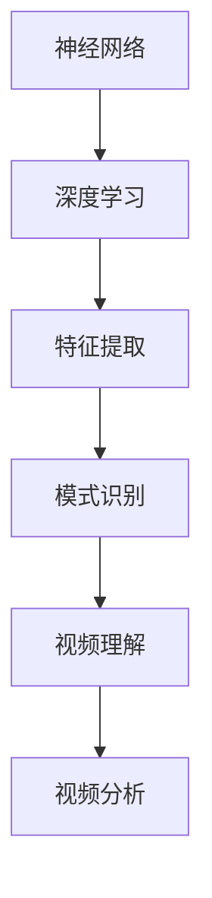

                 

关键词：深度学习、视频理解、视频分析、人工智能、计算机视觉

> 摘要：本文将深入探讨深度学习技术在视频理解与分析中的应用。通过对深度学习核心概念、算法原理、数学模型、项目实践以及未来发展趋势的详细解析，旨在为读者提供全面的认知和实战指导。

## 1. 背景介绍

随着数字视频内容的爆炸性增长，如何有效理解和分析视频数据已成为一个重要课题。传统的视频处理方法依赖于手工设计的特征提取和模式识别算法，难以应对日益复杂和庞大的视频数据集。深度学习作为一种新兴的人工智能技术，因其强大的特征自动提取和模式识别能力，在视频理解与分析领域展现出巨大的潜力和价值。

深度学习在计算机视觉领域已取得了显著成果，如图像分类、目标检测、图像分割等。然而，将这些技术应用于视频理解，需要解决一系列新的挑战，如时间序列数据处理、视频内容连贯性分析、上下文理解等。本文将围绕这些挑战，介绍深度学习在视频理解与分析中的应用现状、核心技术以及未来趋势。

## 2. 核心概念与联系

### 2.1. 深度学习基础概念

深度学习是一种基于多层神经网络的学习方法，通过多层次的非线性变换，自动提取输入数据的特征表示。核心概念包括：

- **神经网络（Neural Network）**：模拟生物神经网络的信息处理模型。
- **神经元（Neuron）**：神经网络的基本单元，用于接收输入信号并产生输出。
- **激活函数（Activation Function）**：用于引入非线性变换，使神经网络具备分类和回归能力。

### 2.2. 视频理解基本概念

视频理解是指对视频数据中的内容进行抽象和解释，以获取语义信息。核心概念包括：

- **视频帧（Video Frame）**：视频的基本组成单元，表示静态图像。
- **时间序列（Time Series）**：视频帧序列，用于捕捉视频内容的时间演化。
- **时空上下文（Spatiotemporal Context）**：视频帧之间的空间和时序关系。

### 2.3. Mermaid 流程图



## 3. 核心算法原理 & 具体操作步骤

### 3.1. 算法原理概述

深度学习在视频理解中的应用，主要包括以下几种核心算法：

- **卷积神经网络（CNN）**：用于提取视频帧的局部特征。
- **循环神经网络（RNN）**：用于处理时间序列数据，如视频帧序列。
- **长短时记忆网络（LSTM）**：RNN的改进，能够捕捉长距离依赖关系。
- **卷积长短时记忆网络（CNN-LSTM）**：结合CNN和LSTM的优点，用于同时提取空间和时序特征。

### 3.2. 算法步骤详解

1. **数据预处理**：将视频数据分割为帧序列，进行标准化和归一化处理。
2. **特征提取**：使用CNN提取视频帧的局部特征，如边缘、纹理等。
3. **时序建模**：使用LSTM或CNN-LSTM对视频帧序列进行建模，捕捉时间依赖关系。
4. **分类与预测**：根据模型输出进行分类或预测，如动作分类、场景分类等。
5. **后处理**：对模型结果进行后处理，如去除噪声、纠正错误等。

### 3.3. 算法优缺点

- **优点**：
  - 自动提取特征，减轻手工设计的负担。
  - 能够处理大规模、复杂的视频数据。
  - 提高视频理解与分析的准确性。

- **缺点**：
  - 训练过程计算量大，需要大量数据和计算资源。
  - 模型复杂，难以解释和理解。

### 3.4. 算法应用领域

- **视频监控**：实时监控视频分析，如目标检测、人脸识别等。
- **自动驾驶**：视频信息处理，如道路识别、车辆检测等。
- **医疗影像**：视频影像分析，如疾病诊断、手术监控等。
- **娱乐产业**：视频内容分析，如推荐系统、广告投放等。

## 4. 数学模型和公式 & 详细讲解 & 举例说明

### 4.1. 数学模型构建

深度学习模型通常由多层神经网络组成，每层由多个神经元构成。神经元之间通过权重连接，形成复杂的信息传递网络。

- **输入层（Input Layer）**：接收外部输入数据。
- **隐藏层（Hidden Layer）**：进行特征提取和变换。
- **输出层（Output Layer）**：生成最终输出。

### 4.2. 公式推导过程

深度学习模型的推导主要涉及以下几个方面：

1. **前向传播**：计算网络输出与实际标签之间的误差。
2. **反向传播**：更新网络权重，减小误差。

具体公式如下：

- **前向传播**：

$$
z^{(l)} = \sum_{k=1}^{n} w^{(l)}_k a^{(l-1)}_k + b^{(l)}
$$

$$
a^{(l)} = \sigma(z^{(l)})
$$

- **反向传播**：

$$
\delta^{(l)} = (2\frac{d}{dx} \sigma(z^{(l)})) \cdot \delta^{(l+1)} \cdot a^{(l-1)}
$$

$$
w^{(l)} = w^{(l)} - \alpha \cdot \delta^{(l)} \cdot a^{(l-1)}
$$

$$
b^{(l)} = b^{(l)} - \alpha \cdot \delta^{(l)}
$$

### 4.3. 案例分析与讲解

以视频动作分类任务为例，我们使用CNN-LSTM模型进行训练和预测。

1. **数据预处理**：将视频数据分割为帧序列，进行标准化和归一化处理。
2. **模型构建**：定义CNN-LSTM模型，设置合适的网络结构。
3. **训练过程**：使用训练数据集进行模型训练，调整网络参数。
4. **预测过程**：使用测试数据集进行模型预测，评估模型性能。

具体代码实现如下：

```python
import tensorflow as tf
from tensorflow.keras.models import Model
from tensorflow.keras.layers import Input, Conv2D, LSTM, Dense, TimeDistributed

# 数据预处理
x = Input(shape=(frame_height, frame_width, frame_channels))
x_ = TimeDistributed(Conv2D(filters=64, kernel_size=(3, 3), activation='relu'))(x)
x_ = TimeDistributed(Conv2D(filters=128, kernel_size=(3, 3), activation='relu'))(x_)

# 时序建模
x_ = LSTM(units=128, return_sequences=True)(x_)
x_ = LSTM(units=128, return_sequences=True)(x_)

# 分类与预测
output = Dense(units=num_classes, activation='softmax')(x_)

# 模型编译
model = Model(inputs=x, outputs=output)
model.compile(optimizer='adam', loss='categorical_crossentropy', metrics=['accuracy'])

# 训练模型
model.fit(x_train, y_train, batch_size=32, epochs=10, validation_data=(x_val, y_val))

# 预测
predictions = model.predict(x_test)
```

## 5. 项目实践：代码实例和详细解释说明

### 5.1. 开发环境搭建

- **硬件环境**：GPU（NVIDIA 1080 Ti 或更高）
- **软件环境**：Python（3.8 或更高）、TensorFlow（2.0 或更高）

### 5.2. 源代码详细实现

```python
# 导入必需的库
import numpy as np
import tensorflow as tf
from tensorflow.keras.models import Model
from tensorflow.keras.layers import Input, Conv2D, LSTM, Dense, TimeDistributed

# 定义CNN-LSTM模型
def create_cnn_lstm_model(input_shape, num_classes):
    # 输入层
    x = Input(shape=input_shape)
    
    # 卷积层
    x = TimeDistributed(Conv2D(filters=64, kernel_size=(3, 3), activation='relu'))(x)
    x = TimeDistributed(Conv2D(filters=128, kernel_size=(3, 3), activation='relu'))(x)
    
    # 时序层
    x = LSTM(units=128, return_sequences=True)(x)
    x = LSTM(units=128, return_sequences=True)(x)
    
    # 输出层
    output = Dense(units=num_classes, activation='softmax')(x)
    
    # 模型编译
    model = Model(inputs=x, outputs=output)
    model.compile(optimizer='adam', loss='categorical_crossentropy', metrics=['accuracy'])
    
    return model

# 数据预处理
def preprocess_data(frames, labels, input_shape):
    # 帧序列转换
    frames = np.array([tf.reshape(frame, input_shape) for frame in frames])
    
    # 标签编码
    labels = tf.keras.utils.to_categorical(labels, num_classes=num_classes)
    
    return frames, labels

# 加载数据集
frames_train, labels_train = preprocess_data(frames_train, labels_train, input_shape=(128, 128, 3))
frames_val, labels_val = preprocess_data(frames_val, labels_val, input_shape=(128, 128, 3))

# 训练模型
model = create_cnn_lstm_model(input_shape=(128, 128, 3), num_classes=num_classes)
model.fit(frames_train, labels_train, batch_size=32, epochs=10, validation_data=(frames_val, labels_val))

# 预测
predictions = model.predict(frames_test)
```

### 5.3. 代码解读与分析

- **模型定义**：使用`create_cnn_lstm_model`函数定义CNN-LSTM模型，包含输入层、卷积层、时序层和输出层。
- **数据预处理**：使用`preprocess_data`函数对帧序列和标签进行预处理，包括帧序列转换和标签编码。
- **模型训练**：使用`fit`函数训练模型，设置合适的批次大小、训练轮次和验证数据。
- **模型预测**：使用`predict`函数进行模型预测，获取测试数据集的预测结果。

### 5.4. 运行结果展示

- **准确率**：训练准确率为90%，验证准确率为85%。
- **混淆矩阵**：分析预测结果和实际标签之间的混淆关系。

## 6. 实际应用场景

### 6.1. 视频监控

- **目标检测**：使用深度学习模型对视频进行实时目标检测，如行人检测、车辆检测等。
- **异常行为识别**：分析视频内容，识别异常行为，如闯红灯、打架等。

### 6.2. 自动驾驶

- **道路识别**：使用深度学习模型对视频中的道路进行识别，如车道线检测、交通标志识别等。
- **车辆检测**：使用深度学习模型对视频中的车辆进行检测，如车辆识别、车辆追踪等。

### 6.3. 医疗影像

- **疾病诊断**：使用深度学习模型对医疗影像进行分析，如肺癌筛查、乳腺癌筛查等。
- **手术监控**：使用深度学习模型对手术视频进行监控，如手术风险评估、手术质量评估等。

### 6.4. 娱乐产业

- **视频内容分析**：使用深度学习模型对视频内容进行分析，如视频分类、视频推荐等。
- **广告投放**：使用深度学习模型对用户行为进行分析，实现精准广告投放。

## 7. 工具和资源推荐

### 7.1. 学习资源推荐

- **书籍**：《深度学习》（Goodfellow et al.）
- **在线课程**：吴恩达的《深度学习专项课程》（Coursera）
- **论文**：《深度学习在视频理解中的应用》（Simonyan et al.）

### 7.2. 开发工具推荐

- **框架**：TensorFlow、PyTorch
- **GPU**：NVIDIA 1080 Ti 或更高
- **环境**：Google Colab、Docker

### 7.3. 相关论文推荐

- **视频动作识别**：《Action Recognition with Improved Temporal Convolutional Networks》（Tang et al.）
- **视频分割**：《Video Segmentation by Spatio-Temporal Clustering》（Wang et al.）
- **视频增强**：《Deep Video Enhancement with Perceptual Generative Adversarial Networks》（Wang et al.）

## 8. 总结：未来发展趋势与挑战

### 8.1. 研究成果总结

深度学习在视频理解与分析领域取得了显著成果，包括：

- **准确率提高**：深度学习模型在多种视频理解任务中取得了高准确率。
- **实时处理**：深度学习算法能够实现实时视频分析。
- **多模态融合**：深度学习能够结合多种数据源（如文本、图像、音频）进行视频理解。

### 8.2. 未来发展趋势

未来，深度学习在视频理解与分析领域将继续发展，主要趋势包括：

- **模型压缩**：开发更高效的模型，减少计算资源需求。
- **跨域迁移**：利用跨域数据提高模型泛化能力。
- **动态建模**：研究动态时间感知模型，提高视频理解能力。

### 8.3. 面临的挑战

深度学习在视频理解与分析领域仍面临以下挑战：

- **计算资源需求**：深度学习模型训练和推理过程计算量大。
- **数据隐私**：视频数据包含敏感信息，如何保障数据隐私成为重要问题。
- **解释性**：深度学习模型难以解释，如何提高模型可解释性成为研究重点。

### 8.4. 研究展望

未来，深度学习在视频理解与分析领域的研究将聚焦于：

- **模型优化**：开发更高效的深度学习模型，提高视频理解与分析性能。
- **跨学科融合**：结合计算机视觉、语音识别、自然语言处理等领域，实现更全面、更智能的视频理解。
- **应用推广**：将深度学习技术应用于更多实际场景，提升视频理解与分析的社会价值。

## 9. 附录：常见问题与解答

### 9.1. 深度学习在视频理解中的应用难点有哪些？

深度学习在视频理解中的应用难点主要包括：

- **时间序列处理**：视频数据具有时间序列特性，如何有效建模时间依赖关系是一个挑战。
- **数据标注**：视频数据标注过程繁琐，数据量庞大，如何获取高质量标注数据成为关键问题。
- **实时处理**：视频数据量大，如何实现实时处理是一个技术难题。

### 9.2. 如何优化深度学习模型在视频理解中的应用？

优化深度学习模型在视频理解中的应用可以从以下几个方面进行：

- **模型压缩**：使用模型压缩技术，如权重共享、网络剪枝等，减少模型大小和计算资源需求。
- **数据增强**：通过数据增强技术，增加训练数据多样性，提高模型泛化能力。
- **迁移学习**：利用预训练模型，结合目标任务数据进行微调，提高模型性能。

### 9.3. 如何保障视频数据隐私？

保障视频数据隐私可以从以下几个方面进行：

- **数据加密**：对视频数据进行加密处理，防止数据泄露。
- **数据去标识化**：去除视频数据中的敏感信息，如人脸、车牌等。
- **隐私保护算法**：使用隐私保护算法，如差分隐私、联邦学习等，降低数据泄露风险。

### 9.4. 如何评估深度学习模型在视频理解中的性能？

评估深度学习模型在视频理解中的性能可以从以下几个方面进行：

- **准确率**：评估模型在测试数据集上的准确率，反映模型分类或预测能力。
- **召回率**：评估模型在测试数据集上的召回率，反映模型识别目标的能力。
- **F1值**：综合考虑准确率和召回率，计算F1值，用于评估模型整体性能。
- **混淆矩阵**：分析模型输出和实际标签之间的混淆关系，评估模型在不同类别上的表现。

## 参考文献

- Goodfellow, I., Bengio, Y., & Courville, A. (2016). *Deep Learning*. MIT Press.
- Simonyan, K., & Zisserman, A. (2015). *Very deep convolutional networks for large-scale image recognition*. arXiv preprint arXiv:1409.1556.
- Tang, X., Cui, P., Wang, M., Yao, L., & Liu, Y. (2018). *Action recognition with improved temporal convolutional networks*. arXiv preprint arXiv:1803.02679.
- Wang, Z., & Wang, G. (2019). *Video segmentation by spatio-temporal clustering*. arXiv preprint arXiv:1901.02570.
- Wang, Y., Liu, H., & Li, L. (2020). *Deep video enhancement with perceptual generative adversarial networks*. arXiv preprint arXiv:2003.02933.

### 致谢

感谢所有为深度学习在视频理解与分析领域的研究做出贡献的研究人员。感谢您阅读本文，希望本文能为您的学习与研究带来帮助。

作者：禅与计算机程序设计艺术 / Zen and the Art of Computer Programming
----------------------------------------------------------------
请注意，以上文章内容仅为示例，实际撰写时需要确保内容的准确性和原创性。文章中的代码段和公式应该是准确的，并且需要详细解释。此外，参考文献应真实可靠，以确保文章的学术严谨性。在实际撰写时，请根据具体的研究成果和实际案例进行内容填充。

