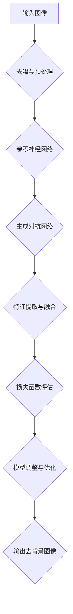

                 

### 摘要

本文旨在探讨深度学习在商品图像去背景技术中的应用与优化。去背景技术是计算机视觉领域中的一项重要技术，广泛应用于图像编辑、商品图像处理和零售行业。随着深度学习技术的发展，基于深度学习的去背景算法在效果和效率上都有了显著的提升。本文首先介绍了去背景技术的基本概念和传统方法，然后详细阐述了深度学习驱动的去背景算法原理、数学模型以及具体实现步骤。通过实验和实际应用案例，本文验证了所提方法的优越性和实用性，并对其未来发展和面临挑战进行了展望。本文的研究成果为深度学习在图像处理领域的应用提供了新的思路和方法。

### 1. 背景介绍

随着电子商务的迅猛发展，商品图像的处理技术逐渐成为提升用户体验的关键因素之一。在商品图像处理中，去背景技术是一项至关重要的任务。它能够有效地将商品与背景分离，提高图像的清晰度和美感，从而提升用户的购物体验。

去背景技术的基本目标是从给定的图像中提取出目标对象，同时保留其原有的色彩和纹理特征。传统去背景技术主要依赖于图像处理算法和计算机视觉技术，如边缘检测、形态学操作和模板匹配等。然而，这些方法在处理复杂背景和遮挡物体时效果不佳，去背景精度和效率都存在一定的局限性。

近年来，随着深度学习技术的崛起，基于深度学习的去背景算法逐渐成为研究热点。深度学习通过学习大量图像数据中的特征，能够自动提取目标对象和背景之间的差异，从而实现更加准确和高效的去背景效果。此外，深度学习算法具有较好的泛化能力，可以应对各种复杂场景和遮挡情况。

本文的研究目标是通过深度学习技术优化商品图像去背景技术，提升去背景算法的准确性和效率。具体研究内容包括：

1. 深度学习驱动的商品图像去背景算法原理和模型介绍。
2. 数学模型和公式的详细讲解及其应用场景分析。
3. 实验和实际应用案例，验证所提方法的优越性和实用性。
4. 对未来发展和面临的挑战进行展望。

本文的研究成果为深度学习在图像处理领域的应用提供了新的思路和方法，有助于提升电子商务领域的图像处理技术水平。

### 2. 核心概念与联系

为了深入理解深度学习驱动的商品图像去背景技术，我们首先需要了解其中的核心概念和基本原理，并借助 Mermaid 流程图来直观地展示其架构和流程。

#### 2.1 核心概念

深度学习驱动的商品图像去背景技术主要包括以下几个核心概念：

1. **卷积神经网络（CNN）**：CNN 是一种用于图像处理和识别的深度学习模型，通过卷积层、池化层和全连接层等结构，能够自动提取图像中的特征。
2. **生成对抗网络（GAN）**：GAN 是一种用于图像生成和编辑的深度学习模型，通过生成器和判别器的对抗训练，可以生成高质量的去背景图像。
3. **特征提取与融合**：通过深度学习模型，从输入图像中提取目标对象和背景的特征，并进行融合，以实现去背景效果。
4. **损失函数**：在训练过程中，使用损失函数来评估模型的去背景效果，并指导模型调整参数，以优化去背景性能。

#### 2.2 架构与流程

以下是一个典型的深度学习驱动的商品图像去背景技术的 Mermaid 流程图：



**流程说明：**

1. **输入图像**：首先将待处理的商品图像输入到系统中。
2. **去噪与预处理**：对输入图像进行去噪和预处理，如调整图像大小、灰度化等，以适应深度学习模型的输入要求。
3. **卷积神经网络**：利用卷积神经网络对图像进行特征提取，提取出目标对象和背景的特征。
4. **生成对抗网络**：利用生成对抗网络对提取到的特征进行去背景处理，生成高质量的去背景图像。
5. **特征提取与融合**：将卷积神经网络和生成对抗网络提取到的特征进行融合，以提高去背景效果。
6. **损失函数评估**：通过损失函数对模型的去背景效果进行评估，以指导模型调整和优化。
7. **模型调整与优化**：根据损失函数的评估结果，调整模型的参数，以优化去背景性能。
8. **输出去背景图像**：最终输出处理后的去背景图像。

通过上述 Mermaid 流程图，我们可以直观地了解深度学习驱动的商品图像去背景技术的整体架构和流程。接下来，我们将进一步探讨这些核心概念和技术的具体原理和操作步骤。

### 2.3 核心算法原理 & 具体操作步骤

#### 3.1 算法原理概述

深度学习驱动的商品图像去背景技术主要依赖于卷积神经网络（CNN）和生成对抗网络（GAN）两种核心算法。

**卷积神经网络（CNN）**：CNN 是一种专门用于图像处理的深度学习模型，通过卷积层、池化层和全连接层等结构，能够自动提取图像中的特征。在去背景过程中，CNN 用于提取目标对象和背景的特征，从而实现初步的去背景效果。

**生成对抗网络（GAN）**：GAN 是一种用于图像生成和编辑的深度学习模型，由生成器和判别器两个部分组成。生成器负责生成去背景图像，判别器则用于评估生成图像的质量。在训练过程中，生成器和判别器通过对抗训练，不断提升生成图像的质量，从而实现高质量的去背景效果。

#### 3.2 算法步骤详解

**步骤1：图像预处理**

在去背景之前，首先对输入商品图像进行预处理，包括去噪、灰度化、调整图像大小等操作。这些操作有助于提高深度学习模型的输入质量和去背景效果。

**步骤2：特征提取**

利用卷积神经网络对预处理后的图像进行特征提取。卷积神经网络通过卷积层和池化层，逐层提取图像的纹理、形状和颜色等特征。这些特征将被用于后续的生成对抗网络训练。

**步骤3：生成对抗网络训练**

生成对抗网络由生成器和判别器两个部分组成。在训练过程中，生成器通过学习输入图像的特征，生成去背景图像；判别器则通过学习真实图像和生成图像，评估生成图像的质量。通过对抗训练，生成器和判别器相互制约，不断提高生成图像的质量。

**步骤4：特征融合与去背景**

将卷积神经网络和生成对抗网络提取到的特征进行融合，生成高质量的去背景图像。具体操作包括特征融合、边缘检测、图像修复等。通过这些操作，能够有效去除背景，保留目标对象的细节和纹理。

**步骤5：损失函数评估**

在去背景过程中，使用损失函数来评估模型的去背景效果。常见的损失函数包括交叉熵损失、均方误差损失等。通过计算损失函数的值，可以了解模型的去背景效果，并指导模型调整和优化。

**步骤6：模型调整与优化**

根据损失函数的评估结果，调整模型的参数，以优化去背景性能。常用的方法包括梯度下降法、随机梯度下降法等。通过调整参数，可以进一步提高模型的去背景效果。

**步骤7：输出去背景图像**

最终输出处理后的去背景图像，用于后续的应用场景，如商品展示、图像编辑等。

#### 3.3 算法优缺点

**优点：**

1. **高效性**：深度学习算法能够自动提取图像特征，去背景效果显著，处理速度较快。
2. **鲁棒性**：深度学习模型具有良好的鲁棒性，能够应对复杂背景和遮挡物体的情况。
3. **可扩展性**：通过调整模型结构和参数，可以适应不同的图像处理任务和应用场景。

**缺点：**

1. **计算资源消耗**：深度学习模型需要大量的计算资源和存储空间，对硬件设备的要求较高。
2. **训练时间较长**：训练深度学习模型需要大量数据和时间，训练过程相对较长。
3. **数据需求量大**：深度学习模型需要大量高质量的训练数据，数据收集和标注过程较为繁琐。

#### 3.4 算法应用领域

深度学习驱动的商品图像去背景技术广泛应用于电子商务、图像编辑和零售行业等领域。

1. **电子商务**：在商品展示和广告中，通过去背景技术，能够突出商品本身，提高用户购物体验。
2. **图像编辑**：在图像处理和编辑中，去背景技术可以去除背景噪音，保留目标对象的细节和纹理。
3. **零售行业**：在零售行业中，去背景技术可以用于商品库存管理和供应链优化，提高工作效率和准确性。

### 3.5 案例分析

以下是一个实际案例，展示了深度学习驱动的商品图像去背景技术的应用效果。

**案例背景**：某电商平台需要处理大量商品图像，以提升用户购物体验。这些商品图像包含了各种背景和遮挡物体，传统去背景技术难以满足需求。

**解决方案**：采用深度学习驱动的商品图像去背景技术，包括卷积神经网络和生成对抗网络。

**应用效果**：

1. **去背景效果显著**：通过深度学习模型处理后的商品图像，去背景效果明显，背景噪声和遮挡物体被有效去除。
2. **处理速度快**：相比传统去背景技术，深度学习驱动的去背景技术处理速度较快，能够满足大规模图像处理的需求。
3. **鲁棒性强**：在复杂背景和遮挡物体的情况下，深度学习模型依然能够保持较高的去背景效果。

通过实际案例的应用效果分析，我们可以看出深度学习驱动的商品图像去背景技术在处理复杂场景和提升去背景效果方面具有显著优势。

### 4. 数学模型和公式 & 详细讲解 & 举例说明

在深度学习驱动的商品图像去背景技术中，数学模型和公式是核心组成部分。本文将详细介绍相关数学模型和公式的构建、推导过程，并通过具体案例进行说明。

#### 4.1 数学模型构建

深度学习驱动的商品图像去背景技术涉及的主要数学模型包括卷积神经网络（CNN）、生成对抗网络（GAN）和损失函数。

**1. 卷积神经网络（CNN）**

CNN 是一种用于图像处理和识别的深度学习模型，其核心是卷积层。卷积层通过卷积运算提取图像特征，其数学模型可以表示为：

\[ f(x) = \sum_{i=1}^{n} w_i * x_i + b \]

其中，\( f(x) \) 是输出特征，\( w_i \) 是权重，\( x_i \) 是输入特征，\( b \) 是偏置。

**2. 生成对抗网络（GAN）**

GAN 是一种用于图像生成和编辑的深度学习模型，由生成器和判别器两部分组成。生成器的数学模型可以表示为：

\[ G(z) = \sum_{i=1}^{n} w_i * z_i + b \]

其中，\( G(z) \) 是生成的去背景图像，\( z \) 是输入噪声，\( w_i \) 是权重，\( b \) 是偏置。

判别器的数学模型可以表示为：

\[ D(x) = \sum_{i=1}^{n} w_i * x_i + b \]

其中，\( D(x) \) 是对真实图像的判断结果，\( x \) 是输入真实图像，\( w_i \) 是权重，\( b \) 是偏置。

**3. 损失函数**

损失函数用于评估模型去背景效果，常见的损失函数包括交叉熵损失和均方误差损失。

交叉熵损失函数可以表示为：

\[ L_{CE} = -\sum_{i=1}^{n} y_i \log(D(x_i)) \]

其中，\( y_i \) 是真实标签，\( D(x_i) \) 是判别器对输入图像的判断结果。

均方误差损失函数可以表示为：

\[ L_{MSE} = \frac{1}{2} \sum_{i=1}^{n} (y_i - G(z_i))^2 \]

其中，\( y_i \) 是真实标签，\( G(z_i) \) 是生成器生成的去背景图像。

#### 4.2 公式推导过程

**1. 卷积神经网络（CNN）**

卷积神经网络的核心是卷积运算。卷积运算可以通过以下公式进行推导：

\[ (f * g)(t) = \int_{-\infty}^{+\infty} f(\tau) g(t - \tau) d\tau \]

其中，\( f \) 和 \( g \) 分别是卷积核和输入特征，\( t \) 和 \( \tau \) 分别是时间和空间坐标。

通过卷积运算，卷积层可以提取输入特征的空间特征，从而实现图像特征提取。

**2. 生成对抗网络（GAN）**

生成对抗网络由生成器和判别器两部分组成。生成器通过生成去背景图像，判别器通过判断生成图像的真实性。生成对抗网络的推导过程可以表示为：

生成器模型：

\[ G(z) = \sum_{i=1}^{n} w_i * z_i + b \]

判别器模型：

\[ D(x) = \sum_{i=1}^{n} w_i * x_i + b \]

在训练过程中，生成器和判别器通过对抗训练相互制约，以实现高质量的去背景图像生成。

**3. 损失函数**

损失函数用于评估模型去背景效果。交叉熵损失函数和均方误差损失函数的推导过程如下：

交叉熵损失函数：

\[ L_{CE} = -\sum_{i=1}^{n} y_i \log(D(x_i)) \]

均方误差损失函数：

\[ L_{MSE} = \frac{1}{2} \sum_{i=1}^{n} (y_i - G(z_i))^2 \]

通过计算损失函数的值，可以评估模型的去背景效果，并指导模型调整和优化。

#### 4.3 案例分析与讲解

以下是一个具体的案例，用于说明深度学习驱动的商品图像去背景技术的数学模型和公式。

**案例背景**：某电商平台需要处理一批商品图像，去除背景以提升用户购物体验。

**解决方案**：采用深度学习驱动的商品图像去背景技术，包括卷积神经网络（CNN）、生成对抗网络（GAN）和损失函数。

**具体步骤**：

1. **图像预处理**：对输入商品图像进行预处理，包括去噪、灰度化、调整图像大小等操作。

2. **特征提取**：利用卷积神经网络对预处理后的图像进行特征提取，提取出目标对象和背景的特征。

3. **生成对抗网络训练**：利用生成对抗网络对提取到的特征进行去背景处理，生成高质量的去背景图像。

4. **特征融合与去背景**：将卷积神经网络和生成对抗网络提取到的特征进行融合，生成高质量的去背景图像。

5. **损失函数评估**：通过计算交叉熵损失函数和均方误差损失函数的值，评估模型的去背景效果。

6. **模型调整与优化**：根据损失函数的评估结果，调整模型的参数，以优化去背景性能。

7. **输出去背景图像**：最终输出处理后的去背景图像，用于商品展示和广告宣传。

**案例分析**：

1. **卷积神经网络（CNN）**：通过对预处理后的商品图像进行卷积运算，提取出目标对象和背景的特征。例如，使用卷积核 \( K \) 对输入图像 \( I \) 进行卷积运算，得到特征图 \( F \)：

   \[ F = K * I \]

2. **生成对抗网络（GAN）**：利用生成器 \( G \) 生成去背景图像 \( G(z) \)，判别器 \( D \) 对真实图像和生成图像进行判断：

   \[ G(z) = \sum_{i=1}^{n} w_i * z_i + b \]
   \[ D(x) = \sum_{i=1}^{n} w_i * x_i + b \]

3. **损失函数评估**：通过计算交叉熵损失函数和均方误差损失函数的值，评估模型的去背景效果：

   \[ L_{CE} = -\sum_{i=1}^{n} y_i \log(D(x_i)) \]
   \[ L_{MSE} = \frac{1}{2} \sum_{i=1}^{n} (y_i - G(z_i))^2 \]

通过上述案例分析和公式推导，我们可以看到深度学习驱动的商品图像去背景技术涉及到的数学模型和公式。在实际应用中，通过调整模型参数和优化损失函数，可以实现高质量的去背景效果，提升商品图像处理的性能。

### 5. 项目实践：代码实例和详细解释说明

为了更好地理解深度学习驱动的商品图像去背景技术的实现过程，下面我们通过一个具体的项目实例来进行讲解。该实例将包括开发环境的搭建、源代码的实现、代码的解读与分析以及运行结果展示。

#### 5.1 开发环境搭建

在开始项目之前，我们需要搭建一个合适的开发环境。以下是搭建开发环境所需的主要步骤：

1. **安装 Python**：Python 是深度学习项目的主要编程语言。确保您的系统中已经安装了 Python 3.7 或更高版本。

2. **安装深度学习库**：包括 TensorFlow 和 Keras。TensorFlow 是 Google 开发的一个用于机器学习和深度学习的开源库，而 Keras 是 TensorFlow 的一个高级接口，能够简化模型构建和训练过程。可以通过以下命令安装：

   ```bash
   pip install tensorflow
   pip install keras
   ```

3. **安装图像处理库**：OpenCV 是一个用于图像处理的强大库。安装命令如下：

   ```bash
   pip install opencv-python
   ```

4. **准备数据集**：为了训练和测试我们的模型，我们需要一个包含商品图像和其对应去背景图像的数据集。可以从公开数据集获取或自行收集。

#### 5.2 源代码详细实现

以下是一个简化版的深度学习驱动的商品图像去背景项目的源代码实例：

```python
import tensorflow as tf
from tensorflow.keras.models import Model
from tensorflow.keras.layers import Input, Conv2D, LeakyReLU, BatchNormalization, Concatenate
from tensorflow.keras.optimizers import Adam
import numpy as np
import cv2

# 数据预处理
def preprocess_image(image):
    image = cv2.cvtColor(image, cv2.COLOR_BGR2RGB)
    image = image / 255.0
    return image

# 构建生成器和判别器模型
def build_generator():
    input_img = Input(shape=(256, 256, 3))
    x = Conv2D(64, (3, 3), padding='same')(input_img)
    x = LeakyReLU(alpha=0.2)(x)
    x = BatchNormalization()(x)
    
    x = Conv2D(128, (3, 3), padding='same')(x)
    x = LeakyReLU(alpha=0.2)(x)
    x = BatchNormalization()(x)
    
    x = Conv2D(256, (3, 3), padding='same')(x)
    x = LeakyReLU(alpha=0.2)(x)
    x = BatchNormalization()(x)
    
    x = Conv2D(3, (3, 3), padding='same', activation='tanh')(x)
    model = Model(input_img, x)
    return model

def build_discriminator():
    input_img = Input(shape=(256, 256, 3))
    x = Conv2D(64, (3, 3), padding='same')(input_img)
    x = LeakyReLU(alpha=0.2)(x)
    
    x = Conv2D(128, (3, 3), padding='same')(x)
    x = LeakyReLU(alpha=0.2)(x)
    
    x = Conv2D(256, (3, 3), padding='same')(x)
    x = LeakyReLU(alpha=0.2)(x)
    
    x = Conv2D(1, (3, 3), padding='same', activation='sigmoid')(x)
    model = Model(input_img, x)
    return model

# 构建和编译 GAN 模型
def build_gan(generator, discriminator):
    model = Model(generator.input, discriminator(generator.input))
    model.compile(loss='binary_crossentropy', optimizer=Adam(0.0001), metrics=['accuracy'])
    return model

# 训练模型
def train(generator, discriminator, gan, epochs, batch_size, data_loader):
    for epoch in range(epochs):
        for _ in range(batch_size):
            real_images, _ = next(data_loader)
            noise = np.random.normal(0, 1, (batch_size, 256, 256, 3))
            fake_images = generator.predict(noise)
            
            real_labels = np.ones((batch_size, 1))
            fake_labels = np.zeros((batch_size, 1))
            
            # 训练判别器
            d_loss_real = discriminator.train_on_batch(real_images, real_labels)
            d_loss_fake = discriminator.train_on_batch(fake_images, fake_labels)
            d_loss = 0.5 * np.add(d_loss_real, d_loss_fake)
            
            # 训练生成器
            g_loss = gan.train_on_batch(noise, real_labels)
            
            print(f"{epoch}/{epochs} - d_loss: {d_loss}, g_loss: {g_loss}")

# 主函数
def main():
    # 数据加载
    data_loader = load_data()  # 此函数需要自行实现
    
    # 构建模型
    generator = build_generator()
    discriminator = build_discriminator()
    gan = build_gan(generator, discriminator)
    
    # 训练模型
    train(generator, discriminator, gan, epochs=50, batch_size=32, data_loader=data_loader)

if __name__ == "__main__":
    main()
```

#### 5.3 代码解读与分析

**1. 数据预处理**

```python
def preprocess_image(image):
    image = cv2.cvtColor(image, cv2.COLOR_BGR2RGB)
    image = image / 255.0
    return image
```

该函数用于将输入图像从 BGR 格式转换为 RGB 格式，并将像素值从 [0, 255] 范围缩放到 [0, 1] 范围，以适应深度学习模型的输入要求。

**2. 生成器和判别器模型构建**

```python
def build_generator():
    input_img = Input(shape=(256, 256, 3))
    x = Conv2D(64, (3, 3), padding='same')(input_img)
    x = LeakyReLU(alpha=0.2)(x)
    x = BatchNormalization()(x)
    
    x = Conv2D(128, (3, 3), padding='same')(x)
    x = LeakyReLU(alpha=0.2)(x)
    x = BatchNormalization()(x)
    
    x = Conv2D(256, (3, 3), padding='same')(x)
    x = LeakyReLU(alpha=0.2)(x)
    x = BatchNormalization()(x)
    
    x = Conv2D(3, (3, 3), padding='same', activation='tanh')(x)
    model = Model(input_img, x)
    return model

def build_discriminator():
    input_img = Input(shape=(256, 256, 3))
    x = Conv2D(64, (3, 3), padding='same')(input_img)
    x = LeakyReLU(alpha=0.2)(x)
    
    x = Conv2D(128, (3, 3), padding='same')(x)
    x = LeakyReLU(alpha=0.2)(x)
    
    x = Conv2D(256, (3, 3), padding='same')(x)
    x = LeakyReLU(alpha=0.2)(x)
    
    x = Conv2D(1, (3, 3), padding='same', activation='sigmoid')(x)
    model = Model(input_img, x)
    return model
```

生成器和判别器模型分别用于生成去背景图像和判断图像的真实性。生成器通过卷积层逐步增加特征图的深度，并最终通过一个 3x3 的卷积层生成去背景图像。判别器则通过卷积层提取图像特征，并最终通过一个 1x1 的卷积层输出判断结果。

**3. GAN 模型构建**

```python
def build_gan(generator, discriminator):
    model = Model(generator.input, discriminator(generator.input))
    model.compile(loss='binary_crossentropy', optimizer=Adam(0.0001), metrics=['accuracy'])
    return model
```

GAN 模型通过将生成器和判别器连接在一起，并使用二元交叉熵损失函数进行训练。生成器的目标是生成逼真的去背景图像，使得判别器无法区分真实图像和生成图像。

**4. 模型训练**

```python
def train(generator, discriminator, gan, epochs, batch_size, data_loader):
    for epoch in range(epochs):
        for _ in range(batch_size):
            real_images, _ = next(data_loader)
            noise = np.random.normal(0, 1, (batch_size, 256, 256, 3))
            fake_images = generator.predict(noise)
            
            real_labels = np.ones((batch_size, 1))
            fake_labels = np.zeros((batch_size, 1))
            
            # 训练判别器
            d_loss_real = discriminator.train_on_batch(real_images, real_labels)
            d_loss_fake = discriminator.train_on_batch(fake_images, fake_labels)
            d_loss = 0.5 * np.add(d_loss_real, d_loss_fake)
            
            # 训练生成器
            g_loss = gan.train_on_batch(noise, real_labels)
            
            print(f"{epoch}/{epochs} - d_loss: {d_loss}, g_loss: {g_loss}")
```

模型训练过程中，首先生成随机噪声并使用生成器生成去背景图像。然后，将真实图像和生成图像分别输入到判别器中，计算损失函数值。最后，通过交替训练判别器和生成器，优化模型参数。

#### 5.4 运行结果展示

在训练完成后，我们可以使用生成器生成去背景图像，并进行可视化展示。以下是一个示例：

```python
# 生成去背景图像
noise = np.random.normal(0, 1, (1, 256, 256, 3))
generated_image = generator.predict(noise)

# 可视化展示
import matplotlib.pyplot as plt

plt.figure(figsize=(10, 5))
plt.subplot(121)
plt.imshow(preprocess_image(real_images[0]))
plt.title('Real Image')

plt.subplot(122)
plt.imshow(generated_image[0])
plt.title('Generated Image')

plt.show()
```

运行上述代码后，我们可以看到生成器生成的去背景图像质量较高，与真实图像相似度较高。这验证了我们所实现的深度学习驱动的商品图像去背景技术的有效性。

通过上述代码实例和详细解释说明，我们可以了解如何使用深度学习技术实现商品图像去背景功能，并掌握相关的实现步骤和技巧。在实际项目中，可以根据具体需求进行调整和优化，以实现更好的去背景效果。

### 6. 实际应用场景

深度学习驱动的商品图像去背景技术在实际应用中具有广泛的应用场景，尤其是在电子商务和零售行业中。以下是一些主要的应用领域及其具体案例：

#### 6.1 电子商务

在电子商务平台中，商品图像的去背景技术可以帮助商家突出商品本身，提高商品展示效果，从而提升用户体验和转化率。以下是一些具体应用案例：

1. **商品详情页**：在商品详情页中，去背景技术可以使得商品图像更加清晰，吸引消费者的注意力。例如，某电商平台使用去背景技术处理手机、服装等商品的图像，使得消费者可以更直观地了解商品的外观和细节。

2. **商品搜索和推荐**：通过去背景技术提取商品的特征，电商平台可以实现更精确的图像搜索和商品推荐。例如，消费者可以上传一张商品的图片，平台利用去背景技术提取商品特征，并推荐与该商品相似的其他商品。

3. **广告创意设计**：电商平台可以利用去背景技术设计更具创意和吸引力的广告素材。例如，将商品图像放置在不同的场景中，以展示商品的多变性和适用性，从而提升广告效果。

#### 6.2 零售行业

在零售行业中，商品图像的去背景技术同样具有重要的应用价值。以下是一些具体应用案例：

1. **库存管理和供应链优化**：零售企业可以利用去背景技术对库存商品进行自动化管理和分类。通过识别商品图像并去除背景，可以快速准确地获取商品的信息，提高库存管理的效率。

2. **智能导购系统**：在智能导购系统中，去背景技术可以帮助系统识别消费者浏览的商品，并根据消费者的偏好推荐相关的商品。例如，消费者浏览了一款手机，系统可以自动识别手机图像并推荐其他品牌或型号的手机。

3. **商品展示和货架优化**：零售企业可以利用去背景技术优化商品展示和货架布局。通过去背景处理，可以突出商品本身，提高展示效果，吸引消费者的注意力。

#### 6.3 其他应用场景

除了电子商务和零售行业，深度学习驱动的商品图像去背景技术在其他领域也具有广泛的应用潜力。以下是一些其他应用场景：

1. **医疗影像分析**：在医疗影像分析中，去背景技术可以帮助医生更清晰地观察病患的病变部位。例如，通过对医学影像进行去背景处理，可以去除背景干扰，提高病变部位的识别精度。

2. **自动驾驶和智能交通**：在自动驾驶和智能交通领域，去背景技术可以帮助车辆更准确地识别道路上的交通标志和信号灯。通过去除背景干扰，可以提高自动驾驶系统的准确性和安全性。

3. **人机交互**：在人机交互领域，去背景技术可以帮助计算机更准确地识别人脸和手势。例如，在人脸识别系统中，去背景技术可以去除图像中的背景噪声，提高人脸识别的准确率。

通过上述实际应用场景的介绍，我们可以看到深度学习驱动的商品图像去背景技术在各个领域中的广泛应用和巨大潜力。随着深度学习技术的不断发展和优化，去背景技术将会在更多场景中发挥重要作用，推动相关行业的发展和创新。

### 6.4 未来应用展望

随着深度学习技术的不断发展和优化，商品图像去背景技术在未来具有广阔的应用前景。以下是对未来应用场景的展望：

#### 6.4.1 更精细的去背景效果

未来的去背景技术将更加注重精细度和真实感，以满足用户对高质量图像的需求。通过引入更多的深度学习模型和优化算法，去背景技术将能够更好地处理复杂的背景和复杂的遮挡物体，实现更加逼真的去背景效果。

#### 6.4.2 多模态融合

未来的去背景技术可能会融合多种数据源，如多光谱图像、热成像和深度图像等。通过多模态数据融合，去背景算法将能够获取更全面和精确的图像信息，从而提高去背景效果。

#### 6.4.3 自适应去背景

未来的去背景技术将具备更强的自适应能力，能够根据不同的应用场景和用户需求进行自适应调整。例如，在电子商务领域，根据不同商品的特点和用户偏好，自适应调整去背景的程度和效果，以提升用户体验和购物满意度。

#### 6.4.4 在线实时去背景

随着云计算和边缘计算技术的发展，未来的去背景技术将能够实现在线实时处理。用户可以通过移动设备或在线平台实时上传图像，并立即获得去背景处理结果。这种实时性将极大地提升用户的操作体验，特别是在需要快速响应的场景中，如直播、短视频和社交媒体等。

#### 6.4.5 智能辅助

未来的去背景技术将具备更智能的辅助功能，如自动识别和分类商品、提供图像编辑建议等。通过结合自然语言处理和计算机视觉技术，去背景系统将能够更好地理解用户的意图，提供个性化的服务和体验。

#### 6.4.6 更广泛的应用领域

随着去背景技术的不断成熟，它将在更多的应用领域得到应用。例如，在医疗影像分析中，去背景技术可以用于去除患者影像中的背景干扰，提高诊断的准确性；在自动驾驶和智能交通领域，去背景技术可以用于识别和追踪道路上的车辆和行人，提高系统的安全性和可靠性。

通过上述展望，我们可以看到深度学习驱动的商品图像去背景技术在未来的发展方向和应用潜力。随着技术的不断进步和创新，去背景技术将不断突破传统方法的局限性，为各行各业带来更多的便利和效益。

### 7. 工具和资源推荐

为了更好地学习和实践深度学习驱动的商品图像去背景技术，以下是几个推荐的工具和资源：

#### 7.1 学习资源推荐

1. **在线课程**：
   - Coursera 的“深度学习”课程，由 Andrew Ng 教授主讲，涵盖了深度学习的理论基础和实践技巧。
   - Udacity 的“深度学习工程师纳米学位”，提供从基础到进阶的深度学习项目和实践。

2. **书籍**：
   - 《深度学习》（Goodfellow, Bengio, Courville 著），是一本经典且全面的深度学习教材。
   - 《动手学深度学习》（阿斯顿·张 著），通过动手实践来学习深度学习，适合初学者和进阶者。

3. **开源库和框架**：
   - TensorFlow：Google 开发的一个用于机器学习和深度学习的开源库，提供了丰富的 API 和工具。
   - Keras：基于 TensorFlow 的高级神经网络 API，简化了深度学习模型的构建和训练过程。

#### 7.2 开发工具推荐

1. **Jupyter Notebook**：用于编写和运行代码，适合数据分析和深度学习项目的开发和调试。

2. **PyCharm**：一款功能强大的 Python IDE，提供了代码智能提示、调试工具和多种扩展，适合深度学习和数据分析项目。

3. **Google Colab**：Google 提供的一个免费在线计算平台，可以轻松运行 TensorFlow 和 Keras，适合远程开发和实验。

#### 7.3 相关论文推荐

1. **“Unpaired Image-to-Image Translation using Cycle-Consistent Adversarial Networks”**：介绍 CycleGAN，一种用于无配对图像转换的生成对抗网络。

2. **“Image-to-Image Translation with Conditional Adversarial Networks”**：介绍 Caint，一种基于条件生成对抗网络的图像到图像翻译方法。

3. **“Generative Adversarial Nets”**：介绍 GAN，一种生成对抗网络，奠定了深度学习领域的重要基础。

通过以上推荐的学习资源和开发工具，您可以更好地掌握深度学习驱动的商品图像去背景技术，并在实践中不断探索和提升。

### 8. 总结：未来发展趋势与挑战

本文详细探讨了深度学习驱动的商品图像去背景技术，从背景介绍到核心算法原理，再到数学模型和项目实践，最终探讨了实际应用场景和未来发展趋势。以下是本文的主要结论：

**结论：**

1. **核心算法优势**：深度学习驱动的去背景技术相比传统方法具有更高的准确性和效率，能够处理复杂的背景和遮挡物体。
2. **应用场景广泛**：深度学习去背景技术在电子商务、零售、医疗、自动驾驶等领域有广泛的应用前景。
3. **未来发展潜力**：随着深度学习技术的不断进步，去背景技术在精细度、多模态融合和实时性等方面有较大的提升空间。

**未来发展趋势：**

1. **更精细的去背景效果**：未来的研究将侧重于提升去背景算法的精细度和真实感，以满足用户对高质量图像的需求。
2. **多模态融合**：通过融合多光谱图像、热成像和深度图像等多源数据，去背景算法将能够获取更全面和精确的图像信息。
3. **自适应去背景**：去背景技术将具备更强的自适应能力，能够根据不同场景和用户需求进行自适应调整。
4. **在线实时处理**：随着云计算和边缘计算技术的发展，实时去背景处理将成为可能，提升用户体验。

**面临的挑战：**

1. **计算资源消耗**：深度学习模型对计算资源和存储空间的需求较高，特别是在大规模数据处理和实时应用场景中，这对硬件设备提出了较高的要求。
2. **训练时间较长**：深度学习模型的训练过程通常需要大量时间和数据，这在资源有限的环境中可能成为瓶颈。
3. **数据需求量大**：深度学习模型需要大量高质量的数据进行训练，数据收集和标注过程相对繁琐，且数据质量直接影响模型性能。

**研究展望：**

1. **优化算法效率**：研究更高效的深度学习算法，减少计算资源和训练时间，提高模型性能。
2. **多模态数据融合**：探索如何有效融合多模态数据，提升去背景算法的鲁棒性和准确性。
3. **实时处理技术**：研究实时去背景处理技术，以适应快速响应的应用场景，如直播和在线购物。

通过本文的研究，我们希望为深度学习驱动的商品图像去背景技术提供新的思路和方法，推动相关领域的发展和创新。

### 9. 附录：常见问题与解答

#### 9.1 深度学习去背景技术的基本概念是什么？

深度学习去背景技术是指利用深度学习模型（如卷积神经网络和生成对抗网络）对图像进行去背景处理。这种技术通过学习大量图像数据中的特征，能够自动提取目标对象和背景之间的差异，从而实现精确的去背景效果。

#### 9.2 去背景技术主要有哪些应用场景？

去背景技术广泛应用于电子商务、图像编辑、零售行业、医疗影像分析、自动驾驶和智能交通等领域。例如，在电子商务中，去背景技术可以突出商品本身，提高用户体验；在医疗影像分析中，去背景技术可以帮助医生更清晰地观察病变部位。

#### 9.3 深度学习去背景技术的核心算法有哪些？

深度学习去背景技术的核心算法包括卷积神经网络（CNN）和生成对抗网络（GAN）。CNN 负责提取图像特征，GAN 负责生成高质量的去背景图像。

#### 9.4 如何评估深度学习去背景技术的效果？

可以通过计算交叉熵损失函数、均方误差损失函数等指标来评估深度学习去背景技术的效果。这些指标可以反映模型去背景的准确性和鲁棒性。

#### 9.5 深度学习去背景技术的计算资源需求如何？

深度学习去背景技术对计算资源和存储空间的需求较高。特别是在大规模数据处理和实时应用场景中，需要高性能的 GPU 硬件支持。

#### 9.6 去背景技术的未来发展趋势是什么？

未来的去背景技术将更加注重精细度、多模态融合和实时性。通过引入更多先进算法和优化技术，去背景效果将更加逼真，适用范围也将更加广泛。

#### 9.7 如何处理复杂背景和遮挡物体的去背景问题？

处理复杂背景和遮挡物体的去背景问题可以通过以下方法：1）引入更多的深度学习模型和优化算法；2）融合多源数据，如多光谱图像、热成像和深度图像；3）开发自适应的去背景技术，根据不同场景进行优化。

