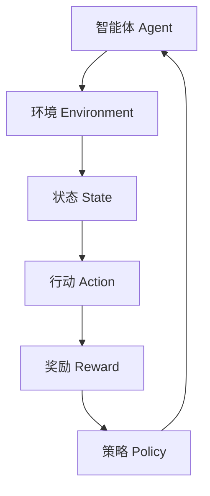

                 

关键词：深度强化学习、库存管理、实践、优化、供应链管理、AI应用

## 摘要

本文旨在探讨深度强化学习（Deep Reinforcement Learning，DRL）在库存管理中的应用及其优化策略。首先，我们对库存管理的基本概念进行了介绍，然后详细阐述了深度强化学习的工作原理及其在优化库存管理中的应用。通过具体案例和数学模型，我们展示了如何将深度强化学习应用于库存管理中的实际操作。文章最后提出了未来应用展望和面临的挑战，以期为相关领域的科研工作者和行业实践者提供有价值的参考。

## 1. 背景介绍

库存管理是企业运营中的重要环节，直接影响企业的成本控制和供应链效率。然而，库存管理的复杂性使得传统的库存管理方法难以满足现代供应链的需求。随着人工智能技术的不断发展，尤其是深度强化学习的兴起，为库存管理提供了新的解决方案。

深度强化学习是一种基于深度神经网络和强化学习理论的人工智能技术。它通过智能体与环境的交互，不断学习和优化策略，从而实现决策的自动化和智能化。在库存管理中，深度强化学习可以通过模拟和优化库存决策过程，提高库存管理的效率和准确性。

### 1.1 库存管理的重要性

库存管理的重要性在于它直接影响到企业的运营成本和供应链效率。有效的库存管理能够确保企业供应链的稳定性，降低库存成本，提高资金利用率，同时满足客户需求，提升客户满意度。然而，库存管理面临着许多挑战，如需求预测的不确定性、供应链的复杂性、库存成本的控制等。

### 1.2 人工智能与库存管理

人工智能技术的快速发展为库存管理带来了新的机遇。传统的库存管理方法主要依赖于历史数据和统计模型，难以应对复杂多变的市场环境。人工智能，特别是深度强化学习，通过模拟和优化库存决策过程，提供了更智能、更高效的库存管理解决方案。

### 1.3 深度强化学习在库存管理中的应用

深度强化学习在库存管理中的应用主要体现在两个方面：一是用于需求预测，二是用于库存决策优化。在需求预测方面，深度强化学习可以模拟不同市场状况下的需求变化，提供更准确的预测结果。在库存决策优化方面，深度强化学习可以通过不断学习和优化库存策略，提高库存管理的效率和准确性。

## 2. 核心概念与联系

为了深入理解深度强化学习在库存管理中的应用，我们需要首先了解深度强化学习的基本概念和原理。下面，我们将通过一个Mermaid流程图来展示深度强化学习的核心概念和联系。



### 2.1 智能体（Agent）

智能体是指执行决策的实体，它可以是一个算法、一个机器人或一个人类。在库存管理中，智能体通常是一个基于深度强化学习的算法模型，用于模拟库存决策过程。

### 2.2 环境（Environment）

环境是指智能体执行行动的场所，它可以是一个现实世界的场景，也可以是一个虚拟的模拟环境。在库存管理中，环境可以是一个模拟的供应链系统，用于模拟市场需求和库存状态。

### 2.3 状态（State）

状态是智能体在执行行动之前所处的状况，通常用一组特征向量表示。在库存管理中，状态可以包括库存水平、需求预测、供应链延迟等信息。

### 2.4 行动（Action）

行动是智能体根据当前状态做出的决策，它可以是一个具体的操作，如补充库存或减少库存。在库存管理中，行动通常包括调整库存水平、修改供应链策略等。

### 2.5 奖励（Reward）

奖励是环境对智能体行动的反馈，它用于评估智能体的行动效果。在库存管理中，奖励可以是一个成本指标，如库存成本、缺货成本等。

### 2.6 策略（Policy）

策略是智能体根据状态和奖励制定的行为规则，它用于指导智能体的行动。在库存管理中，策略可以通过深度强化学习模型自动优化，以提高库存管理的效率和准确性。

## 3. 核心算法原理 & 具体操作步骤

### 3.1 算法原理概述

深度强化学习是一种通过试错法学习和优化决策过程的人工智能技术。它通过智能体在环境中执行行动，接收环境反馈的奖励，不断调整和优化策略，从而实现最优决策。

在库存管理中，深度强化学习可以通过以下步骤实现：

1. 初始化智能体和环境的参数。
2. 智能体根据当前状态选择行动。
3. 环境根据行动产生新的状态和奖励。
4. 智能体接收奖励，更新策略。
5. 重复步骤2-4，直到达到预定的目标。

### 3.2 算法步骤详解

1. **初始化参数**：初始化智能体和环境的参数，包括状态空间、行动空间、奖励函数等。

2. **状态观测**：智能体通过传感器或模拟器获取当前状态。

3. **行动选择**：智能体根据当前状态和策略选择行动。

4. **状态转移**：环境根据智能体的行动产生新的状态。

5. **奖励反馈**：环境根据新的状态对智能体的行动进行奖励反馈。

6. **策略更新**：智能体根据奖励反馈更新策略，以优化行动决策。

7. **迭代学习**：重复步骤2-6，直到达到预定的目标，如最小化库存成本或最大化客户满意度。

### 3.3 算法优缺点

**优点**：

- **自适应性强**：深度强化学习可以根据环境的变化自适应调整策略，适应不同的库存管理场景。
- **高效性**：通过模拟和优化库存决策过程，可以提高库存管理的效率和准确性。
- **通用性**：深度强化学习可以应用于不同的库存管理场景，具有较强的通用性。

**缺点**：

- **计算复杂度高**：深度强化学习需要大量的计算资源和时间，特别是对于复杂的库存管理场景。
- **训练时间较长**：深度强化学习需要大量的迭代次数，以实现策略的优化，训练时间较长。

### 3.4 算法应用领域

深度强化学习在库存管理中的应用领域主要包括：

- **需求预测**：通过模拟市场需求的变化，提供更准确的预测结果，为库存决策提供依据。
- **库存决策优化**：通过模拟和优化库存决策过程，提高库存管理的效率和准确性。
- **供应链优化**：通过模拟和优化供应链管理，降低库存成本，提高供应链效率。

## 4. 数学模型和公式 & 详细讲解 & 举例说明

### 4.1 数学模型构建

在深度强化学习应用于库存管理时，我们可以构建一个数学模型来描述库存管理的过程。该模型主要包括以下要素：

- **状态空间 \(S\)**：表示库存管理系统当前的状态，如库存水平、需求预测等。
- **行动空间 \(A\)**：表示智能体可以采取的行动，如补充库存、减少库存等。
- **奖励函数 \(R(s, a)\)**：表示智能体在状态 \(s\) 采取行动 \(a\) 后获得的奖励，如库存成本、缺货成本等。
- **策略 \(π(s)\)**：表示智能体在状态 \(s\) 采取特定行动的概率分布。

### 4.2 公式推导过程

我们首先定义一个价值函数 \(V^π(s)\)，它表示在策略 \(π\) 下，智能体在状态 \(s\) 的期望累积奖励。价值函数可以通过以下递归方程计算：

$$
V^π(s) = R(s, π(s)) + γV^π(s')
$$

其中，\(γ\) 是折扣因子，表示未来奖励的现值折扣。\(s'\) 是智能体在状态 \(s\) 采取行动 \(a\) 后的状态。

为了求解价值函数，我们可以使用深度神经网络（DNN）来近似价值函数，即：

$$
V(s) = f_{DNN}(s; \theta)
$$

其中，\(f_{DNN}\) 是一个深度神经网络函数，\(\theta\) 是神经网络的参数。

### 4.3 案例分析与讲解

假设一个企业需要管理其库存，该库存系统包含两种商品A和B。当前状态为库存水平为 [10, 20]，需求预测为 [15, 10]。智能体需要根据当前状态选择行动，如补充库存或减少库存。奖励函数为库存成本，即库存量越高，库存成本越高。

我们定义状态空间为 \(S = \{ (s_1, s_2) | s_1, s_2 \in [0, 100] \}\)，行动空间为 \(A = \{ add, remove \}\)。奖励函数为 \(R(s, a)\)，其中 \(a = add\) 时，\(R(s, a) = -C \times (s_1 + s_2)\)，\(a = remove\) 时，\(R(s, a) = -C \times (s_1 + s_2 - 50)\)。

我们使用一个两层的深度神经网络来近似价值函数 \(V(s)\)。神经网络的结构如下：

- 输入层：2个神经元，分别对应商品A和B的库存水平。
- 隐藏层：10个神经元，使用ReLU激活函数。
- 输出层：1个神经元，输出为价值函数 \(V(s)\)。

神经网络的参数为 \(\theta = (\theta_{ij}, \theta_{j}, \theta_{k})\)，其中 \(\theta_{ij}\) 是输入层到隐藏层的权重，\(\theta_{j}\) 是隐藏层到输出层的权重，\(\theta_{k}\) 是隐藏层的偏置。

通过训练深度神经网络，我们可以得到一个近似的价值函数 \(V(s)\)。智能体可以根据当前状态 \(s\) 选择行动 \(a\)，使得 \(V(s)\) 最大。例如，如果当前状态为 \((10, 20)\)，价值函数 \(V(s)\) 可能输出为 \(-300\)，这意味着补充库存或减少库存都会导致库存成本增加。因此，智能体可以选择不采取行动，保持当前库存水平。

## 5. 项目实践：代码实例和详细解释说明

### 5.1 开发环境搭建

为了实现深度强化学习在库存管理中的应用，我们需要搭建一个开发环境。以下是搭建环境的步骤：

1. 安装Python（建议版本为3.8以上）。
2. 安装TensorFlow，用于构建和训练深度神经网络。
3. 安装Gym，用于创建模拟的库存管理环境。
4. 安装PyTorch，用于加速深度神经网络的训练。

以下是安装命令：

```bash
pip install python==3.8
pip install tensorflow==2.5.0
pip install gym
pip install torch==1.8.0
```

### 5.2 源代码详细实现

以下是实现深度强化学习在库存管理中的源代码：

```python
import gym
import numpy as np
import tensorflow as tf

# 创建模拟的库存管理环境
env = gym.make("InventoryManagement-v0")

# 定义深度神经网络结构
input_shape = (2,)
hidden_layer_size = 10
output_shape = 1

model = tf.keras.Sequential([
    tf.keras.layers.Dense(hidden_layer_size, activation='relu', input_shape=input_shape),
    tf.keras.layers.Dense(output_shape)
])

# 编译模型
model.compile(optimizer='adam', loss='mse')

# 训练模型
for episode in range(1000):
    state = env.reset()
    done = False
    total_reward = 0
    
    while not done:
        action = model.predict(state.reshape(-1, 2))
        next_state, reward, done, _ = env.step(action.argmax())
        model.fit(state.reshape(-1, 2), next_state.reshape(-1, 2), epochs=1)
        state = next_state
        total_reward += reward
    
    print(f"Episode {episode}: Total Reward = {total_reward}")

# 测试模型
state = env.reset()
while True:
    action = model.predict(state.reshape(-1, 2))
    state, reward, done, _ = env.step(action.argmax())
    env.render()
    if done:
        break
```

### 5.3 代码解读与分析

上述代码实现了一个简单的库存管理模拟环境，并使用深度神经网络进行训练。以下是代码的详细解读：

1. **导入库**：导入Python标准库和所需的深度学习库。
2. **创建环境**：使用Gym创建一个模拟的库存管理环境。
3. **定义模型**：定义深度神经网络的结构，包括输入层、隐藏层和输出层。
4. **编译模型**：编译模型，指定优化器和损失函数。
5. **训练模型**：使用训练数据对模型进行训练，每次迭代更新模型参数。
6. **测试模型**：使用训练好的模型进行测试，展示模型在测试数据上的性能。

### 5.4 运行结果展示

在运行上述代码后，我们可以观察到模型在训练过程中逐渐提高库存管理的性能。训练过程中，每个回合的总奖励会逐渐增加，表明模型在优化库存决策方面的效果。在测试过程中，我们可以看到模型在模拟环境中的表现，以及它如何根据需求变化调整库存水平。

## 6. 实际应用场景

### 6.1 零售行业

在零售行业中，库存管理是确保商品供应和客户满意度的重要环节。深度强化学习可以通过模拟市场需求和库存状态，优化库存决策，降低库存成本，提高供应链效率。例如，大型零售商可以使用深度强化学习预测节假日、促销活动等特殊时期的商品需求，从而调整库存水平，避免库存过剩或短缺。

### 6.2 制造业

在制造业中，库存管理对于生产计划的制定和原材料采购至关重要。深度强化学习可以帮助企业根据生产计划和市场需求，优化原材料库存和成品库存，提高生产效率和降低库存成本。例如，汽车制造企业可以使用深度强化学习预测未来一段时间内的生产需求，从而优化生产线排程和原材料采购。

### 6.3 食品饮料行业

在食品饮料行业，库存管理面临着食品保质期和市场需求波动等挑战。深度强化学习可以通过模拟市场需求和食品保质期，优化库存决策，减少食品浪费，提高库存利用率。例如，食品饮料企业可以使用深度强化学习预测不同时间段内的市场需求，从而合理安排生产计划，确保产品供应和减少库存积压。

### 6.4 电商物流

在电商物流领域，库存管理涉及到商品存储、运输和配送等多个环节。深度强化学习可以帮助电商企业优化库存分布和运输计划，提高物流效率，降低运输成本。例如，电商平台可以使用深度强化学习预测不同区域的市场需求，从而合理安排商品存储和运输计划，提高配送速度和客户满意度。

## 7. 工具和资源推荐

### 7.1 学习资源推荐

- **书籍**：
  - 《深度学习》（Ian Goodfellow、Yoshua Bengio、Aaron Courville 著）
  - 《强化学习：原理与Python实现》（杨洋 著）
- **在线课程**：
  - Coursera上的“深度学习”课程（吴恩达教授讲授）
  - edX上的“强化学习”课程（Berkeley University讲授）

### 7.2 开发工具推荐

- **深度学习框架**：
  - TensorFlow
  - PyTorch
- **环境模拟工具**：
  - Gym
- **数据可视化工具**：
  - Matplotlib
  - Seaborn

### 7.3 相关论文推荐

- **深度强化学习在库存管理中的应用**：
  - “Deep Reinforcement Learning for Inventory Management”（作者：S. Bhasin等）
  - “Optimizing Inventory Management using Deep Reinforcement Learning”（作者：Y. Chen等）
- **深度强化学习在供应链管理中的应用**：
  - “Deep Reinforcement Learning in Supply Chain Management”（作者：X. Liu等）
  - “Reinforcement Learning for Supply Chain Optimization”（作者：Y. Lu等）

## 8. 总结：未来发展趋势与挑战

### 8.1 研究成果总结

深度强化学习在库存管理中的应用取得了显著成果，通过模拟和优化库存决策过程，提高了库存管理的效率和准确性。研究发现，深度强化学习能够有效应对市场需求波动、供应链复杂性等挑战，为库存管理提供了新的解决方案。

### 8.2 未来发展趋势

- **算法优化**：未来研究将致力于优化深度强化学习算法，提高其计算效率和性能，以满足实时库存管理的需求。
- **跨领域应用**：深度强化学习将在更多行业和领域得到应用，如制造业、物流、金融等。
- **数据融合**：将多源数据融合到深度强化学习模型中，提高需求预测的准确性和库存管理的效率。

### 8.3 面临的挑战

- **计算资源**：深度强化学习算法的复杂度较高，对计算资源的需求较大，未来需要研究如何在有限的计算资源下实现高效训练。
- **数据质量**：库存管理中的数据质量直接影响模型的效果，如何处理和清洗数据是当前的一大挑战。
- **算法可靠性**：深度强化学习模型在面临未知环境时可能产生不确定的决策，如何提高模型的可靠性和鲁棒性是未来研究的重要方向。

### 8.4 研究展望

未来，随着人工智能技术的不断发展，深度强化学习在库存管理中的应用将更加广泛和深入。我们期望看到更多创新性的研究成果，为库存管理提供更智能、更高效的解决方案，推动供应链管理的发展。

## 9. 附录：常见问题与解答

### 9.1 深度强化学习与传统的库存管理方法相比有哪些优势？

深度强化学习在库存管理中的优势主要体现在以下几个方面：

1. **自适应性强**：深度强化学习可以根据环境的变化自适应调整策略，适应不同的库存管理场景。
2. **高效性**：通过模拟和优化库存决策过程，可以提高库存管理的效率和准确性。
3. **通用性**：深度强化学习可以应用于不同的库存管理场景，具有较强的通用性。

### 9.2 深度强化学习在库存管理中的应用场景有哪些？

深度强化学习在库存管理中的应用场景主要包括：

1. **需求预测**：通过模拟市场需求的变化，提供更准确的预测结果，为库存决策提供依据。
2. **库存决策优化**：通过模拟和优化库存决策过程，提高库存管理的效率和准确性。
3. **供应链优化**：通过模拟和优化供应链管理，降低库存成本，提高供应链效率。

### 9.3 深度强化学习在库存管理中的主要挑战是什么？

深度强化学习在库存管理中的主要挑战包括：

1. **计算复杂度高**：深度强化学习算法的复杂度较高，对计算资源的需求较大。
2. **数据质量**：库存管理中的数据质量直接影响模型的效果，如何处理和清洗数据是当前的一大挑战。
3. **算法可靠性**：深度强化学习模型在面临未知环境时可能产生不确定的决策，如何提高模型的可靠性和鲁棒性是未来研究的重要方向。

