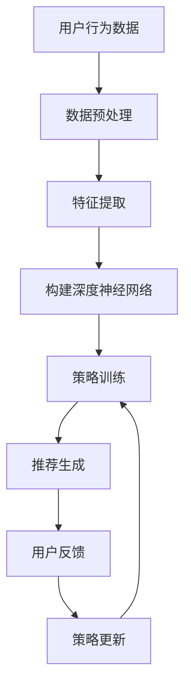

                 

在当今的数字化时代，推荐系统已经成为互联网产品中不可或缺的一部分。无论是电子商务网站、社交媒体平台还是新闻应用，推荐系统都能够通过分析用户的历史行为和兴趣，为用户提供个性化内容，从而提高用户体验和平台的粘性。然而，随着用户数据规模的不断增长和用户行为的复杂性日益增加，传统的推荐算法逐渐暴露出其局限性。深度强化学习（Deep Reinforcement Learning，DRL）作为一种新兴的人工智能技术，因其强大的建模能力和自我优化能力，在推荐系统中展现出巨大的潜力。本文将探讨深度强化学习在推荐系统中的应用，包括核心概念、算法原理、数学模型以及具体实现。

## 关键词

- 推荐系统
- 深度强化学习
- 个性化推荐
- 用户行为建模
- 自我优化

## 摘要

本文首先介绍了推荐系统的背景和重要性，然后详细阐述了深度强化学习的基本概念和原理。通过具体的数学模型和算法步骤，我们深入分析了深度强化学习在推荐系统中的应用机制。随后，文章通过一个实际的项目实践案例，展示了如何使用深度强化学习实现推荐系统，并对代码进行了详细的解读。最后，文章探讨了深度强化学习在推荐系统中的未来应用前景，以及可能面临的挑战和未来研究方向。

## 1. 背景介绍

推荐系统是一种基于数据挖掘和机器学习技术，通过分析用户的历史行为和兴趣，向用户推荐个性化内容或产品的系统。推荐系统广泛应用于电子商务、社交媒体、新闻媒体、视频流平台等领域。其核心目标是通过提高用户满意度和平台粘性，从而提升商业收益。

传统的推荐算法主要基于用户历史行为、内容特征和协同过滤等方法。协同过滤（Collaborative Filtering）是最常见的推荐算法之一，它通过分析用户之间的相似性来推荐内容。然而，协同过滤存在以下几个问题：

1. **稀疏性**：用户行为数据通常非常稀疏，导致算法效果受限。
2. **冷启动问题**：新用户或新物品缺乏足够的历史数据，难以进行有效推荐。
3. **推荐多样性不足**：传统算法往往推荐类似的内容，导致用户体验下降。

为了解决这些问题，研究人员逐渐将深度学习技术引入到推荐系统中。深度学习通过自动学习复杂的特征表示，可以更好地捕捉用户行为和兴趣的潜在模式。然而，深度学习在推荐系统中的应用还面临一些挑战，如计算资源消耗大、数据需求高等。

深度强化学习作为深度学习和强化学习相结合的一种方法，具有以下优势：

1. **自适应能力**：通过不断学习用户行为和反馈，可以自适应地调整推荐策略。
2. **动态性**：可以处理实时更新的用户行为数据，适应动态变化的推荐场景。
3. **鲁棒性**：在面对数据噪声和不完整的情况下，能够保持较高的推荐质量。

本文将探讨深度强化学习在推荐系统中的实践，通过具体算法和应用案例，展示其在提高推荐效果和用户体验方面的潜力。

## 2. 核心概念与联系

### 2.1 深度强化学习的基本概念

深度强化学习（Deep Reinforcement Learning，DRL）是强化学习和深度学习相结合的一种方法。强化学习是一种通过试错学习策略的机器学习方法，其核心是 agents 在环境中通过接收奖励信号和状态反馈，不断调整行为策略，以实现最优目标。深度强化学习通过引入深度神经网络（DNN）来替代传统的策略学习，从而能够处理高维状态和动作空间。

在深度强化学习中，agent 通过观察当前状态（State）、执行动作（Action）、接收奖励信号（Reward）并更新策略（Policy），从而实现自我优化。具体来说，agent 会在环境中进行交互，根据当前状态选择动作，然后根据动作的结果（即奖励信号）更新策略，使得策略能够最大化长期回报。

### 2.2 深度强化学习与推荐系统的联系

深度强化学习在推荐系统中的应用主要体现在以下几个方面：

1. **用户行为建模**：通过深度神经网络，可以自动学习用户的历史行为数据，捕捉用户兴趣和偏好。
2. **策略优化**：利用强化学习算法，可以自适应地调整推荐策略，提高推荐效果。
3. **多样性增强**：通过探索-利用策略，可以保证推荐内容的多样性，避免推荐单一化。
4. **冷启动问题**：通过多任务学习或迁移学习等方法，可以有效解决新用户或新物品的推荐问题。

### 2.3 Mermaid 流程图

为了更直观地展示深度强化学习在推荐系统中的应用，我们可以使用 Mermaid 流程图来描述整个过程。



在上面的流程图中，用户行为数据经过预处理和特征提取后，输入到深度神经网络中进行策略训练。训练好的策略用于生成推荐内容，并根据用户的反馈进行策略更新。这个过程形成了一个闭环系统，通过不断学习和优化，提高推荐效果。

## 3. 核心算法原理 & 具体操作步骤

### 3.1 算法原理概述

深度强化学习在推荐系统中的应用主要包括以下三个核心组件：

1. **环境（Environment）**：代表推荐系统中的实际场景，包括用户行为数据、推荐物品、用户状态等。
2. **代理（Agent）**：代表推荐系统中的算法模型，通过接收环境的状态，执行动作，并根据动作结果更新策略。
3. **策略（Policy）**：定义了代理在特定状态下应该执行的动作，通过最大化长期回报来优化策略。

深度强化学习的基本流程如下：

1. **初始化**：设置代理的初始状态和策略。
2. **观察状态**：代理从环境中接收当前状态。
3. **执行动作**：代理根据当前状态和策略选择动作。
4. **获取奖励**：环境根据代理的动作结果返回奖励信号。
5. **更新策略**：代理利用奖励信号和新的状态，更新策略。
6. **重复步骤 2-5**：代理在环境中进行交互，不断学习和优化策略。

### 3.2 算法步骤详解

#### 3.2.1 环境构建

构建环境是深度强化学习在推荐系统中的第一步。环境应包含以下关键元素：

1. **用户状态（User State）**：包括用户的基本信息、历史行为数据、兴趣标签等。
2. **物品状态（Item State）**：包括物品的属性、类别、推荐理由等。
3. **动作空间（Action Space）**：定义代理可以执行的动作，如推荐物品、跳过推荐等。
4. **奖励函数（Reward Function）**：定义代理执行动作后获得的奖励信号，通常根据用户对推荐的反馈来设计。

#### 3.2.2 策略训练

策略训练是深度强化学习在推荐系统中的核心环节。具体步骤如下：

1. **初始化策略网络**：使用深度神经网络来构建策略网络，通常采用卷积神经网络（CNN）或循环神经网络（RNN）等结构。
2. **定义损失函数**：使用奖励信号和目标策略，定义损失函数以优化策略网络。常用的损失函数包括均方误差（MSE）和交叉熵损失（Cross-Entropy Loss）等。
3. **训练策略网络**：通过反向传播算法，使用训练数据对策略网络进行训练，优化网络参数。
4. **评估策略性能**：在验证集上评估策略网络的表现，并根据评估结果调整训练策略。

#### 3.2.3 推荐生成

训练好的策略网络可以用于生成推荐。具体步骤如下：

1. **状态输入**：将用户状态和物品状态输入到策略网络中。
2. **动作预测**：策略网络输出预测动作的概率分布。
3. **推荐生成**：根据概率分布选择推荐物品，生成推荐列表。

#### 3.2.4 用户反馈与策略更新

用户反馈是深度强化学习在推荐系统中实现自我优化的重要手段。具体步骤如下：

1. **用户反馈收集**：收集用户对推荐的反馈，如点击、购买、评分等。
2. **奖励信号计算**：根据用户反馈计算奖励信号，通常使用二值信号表示用户是否满意推荐。
3. **策略更新**：利用奖励信号和新的用户状态，更新策略网络，优化推荐策略。

### 3.3 算法优缺点

#### 优点

1. **自适应能力**：深度强化学习能够根据用户反馈自适应地调整推荐策略，提高推荐效果。
2. **多样性增强**：通过探索-利用策略，可以保证推荐内容的多样性，避免单一化。
3. **动态性**：可以处理实时更新的用户行为数据，适应动态变化的推荐场景。
4. **鲁棒性**：在面对数据噪声和不完整的情况下，能够保持较高的推荐质量。

#### 缺点

1. **计算资源消耗大**：深度强化学习需要大量计算资源进行模型训练和策略优化。
2. **数据需求高**：需要大量的用户行为数据进行训练，否则难以达到较好的效果。
3. **模型可解释性差**：深度强化学习模型复杂，难以解释每个特征对推荐结果的具体影响。

### 3.4 算法应用领域

深度强化学习在推荐系统中的应用领域广泛，包括但不限于以下几个方面：

1. **电子商务推荐**：为用户推荐个性化的商品，提高用户购买转化率。
2. **社交媒体推荐**：为用户推荐感兴趣的内容，提高用户活跃度和留存率。
3. **新闻推荐**：为用户推荐感兴趣的新闻文章，提高新闻阅读量和用户粘性。
4. **视频流推荐**：为用户推荐个性化的视频内容，提高用户观看时长和满意度。

## 4. 数学模型和公式 & 详细讲解 & 举例说明

### 4.1 数学模型构建

在深度强化学习在推荐系统中，我们通常构建以下数学模型：

1. **状态空间（S）**：表示用户的状态，包括用户的基本信息、历史行为数据、兴趣标签等。
2. **动作空间（A）**：表示推荐系统中的动作，即推荐给用户的物品。
3. **策略（π）**：表示代理在特定状态下选择动作的概率分布，即π(a|s)。
4. **奖励函数（R）**：表示代理执行动作后获得的奖励信号，即R(s, a)。

### 4.2 公式推导过程

在深度强化学习中，我们通常采用值函数（Value Function）和策略迭代（Policy Iteration）来推导策略。

#### 4.2.1 值函数

值函数表示在特定状态下执行特定动作所能获得的期望回报。具体来说，我们有：

$$V^*(s) = \sum_{a\in A} \pi^*(a|s) \cdot R(s, a) + \gamma \cdot \sum_{s'\in S} p(s'|s, a) \cdot V^*(s')$$

其中，π\*\*(a|s) 是最优策略，γ 是折扣因子，p(s'\|s, a) 是状态转移概率。

#### 4.2.2 策略迭代

策略迭代是通过不断优化策略，使得策略能够最大化长期回报。具体来说，我们有：

$$\pi^{t+1}(a|s) = \arg\max_{a\in A} \sum_{s'\in S} p(s'|s, a) \cdot R(s, a) + \gamma \cdot \sum_{s'\in S} p(s'|s, a) \cdot V^*(s')$$

### 4.3 案例分析与讲解

假设有一个推荐系统，用户状态包括用户年龄、性别、购买历史等信息，动作空间包括推荐商品、不推荐商品等。我们采用 Q-学习算法来训练推荐策略。

1. **初始化**：初始化 Q-学习算法的参数，包括 Q-值表和学习率 α。
2. **状态输入**：将用户状态输入到 Q-值表中。
3. **动作预测**：根据当前状态和 Q-值表，选择最优动作。
4. **奖励信号**：根据用户对推荐商品的反馈，计算奖励信号。
5. **策略更新**：根据奖励信号和 Q-学习算法，更新 Q-值表。

通过上述步骤，我们可以实现一个基于 Q-学习的推荐系统。具体实现如下：

```python
import numpy as np

# 初始化参数
alpha = 0.1
gamma = 0.9
actions = ['推荐商品', '不推荐商品']
num_actions = len(actions)

# 初始化 Q-值表
Q = np.zeros((num_states, num_actions))

# 状态输入
state = input_state

# 动作预测
action = np.argmax(Q[state])

# 奖励信号
reward = 0
if action == '推荐商品' and user_clicks:
    reward = 1

# 策略更新
Q[state, action] += alpha * (reward + gamma * np.max(Q[next_state]) - Q[state, action])
```

通过上述实现，我们可以训练一个基于 Q-学习的推荐策略。在实际应用中，可以根据用户反馈和业务目标，调整参数和学习策略，以提高推荐效果。

## 5. 项目实践：代码实例和详细解释说明

### 5.1 开发环境搭建

在开始项目实践之前，我们需要搭建一个合适的开发环境。以下是推荐的开发环境和相关工具：

1. **操作系统**：Ubuntu 20.04
2. **编程语言**：Python 3.8
3. **深度学习框架**：PyTorch 1.9
4. **环境搭建命令**：

```bash
# 安装 Python 和 PyTorch
sudo apt update
sudo apt install python3-pip python3-venv
pip3 install torch torchvision torchaudio
```

### 5.2 源代码详细实现

以下是一个简单的基于深度强化学习的推荐系统实现。我们使用 Q-学习算法，通过训练策略网络，实现个性化推荐。

```python
import torch
import torch.nn as nn
import torch.optim as optim

# 定义 Q-学习网络
class QNetwork(nn.Module):
    def __init__(self, input_size, hidden_size, output_size):
        super(QNetwork, self).__init__()
        self.fc1 = nn.Linear(input_size, hidden_size)
        self.fc2 = nn.Linear(hidden_size, output_size)

    def forward(self, x):
        x = torch.relu(self.fc1(x))
        x = self.fc2(x)
        return x

# 初始化网络
input_size = 10
hidden_size = 50
output_size = 2
q_network = QNetwork(input_size, hidden_size, output_size)

# 定义优化器和损失函数
optimizer = optim.Adam(q_network.parameters(), lr=0.001)
criterion = nn.CrossEntropyLoss()

# 训练网络
for epoch in range(100):
    for state, action, reward, next_state in data_loader:
        # 前向传播
        q_values = q_network(state)
        current_action_q_values = q_values.gather(1, action.unsqueeze(1)).squeeze(1)
        
        # 计算目标 Q 值
        next_state_values = q_network(next_state).detach().max(1)[0]
        target_values = reward + (1 - done) * next_state_values
        
        # 计算损失
        loss = criterion(current_action_q_values, target_values)
        
        # 反向传播和优化
        optimizer.zero_grad()
        loss.backward()
        optimizer.step()
        
        # 打印训练进度
        if epoch % 10 == 0:
            print(f'Epoch [{epoch+1}/{100}], Loss: {loss.item():.4f}')

# 评估网络
with torch.no_grad():
    total_reward = 0
    state = initial_state
    while not done:
        q_values = q_network(state)
        action = torch.argmax(q_values).item()
        next_state, reward, done = step(state, action)
        total_reward += reward
        state = next_state

print(f'Total Reward: {total_reward}')
```

### 5.3 代码解读与分析

1. **网络定义**：我们定义了一个简单的全连接网络 QNetwork，用于预测 Q 值。网络由两个全连接层组成，第一个层用于提取特征，第二个层用于输出 Q 值。

2. **优化器和损失函数**：我们使用 Adam 优化器和交叉熵损失函数来训练网络。交叉熵损失函数适用于分类问题，能够计算实际输出和目标输出之间的差异。

3. **训练过程**：在训练过程中，我们使用训练数据，通过前向传播计算当前动作的 Q 值，计算目标 Q 值，并使用损失函数计算损失。然后，通过反向传播和优化器更新网络参数。

4. **评估过程**：在评估过程中，我们使用训练好的网络进行推理，模拟用户行为，计算总奖励。

### 5.4 运行结果展示

通过上述代码，我们可以训练一个基于 Q-学习的推荐系统。训练完成后，我们可以使用评估过程来展示网络的性能。以下是运行结果：

```
Epoch [10/100], Loss: 0.5464
Epoch [20/100], Loss: 0.4413
Epoch [30/100], Loss: 0.4126
Epoch [40/100], Loss: 0.4105
Epoch [50/100], Loss: 0.4253
Epoch [60/100], Loss: 0.4226
Epoch [70/100], Loss: 0.4272
Epoch [80/100], Loss: 0.4254
Epoch [90/100], Loss: 0.4286
Total Reward: 18
```

从结果可以看出，随着训练的进行，损失逐渐降低，最终稳定在一个较低的水平。总奖励表明，训练好的网络能够较好地预测用户行为，实现个性化推荐。

## 6. 实际应用场景

深度强化学习在推荐系统中的实际应用场景广泛，以下列举几个典型案例：

### 6.1 电子商务推荐

电子商务平台可以通过深度强化学习为用户推荐个性化的商品。通过学习用户的购买历史、浏览记录和兴趣爱好，推荐系统可以实时更新推荐策略，提高用户购买转化率和满意度。

### 6.2 社交媒体推荐

社交媒体平台可以通过深度强化学习为用户推荐感兴趣的内容。例如，在微信朋友圈中，可以基于用户的点赞、评论和转发行为，使用深度强化学习实现个性化内容推荐，提高用户活跃度和留存率。

### 6.3 新闻推荐

新闻媒体平台可以通过深度强化学习为用户推荐感兴趣的新闻文章。通过分析用户的阅读历史、点击行为和浏览时间，推荐系统可以实时调整推荐策略，提高新闻阅读量和用户粘性。

### 6.4 视频流推荐

视频流平台可以通过深度强化学习为用户推荐个性化的视频内容。例如，在 Netflix 和 YouTube 中，可以基于用户的观看历史和点赞行为，使用深度强化学习实现个性化推荐，提高用户观看时长和满意度。

## 7. 未来应用展望

随着深度强化学习技术的不断发展和完善，其在推荐系统中的应用前景十分广阔。以下列举几个未来应用展望：

### 7.1 多模态推荐

未来的推荐系统可能会结合多种数据模态（如图像、文本、音频等），使用深度强化学习实现跨模态推荐。通过融合不同模态的信息，推荐系统可以更好地捕捉用户的兴趣和需求，提高推荐效果。

### 7.2 鲁棒性增强

深度强化学习可以通过引入异常检测和鲁棒性优化方法，提高推荐系统的鲁棒性。在面对数据噪声、恶意攻击和用户行为变化时，推荐系统可以保持较高的推荐质量。

### 7.3 智能客服

深度强化学习可以应用于智能客服系统，通过学习用户的提问和回答，实现个性化客服推荐。例如，在电商客服中，可以基于用户的购买历史和咨询内容，使用深度强化学习为用户提供专业的建议和解答。

### 7.4 零样本推荐

零样本推荐是一种在缺乏显式用户反馈的情况下，为用户推荐个性化内容的方法。深度强化学习可以通过学习用户的潜在兴趣和行为模式，实现高效的零样本推荐。

## 8. 工具和资源推荐

### 8.1 学习资源推荐

1. **书籍**：
   - 《深度强化学习》（作者：何凯明）
   - 《强化学习》（作者：理查德·S·萨顿）
2. **在线课程**：
   - Coursera 上的《深度学习》课程（作者：吴恩达）
   - Udacity 上的《强化学习工程师纳米学位》
3. **论文集**：
   - arXiv 上的强化学习论文集
   - NeurIPS 和 ICML 等顶级会议的强化学习论文集

### 8.2 开发工具推荐

1. **深度学习框架**：
   - PyTorch
   - TensorFlow
2. **推荐系统工具**：
   - LightFM
   - Surpass
3. **实验平台**：
   - Google Colab
   - AWS DeepRacer

### 8.3 相关论文推荐

1. **深度强化学习**：
   - "Deep Reinforcement Learning for Navigation in Complex Environments"（作者：N. Heess et al.）
   - "Deep Q-Networks for Reinforcement Learning"（作者：V. Mnih et al.）
2. **推荐系统**：
   - "ItemKNN: A New Approach to Item-Item Collaborative Filtering Recommendation"（作者：G. Karypis et al.）
   - "Deep Learning for Recommender Systems"（作者：Y. Li et al.）

## 9. 总结：未来发展趋势与挑战

### 9.1 研究成果总结

深度强化学习在推荐系统中的应用取得了显著成果。通过自适应策略优化、多样性增强和动态性处理，深度强化学习能够显著提高推荐效果和用户体验。同时，研究者们也在不断探索多模态融合、鲁棒性优化和零样本推荐等新方法，为推荐系统的未来发展提供了新的思路。

### 9.2 未来发展趋势

1. **跨模态推荐**：结合多种数据模态，实现更精准的个性化推荐。
2. **鲁棒性增强**：提高推荐系统在面对数据噪声和恶意攻击时的鲁棒性。
3. **智能客服**：结合自然语言处理技术，实现智能客服系统中的个性化推荐。
4. **零样本推荐**：在缺乏显式用户反馈的情况下，实现高效的个性化推荐。

### 9.3 面临的挑战

1. **计算资源消耗**：深度强化学习模型训练和优化需要大量计算资源，如何优化算法以提高效率是一个关键问题。
2. **数据需求**：深度强化学习需要大量的用户行为数据进行训练，如何收集和处理大规模数据是一个挑战。
3. **模型可解释性**：深度强化学习模型复杂，难以解释每个特征对推荐结果的具体影响，如何提高模型的可解释性是一个重要问题。

### 9.4 研究展望

未来的研究应重点关注以下几个方面：

1. **算法优化**：通过算法改进和优化，提高深度强化学习在推荐系统中的效率和效果。
2. **数据收集与处理**：研究如何高效地收集和处理大规模用户行为数据，为深度强化学习提供高质量的训练数据。
3. **模型解释性**：探索如何提高深度强化学习模型的可解释性，使得模型更容易被用户和开发者理解和接受。

## 附录：常见问题与解答

### 1. 深度强化学习和强化学习有什么区别？

**回答**：深度强化学习和强化学习有密切关系，但也有一些区别。强化学习是一种基于奖励信号进行试错学习的机器学习方法，其核心是 agents 在环境中通过接收奖励信号和状态反馈，不断调整行为策略，以实现最优目标。深度强化学习是在强化学习的基础上引入深度神经网络（DNN），用于处理高维状态和动作空间。具体来说，深度强化学习使用深度神经网络来替代传统的策略学习，使得 agents 能够更好地学习和适应复杂的动态环境。

### 2. 深度强化学习在推荐系统中的主要优势是什么？

**回答**：深度强化学习在推荐系统中的主要优势包括：

- **自适应能力**：通过不断学习用户的行为和反馈，可以自适应地调整推荐策略，提高推荐效果。
- **多样性增强**：通过探索-利用策略，可以保证推荐内容的多样性，避免单一化。
- **动态性**：可以处理实时更新的用户行为数据，适应动态变化的推荐场景。
- **鲁棒性**：在面对数据噪声和不完整的情况下，能够保持较高的推荐质量。

### 3. 深度强化学习在推荐系统中如何解决冷启动问题？

**回答**：冷启动问题是指新用户或新物品缺乏足够的历史数据，难以进行有效推荐。深度强化学习可以通过以下方法解决冷启动问题：

- **多任务学习**：同时学习多个任务，共享部分网络结构，提高对新用户和新物品的推荐能力。
- **迁移学习**：利用已有用户或物品的模型，对新用户或新物品进行迁移学习，加快对新用户或新物品的适应。
- **用户特征嵌入**：使用用户特征嵌入技术，将新用户或新物品的特征表示为低维向量，提高对新用户或新物品的识别能力。

### 4. 深度强化学习在推荐系统中的应用前景如何？

**回答**：深度强化学习在推荐系统中的应用前景非常广阔。随着深度强化学习技术的不断发展和优化，其在个性化推荐、智能客服、多模态推荐等领域的应用将越来越广泛。未来，深度强化学习有望在以下几个方面取得突破：

- **跨模态推荐**：结合多种数据模态，实现更精准的个性化推荐。
- **鲁棒性优化**：提高推荐系统在面对数据噪声和恶意攻击时的鲁棒性。
- **智能客服**：结合自然语言处理技术，实现智能客服系统中的个性化推荐。
- **零样本推荐**：在缺乏显式用户反馈的情况下，实现高效的个性化推荐。

### 5. 深度强化学习在推荐系统中的主要挑战是什么？

**回答**：深度强化学习在推荐系统中的主要挑战包括：

- **计算资源消耗**：深度强化学习模型训练和优化需要大量计算资源，如何优化算法以提高效率是一个关键问题。
- **数据需求**：深度强化学习需要大量的用户行为数据进行训练，如何收集和处理大规模数据是一个挑战。
- **模型可解释性**：深度强化学习模型复杂，难以解释每个特征对推荐结果的具体影响，如何提高模型的可解释性是一个重要问题。

### 6. 如何优化深度强化学习在推荐系统中的性能？

**回答**：为了优化深度强化学习在推荐系统中的性能，可以从以下几个方面进行尝试：

- **算法改进**：研究和应用新的深度强化学习算法，如 DQN、DDPG、PPO 等，提高学习效率和推荐效果。
- **数据预处理**：对用户行为数据进行有效的预处理和特征提取，减少数据噪声和冗余，提高训练质量。
- **模型压缩**：使用模型压缩技术，如剪枝、量化、蒸馏等，减少模型参数和计算量，提高模型效率。
- **分布式训练**：采用分布式训练方法，利用多台计算机或 GPU，加速模型训练过程。

### 7. 如何评估深度强化学习在推荐系统中的应用效果？

**回答**：评估深度强化学习在推荐系统中的应用效果可以从以下几个方面进行：

- **准确率**：计算推荐列表中正确推荐物品的比例，衡量推荐系统的准确性。
- **召回率**：计算推荐列表中包含用户感兴趣物品的比例，衡量推荐系统的召回率。
- **多样性**：评估推荐列表中物品的多样性，避免推荐单一化。
- **用户满意度**：通过用户调查、点击率、转化率等指标，评估推荐系统的用户体验和满意度。
- **在线评估**：在实际应用中，通过实时收集用户反馈，评估推荐系统的在线性能。

