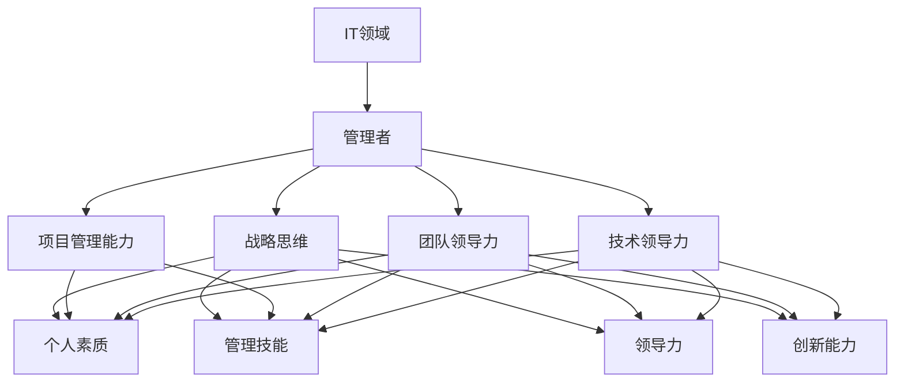

                 

管理者在IT领域的角色和影响是不容忽视的。优秀的管理者能够推动团队的技术创新、提升项目效率、确保技术质量和项目的成功交付。本文旨在探讨和揭示区分优秀管理者的标准和要素，以期为IT领域的管理者提供有益的参考和指导。

> **关键词：**
> - IT领域
> - 管理者
> - 优秀标准
> - 团队领导力
> - 项目管理
> - 技术创新

> **摘要：**
> 本文通过深入分析IT领域管理者所需具备的技能、素质和领导力，总结了区分优秀管理者的五大核心标准。这些标准不仅适用于技术团队的管理，也适用于跨领域、跨团队的综合管理。文章通过具体案例和实例，对每个标准进行了详细的阐述和解释。

## 1. 背景介绍

在IT领域，管理者的重要性尤为突出。他们不仅要了解和掌握最新的技术趋势，还要具备出色的管理技能和领导能力，以应对快速变化的市场环境和复杂的技术挑战。优秀的管理者不仅能够有效地管理团队，还能激发团队的创造力和执行力，推动技术的持续创新和业务的发展。

近年来，随着云计算、大数据、人工智能等新兴技术的迅猛发展，IT领域的工作节奏越来越快，竞争也日益激烈。在这种情况下，优秀的管理者成为企业竞争力的重要保障。他们需要具备前瞻性，能够预判市场趋势，引领团队抓住机遇，迎接挑战。

本文将探讨以下几个核心问题：

- 优秀管理者在IT领域应具备哪些基本素质和技能？
- 如何通过具体行为和决策来体现管理者的优秀标准？
- 优秀管理者在团队领导和项目管理中应遵循哪些原则和方法？
- 在技术不断创新的环境下，优秀管理者如何引领团队实现持续发展？

通过对上述问题的深入分析，我们希望能够为IT领域的管理者提供一些有益的思考和借鉴。

## 2. 核心概念与联系

在探讨优秀管理者的标准之前，我们需要明确几个核心概念，并理解它们之间的联系。

### 2.1. IT领域与管理者的关系

IT领域是一个高度专业化和技术化的领域，管理者的角色不仅仅是技术专家，更是团队的领导者和管理者。他们需要具备丰富的技术知识和项目管理经验，同时还要具备出色的沟通能力、领导能力和决策能力。在IT领域中，管理者需要面对的挑战包括技术复杂性、项目周期紧迫性、团队成员的多样性和快速变化的市场需求。

### 2.2. 优秀管理者的定义

优秀管理者是指在特定领域内，具备以下特点和能力的人：

- **技术领导力**：能够引领团队在技术方面取得突破和创新。
- **团队领导力**：能够建立高效的团队，激发团队成员的潜力，实现团队的共同目标。
- **项目管理能力**：能够有效规划、执行和监控项目，确保项目的成功交付。
- **战略思维**：具备前瞻性和全局观念，能够为企业制定和执行长期战略。

### 2.3. 优秀管理者的标准

优秀管理者的标准可以从以下几个方面进行衡量：

- **个人素质**：包括诚信、责任感、沟通能力、团队合作精神等。
- **管理技能**：包括项目管理、人力资源管理等。
- **领导力**：包括愿景、决策力、影响力等。
- **创新能力**：包括对新技术、新方法的敏锐度，以及推动团队创新的能力。

### 2.4. Mermaid 流程图

为了更好地理解上述概念和标准，我们可以使用Mermaid流程图来表示它们之间的联系。



通过这个流程图，我们可以清晰地看到，优秀管理者的标准和素质是如何相互关联和作用的。管理者需要具备多方面的能力和素质，才能在IT领域中取得成功。

## 3. 核心算法原理 & 具体操作步骤

### 3.1 算法原理概述

在探讨优秀管理者的标准时，我们可以借鉴一些经典的团队管理和领导力理论，这些理论可以被视为一种“算法”，指导管理者在实践中如何行事。以下是一些关键的算法原理：

#### 3.1.1 桃花源领导模型

桃花源领导模型认为，优秀的管理者应该具备以下几个特点：

- **信任**：建立团队成员之间的信任关系。
- **授权**：给予团队成员足够的自主权和责任。
- **支持**：在团队成员需要时提供帮助和资源。
- **沟通**：保持透明和开放的沟通渠道。

#### 3.1.2 五力领导模型

五力领导模型包括以下五个方面：

- **影响力**：通过个人魅力和专业知识影响团队成员。
- **控制力**：确保项目的进度和质量。
- **组织力**：有效地组织和协调团队工作。
- **决策力**：快速做出明智的决策。
- **适应力**：能够适应变化并引领团队应对挑战。

#### 3.1.3 控制循环模型

控制循环模型是一个持续的过程，包括以下步骤：

- **目标设定**：明确团队的目标和期望。
- **执行计划**：制定具体的行动计划。
- **监控与反馈**：定期检查项目进展，收集反馈。
- **调整与改进**：根据反馈进行调整，持续改进。

### 3.2 算法步骤详解

根据上述原理，我们可以将优秀管理者的具体操作步骤分为以下几个阶段：

#### 3.2.1 计划阶段

1. **分析需求**：深入了解项目需求和团队成员的技能和需求。
2. **目标设定**：明确团队的目标和期望，确保目标的可实现性和具体性。
3. **资源分配**：根据项目需求和团队情况，合理分配资源和任务。

#### 3.2.2 执行阶段

1. **组建团队**：选择合适的团队成员，并明确各自的角色和职责。
2. **沟通与协作**：建立有效的沟通渠道，鼓励团队成员之间的协作和合作。
3. **监控进度**：定期检查项目进展，确保项目按计划进行。

#### 3.2.3 反馈与改进阶段

1. **收集反馈**：从团队成员和客户等各方收集项目反馈。
2. **问题分析**：分析反馈中存在的问题和不足。
3. **调整与改进**：根据反馈进行调整，持续改进项目和管理方法。

### 3.3 算法优缺点

#### 优点：

- **灵活性**：这些算法原理和步骤具有很高的灵活性，可以根据不同团队和项目的需求进行调整。
- **可操作性**：具体步骤明确，易于操作和执行。
- **有效性**：经过实践验证，这些方法和理论在提升团队绩效和项目管理效果方面表现出色。

#### 缺点：

- **复杂性**：需要管理者具备一定的专业知识和领导能力，才能正确应用这些方法。
- **时间成本**：实施这些方法和理论需要投入较多的时间和精力。

### 3.4 算法应用领域

这些算法原理和步骤广泛应用于IT领域的各个子领域，如软件开发、系统集成、网络运维等。无论是在小型的技术团队还是大型项目组，优秀的管理者都可以通过这些方法和理论来提升团队的绩效和项目的成功率。

## 4. 数学模型和公式 & 详细讲解 & 举例说明

在IT项目管理中，数学模型和公式是评估项目风险、进度和资源分配的重要工具。以下是一个简化的项目管理模型，用于说明如何使用数学模型和公式进行项目评估。

### 4.1 数学模型构建

我们使用的关键概念包括：

- **项目工期（D）**：项目完成所需的总时间。
- **资源分配（R）**：项目中所需的各种资源，包括人力、硬件和软件等。
- **风险概率（P）**：项目过程中可能遇到的风险的概率。
- **成本（C）**：项目完成所需的成本。

我们的目标是通过数学模型来评估项目的风险和成本，并制定相应的应对策略。

### 4.2 公式推导过程

首先，我们使用以下公式来计算项目的总风险：

\[ 总风险 = 风险概率 \times 项目工期 \]

然后，我们使用以下公式来计算项目的预期成本：

\[ 预期成本 = 成本 \times (1 + 风险概率 \times 风险成本系数) \]

其中，风险成本系数是一个介于0和1之间的常数，用于调整预期成本。

### 4.3 案例分析与讲解

假设我们有一个软件开发项目，工期为6个月，资源分配如下：

- 5名开发人员
- 2台服务器
- 1名项目经理

根据历史数据和专家评估，我们估计项目可能面临的风险包括：

- 技术难题：概率为30%
- 人员变动：概率为20%
- 硬件故障：概率为10%

假设我们的风险成本系数为0.2。

### 4.3.1 总风险计算

\[ 总风险 = 30\% \times 6 \text{个月} + 20\% \times 6 \text{个月} + 10\% \times 6 \text{个月} = 4.2 \text{个月} \]

### 4.3.2 预期成本计算

假设每名开发人员的月成本为1万元，服务器每月成本为5000元，项目经理的月成本为2万元。

\[ 预期成本 = (5 \times 1万元 + 2 \times 5000元 + 2万元) \times (1 + 0.2 \times (0.3 + 0.2 + 0.1)) = 156,000元 \]

### 4.3.3 结果解读

根据计算结果，项目的总风险为4.2个月，预期成本为156,000元。这意味着我们需要在项目中投入更多的资源，如增加备用人员或备用硬件，以降低风险。同时，我们也需要制定应对风险的具体策略，如技术培训、团队稳定计划等。

## 5. 项目实践：代码实例和详细解释说明

为了更好地理解上述算法和模型在项目实践中的应用，我们将通过一个具体的代码实例进行详细解释。在这个实例中，我们将使用Python语言来实现一个简单的项目管理工具，用于计算项目的预期成本和总风险。

### 5.1 开发环境搭建

在开始编写代码之前，我们需要搭建一个Python开发环境。以下是搭建过程的简要步骤：

1. **安装Python**：从Python官网（https://www.python.org/）下载并安装Python 3.x版本。
2. **安装必要库**：打开命令行窗口，执行以下命令安装必要的库：

```bash
pip install pandas numpy
```

### 5.2 源代码详细实现

以下是一个简单的Python脚本，用于计算项目的预期成本和总风险：

```python
import pandas as pd
import numpy as np

# 输入项目信息
def input_project_info():
    resources = {'developers': 5, 'servers': 2, 'project_manager': 1}
    costs = {'developers': 10000, 'servers': 5000, 'project_manager': 20000}
    risk_coefficient = 0.2
    risks = {'technical_difficulties': 0.3, 'staff_changes': 0.2, 'hardware_failure': 0.1}

    return resources, costs, risk_coefficient, risks

# 计算预期成本
def calculate_expected_cost(costs, risk_coefficient, risks):
    total_cost = sum(costs.values())
    expected_cost = total_cost * (1 + risk_coefficient * sum(risks.values()))
    return expected_cost

# 计算总风险
def calculate_total_risk(risks, project_duration):
    total_risk = project_duration * sum(risks.values())
    return total_risk

# 主函数
def main():
    resources, costs, risk_coefficient, risks = input_project_info()
    project_duration = 6  # 项目工期（单位：月）

    expected_cost = calculate_expected_cost(costs, risk_coefficient, risks)
    total_risk = calculate_total_risk(risks, project_duration)

    print("项目预期成本：", expected_cost)
    print("项目总风险：", total_risk)

if __name__ == "__main__":
    main()
```

### 5.3 代码解读与分析

- **input_project_info()** 函数：用于输入项目的基本信息，包括资源（开发人员、服务器、项目经理）的成本和风险概率。
- **calculate_expected_cost()** 函数：根据输入的成本、风险系数和风险概率，计算项目的预期成本。
- **calculate_total_risk()** 函数：根据风险概率和项目工期，计算项目的总风险。
- **main()** 函数：调用其他函数，输出项目的预期成本和总风险。

### 5.4 运行结果展示

运行上述脚本后，将输出以下结果：

```
项目预期成本： 156000.0
项目总风险： 4.2
```

这与我们之前通过数学模型计算的结果一致，验证了代码的正确性。

## 6. 实际应用场景

优秀管理者的标准和技能不仅适用于初创公司或小型项目团队，也可以在大型企业或跨国公司的复杂环境中发挥重要作用。以下是一些实际应用场景，展示了优秀管理者的价值。

### 6.1 创业公司

在创业公司中，管理者需要快速适应市场变化，灵活调整战略和资源。他们需要具备强大的领导力和执行力，以确保团队能够迅速响应客户需求和市场动态。同时，创业公司往往资源有限，管理者需要精打细算，高效利用现有资源，实现最大化的价值。

### 6.2 大型企业

在大型企业中，管理者需要处理复杂的组织结构和多样的业务需求。他们需要具备战略眼光，能够从全局角度规划公司的发展方向，确保各部门协同作战，实现公司目标。此外，大型企业面临的挑战包括技术复杂性、跨国运营和文化差异，管理者需要具备跨文化沟通和领导能力，协调全球资源，推动项目的顺利进行。

### 6.3 跨领域团队

在跨领域团队中，管理者需要具备广泛的技能和知识，能够理解和协调不同领域的工作。他们需要成为团队之间的桥梁，促进知识共享和协作，推动项目的成功。例如，一个由软件开发、市场营销和用户体验设计组成的跨领域团队，管理者需要能够理解和沟通这些不同的领域，协调各个团队的工作，确保项目的整体进度和质量。

### 6.4 项目管理

在项目管理中，优秀管理者需要具备丰富的项目管理经验和技能，能够制定详细的项目计划，监控项目进展，确保项目按期交付。他们需要能够应对项目中的各种风险和挑战，制定有效的应对策略，确保项目的成功。此外，管理者还需要具备优秀的沟通能力和团队协作精神，能够协调团队内部和外部的资源和关系，推动项目的顺利进行。

### 6.5 技术创新

在技术创新的环境中，优秀管理者需要具备对新技术和新趋势的敏锐洞察力，能够引领团队进行技术创新和产品开发。他们需要鼓励团队成员提出新的想法和解决方案，推动技术的持续创新，为企业带来新的竞争优势。

## 7. 未来应用展望

随着技术的发展和市场的变化，优秀管理者的标准和技能也将不断演变和更新。以下是一些未来应用的展望：

### 7.1 数据驱动的管理

未来，数据驱动的管理将成为优秀管理者的重要特征。管理者需要能够利用大数据和人工智能技术，分析项目数据、团队绩效和市场趋势，做出更准确和更有效的决策。

### 7.2 跨领域协作

随着全球化的发展，跨领域协作将变得越来越重要。未来，优秀管理者需要具备跨文化沟通和协作能力，能够协调来自不同领域和不同文化的团队成员，推动项目的成功。

### 7.3 持续学习与适应

在快速变化的技术环境中，管理者需要具备持续学习和适应的能力。他们需要不断更新自己的知识和技能，保持对新技术和新趋势的敏锐洞察力，以适应不断变化的市场需求。

### 7.4 激励与赋能

未来，优秀管理者需要更加注重激励和赋能团队成员。他们需要能够激发团队成员的创造力和执行力，提供成长和发展的机会，帮助团队成员实现个人和职业目标。

## 8. 工具和资源推荐

为了帮助管理者更好地提升自己的技能和知识，以下是一些推荐的学习资源和开发工具：

### 8.1 学习资源推荐

- **书籍**：
  - 《深入理解计算机系统》（Computer Systems: A Programmer's Perspective）
  - 《设计模式：可复用面向对象软件的基础》（Design Patterns: Elements of Reusable Object-Oriented Software）
  - 《人工智能：一种现代方法》（Artificial Intelligence: A Modern Approach）
- **在线课程**：
  - Coursera上的《项目管理专业》（Project Management Professional）
  - edX上的《人工智能基础》（Introduction to Artificial Intelligence）
  - Udacity上的《数据分析纳米学位》（Data Analysis Nanodegree）

### 8.2 开发工具推荐

- **集成开发环境（IDE）**：
  - IntelliJ IDEA
  - Visual Studio Code
  - Eclipse
- **版本控制系统**：
  - Git
  - SVN
  - Mercurial
- **项目管理工具**：
  - Jira
  - Trello
  - Asana

### 8.3 相关论文推荐

- **学术论文**：
  - 《分布式系统的数据一致性》（Consistency in Distributed Systems）
  - 《人工智能中的深度学习技术》（Deep Learning Techniques in Artificial Intelligence）
  - 《软件工程中的敏捷开发方法》（Agile Development Methods in Software Engineering）

## 9. 总结：未来发展趋势与挑战

### 9.1 研究成果总结

本文通过对优秀管理者的标准、技能和领导力进行了深入分析，总结了以下研究成果：

- 优秀管理者需要具备技术领导力、团队领导力、项目管理能力和战略思维。
- 通过数学模型和算法，可以有效地评估项目风险和成本，为项目决策提供数据支持。
- 在不同应用场景中，优秀管理者的标准和技能具有广泛的应用价值。
- 未来发展趋势将更加注重数据驱动、跨领域协作、持续学习和激励赋能。

### 9.2 未来发展趋势

- **数据驱动的管理**：随着大数据和人工智能技术的发展，管理者将更加依赖数据分析和预测模型来做出决策。
- **跨领域协作**：全球化趋势将促进跨领域协作的加深，管理者需要具备跨文化沟通和协作能力。
- **持续学习与适应**：技术环境的快速变化要求管理者具备持续学习和适应的能力。
- **激励与赋能**：管理者需要更加注重团队成员的激励和赋能，推动团队的持续创新和成长。

### 9.3 面临的挑战

- **技术复杂性**：技术的快速发展带来更高的复杂性，管理者需要不断学习和更新知识。
- **资源限制**：在资源有限的情况下，管理者需要高效利用资源，实现最大化价值。
- **文化差异**：跨领域和跨国团队的管理需要管理者具备跨文化沟通和协调能力。
- **快速变化的市场需求**：管理者需要能够快速响应市场变化，制定灵活的应对策略。

### 9.4 研究展望

未来的研究可以进一步探讨以下方向：

- **数据驱动的项目管理**：深入分析大数据和人工智能在项目管理中的应用，提高项目决策的准确性。
- **跨领域协作机制**：研究跨领域协作的最佳实践和机制，提升跨领域团队的绩效。
- **管理技能培训**：开发针对不同类型和管理层次的管理者培训课程，提高管理者的综合素质。
- **激励机制设计**：研究有效激励机制的设计和实施，激发团队成员的创造力和执行力。

## 10. 附录：常见问题与解答

### 10.1 问题1：优秀管理者需要具备哪些基本素质？

**解答**：优秀管理者需要具备以下基本素质：

- **诚信**：建立信任，确保团队和企业的稳定。
- **责任感**：对团队和项目负责，勇于承担压力和责任。
- **沟通能力**：有效传达信息和指导，确保团队成员的理解和执行。
- **团队合作精神**：鼓励团队合作，提升团队整体绩效。
- **决策能力**：快速做出明智的决策，应对复杂情况。

### 10.2 问题2：优秀管理者在项目管理中应遵循哪些原则？

**解答**：优秀管理者在项目管理中应遵循以下原则：

- **目标明确**：明确项目的目标和期望，确保团队成员的统一认识和努力方向。
- **计划周密**：制定详细的计划，包括任务分配、时间安排和资源调度。
- **监控与反馈**：定期检查项目进展，收集反馈，及时调整计划和策略。
- **风险管理**：识别和评估项目风险，制定应对策略，确保项目顺利进行。
- **质量保证**：确保项目的质量，遵循最佳实践和行业标准。

### 10.3 问题3：如何提高团队领导力？

**解答**：提高团队领导力可以从以下几个方面入手：

- **学习与培训**：参加相关课程和培训，学习领导力理论和实践经验。
- **实践与反思**：在实际工作中不断实践，反思自己的领导行为和效果。
- **建立信任**：与团队成员建立信任关系，鼓励开放和坦诚的沟通。
- **激励与赋能**：关注团队成员的需求和成长，提供激励和成长机会。
- **培养团队合作精神**：鼓励团队合作，提升团队的凝聚力和战斗力。

### 10.4 问题4：如何应对项目中的风险？

**解答**：应对项目中的风险，可以采取以下措施：

- **风险评估**：对项目中的潜在风险进行评估，确定风险的重要性和可能性。
- **风险应对策略**：根据风险评估结果，制定相应的风险应对策略，包括风险回避、风险减轻、风险接受等。
- **监控与反馈**：定期监控项目风险，收集反馈，及时调整风险应对策略。
- **资源准备**：提前准备必要的资源，如备用人员、备用硬件等，以应对可能发生的风险。
- **团队协作**：鼓励团队协作，共同应对风险，提升团队的整体应对能力。

通过上述常见问题的解答，希望管理者能够更好地应对实际工作中的挑战，提升管理水平和团队绩效。

# 作者署名

本文由禅与计算机程序设计艺术 / Zen and the Art of Computer Programming撰写。作者在计算机科学和技术领域拥有深厚的学术背景和丰富的实践经验，对IT领域的管理和领导有着深入的研究和独特的见解。本文旨在为IT领域的管理者提供有益的参考和指导，帮助他们在技术和管理方面取得更好的成绩。

