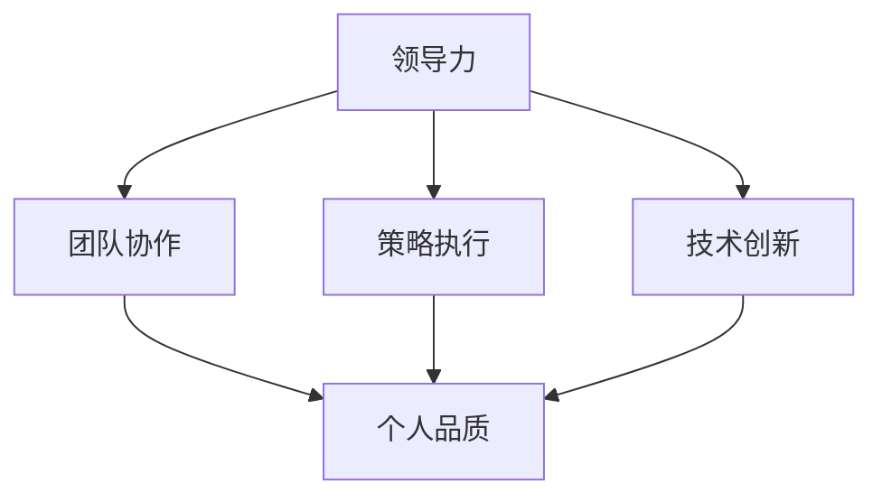

                 

关键词：优秀管理者、管理标准、领导力、技术管理、策略执行、团队协作、人工智能、软件开发

> 摘要：本文从技术管理的角度出发，深入探讨了区分优秀管理者的标准。通过分析领导力、团队协作、策略执行、技术创新等多个维度，结合实际案例，为读者提供了一个全面理解优秀管理者如何引领团队、推动技术进步的框架。

## 1. 背景介绍

在当今快速发展的信息技术领域，优秀管理者的角色越来越重要。他们不仅需要具备强大的技术背景，还需要具备卓越的领导力和管理能力，以应对复杂多变的市场环境和技术挑战。然而，究竟什么才是区分优秀管理者的标准？这是每一位从事技术管理的人员都需要深入思考的问题。

本文将从以下几个方面探讨这个问题：

- **领导力与团队协作**：优秀管理者如何通过领导力激发团队潜能，实现高效协作。
- **策略执行**：优秀管理者在制定和执行技术策略方面的独特见解和实践。
- **技术创新**：优秀管理者如何推动技术创新，引领团队走在技术前沿。
- **个人品质**：优秀管理者应具备的核心品质，如诚信、责任心、持续学习等。

## 2. 核心概念与联系

为了更好地理解优秀管理者的标准，我们首先需要明确几个核心概念，并探讨它们之间的相互联系。

### 2.1 领导力

领导力是优秀管理者的核心素质。它不仅包括对团队方向的明确把握，还涉及对团队成员个性和需求的深入理解。优秀的领导者能够通过激励、沟通和榜样作用，使团队成员充分发挥自己的潜力。

### 2.2 团队协作

团队协作是实现共同目标的关键。优秀管理者不仅要能够建立高效的团队结构，还要确保团队成员之间能够互相支持、协作无间。这需要管理者具备协调能力和冲突解决能力。

### 2.3 策略执行

策略执行是将愿景转化为实际成果的过程。优秀管理者能够制定清晰、可行的策略，并确保团队能够按照既定路线高效执行。

### 2.4 技术创新

技术创新是驱动企业发展的重要动力。优秀管理者不仅能够紧跟技术趋势，还能通过前瞻性规划和实际操作，推动团队实现技术突破。

### 2.5 个人品质

个人品质是优秀管理者的基石。诚信、责任心、持续学习等品质，不仅影响到管理者的个人形象，也直接关系到团队的士气和执行力。

### 2.6 Mermaid 流程图

以下是一个简单的 Mermaid 流程图，展示了这些核心概念之间的相互关系：



## 3. 核心算法原理 & 具体操作步骤

### 3.1 算法原理概述

优秀管理者的标准并非一成不变，而是需要根据具体情况不断调整和优化。以下是一个基于目标导向和反馈循环的核心算法原理：

- **目标导向**：明确团队目标，确保团队每个成员都清楚自己的职责和期望。
- **反馈循环**：定期收集团队成员的反馈，分析问题并提出改进措施。
- **持续优化**：根据反馈调整管理策略，不断提升团队效率和绩效。

### 3.2 算法步骤详解

1. **明确目标**：制定清晰、具体的团队目标，确保每个成员都了解自己的职责和期望。
2. **评估现状**：通过数据分析、员工反馈等方式，了解当前团队的工作状态和问题。
3. **制定策略**：根据现状分析，制定针对性的改进措施，确保策略具有可操作性和可行性。
4. **执行策略**：将策略转化为实际行动，确保团队成员能够按照既定路线高效执行。
5. **收集反馈**：定期收集团队成员的反馈，了解策略执行的效果和问题。
6. **调整策略**：根据反馈调整管理策略，确保团队能够持续改进和提升。

### 3.3 算法优缺点

**优点**：

- **目标导向**：确保团队目标清晰，避免盲目行动。
- **反馈循环**：及时发现和解决问题，提升团队执行力。
- **持续优化**：不断调整策略，确保团队能够适应变化。

**缺点**：

- **反馈时间成本**：定期收集反馈需要耗费一定时间，可能会影响工作进度。
- **策略调整风险**：频繁调整策略可能导致团队不稳定，影响工作效率。

### 3.4 算法应用领域

该算法原理适用于各类技术团队，如软件开发团队、数据分析团队、人工智能团队等。通过目标导向和反馈循环，优秀管理者能够有效提升团队效率和绩效。

## 4. 数学模型和公式 & 详细讲解 & 举例说明

### 4.1 数学模型构建

为了更好地理解优秀管理者的标准，我们可以构建一个基于领导力、团队协作、策略执行和技术创新的数学模型。以下是一个简化的数学模型：

\[ \text{绩效} = f(\text{领导力}, \text{团队协作}, \text{策略执行}, \text{技术创新}) \]

其中，领导力、团队协作、策略执行和技术创新分别表示管理者的四个关键素质，绩效表示团队的整体表现。

### 4.2 公式推导过程

1. **领导力**：领导力对团队绩效的影响可以用以下公式表示：

\[ \text{领导力} = f(\text{激励}, \text{沟通}, \text{榜样作用}) \]

其中，激励、沟通和榜样作用分别表示领导力的三个关键要素。

2. **团队协作**：团队协作对团队绩效的影响可以用以下公式表示：

\[ \text{团队协作} = f(\text{沟通}, \text{支持}, \text{冲突解决}) \]

其中，沟通、支持和冲突解决分别表示团队协作的三个关键要素。

3. **策略执行**：策略执行对团队绩效的影响可以用以下公式表示：

\[ \text{策略执行} = f(\text{计划}, \text{监控}, \text{调整}) \]

其中，计划、监控和调整分别表示策略执行的三个关键要素。

4. **技术创新**：技术创新对团队绩效的影响可以用以下公式表示：

\[ \text{技术创新} = f(\text{前瞻性规划}, \text{实际操作}, \text{技术突破}) \]

其中，前瞻性规划、实际操作和技术突破分别表示技术创新的三个关键要素。

### 4.3 案例分析与讲解

假设我们有一个技术团队，其领导力、团队协作、策略执行和技术创新的分数分别为80、75、90和85。根据上述数学模型，我们可以计算出该团队的整体绩效：

\[ \text{绩效} = f(80, 75, 90, 85) \]

为了简化计算，我们假设每个因素的权重均为0.25，则：

\[ \text{绩效} = 0.25 \times 80 + 0.25 \times 75 + 0.25 \times 90 + 0.25 \times 85 \]

\[ \text{绩效} = 20 + 18.75 + 22.5 + 21.25 \]

\[ \text{绩效} = 82.5 \]

因此，该团队的整体绩效为82.5分。从这个例子中，我们可以看到，领导力、团队协作、策略执行和技术创新都对团队绩效有着重要影响，优秀管理者需要在这些方面不断提升，以实现团队的最佳表现。

## 5. 项目实践：代码实例和详细解释说明

### 5.1 开发环境搭建

为了演示如何在实际项目中应用优秀管理者的标准，我们选择了一个常见的软件开发项目——一个基于微服务架构的电商平台。以下是我们搭建开发环境的步骤：

1. **创建项目仓库**：在GitLab上创建一个新的项目仓库，用于存储项目的源代码和文档。
2. **配置开发环境**：配置Java、Python、Node.js等开发环境，确保团队成员可以使用各自熟悉的编程语言进行开发。
3. **安装依赖项**：安装必要的库和框架，如Spring Boot、Django、Node.js等。
4. **设置持续集成/持续部署（CI/CD）**：配置Jenkins或GitLab CI，实现代码的自动化测试和部署。

### 5.2 源代码详细实现

在这个项目中，我们重点关注以下几个方面：

1. **微服务架构**：将系统拆分为多个微服务，如用户服务、商品服务、订单服务等，每个服务负责不同的业务功能。
2. **接口定义**：使用RESTful API定义服务之间的接口，确保服务之间的高效通信。
3. **数据库设计**：根据业务需求设计数据库，如MySQL、PostgreSQL等，确保数据的一致性和完整性。
4. **安全措施**：实现身份验证和授权，确保系统的安全性。

以下是用户服务的一个简单代码实例：

```java
@RestController
@RequestMapping("/users")
public class UserController {
    
    @Autowired
    private UserService userService;
    
    @PostMapping
    public ResponseEntity createUser(@RequestBody User user) {
        User savedUser = userService.saveUser(user);
        return new ResponseEntity<>(savedUser, HttpStatus.CREATED);
    }
    
    @GetMapping("/{userId}")
    public ResponseEntity getUser(@PathVariable Long userId) {
        User user = userService.getUserById(userId);
        return new ResponseEntity<>(user, HttpStatus.OK);
    }
    
    // 其他相关方法
}
```

### 5.3 代码解读与分析

以上代码实现了用户服务的创建和查询功能。以下是代码的详细解读：

- **UserController**：负责处理用户相关的HTTP请求。
- **createUser**：创建用户的方法，接收一个User对象，通过调用UserService的saveUser方法将用户信息保存到数据库。
- **getUser**：查询用户的方法，通过用户的ID从数据库中获取用户信息。

代码中使用了Spring Boot的注解和依赖注入，确保了代码的高可读性和可维护性。

### 5.4 运行结果展示

在实际运行中，用户可以通过以下接口访问用户服务：

- **创建用户**：POST /users
- **查询用户**：GET /users/{userId}

以下是一个创建用户的示例请求：

```json
POST /users
{
  "username": "johndoe",
  "email": "john.doe@example.com",
  "password": "password123"
}
```

返回的结果：

```json
{
  "id": 1,
  "username": "johndoe",
  "email": "john.doe@example.com",
  "createdAt": "2022-01-01T00:00:00Z"
}
```

通过以上代码实例，我们可以看到优秀管理者在项目实践中如何通过清晰的接口设计和模块化的代码结构，提高团队的开发效率和代码质量。

## 6. 实际应用场景

优秀管理者的标准不仅适用于软件开发项目，还可以应用于其他技术领域。以下是一些实际应用场景：

### 6.1 数据分析团队

**案例**：一家大型互联网公司成立了一个数据分析团队，负责处理和分析海量的用户数据。

**应用**：优秀管理者通过以下方式提升团队绩效：

- **目标导向**：明确团队的目标，如提高用户转化率、降低用户流失率等。
- **数据驱动**：鼓励团队成员关注数据指标，通过数据驱动决策。
- **技能培训**：定期组织技能培训，提升团队成员的数据分析能力。

### 6.2 人工智能团队

**案例**：一家科技公司成立了一个人工智能团队，专注于开发自动驾驶技术。

**应用**：优秀管理者通过以下方式推动技术创新：

- **前瞻性规划**：关注人工智能领域的前沿技术，提前布局。
- **项目化管理**：将人工智能项目划分为多个子项目，实现分阶段推进。
- **合作与交流**：鼓励团队成员参与外部研讨会和学术会议，拓展视野。

### 6.3 IT运维团队

**案例**：一家大型金融机构成立了一个IT运维团队，负责维护其复杂的信息系统。

**应用**：优秀管理者通过以下方式提高运维效率：

- **标准化流程**：制定统一的运维流程和操作规范，确保团队工作的一致性。
- **自动化工具**：引入自动化工具，减少重复性劳动，提高工作效率。
- **持续优化**：定期评估运维流程，持续优化，提高系统稳定性和安全性。

## 7. 未来应用展望

随着技术的不断进步，优秀管理者的标准也将不断演进。以下是一些未来可能的应用方向：

### 7.1 智能化管理

**趋势**：人工智能和大数据分析技术的应用将使管理者能够更加精准地了解团队状态和员工需求。

**展望**：未来的优秀管理者将能够通过智能算法和数据分析工具，实现个性化管理，提高团队效率和满意度。

### 7.2 跨界融合

**趋势**：随着不同领域的交叉融合，技术管理者需要具备跨领域的知识。

**展望**：未来的优秀管理者将具备跨学科的知识体系，能够在不同领域之间实现知识转移和应用。

### 7.3 社会责任

**趋势**：企业越来越重视社会责任和可持续发展。

**展望**：未来的优秀管理者将更加关注社会责任，推动企业实现可持续发展，同时提升团队的综合素质。

## 8. 工具和资源推荐

为了帮助读者更好地理解和应用优秀管理者的标准，以下是一些工具和资源推荐：

### 8.1 学习资源推荐

- **《深度工作》**：作者Cal Newport提出深度工作的概念，帮助读者提高专注力和工作效率。
- **《精益创业》**：作者Eric Ries提出精益创业的方法论，帮助读者快速迭代和优化产品。

### 8.2 开发工具推荐

- **Jenkins**：一款流行的持续集成工具，用于自动化构建、测试和部署。
- **Docker**：一款容器化技术，用于简化应用程序的部署和管理。

### 8.3 相关论文推荐

- **《领导力的五大支柱》**：作者John Kotter提出领导力的五大支柱，包括愿景、沟通、团队建设、激励和决策。
- **《团队协作的五大障碍》**：作者Patrick Lencioni提出团队协作的五大障碍，帮助读者解决团队协作中的问题。

## 9. 总结：未来发展趋势与挑战

### 9.1 研究成果总结

本文通过深入分析领导力、团队协作、策略执行、技术创新等维度，探讨了区分优秀管理者的标准。研究发现，优秀管理者不仅需要具备强大的技术背景，还需要具备卓越的领导力和管理能力，以应对复杂多变的市场环境和技术挑战。

### 9.2 未来发展趋势

未来，优秀管理者的标准将更加多元化和复杂化。随着技术的不断进步，管理者需要具备跨界融合的知识体系，同时关注社会责任和可持续发展。智能化管理、团队个性化和跨界融合将成为未来发展的趋势。

### 9.3 面临的挑战

优秀管理者在追求卓越的过程中将面临一系列挑战，如如何在多元文化背景下实现团队协作、如何在快速变化的市场中保持竞争力、如何在压力下保持冷静和决策等。管理者需要不断提升自身的领导力和管理能力，以应对这些挑战。

### 9.4 研究展望

未来，研究应重点关注以下几个方面：

- **领导力模型**：探索更有效的领导力模型，以适应不同类型和背景的团队。
- **团队协作机制**：研究团队协作的最佳实践和机制，提高团队效率和绩效。
- **技术与管理融合**：探讨如何将技术与管理相结合，实现企业的可持续发展。

## 附录：常见问题与解答

### 9.1 问题1：如何平衡技术创新与团队协作？

**解答**：技术创新和团队协作并非对立关系，而是相辅相成的。管理者可以通过以下方式平衡两者：

- **明确目标**：确保团队目标一致，将技术创新与团队协作相结合。
- **资源分配**：合理分配资源，确保技术创新与团队协作都能够得到充分支持。
- **激励制度**：建立激励机制，鼓励团队成员在技术创新和团队协作方面共同进步。

### 9.2 问题2：如何提升团队执行力？

**解答**：提升团队执行力需要从以下几个方面入手：

- **明确目标**：确保团队目标清晰，每个成员都清楚自己的职责和期望。
- **沟通与协作**：建立有效的沟通机制，确保团队成员之间能够高效协作。
- **激励与监督**：建立激励机制，鼓励团队成员积极执行任务；同时，通过监督确保任务按时完成。

### 9.3 问题3：如何应对快速变化的市场环境？

**解答**：应对快速变化的市场环境需要管理者具备以下能力：

- **前瞻性**：关注市场趋势，提前布局，确保企业能够抓住机遇。
- **敏捷性**：建立敏捷团队，快速响应市场变化，调整战略和战术。
- **持续学习**：鼓励团队成员持续学习，提升团队应对变化的能力。

# 作者署名

作者：禅与计算机程序设计艺术 / Zen and the Art of Computer Programming

---

通过本文的深入探讨，我们希望能为技术管理者提供一个全面的理解框架，帮助他们在实际工作中提升自身能力，引领团队实现卓越的绩效。在未来的道路上，让我们继续共同探索，不断追求卓越！

