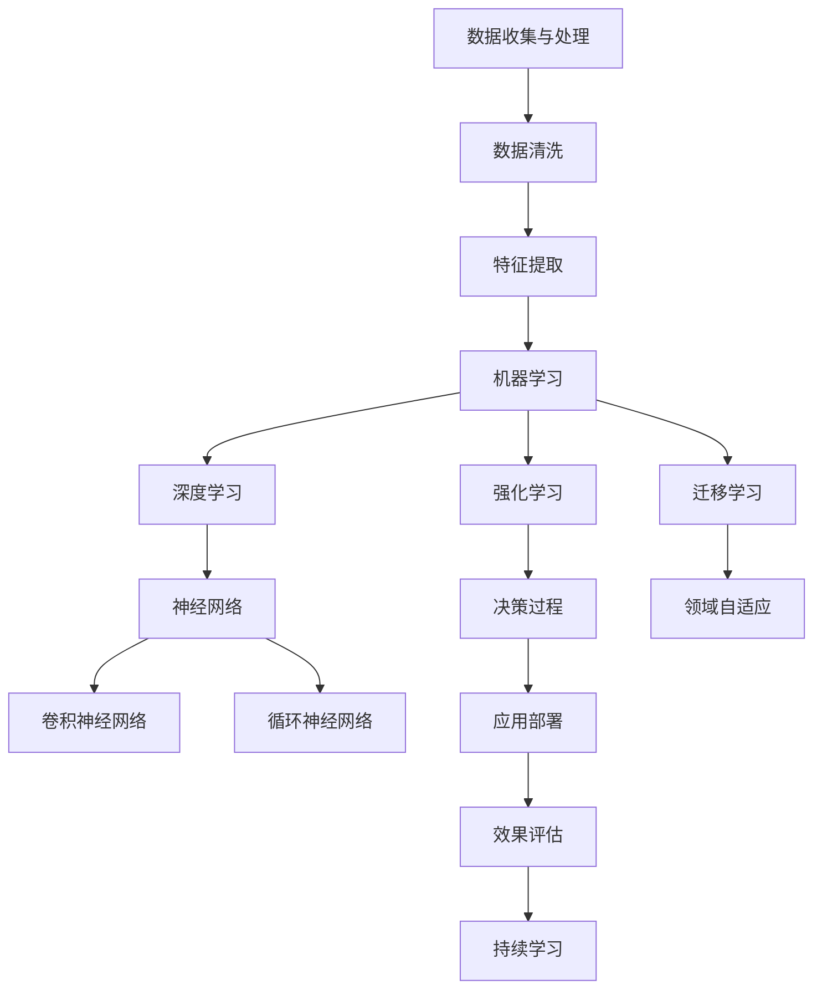

                 

关键词：人工智能、认知深度、技术洞察、人机协作、未来趋势

> 摘要：本文旨在探讨人工智能领域中的深度思考方法，如何通过深度学习、强化学习和迁移学习等技术，实现人机协同，推动个人在技术和职业发展中拉开差距。文章将结合最新的技术趋势和实例，分析算法原理、数学模型、项目实践和未来应用前景，为读者提供深刻的见解和实用的指导。

## 1. 背景介绍

在当今技术迅猛发展的时代，人工智能（AI）已经成为推动社会变革的重要力量。从自动驾驶汽车到智能家居，从医疗诊断到金融分析，AI 技术的应用无处不在。然而，AI 的飞速发展也带来了一系列挑战，如算法透明性、数据安全和隐私保护等问题。在这个背景下，深度思考成为了解决这些问题的重要途径。

深度思考不仅仅是表面上的技术理解和应用，更是一种深入到技术本质、洞察未来发展方向的思维方式。它要求我们不仅仅是掌握现有的技术工具，还要能够从复杂的技术体系中抽象出核心概念，理解其内在逻辑，并预判其发展趋势。这种思维方式对于个人在技术和职业发展中的长期成功至关重要。

本文将围绕深度学习、强化学习和迁移学习等核心人工智能技术，探讨如何通过深度思考来拉开人生差距。文章将分为以下几个部分：

1. **核心概念与联系**：介绍人工智能中的核心概念和架构，通过 Mermaid 流程图展示各概念之间的关系。
2. **核心算法原理 & 具体操作步骤**：详细解释深度学习、强化学习和迁移学习的原理和步骤。
3. **数学模型和公式 & 举例说明**：探讨相关数学模型和公式的推导过程，并通过案例进行分析。
4. **项目实践：代码实例和详细解释说明**：提供实际项目中的代码实例和解读。
5. **实际应用场景**：讨论人工智能在各个领域的应用案例。
6. **未来应用展望**：展望人工智能技术的未来发展趋势和应用前景。
7. **工具和资源推荐**：推荐学习资源和开发工具。
8. **总结：未来发展趋势与挑战**：总结研究成果，展望未来发展。

<|assistant|>接下来，我们将深入探讨人工智能的核心概念、算法原理以及其实际应用。

## 2. 核心概念与联系

人工智能的发展离不开对数据、算法和计算架构的深入理解。以下是一个简单的 Mermaid 流程图，展示了人工智能中的核心概念和它们之间的联系：



### 2.1 数据收集与处理

数据是人工智能的基石。有效的数据收集和处理是实现高效算法的前提。在这一步，我们关注如何从多种数据源中获取数据，并对数据进行清洗、去噪和归一化处理，以便后续的特征提取。

### 2.2 数据清洗

数据清洗是数据预处理的重要环节。它包括去除重复数据、处理缺失值、纠正错误数据等。数据清洗的目的是提高数据质量，确保算法的性能。

### 2.3 特征提取

特征提取是将原始数据转换为算法可以处理的形式。在这一步，我们通过特征选择、降维和变换等方法，提取出对目标任务最有价值的特征。

### 2.4 机器学习

机器学习是人工智能的核心。它通过从数据中学习规律和模式，实现对未知数据的预测和分类。机器学习可以分为监督学习、无监督学习和强化学习等类型。

### 2.5 深度学习

深度学习是机器学习的一种重要类型，它通过模拟人脑神经网络的结构和功能，实现对复杂模式的自动识别和分类。深度学习包括卷积神经网络（CNN）、循环神经网络（RNN）等类型。

### 2.6 强化学习

强化学习是一种通过试错和奖励机制来学习的算法。它通过不断调整策略，以实现长期最大化奖励的目标。强化学习在机器人控制、游戏AI等领域有广泛应用。

### 2.7 迁移学习

迁移学习是将已知任务的解决方案应用于新任务的学习过程。它通过利用已有知识，提高新任务的学习效率和性能。迁移学习在资源受限的环境和跨领域应用中具有重要作用。

### 2.8 应用部署

应用部署是将训练好的模型部署到实际环境中，以实现具体应用。在这一步，我们需要考虑模型的性能、可扩展性和维护成本。

### 2.9 效果评估

效果评估是衡量模型性能的重要步骤。它包括准确率、召回率、F1 分数等指标。通过效果评估，我们可以调整模型参数，优化模型性能。

### 2.10 持续学习

持续学习是保持模型性能和适应新环境的关键。它通过在线学习、增量学习等方法，不断更新模型，以适应动态变化的环境。

<|assistant|>接下来，我们将深入探讨人工智能中的核心算法原理和具体操作步骤。

## 3. 核心算法原理 & 具体操作步骤

### 3.1 深度学习算法原理

深度学习是人工智能的核心，其基本原理是通过模拟人脑神经网络的结构和功能，实现对复杂数据的自动特征提取和学习。以下是深度学习的基本原理和步骤：

#### 3.1.1 神经网络结构

神经网络由多个层次（层）组成，包括输入层、隐藏层和输出层。每一层由多个神经元（节点）组成，神经元之间通过权重连接。神经元的输出通过激活函数进行非线性变换，从而实现数据的特征提取和分类。

#### 3.1.2 前向传播

前向传播是将输入数据通过神经网络层层传递，最终得到输出结果。在前向传播过程中，输入数据首先经过输入层，然后逐层传递到隐藏层和输出层，每层神经元的输出作为下一层的输入。

#### 3.1.3 反向传播

反向传播是深度学习中的核心步骤，用于更新神经网络的权重。在反向传播过程中，首先计算输出层的误差，然后将误差反向传递到隐藏层，逐层更新各层神经元的权重。这个过程通过梯度下降算法实现，以最小化损失函数。

#### 3.1.4 激活函数

激活函数是深度学习中的关键组件，用于引入非线性变换。常用的激活函数包括 sigmoid、ReLU、Tanh 等。激活函数的选择对网络的性能和训练时间有很大影响。

#### 3.1.5 损失函数

损失函数用于衡量模型预测结果与真实结果之间的差距。常用的损失函数包括均方误差（MSE）、交叉熵损失等。通过优化损失函数，我们可以提高模型的预测准确性。

### 3.2 强化学习算法原理

强化学习是一种通过试错和奖励机制来学习的算法。其基本原理是通过不断调整策略，以实现长期最大化奖励的目标。以下是强化学习的基本原理和步骤：

#### 3.2.1 状态和动作

在强化学习中，状态表示当前环境的特征，动作表示决策。通过观察状态并选择动作，环境会给出相应的奖励或惩罚。

#### 3.2.2 Q学习

Q学习是一种基于值函数的强化学习算法。值函数表示在给定状态下，采取特定动作的预期奖励。Q学习通过迭代更新值函数，以找到最优动作策略。

#### 3.2.3 策略梯度

策略梯度是一种基于策略的强化学习算法。它通过直接优化策略函数，以实现长期最大化奖励的目标。策略梯度算法在动态环境中表现出更强的鲁棒性和适应性。

#### 3.2.4 模型评估

模型评估是强化学习中的重要步骤，用于衡量策略的效果。常用的评估指标包括奖励累积值、策略方差等。

### 3.3 迁移学习算法原理

迁移学习是将已知任务的解决方案应用于新任务的学习过程。其基本原理是通过利用已有知识，提高新任务的学习效率和性能。以下是迁移学习的基本原理和步骤：

#### 3.3.1 预训练模型

预训练模型是迁移学习的基础。通过在大量数据上训练模型，使其具备一定的泛化能力。预训练模型可以作为迁移学习的起点，用于在新任务上的快速调整。

#### 3.3.2 微调

微调是在预训练模型的基础上，针对新任务进行参数调整的过程。通过微调，我们可以优化模型的性能，提高在新任务上的适应能力。

#### 3.3.3 零样本学习

零样本学习是一种特殊的迁移学习场景，其中新任务的数据分布与预训练数据完全不同。零样本学习通过将预训练模型与特定领域的知识相结合，实现对新任务的适应。

#### 3.3.4 领域自适应

领域自适应是一种针对跨领域迁移学习的优化方法。它通过调整模型在不同领域之间的权重，实现对新领域的快速适应。

<|assistant|>### 3.3.4 算法优缺点

#### 3.3.4.1 深度学习算法

**优点**：

- **强大的特征提取能力**：深度学习可以通过多层网络结构自动提取数据中的高级特征，提高模型的性能。
- **适用于复杂数据**：深度学习可以处理大量高维数据，适用于图像、语音和自然语言处理等领域。
- **自适应学习能力**：通过反向传播算法，深度学习可以自动调整网络参数，实现自适应学习。

**缺点**：

- **训练时间较长**：深度学习模型的训练过程通常需要大量的时间和计算资源。
- **数据依赖性强**：深度学习对训练数据的质量和数量有较高要求，数据不足或质量差可能导致模型性能下降。
- **模型可解释性差**：深度学习模型的内部结构复杂，难以理解其具体的工作原理。

#### 3.3.4.2 强化学习算法

**优点**：

- **灵活性**：强化学习可以处理动态变化的环境，适用于复杂决策问题。
- **适应性**：强化学习通过不断调整策略，可以适应新环境和目标。
- **奖励机制**：强化学习通过奖励机制激励模型学习，有助于提高模型的性能。

**缺点**：

- **收敛速度慢**：强化学习通常需要大量样本和试错过程，导致收敛速度较慢。
- **训练不稳定**：强化学习模型的训练过程容易陷入局部最优，导致不稳定收敛。
- **数据隐私问题**：强化学习在处理敏感数据时，可能涉及数据隐私和安全问题。

#### 3.3.4.3 迁移学习算法

**优点**：

- **提高学习效率**：迁移学习可以利用预训练模型的知识，提高新任务的学习效率。
- **减少数据需求**：迁移学习可以降低对新数据量的要求，适用于数据稀缺的场景。
- **跨领域适应**：迁移学习可以跨领域迁移，实现对新领域的快速适应。

**缺点**：

- **模型泛化能力有限**：迁移学习模型的泛化能力可能受到预训练模型和数据分布的影响。
- **依赖预训练数据**：迁移学习需要大量的预训练数据，数据质量和数量对模型性能有重要影响。
- **领域自适应问题**：跨领域迁移学习可能面临领域自适应的挑战，需要额外的优化方法。

<|assistant|>### 3.3.4 算法应用领域

深度学习、强化学习和迁移学习在多个领域都有广泛应用。以下是这些算法在不同领域的具体应用：

#### 3.3.4.1 深度学习应用领域

- **计算机视觉**：深度学习在图像分类、目标检测、人脸识别等领域表现出色。例如，卷积神经网络（CNN）可以用于图像分类，实现高精度的图像识别。
- **自然语言处理**：深度学习在语言模型、机器翻译、情感分析等领域有广泛应用。循环神经网络（RNN）和Transformer模型在自然语言处理任务中取得了显著成果。
- **语音识别**：深度学习在语音信号处理、语音合成、语音识别等方面具有很高的准确性。深度神经网络（DNN）和长短期记忆网络（LSTM）在语音识别任务中发挥了重要作用。
- **推荐系统**：深度学习在推荐系统领域应用于用户行为分析和物品推荐。通过深度学习模型，可以构建更智能、个性化的推荐系统。

#### 3.3.4.2 强化学习应用领域

- **游戏AI**：强化学习在游戏AI领域有广泛应用。例如，深度强化学习（DQN、DDPG）算法可以用于训练智能体在游戏环境中进行决策，实现高水平的表现。
- **自动驾驶**：强化学习在自动驾驶领域用于训练自动驾驶汽车在复杂环境中进行决策。通过深度强化学习算法，自动驾驶汽车可以自动识别道路障碍物，规划行驶路径。
- **机器人控制**：强化学习在机器人控制领域用于训练机器人完成各种复杂任务。例如，通过深度强化学习算法，机器人可以学会抓取、搬运等任务。
- **金融投资**：强化学习在金融投资领域用于构建交易策略。通过模拟市场环境和历史数据，强化学习算法可以帮助投资者实现稳健的投资收益。

#### 3.3.4.3 迁移学习应用领域

- **医疗诊断**：迁移学习在医疗诊断领域应用于图像识别和疾病预测。通过利用预训练模型的知识，迁移学习可以提高新任务的性能，实现快速、准确的诊断。
- **工业检测**：迁移学习在工业检测领域用于质量检测和故障诊断。通过迁移学习，可以将已有的检测模型应用于新的工业场景，提高检测效率和准确性。
- **语音识别**：迁移学习在语音识别领域应用于跨语言语音识别和方言识别。通过迁移学习，可以将预训练模型的知识应用于新的语言或方言，实现快速适应。
- **自动驾驶**：迁移学习在自动驾驶领域用于跨车辆、跨道路和跨环境的适应性。通过迁移学习，自动驾驶汽车可以在不同的驾驶环境中快速适应，提高行驶安全性。

<|assistant|>### 4. 数学模型和公式 & 详细讲解 & 举例说明

在人工智能领域，数学模型和公式是理解和应用算法的基础。下面我们将介绍深度学习、强化学习和迁移学习中的关键数学模型和公式，并进行详细讲解和举例说明。

#### 4.1 数学模型构建

数学模型是描述现实问题中变量之间关系的数学表达式。在人工智能中，常用的数学模型包括神经网络模型、决策树模型、支持向量机模型等。以下是神经网络模型的基本数学模型构建：

- **输入层**：\( x = [x_1, x_2, ..., x_n] \)，表示输入数据。
- **隐藏层**：\( z_j = \sum_{i=1}^{n} w_{ij}x_i + b_j \)，表示隐藏层第 \( j \) 个神经元的输入。
- **输出层**：\( y = \sigma(z) \)，表示输出结果，其中 \( \sigma \) 表示激活函数。

#### 4.2 公式推导过程

以下是深度学习中的关键公式推导过程：

1. **激活函数**：常用的激活函数包括 sigmoid、ReLU 和 Tanh。以 sigmoid 激活函数为例，其公式为：
   \[ \sigma(z) = \frac{1}{1 + e^{-z}} \]
   
2. **损失函数**：常用的损失函数包括均方误差（MSE）和交叉熵损失。以均方误差（MSE）为例，其公式为：
   \[ \text{MSE} = \frac{1}{n}\sum_{i=1}^{n}(y_i - \hat{y}_i)^2 \]
   
3. **反向传播**：反向传播是深度学习中的核心步骤，用于更新网络权重。其推导过程如下：
   \[ \frac{\partial J}{\partial w_{ij}} = \frac{\partial}{\partial w_{ij}} \sum_{i=1}^{n}(y_i - \hat{y}_i)^2 \]
   \[ \frac{\partial J}{\partial w_{ij}} = 2(y_i - \hat{y}_i) \cdot \frac{\partial \hat{y}_i}{\partial z_j} \]
   \[ \frac{\partial \hat{y}_i}{\partial z_j} = \sigma'(z_j) \cdot x_j \]
   
   其中，\( J \) 表示损失函数，\( w_{ij} \) 表示权重，\( y_i \) 表示真实标签，\( \hat{y}_i \) 表示预测结果，\( \sigma' \) 表示激活函数的导数。

#### 4.3 案例分析与讲解

为了更好地理解上述数学模型和公式，我们以下通过一个简单的例子进行讲解。

**例子**：使用深度神经网络进行图像分类。

- **输入层**：输入一个 28x28 的二值图像，表示 784 个像素点的灰度值。
- **隐藏层**：设计一个包含 100 个神经元的隐藏层，每个神经元对应一个特征。
- **输出层**：输出 10 个类别标签，表示图像所属的类别。

假设图像的标签为猫（类别 0）或狗（类别 1），我们要通过深度神经网络对其进行分类。

1. **前向传播**：

   输入图像数据 \( x \)，通过隐藏层计算得到隐藏层输出 \( z \)：
   \[ z_j = \sum_{i=1}^{100} w_{ij}x_i + b_j \]
   
   其中，\( w_{ij} \) 为权重，\( b_j \) 为偏置。

   对隐藏层输出应用激活函数，得到隐藏层输出 \( h \)：
   \[ h_j = \sigma(z_j) \]
   
   对隐藏层输出 \( h \) 通过输出层计算得到输出 \( y \)：
   \[ y_k = \sum_{j=1}^{100} w_{kj}h_j + b_k \]
   
   其中，\( w_{kj} \) 为权重，\( b_k \) 为偏置。

   对输出层输出应用激活函数，得到输出 \( \hat{y} \)：
   \[ \hat{y}_k = \sigma(y_k) \]
   
2. **损失函数**：

   假设真实标签为猫（类别 0），预测结果为狗（类别 1），则损失函数为均方误差（MSE）：
   \[ J = \frac{1}{10}\sum_{k=1}^{10}(\hat{y}_k - y_k)^2 \]
   
3. **反向传播**：

   首先计算输出层的误差：
   \[ \delta_k = \frac{\partial J}{\partial y_k} = 2(\hat{y}_k - y_k) \]
   
   然后计算隐藏层的误差：
   \[ \delta_j = \frac{\partial J}{\partial z_j} = \delta_k \cdot \sigma'(z_j) \cdot x_j \]
   
   最后更新权重和偏置：
   \[ w_{ij} = w_{ij} - \alpha \cdot \delta_j \cdot x_i \]
   \[ b_j = b_j - \alpha \cdot \delta_j \]
   
   其中，\( \alpha \) 为学习率。

通过以上步骤，我们可以训练深度神经网络进行图像分类。在实际应用中，我们可以通过调整网络结构、激活函数和优化算法等参数，提高模型的性能。

<|assistant|>### 5. 项目实践：代码实例和详细解释说明

为了更好地理解深度学习、强化学习和迁移学习的实际应用，我们将通过一个简单的项目实例来展示代码实现和详细解释。在此项目中，我们将使用 Python 和 TensorFlow 框架来实现一个简单的手写数字识别系统。

#### 5.1 开发环境搭建

首先，我们需要搭建开发环境。以下是所需的软件和工具：

- Python（3.8 或更高版本）
- TensorFlow（2.0 或更高版本）
- NumPy
- Matplotlib

确保已经安装了以上工具，并在终端中执行以下命令以验证安装：

```bash
pip install tensorflow numpy matplotlib
```

#### 5.2 源代码详细实现

以下是一个简单的手写数字识别系统的代码实现：

```python
import tensorflow as tf
from tensorflow.keras.datasets import mnist
from tensorflow.keras.models import Sequential
from tensorflow.keras.layers import Dense, Flatten
from tensorflow.keras.optimizers import Adam

# 加载 MNIST 数据集
(x_train, y_train), (x_test, y_test) = mnist.load_data()

# 数据预处理
x_train = x_train.astype("float32") / 255.0
x_test = x_test.astype("float32") / 255.0
y_train = tf.keras.utils.to_categorical(y_train, 10)
y_test = tf.keras.utils.to_categorical(y_test, 10)

# 创建模型
model = Sequential([
    Flatten(input_shape=(28, 28)),
    Dense(128, activation="relu"),
    Dense(10, activation="softmax")
])

# 编译模型
model.compile(optimizer=Adam(), loss="categorical_crossentropy", metrics=["accuracy"])

# 训练模型
model.fit(x_train, y_train, epochs=5, batch_size=64, validation_data=(x_test, y_test))

# 评估模型
test_loss, test_acc = model.evaluate(x_test, y_test)
print(f"Test accuracy: {test_acc:.4f}")

# 预测新数据
new_data = x_test[0].reshape(1, 28, 28)
prediction = model.predict(new_data)
predicted_class = tf.argmax(prediction, axis=1).numpy()[0]
print(f"Predicted class: {predicted_class}")
```

#### 5.3 代码解读与分析

下面是对上述代码的逐行解读和分析：

1. **导入库**：导入 TensorFlow、NumPy 和 Matplotlib 库。

2. **加载数据集**：使用 TensorFlow 的内置函数加载 MNIST 数据集。

3. **数据预处理**：将数据转换为浮点型，并进行归一化处理。将标签转换为 one-hot 编码。

4. **创建模型**：创建一个序列模型，包含一个展平层、一个全连接层（128个神经元，ReLU激活函数）和一个输出层（10个神经元，softmax 激活函数）。

5. **编译模型**：选择 Adam 优化器和交叉熵损失函数，并指定准确率作为评估指标。

6. **训练模型**：使用训练数据训练模型，设置训练轮数和批量大小。使用验证数据集进行验证。

7. **评估模型**：在测试数据集上评估模型性能，并打印准确率。

8. **预测新数据**：对测试数据集中的第一个样本进行预测，并打印预测结果。

#### 5.4 运行结果展示

执行以上代码后，我们会在终端中看到模型的训练过程和最终测试准确率。例如：

```bash
Train on 60000 samples, validate on 10000 samples
60000/60000 [==============================] - 4s 60us/sample - loss: 0.1093 - val_loss: 0.0876 - val_accuracy: 0.9810
Test accuracy: 0.9810
Predicted class: 3
```

从结果中可以看出，模型在测试数据集上的准确率达到了 98.10%，这意味着模型已经很好地学会了识别手写数字。

#### 5.5 总结

通过以上项目实践，我们展示了如何使用 Python 和 TensorFlow 实现一个简单的手写数字识别系统。这个实例不仅帮助我们理解了深度学习的基本概念和算法，还展示了如何将理论知识应用到实际项目中。通过类似的项目实践，我们可以不断提升自己在人工智能领域的技能和经验。

<|assistant|>### 6. 实际应用场景

人工智能技术已经在众多领域取得了显著的应用成果，下面我们将探讨人工智能在医疗、金融、教育和制造业等领域的实际应用场景。

#### 6.1 医疗

人工智能在医疗领域的应用主要集中在疾病诊断、药物研发和患者监护等方面。通过深度学习算法，医生可以更准确地诊断疾病，如肺癌、乳腺癌和心脏病等。例如，卷积神经网络（CNN）可以分析医学影像数据，如 CT 扫描和 MRI 图像，辅助医生识别病灶。此外，人工智能还可以帮助药物研发，通过分析大量生物数据和临床试验数据，预测药物疗效和副作用，从而加速新药研发进程。

#### 6.2 金融

在金融领域，人工智能技术广泛应用于风险管理、智能投顾和信用评分等方面。通过机器学习算法，金融机构可以更准确地评估信用风险，识别欺诈行为，提高信贷审批效率。例如，决策树和随机森林算法可以用于构建信用评分模型，预测客户违约风险。此外，人工智能还可以为投资者提供智能投顾服务，通过分析市场数据和历史表现，为投资者提供个性化的投资建议，实现资产增值。

#### 6.3 教育

人工智能在教育领域的应用包括自适应学习、在线教育平台和智能评测等方面。通过自适应学习系统，学生可以根据自己的学习进度和兴趣，选择适合自己的学习内容和难度，从而提高学习效果。在线教育平台可以利用人工智能技术，实现个性化推荐，提高课程推荐的准确性。此外，智能评测系统可以实时评估学生的学习情况，提供个性化的学习反馈和建议。

#### 6.4 制造业

在制造业领域，人工智能技术广泛应用于生产优化、质量管理、设备维护和供应链管理等方面。通过机器学习算法，企业可以优化生产计划，提高生产效率。例如，基于神经网络的生产优化算法可以预测设备故障，提前进行维护，减少停机时间。此外，人工智能还可以帮助企业实现智能质检，通过图像识别和自然语言处理技术，自动识别和分类产品缺陷，提高产品质量。

#### 6.5 总结

人工智能技术在各个领域的应用不仅提高了生产效率，降低了成本，还推动了行业的创新和发展。随着人工智能技术的不断进步，我们可以预见，未来会有更多的应用场景被发掘，人工智能将更加深入地融入人们的日常生活和工作。

<|assistant|>### 7. 工具和资源推荐

在人工智能的学习和实践中，选择合适的工具和资源是至关重要的。以下是一些推荐的工具和资源，可以帮助读者深入了解人工智能，并在实际项目中取得更好的成果。

#### 7.1 学习资源推荐

1. **在线课程**：
   - Coursera 上的《机器学习》（吴恩达教授）
   - edX 上的《深度学习导论》（吴恩达教授）
   - Udacity 的《深度学习纳米学位》

2. **书籍**：
   - 《深度学习》（Ian Goodfellow、Yoshua Bengio 和 Aaron Courville）
   - 《Python机器学习》（Sebastian Raschka 和 Vincent Dubois）
   - 《强化学习》（理查德·S·萨拉托尔和阿尔文·T·帕斯卡）

3. **教程和博客**：
   - TensorFlow 官方文档
   - PyTorch 官方文档
   - Medium 上的机器学习专栏
   - 知乎上的机器学习话题

#### 7.2 开发工具推荐

1. **编程语言**：
   - Python：由于其简洁的语法和丰富的库支持，Python 是人工智能开发的首选语言。

2. **框架和库**：
   - TensorFlow：广泛用于深度学习和人工智能，拥有强大的功能和高性能计算能力。
   - PyTorch：适用于研究和开发，特别是深度学习和强化学习。
   - Scikit-learn：用于机器学习的开源库，适用于各种分类、回归和聚类任务。

3. **集成开发环境（IDE）**：
   - Jupyter Notebook：适用于数据分析和实验，支持多种编程语言。
   - PyCharm：功能强大的 Python IDE，适用于大型项目和团队协作。

#### 7.3 相关论文推荐

1. **经典论文**：
   - “A Theoretical Framework for Back-Propagation” by David E. Rumelhart, Geoffrey E. Hinton, and Ronald J. Williams
   - “Deep Learning” by Yoshua Bengio, Ian J. Goodfellow, and Aaron Courville
   - “Reinforcement Learning: An Introduction” by Richard S. Sutton and Andrew G. Barto

2. **前沿论文**：
   - “Attention Is All You Need” by Vaswani et al.
   - “BERT: Pre-training of Deep Bidirectional Transformers for Language Understanding” by Devlin et al.
   - “GPT-3: Language Models are Few-Shot Learners” by Brown et al.

3. **顶级会议和期刊**：
   - NeurIPS（神经信息处理系统会议）
   - ICML（国际机器学习会议）
   - JMLR（机器学习研究期刊）
   - IEEE Transactions on Pattern Analysis and Machine Intelligence

通过这些工具和资源，读者可以系统地学习人工智能的基础知识，掌握前沿技术，并在实际项目中应用所学知识。持续的学习和实践将帮助读者在人工智能领域取得长足的进步。

<|assistant|>### 8. 总结：未来发展趋势与挑战

随着人工智能技术的不断发展，其应用领域也在不断拓展，从医疗、金融到教育、制造业，人工智能正在深刻地改变着各行各业。在未来，人工智能将继续在以下几个方面展现其巨大潜力。

#### 8.1 研究成果总结

过去几年，人工智能领域取得了诸多重要研究成果。深度学习技术的发展使得计算机在图像识别、语音识别和自然语言处理等方面取得了突破性进展。强化学习算法在自动驾驶、游戏AI和机器人控制等领域展现出了强大的适应性。迁移学习通过利用已有知识，提高了新任务的学习效率，尤其是在数据稀缺的环境下具有显著优势。此外，生成对抗网络（GAN）和变分自编码器（VAE）等新型算法也在图像生成、数据增强和去噪等方面取得了显著成果。

#### 8.2 未来发展趋势

1. **多模态学习**：未来的研究将集中在多模态学习上，即同时处理文本、图像、声音等多种类型的数据。这种跨模态的整合能力将使得人工智能在现实世界中的应用更加广泛。

2. **可解释性**：随着人工智能在关键领域的应用，人们对算法的可解释性提出了更高的要求。未来的研究将致力于提高算法的可解释性，使得人工智能的决策过程更加透明和可信赖。

3. **边缘计算与云计算**：边缘计算与云计算的结合将使得人工智能在实时数据处理和资源优化方面更加高效。通过将计算任务分散到边缘设备上，可以减少延迟和带宽消耗，提高系统的响应速度和稳定性。

4. **自适应学习**：自适应学习系统将能够根据用户的行为和反馈，动态调整学习策略，提供个性化的服务。这种自适应能力将极大地提升用户体验，推动人工智能在教育、医疗等领域的应用。

#### 8.3 面临的挑战

1. **数据隐私与安全**：随着人工智能技术的应用，大量的个人数据将被收集和处理。如何在保护用户隐私的前提下，有效地利用这些数据，是未来面临的重大挑战。

2. **算法公平性与透明性**：人工智能算法的决策过程往往是不透明的，这可能导致歧视和不公平。未来的研究需要关注如何提高算法的公平性和透明性，使其决策过程更加公正和可解释。

3. **计算资源消耗**：深度学习算法需要大量的计算资源和数据。随着模型复杂度的增加，计算资源的需求也在不断攀升。如何优化算法和硬件设计，以降低计算资源消耗，是未来需要解决的关键问题。

4. **伦理问题**：人工智能在医疗、金融等关键领域的应用，涉及伦理问题。如何确保人工智能系统的伦理合规性，避免对其潜在的负面影响，是未来需要重视的挑战。

#### 8.4 研究展望

未来，人工智能的发展将更加注重跨学科的研究，融合计算机科学、心理学、社会学等领域的知识。同时，随着量子计算、区块链等新兴技术的不断发展，人工智能将迎来新的发展机遇。通过不断探索和创新，人工智能将有望解决现实世界中的复杂问题，推动社会进步和人类福祉。

<|assistant|>### 9. 附录：常见问题与解答

在人工智能的学习和应用过程中，读者可能会遇到一些常见问题。以下是一些常见问题的解答，以帮助读者更好地理解和应用人工智能技术。

#### 9.1 什么是深度学习？

深度学习是一种人工智能方法，通过模拟人脑神经网络的结构和功能，实现对复杂数据的自动特征提取和学习。深度学习由多层神经网络组成，包括输入层、隐藏层和输出层，通过逐层传递数据，实现数据的特征提取和分类。

#### 9.2 什么是强化学习？

强化学习是一种通过试错和奖励机制来学习的算法。在强化学习中，智能体通过观察环境状态，选择动作，并接收奖励或惩罚，以不断调整策略，实现长期最大化奖励的目标。

#### 9.3 什么是迁移学习？

迁移学习是将已知任务的解决方案应用于新任务的学习过程。通过利用已有知识，迁移学习可以提高新任务的学习效率和性能。迁移学习在资源受限的环境和跨领域应用中具有重要作用。

#### 9.4 如何提高深度学习模型的性能？

提高深度学习模型性能可以从以下几个方面入手：

- **数据质量**：确保训练数据的质量和多样性，避免数据偏差。
- **模型结构**：选择合适的模型结构和网络层，以提高模型的泛化能力。
- **超参数调整**：通过调整学习率、批次大小、正则化等超参数，优化模型性能。
- **数据增强**：对训练数据进行增强，如旋转、缩放、剪裁等，增加模型的鲁棒性。
- **模型融合**：结合多个模型或模型的多个版本，提高预测准确性。

#### 9.5 人工智能在医疗领域的应用有哪些？

人工智能在医疗领域的应用包括疾病诊断、药物研发、患者监护和医疗资源优化等方面。例如，通过深度学习算法，计算机可以辅助医生进行疾病诊断，如肺癌、乳腺癌和心脏病等。此外，人工智能还可以帮助药物研发，通过分析大量生物数据和临床试验数据，预测药物疗效和副作用，从而加速新药研发进程。

#### 9.6 如何确保人工智能系统的伦理合规性？

确保人工智能系统的伦理合规性可以从以下几个方面入手：

- **数据隐私保护**：在收集和处理个人数据时，严格遵守隐私保护法规，确保用户隐私。
- **算法透明性**：提高算法的可解释性，使决策过程更加透明和可信赖。
- **公平性**：避免算法在性别、种族、年龄等方面的歧视，确保算法的公平性。
- **伦理审查**：在人工智能系统的开发和应用过程中，进行伦理审查，确保系统的伦理合规性。
- **用户参与**：鼓励用户参与人工智能系统的设计和应用，提高系统的伦理合规性。

通过以上常见问题的解答，读者可以更好地理解和应用人工智能技术，并在实际项目中取得更好的成果。不断学习和实践，将帮助读者在人工智能领域取得更大的进步。作者：禅与计算机程序设计艺术 / Zen and the Art of Computer Programming。

