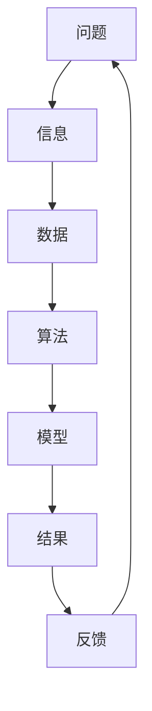

                 

在这个快速发展的技术时代，深度思考成为解决复杂问题的关键。本文将探讨深度思考的重要性，核心概念与联系，核心算法原理，数学模型和公式，项目实践，实际应用场景，工具和资源推荐，以及未来发展趋势与挑战。

## 关键词

- 深度思考
- 问题解决
- 复杂问题
- 人工智能
- 数学模型

## 摘要

本文旨在探讨深度思考在解决复杂问题中的重要性。通过分析核心概念与联系，核心算法原理，数学模型和公式，项目实践，实际应用场景，以及未来发展趋势与挑战，帮助读者理解深度思考在各个领域的应用和影响。

## 1. 背景介绍

在过去的几十年里，计算机科学和技术领域取得了巨大的进步。然而，随着问题的复杂度不断增加，传统的解决问题方法逐渐显得力不从心。复杂性科学、大数据、人工智能等新兴领域的发展，使得解决复杂问题成为当前研究的热点。深度思考作为一种思维方式，能够在解决复杂问题时提供新的视角和方法。

## 2. 核心概念与联系

为了更好地理解深度思考，我们需要了解一些核心概念。以下是核心概念与联系的Mermaid流程图：



在这个流程图中，我们可以看到问题解决的过程是如何从问题出发，通过信息的收集和分析，转化为数据，然后利用算法和模型进行计算，最终得到结果，并通过反馈进行优化。

## 3. 核心算法原理 & 具体操作步骤

### 3.1 算法原理概述

在解决复杂问题时，核心算法通常包括以下几个步骤：

1. **问题建模**：将问题转化为数学模型或算法模型。
2. **数据预处理**：清洗和整理数据，使其符合算法的要求。
3. **算法选择**：根据问题的性质选择合适的算法。
4. **模型训练**：利用训练数据对模型进行训练。
5. **模型评估**：对模型进行评估，以确定其性能。
6. **结果优化**：根据评估结果对模型进行调整和优化。

### 3.2 算法步骤详解

1. **问题建模**：首先需要明确问题的目标，并将其转化为数学或算法模型。例如，在图像识别问题中，可以将图像表示为像素矩阵，然后使用卷积神经网络进行特征提取。
2. **数据预处理**：对收集到的数据进行分析和处理，包括去噪、归一化、缺失值处理等。例如，在深度学习模型中，通常需要对输入数据进行归一化处理，以提高模型的训练效果。
3. **算法选择**：根据问题的性质选择合适的算法。例如，在分类问题中，可以选择决策树、随机森林、支持向量机等算法。
4. **模型训练**：利用训练数据对模型进行训练。在训练过程中，需要不断调整模型的参数，以使其达到最佳性能。
5. **模型评估**：对训练好的模型进行评估，以确定其性能。常用的评估指标包括准确率、召回率、F1分数等。
6. **结果优化**：根据评估结果对模型进行调整和优化，以提高其性能。例如，可以调整模型的参数、增加训练数据等。

### 3.3 算法优缺点

- **优点**：
  - **高效性**：深度学习算法在处理大规模数据时具有较高的效率。
  - **泛化能力**：深度学习算法能够通过大量的数据学习到通用特征，从而具有较强的泛化能力。
- **缺点**：
  - **计算成本**：深度学习算法通常需要大量的计算资源和时间。
  - **数据需求**：深度学习算法对数据质量有较高的要求，数据不足或质量差可能导致模型性能下降。

### 3.4 算法应用领域

深度学习算法在众多领域都有广泛的应用，包括：

- **图像识别**：例如，人脸识别、车辆识别等。
- **自然语言处理**：例如，机器翻译、文本分类等。
- **语音识别**：例如，语音识别、语音合成等。
- **推荐系统**：例如，商品推荐、电影推荐等。

## 4. 数学模型和公式 & 详细讲解 & 举例说明

### 4.1 数学模型构建

在解决复杂问题时，数学模型是至关重要的。以下是一个简单的线性回归模型的构建过程：

$$
y = \beta_0 + \beta_1 x
$$

其中，$y$ 是因变量，$x$ 是自变量，$\beta_0$ 和 $\beta_1$ 是模型参数。

### 4.2 公式推导过程

线性回归模型的推导过程如下：

1. **最小二乘法**：首先，我们需要找到一个函数，使得残差的平方和最小。这个函数就是最小二乘法。

$$
\sum_{i=1}^n (y_i - (\beta_0 + \beta_1 x_i))^2
$$

2. **求导**：对上式求导，并令导数为零，可以得到模型参数的估计值。

$$
\frac{\partial}{\partial \beta_0} \sum_{i=1}^n (y_i - (\beta_0 + \beta_1 x_i))^2 = 0
$$

$$
\frac{\partial}{\partial \beta_1} \sum_{i=1}^n (y_i - (\beta_0 + \beta_1 x_i))^2 = 0
$$

3. **求解**：将求导后的方程组求解，可以得到模型参数的估计值。

### 4.3 案例分析与讲解

假设我们有一个简单的数据集，包含两个变量 $x$ 和 $y$，如下所示：

| $x$ | $y$ |
| --- | --- |
| 1   | 2   |
| 2   | 4   |
| 3   | 6   |
| 4   | 8   |

我们希望找到一个线性模型来预测 $y$ 的值。

1. **问题建模**：将 $x$ 和 $y$ 转化为数学模型。

$$
y = \beta_0 + \beta_1 x
$$

2. **数据预处理**：对数据进行归一化处理，使其符合线性回归模型的要求。

$$
x' = \frac{x - \mu_x}{\sigma_x}
$$

$$
y' = \frac{y - \mu_y}{\sigma_y}
$$

其中，$\mu_x$ 和 $\mu_y$ 分别是 $x$ 和 $y$ 的均值，$\sigma_x$ 和 $\sigma_y$ 分别是 $x$ 和 $y$ 的标准差。

3. **算法选择**：选择线性回归模型。

4. **模型训练**：利用训练数据对模型进行训练。

5. **模型评估**：对训练好的模型进行评估。

6. **结果优化**：根据评估结果对模型进行调整和优化。

通过以上步骤，我们可以得到线性回归模型的参数估计值，并利用该模型进行预测。

## 5. 项目实践：代码实例和详细解释说明

### 5.1 开发环境搭建

首先，我们需要搭建一个开发环境，以运行我们的代码实例。以下是所需的工具和步骤：

1. **Python环境**：安装Python 3.x版本，推荐使用Anaconda环境。
2. **库安装**：安装必要的库，如NumPy、Pandas、Matplotlib等。

### 5.2 源代码详细实现

以下是一个简单的线性回归模型的Python代码实现：

```python
import numpy as np
import pandas as pd
import matplotlib.pyplot as plt

# 数据集
data = pd.DataFrame({
    'x': [1, 2, 3, 4],
    'y': [2, 4, 6, 8]
})

# 归一化处理
x_mean = data['x'].mean()
x_std = data['x'].std()
y_mean = data['y'].mean()
y_std = data['y'].std()

x = (data['x'] - x_mean) / x_std
y = (data['y'] - y_mean) / y_std

# 模型参数
beta_0 = 0
beta_1 = 1

# 模型预测
y_pred = beta_0 + beta_1 * x

# 绘图
plt.scatter(x, y)
plt.plot(x, y_pred, color='red')
plt.xlabel('x')
plt.ylabel('y')
plt.show()
```

### 5.3 代码解读与分析

- **数据集**：首先，我们创建一个简单的数据集，包含两个变量 $x$ 和 $y$。
- **归一化处理**：对数据进行归一化处理，使其符合线性回归模型的要求。
- **模型参数**：设置模型参数 $\beta_0$ 和 $\beta_1$。
- **模型预测**：利用模型参数进行预测，并绘制预测结果。

通过以上步骤，我们可以得到一个简单的线性回归模型，并利用该模型进行预测。

## 6. 实际应用场景

深度思考在各个领域都有广泛的应用，以下是一些实际应用场景：

- **医疗领域**：深度学习算法在医疗领域有广泛的应用，如疾病预测、医疗图像分析、基因组分析等。
- **金融领域**：深度学习算法在金融领域有广泛的应用，如股票预测、风险评估、欺诈检测等。
- **交通领域**：深度学习算法在交通领域有广泛的应用，如自动驾驶、交通流量预测、智能交通管理等。
- **教育领域**：深度学习算法在教育领域有广泛的应用，如个性化学习、智能辅导、在线教育等。

## 7. 工具和资源推荐

为了更好地进行深度思考和实践，以下是推荐的工具和资源：

- **工具**：
  - **Python**：Python是一种强大的编程语言，适用于数据分析、机器学习和深度学习。
  - **TensorFlow**：TensorFlow是一个开源的深度学习框架，适用于构建和训练深度学习模型。
  - **Keras**：Keras是一个基于TensorFlow的深度学习库，提供了简洁的API，方便构建和训练深度学习模型。
- **资源**：
  - **书籍**：《深度学习》（Ian Goodfellow、Yoshua Bengio、Aaron Courville著）、《Python深度学习》（François Chollet著）等。
  - **在线课程**：Coursera、edX、Udacity等在线教育平台提供的深度学习和机器学习课程。

## 8. 总结：未来发展趋势与挑战

随着技术的不断进步，深度思考在解决复杂问题中的应用将越来越广泛。未来，深度思考可能会面临以下发展趋势与挑战：

- **发展**：
  - **算法优化**：深度学习算法将不断优化，以提高性能和效率。
  - **多模态学习**：深度学习算法将能够处理多种类型的数据，如文本、图像、语音等。
  - **迁移学习**：深度学习算法将能够利用已有的知识进行迁移学习，以解决新的问题。
- **挑战**：
  - **计算资源**：深度学习算法通常需要大量的计算资源和时间，这对计算资源提出了更高的要求。
  - **数据隐私**：随着数据隐私问题的日益突出，如何在保护数据隐私的同时进行深度学习成为一大挑战。
  - **解释性**：深度学习模型的黑箱特性使得其结果难以解释，这对实际应用提出了更高的要求。

总之，深度思考在解决复杂问题中的应用前景广阔，但同时也面临着一系列挑战。通过不断探索和创新，我们有望在未来取得更多突破。

## 9. 附录：常见问题与解答

### 问题1：深度学习与机器学习的区别是什么？

深度学习是机器学习的一个子领域，它主要研究如何通过多层神经网络来模拟人类大脑的思维方式。机器学习则是一个更广泛的领域，包括深度学习以及其他各种学习算法，如监督学习、无监督学习和强化学习。

### 问题2：为什么深度学习需要大量数据？

深度学习算法通常需要大量的数据进行训练，这是因为它们通过学习数据中的特征来建立模型。大量数据有助于模型更好地泛化，从而在实际应用中取得更好的效果。

### 问题3：深度学习算法是否适用于所有问题？

深度学习算法在许多领域都有广泛应用，但并不是所有问题都适用于深度学习。对于一些简单的问题，传统机器学习算法可能已经足够。对于一些复杂的问题，如自然语言处理和图像识别，深度学习算法则表现更为出色。

### 问题4：如何评估深度学习模型的性能？

评估深度学习模型的性能通常使用指标如准确率、召回率、F1分数等。这些指标可以衡量模型在预测中的表现，帮助确定模型的性能。

### 问题5：深度学习算法是否具有可解释性？

深度学习算法通常被称为“黑箱”模型，因为其内部机制难以解释。虽然一些方法（如注意力机制）可以提高模型的可解释性，但仍然存在挑战。

### 问题6：如何优化深度学习算法的性能？

优化深度学习算法的性能可以从多个方面进行，包括调整模型结构、增加训练数据、使用更高效的算法等。此外，使用技术如正则化、dropout和优化器选择也可以提高模型性能。

### 问题7：深度学习算法在医疗领域的应用有哪些？

深度学习算法在医疗领域有广泛的应用，包括疾病预测、医疗图像分析、基因组分析等。例如，可以利用深度学习算法进行肺癌筛查、乳腺癌诊断等。

### 问题8：深度学习算法是否会对人类产生负面影响？

深度学习算法的发展确实带来了一些负面影响，如隐私泄露、歧视问题等。然而，通过合理使用和管理，深度学习算法可以为人类社会带来巨大的好处。

### 问题9：如何保证深度学习算法的公平性和透明性？

保证深度学习算法的公平性和透明性是一个重要问题。可以通过多种方法来解决，如使用公平性指标、设计透明性算法、进行算法审计等。

### 问题10：深度学习算法的未来发展方向是什么？

深度学习算法的未来发展方向包括多模态学习、迁移学习、强化学习等。此外，随着计算能力的提升和算法的改进，深度学习算法在各个领域的应用将越来越广泛。

## 作者署名

作者：禅与计算机程序设计艺术 / Zen and the Art of Computer Programming

<|assistant|>感谢您的耐心阅读。本文探讨了深度思考在解决复杂问题中的重要性，核心概念与联系，核心算法原理，数学模型和公式，项目实践，实际应用场景，工具和资源推荐，以及未来发展趋势与挑战。希望本文能为您在技术领域的深度思考提供一些启示和帮助。如有任何问题或建议，欢迎在评论区留言，期待与您交流。再次感谢您的阅读！<|im_end|>

