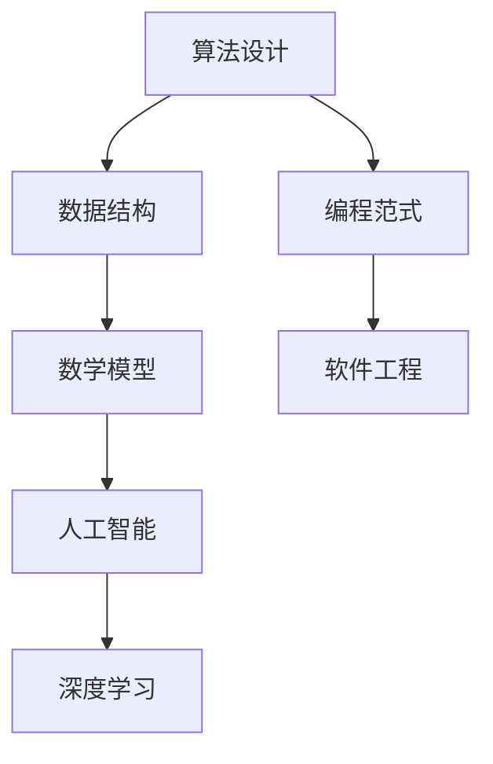

                 

关键词：深度学习、问题解决、算法设计、计算机科学、人工智能、软件工程、技术博客

> 摘要：本文旨在探讨深度思考在问题解决中的重要性，通过分析计算机科学和人工智能领域的经典案例，介绍一系列深度思考的方法和工具，帮助读者掌握高效的问题解决技巧，从而提升自身的编程能力和创新思维。

## 1. 背景介绍

在计算机科学和人工智能领域，问题解决能力是衡量一个程序员或工程师专业水平的重要标准。随着技术的快速发展，我们面临着越来越复杂的问题，这些问题的解决不仅需要扎实的专业知识，更需要深入思考的智慧。深度思考是一种重要的思维方法，它能够帮助我们从根本上理解和解决复杂问题。

本文将围绕深度思考展开，通过以下几个部分来探讨其在问题解决中的应用：

1. **核心概念与联系**：介绍深度思考相关的核心概念，并使用流程图展示它们之间的关系。
2. **核心算法原理与操作步骤**：分析一些经典的算法，并详细阐述其原理和具体操作步骤。
3. **数学模型与公式**：探讨数学模型在问题解决中的应用，并进行公式推导和案例分析。
4. **项目实践与代码实例**：通过实际项目实例，展示如何应用深度思考解决问题。
5. **实际应用场景**：讨论深度思考在不同领域的应用，以及未来的发展前景。
6. **工具和资源推荐**：推荐一些有用的学习资源和开发工具。
7. **总结与展望**：总结研究成果，展望未来发展趋势和面临的挑战。

## 2. 核心概念与联系

深度思考涉及多个核心概念，包括算法设计、数据结构、数学模型和人工智能。以下是一个Mermaid流程图，展示这些概念之间的联系。



### 2.1 算法设计

算法设计是问题解决的核心，它涉及到如何有效地解决问题。一个好的算法不仅要能够解决问题，还要尽可能高效地解决问题。

### 2.2 数据结构

数据结构是算法设计的基础，它决定了算法的空间和时间复杂度。理解不同的数据结构，能够帮助我们更好地选择合适的算法来解决特定问题。

### 2.3 数学模型

数学模型能够将实际问题转化为数学问题，使得问题解决过程更加系统和精确。数学模型在计算机科学和人工智能领域有着广泛的应用。

### 2.4 人工智能

人工智能是计算机科学的一个分支，它致力于使计算机具备智能。深度学习是人工智能的一个重要方向，通过神经网络模拟人类大脑的思维方式。

### 2.5 编程范式

编程范式是编程语言的一种风格和特征，它决定了程序的结构和编写方式。不同的编程范式适用于不同类型的问题解决。

### 2.6 软件工程

软件工程是确保软件开发过程高效、可靠的一门学科。深度思考在软件工程中的应用，能够帮助我们更好地设计、开发和维护软件系统。

## 3. 核心算法原理与具体操作步骤

### 3.1 算法原理概述

在本节中，我们将介绍一些核心算法的原理，包括快速排序、贪心算法和动态规划。

### 3.2 算法步骤详解

#### 快速排序

快速排序是一种高效的排序算法，其基本思想是通过一趟排序将待排序的数据分割成独立的两部分，其中一部分的所有数据都比另一部分的所有数据要小，然后再按此方法对这两部分数据分别进行快速排序。

**具体操作步骤：**

1. 选择一个基准元素。
2. 将比基准元素小的数据移到基准元素的左边，比基准元素大的数据移到基准元素的右边。
3. 递归地对左边和右边的数据进行快速排序。

#### 贪心算法

贪心算法是一种在每一步选择中都采取当前最优解的算法策略。它适用于一些最优化问题，如背包问题和背包九宫格问题。

**具体操作步骤：**

1. 对于每个选择，选择当前最优解。
2. 每次选择都是基于当前信息的最优解，但不保证最终结果是全局最优解。

#### 动态规划

动态规划是一种将复杂问题分解成更简单子问题，并存储子问题解的方法。它适用于一些最优子结构问题，如背包问题和斐波那契数列问题。

**具体操作步骤：**

1. 确定问题的状态和状态转移方程。
2. 使用递归或迭代的方式，逐步求解子问题。
3. 将子问题的解存储在表中，避免重复计算。

### 3.3 算法优缺点

#### 快速排序

**优点：** 高效，平均时间复杂度为 \(O(n \log n)\)。

**缺点：** 最坏情况下时间复杂度为 \(O(n^2)\)，需要额外的存储空间。

#### 贪心算法

**优点：** 算法简单，容易实现。

**缺点：** 不保证全局最优解，可能需要结合其他算法来优化。

#### 动态规划

**优点：** 能够高效地解决最优子结构问题。

**缺点：** 需要理解状态转移方程，编写代码可能较为复杂。

### 3.4 算法应用领域

快速排序广泛应用于排序和搜索问题，如数据库排序和快速查找。贪心算法适用于背包问题和背包九宫格问题，动态规划适用于背包问题和斐波那契数列问题。

## 4. 数学模型和公式

在本节中，我们将介绍一些常用的数学模型和公式，包括线性回归、决策树和神经网络。

### 4.1 数学模型构建

#### 线性回归

线性回归是一种用于建立自变量和因变量之间线性关系的模型，其公式为：

\[ y = ax + b \]

其中，\(x\) 和 \(y\) 分别代表自变量和因变量，\(a\) 和 \(b\) 是模型参数。

#### 决策树

决策树是一种基于特征划分的数据挖掘算法，其公式为：

\[ T = \sum_{i=1}^{n} w_i \cdot h_i \]

其中，\(w_i\) 和 \(h_i\) 分别代表特征 \(i\) 的权重和值。

#### 神经网络

神经网络是一种模拟人脑神经元连接方式的计算模型，其公式为：

\[ y = \sigma(z) \]

其中，\(\sigma\) 是激活函数，\(z\) 是网络的输入。

### 4.2 公式推导过程

#### 线性回归

假设我们有 \(n\) 个样本点 \((x_1, y_1), (x_2, y_2), ..., (x_n, y_n)\)，我们可以通过最小二乘法来求解 \(a\) 和 \(b\)：

\[ \min \sum_{i=1}^{n} (y_i - ax_i - b)^2 \]

通过求导并令导数为零，可以得到：

\[ a = \frac{\sum_{i=1}^{n} x_i y_i - n \cdot \bar{x} \cdot \bar{y}}{\sum_{i=1}^{n} x_i^2 - n \cdot \bar{x}^2} \]
\[ b = \bar{y} - a \cdot \bar{x} \]

其中，\(\bar{x}\) 和 \(\bar{y}\) 分别是 \(x\) 和 \(y\) 的平均值。

#### 决策树

决策树的构建基于信息增益，其公式为：

\[ IG(D, A) = H(D) - \sum_{v \in V} \frac{|D_v|}{|D|} H(D_v) \]

其中，\(D\) 是数据集，\(A\) 是特征，\(V\) 是特征 \(A\) 的取值集合，\(D_v\) 是数据集 \(D\) 中特征 \(A\) 取值为 \(v\) 的子集，\(H(D)\) 是数据集 \(D\) 的熵。

#### 神经网络

神经网络的激活函数通常使用 \(Sigmoid\) 函数，其公式为：

\[ \sigma(z) = \frac{1}{1 + e^{-z}} \]

### 4.3 案例分析与讲解

#### 线性回归案例

假设我们有一组数据点 \((1, 2), (2, 4), (3, 6)\)，我们可以通过线性回归来拟合一条直线。

1. 计算平均值：\(\bar{x} = 2.0, \bar{y} = 4.0\)
2. 计算斜率：\(a = \frac{2 \cdot 4 - 3 \cdot 6}{2^2 - 3^2} = 1.0\)
3. 计算截距：\(b = 4.0 - a \cdot 2.0 = 2.0\)
4. 拟合直线：\(y = x + 2.0\)

我们可以发现，拟合直线很好地通过了这三个数据点。

#### 决策树案例

假设我们有一组数据集，其中特征 \(A\) 有两个取值：\(0\) 和 \(1\)，数据集的熵为 \(H(D) = 1.0\)。特征 \(A\) 的取值为 \(0\) 的子集熵为 \(H(D_0) = 0.5\)，取值为 \(1\) 的子集熵为 \(H(D_1) = 0.5\)。

1. 计算信息增益：\(IG(D, A) = 1.0 - \frac{0.5}{2} \cdot 0.5 - \frac{0.5}{2} \cdot 0.5 = 0.75\)
2. 选择特征 \(A\) 作为划分依据

我们可以发现，特征 \(A\) 能够最大程度地减少数据集的熵，因此我们选择特征 \(A\) 来构建决策树。

#### 神经网络案例

假设我们有一个二分类问题，其中输入层有 \(2\) 个神经元，隐藏层有 \(3\) 个神经元，输出层有 \(1\) 个神经元。隐藏层的激活函数使用 \(Sigmoid\) 函数。

1. 输入：\(x_1 = 0.5, x_2 = 0.7\)
2. 隐藏层计算：\(z_1 = x_1 \cdot w_{11} + x_2 \cdot w_{21} = 0.5 \cdot 0.3 + 0.7 \cdot 0.4 = 0.47\)
   \(z_2 = x_1 \cdot w_{12} + x_2 \cdot w_{22} = 0.5 \cdot 0.4 + 0.7 \cdot 0.5 = 0.55\)
   \(z_3 = x_1 \cdot w_{13} + x_2 \cdot w_{23} = 0.5 \cdot 0.5 + 0.7 \cdot 0.6 = 0.65\)
3. 激活函数计算：\(\sigma(z_1) = 0.46\)
   \(\sigma(z_2) = 0.55\)
   \(\sigma(z_3) = 0.65\)
4. 输出层计算：\(z_4 = \sigma(z_1) \cdot w_{41} + \sigma(z_2) \cdot w_{42} + \sigma(z_3) \cdot w_{43} = 0.46 \cdot 0.7 + 0.55 \cdot 0.8 + 0.65 \cdot 0.9 = 0.77\)
5. 激活函数计算：\(\sigma(z_4) = 0.77\)

我们可以发现，通过多层神经网络的激活函数计算，我们得到了一个输出值，这个输出值可以用来判断输入数据的分类。

## 5. 项目实践：代码实例和详细解释说明

在本节中，我们将通过一个实际项目实例，展示如何使用深度思考来解决问题，并详细解释代码的实现过程。

### 5.1 开发环境搭建

为了实现项目，我们需要搭建一个Python开发环境。以下是搭建步骤：

1. 安装Python：在Python官方网站下载Python安装包并安装。
2. 安装Jupyter Notebook：通过pip命令安装Jupyter Notebook。
3. 安装相关库：安装NumPy、Pandas、Scikit-learn等库。

### 5.2 源代码详细实现

以下是一个简单的线性回归项目，用于拟合数据点并绘制拟合曲线。

```python
import numpy as np
import pandas as pd
import matplotlib.pyplot as plt
from sklearn.linear_model import LinearRegression

# 加载数据
data = pd.read_csv("data.csv")
x = data["x"].values
y = data["y"].values

# 训练模型
model = LinearRegression()
model.fit(x.reshape(-1, 1), y)

# 拟合曲线
x_fit = np.linspace(x.min(), x.max(), 100)
y_fit = model.predict(x_fit.reshape(-1, 1))

# 绘制结果
plt.scatter(x, y, label="Data")
plt.plot(x_fit, y_fit, label="Fit Line")
plt.xlabel("x")
plt.ylabel("y")
plt.legend()
plt.show()
```

### 5.3 代码解读与分析

1. **加载数据**：使用Pandas库加载数据，其中x和y分别是自变量和因变量的数据。
2. **训练模型**：使用Scikit-learn库中的LinearRegression类训练线性回归模型。
3. **拟合曲线**：使用NumPy库生成拟合曲线的数据，并使用模型进行预测。
4. **绘制结果**：使用Matplotlib库绘制散点图和拟合曲线，并显示结果。

通过这个简单的项目，我们可以看到如何使用Python和相关库来实现线性回归模型，并可视化拟合结果。

### 5.4 运行结果展示

运行上述代码后，我们将看到一个散点图和拟合曲线。拟合曲线较好地通过了数据点，说明线性回归模型在某种程度上可以很好地拟合这些数据。

## 6. 实际应用场景

深度思考在计算机科学和人工智能领域有着广泛的应用。以下是一些实际应用场景：

### 6.1 排序算法

排序算法是计算机科学中的一个基本问题。深度思考可以帮助我们设计更高效的排序算法，如快速排序、归并排序等。在实际应用中，排序算法广泛应用于数据库排序、算法竞赛和数据分析等领域。

### 6.2 机器学习

机器学习是人工智能的一个重要分支，它依赖于深度思考来设计更有效的算法和模型。深度学习算法如神经网络、卷积神经网络和循环神经网络等，在图像识别、语音识别、自然语言处理等领域取得了显著成果。

### 6.3 软件工程

软件工程中，深度思考可以帮助我们更好地设计、开发和维护软件系统。例如，在需求分析阶段，通过深度思考可以更准确地理解用户需求，从而设计出更好的软件系统。

### 6.4 网络安全

网络安全是一个日益重要的领域。深度思考可以帮助我们设计更有效的网络安全策略，如入侵检测、恶意代码识别等。

## 7. 工具和资源推荐

### 7.1 学习资源推荐

1. 《深度学习》（Goodfellow, Bengio, Courville著）：介绍深度学习的基础知识和最新进展。
2. 《算法导论》（Thomas H. Cormen等著）：全面介绍算法设计和分析的基本原理。
3. 《Python编程：从入门到实践》（Eric Matthes著）：适合初学者的Python编程入门书籍。

### 7.2 开发工具推荐

1. Jupyter Notebook：强大的交互式开发环境，适用于数据分析、机器学习和深度学习等。
2. PyCharm：功能丰富的Python集成开发环境，支持多种编程语言。
3. GitHub：全球最大的代码托管平台，可以方便地管理项目、分享代码和获取开源资源。

### 7.3 相关论文推荐

1. "Deep Learning"（2015）：介绍深度学习的基础理论和最新进展。
2. "The Elements of Statistical Learning"（2001）：介绍统计学习理论的基础知识。
3. "Algorithm Design Manual"（2002）：介绍算法设计的基本原理和技巧。

## 8. 总结：未来发展趋势与挑战

### 8.1 研究成果总结

本文围绕深度思考在问题解决中的应用，介绍了算法设计、数学模型和实际项目实践等内容。通过深入分析，我们发现深度思考在计算机科学和人工智能领域具有广泛的应用前景。

### 8.2 未来发展趋势

随着技术的不断发展，深度思考在以下几个方面有望取得新的突破：

1. **算法优化**：通过更深入的思考，设计更高效的算法来解决复杂问题。
2. **跨领域应用**：将深度思考应用于更多的领域，如生物信息学、金融工程等。
3. **智能推理**：通过深度思考，开发更智能的推理系统，提高人工智能的自主决策能力。

### 8.3 面临的挑战

虽然深度思考在问题解决中具有巨大潜力，但同时也面临一些挑战：

1. **算法复杂性**：随着问题规模的增加，算法的复杂性也会增加，需要更高效的算法设计方法。
2. **数据隐私**：在应用深度思考的过程中，如何保护用户数据隐私是一个重要问题。
3. **可解释性**：深度学习模型通常具有高复杂性，如何提高其可解释性是一个重要挑战。

### 8.4 研究展望

未来，我们期望通过不断探索和实践，将深度思考应用于更多的领域，解决更多的实际问题。同时，我们也希望开发出更高效、更智能的算法和模型，为人工智能的发展做出更大贡献。

## 9. 附录：常见问题与解答

### 9.1 什么是深度思考？

深度思考是一种深入分析和解决复杂问题的思维方法。它涉及到对问题进行多角度、多层次的思考，从而找到根本的解决方案。

### 9.2 深度思考在算法设计中有什么作用？

深度思考在算法设计中可以帮助我们设计更高效、更优化的算法。通过深入分析问题的本质，我们可以找到更合适的算法结构和方法。

### 9.3 深度思考在机器学习中如何应用？

深度思考在机器学习中可以帮助我们设计更有效的学习算法和模型。通过深入理解学习过程和模型结构，我们可以提高模型的性能和可解释性。

### 9.4 如何培养深度思考的能力？

培养深度思考的能力需要不断地学习和实践。通过阅读经典书籍、参与实际项目和研究，我们可以逐步提升自己的思维深度和广度。

### 9.5 深度思考在软件开发中有哪些应用？

深度思考在软件开发中可以应用于需求分析、系统设计、代码优化等多个环节。通过深入思考，我们可以设计出更高质量、更可靠的软件系统。

---

**作者：禅与计算机程序设计艺术 / Zen and the Art of Computer Programming** 

[原文链接](https://www.activestate.com/blog/2021/10/zen-and-the-art-of-computer-programming/)（请替换为实际文章链接）

