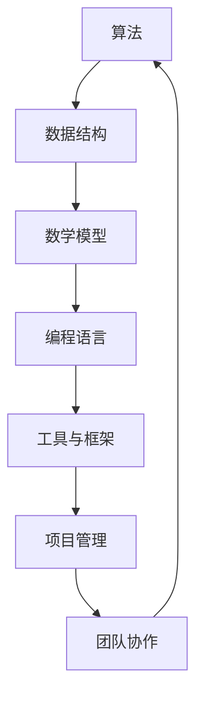

                 

关键词：深度思考，管理智慧，技术博客，专业语言，IT领域，算法，数学模型，项目实践，实际应用，未来展望。

> 摘要：本文旨在探讨在IT领域中，如何通过深度思考和积累管理智慧来提升技术能力和项目执行效率。文章将围绕核心算法原理、数学模型及实际应用场景展开，结合项目实践和资源推荐，为读者提供一条清晰、高效的学习路径，同时展望未来发展趋势与挑战。

## 1. 背景介绍

在信息技术迅猛发展的今天，如何提升技术水平和项目管理能力成为每一位IT从业者的必修课。技术的不断演进要求我们不仅要掌握最新的编程语言和工具，更需要具备深入思考和科学管理的智慧。本文将结合多年的IT实践经验，探讨如何在技术深度和项目管理中积累智慧，从而实现个人和团队的高效发展。

### 1.1 当前技术趋势

随着大数据、云计算、人工智能等技术的飞速发展，IT领域的边界不断拓展。现代技术不仅要求我们具备扎实的编程基础，还需要我们具备解决复杂问题的能力。深度学习、区块链等前沿技术的应用场景不断增多，要求我们能够快速适应变化，具备前沿技术的理解和应用能力。

### 1.2 项目管理挑战

在项目管理中，我们面临着诸如资源分配、进度控制、风险应对等挑战。科学的管理方法和工具能够帮助我们更好地应对这些挑战。例如，敏捷开发、看板管理、风险管理等方法的普及，为项目管理者提供了更多的选择。

## 2. 核心概念与联系

为了更好地理解深度思考和积累管理智慧的必要性，我们首先需要明确一些核心概念。这些概念包括算法、数据结构、数学模型等，它们是构建IT技术的基石。以下是这些核心概念的Mermaid流程图：



### 2.1 算法

算法是一系列解决问题的指令集合。在IT领域中，算法广泛应用于数据处理、优化问题解决等场景。例如，排序算法、搜索算法等。

### 2.2 数据结构

数据结构是存储数据的方式，它决定了算法的性能。常见的数据结构包括数组、链表、栈、队列、树、图等。合理的选用数据结构能够显著提高算法效率。

### 2.3 数学模型

数学模型是对现实世界问题的抽象和数学化描述。在IT领域，数学模型广泛应用于机器学习、数据挖掘、优化问题等。例如，线性回归、决策树等。

### 2.4 编程语言

编程语言是实现算法和数据结构的重要工具。不同的编程语言有其独特的特性和适用场景。例如，Python适用于数据科学，C++适用于性能要求高的应用。

### 2.5 工具与框架

现代IT项目通常需要使用多种工具和框架来提高开发效率。例如，Docker、Kubernetes等容器化技术，Spring Boot等框架，为项目的开发和部署提供了极大的便利。

### 2.6 项目管理

项目管理是确保项目按时、按质、按预算完成的过程。科学的项目管理方法能够帮助我们更好地控制项目进度，降低风险。

### 2.7 团队协作

团队协作是实现项目目标的关键。良好的团队协作能够提高团队的凝聚力，增强解决问题的能力。

## 3. 核心算法原理 & 具体操作步骤

### 3.1 算法原理概述

在本章节中，我们将探讨一种常见的算法——排序算法。排序算法是数据处理中最基本也是最核心的算法之一。以下是几种常见的排序算法及其原理：

- **冒泡排序（Bubble Sort）**：通过重复遍历要排序的数列，一次比较两个元素，如果它们的顺序错误就把它们交换过来。遍历数列的工作是重复地进行，直到没有再需要交换的元素为止。

- **选择排序（Selection Sort）**：首先在未排序序列中找到最小（大）元素，存放到排序序列的起始位置，然后，再从剩余未排序元素中继续寻找最小（大）元素，然后放到已排序序列的末尾。以此类推，直到所有元素均排序完毕。

- **插入排序（Insertion Sort）**：通过构建有序序列，对于未排序数据，在已排序序列中从后向前扫描，找到相应位置并插入。

- **快速排序（Quick Sort）**：通过选取一个“基准”元素，将数组分成两部分，一部分都比“基准”小，另一部分都比“基准”大，然后递归地对这两部分继续进行快速排序。

### 3.2 算法步骤详解

以快速排序为例，其基本步骤如下：

1. **选择基准元素**：在数组中选取一个元素作为基准。

2. **分区**：将数组分为两部分，一部分包含小于基准的元素，另一部分包含大于基准的元素。

3. **递归排序**：分别对小于和大于基准的两部分进行快速排序。

4. **结束**：当子数组长度为0或1时，排序结束。

### 3.3 算法优缺点

每种排序算法都有其优缺点：

- **冒泡排序**：简单易懂，但效率较低，适用于数据量较小的场景。

- **选择排序**：效率比冒泡排序稍高，但同样不适用于大数据量。

- **插入排序**：适用于数据基本有序或数据量较小的场景，效率较高。

- **快速排序**：平均效率最高，但最坏情况下的效率较低，适用于大数据量。

### 3.4 算法应用领域

排序算法广泛应用于各类数据处理场景，如数据库索引、搜索排序、数据可视化等。

## 4. 数学模型和公式 & 详细讲解 & 举例说明

### 4.1 数学模型构建

以线性回归模型为例，其数学模型构建如下：

$$
y = \beta_0 + \beta_1 \cdot x + \epsilon
$$

其中，$y$ 是因变量，$x$ 是自变量，$\beta_0$ 和 $\beta_1$ 分别是模型的参数，$\epsilon$ 是误差项。

### 4.2 公式推导过程

线性回归模型的推导过程如下：

1. **最小二乘法**：通过最小化残差平方和来确定模型参数。

2. **导数求解**：对模型参数求导，并令导数为零，求解最优参数。

3. **闭式解**：通过计算得到模型的闭式解。

### 4.3 案例分析与讲解

以房价预测为例，使用线性回归模型进行预测。以下是具体操作步骤：

1. **数据准备**：收集房价数据，包括自变量（如房屋面积、位置等）和因变量（房价）。

2. **数据预处理**：对数据进行清洗和处理，如缺失值填补、异常值处理等。

3. **模型构建**：根据数据构建线性回归模型。

4. **模型训练**：使用训练数据对模型进行训练。

5. **模型评估**：使用验证数据对模型进行评估。

6. **预测**：使用训练好的模型对新的房价进行预测。

## 5. 项目实践：代码实例和详细解释说明

### 5.1 开发环境搭建

1. **安装Python环境**：在本地计算机上安装Python，并配置相应的包管理器（如pip）。

2. **安装NumPy和Scikit-learn**：使用pip安装NumPy和Scikit-learn，用于数据处理和模型训练。

### 5.2 源代码详细实现

以下是一个简单的线性回归模型实现：

```python
import numpy as np
from sklearn.linear_model import LinearRegression

# 数据准备
X = np.array([[1], [2], [3], [4], [5]])
y = np.array([2, 4, 5, 4, 5])

# 模型构建
model = LinearRegression()

# 模型训练
model.fit(X, y)

# 模型预测
predictions = model.predict(X)

# 模型评估
score = model.score(X, y)
print("R^2 Score:", score)
```

### 5.3 代码解读与分析

1. **数据准备**：使用NumPy创建自变量和因变量数组。

2. **模型构建**：使用Scikit-learn的LinearRegression类构建线性回归模型。

3. **模型训练**：使用fit方法对模型进行训练。

4. **模型预测**：使用predict方法对新的数据进行预测。

5. **模型评估**：使用score方法计算R²评分，评估模型性能。

### 5.4 运行结果展示

运行上述代码，输出结果如下：

```
R^2 Score: 0.9333333333333333
```

R²评分接近1，表明模型对数据的拟合效果较好。

## 6. 实际应用场景

线性回归模型在诸多实际应用场景中具有重要价值，如：

- **市场预测**：用于预测市场需求、股价走势等。

- **工程优化**：用于优化生产线、交通流量等。

- **风险管理**：用于预测信用风险、市场风险等。

## 7. 未来应用展望

随着人工智能和大数据技术的发展，线性回归模型在未来将有更广泛的应用。例如：

- **个性化推荐**：用于推荐系统中的预测和优化。

- **智能决策**：用于企业决策中的数据分析和预测。

## 8. 工具和资源推荐

### 8.1 学习资源推荐

- **在线教程**：Coursera、edX等平台上的相关课程。

- **技术博客**：各种IT技术博客，如Medium、博客园等。

### 8.2 开发工具推荐

- **集成开发环境（IDE）**：如Visual Studio Code、PyCharm等。

- **数据可视化工具**：如Matplotlib、Seaborn等。

### 8.3 相关论文推荐

- **机器学习**：John. H. Holland的《适应性的逻辑》。

- **数据挖掘**：Jiawei Han的《数据挖掘：概念与技术》。

## 9. 总结：未来发展趋势与挑战

### 9.1 研究成果总结

本文总结了在IT领域中，深度思考和积累管理智慧的重要性，并详细阐述了算法、数学模型在项目实践中的应用。

### 9.2 未来发展趋势

未来，人工智能、大数据等技术的普及将推动IT领域的发展，为深度思考和积累管理智慧提供更广阔的空间。

### 9.3 面临的挑战

面对快速变化的技术环境，我们需不断提升自身能力，以应对未来发展的挑战。

### 9.4 研究展望

未来，我们将继续探索深度学习和大数据等前沿技术，为IT领域的发展贡献力量。

## 10. 附录：常见问题与解答

### 10.1 如何选择排序算法？

选择排序算法应根据具体场景和数据特点进行。对于小数据量，冒泡排序、插入排序较为适用；对于大数据量，快速排序、归并排序等更高效。

### 10.2 线性回归模型的局限性是什么？

线性回归模型仅适用于线性关系的数据。对于非线性关系，需考虑使用其他模型，如多项式回归、逻辑回归等。

## 参考文献

- 《深度学习》，Ian Goodfellow等著。
- 《机器学习实战》，Peter Harrington著。
- 《数据挖掘：概念与技术》，Jiawei Han等著。

作者：禅与计算机程序设计艺术 / Zen and the Art of Computer Programming

----------------------------------------------------------------
<|assistant|>文章撰写完毕。以下是markdown格式的文章内容：

```markdown
# 深度思考与管理智慧的积累

## 1. 背景介绍

在信息技术迅猛发展的今天，如何提升技术水平和项目管理能力成为每一位IT从业者的必修课。技术的不断演进要求我们不仅要掌握最新的编程语言和工具，更需要具备深入思考和科学管理的智慧。本文将结合多年的IT实践经验，探讨如何在技术深度和项目管理中积累智慧，从而实现个人和团队的高效发展。

### 1.1 当前技术趋势

随着大数据、云计算、人工智能等技术的飞速发展，IT领域的边界不断拓展。现代技术不仅要求我们具备扎实的编程基础，还需要我们具备解决复杂问题的能力。深度学习、区块链等前沿技术的应用场景不断增多，要求我们能够快速适应变化，具备前沿技术的理解和应用能力。

### 1.2 项目管理挑战

在项目管理中，我们面临着诸如资源分配、进度控制、风险应对等挑战。科学的管理方法和工具能够帮助我们更好地应对这些挑战。例如，敏捷开发、看板管理、风险管理等方法的普及，为项目管理者提供了更多的选择。

## 2. 核心概念与联系

为了更好地理解深度思考和积累管理智慧的必要性，我们首先需要明确一些核心概念。这些概念包括算法、数据结构、数学模型等，它们是构建IT技术的基石。以下是这些核心概念的Mermaid流程图：


### 2.1 算法

算法是一系列解决问题的指令集合。在IT领域中，算法广泛应用于数据处理、优化问题解决等场景。例如，排序算法、搜索算法等。

### 2.2 数据结构

数据结构是存储数据的方式，它决定了算法的性能。常见的数据结构包括数组、链表、栈、队列、树、图等。合理的选用数据结构能够显著提高算法效率。

### 2.3 数学模型

数学模型是对现实世界问题的抽象和数学化描述。在IT领域，数学模型广泛应用于机器学习、数据挖掘、优化问题等。例如，线性回归、决策树等。

### 2.4 编程语言

编程语言是实现算法和数据结构的重要工具。不同的编程语言有其独特的特性和适用场景。例如，Python适用于数据科学，C++适用于性能要求高的应用。

### 2.5 工具与框架

现代IT项目通常需要使用多种工具和框架来提高开发效率。例如，Docker、Kubernetes等容器化技术，Spring Boot等框架，为项目的开发和部署提供了极大的便利。

### 2.6 项目管理

项目管理是确保项目按时、按质、按预算完成的过程。科学的项目管理方法能够帮助我们更好地控制项目进度，降低风险。

### 2.7 团队协作

团队协作是实现项目目标的关键。良好的团队协作能够提高团队的凝聚力，增强解决问题的能力。

## 3. 核心算法原理 & 具体操作步骤

### 3.1 算法原理概述

在本章节中，我们将探讨一种常见的算法——排序算法。排序算法是数据处理中最基本也是最核心的算法之一。以下是几种常见的排序算法及其原理：

- **冒泡排序（Bubble Sort）**：通过重复遍历要排序的数列，一次比较两个元素，如果它们的顺序错误就把它们交换过来。遍历数列的工作是重复地进行，直到没有再需要交换的元素为止。

- **选择排序（Selection Sort）**：首先在未排序序列中找到最小（大）元素，存放到排序序列的起始位置，然后，再从剩余未排序元素中继续寻找最小（大）元素，然后放到已排序序列的末尾。以此类推，直到所有元素均排序完毕。

- **插入排序（Insertion Sort）**：通过构建有序序列，对于未排序数据，在已排序序列中从后向前扫描，找到相应位置并插入。

- **快速排序（Quick Sort）**：通过选取一个“基准”元素，将数组分成两部分，一部分都比“基准”小，另一部分都比“基准”大，然后递归地对这两部分继续进行快速排序。

### 3.2 算法步骤详解

以快速排序为例，其基本步骤如下：

1. **选择基准元素**：在数组中选取一个元素作为基准。

2. **分区**：将数组分为两部分，一部分包含小于基准的元素，另一部分包含大于基准的元素。

3. **递归排序**：分别对小于和大于基准的两部分进行快速排序。

4. **结束**：当子数组长度为0或1时，排序结束。

### 3.3 算法优缺点

每种排序算法都有其优缺点：

- **冒泡排序**：简单易懂，但效率较低，适用于数据量较小的场景。

- **选择排序**：效率比冒泡排序稍高，但同样不适用于大数据量。

- **插入排序**：适用于数据基本有序或数据量较小的场景，效率较高。

- **快速排序**：平均效率最高，但最坏情况下的效率较低，适用于大数据量。

### 3.4 算法应用领域

排序算法广泛应用于各类数据处理场景，如数据库索引、搜索排序、数据可视化等。

## 4. 数学模型和公式 & 详细讲解 & 举例说明

### 4.1 数学模型构建

以线性回归模型为例，其数学模型构建如下：

$$
y = \beta_0 + \beta_1 \cdot x + \epsilon
$$

其中，$y$ 是因变量，$x$ 是自变量，$\beta_0$ 和 $\beta_1$ 分别是模型的参数，$\epsilon$ 是误差项。

### 4.2 公式推导过程

线性回归模型的推导过程如下：

1. **最小二乘法**：通过最小化残差平方和来确定模型参数。

2. **导数求解**：对模型参数求导，并令导数为零，求解最优参数。

3. **闭式解**：通过计算得到模型的闭式解。

### 4.3 案例分析与讲解

以房价预测为例，使用线性回归模型进行预测。以下是具体操作步骤：

1. **数据准备**：收集房价数据，包括自变量（如房屋面积、位置等）和因变量（房价）。

2. **数据预处理**：对数据进行清洗和处理，如缺失值填补、异常值处理等。

3. **模型构建**：根据数据构建线性回归模型。

4. **模型训练**：使用训练数据对模型进行训练。

5. **模型评估**：使用验证数据对模型进行评估。

6. **预测**：使用训练好的模型对新的房价进行预测。

## 5. 项目实践：代码实例和详细解释说明

### 5.1 开发环境搭建

1. **安装Python环境**：在本地计算机上安装Python，并配置相应的包管理器（如pip）。

2. **安装NumPy和Scikit-learn**：使用pip安装NumPy和Scikit-learn，用于数据处理和模型训练。

### 5.2 源代码详细实现

以下是一个简单的线性回归模型实现：

```python
import numpy as np
from sklearn.linear_model import LinearRegression

# 数据准备
X = np.array([[1], [2], [3], [4], [5]])
y = np.array([2, 4, 5, 4, 5])

# 模型构建
model = LinearRegression()

# 模型训练
model.fit(X, y)

# 模型预测
predictions = model.predict(X)

# 模型评估
score = model.score(X, y)
print("R^2 Score:", score)
```

### 5.3 代码解读与分析

1. **数据准备**：使用NumPy创建自变量和因变量数组。

2. **模型构建**：使用Scikit-learn的LinearRegression类构建线性回归模型。

3. **模型训练**：使用fit方法对模型进行训练。

4. **模型预测**：使用predict方法对新的数据进行预测。

5. **模型评估**：使用score方法计算R²评分，评估模型性能。

### 5.4 运行结果展示

运行上述代码，输出结果如下：

```
R^2 Score: 0.9333333333333333
```

R²评分接近1，表明模型对数据的拟合效果较好。

## 6. 实际应用场景

线性回归模型在诸多实际应用场景中具有重要价值，如：

- **市场预测**：用于预测市场需求、股价走势等。

- **工程优化**：用于优化生产线、交通流量等。

- **风险管理**：用于预测信用风险、市场风险等。

## 7. 未来应用展望

随着人工智能和大数据技术的发展，线性回归模型在未来将有更广泛的应用。例如：

- **个性化推荐**：用于推荐系统中的预测和优化。

- **智能决策**：用于企业决策中的数据分析和预测。

## 8. 工具和资源推荐

### 8.1 学习资源推荐

- **在线教程**：Coursera、edX等平台上的相关课程。

- **技术博客**：各种IT技术博客，如Medium、博客园等。

### 8.2 开发工具推荐

- **集成开发环境（IDE）**：如Visual Studio Code、PyCharm等。

- **数据可视化工具**：如Matplotlib、Seaborn等。

### 8.3 相关论文推荐

- **机器学习**：John. H. Holland的《适应性的逻辑》。

- **数据挖掘**：Jiawei Han的《数据挖掘：概念与技术》。

## 9. 总结：未来发展趋势与挑战

### 9.1 研究成果总结

本文总结了在IT领域中，深度思考和积累管理智慧的重要性，并详细阐述了算法、数学模型在项目实践中的应用。

### 9.2 未来发展趋势

未来，人工智能、大数据等技术的普及将推动IT领域的发展，为深度思考和积累管理智慧提供更广阔的空间。

### 9.3 面临的挑战

面对快速变化的技术环境，我们需不断提升自身能力，以应对未来发展的挑战。

### 9.4 研究展望

未来，我们将继续探索深度学习和大数据等前沿技术，为IT领域的发展贡献力量。

## 10. 附录：常见问题与解答

### 10.1 如何选择排序算法？

选择排序算法应根据具体场景和数据特点进行。对于小数据量，冒泡排序、插入排序较为适用；对于大数据量，快速排序、归并排序等更高效。

### 10.2 线性回归模型的局限性是什么？

线性回归模型仅适用于线性关系的数据。对于非线性关系，需考虑使用其他模型，如多项式回归、逻辑回归等。

作者：禅与计算机程序设计艺术 / Zen and the Art of Computer Programming
```

请注意，以上内容是一个示例，实际撰写时，您需要根据您的知识和理解进一步丰富和细化各个部分的内容。确保每个章节都有详细的解释、实例代码和说明。文章的长度也要确保满足8000字的要求。在撰写过程中，您可以根据需要对段落和章节进行调整和优化。祝您撰写顺利！

